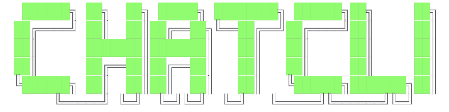

<p align="center">
  
</p>

<h1 align="center">ChatCLI Documentation</h1>

<p align="center">
  <strong>Documentação oficial do ChatCLI — sua CLI de IA para o terminal.</strong>
</p>

<p align="center">
  <a href="https://chatcli.edilsonfreitas.com"></a>
  <a href="https://github.com/diillson/chatcli"></a>
</p>

<p align="center">
  <a href="https://github.com/diillson/chatcli/releases"></a>
  <a href="https://github.com/diillson/chatcli/stargazers"></a>
  <a href="https://github.com/diillson/chatcli/issues"></a>
  <a href="https://github.com/diillson/chatcli"></a>
  <a href="https://github.com/diillson/chatcli/blob/main/LICENSE"></a>
  <a href="https://github.com/diillson/chatcli/actions"></a>
  <a href="https://github.com/diillson/chatcli/actions/workflows/security-scan.yml"></a>
  
  
</p>

---

## Sobre

Este repositório contém a **documentação oficial** do [ChatCLI](https://github.com/diillson/chatcli), construída com [Mintlify](https://mintlify.com) e publicada em **[chatcli.edilsonfreitas.com](https://chatcli.edilsonfreitas.com)**.

O ChatCLI é uma CLI open-source escrita em Go que conecta seu terminal a 7 provedores de IA (OpenAI, Anthropic, Google, xAI, Ollama, StackSpot e GitHub Copilot) com modos agente, coder, MCP, K8s operator e muito mais.

---

## Estrutura da Documentação

```
chatcli.ai/
├── introduction.mdx            # Página inicial
├── getting-started/            # Instalação e Docker
├── core-concepts/              # Uso básico, comandos @, agente, coder
├── features/                   # 20+ funcionalidades detalhadas
│   ├── IA e Agentes            # Tool Use, plugins, multi-agent, personas
│   ├── Coder                   # Plugin coder, segurança do coder
│   ├── Infraestrutura          # K8s watcher/operator, AIOps, server, remote
│   ├── Sessões e Contexto      # Sessões, contextos, bootstrap, memory
│   ├── Integrações             # Plugins, MCP, skills, OAuth, fallback
│   └── Avançado                # Non-interactive, migration, segurança, i18n
├── reference/                  # Comandos, env vars, configuração, modelos, arquitetura
├── cookbook/                    # 9 receitas práticas (agent, coder, pipelines, K8s...)
├── support/                    # Troubleshooting e contribuição
├── images/                     # Logo, favicon, demo GIF
└── mint.json                   # Configuração do Mintlify
```

| Métrica | Valor |
|:---|:---|
| Total de páginas | **47** |
| Categorias | **7** (Início, Primeiros Passos, Conceitos, Features, Referência, Cookbook, Suporte) |
| Receitas no Cookbook | **9** |
| Provedores documentados | **7** |
| Idioma | Português (pt-BR) |

---

## Desenvolvimento Local

### Pré-requisitos

- [Node.js](https://nodejs.org/) v18+
- [Mintlify CLI](https://www.npmjs.com/package/mintlify)

### Executar localmente

```bash
# Instalar a CLI do Mintlify
npm i -g mintlify

# Clonar o repositório
git clone https://github.com/diillson/chatcli.ai.git
cd chatcli.ai

# Iniciar servidor de desenvolvimento
mintlify dev
```

O site estará disponível em `http://localhost:3000`.

### Adicionar nova página

1. Crie o arquivo `.mdx` no diretório apropriado
2. Adicione o path em `mint.json` na seção `navigation`
3. Verifique localmente com `mintlify dev`

---

## Deploy

O deploy é **automático** via Mintlify. A cada push na branch `main`, o site é reconstruído e publicado em:

> **https://chatcli.edilsonfreitas.com**

A busca (search index) é atualizada automaticamente após cada deploy.

---

## Tecnologias

| Tech | Uso |
|:---|:---|
| [Mintlify](https://mintlify.com) | Framework de documentação |
| MDX | Markdown + JSX para componentes interativos |
| Tabs, Steps, Cards, Accordions | Componentes visuais do Mintlify |
| Busca instantânea | Indexação automática do Mintlify |

---

## Contribuindo

Contribuições são bem-vindas! Para melhorias na documentação:

1. Fork o repositório
2. Crie uma branch (`git checkout -b docs/minha-melhoria`)
3. Faça suas alterações
4. Teste com `mintlify dev`
5. Abra um Pull Request

Para contribuir com o **código do ChatCLI**, veja o [repositório principal](https://github.com/diillson/chatcli).

---

## Links

| | Link |
|:---|:---|
| Documentação | [chatcli.edilsonfreitas.com](https://chatcli.edilsonfreitas.com) |
| Código-fonte | [github.com/diillson/chatcli](https://github.com/diillson/chatcli) |
| Releases | [github.com/diillson/chatcli/releases](https://github.com/diillson/chatcli/releases) |
| Issues | [github.com/diillson/chatcli/issues](https://github.com/diillson/chatcli/issues) |

---

<p align="center">
  Feito com 💙 por <a href="https://github.com/diillson">Edilson Freitas</a>
</p>
