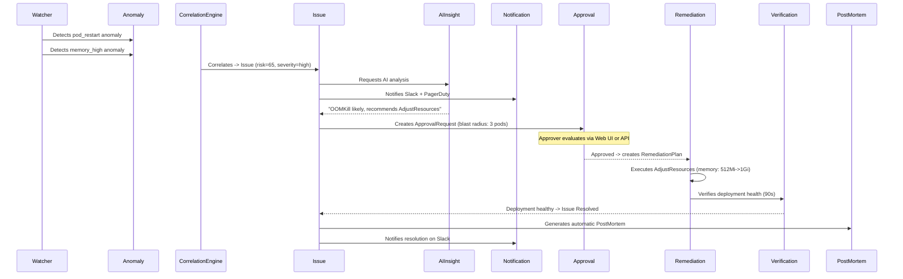

This cookbook shows the complete flow of a real incident on the ChatCLI AIOps platform -- from automatic detection to the post-mortem with lessons learned.


## Anatomy of an Incident




## Scenario: OOMKill in Production

### 1. Automatic Detection

The Watcher detects that `payment-service` pods are being OOMKilled:

```bash
# Check detected anomalies
kubectl get anomalies -n chatcli-system
```

```
NAME                           SOURCE    SIGNAL        CORRELATED   AGE
anom-payment-oom-1710856400    watcher   oom_kill      true         2m
anom-payment-mem-1710856410    watcher   memory_high   true         90s
```

### 2. Issue Created

The CorrelationEngine groups the anomalies into an Issue:

```bash
kubectl get issues -n chatcli-system
```

```
NAME                    SEVERITY   STATE       RISK   AGE
INC-20260319-001        high       Analyzing   65     90s
```

<Accordion title="View Issue details">
```bash
kubectl get issue INC-20260319-001 -o yaml -n chatcli-system
```

```yaml
spec:
  severity: high
  source: watcher
  signalType: oom_kill
  resource:
    kind: Deployment
    name: payment-service
    namespace: production
  description: "Correlated 2 anomalies: oom_kill, memory_high for Deployment/payment-service"
  riskScore: 65
  correlationId: "INC-20260319-001"
status:
  state: Analyzing
  detectedAt: "2026-03-19T15:20:00Z"
  remediationAttempts: 0
  maxRemediationAttempts: 5
```
</Accordion>

### 3. Notification Sent

Slack automatically receives:

&gt; **High Severity: OOM Kill Detected**
&gt;
&gt; | Severity | Resource | Namespace | State |
&gt; |----------|----------|-----------|-------|
&gt; | high | payment-service | production | Analyzing |
&gt;
&gt; Issue: INC-20260319-001 | 2026-03-19T15:20:00Z

### 4. AI Analyzes the Problem

```bash
kubectl get aiinsight INC-20260319-001-insight -o yaml -n chatcli-system
```

```yaml
status:
  analysis: |
    The payment-service deployment is suffering repeated OOMKill.
    Main container using 490Mi of 512Mi limit. Memory insufficient
    for load spikes. Revision 12 (current) introduced in-memory cache
    that increased base consumption by ~100Mi vs revision 11.
  confidence: 0.88
  recommendations:
    - "Increase memory limit to 1Gi and request to 768Mi"
    - "Consider rollback to revision 11 if the increase doesn't resolve it"
  suggestedActions:
    - name: "Increase memory"
      action: "AdjustResources"
      description: "Pod is OOMKilled, increase memory limit"
      params:
        memory_limit: "1Gi"
        memory_request: "768Mi"
```

### 5. Approval Required

The ApprovalPolicy requires approval for resource changes in production:

```bash
kubectl get approvalrequests -n chatcli-system
```

```
NAME                        ISSUE              PLAN                    STATE     RULE
INC-20260319-001-approval   INC-20260319-001   INC-20260319-001-plan   Pending   quorum-production
```

**Option A -- Approve via Web Dashboard:**

Go to `http://localhost:8090` -&gt; Approvals -&gt; Approve with reason.

**Option B -- Approve via REST API:**

```bash
curl -X POST http://localhost:8090/api/v1/approvals/INC-20260319-001-approval/approve \
  -H "X-API-Key: operator-key" \
  -H "Content-Type: application/json" \
  -d '{"approver": "edilson", "reason": "AI analysis confidence 0.88, OOM confirmed in logs"}'
```

**Option C -- Approve via kubectl:**

```bash
kubectl annotate approvalrequest INC-20260319-001-approval \
  -n chatcli-system \
  "platform.chatcli.io/approve=edilson:OOM confirmed"
```

### 6. Remediation Executed

After approval, the RemediationReconciler executes:

```bash
kubectl get remediationplans -n chatcli-system
```

```
NAME                       ISSUE              ATTEMPT   STATE       AGE
INC-20260319-001-plan-1    INC-20260319-001   1         Verifying   30s
```

The controller does:
1. **Captures structured `ResourceSnapshot`** (replicas, images, CPU/memory requests+limits, HPA min/max)
2. Creates `ActionCheckpoint` before each action
3. Applies `AdjustResources` (memory 512Mi -&gt; 1Gi)
4. Waits 90s verifying deployment health
5. `readyReplicas >= desired` -&gt; **Completed**

<Tip>
**Automatic protection:** If the action fails (e.g., invalid memory_limit), the operator automatically **restores the resource to the snapshot state** (replicas, images, resources). The plan transitions to `RolledBack` instead of `Failed`. If the verification expires (90s without health), the rollback is also executed. The `postFailureHealthy` field confirms whether the resource returned to normal. This ensures that a remediation never leaves the cluster in a worse state.
</Tip>

### 7. Issue Resolved

```bash
kubectl get issues -n chatcli-system
```

```
NAME                    SEVERITY   STATE      RISK   AGE
INC-20260319-001        high       Resolved   65     8m
```

- Slack receives resolution notification
- Pattern Store records: "oom_kill + Deployment + high -&gt; AdjustResources works"
- 10min dedup cooldown activated (configurable via `aiops.resolutionCooldownMinutes`)

### 8. Automatic PostMortem

```bash
kubectl get postmortems -n chatcli-system
```

```
NAME                    ISSUE              SEVERITY   STATE   AGE
pm-INC-20260319-001     INC-20260319-001   high       Open    5m
```

<Accordion title="View complete PostMortem">
```bash
kubectl get pm pm-INC-20260319-001 -o yaml -n chatcli-system
```

```yaml
status:
  state: Open
  summary: "Payment service pods OOMKilled due to insufficient memory limits after cache feature deployment"
  rootCause: "Revision 12 introduced in-memory cache increasing base memory by ~100Mi, exceeding 512Mi limit"
  impact: "Payment processing degraded for ~8 minutes, 3 pods affected"
  timeline:
    - timestamp: "2026-03-19T15:20:00Z"
      type: detected
      detail: "OOM kill detected on payment-service"
    - timestamp: "2026-03-19T15:20:10Z"
      type: analyzed
      detail: "AI analysis completed with 0.88 confidence"
    - timestamp: "2026-03-19T15:22:00Z"
      type: action_executed
      detail: "AdjustResources: memory_limit=1Gi, memory_request=768Mi"
    - timestamp: "2026-03-19T15:23:30Z"
      type: verified
      detail: "Deployment healthy: 3/3 replicas ready"
    - timestamp: "2026-03-19T15:23:30Z"
      type: resolved
      detail: "Remediation verified successfully"
  lessonsLearned:
    - "Memory limits should be reviewed after features that introduce caching"
    - "Monitor memory trends before deploys with architecture changes"
  preventionActions:
    - "Add memory capacity test to the CI/CD pipeline"
    - "Create memory usage SLO for payment-service"
  duration: "3m30s"
```
</Accordion>

### 9. Review and Close

```bash
# Via API
curl -X POST http://localhost:8090/api/v1/postmortems/pm-INC-20260319-001/review

# After team review
curl -X POST http://localhost:8090/api/v1/postmortems/pm-INC-20260319-001/close
```


## Day-to-Day Operations

### Monitor via CLI

```bash
# Active issues
kubectl get issues -A --sort-by='.metadata.creationTimestamp'

# SLO status
kubectl get slos -n chatcli-system

# Pending approvals
kubectl get approvalrequests -n chatcli-system --field-selector status.state=Pending

# Audit trail
kubectl get auditevents -n chatcli-system --sort-by='.spec.timestamp' | tail -20

# Chaos experiments
kubectl get chaos -n chatcli-system
```

### Monitor via API

```bash
# Dashboard summary
curl http://localhost:8090/api/v1/analytics/summary | jq

# Top problematic resources
curl http://localhost:8090/api/v1/analytics/top-resources | jq

# MTTR trend
curl "http://localhost:8090/api/v1/analytics/mttr?window=7d" | jq

# Compliance report (export for SIEM)
curl http://localhost:8090/api/v1/audit/export > audit-$(date +%Y%m%d).json
```

### Custom Runbooks

```yaml
apiVersion: platform.chatcli.io/v1alpha1
kind: Runbook
metadata:
  name: restart-on-memory-leak
  namespace: chatcli-system
spec:
  description: "Restart deployment when memory leak detected"
  trigger:
    signalType: memory_high
    severity: medium
    resourceKind: Deployment
  steps:
    - name: "Restart pods"
      action: RestartDeployment
      description: "Rolling restart to clear leaked memory"
  maxAttempts: 2
```


## Important Metrics

| Metric | What to Monitor | Alert When |
|--------|-----------------|------------|
| `chatcli_operator_active_issues` | Unresolved issues | &gt; 5 |
| `chatcli_operator_slo_error_budget_remaining` | Remaining SLO budget | &lt; 25% |
| `chatcli_operator_sla_compliance_percentage` | SLA compliance | &lt; 99% |
| `chatcli_operator_slo_burn_rate{window="1h"}` | Fast burn rate | &gt; 14.4x |
| `chatcli_operator_remediations_total{result="failed"}` | Failing remediations | &gt; 3/hour |
| `chatcli_operator_notifications_failed_total` | Failing notifications | &gt; 0 |
| `chatcli_operator_approvals_total{result="expired"}` | Expiring approvals | &gt; 0 |

<Tip>
Configure alerts in Prometheus/Grafana for these metrics. The pre-configured dashboards in `deploy/grafana/` already include panels for all of them.
</Tip>
