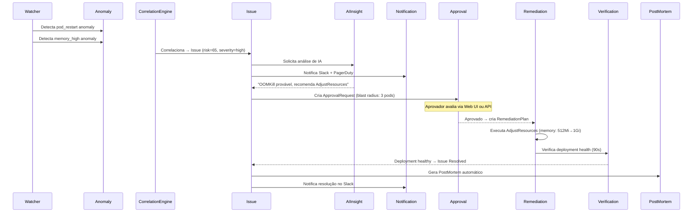

Este cookbook mostra o fluxo completo de um incidente real na plataforma AIOps do ChatCLI — desde a detecção automática até o post-mortem com lições aprendidas.

---

## Anatomia de um Incidente



---

## Cenário: OOMKill em Produção

### 1. Detecção Automática

O Watcher detecta que pods do `payment-service` estão sendo OOMKilled:

```bash
# Verificar anomalias detectadas
kubectl get anomalies -n chatcli-system
```

```
NAME                           SOURCE    SIGNAL        CORRELATED   AGE
anom-payment-oom-1710856400    watcher   oom_kill      true         2m
anom-payment-mem-1710856410    watcher   memory_high   true         90s
```

### 2. Issue Criada

O CorrelationEngine agrupa as anomalias em um Issue:

```bash
kubectl get issues -n chatcli-system
```

```
NAME                    SEVERITY   STATE       RISK   AGE
INC-20260319-001        high       Analyzing   65     90s
```

<Accordion title="Ver detalhes do Issue">
```bash
kubectl get issue INC-20260319-001 -o yaml -n chatcli-system
```

```yaml
spec:
  severity: high
  source: watcher
  signalType: oom_kill
  resource:
    kind: Deployment
    name: payment-service
    namespace: production
  description: "Correlated 2 anomalies: oom_kill, memory_high for Deployment/payment-service"
  riskScore: 65
  correlationId: "INC-20260319-001"
status:
  state: Analyzing
  detectedAt: "2026-03-19T15:20:00Z"
  remediationAttempts: 0
  maxRemediationAttempts: 3
```
</Accordion>

### 3. Notificação Enviada

O Slack recebe automaticamente:

> **High Severity: OOM Kill Detected**
>
> | Severity | Resource | Namespace | State |
> |----------|----------|-----------|-------|
> | high | payment-service | production | Analyzing |
>
> Issue: INC-20260319-001 | 2026-03-19T15:20:00Z

### 4. IA Analisa o Problema

```bash
kubectl get aiinsight INC-20260319-001-insight -o yaml -n chatcli-system
```

```yaml
status:
  analysis: |
    O deployment payment-service está sofrendo OOMKill repetido.
    Container principal usando 490Mi de 512Mi limit. Memória insuficiente
    para picos de carga. Revision 12 (atual) introduziu cache in-memory
    que aumentou o consumo base em ~100Mi vs revision 11.
  confidence: 0.88
  recommendations:
    - "Aumentar memory limit para 1Gi e request para 768Mi"
    - "Considerar rollback para revision 11 se o aumento não resolver"
  suggestedActions:
    - name: "Increase memory"
      action: "AdjustResources"
      description: "Pod está OOMKilled, aumentar memory limit"
      params:
        memory_limit: "1Gi"
        memory_request: "768Mi"
```

### 5. Aprovação Necessária

O ApprovalPolicy requer aprovação para mudanças de recursos em produção:

```bash
kubectl get approvalrequests -n chatcli-system
```

```
NAME                        ISSUE              PLAN                    STATE     RULE
INC-20260319-001-approval   INC-20260319-001   INC-20260319-001-plan   Pending   quorum-production
```

**Opção A — Aprovar via Web Dashboard:**

Acesse `http://localhost:8090` → Approvals → Approve com motivo.

**Opção B — Aprovar via REST API:**

```bash
curl -X POST http://localhost:8090/api/v1/approvals/INC-20260319-001-approval/approve \
  -H "X-API-Key: operator-key" \
  -H "Content-Type: application/json" \
  -d '{"approver": "edilson", "reason": "AI analysis confidence 0.88, OOM confirmed in logs"}'
```

**Opção C — Aprovar via kubectl:**

```bash
kubectl annotate approvalrequest INC-20260319-001-approval \
  -n chatcli-system \
  "platform.chatcli.io/approve=edilson:OOM confirmed"
```

### 6. Remediação Executada

Após aprovação, o RemediationReconciler executa:

```bash
kubectl get remediationplans -n chatcli-system
```

```
NAME                       ISSUE              ATTEMPT   STATE       AGE
INC-20260319-001-plan-1    INC-20260319-001   1         Verifying   30s
```

O controller faz:
1. Captura snapshot pre-flight
2. Aplica `AdjustResources` (memory 512Mi → 1Gi)
3. Aguarda 90s verificando deployment health
4. `readyReplicas >= desired` → **Completed**

### 7. Issue Resolvida

```bash
kubectl get issues -n chatcli-system
```

```
NAME                    SEVERITY   STATE      RISK   AGE
INC-20260319-001        high       Resolved   65     8m
```

- Slack recebe notificação de resolução
- Pattern Store registra: "oom_kill + Deployment + high → AdjustResources funciona"
- Dedup cooldown de 30min ativado

### 8. PostMortem Automático

```bash
kubectl get postmortems -n chatcli-system
```

```
NAME                    ISSUE              SEVERITY   STATE   AGE
pm-INC-20260319-001     INC-20260319-001   high       Open    5m
```

<Accordion title="Ver PostMortem completo">
```bash
kubectl get pm pm-INC-20260319-001 -o yaml -n chatcli-system
```

```yaml
status:
  state: Open
  summary: "Payment service pods OOMKilled due to insufficient memory limits after cache feature deployment"
  rootCause: "Revision 12 introduced in-memory cache increasing base memory by ~100Mi, exceeding 512Mi limit"
  impact: "Payment processing degraded for ~8 minutes, 3 pods affected"
  timeline:
    - timestamp: "2026-03-19T15:20:00Z"
      type: detected
      detail: "OOM kill detected on payment-service"
    - timestamp: "2026-03-19T15:20:10Z"
      type: analyzed
      detail: "AI analysis completed with 0.88 confidence"
    - timestamp: "2026-03-19T15:22:00Z"
      type: action_executed
      detail: "AdjustResources: memory_limit=1Gi, memory_request=768Mi"
    - timestamp: "2026-03-19T15:23:30Z"
      type: verified
      detail: "Deployment healthy: 3/3 replicas ready"
    - timestamp: "2026-03-19T15:23:30Z"
      type: resolved
      detail: "Remediation verified successfully"
  lessonsLearned:
    - "Memory limits devem ser revisados após features que introduzem caching"
    - "Monitorar trend de memória antes de deploys com mudanças de arquitetura"
  preventionActions:
    - "Adicionar memory capacity test no CI/CD pipeline"
    - "Criar SLO de memory usage para payment-service"
  duration: "3m30s"
```
</Accordion>

### 9. Revisar e Fechar

```bash
# Via API
curl -X POST http://localhost:8090/api/v1/postmortems/pm-INC-20260319-001/review

# Após revisão do time
curl -X POST http://localhost:8090/api/v1/postmortems/pm-INC-20260319-001/close
```

---

## Operações do Dia a Dia

### Monitorar via CLI

```bash
# Issues ativos
kubectl get issues -A --sort-by='.metadata.creationTimestamp'

# SLO status
kubectl get slos -n chatcli-system

# Aprovações pendentes
kubectl get approvalrequests -n chatcli-system --field-selector status.state=Pending

# Audit trail
kubectl get auditevents -n chatcli-system --sort-by='.spec.timestamp' | tail -20

# Chaos experiments
kubectl get chaos -n chatcli-system
```

### Monitorar via API

```bash
# Dashboard summary
curl http://localhost:8090/api/v1/analytics/summary | jq

# Top recursos problemáticos
curl http://localhost:8090/api/v1/analytics/top-resources | jq

# MTTR trend
curl "http://localhost:8090/api/v1/analytics/mttr?window=7d" | jq

# Compliance report (exportar para SIEM)
curl http://localhost:8090/api/v1/audit/export > audit-$(date +%Y%m%d).json
```

### Runbooks Customizados

```yaml
apiVersion: platform.chatcli.io/v1alpha1
kind: Runbook
metadata:
  name: restart-on-memory-leak
  namespace: chatcli-system
spec:
  description: "Restart deployment when memory leak detected"
  trigger:
    signalType: memory_high
    severity: medium
    resourceKind: Deployment
  steps:
    - name: "Restart pods"
      action: RestartDeployment
      description: "Rolling restart to clear leaked memory"
  maxAttempts: 2
```

---

## Métricas Importantes

| Métrica | O que Monitorar | Alerta Quando |
|---------|-----------------|---------------|
| `chatcli_operator_active_issues` | Issues não resolvidos | &gt; 5 |
| `chatcli_operator_slo_error_budget_remaining` | Budget SLO restante | &lt; 25% |
| `chatcli_operator_sla_compliance_percentage` | Compliance SLA | &lt; 99% |
| `chatcli_operator_slo_burn_rate{window="1h"}` | Burn rate rápido | &gt; 14.4x |
| `chatcli_operator_remediations_total{result="failed"}` | Remediações falhando | &gt; 3/hora |
| `chatcli_operator_notifications_failed_total` | Notificações falhando | &gt; 0 |
| `chatcli_operator_approvals_total{result="expired"}` | Aprovações expirando | &gt; 0 |

<Tip>
Configure alertas no Prometheus/Grafana para estas métricas. Os dashboards pré-configurados em `deploy/grafana/` já incluem painéis para todas elas.
</Tip>
