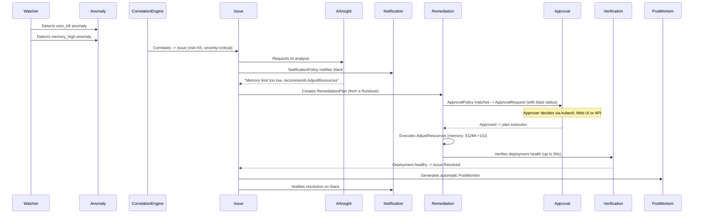

This cookbook shows the complete flow of an incident on the ChatCLI AIOps platform -- from automatic detection to the post-mortem with lessons learned. Names, timestamps and values below are illustrative; the object names follow the patterns the operator actually uses.

<Note>
  The walkthrough assumes an operator installed with the Helm chart in `chatcli-system`, one ready Instance with the watcher enabled (the AIOps pipeline talks to the first ready Instance in the cluster, so run one per cluster), an ApprovalPolicy that requires approval for this change, and a NotificationPolicy that routes the Issue to Slack. Anomalies, Issues, AIInsights, RemediationPlans, ApprovalRequests and PostMortems are created in the **workload's namespace** (`production` here), not in the operator namespace.
</Note>

## Anatomy of an Incident


```mermaid
sequenceDiagram
    participant W as Watcher
    participant A as Anomaly
    participant CE as CorrelationEngine
    participant I as Issue
    participant AI as AIInsight
    participant N as Notification
    participant R as Remediation
    participant AP as Approval
    participant V as Verification
    participant PM as PostMortem

    W->>A: Detects oom_kill anomaly
    W->>A: Detects memory_high anomaly
    CE->>I: Correlates -> Issue (risk=55, severity=critical)
    I->>AI: Requests AI analysis
    I->>N: NotificationPolicy notifies Slack
    AI-->>I: "Memory limit too low, recommends AdjustResources"
    I->>R: Creates RemediationPlan (from a Runbook)
    R->>AP: ApprovalPolicy matches -> ApprovalRequest (with blast radius)
    Note over AP: Approver decides via kubectl, Web UI or API
    AP-->>R: Approved -> plan executes
    R->>R: Executes AdjustResources (memory: 512Mi->1Gi)
    R->>V: Verifies deployment health (up to 90s)
    V-->>I: Deployment healthy -> Issue Resolved
    I->>PM: Generates automatic PostMortem
    I->>N: Notifies resolution on Slack
```


## Scenario: OOMKill in Production

### 1. Automatic Detection

The Watcher detects that `payment-service` pods are being OOMKilled:

```bash
# Check detected anomalies
kubectl get anomalies -n production
```

```
NAME                                            SOURCE    SIGNAL        CORRELATED   AGE
watcher-oomkilled-payment-service-1773933600    watcher   oom_kill      true         2m
watcher-memoryhigh-payment-service-1773933610   watcher   memory_high   true         110s
```

### 2. Issue Created

The CorrelationEngine groups the uncorrelated anomalies of the same resource from the last 10 minutes into one Issue. The risk score is the sum of the signal weights (`oom_kill` 40 + `memory_high` 15 = 55), and an Issue opened by an `oom_kill` anomaly is always `critical`:

```bash
kubectl get issues -n production
```

```
NAME                                  SEVERITY   STATE       RISK   AGE
payment-service-oom-kill-1773933601   critical   Analyzing   55     90s
```

<Accordion title="View Issue details">
```bash
kubectl get issue payment-service-oom-kill-1773933601 -o yaml -n production
```

```yaml
metadata:
  labels:
    platform.chatcli.io/inc-id: INC-20260319-001
    platform.chatcli.io/resource: payment-service
    platform.chatcli.io/signal: oom_kill
spec:
  severity: critical
  source: watcher
  signalType: oom_kill
  resource:
    kind: Deployment
    name: payment-service
    namespace: production
  description: "Auto-detected oom_kill anomaly: container app OOMKilled (value=container app OOMKilled, threshold=normal)"
  riskScore: 55
status:
  state: Analyzing
  detectedAt: "2026-03-19T15:20:01Z"
  remediationAttempts: 0
  maxRemediationAttempts: 5
```

The incident ID `INC-YYYYMMDD-NNN` is a label (a per-namespace, per-day sequence); the Issue name is `<resource>-<signal>-<unix time>`.
</Accordion>

### 3. Notification Sent

The NotificationReconciler matches the Issue against your NotificationPolicies and sends it to their channels (Slack, PagerDuty, Opsgenie, email, webhook or Teams). Channels, routing, throttling and escalation are covered in [Notifications](/features/aiops/notifications). Without a NotificationPolicy nothing is sent.

### 4. AI Analyzes the Problem

```bash
kubectl get aiinsight payment-service-oom-kill-1773933601-insight -o yaml -n production
```

```yaml
status:
  analysis: |
    The payment-service deployment is suffering repeated OOMKill.
    Main container using 490Mi of 512Mi limit. Memory insufficient
    for load spikes. Revision 12 (current) introduced in-memory cache
    that increased base consumption by ~100Mi vs revision 11.
  confidence: 0.88
  recommendations:
    - "Increase memory limit to 1Gi and request to 768Mi"
    - "Consider rollback to revision 11 if the increase doesn't resolve it"
  suggestedActions:
    - name: "Increase memory"
      action: "AdjustResources"
      description: "Pod is OOMKilled, increase memory limit"
      params:
        memory_limit: "1Gi"
        memory_request: "768Mi"
```

The IssueReconciler turns the suggested actions into a Runbook (`auto-oom-kill-critical-deployment-<hash>`) unless a matching Runbook already exists, and creates the RemediationPlan `payment-service-oom-kill-1773933601-plan-1`.

### 5. Approval Required

Before executing, the RemediationReconciler checks the ApprovalPolicies. Here a policy requires approval for resource changes in production, so the plan waits in `WaitingApproval`:

```bash
kubectl get approvalrequests -n production
```

```
NAME                                                  ISSUE                                 PLAN                                         STATE     RULE
approval-payment-service-oom-kill-1773933601-plan-1   payment-service-oom-kill-1773933601   payment-service-oom-kill-1773933601-plan-1   Pending   quorum-production
```

<Note>
  With no ApprovalPolicy matching, the plan could still be parked: by the [cluster tier](/features/aiops/federation) (when `CHATCLI_OPERATOR_CLUSTER_NAME` points at a ClusterRegistration whose tier requires it) or by the opt-in [decision engine](/features/aiops/decision-engine), which never runs a `critical` Issue unattended. Those requests use the synthetic policies `cluster-tier` and `decision-engine`: one approver, 30-minute timeout.
</Note>

**Option A -- Approve via kubectl:**

```bash
kubectl annotate approvalrequest approval-payment-service-oom-kill-1773933601-plan-1 \
  -n production \
  "platform.chatcli.io/approve=oncall-sre:OOM confirmed"
```

The value is `approver:reason`. The operator appends it to `status.decisions` and removes the annotation; a quorum rule needs one annotation per approver until `requiredApprovers` is reached. Use `platform.chatcli.io/reject` to reject.

**Option B -- Approve via Web Dashboard:**

Port-forward the operator Service (`kubectl -n chatcli-system port-forward svc/chatcli-operator 8090:8090`), open `http://localhost:8090`, enter an API key with the `operator` role, then Approvals, type your name, and Approve.

**Option C -- Approve via REST API:**

```bash
curl -X POST "http://localhost:8090/api/v1/approvals/approval-payment-service-oom-kill-1773933601-plan-1/approve?namespace=production" \
  -H "X-API-Key: $CHATCLI_API_KEY" \
  -H "Content-Type: application/json" \
  -d '{"approver": "oncall-sre", "reason": "AI analysis confidence 0.88, OOM confirmed in logs"}'
```

<Note>
  All three options record a decision in `status.decisions`; the operator then applies the rule (quorum, change window) and moves the request to `Approved` or `Rejected`. The dashboard and REST calls store the approver as `<name> (api-key: <identity>)` and count each API key once toward a quorum, so each approver needs their own key. A request that is no longer pending, or that the same key already decided, answers `409`.
</Note>

### 6. Remediation Executed

After approval, the RemediationReconciler executes:

```bash
kubectl get remediationplans -n production
```

```
NAME                                         ISSUE                                 ATTEMPT   STATE       AGE
payment-service-oom-kill-1773933601-plan-1   payment-service-oom-kill-1773933601   1         Verifying   30s
```

The controller does:
1. **Captures a structured `ResourceSnapshot`** (replicas, images, CPU/memory requests+limits, HPA min/max)
2. Creates an `ActionCheckpoint` before each action
3. Applies `AdjustResources` (memory 512Mi -> 1Gi)
4. Verifies deployment health for up to 90s
5. Healthy (`readyReplicas >= desired`) -> **Completed**

<Tip>
**Automatic protection:** If the action fails (e.g., invalid memory_limit), the operator automatically **restores the resource to the snapshot state** (replicas, images, resources). The plan transitions to `RolledBack` instead of `Failed`. If the verification expires (90s without health), the rollback is also executed. The `postFailureHealthy` field confirms whether the resource returned to normal. A failed or rolled-back plan sends the Issue back to AI re-analysis with the failure evidence, until `maxRemediationAttempts` is reached and the Issue escalates.
</Tip>

### 7. Issue Resolved

```bash
kubectl get issues -n production
```

```
NAME                                  SEVERITY   STATE      RISK   AGE
payment-service-oom-kill-1773933601   critical   Resolved   55     8m
```

- The NotificationPolicy sends the resolution to Slack
- The Pattern Store (ConfigMap `chatcli-pattern-store` in `production`) records a success for `oom_kill + Deployment + critical`
- The watcher dedup entries for the resource are cleared, and new anomalies on the same resource are suppressed for the resolution cooldown (10 minutes by default, Instance `spec.aiops.resolutionCooldownMinutes`; `0` turns it off)

### 8. Automatic PostMortem

Every completed plan produces a PostMortem named `pm-<issue>`:

```bash
kubectl get postmortems -n production
```

```
NAME                                     ISSUE                                 SEVERITY   STATE   AGE
pm-payment-service-oom-kill-1773933601   payment-service-oom-kill-1773933601   critical   Open    5m
```

<Accordion title="View complete PostMortem">
```bash
kubectl get pm pm-payment-service-oom-kill-1773933601 -o yaml -n production
```

```yaml
status:
  state: Open
  summary: "Payment service pods OOMKilled due to insufficient memory limits after cache feature deployment"
  rootCause: "Revision 12 introduced in-memory cache increasing base memory by ~100Mi, exceeding 512Mi limit"
  impact: "Payment processing degraded for ~8 minutes, 3 pods affected"
  timeline:
    - timestamp: "2026-03-19T15:20:01Z"
      type: detected
      detail: "Auto-detected oom_kill anomaly: container app OOMKilled (value=container app OOMKilled, threshold=normal)"
    - timestamp: "2026-03-19T15:22:00Z"
      type: action_executed
      detail: "AdjustResources: Action AdjustResources executed"
    - timestamp: "2026-03-19T15:23:31Z"
      type: resolved
      detail: "Remediation verified: Deployment production/payment-service is healthy"
  lessonsLearned:
    - "Memory limits should be reviewed after features that introduce caching"
    - "Monitor memory trends before deploys with architecture changes"
  preventionActions:
    - "Add memory capacity test to the CI/CD pipeline"
    - "Create memory usage SLO for payment-service"
  duration: "3m30s"
```

The timeline opens with a `detected` event (the Issue description), has one event per plan action, `action_executed` when it succeeded and `action_failed` when it failed (for agentic plans, a step whose observation failed) and closes with `resolved` (the plan result).
</Accordion>

### 9. Review and Close

Both endpoints need the `operator` role; the body (`reviewer`, `notes`) is optional. Pass the namespace: without `?namespace=` these PostMortem endpoints look in `default`.

```bash
# Mark as in review
curl -X POST "http://localhost:8090/api/v1/postmortems/pm-payment-service-oom-kill-1773933601/review?namespace=production" \
  -H "X-API-Key: $CHATCLI_API_KEY" \
  -H "Content-Type: application/json" \
  -d '{"reviewer": "oncall-sre", "notes": "Limits reviewed"}'

# After team review
curl -X POST "http://localhost:8090/api/v1/postmortems/pm-payment-service-oom-kill-1773933601/close?namespace=production" \
  -H "X-API-Key: $CHATCLI_API_KEY"
```

If the remediation only contained the problem (Issue `Contained`, PostMortem `requiresHumanAction: true`), acknowledge the follow-up first with `POST /api/v1/postmortems/{name}/ack-human-action`: a PostMortem closed without that acknowledgement is reverted to `Open`.


## Day-to-Day Operations

### Monitor via CLI

```bash
# Active issues
kubectl get issues -A --sort-by='.metadata.creationTimestamp'

# SLO status
kubectl get slo -A

# Pending approvals (custom-resource field selectors cannot filter on status)
kubectl get approvalrequests -A | grep Pending

# Audit trail
kubectl get auditevents -A --sort-by='.spec.timestamp' | tail -20

# Chaos experiments
kubectl get chaos -A
```

### Monitor via API

```bash
kubectl -n chatcli-system port-forward svc/chatcli-operator 8090:8090 &
export CHATCLI_API_KEY=<a key from the chatcli-operator-secrets Secret>

# Dashboard summary
curl -s -H "X-API-Key: $CHATCLI_API_KEY" http://localhost:8090/api/v1/analytics/summary | jq

# Top problematic resources
curl -s -H "X-API-Key: $CHATCLI_API_KEY" http://localhost:8090/api/v1/analytics/top-resources | jq

# MTTR per day over a window (from/to in RFC 3339)
curl -s -H "X-API-Key: $CHATCLI_API_KEY" \
  "http://localhost:8090/api/v1/analytics/mttr?from=2026-03-12T00:00:00Z&to=2026-03-19T00:00:00Z" | jq

# Audit export for a SIEM (JSON)
curl -s -H "X-API-Key: $CHATCLI_API_KEY" http://localhost:8090/api/v1/audit/export > audit-$(date +%Y%m%d).json
```

The REST API allows 600 requests per minute per valid API key (30 per minute per client host without one); scripts that poll should stay under that.

### Custom Runbooks

```yaml
apiVersion: platform.chatcli.io/v1alpha1
kind: Runbook
metadata:
  name: restart-on-memory-leak
  namespace: production
spec:
  description: "Restart deployment when memory leak detected"
  trigger:
    signalType: memory_high
    severity: medium
    resourceKind: Deployment
  steps:
    - name: "Restart pods"
      action: RestartDeployment
      description: "Rolling restart to clear leaked memory"
  maxAttempts: 2
```

Runbooks match on severity + resource kind (and signal type, preferred when it matches). The operator searches Runbooks in every namespace, so a Runbook applies to matching Issues cluster-wide.


## Important Metrics

| Metric | What to Monitor | Alert When |
|--------|-----------------|------------|
| `chatcli_operator_active_issues` | Unresolved issues | &gt; 5 |
| `chatcli_operator_slo_error_budget_remaining` | Remaining SLO budget (fraction 0–1) | &lt; 0.25 |
| `chatcli_operator_sla_compliance_percentage` | SLA compliance | &lt; 99 |
| `chatcli_operator_slo_burn_rate{window="1h"}` | Fast burn rate | &gt; 14.4 |
| `chatcli_operator_remediations_total{result="failed"}` | Failing remediation actions | &gt; 3/hour |
| `chatcli_operator_notifications_failed_total` | Failing notifications | &gt; 0 |
| `chatcli_operator_approvals_total{result="expired"}` | Expiring approvals | &gt; 0 |

<Tip>
Configure alerts in Prometheus/Grafana for these metrics. The dashboard JSON files in `deploy/grafana/` include panels for them; the `dashboards-configmap.yaml` there holds only the ServiceMonitors, and its header comment has the exact commands that build the ConfigMap from the four files (one `--from-file` per JSON file, then the `grafana_dashboard=1` label), or import the JSON files manually.
</Tip>
