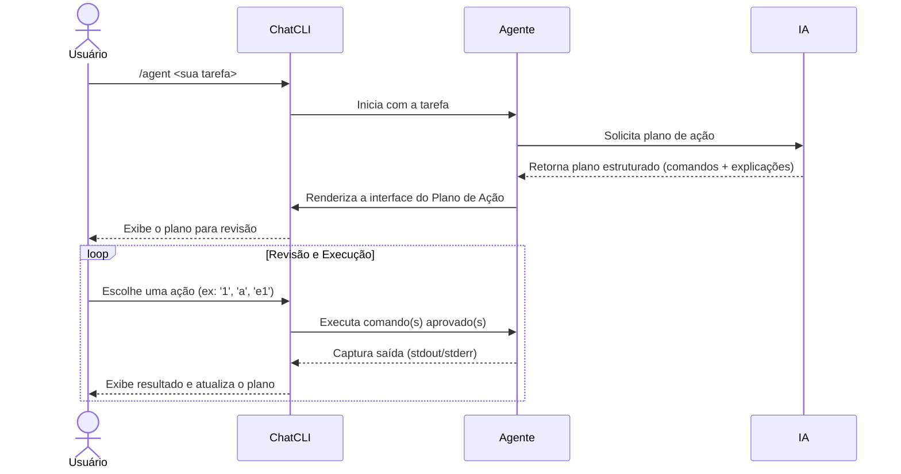

O Modo Agente transforma o **ChatCLI** de um assistente passivo em um **executor proativo**. Delegue uma tarefa completa, e a IA cria, apresenta e — com sua aprovação — executa um plano de ação.

---

## Como Iniciar

Use `/agent` ou `/run`, seguido da sua tarefa em linguagem natural:

```bash
/agent encontre todos os arquivos de log modificados nas últimas 24h e copie para 'logs_recentes'
```

A IA responderá com um **Plano de Ação**: uma lista de comandos estruturados para revisão.

---

## O Ciclo do Agente



---

## Como o Agente Funciona Internamente

O coração do modo agente é um **loop ReAct** (Reason + Act) implementado na função `processAIResponseAndAct()`. Esse loop permite que a IA raciocine sobre o problema, execute ações e use os resultados para decidir os próximos passos.

### O Loop ReAct

Cada turno do agente segue está sequência:

1. **Construção do histórico** — O histórico de conversa é montado com um _anchor reminder_ (lembrete de formato) anexado ao final. Esse anchor reforça para a IA o formato de resposta esperado, evitando que ela "esqueça" as instruções ao longo de conversas longas.
2. **Chamada ao LLM** — O histórico completo é enviado ao provedor de IA configurado.
3. **Parse da resposta** — A resposta é analisada para extrair raciocínio, explicações, chamadas de ferramentas e comandos.
4. **Execução das ações** — Ferramentas e comandos são executados com os devidos controles de segurança.
5. **Injeção de feedback** — O resultado da execução é injetado de volta no histórico como mensagem de contexto.
6. **Próximo turno** — O loop retorna ao passo 1, até que a IA conclua a tarefa ou o limite de turnos seja atingido.

O número máximo de turnos é configurável (padrão: **50**, máximo: **200**). Quando o limite é atingido, o agente encerra o loop e exibe o último estado ao usuário.

### Composição do System Prompt

O system prompt do agente é montado dinamicamente a partir de várias fontes:

- **Contexto do workspace** — Arquivos bootstrap como `SOUL.md`, `USER.md` e memória persistente
- **Descrição das ferramentas** — Lista completa dos plugins disponíveis e seus parâmetros
- **Persona ativa** — Se uma persona customizada estiver configurada, ela é incluída
- **Instruções de formato** — As `AgentFormatInstructions` que definem o formato esperado da resposta

<Info>
Os modos `/agent`, `/coder` e `/run` compartilham o mesmo loop ReAct. A diferença está apenas nas instruções de prompt — o `/coder` usa o `CoderSystemPrompt` que enfatiza edição de código, enquanto `/agent` usa instruções voltadas para execução de tarefas gerais.
</Info>

---

## Formato de Resposta da IA

A resposta do LLM é parseada para identificar múltiplos elementos estruturados. Cada tipo de bloco tem um comportamento diferente na interface:

| Elemento | Tag/Formato | Comportamento na UI |
| --- | --- | --- |
| **Raciocínio** | `<reasoning>...</reasoning>` | Exibido como card com icone de "cérebro" — pensamento interno da IA |
| **Explicação** | `<explanation>...</explanation>` | Exibido como card fixado — explicação voltada ao usuário |
| **Resumo final** | `<final_summary>...</final_summary>` | Resumo de encerramento da tarefa |
| **Chamada de ferramenta** | `<tool_call>...</tool_call>` | Invocação de plugin (file_edit, web_search, etc.) |
| **Multi-agente** | `<agent_call>...</agent_call>` | Despacha sub-tarefas para agentes paralelos (3+ tarefas independentes) |
| **Comando shell** | `` ```execute:shell `` ou `` ```bash `` | Bloco de comando para execução (formato legado) |
| **Texto livre** | Texto sem tags | Exibido como resposta de chat normal |

<Note>
O parser é **stateful** (não baseado em regex) para lidar corretamente com tags XML que contenham atributos entre aspas com caracteres especiais.
</Note>

---

## Cancelamento e Ctrl+C

O agente suporta cancelamento gracioso em qualquer ponto da execução:

- **Durante chamada ao LLM** — `Ctrl+C` cancela a requisição via `context.WithCancel()`. A resposta parcial recebida até aquele momento é descartada.
- **Verificação por turno** — No início de cada turno do loop ReAct, o agente verifica `context.Done()`. Se o contexto foi cancelado, o loop encerra imediatamente.
- **Tratamento de sinais** — `SIGINT` e `SIGTERM` são capturados pela função `runWithCancellation()`, que coordena o shutdown gracioso.
- **Fila type-ahead** — Mensagens digitadas pelo usuário durante o processamento da IA são enfileiradas e processadas assim que o turno atual terminar. Isso evita perda de input.

<Tip>
Se a IA estiver "travada" em um loop longo, pressione `Ctrl+C` uma vez para cancelar o turno atual. Você pode então reformular sua instrução.
</Tip>

---

## Histórico e Compactação

O agente gerencia automaticamente o tamanho do histórico de conversa para evitar estourar o limite de tokens do modelo.

### Estratégia de Compactação

Quando o histórico ultrapassa **60% do budget de tokens** do modelo, a compactação é ativada em 3 níveis progressivos:

1. **Trimming** — Mensagens de contexto injetadas (resultados de ferramentas, outputs de comandos) com mais de 3000 caracteres são truncadas, preservando início e fim.
2. **Sumarização** — Mensagens intermediárias são resumidas pela própria IA, mantendo os pontos-chave.
3. **Truncamento de emergência** — Se os níveis anteriores não forem suficientes, as mensagens mais antigas são removidas.

Em todos os níveis, as **8 mensagens mais recentes** são sempre preservadas para manter o contexto imediato.

### Checkpoint e /rewind

No início de cada interação do agente, um **checkpoint** do histórico é salvo. Isso permite usar `/rewind` (ou `Esc+Esc`) para retornar ao estado exato anterior à última ação do agente.

---

## Interface do Plano de Ação

Após o planejamento, você verá uma tela dedicada com duas visualizações (alterne com `p`):

<Tabs>
  <Tab title="Visão Compacta (Padrão)">
    Ideal para uma visão geral do fluxo, mostrando status e a primeira linha de cada comando.

    ```text
    PLANO (visao compacta)
      #1: Criar o diretorio de destino -- mkdir -p logs_recentes
      #2: Encontrar e copiar os arquivos -- find ~ -name "*.log" -mtime -1 -exec cp {} logs_recentes/ \;
    ```
  </Tab>
  <Tab title="Visão Completa">
    Fornece um "cartão" detalhado para cada comando: descrição, tipo, análise de risco e código completo.

    ```text
    COMANDO #2: Encontrar e copiar os arquivos
        Tipo:   shell
        Risco:  Seguro
        Status: Pendente
        Codigo:
          $ find ~ -name "*.log" -mtime -1 -exec cp {} logs_recentes/ \;
    ```
  </Tab>
</Tabs>

---

## Menu Interativo

O menu permite que você gerencie a execução com precisão:

| Ação | Descrição |
| --- | --- |
| `[N]` | **Executar Comando N** — executa um único passo do plano (ex: `1`) |
| `a` | **Executar Todos** — executa todos os comandos pendentes em sequência |
| `eN` | **Editar Comando N** — abre o comando em um editor para modificação |
| `tN` | **Testar (Dry-Run)** — simula a execução sem fazer alterações |
| `cN` | **Continuar de N** — envia a saída para a IA e pede próximos passos |
| `pcN` | **Contexto Pré-Execução** — adiciona informações para a IA refinar o comando |
| `acN` | **Contexto Pós-Execução** — envia a saída com um novo contexto |
| `vN` | **Ver Saída** — abre a saída completa em um pager (`less`) |
| `wN` | **Salvar Saída** — salva a saída do comando em um arquivo temporário |
| `p` | **Alternar Plano** — muda entre visão compacta e completa |
| `r` | **Redesenhar Tela** — limpa a tela |
| `q` | **Sair** — encerra o Modo Agente e retorna ao chat |

<Tip>
Use `tN` (testar) para verificar o que um comando fará. Se ok, execute com `N`. Se der errado, use `cN` para pedir à IA que corrija o plano.
</Tip>

---

## Segurança

<Warning>
Comandos perigosos (`rm -rf`, `sudo`, `mkfs`, `dd`) são bloqueados por padrão. O ChatCLI exigirá confirmação explícita antes de permitir sua execução.
</Warning>

Você sempre tem a palavra final. Nenhum comando é executado sem sua aprovação.

### Segurança do Modo Agente

O modo agente implementa múltiplas camadas de proteção para garantir execução segura de comandos.

#### Allowlist de Comandos (CHATCLI_AGENT_SECURITY_MODE)

O ChatCLI usa uma **allowlist de comandos** com mais de 150 comandos pré-aprovados, organizados em 8 categorias:

| Categoria | Exemplos |
|-----------|----------|
| **Operações de arquivo** | `ls`, `cp`, `mv`, `mkdir`, `find`, `stat` |
| **Processamento de texto** | `grep`, `sed`, `awk`, `sort`, `cut`, `jq` |
| **Desenvolvimento** | `git`, `go`, `npm`, `python`, `make`, `cargo` |
| **Containers** | `docker`, `kubectl`, `helm`, `podman` |
| **Rede** | `curl`, `wget`, `ping`, `dig`, `nslookup` |
| **Informações do sistema** | `ps`, `df`, `du`, `uname`, `whoami` |
| **Editores** | `vim`, `nano`, `code`, `emacs` |
| **Shell** | `echo`, `cat`, `head`, `tail`, `wc`, `tee` |

<Tabs>
  <Tab title="strict (padrão)">
    Apenas comandos na allowlist podem ser executados. Qualquer comando fora da lista é **bloqueado automaticamente**.

    ```bash
    export CHATCLI_AGENT_SECURITY_MODE=strict
    ```
  </Tab>
  <Tab title="permissive">
    A allowlist é aplicada primeiro. Comandos fora dela passam pela **denylist legada** (50+ padrões regex) como fallback.

    ```bash
    export CHATCLI_AGENT_SECURITY_MODE=permissive
    ```
  </Tab>
</Tabs>

Para adicionar comandos personalizados a allowlist:

```bash
# Adicionar terraform e ansible a allowlist
export CHATCLI_AGENT_ALLOWLIST="terraform;ansible;packer"
```

<Tip>
Se um comando legítimo for bloqueado no modo `strict`, adicione-o via `CHATCLI_AGENT_ALLOWLIST` em vez de mudar para o modo `permissive`.
</Tip>

**Exemplo: comando bloqueado e como permitir**

```bash
# O agente tenta executar "terraform plan" mas é bloqueado no modo strict
# Erro: "command 'terraform' is not in the allowed commands list"

# Solução: adicionar terraform a allowlist
export CHATCLI_AGENT_ALLOWLIST="terraform"
# Agora "terraform plan", "terraform apply", etc. funcionam
```

#### Proteção de Caminhos Sensíveis (CHATCLI_AGENT_WORKSPACE_STRICT)

Quando habilitado, o agente só pode **ler arquivos dentro do workspace atual**. Caminhos sensíveis são sempre bloqueados:

| Caminho | Motivo |
|---------|--------|
| `~/.ssh/` | Chaves SSH privadas |
| `~/.aws/` | Credenciais AWS |
| `~/.gcloud/` | Credenciais Google Cloud |
| `~/.kube/config` | Credenciais Kubernetes |
| `/etc/shadow` | Senhas do sistema |
| `*.pem`, `*.key` | Certificados e chaves privadas |

```bash
# Habilitar proteção de workspace
export CHATCLI_AGENT_WORKSPACE_STRICT=true

# Permitir acesso ao kubeconfig (para operações K8s)
export CHATCLI_AGENT_ALLOW_KUBECONFIG=true

# Permitir caminhos adicionais de leitura
export CHATCLI_AGENT_EXTRA_READ_PATHS="/opt/configs;/var/log/myapp"
```

#### Configuração de Shell (CHATCLI_AGENT_SOURCE_SHELL_CONFIG)

<Warning>
**Mudanca importante:** O source de arquivos de configuração do shell (`~/.bashrc`, `~/.zshrc`) agora é **opt-in**. Em versões anteriores, o source era feito implicitamente. Se seus comandos dependem de aliases ou funções do shell, habilite explicitamente.
</Warning>

```bash
# Habilitar source da configuração do shell (opt-in)
export CHATCLI_AGENT_SOURCE_SHELL_CONFIG=true
```

Quando habilitado, o ChatCLI valida:
- **Propriedade do arquivo** — O arquivo deve pertencer ao usuário atual
- **Tamanho do arquivo** — Limite de segurança para evitar source de arquivos muito grandes

#### Sanitização de Saída de Comandos

O ChatCLI protege contra **injeção de prompt** na saída de comandos:

- **Detecção de injeção de prompt** — Padrões suspeitos na saída (ex: instruções para a IA ignorar regras) são detectados e sanitizados antes de serem injetados no contexto
- **Limite de tamanho** — Saídas de comandos são truncadas para evitar consumo excessivo de tokens

```bash
# Configurar limite de saída de comandos (padrão: 50000 caracteres)
export CHATCLI_MAX_COMMAND_OUTPUT=100000
```

<Tip>
Para uma visão completa de todas as medidas de segurança, consulte a [documentação de Segurança e Hardening](/features/security).
</Tip>

---

## Histórico Unificado e Contexto

O modo agente compartilha o **mesmo histórico de conversa** que o chat e o coder. Isso significa que você pode:

- Iniciar uma conversa no chat, entrar no `/agent`, e a IA tera todo o contexto anterior
- Usar `/compact` para reduzir o histórico quando ficar grande
- Usar `/rewind` (ou Esc+Esc) para voltar a um ponto anterior da conversa

Alem disso, o agente recebe automaticamente o **contexto do workspace** (arquivos bootstrap como SOUL.md, USER.md, e memoria persistente) no system prompt.

---

## Configuração do Modo Agente

O comportamento do agente pode ser ajustado via variáveis de ambiente:

| Variável | Padrão | Descrição |
| --- | --- | --- |
| `CHATCLI_AGENT_PLUGIN_MAX_TURNS` | `50` | Número máximo de turnos do loop ReAct. Máximo permitido: **200**. |
| `CHATCLI_AGENT_CMD_TIMEOUT` | `10m` | Timeout para execução de comandos shell. Máximo: **1 hora**. |
| `CHATCLI_AGENT_PLUGIN_TIMEOUT` | `15m` | Timeout para execução de plugins (file_edit, web_search, etc.). |
| `CHATCLI_AGENT_DENYLIST` | _(vazio)_ | Padrões regex separados por `;` para bloquear comandos. Ex: `rm\s+-rf;curl.*\|.*sh` |
| `CHATCLI_AGENT_ALLOW_SUDO` | `false` | Se `true`, permite execução de comandos com `sudo`. |
| `CHATCLI_AGENT_PARALLEL_MODE` | `false` | Habilita despacho multi-agente via `<agent_call>` para tarefas paralelas. |

<CodeGroup>
```bash Exemplo: Limitar turnos e timeout
export CHATCLI_AGENT_PLUGIN_MAX_TURNS=100
export CHATCLI_AGENT_CMD_TIMEOUT=30m
```

```bash Exemplo: Bloquear padrões perigosos
export CHATCLI_AGENT_DENYLIST="rm\s+-rf\s+/;curl.*\|.*bash;wget.*\|.*sh"
```
</CodeGroup>

---

## One-Shot Mode (flag -p)

O modo one-shot permite execução **não-interativa** de uma única instrução, ideal para scripts e automação:

```bash
chatcli -p "liste todos os containers Docker parados"
```

### Como funciona

1. A instrução é enviada ao LLM como um único turno (sem loop ReAct).
2. Uma **animação de pensamento** é exibida enquanto a IA processa.
3. Se a flag `--auto-execute` estiver ativa, o primeiro bloco de comando da resposta é executado automaticamente — mas apenas após passar pela verificação de comandos perigosos.
4. O resultado é exibido e o processo encerra.

<Warning>
O one-shot com `--auto-execute` **não** pede confirmação para comandos seguros. Certifique-se de confiar na instrução antes de usar essa combinação em scripts.
</Warning>

---

## Próximos Passos

<CardGroup cols={2}>
  <Card title="Modo Coder" icon="code" href="/core-concepts/coder-mode">
    IA que lê, edita e testa código em loop automatizado.
  </Card>
  <Card title="Controle de Conversa" icon="clock-rotate-left" href="/features/conversation-control">
    Use /compact e /rewind para gerenciar o historico.
  </Card>
  <Card title="Gerenciamento de Sessões" icon="floppy-disk" href="/features/session-management">
    Salve e reutilize seu trabalho entre projetos.
  </Card>
</CardGroup>
