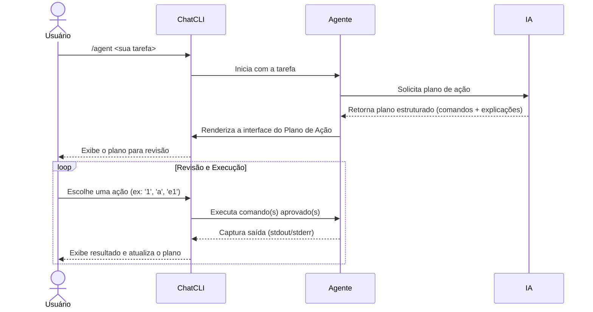

O Modo Agente transforma o **ChatCLI** de um assistente passivo em um **executor proativo**. Delegue uma tarefa completa, e a IA cria, apresenta e — com sua aprovação — executa um plano de ação.

---

## Como Iniciar

Use `/agent` ou `/run`, seguido da sua tarefa em linguagem natural:

```bash
/agent encontre todos os arquivos de log modificados nas últimas 24h e copie para 'logs_recentes'
```

A IA responderá com um **Plano de Ação**: uma lista de comandos estruturados para revisão.

---

## O Ciclo do Agente



---

## Interface do Plano de Ação

Após o planejamento, você verá uma tela dedicada com duas visualizações (alterne com `p`):

<Tabs>
  <Tab title="Visão Compacta (Padrão)">
    Ideal para uma visão geral do fluxo, mostrando status e a primeira linha de cada comando.

    ```text
    PLANO (visao compacta)
      #1: Criar o diretorio de destino -- mkdir -p logs_recentes
      #2: Encontrar e copiar os arquivos -- find ~ -name "*.log" -mtime -1 -exec cp {} logs_recentes/ \;
    ```
  </Tab>
  <Tab title="Visão Completa">
    Fornece um "cartão" detalhado para cada comando: descrição, tipo, análise de risco e código completo.

    ```text
    COMANDO #2: Encontrar e copiar os arquivos
        Tipo:   shell
        Risco:  Seguro
        Status: Pendente
        Codigo:
          $ find ~ -name "*.log" -mtime -1 -exec cp {} logs_recentes/ \;
    ```
  </Tab>
</Tabs>

---

## Menu Interativo

O menu permite que você gerencie a execução com precisão:

| Ação | Descrição |
| --- | --- |
| `[N]` | **Executar Comando N** — executa um único passo do plano (ex: `1`) |
| `a` | **Executar Todos** — executa todos os comandos pendentes em sequência |
| `eN` | **Editar Comando N** — abre o comando em um editor para modificação |
| `tN` | **Testar (Dry-Run)** — simula a execução sem fazer alterações |
| `cN` | **Continuar de N** — envia a saída para a IA e pede próximos passos |
| `pcN` | **Contexto Pré-Execução** — adiciona informações para a IA refinar o comando |
| `acN` | **Contexto Pós-Execução** — envia a saída com um novo contexto |
| `vN` | **Ver Saída** — abre a saída completa em um pager (`less`) |
| `wN` | **Salvar Saída** — salva a saída do comando em um arquivo temporário |
| `p` | **Alternar Plano** — muda entre visão compacta e completa |
| `r` | **Redesenhar Tela** — limpa a tela |
| `q` | **Sair** — encerra o Modo Agente e retorna ao chat |

<Tip>
Use `tN` (testar) para verificar o que um comando fará. Se ok, execute com `N`. Se der errado, use `cN` para pedir à IA que corrija o plano.
</Tip>

---

## Segurança

<Warning>
Comandos perigosos (`rm -rf`, `sudo`, `mkfs`, `dd`) são bloqueados por padrão. O ChatCLI exigirá confirmação explícita antes de permitir sua execução.
</Warning>

Você sempre tem a palavra final. Nenhum comando é executado sem sua aprovação.

---

## Historico Unificado e Contexto

O modo agente compartilha o **mesmo historico de conversa** que o chat e o coder. Isso significa que voce pode:

- Iniciar uma conversa no chat, entrar no `/agent`, e a IA tera todo o contexto anterior
- Usar `/compact` para reduzir o historico quando ficar grande
- Usar `/rewind` (ou Esc+Esc) para voltar a um ponto anterior da conversa

Alem disso, o agente recebe automaticamente o **contexto do workspace** (arquivos bootstrap como SOUL.md, USER.md, e memoria persistente) no system prompt.

---

## Próximos Passos

<CardGroup cols={2}>
  <Card title="Modo Coder" icon="code" href="/core-concepts/coder-mode">
    IA que lê, edita e testa código em loop automatizado.
  </Card>
  <Card title="Controle de Conversa" icon="clock-rotate-left" href="/features/conversation-control">
    Use /compact e /rewind para gerenciar o historico.
  </Card>
  <Card title="Gerenciamento de Sessões" icon="floppy-disk" href="/features/session-management">
    Salve e reutilize seu trabalho entre projetos.
  </Card>
</CardGroup>
