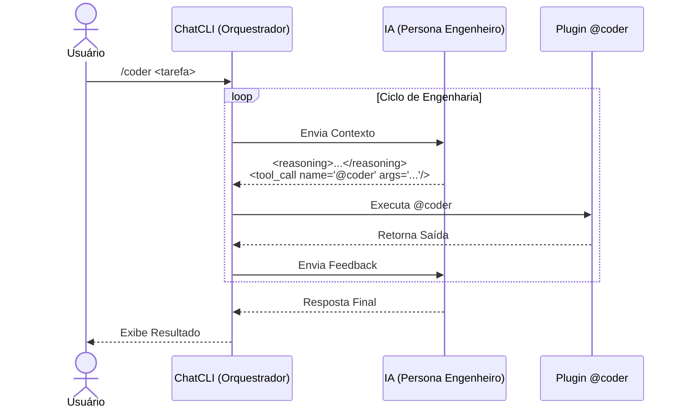

O modo `/coder` é especializado para tarefas de engenharia de software com ciclo de **leitura, alterações e feedback**.

Ele dá mais rigorosidade que o `/agent`, porque o assistente segue um contrato de saída para que o ChatCLI execute ações com segurança (e semântica de reversão).

---

## Quando usar

<CardGroup cols={2}>
  <Card title="Use /coder para..." icon="check">
    Alterações reais no repositório, rodar testes/lint/build automáticos, aplicar patches com rollback, iterar até resultado verificável.
  </Card>
  <Card title="Use /agent para..." icon="arrow-right">
    Conversas de alto nível, escrita de texto, ideias, planos — sem executar código diretamente.
  </Card>
</CardGroup>

---

## Fluxo de Engenharia

---

## Orquestração Multi-Agent

O `/coder` inclui orquestração multi-agent **ativada por padrão**. O LLM orquestrador despacha agents especialistas em paralelo:

| Agent | Função |
| --- | --- |
| **FileAgent** | Leitura e análise de código (read-only) |
| **CoderAgent** | Escrita e modificação de código |
| **ShellAgent** | Execução de comandos e testes |
| **GitAgent** | Operações de controle de versão |
| **SearchAgent** | Busca no codebase (read-only) |
| **PlannerAgent** | Raciocínio e decomposição de tarefas (sem tools) |
| **ReviewerAgent** | Revisão de código e qualidade (read-only) |
| **TesterAgent** | Geração de testes e cobertura |
| **RefactorAgent** | Transformações estruturais (rename, extract, move) |
| **DiagnosticsAgent** | Troubleshooting e investigação de erros |
| **FormatterAgent** | Formatação e estilo de código |
| **DepsAgent** | Gerenciamento e auditoria de dependências |
| **Agents Customizados** | Personas de `~/.chatcli/agents/` registrados automaticamente |

Cada agent possui skills próprias e executa em seu mini ReAct loop isolado. Múltiplos agents rodam simultaneamente via goroutines com semáforo configurável (`CHATCLI_AGENT_MAX_WORKERS`).

<Info>
Desative com `CHATCLI_AGENT_PARALLEL_MODE=false` se necessário. Veja a [documentação completa](/features/multi-agent-orchestration).
</Info>

---

## Contrato de Saída

O formato de resposta do assistente no `/coder` é obrigatório:

<Steps>
  <Step title="Reasoning">
    Antes de qualquer ação, o assistente escreve um bloco `reasoning` curto (2 a 6 linhas).
  </Step>
  <Step title="Tool Call">
    Se precisar agir, emite um `tool_call name="@coder" args="..."` com JSON nos args.
  </Step>
  <Step title="Sem comandos diretos">
    Nunca usa blocos de código ou comandos shell diretos — tudo passa pelo `@coder`.
  </Step>
</Steps>

---

## Ferramentas e Dependência

O modo `/coder` utiliza o plugin [@coder](/features/coder-plugin), que já vem **embutido no ChatCLI** — nenhuma instalação adicional necessária.

<Tip>
Verifique com `/plugin list` — o `@coder` aparece com a tag `[builtin]`.
</Tip>

---

## Subcomandos Suportados

| Subcomando | Descrição |
| --- | --- |
| `tree --dir .` | Listar árvore de diretórios |
| `search --term "x" --dir .` | Buscar no codebase |
| `read --file x` | Ler arquivo |
| `write --file x --content "..." --encoding base64` | Escrever arquivo |
| `patch --file x --search "..." --replace "..."` | Aplicar patch |
| `patch --diff "..." --diff-encoding base64` | Aplicar unified diff |
| `exec --cmd "comando"` | Executar comando |
| `git-status --dir .` | Status do Git |
| `git-diff --dir .` | Diff do Git |
| `git-log --dir .` | Log do Git |
| `git-changed --dir .` | Arquivos alterados |
| `git-branch --dir .` | Branch atual |
| `test --dir .` | Rodar testes |
| `rollback --file x` | Reverter alteração |
| `clean --dir .` | Limpar backups |

---

## Exemplo de Fluxo

<Steps>
  <Step title="Listar a árvore">
    `tree --dir .`
  </Step>
  <Step title="Buscar ocorrências">
    `search --term "FAIL" --dir .`
  </Step>
  <Step title="Ler arquivos relevantes">
    `read --file cli/agent_mode.go`
  </Step>
  <Step title="Aplicar patch">
    `patch --file cli/agent_mode.go --search "..." --replace "..."`
  </Step>
  <Step title="Rodar testes">
    `exec --cmd "go test ./..."`
  </Step>
</Steps>

---

## Paralelizacao de Operacoes

O `/coder` maximiza paralelismo emitindo **multiplos tool_calls em uma unica resposta** quando as operacoes sao independentes. Por exemplo, ao precisar ler 3 arquivos, a IA emite 3 `tool_call` tags de uma vez em vez de uma por turno.

Para tarefas complexas com 3+ operacoes independentes, a IA usa `<agent_call>` para despachar agents especializados em paralelo via goroutines.

<Tip>
Se perceber que a IA esta fazendo operacoes sequenciais que poderiam ser paralelas, lembre-a: "emita todos os tool_calls independentes em uma unica resposta".
</Tip>

---

## FAQ

<AccordionGroup>
  <Accordion title="Posso usar JSON em args?">
    Sim, é o formato recomendado:

    `tool_call name="@coder" args='{"cmd":"read","args":{"file":"main.go"}}'`
  </Accordion>
  <Accordion title="Quando usar patch --diff?">
    Quando a alteração envolve múltiplos trechos ou precisa de mais precisão. Aceita unified diff em `text` ou `base64`.
  </Accordion>
  <Accordion title="Preciso instalar o @coder separadamente?">
    Não. O `@coder` é um plugin **builtin** — já vem embutido no binário. Se instalar uma versão customizada em `~/.chatcli/plugins/`, ela prevalece sobre o builtin.
  </Accordion>
  <Accordion title="exec é seguro?">
    O `@coder exec` bloqueia padrões perigosos por padrão. Para comandos sensíveis, prefira usar os subcomandos Git e `test`.
  </Accordion>
  <Accordion title="Existe limite de leitura?">
    Sim. Use `read --max-bytes`, `--head` ou `--tail` para controlar o tamanho da saída.
  </Accordion>
</AccordionGroup>
