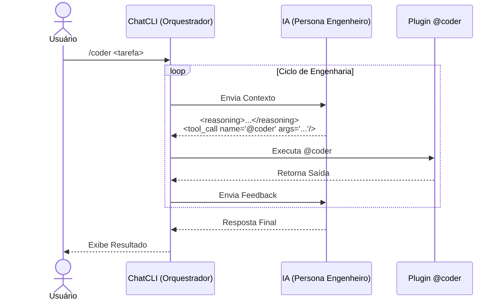

O modo `/coder` é especializado para tarefas de engenharia de software com ciclo de **leitura, alterações e feedback**.

Ele dá mais rigorosidade que o `/agent`, porque o assistente segue um contrato de saída para que o ChatCLI execute ações com segurança (e semântica de reversão).

---

## Quando usar

<CardGroup cols={2}>
  <Card title="Use /coder para..." icon="check">
    Alterações reais no repositório, rodar testes/lint/build automáticos, aplicar patches com rollback, iterar até resultado verificável.
  </Card>
  <Card title="Use /agent para..." icon="arrow-right">
    Conversas de alto nível, escrita de texto, ideias, planos — sem executar código diretamente.
  </Card>
</CardGroup>

---

## Fluxo de Engenharia



---

## Orquestração Multi-Agent

O `/coder` inclui orquestração multi-agent **ativada por padrão**. O LLM orquestrador despacha agents especialistas em paralelo:

| Agent | Função |
| --- | --- |
| **FileAgent** | Leitura e análise de código (read-only) |
| **CoderAgent** | Escrita e modificação de código |
| **ShellAgent** | Execução de comandos e testes |
| **GitAgent** | Operações de controle de versão |
| **SearchAgent** | Busca no codebase (read-only) |
| **PlannerAgent** | Raciocínio e decomposição de tarefas (sem tools) |
| **ReviewerAgent** | Revisão de código e qualidade (read-only) |
| **TesterAgent** | Geração de testes e cobertura |
| **RefactorAgent** | Transformações estruturais (rename, extract, move) |
| **DiagnosticsAgent** | Troubleshooting e investigação de erros |
| **FormatterAgent** | Formatação e estilo de código |
| **DepsAgent** | Gerenciamento e auditoria de dependências |
| **Agents Customizados** | Personas de `~/.chatcli/agents/` registrados automaticamente |

Cada agent possui skills próprias e executa em seu mini ReAct loop isolado. Múltiplos agents rodam simultaneamente via goroutines com semáforo configurável (`CHATCLI_AGENT_MAX_WORKERS`).

<Info>
Desative com `CHATCLI_AGENT_PARALLEL_MODE=false` se necessário. Veja a [documentação completa](/features/multi-agent-orchestration).
</Info>

---

## Contrato de Saída

O formato de resposta do assistente no `/coder` é obrigatório:

<Steps>
  <Step title="Reasoning">
    Antes de qualquer ação, o assistente escreve um bloco `reasoning` curto (2 a 6 linhas).
  </Step>
  <Step title="Tool Call">
    Se precisar agir, emite um `tool_call name="@coder" args="..."` com JSON nos args.
  </Step>
  <Step title="Sem comandos diretos">
    Nunca usa blocos de código ou comandos shell diretos — tudo passa pelo `@coder`.
  </Step>
</Steps>

### Validação e Enforcement do Contrato

Quando a IA viola o contrato de saída, o ChatCLI detecta automaticamente e injeta uma mensagem de feedback de correção de formato. O turno é reprocessado até que o formato esteja correto. As regras de enforcement são:

| Violação Detectada | Feedback Injetado |
| --- | --- |
| `tool_call` usa uma tool **diferente** de `@coder` | Erro de formato — apenas `@coder` é permitido no modo `/coder` |
| `tool_call` ausente mas blocos de código presentes | "Blocos de código não são permitidos, use `@coder`" |
| `<reasoning>` ausente antes de `tool_call` | "Reasoning obrigatório antes de qualquer tool_call" |
| Comandos shell soltos detectados (ex: `$ go test`) | "Use `@coder exec`, não comandos diretos" |

<Warning>
Se a IA insistir em violar o contrato após múltiplas tentativas, o ChatCLI aborta o turno e exibe um aviso ao usuário. Isso raramente acontece com modelos modernos.
</Warning>

Internamente, a validação ocorre em `agent_coder_validation.go` — um módulo dedicado que inspeciona cada resposta da IA antes de executar qualquer tool_call. A sequência é:

1. **Parse** da resposta — extrai `<reasoning>`, `<tool_call>`, blocos de código e texto solto
2. **Checagem de reasoning** — se `<tool_call>` existe mas `<reasoning>` não, rejeita
3. **Checagem de tool name** — se o `name` do `tool_call` não é `@coder`, rejeita
4. **Checagem de code blocks** — se há blocos de código (` ``` `) na resposta, rejeita
5. **Checagem de shell patterns** — detecta padrões como `$ cmd`, `> cmd`, `run: cmd`
6. Se qualquer checagem falha, injeta feedback e **retenta o turno** (até 3 tentativas)

---

## Diferença Interna entre /coder e /agent

Ambos os modos usam o **mesmo loop ReAct** (`processAIResponseAndAct`). A diferença está na configuração, não na arquitetura:

| Aspecto | `/coder` | `/agent` |
| --- | --- | --- |
| **System Prompt** | `CoderSystemPrompt` (completo) ou `CoderFormatInstructions` (quando persona ativa) | `AgentFormatInstructions` |
| **Formato de saída** | Estrito: `<reasoning>` + `<tool_call name="@coder">` apenas | Flexível: qualquer tool, blocos `execute`, texto livre |
| **Validação** | Ativa (`isCoderMode=true`) — rejeita violações | Desativada — aceita qualquer formato válido |
| **Contexto de tools** | Compacto: apenas flags obrigatórias, 1-2 exemplos por subcomando | Completo: todas as flags, múltiplos exemplos |
| **Histórico** | Compartilhado (unified history) | Compartilhado (unified history) |
| **Multi-agent** | Suporta `<agent_call>` | Suporta `<agent_call>` |
| **Anchor de formato** | Lembrete de `<reasoning>` + `@coder` a cada turno | Lembrete de `tool_call` e `execute` a cada turno |

<Info>
Na prática, `/coder` é o `/agent` com **guardrails adicionais**. Se você mudar de `/agent` para `/coder` no meio da conversa, o histórico é mantido — apenas as regras de validação e o system prompt mudam.
</Info>

O flag `isCoderMode` é o que ativa todas as diferenças. Quando `true`:
- O validador de contrato é executado em cada resposta
- O contexto de tools é reduzido para economizar tokens
- O anchor de formato é específico para `@coder`
- O system prompt inclui regras de base64 encoding

---

## Task Tracker e Progresso

Quando a IA inclui um bloco `<reasoning>` com tarefas numeradas (ex: "1. Ler arquivos\n2. Aplicar patch\n3. Rodar testes"), o **TaskTracker** faz o parse automaticamente e cria um `TaskPlan`:

### Como funciona

1. **Parse**: Cada linha numerada vira uma `Task` com status inicial `Pending`
2. **Tracking**: Conforme tool_calls são executados, o status da tarefa atual é atualizado
3. **Renderização**: O progresso aparece abaixo do reasoning como linhas compactas de status

### Status de cada tarefa

| Status | Significado |
| --- | --- |
| `Pending` | Aguardando execução |
| `InProgress` | Sendo executada no turno atual |
| `Completed` | Tool_call executado com sucesso |
| `Failed` | Tool_call retornou erro |

### Replanejamento automático

Se **3 ou mais tarefas falham** consecutivamente, o TaskTracker sinaliza `NeedsReplan = true`. O ChatCLI então injeta uma mensagem de sistema pedindo à IA para **reformular seu plano** antes de continuar.

O TaskTracker também calcula uma **assinatura (hash)** do plano. Se a IA mudar seu plano entre turnos (ex: adicionar ou remover tarefas), o tracker detecta a mudança e reinicia o tracking com o novo plano.

<Tip>
O TaskTracker é puramente informativo para o usuário — ele não bloqueia a execução. Mesmo que o progresso mostre "Failed", a IA pode decidir ignorar o erro e continuar.
</Tip>

---

## Requisitos de Codificação Base64

Para operações de escrita e patch, o system prompt do `/coder` exige codificação base64:

### Por que base64?

Conteúdo de código frequentemente contém caracteres que conflitam com o formato JSON dos args:
- Aspas duplas e simples
- Quebras de linha
- Barras invertidas (escapes)
- Indentação com tabs vs. espaços

Quando a IA tenta enviar código como texto puro em JSON, o parse falha ou o conteúdo é corrompido. Base64 elimina esse problema completamente.

### Regras de encoding

| Operação | Regra |
| --- | --- |
| `write --content` | **Obrigatório**: conteúdo deve ser base64, com `--encoding base64` |
| `patch --search / --replace` | **Recomendado** para conteúdo multiline: usar base64 |
| `patch --diff` | Usar `--diff-encoding base64` para diffs em base64 |
| `read`, `search`, `tree` | Não se aplica (saída é sempre texto) |

### Flag `--encoding`

A flag `--encoding` controla a interpretação do conteúdo:
- `text` (padrão): conteúdo é interpretado como texto literal
- `base64`: conteúdo é decodificado de base64 antes de ser escrito

```
# Exemplo: escrita com base64
@coder write --file main.go --content "cGFja2FnZSBtYWluCg==" --encoding base64

# Exemplo: patch com diff em base64
@coder patch --diff "LS0tIGEvbWFpbi5nbw..." --diff-encoding base64
```

---

## Composição do System Prompt no /coder

O system prompt é montado em camadas, na seguinte ordem:

<Steps>
  <Step title="Camada 1: Persona ou CoderSystemPrompt">
    Se uma **persona customizada** está ativa (ex: `--persona senior-go`), o prompt da persona é usado como base. Caso contrário, o `CoderSystemPrompt` padrão é utilizado.
  </Step>
  <Step title="Camada 2: CoderFormatInstructions">
    Quando uma persona está ativa, as `CoderFormatInstructions` são **anexadas** ao prompt da persona. Isso garante que a persona respeite o contrato de saída do `/coder`. Quando não há persona, as instruções já estão embutidas no `CoderSystemPrompt`.
  </Step>
  <Step title="Camada 3: Contexto do Workspace">
    Arquivos de contexto do projeto são injetados via `contextBuilder`:
    - `SOUL.md` — personalidade e diretrizes globais
    - `USER.md` — preferências do usuário
    - `RULES.md` — regras específicas do projeto
  </Step>
  <Step title="Camada 4: Contexto de Tools">
    O schema compacto do `@coder` é incluído: lista de subcomandos, flags obrigatórias e 1-2 exemplos por subcomando. No modo `/coder`, esse contexto é **reduzido** comparado ao `/agent` para economizar tokens.
  </Step>
  <Step title="Camada 5: Prompt do Orquestrador Multi-Agent">
    Se o modo paralelo está ativo (`CHATCLI_AGENT_PARALLEL_MODE=true`), o prompt do orquestrador multi-agent é anexado com a lista de agents disponíveis e instruções de despacho.
  </Step>
</Steps>

---

## Anchor de Formato (Lembrete Per-Turn)

A cada turno do loop ReAct, um **lembrete curto de formato** é anexado ao histórico de mensagens. Isso evita que a IA "esqueça" as regras de formato em conversas longas.

### No modo /coder

O anchor lembra:
- Formato obrigatório: `<reasoning>` seguido de `<tool_call name="@coder">`
- Proibição de blocos de código e comandos diretos
- Exigência de base64 para escrita de arquivos

### No modo /agent

O anchor lembra:
- Formato de `tool_call` e blocos `execute`
- Ferramentas disponíveis no turno atual

<Info>
O anchor é uma técnica de **prompt engineering** para manter aderência ao formato. Sem ele, modelos tendem a "derivar" para texto livre após 10-15 turnos de conversa. O anchor é curto (3-5 linhas) para não consumir tokens excessivos.
</Info>

---

## Ferramentas e Dependência

O modo `/coder` utiliza o plugin [@coder](/features/coder-plugin), que já vem **embutido no ChatCLI** — nenhuma instalação adicional necessária.

<Tip>
Verifique com `/plugin list` — o `@coder` aparece com a tag `[builtin]`.
</Tip>

---

## Subcomandos Suportados

| Subcomando | Descrição |
| --- | --- |
| `tree --dir .` | Listar árvore de diretórios |
| `search --term "x" --dir .` | Buscar no codebase |
| `read --file x` | Ler arquivo |
| `write --file x --content "..." --encoding base64` | Escrever arquivo |
| `patch --file x --search "..." --replace "..."` | Aplicar patch |
| `patch --diff "..." --diff-encoding base64` | Aplicar unified diff |
| `exec --cmd "comando"` | Executar comando |
| `git-status --dir .` | Status do Git |
| `git-diff --dir .` | Diff do Git |
| `git-log --dir .` | Log do Git |
| `git-changed --dir .` | Arquivos alterados |
| `git-branch --dir .` | Branch atual |
| `test --dir .` | Rodar testes |
| `rollback --file x` | Reverter alteração |
| `clean --dir .` | Limpar backups |

---

## Exemplo de Fluxo

<Steps>
  <Step title="Listar a árvore">
    `tree --dir .`
  </Step>
  <Step title="Buscar ocorrências">
    `search --term "FAIL" --dir .`
  </Step>
  <Step title="Ler arquivos relevantes">
    `read --file cli/agent_mode.go`
  </Step>
  <Step title="Aplicar patch">
    `patch --file cli/agent_mode.go --search "..." --replace "..."`
  </Step>
  <Step title="Rodar testes">
    `exec --cmd "go test ./..."`
  </Step>
</Steps>

---

## Paralelização de Operações

O `/coder` maximiza paralelismo emitindo **múltiplos tool_calls em uma única resposta** quando as operações são independentes. Por exemplo, ao precisar ler 3 arquivos, a IA emite 3 `tool_call` tags de uma vez em vez de uma por turno.

Para tarefas complexas com 3+ operações independentes, a IA usa `<agent_call>` para despachar agents especializados em paralelo via goroutines.

<Tip>
Se perceber que a IA está fazendo operações sequenciais que poderiam ser paralelas, lembre-a: "emita todos os tool_calls independentes em uma única resposta".
</Tip>

---

## Interação com o Usuário (Ask When Needed)

Nem sempre a IA tem todas as informações necessárias para executar uma tarefa. Quando precisa de dados que só o usuário pode fornecer (banco de dados, framework, credenciais, escolha entre opções), a IA **pergunta diretamente** em vez de adivinhar.

### Como funciona

Quando a IA responde **sem emitir nenhum `tool_call`** (apenas texto com a pergunta), o ChatCLI detecta isso e:

1. Exibe a pergunta da IA normalmente
2. Mostra o prompt `⏳ Aguardando sua resposta...` em vez de encerrar a sessão
3. Aguarda o usuário digitar a resposta
4. Adiciona a resposta ao histórico e **continua o ciclo ReAct**

```text
╭── 💬 RESPOSTA
│  Preciso de informações antes de prosseguir:
│  1. Qual banco de dados? (PostgreSQL, MySQL, SQLite)
│  2. Qual biblioteca? (pgx, GORM, sqlx)
│  3. Host e porta do banco?
╰──────────────────────────────────────────────────

  ⏳ Aguardando sua resposta (--- para multilinha, 'sair' para encerrar): PostgreSQL, pgx, localhost:5432
```

A IA recebe a resposta e continua com `<reasoning>` + `<tool_call>` normalmente.

### Respostas multilinha

Se a resposta for complexa, use o [modo multilinha](/features/multiline-input) com `---`:

```text
  ⏳ Aguardando sua resposta: ---
  📝 Modo multilinha — digite --- em uma nova linha para finalizar
  ... [1] PostgreSQL na porta 5432
  ... [2] Host: db.internal
  ... [3] Usar pgx como driver
  ... [4] Schema: public
  ... [5] ---
```

### Sair da sessão

Para encerrar a sessão quando a IA está aguardando, digite:
- `exit`, `quit` ou `sair`
- Ou pressione `Ctrl+C`

<Info>
Esta funcionalidade é habilitada pela regra **"ASK WHEN NEEDED"** no system prompt do `/coder`. A IA é instruída a não emitir tool_calls quando precisa de informações do usuário, e sim fazer a pergunta diretamente. Isso garante que o ChatCLI detecte a pergunta e aguarde a resposta.
</Info>

---

## FAQ

<AccordionGroup>
  <Accordion title="Posso usar JSON em args?">
    Sim, é o formato recomendado:

    `tool_call name="@coder" args='{"cmd":"read","args":{"file":"main.go"}}'`
  </Accordion>
  <Accordion title="Quando usar patch --diff?">
    Quando a alteração envolve múltiplos trechos ou precisa de mais precisão. Aceita unified diff em `text` ou `base64`.
  </Accordion>
  <Accordion title="Preciso instalar o @coder separadamente?">
    Não. O `@coder` é um plugin **builtin** — já vem embutido no binário. Se instalar uma versão customizada em `~/.chatcli/plugins/`, ela prevalece sobre o builtin.
  </Accordion>
  <Accordion title="exec é seguro?">
    O `@coder exec` bloqueia padrões perigosos por padrão. Para comandos sensíveis, prefira usar os subcomandos Git e `test`.
  </Accordion>
  <Accordion title="Existe limite de leitura?">
    Sim. Use `read --max-bytes`, `--head` ou `--tail` para controlar o tamanho da saída.
  </Accordion>
  <Accordion title="Como o /coder lida com erros de formato da IA?">
    O ChatCLI válida **cada resposta** da IA contra o contrato de saída. Se uma violação é detectada (ex: bloco de código direto, tool errada, reasoning ausente), uma mensagem de feedback de correção é injetada no histórico e o turno é reprocessado. A IA recebe até 3 tentativas para corrigir o formato. Na prática, modelos modernos acertam no primeiro ou segundo turno.
  </Accordion>
  <Accordion title="Posso usar /coder com uma persona customizada?">
    Sim. Quando uma persona está ativa (ex: `--persona senior-go`), o prompt da persona é usado como base e as `CoderFormatInstructions` são **automaticamente anexadas**. Isso garante que a persona respeite o contrato de saída do `/coder` sem perder sua personalidade customizada.
  </Accordion>
  <Accordion title="O que é o Task Tracker?">
    É um módulo que faz parse de tarefas numeradas no bloco `<reasoning>` da IA (ex: "1. Ler arquivos\n2. Aplicar patch"). Cada tarefa recebe um status (Pending, InProgress, Completed, Failed) que é atualizado conforme os tool_calls são executados. O progresso é exibido na interface. Se 3+ tarefas falham, o ChatCLI solicita à IA que reformule seu plano.
  </Accordion>
  <Accordion title="Por que base64 é obrigatório para write?">
    Código-fonte frequentemente contém aspas, quebras de linha, barras invertidas e outros caracteres que conflitam com JSON. Quando a IA envia código como texto puro nos args do tool_call, o parse JSON pode falhar ou o conteúdo ser corrompido. Base64 codifica o conteúdo de forma segura, eliminando 100% dos problemas de escaping.
  </Accordion>
</AccordionGroup>
