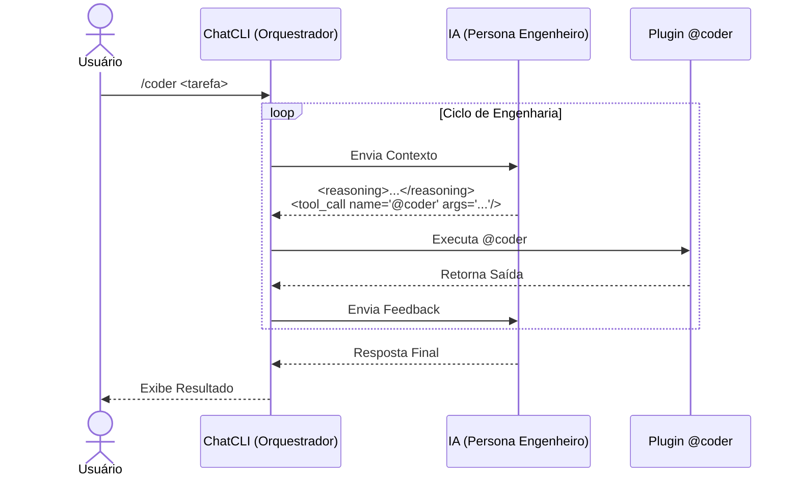

O modo `/coder` é um modo especializado para tarefas de engenharia de software com ciclo de leitura → alterações →feedback.

Ele dá mais rigorosidade que o modo `/agent`, porque o assistente precisa seguir um contrato de saída para que o ChatCLI possa executar as ações com segurança (e semântica de reversão).

## Quando usar

Use `/coder` quando você quiser:
1. Fazer alterações reais no repositório (leitura, edição de arquivos);
2. Rodar testes/lint/build de forma automática;
3. Aplicar patches pequenos e seguros (com backup/rollback);
4. Iterar até chegar em um resultado verificável.

Se você quer uma conversa de alto nível (escrita de texto, ideias, planos) sem executar o próprio código, o `/agent` continua mais adequado.

## Diferença em relação ao /agent

- `/agent`: o assistente propõe comandos de execução em blocos (``execute:shell``), com interação e mais flexibilidade no formato.
- `/coder`: o assistente opera em um loop de ferramentas (fs, patch, exec) e deve emitir: **sempre a mesma estrutura** pra o ChatCLI consumir.

## Contrato de saída (obrigatório)

O mais importante em `/coder` é que a resposta do assistente sempre segue este formato:

1) Antes de qualquer ação, escreva um bloco `|reasoning|` curto (2 a 6 linhas).
2) Em seguida, se precisar agir, emita *apenas* um `|tool_call name="@coder" args="..."/|`.
   - JSON em `args` é recomendado: `args="{\"cmd\":\"read\",\"args\":{\"file\":\"main.go\"}}"`
3) Nunca usa blocos `` nem comandos shell diretos nesse modo.

## Ferramentas e dependência
O modo `/coder` depende do plugin [@coder]([[../../features/coder-plugin]]). Sem ele, as chamadas de ferramenta vão falhar.

- Verifique plugins instalados: `/plugin list`
- Instale/habilite o `@coder` conforme a seção [Plugin @coder]([[../../features/coder-plugin]]).

## Subcomandos suportados (args)

No `/coder`, o atributo `args` do `<tool_call>` deve usar somente os subcomandos abaixo (em linha única):

- `tree --dir .`
- `--encoding base64|text` (para `read/write/patch`)
- `search --term "x" --dir .`
- `read --file x`
- `write --file x --content "base64" --encoding base64`
- `patch --file x --search "base64" --replace "base64" --encoding base64` (ou `patch --diff "base64" --diff-encoding base64`)
- `exec --cmd "comando"`
- `git-status --dir .`
- `git-diff --dir .`
- `git-log --dir .`
- `git-changed --dir .`
- `git-branch --dir .`
- `test --dir .` (ou `--cmd "comando"`)
- `rollback --file x`
- `clean --dir .`

## Exemplos de Fluxo

### 1) Corrigir testes gerais

1. Listar a árvore: `tree --dir .`
2. Procurar ocorrências: `search --term "FAIL"...`
3. Ler arquivos: `read --file ...`
4. Aplicar patch minimal: `patch --file ...`
5. Rodar testes: `exec --cmd "go test ./..."`

<Callout type="success">
Nesse modo, a saída sempre vai via `@coder`. Você não precisa escrever comandos diretamente no shell.
</Callout>

---

## FAQ do /coder

**1) Posso usar JSON em `args`?**  
Sim. É o formato recomendado. Exemplo:  
`<tool_call name="@coder" args="{\"cmd\":\"read\",\"args\":{\"file\":\"main.go\"}}"/>`

**2) Quando usar `patch --diff`?**  
Quando a alteração envolve múltiplos trechos ou precisa de mais precisão. Você pode enviar um unified diff em `text` ou `base64`.

**3) O que acontece se o `@coder` não estiver instalado?**  
O `/coder` depende do plugin `@coder`. Sem ele, as chamadas de ferramenta falharão. Instale via `/plugin install` ou use o plugin fornecido.

**4) `exec` é seguro?**  
O `@coder exec` bloqueia padrões perigosos por padrão. Para comandos sensíveis, prefira usar os subcomandos Git e `test`.

**5) Existe limite de leitura?**  
Sim. Use `read --max-bytes`, `--head` ou `--tail` para controlar o tamanho da saída.
