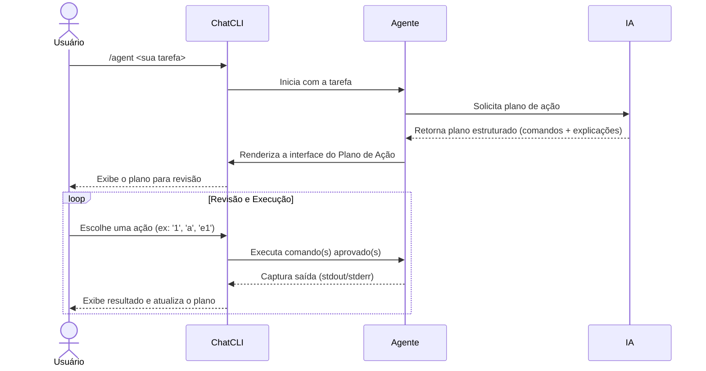

O Modo Agente transforma o **ChatCLI** de um assistente passivo em um **executor proativo**. Em vez de apenas pedir informações, você delega uma tarefa completa, e a IA cria, apresenta e—com sua aprovação—executa um plano de ação para concluí-la.

É a funcionalidade ideal para tarefas que envolvem múltiplos passos no terminal.

---

## Como Iniciar o Modo Agente

Para ativar o Modo Agente, use o comando `/agent` ou seu atalho `/run`, seguido da sua tarefa em linguagem natural.

```bash
/agent encontre todos os arquivos de log no meu diretório home que foram modificados nas últimas 24 horas e copie-os para uma pasta chamada 'logs_recentes'.
```

Após receber sua instrução, a IA analisará o pedido e responderá com um **Plano de Ação**: uma lista de comandos estruturados para sua revisão.

---

## O Ciclo do Agente: Do Plano à Execução

O Modo Agente opera em um ciclo interativo que lhe dá total controle. O diagrama abaixo ilustra o fluxo:


--------

## A Interface do Plano de Ação

Após o planejamento da IA, você verá uma tela dedicada com duas visualizações que podem ser alternadas com a tecla  p .

#### Visão Compacta (Padrão)

Ideal para uma visão geral do fluxo, mostrando o status e a primeira linha de cada comando.
```plaintext
📋 PLANO (visão compacta)
  ✅ #1: Criar o diretório de destino — mkdir -p logs_recentes
  ⏳ #2: Encontrar e copiar os arquivos — find ~ -name "*.log" -mtime -1 -exec cp {} logs_recentes/ \;
```
#### Visão Completa

Fornece um "cartão" detalhado para cada comando, incluindo a descrição gerada pela IA, tipo, análise de risco e o bloco de código completo.
```plaintext
🔷 COMANDO #2: Encontrar e copiar os arquivos
    Tipo:   shell
    Risco:  Seguro
    Status: Pendente
    Código:
      $ find ~ -name "*.log" -mtime -1 -exec cp {} logs_recentes/ \;
```
--------

## O Menu Interativo: Seu Centro de Controle

Este menu permite que você gerencie a execução do plano com precisão.
```bash
Ação  │ Descrição                                                                         
──────┼───────────────────────────────────────────────────────────────────────────────────
[N]   │ Executar Comando N: Executa um único passo do plano (ex:  1 ).                    
a     │ Executar Todos: Executa todos os comandos pendentes em sequência.                 
eN    │ Editar Comando N: Abre o comando  N  em um editor para modificação.               
tN    │ Testar (Dry-Run): Simula a execução do comando  N  sem fazer alterações.          
cN    │ Continuar de N: Envia a saída do comando  N  para a IA e pede os próximos passos.
pcN   │ Contexto Pré-Execução: Adiciona informações para a IA refinar o comando  N .      
acN   │ Contexto Pós-Execução: Envia a saída do comando  N  com um novo contexto.         
vN    │ Ver Saída: Abre a saída completa do comando  N  em um pager ( less ).             
wN    │ Salvar Saída: Salva a saída do comando  N  em um arquivo temporário.              
p     │ Alternar Plano: Muda a visualização entre  COMPACTO  e  COMPLETO .                
r     │ Redesenhar a Tela: Limpa a tela.                                                  
q     │ Sair (Quit): Encerra o Modo Agente e retorna ao chat normal.
```
<Callout type="info">
**Dica de Fluxo de Trabalho:** Use  tN  (testar) para verificar o que um comando complexo fará. Se o resultado for o esperado, execute-o com  N . Se algo der errado, use  cN  (continuar) para pedir à IA que corrija o plano com base no erro.
</Callout>

--------

## Segurança em Primeiro Lugar

O Modo Agente foi construído com a segurança como prioridade.

<Callout type="warning">
**Validação Automática:** Comandos considerados perigosos ( rm -rf ,  sudo ,  mkfs ,  dd ) são bloqueados por padrão. O ChatCLI exigirá uma confirmação explícita e detalhada antes de permitir sua execução.
</Callout>

Você sempre tem a palavra final. Nenhum comando é executado sem sua aprovação.

--------

## Próximos Passos

Agora que você domina a execução de tarefas, que tal aprender a salvar e reutilizar seu trabalho em diferentes projetos?

➡️ Próximo: [Gerenciamento de Sessões](/features/session-management/)