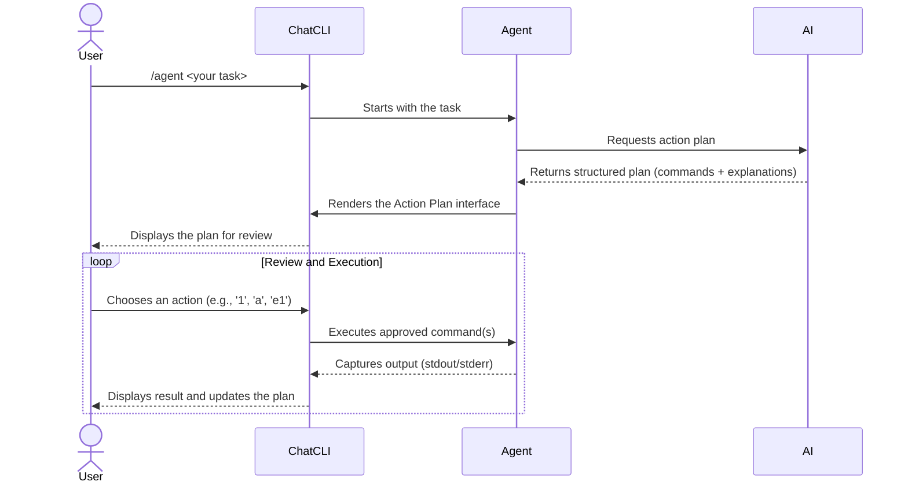

Agent Mode transforms **ChatCLI** from a passive assistant into a **proactive executor**. Delegate a complete task, and the AI creates, presents, and — with your approval — executes an action plan.

---

## How to Start

Use `/agent` or `/run`, followed by your task in natural language:

```bash
/agent find all log files modified in the last 24h and copy them to 'recent_logs'
```

The AI will respond with an **Action Plan**: a list of structured commands for review.

---

## The Agent Cycle



---

## Action Plan Interface

After planning, you will see a dedicated screen with two views (toggle with `p`):

<Tabs>
  <Tab title="Compact View (Default)">
    Ideal for an overview of the flow, showing status and the first line of each command.

    ```text
    PLAN (compact view)
      #1: Create the destination directory -- mkdir -p recent_logs
      #2: Find and copy the files -- find ~ -name "*.log" -mtime -1 -exec cp {} recent_logs/ \;
    ```
  </Tab>
  <Tab title="Full View">
    Provides a detailed "card" for each command: description, type, risk analysis, and full code.

    ```text
    COMMAND #2: Find and copy the files
        Type:   shell
        Risk:   Safe
        Status: Pending
        Code:
          $ find ~ -name "*.log" -mtime -1 -exec cp {} recent_logs/ \;
    ```
  </Tab>
</Tabs>

---

## Interactive Menu

The menu allows you to manage execution with precision:

| Action | Description |
| --- | --- |
| `[N]` | **Execute Command N** — runs a single step of the plan (e.g., `1`) |
| `a` | **Execute All** — runs all pending commands in sequence |
| `eN` | **Edit Command N** — opens the command in an editor for modification |
| `tN` | **Test (Dry-Run)** — simulates execution without making changes |
| `cN` | **Continue from N** — sends the output to the AI and asks for next steps |
| `pcN` | **Pre-Execution Context** — adds information for the AI to refine the command |
| `acN` | **Post-Execution Context** — sends the output with new context |
| `vN` | **View Output** — opens the full output in a pager (`less`) |
| `wN` | **Save Output** — saves the command output to a temporary file |
| `p` | **Toggle Plan** — switches between compact and full view |
| `r` | **Redraw Screen** — clears the screen |
| `q` | **Quit** — exits Agent Mode and returns to chat |

<Tip>
Use `tN` (test) to verify what a command will do. If it looks good, execute with `N`. If something goes wrong, use `cN` to ask the AI to fix the plan.
</Tip>

---

## Security

<Warning>
Dangerous commands (`rm -rf`, `sudo`, `mkfs`, `dd`) are blocked by default. ChatCLI will require explicit confirmation before allowing their execution.
</Warning>

You always have the final say. No command is executed without your approval.

---

## Unified History and Context

Agent mode shares the **same conversation history** as chat and coder. This means you can:

- Start a conversation in chat, enter `/agent`, and the AI will have all the previous context
- Use `/compact` to reduce history when it gets large
- Use `/rewind` (or Esc+Esc) to go back to an earlier point in the conversation

Additionally, the agent automatically receives **workspace context** (bootstrap files like SOUL.md, USER.md, and persistent memory) in its system prompt.

---

## Next Steps

<CardGroup cols={2}>
  <Card title="Coder Mode" icon="code" href="/en/core-concepts/coder-mode">
    AI that reads, edits, and tests code in an automated loop.
  </Card>
  <Card title="Conversation Control" icon="clock-rotate-left" href="/en/features/conversation-control">
    Use /compact and /rewind to manage history.
  </Card>
  <Card title="Session Management" icon="floppy-disk" href="/en/features/session-management">
    Save and reuse your work across projects.
  </Card>
</CardGroup>
