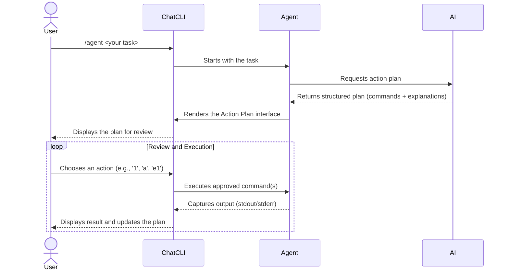

Agent Mode transforms **ChatCLI** from a passive assistant into a **proactive executor**. Delegate a complete task, and the AI creates, presents, and — with your approval — executes an action plan.

---

## How to Start

Use `/agent` or `/run`, followed by your task in natural language:

```bash
/agent find all log files modified in the last 24h and copy them to 'recent_logs'
```

The AI will respond with an **Action Plan**: a list of structured commands for review.

---

## The Agent Cycle



---

## How the Agent Works Internally

At the heart of agent mode is a **ReAct loop** (Reason + Act) implemented in the `processAIResponseAndAct()` function. This loop allows the AI to reason about the problem, execute actions, and use the results to decide the next steps.

### The ReAct Loop

Each agent turn follows this sequence:

1. **Build history** — The conversation history is assembled with an _anchor reminder_ (format reminder) appended at the end. This anchor reinforces the expected response format for the AI, preventing it from "forgetting" instructions during long conversations.
2. **Call the LLM** — The complete history is sent to the configured AI provider.
3. **Parse the response** — The response is analyzed to extract reasoning, explanations, tool calls, and commands.
4. **Execute actions** — Tools and commands are executed with appropriate security controls.
5. **Inject feedback** — Execution results are injected back into the history as context messages.
6. **Next turn** — The loop returns to step 1, until the AI completes the task or the turn limit is reached.

The maximum number of turns is configurable (default: **50**, maximum: **200**). When the limit is reached, the agent terminates the loop and displays the last state to the user.

### System Prompt Composition

The agent's system prompt is dynamically assembled from several sources:

- **Workspace context** — Bootstrap files like `SOUL.md`, `USER.md`, and persistent memory
- **Tool descriptions** — Complete list of available plugins and their parameters
- **Active persona** — If a custom persona is configured, it is included
- **Format instructions** — The `AgentFormatInstructions` that define the expected response format

<Info>
The `/agent`, `/coder`, and `/run` modes share the same ReAct loop. The difference lies only in the prompt instructions — `/coder` uses `CoderSystemPrompt` which emphasizes code editing, while `/agent` uses instructions geared toward general task execution.
</Info>

---

## AI Response Format

The LLM response is parsed to identify multiple structured elements. Each block type has different behavior in the UI:

| Element | Tag/Format | UI Behavior |
| --- | --- | --- |
| **Reasoning** | `<reasoning>...</reasoning>` | Displayed as a "brain" icon card — AI's internal thinking |
| **Explanation** | `<explanation>...</explanation>` | Displayed as a pinned card — user-facing explanation |
| **Final summary** | `<final_summary>...</final_summary>` | Task completion summary |
| **Tool call** | `<tool_call>...</tool_call>` | Plugin invocation (file_edit, web_search, etc.) |
| **Multi-agent** | `<agent_call>...</agent_call>` | Dispatches sub-tasks to parallel agents (3+ independent tasks) |
| **Shell command** | `` ```execute:shell `` or `` ```bash `` | Command block for execution (legacy format) |
| **Plain text** | Text without tags | Displayed as normal chat response |

<Note>
The parser is **stateful** (not regex-based) to correctly handle XML tags containing quoted attributes with special characters.
</Note>

---

## Cancellation and Ctrl+C

The agent supports graceful cancellation at any point during execution:

- **During LLM call** — `Ctrl+C` cancels the request via `context.WithCancel()`. Any partial response received up to that point is discarded.
- **Per-turn check** — At the start of each ReAct loop turn, the agent checks `context.Done()`. If the context has been cancelled, the loop terminates immediately.
- **Signal handling** — `SIGINT` and `SIGTERM` are caught by the `runWithCancellation()` function, which coordinates graceful shutdown.
- **Type-ahead queue** — Messages typed by the user during AI processing are queued and processed once the current turn finishes. This prevents input loss.

<Tip>
If the AI gets "stuck" in a long loop, press `Ctrl+C` once to cancel the current turn. You can then rephrase your instruction.
</Tip>

---

## History and Compaction

The agent automatically manages conversation history size to avoid exceeding the model's token limit.

### Compaction Strategy

When the history exceeds **60% of the model's token budget**, compaction is triggered in 3 progressive levels:

1. **Trimming** — Injected context messages (tool results, command outputs) longer than 3000 characters are truncated, preserving the beginning and end.
2. **Summarization** — Intermediate messages are summarized by the AI itself, keeping key points.
3. **Emergency truncation** — If the previous levels are not sufficient, the oldest messages are removed.

Across all levels, the **8 most recent messages** are always preserved to maintain immediate context.

### Checkpoint and /rewind

At the start of each agent interaction, a **checkpoint** of the history is saved. This allows using `/rewind` (or `Esc+Esc`) to return to the exact state before the agent's last action.

---

## Action Plan Interface

After planning, you will see a dedicated screen with two views (toggle with `p`):

<Tabs>
  <Tab title="Compact View (Default)">
    Ideal for an overview of the flow, showing status and the first line of each command.

    ```text
    PLAN (compact view)
      #1: Create the destination directory -- mkdir -p recent_logs
      #2: Find and copy the files -- find ~ -name "*.log" -mtime -1 -exec cp {} recent_logs/ \;
    ```
  </Tab>
  <Tab title="Full View">
    Provides a detailed "card" for each command: description, type, risk analysis, and full code.

    ```text
    COMMAND #2: Find and copy the files
        Type:   shell
        Risk:   Safe
        Status: Pending
        Code:
          $ find ~ -name "*.log" -mtime -1 -exec cp {} recent_logs/ \;
    ```
  </Tab>
</Tabs>

---

## Interactive Menu

The menu allows you to manage execution with precision:

| Action | Description |
| --- | --- |
| `[N]` | **Execute Command N** — runs a single step of the plan (e.g., `1`) |
| `a` | **Execute All** — runs all pending commands in sequence |
| `eN` | **Edit Command N** — opens the command in an editor for modification |
| `tN` | **Test (Dry-Run)** — simulates execution without making changes |
| `cN` | **Continue from N** — sends the output to the AI and asks for next steps |
| `pcN` | **Pre-Execution Context** — adds information for the AI to refine the command |
| `acN` | **Post-Execution Context** — sends the output with new context |
| `vN` | **View Output** — opens the full output in a pager (`less`) |
| `wN` | **Save Output** — saves the command output to a temporary file |
| `p` | **Toggle Plan** — switches between compact and full view |
| `r` | **Redraw Screen** — clears the screen |
| `q` | **Quit** — exits Agent Mode and returns to chat |

<Tip>
Use `tN` (test) to verify what a command will do. If it looks good, execute with `N`. If something goes wrong, use `cN` to ask the AI to fix the plan.
</Tip>

---

## Security

<Warning>
Dangerous commands (`rm -rf`, `sudo`, `mkfs`, `dd`) are blocked by default. ChatCLI will require explicit confirmation before allowing their execution.
</Warning>

You always have the final say. No command is executed without your approval.

---

## Unified History and Context

Agent mode shares the **same conversation history** as chat and coder. This means you can:

- Start a conversation in chat, enter `/agent`, and the AI will have all the previous context
- Use `/compact` to reduce history when it gets large
- Use `/rewind` (or Esc+Esc) to go back to an earlier point in the conversation

Additionally, the agent automatically receives **workspace context** (bootstrap files like SOUL.md, USER.md, and persistent memory) in its system prompt.

---

## Agent Mode Configuration

Agent behavior can be tuned via environment variables:

| Variable | Default | Description |
| --- | --- | --- |
| `CHATCLI_AGENT_PLUGIN_MAX_TURNS` | `50` | Maximum number of ReAct loop turns. Hard maximum: **200**. |
| `CHATCLI_AGENT_CMD_TIMEOUT` | `10m` | Timeout for shell command execution. Maximum: **1 hour**. |
| `CHATCLI_AGENT_PLUGIN_TIMEOUT` | `15m` | Timeout for plugin execution (file_edit, web_search, etc.). |
| `CHATCLI_AGENT_DENYLIST` | _(empty)_ | Regex patterns separated by `;` to block commands. E.g., `rm\s+-rf;curl.*\|.*sh` |
| `CHATCLI_AGENT_ALLOW_SUDO` | `false` | If `true`, allows execution of commands with `sudo`. |
| `CHATCLI_AGENT_PARALLEL_MODE` | `false` | Enables multi-agent dispatch via `<agent_call>` for parallel tasks. |

<CodeGroup>
```bash Example: Limit turns and timeout
export CHATCLI_AGENT_PLUGIN_MAX_TURNS=100
export CHATCLI_AGENT_CMD_TIMEOUT=30m
```

```bash Example: Block dangerous patterns
export CHATCLI_AGENT_DENYLIST="rm\s+-rf\s+/;curl.*\|.*bash;wget.*\|.*sh"
```
</CodeGroup>

---

## One-Shot Mode (-p flag)

One-shot mode enables **non-interactive** single-instruction execution, ideal for scripts and automation:

```bash
chatcli -p "list all stopped Docker containers"
```

### How it works

1. The instruction is sent to the LLM as a single turn (no ReAct loop).
2. A **thinking animation** is displayed while the AI processes.
3. If the `--auto-execute` flag is active, the first command block in the response is executed automatically — but only after passing the dangerous command check.
4. The result is displayed and the process exits.

<Warning>
One-shot with `--auto-execute` does **not** prompt for confirmation on safe commands. Make sure you trust the instruction before using this combination in scripts.
</Warning>

---

## Next Steps

<CardGroup cols={2}>
  <Card title="Coder Mode" icon="code" href="/en/core-concepts/coder-mode">
    AI that reads, edits, and tests code in an automated loop.
  </Card>
  <Card title="Conversation Control" icon="clock-rotate-left" href="/en/features/conversation-control">
    Use /compact and /rewind to manage history.
  </Card>
  <Card title="Session Management" icon="floppy-disk" href="/en/features/session-management">
    Save and reuse your work across projects.
  </Card>
</CardGroup>
