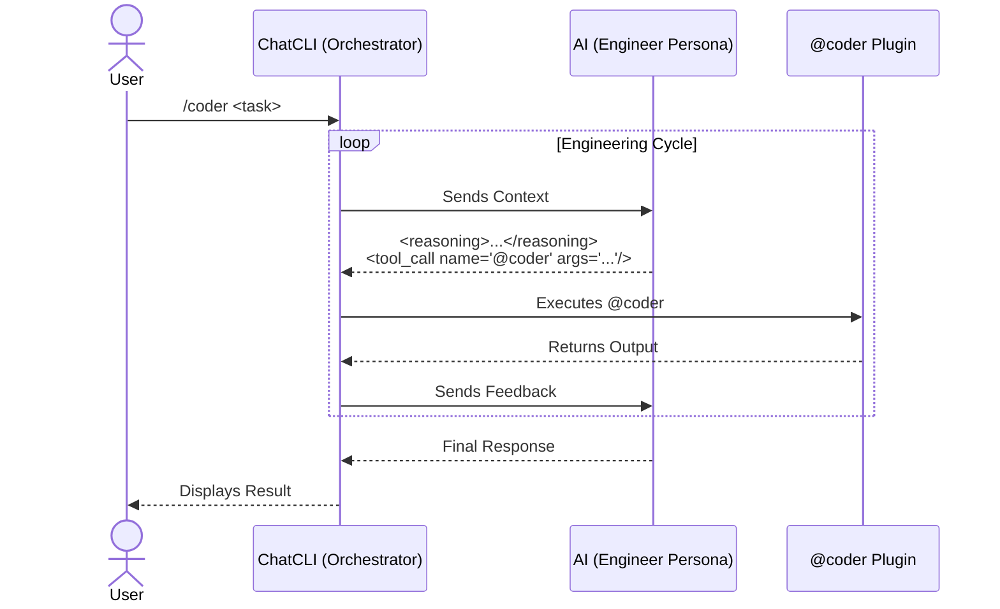

The `/coder` mode is specialized for software engineering tasks with a **read, modify, and feedback** cycle.

It provides more rigor than `/agent`, because the assistant follows an output contract so that ChatCLI can execute actions safely (with rollback semantics).

---

## When to Use

<CardGroup cols={2}>
  <Card title="Use /coder for..." icon="check">
    Real changes to the repository, running tests/lint/build automatically, applying patches with rollback, iterating until a verifiable result.
  </Card>
  <Card title="Use /agent for..." icon="arrow-right">
    High-level conversations, writing text, ideas, plans — without executing code directly.
  </Card>
</CardGroup>

---

## Engineering Flow



---

## Multi-Agent Orchestration

`/coder` includes multi-agent orchestration **enabled by default**. The orchestrator LLM dispatches specialized agents in parallel:

| Agent | Role |
| --- | --- |
| **FileAgent** | Code reading and analysis (read-only) |
| **CoderAgent** | Code writing and modification |
| **ShellAgent** | Command execution and testing |
| **GitAgent** | Version control operations |
| **SearchAgent** | Codebase search (read-only) |
| **PlannerAgent** | Reasoning and task decomposition (no tools) |
| **ReviewerAgent** | Code review and quality (read-only) |
| **TesterAgent** | Test generation and coverage |
| **RefactorAgent** | Structural transformations (rename, extract, move) |
| **DiagnosticsAgent** | Troubleshooting and error investigation |
| **FormatterAgent** | Code formatting and style |
| **DepsAgent** | Dependency management and auditing |
| **Custom Agents** | Personas from `~/.chatcli/agents/` registered automatically |

Each agent has its own skills and executes in its own isolated mini ReAct loop. Multiple agents run simultaneously via goroutines with a configurable semaphore (`CHATCLI_AGENT_MAX_WORKERS`).

<Info>
Disable with `CHATCLI_AGENT_PARALLEL_MODE=false` if needed. See the [full documentation](/features/multi-agent-orchestration).
</Info>

---

## Output Contract

The assistant's response format in `/coder` is mandatory:

<Steps>
  <Step title="Reasoning">
    Before any action, the assistant writes a short `reasoning` block (2 to 6 lines).
  </Step>
  <Step title="Tool Call">
    If it needs to act, it emits a `tool_call name="@coder" args="..."` with JSON in the args.
  </Step>
  <Step title="No direct commands">
    It never uses code blocks or direct shell commands — everything goes through `@coder`.
  </Step>
</Steps>

### Contract Validation and Enforcement

When the AI violates the output contract, ChatCLI automatically detects it and injects a format correction feedback message. The turn is reprocessed until the format is correct. The enforcement rules are:

| Detected Violation | Injected Feedback |
| --- | --- |
| `tool_call` uses a tool **other than** `@coder` | Format error — only `@coder` is allowed in `/coder` mode |
| `tool_call` missing but code blocks present | "Code blocks are not allowed, use `@coder`" |
| `<reasoning>` missing before `tool_call` | "Reasoning is required before any tool_call" |
| Loose shell commands detected (e.g., `$ go test`) | "Use `@coder exec`, not direct commands" |

<Warning>
If the AI persists in violating the contract after multiple attempts, ChatCLI aborts the turn and displays a warning to the user. This rarely happens with modern models.
</Warning>

Internally, validation occurs in `agent_coder_validation.go` — a dedicated module that inspects each AI response before executing any tool_call. The sequence is:

1. **Parse** the response — extract `<reasoning>`, `<tool_call>`, code blocks, and loose text
2. **Reasoning check** — if `<tool_call>` exists but `<reasoning>` does not, reject
3. **Tool name check** — if the `tool_call` `name` is not `@coder`, reject
4. **Code block check** — if code blocks (` ``` `) are present in the response, reject
5. **Shell pattern check** — detect patterns like `$ cmd`, `> cmd`, `run: cmd`
6. If any check fails, inject feedback and **retry the turn** (up to 3 attempts)

---

## Internal Difference Between /coder and /agent

Both modes use the **same ReAct loop** (`processAIResponseAndAct`). The difference is in configuration, not architecture:

| Aspect | `/coder` | `/agent` |
| --- | --- | --- |
| **System Prompt** | `CoderSystemPrompt` (full) or `CoderFormatInstructions` (when persona active) | `AgentFormatInstructions` |
| **Output format** | Strict: `<reasoning>` + `<tool_call name="@coder">` only | Flexible: any tool, `execute` blocks, free text |
| **Validation** | Active (`isCoderMode=true`) — rejects violations | Disabled — accepts any valid format |
| **Tool context** | Compact: required flags only, 1-2 examples per subcommand | Full: all flags, multiple examples |
| **History** | Shared (unified history) | Shared (unified history) |
| **Multi-agent** | Supports `<agent_call>` | Supports `<agent_call>` |
| **Format anchor** | Reminds about `<reasoning>` + `@coder` each turn | Reminds about `tool_call` and `execute` each turn |

<Info>
In practice, `/coder` is `/agent` with **additional guardrails**. If you switch from `/agent` to `/coder` mid-conversation, the history is preserved — only the validation rules and system prompt change.
</Info>

The `isCoderMode` flag is what activates all the differences. When `true`:
- The contract validator runs on every response
- The tool context is reduced to save tokens
- The format anchor is specific to `@coder`
- The system prompt includes base64 encoding rules

---

## Task Tracker and Progress

When the AI includes a `<reasoning>` block with numbered tasks (e.g., "1. Read files\n2. Apply patch\n3. Run tests"), the **TaskTracker** automatically parses this and creates a `TaskPlan`:

### How it works

1. **Parse**: Each numbered line becomes a `Task` with initial status `Pending`
2. **Tracking**: As tool_calls are executed, the current task's status is updated
3. **Rendering**: Progress appears below the reasoning as compact status lines

### Task status

| Status | Meaning |
| --- | --- |
| `Pending` | Waiting for execution |
| `InProgress` | Being executed in the current turn |
| `Completed` | Tool_call executed successfully |
| `Failed` | Tool_call returned an error |

### Automatic replanning

If **3 or more tasks fail** consecutively, the TaskTracker signals `NeedsReplan = true`. ChatCLI then injects a system message asking the AI to **reformulate its plan** before continuing.

The TaskTracker also computes a **signature (hash)** of the plan. If the AI changes its plan between turns (e.g., adds or removes tasks), the tracker detects the change and restarts tracking with the new plan.

<Tip>
The TaskTracker is purely informational for the user — it does not block execution. Even if the progress shows "Failed", the AI may decide to ignore the error and continue.
</Tip>

---

## Base64 Encoding Requirements

For write and patch operations, the `/coder` system prompt mandates base64 encoding:

### Why base64?

Source code frequently contains characters that conflict with the JSON format of args:
- Double and single quotes
- Line breaks
- Backslashes (escapes)
- Indentation with tabs vs. spaces

When the AI tries to send code as plain text in JSON, the parse fails or the content gets corrupted. Base64 eliminates this problem completely.

### Encoding rules

| Operation | Rule |
| --- | --- |
| `write --content` | **Required**: content must be base64, with `--encoding base64` |
| `patch --search / --replace` | **Recommended** for multiline content: use base64 |
| `patch --diff` | Use `--diff-encoding base64` for base64-encoded diffs |
| `read`, `search`, `tree` | Not applicable (output is always text) |

### The `--encoding` flag

The `--encoding` flag controls content interpretation:
- `text` (default): content is interpreted as literal text
- `base64`: content is decoded from base64 before being written

```
# Example: writing with base64
@coder write --file main.go --content "cGFja2FnZSBtYWluCg==" --encoding base64

# Example: patch with base64 diff
@coder patch --diff "LS0tIGEvbWFpbi5nbw..." --diff-encoding base64
```

---

## System Prompt Composition in /coder

The system prompt is assembled in layers, in the following order:

<Steps>
  <Step title="Layer 1: Persona or CoderSystemPrompt">
    If a **custom persona** is active (e.g., `--persona senior-go`), the persona prompt is used as the base. Otherwise, the default `CoderSystemPrompt` is used.
  </Step>
  <Step title="Layer 2: CoderFormatInstructions">
    When a persona is active, `CoderFormatInstructions` are **appended** to the persona prompt. This ensures the persona respects the `/coder` output contract. When no persona is active, the instructions are already embedded in the `CoderSystemPrompt`.
  </Step>
  <Step title="Layer 3: Workspace Context">
    Project context files are injected via `contextBuilder`:
    - `SOUL.md` — personality and global guidelines
    - `USER.md` — user preferences
    - `RULES.md` — project-specific rules
  </Step>
  <Step title="Layer 4: Tool Context">
    The compact `@coder` schema is included: list of subcommands, required flags, and 1-2 examples per subcommand. In `/coder` mode, this context is **reduced** compared to `/agent` to save tokens.
  </Step>
  <Step title="Layer 5: Multi-Agent Orchestrator Prompt">
    If parallel mode is active (`CHATCLI_AGENT_PARALLEL_MODE=true`), the multi-agent orchestrator prompt is appended with the list of available agents and dispatch instructions.
  </Step>
</Steps>

---

## Format Anchor (Per-Turn Reminder)

At each turn of the ReAct loop, a **short format reminder** is appended to the message history. This prevents the AI from "forgetting" the format rules in long conversations.

### In /coder mode

The anchor reminds about:
- Mandatory format: `<reasoning>` followed by `<tool_call name="@coder">`
- Prohibition of code blocks and direct commands
- Base64 encoding requirement for file writes

### In /agent mode

The anchor reminds about:
- `tool_call` and `execute` block format
- Tools available in the current turn

<Info>
The anchor is a **prompt engineering** technique to maintain format adherence. Without it, models tend to "drift" into free text after 10-15 turns of conversation. The anchor is short (3-5 lines) to avoid consuming excessive tokens.
</Info>

---

## Tools and Dependency

The `/coder` mode uses the [@coder](/features/coder-plugin) plugin, which comes **built into ChatCLI** — no additional installation required.

<Tip>
Check with `/plugin list` — `@coder` appears with the `[builtin]` tag.
</Tip>

---

## Supported Subcommands

| Subcommand | Description |
| --- | --- |
| `tree --dir .` | List directory tree |
| `search --term "x" --dir .` | Search the codebase |
| `read --file x` | Read file |
| `write --file x --content "..." --encoding base64` | Write file |
| `patch --file x --search "..." --replace "..."` | Apply patch |
| `patch --diff "..." --diff-encoding base64` | Apply unified diff |
| `exec --cmd "command"` | Execute command |
| `git-status --dir .` | Git status |
| `git-diff --dir .` | Git diff |
| `git-log --dir .` | Git log |
| `git-changed --dir .` | Changed files |
| `git-branch --dir .` | Current branch |
| `test --dir .` | Run tests |
| `rollback --file x` | Revert change |
| `clean --dir .` | Clean backups |

---

## Example Flow

<Steps>
  <Step title="List the tree">
    `tree --dir .`
  </Step>
  <Step title="Search for occurrences">
    `search --term "FAIL" --dir .`
  </Step>
  <Step title="Read relevant files">
    `read --file cli/agent_mode.go`
  </Step>
  <Step title="Apply patch">
    `patch --file cli/agent_mode.go --search "..." --replace "..."`
  </Step>
  <Step title="Run tests">
    `exec --cmd "go test ./..."`
  </Step>
</Steps>

---

## Operation Parallelization

`/coder` maximizes parallelism by emitting **multiple tool_calls in a single response** when operations are independent. For example, when needing to read 3 files, the AI emits 3 `tool_call` tags at once instead of one per turn.

For complex tasks with 3+ independent operations, the AI uses `<agent_call>` to dispatch specialized agents in parallel via goroutines.

<Tip>
If you notice the AI performing sequential operations that could be parallel, remind it: "emit all independent tool_calls in a single response".
</Tip>

---

## FAQ

<AccordionGroup>
  <Accordion title="Can I use JSON in args?">
    Yes, it is the recommended format:

    `tool_call name="@coder" args='{"cmd":"read","args":{"file":"main.go"}}'`
  </Accordion>
  <Accordion title="When should I use patch --diff?">
    When the change involves multiple sections or requires more precision. It accepts unified diff in `text` or `base64`.
  </Accordion>
  <Accordion title="Do I need to install @coder separately?">
    No. `@coder` is a **builtin** plugin — it comes embedded in the binary. If you install a custom version in `~/.chatcli/plugins/`, it will take precedence over the builtin.
  </Accordion>
  <Accordion title="Is exec safe?">
    `@coder exec` blocks dangerous patterns by default. For sensitive commands, prefer using the Git subcommands and `test`.
  </Accordion>
  <Accordion title="Is there a read limit?">
    Yes. Use `read --max-bytes`, `--head`, or `--tail` to control the output size.
  </Accordion>
  <Accordion title="How does /coder handle AI format errors?">
    ChatCLI validates **every response** from the AI against the output contract. If a violation is detected (e.g., direct code block, wrong tool, missing reasoning), a format correction feedback message is injected into the history and the turn is reprocessed. The AI gets up to 3 attempts to correct the format. In practice, modern models get it right on the first or second turn.
  </Accordion>
  <Accordion title="Can I use /coder with a custom persona?">
    Yes. When a persona is active (e.g., `--persona senior-go`), the persona prompt is used as the base and `CoderFormatInstructions` are **automatically appended**. This ensures the persona respects the `/coder` output contract without losing its custom personality.
  </Accordion>
  <Accordion title="What is the Task Tracker?">
    It is a module that parses numbered tasks from the AI's `<reasoning>` block (e.g., "1. Read files\n2. Apply patch"). Each task receives a status (Pending, InProgress, Completed, Failed) that is updated as tool_calls are executed. Progress is displayed in the interface. If 3+ tasks fail, ChatCLI asks the AI to reformulate its plan.
  </Accordion>
  <Accordion title="Why is base64 required for write?">
    Source code frequently contains quotes, line breaks, backslashes, and other characters that conflict with JSON. When the AI sends code as plain text in the tool_call args, the JSON parse can fail or the content gets corrupted. Base64 encodes the content safely, eliminating 100% of escaping issues.
  </Accordion>
</AccordionGroup>
