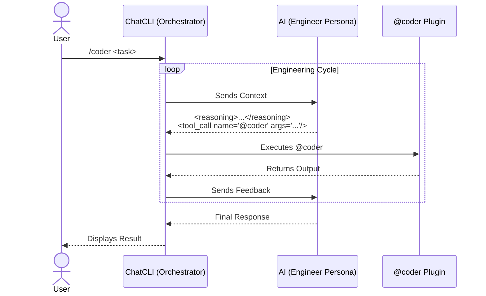

The `/coder` mode is specialized for software engineering tasks with a **read, modify, and feedback** cycle.

It provides more rigor than `/agent`, because the assistant follows an output contract so that ChatCLI can execute actions safely (with rollback semantics).

---

## When to Use

<CardGroup cols={2}>
  <Card title="Use /coder for..." icon="check">
    Real changes to the repository, running tests/lint/build automatically, applying patches with rollback, iterating until a verifiable result.
  </Card>
  <Card title="Use /agent for..." icon="arrow-right">
    High-level conversations, writing text, ideas, plans — without executing code directly.
  </Card>
</CardGroup>

---

## Engineering Flow

---

## Multi-Agent Orchestration

`/coder` includes multi-agent orchestration **enabled by default**. The orchestrator LLM dispatches specialized agents in parallel:

| Agent | Role |
| --- | --- |
| **FileAgent** | Code reading and analysis (read-only) |
| **CoderAgent** | Code writing and modification |
| **ShellAgent** | Command execution and testing |
| **GitAgent** | Version control operations |
| **SearchAgent** | Codebase search (read-only) |
| **PlannerAgent** | Reasoning and task decomposition (no tools) |
| **Custom Agents** | Personas from `~/.chatcli/agents/` registered automatically |

Each agent has its own skills and executes in its own isolated mini ReAct loop. Multiple agents run simultaneously via goroutines with a configurable semaphore (`CHATCLI_AGENT_MAX_WORKERS`).

<Info>
Disable with `CHATCLI_AGENT_PARALLEL_MODE=false` if needed. See the [full documentation](/features/multi-agent-orchestration).
</Info>

---

## Output Contract

The assistant's response format in `/coder` is mandatory:

<Steps>
  <Step title="Reasoning">
    Before any action, the assistant writes a short `reasoning` block (2 to 6 lines).
  </Step>
  <Step title="Tool Call">
    If it needs to act, it emits a `tool_call name="@coder" args="..."` with JSON in the args.
  </Step>
  <Step title="No direct commands">
    It never uses code blocks or direct shell commands — everything goes through `@coder`.
  </Step>
</Steps>

---

## Tools and Dependency

The `/coder` mode uses the [@coder](/features/coder-plugin) plugin, which comes **built into ChatCLI** — no additional installation required.

<Tip>
Check with `/plugin list` — `@coder` appears with the `[builtin]` tag.
</Tip>

---

## Supported Subcommands

| Subcommand | Description |
| --- | --- |
| `tree --dir .` | List directory tree |
| `search --term "x" --dir .` | Search the codebase |
| `read --file x` | Read file |
| `write --file x --content "..." --encoding base64` | Write file |
| `patch --file x --search "..." --replace "..."` | Apply patch |
| `patch --diff "..." --diff-encoding base64` | Apply unified diff |
| `exec --cmd "command"` | Execute command |
| `git-status --dir .` | Git status |
| `git-diff --dir .` | Git diff |
| `git-log --dir .` | Git log |
| `git-changed --dir .` | Changed files |
| `git-branch --dir .` | Current branch |
| `test --dir .` | Run tests |
| `rollback --file x` | Revert change |
| `clean --dir .` | Clean backups |

---

## Example Flow

<Steps>
  <Step title="List the tree">
    `tree --dir .`
  </Step>
  <Step title="Search for occurrences">
    `search --term "FAIL" --dir .`
  </Step>
  <Step title="Read relevant files">
    `read --file cli/agent_mode.go`
  </Step>
  <Step title="Apply patch">
    `patch --file cli/agent_mode.go --search "..." --replace "..."`
  </Step>
  <Step title="Run tests">
    `exec --cmd "go test ./..."`
  </Step>
</Steps>

---

## Operation Parallelization

`/coder` maximizes parallelism by emitting **multiple tool_calls in a single response** when operations are independent. For example, when needing to read 3 files, the AI emits 3 `tool_call` tags at once instead of one per turn.

For complex tasks with 3+ independent operations, the AI uses `<agent_call>` to dispatch specialized agents in parallel via goroutines.

<Tip>
If you notice the AI performing sequential operations that could be parallel, remind it: "emit all independent tool_calls in a single response".
</Tip>

---

## FAQ

<AccordionGroup>
  <Accordion title="Can I use JSON in args?">
    Yes, it is the recommended format:

    `tool_call name="@coder" args='{"cmd":"read","args":{"file":"main.go"}}'`
  </Accordion>
  <Accordion title="When should I use patch --diff?">
    When the change involves multiple sections or requires more precision. It accepts unified diff in `text` or `base64`.
  </Accordion>
  <Accordion title="Do I need to install @coder separately?">
    No. `@coder` is a **builtin** plugin — it comes embedded in the binary. If you install a custom version in `~/.chatcli/plugins/`, it will take precedence over the builtin.
  </Accordion>
  <Accordion title="Is exec safe?">
    `@coder exec` blocks dangerous patterns by default. For sensitive commands, prefer using the Git subcommands and `test`.
  </Accordion>
  <Accordion title="Is there a read limit?">
    Yes. Use `read --max-bytes`, `--head`, or `--tail` to control the output size.
  </Accordion>
</AccordionGroup>
