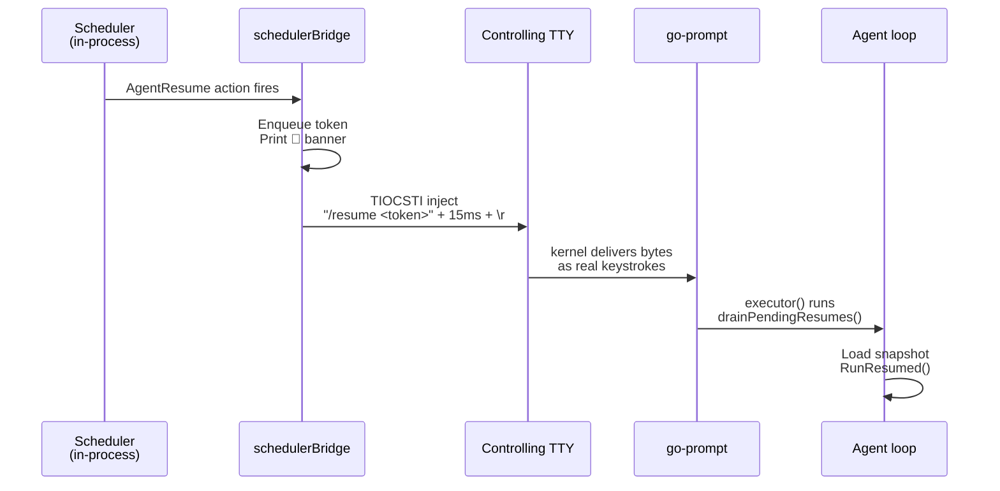

**Park & Resume** turns the agent loop into something that can wait **without blocking the terminal**. Instead of the old `bash sleep 300` pattern that locks the screen for 5 minutes, the agent emits a single `@park` tool call that:

1. **Snapshots** the loop state (history, counters, mode) to disk.
2. **Frees the terminal** — you can chat, list jobs, open another `/coder`.
3. **Schedules** the resume on the durable scheduler (survives crash/restart).
4. **Auto-resumes** by itself once the timer/poll completes, **without you pressing Enter**.

<Info>
Available since **chatcli 1.111.x** (PR #879). Works in `/coder`, `/agent` and `/run` modes. Auto-resume uses TIOCSTI on Unix and `WriteConsoleInputW` on Windows; transparent fallback when the OS restricts the injection.
</Info>

---

## Flow overview

```mermaid
flowchart LR
  U([User]) -->|/coder fix CI| A1[Agent loop]
  A1 -->|@park delay=5m| Snap[Snapshot<br/>~/.chatcli/parked/]
  Snap --> Sched[Scheduler<br/>AgentResume job]
  A1 -->|return nil| T([Terminal free])

  T -.->|user keeps using normally| T
  Sched -->|fires after 5m| Notify[NotifyParkComplete]
  Notify -->|TIOCSTI inject| Prompt[/resume token]
  Prompt -->|drain queue| A2[Agent loop continues]
  A2 -->|history restored| Done([Task complete])

  classDef user fill:#2563EB,stroke:#1E40AF,color:#fff
  classDef agent fill:#10B981,stroke:#059669,color:#fff
  classDef storage fill:#F59E0B,stroke:#D97706,color:#fff
  classDef sched fill:#7C3AED,stroke:#6D28D9,color:#fff

  class U,T user
  class A1,A2,Done agent
  class Snap storage
  class Sched,Notify,Prompt sched
```

---

## Why this is needed

Before park, waiting inside a `/coder` meant:

```bash
# bad — terminal locked, every agent turn is a "tool call"
bash sleep 300     # 5 minutes idle, you can't type anything
curl ...           # check CI
[ $? -eq 0 ] && ...
```

Problems:

- **Terminal blocked** for the full 300 s.
- Each `bash` call burns a **turn** of the agent's turn budget (default 100).
- CLI crash = lose the sleep and the state.
- No audit trail — only in shell history.

With `@park`:

- **Terminal freed** immediately; you keep using the CLI.
- Park takes a **single turn** regardless of duration (10 s or 14 days).
- **Crash-safe** — disk snapshot + scheduler WAL replay on boot.
- **Full audit** via `/jobs logs` and `/parked`.

---

## Four modes of `@park`

<Tabs>
<Tab title="delay">

Fixed timer. Single-shot. Ideal for "wait before checking again".

```xml
<tool_call name="@park" args='{
  "cmd": "delay",
  "args": {
    "duration": "5m",
    "note": "waiting for CI #1234"
  }
}' />
```

| Field | Type | Required | Description |
|---|---|---|---|
| `duration` | string | ✅ | Go duration: `30s`, `5m`, `1h`. Max 14 days. |
| `note` | string | — | Human label shown in `/parked`. |

</Tab>
<Tab title="until">

Absolute wallclock or relative DSL. Single-shot.

```xml
<tool_call name="@park" args='{
  "cmd": "until",
  "args": {
    "when": "2026-05-04T18:00:00Z",
    "note": "deploy window"
  }
}' />
```

Accepted formats in `when`:

- RFC3339: `2026-05-04T18:00:00Z`
- Common layouts: `2006-01-02 15:04:05`, `2006-01-02 15:04`, `15:04`
- Relative: `+5m`, `in 5m`, `after 30s`, `5m`

`15:04` is projected onto today; if already passed, rolls to tomorrow.

</Tab>
<Tab title="for_url">

HTTP polling until the response matches `success_when` (or the deadline elapses).

```xml
<tool_call name="@park" args='{
  "cmd": "for_url",
  "args": {
    "url": "https://api.github.com/repos/x/y/actions/runs/12345",
    "interval": "30s",
    "deadline": "15m",
    "method": "GET",
    "headers": {"Authorization": "Bearer ghp_..."},
    "success_when": "body contains:\"status\":\"completed\""
  }
}' />
```

| Field | Required | Description |
|---|---|---|
| `url` | ✅ | http(s):// |
| `interval` | ✅ | Poll cadence (minimum 5 s) |
| `deadline` | ✅ | Maximum total wait (Go duration or RFC3339) |
| `method` | — | Defaults to `GET` |
| `headers` | — | Optional map |
| `success_when` | — | DSL — see [Matchers](#success_when-matchers). Empty = any 2xx |

</Tab>
<Tab title="for_cmd">

Shell-command polling until `success_when` matches (or the deadline elapses). Subject to the same security policy as `@coder exec`.

```xml
<tool_call name="@park" args='{
  "cmd": "for_cmd",
  "args": {
    "cmd": "terraform plan -detailed-exitcode -no-color",
    "interval": "45s",
    "deadline": "20m",
    "success_when": "exit=0"
  }
}' />
```

| Field | Required | Description |
|---|---|---|
| `cmd` | ✅ | Shell command — passes through `/coder` policy |
| `interval` | ✅ | Minimum 5 s |
| `deadline` | ✅ | Maximum total |
| `success_when` | — | DSL. Empty = exit code 0 |

</Tab>
</Tabs>

### `success_when` matchers

Free-form DSL. Empty assumes "default success" (HTTP 2xx or exit 0).

| Form | Example | Meaning |
|---|---|---|
| `status=N` | `status=200` | Exact HTTP status |
| `status=lo..hi` | `status=200..299` | HTTP status in range |
| `exit=N` | `exit=0` | Exact shell exit code |
| `body contains:<str>` | `body contains:completed` | Substring on body/stdout |
| `body matches:<re>` | `body matches:^OK$` | Regex (Go regexp) on body/stdout |

Multiple matchers in a single spec are not supported; combine using a custom `body matches:` if you need logic.

---

## Management commands

<Tabs>
<Tab title="/parked">

Lists all on-disk parks with cross-checked scheduler job status.

```bash
❯ /parked
  Parked agents (token / mode / description / scheduler status):
    3e06f8d5  [delay] delay 10m — waiting for CI #1234
              resume_at=15:42:00  job=cc230eb0c9eafcf7 (queued)
              created=2026-05-04 15:32:00

    8b7e1234  [for_url] polling https://api.github.com/... every 30s
              resume_at=14:47:00 (deadline)  job=ab1234... (running)
              created=2026-05-04 14:32:00
```

Subcommands:

| Command | Description |
|---|---|
| `/parked` | List (default) |
| `/parked prune` | Remove snapshots whose scheduler job is in a terminal state (completed/failed/cancelled/timed_out) — cleanup after resume |
| `/parked gc <duration>` | Remove snapshots older than `<duration>` regardless of status (e.g. `/parked gc 24h`) |
| `/parked help` | Show usage |

</Tab>
<Tab title="/resume">

Forces immediate resume (skips remaining wait).

```bash
❯ /resume 3e06f8d5
  ▶️  Agent resumed (token=3e06f8d5..., outcome=manual) — continuing from where it stopped.
```

Accepts a unique prefix of the token (8 chars usually enough), like `git checkout abc123`.

<Tip>
If auto-resume already consumed the token (common race), `/resume <same-token>` is silent (idempotent no-op). Errors only surface for genuinely invalid tokens. Detection TTL: 30 s after auto-resume.
</Tip>

</Tab>
<Tab title="/cancel-park">

Aborts a park: removes snapshot + cancels scheduler job.

```bash
❯ /cancel-park 3e06f8d5
  ✓ Park 3e06f8d5d984... cancelled and snapshot removed.
```

Idempotent: cancelling an already-consumed park just removes the file if present.

</Tab>
</Tabs>

---

## Auto-resume — how the terminal "wakes up by itself"

This is the part that distinguishes park from a plain scheduled task: when the wait completes, the agent returns to foreground **without you doing anything**.



### Why TIOCSTI

`TIOCSTI` is a POSIX ioctl that injects bytes into the TTY's input buffer as if the user had typed them. It works with any application reading stdin from the controlling tty — no need to modify go-prompt.

### Why two bursts (body + 15 ms + \r)

go-prompt v0.2.6 uses `bytes.Equal` to classify keys (`input.go:24`). A multi-byte buffer like `/resume abc\r` doesn't match any sequence in the ASCII table and falls into the default branch which **inserts as text** — including the trailing `\r`, which becomes literal and never submits. Solution: split.

1. Command body in one burst (multi-byte → text insertion).
2. 15 ms pause (above `readBuffer`'s 10 ms poll cycle).
3. Lone `\r` in a second burst (single byte → matches ControlM → submits).

### Windows uses WriteConsoleInputW

No TIOCSTI on Windows — kernel32.dll exposes `WriteConsoleInputW` which accepts structured `INPUT_RECORD` events. Each char becomes a key-down/key-up pair; the trailing Enter uses `VirtualKeyCode=VK_RETURN` so go-prompt's reader classifies it as a native Enter.

---

## Platform support matrix

<Tabs>
<Tab title="Linux">

**TIOCSTI** gated by `/proc/sys/dev/tty/legacy_tiocsti`:

| Kernel | Default | Auto-resume |
|---|---|---|
| Pre-5.16 | TIOCSTI always enabled | ✅ works |
| 5.16+ server (Ubuntu LTS, RHEL) | `legacy_tiocsti=0` | ✅ works |
| 6.x+ desktop, Docker Desktop linuxkit | `legacy_tiocsti=1` | ❌ EPERM, fallback active |

To re-enable (root):

```bash
sudo sysctl -w dev.tty.legacy_tiocsti=0
```

Trade-off: re-enables a feature distros disabled because of [CVE-2017-5226](https://nvd.nist.gov/vuln/detail/CVE-2017-5226) (sandbox escape via injection). Safe in personal dev environments; on shared servers, prefer the fallback.

</Tab>
<Tab title="macOS">

**TIOCSTI** gated by `kern.tiocsti_disable`:

| Version | Default | Auto-resume |
|---|---|---|
| Pre-Ventura (macOS 12 and earlier) | `kern.tiocsti_disable=0` | ✅ |
| Ventura+ (macOS 13, 14, 15, 26) | `kern.tiocsti_disable=1` | ❌ EPERM, fallback |

Re-enable (sudo):

```bash
sudo sysctl -w kern.tiocsti_disable=0
```

Same as Linux — local decision, fine for personal dev, evaluate on shared environments.

</Tab>
<Tab title="Windows">

`WriteConsoleInputW` is part of the conhost API and always available — no `legacy_tiocsti` equivalent. Auto-resume works in **Windows Terminal** and **conhost.exe** out of the box.

| Console | Auto-resume |
|---|---|
| Windows Terminal | ✅ |
| conhost.exe (native cmd) | ✅ |
| Session without attached console (piped stdin) | ❌ fallback (expected) |

</Tab>
<Tab title="BSDs">

FreeBSD/NetBSD/OpenBSD don't restrict TIOCSTI by default — works out of the box.

</Tab>
</Tabs>

### Fallback when TIOCSTI/WriteConsoleInput is unavailable

When the injection is rejected, the `🔔 park ready` banner still shows up and the token enters the `pendingResumeQueue`. You need to **type any character + Enter** at the prompt — the executor consumes the queue before processing your input. Equivalent UX with one extra keystroke.

The prompt prefix shows `[🅿️ resume ready: N] ❯` while a resume is pending, so it's hard to forget.

---

## Real-world examples

### GitHub Actions CI

```bash
❯ /coder
> push the branch and tell me when CI passes. If it passes, deploy via terraform.
```

Agent emits (abridged):

```xml
<tool_call name="@coder" args='{"cmd":"exec","args":{"cmd":"git push"}}' />
<tool_call name="@park" args='{
  "cmd":"for_url",
  "args":{
    "url":"https://api.github.com/repos/me/repo/actions/runs?branch=feature&per_page=1",
    "interval":"30s",
    "deadline":"20m",
    "headers":{"Authorization":"Bearer ghp_..."},
    "success_when":"body contains:\"conclusion\":\"success\""
  }
}' />
```

Terminal returns. You open another `/coder` to refactor tests in parallel. ~15 minutes later:

```
🔔 park ready: token=8b7e... outcome=matched
▶️ Agent resumed — continuing from where it stopped.
[agent] CI passed. Applying terraform...
<tool_call name="@coder" args='{"cmd":"exec","args":{"cmd":"terraform apply -auto-approve"}}' />
```

### Slow terraform apply

```xml
<tool_call name="@park" args='{
  "cmd":"for_cmd",
  "args":{
    "cmd":"terraform plan -detailed-exitcode -no-color",
    "interval":"45s",
    "deadline":"30m",
    "success_when":"exit=0"
  }
}' />
```

Important detail: `terraform plan -detailed-exitcode` returns `0` on no diff, `2` on diff present, `1` on error. Here we wait for `0` (convergence). To wait for "diff applied", swap to `success_when:exit=2`.

### Off-peak deploy window

```xml
<tool_call name="@park" args='{
  "cmd":"until",
  "args":{
    "when":"2026-05-05T02:00:00-03:00",
    "note":"off-peak deploy"
  }
}' />
```

Agent sleeps until 02:00, resumes, and runs the deploy.

### Post-rollout health check

```xml
<tool_call name="@park" args='{
  "cmd":"for_url",
  "args":{
    "url":"https://prod.example.com/healthz",
    "interval":"15s",
    "deadline":"5m",
    "success_when":"status=200..299"
  }
}' />
```

---

## Security model

### Approving @park = approving the polling

When the agent emits `@park for_cmd cmd="echo done"`, `/coder` shows the security check with **the full args**, including the embedded cmd:

```
🔒 SECURITY CHECK
 ⚡ Action:  @park
            {"cmd":"for_cmd","args":{"cmd":"echo done","interval":"5s",...}}
```

When you answer `[y]`, you are pre-authorizing the polling shell to run **that specific cmd you just saw**. ChatCLI propagates `DangerousConfirmed=true` on the scheduler job, so the poll's fire-time recheck does not stumble on `ShellPolicyAsk` (no human at the keyboard at fire time to approve again).

<Warning>
Denylist always wins. Even with the interactive approval, commands matching `Deny` rules in your coder policy are rejected at fire time. See [Coder Security](/en/features/coder-security).
</Warning>

### Snapshots are 0o600

`~/.chatcli/parked/<token>.json` contains the park's full chat history. Files are created with `0o600` (owner-only) and the directory with `0o700`. Snapshots **never** leak to other users on the host.

### Token cannot path-traverse

Tokens are generated with `crypto/rand` (16 bytes hex = 32 chars) and validated against regex `[a-zA-Z0-9._-]{8,128}`. There is no way for `/resume ../etc/passwd` to escape the directory.

---

## Environment variables

| Variable | Default | Description |
|---|---|---|
| `CHATCLI_PARK_DIR` | `$XDG_CONFIG_HOME/chatcli/parked` | Override of the snapshot directory — useful for tests |

Most behavior is governed by the underlying scheduler — see [Scheduler env vars](/en/reference/environment-variables).

---

## Internals — for hackers

### Snapshot format

JSON serialized with `json.MarshalIndent`. Versioned schema (`SchemaVersion = 1`). Main fields:

```json
{
  "version": 1,
  "token": "3e06f8d5d984152a48f50f1c734380fd",
  "created_at": "2026-05-04T15:32:00Z",
  "history": [...],
  "is_coder_mode": true,
  "provider": "ANTHROPIC",
  "model": "claude-opus-4-7",
  "park": {
    "mode": "delay",
    "delay": 600000000000,
    "note": "waiting for CI"
  },
  "scheduler_job_id": "cc230eb0c9eafcf7",
  "pending_tool_call_id": "tu_abc123"
}
```

`pending_tool_call_id` is the Anthropic native tool_use ID — preserved to reconstruct the tool_use/tool_result pairing on resume (otherwise the next API request rejects with unmatched tool_call).

### Scheduler action types

Park introduces 2 action types:

| Type | Payload | Triggers |
|---|---|---|
| `agent_resume` | `{resume_token, outcome, detail}` | Bridge.NotifyParkComplete → drainPendingResumes → RunResumed |
| `park_poll` | `{resume_token, mode, url\|cmd, interval, deadline_unix, success_when, ...}` | Probe → matched? AgentResume : reschedule self |

`park_poll` self-reschedules every interval until match or deadline elapses. Crash-safe via WAL replay — an interrupted iteration resumes on boot.

### /resume idempotency

Auto-resume injects `/resume <token>\r` via TIOCSTI. But the executor already ran the resume on the first line (drainPendingResumes), so when the `/resume <token>` command reaches the handler the snapshot was already deleted.

Solution: `markRecentlyResumed(token)` on drain (TTL 30 s) and `wasRecentlyResumed(token)` in handleResumeCommand → silent no-op. Genuinely invalid tokens (user typos) still surface as errors because the TTL is short.

---

## Troubleshooting

<AccordionGroup>
<Accordion title="Auto-resume doesn't fire — I see the 🔔 banner but nothing happens">

Most common cause: `legacy_tiocsti=1` on Linux or `kern.tiocsti_disable=1` on macOS. The banner is printed by the bridge but the injection was rejected by the kernel.

Check:

```bash
# Linux
cat /proc/sys/dev/tty/legacy_tiocsti

# macOS
sysctl kern.tiocsti_disable
```

If it returns `1`, either enable (see [Platform matrix](#platform-support-matrix)) or use the fallback: type any character + Enter at the prompt and the drain consumes the resume.

</Accordion>

<Accordion title="park: no snapshot matching '<token>'">

You're using the **job ID** (second column of `/parked`) instead of the **token** (first column). Tokens have 8 visible chars in `/parked`; job IDs are scheduler-internal.

Always copy from the first column of `/parked` or use auto-complete (`Tab`).

</Accordion>

<Accordion title="Park stuck in (failed) on /parked">

Check `/jobs show <job_id>`. Common causes:

- **`echo done` (or any cmd) classified Ask without DangerousConfirmed**: should be propagated automatically; report as a bug.
- **Persistent HTTP 5xx in for_url**: each poll fails, scheduler may mark the job as failed after N retries. Increase `interval` or `deadline`.
- **Denylisted shell command**: a `Deny` rule in the coder policy always wins, even with approval. See `/config security rules`.

</Accordion>

<Accordion title="Snapshots accumulating in ~/.chatcli/parked/">

Use `/parked prune` to remove snapshots whose job is terminal (completed/failed/cancelled/timed_out). On long-running systems, consider periodic `/parked gc 24h`.

</Accordion>

<Accordion title="How do I tell which controlling TTY receives the injection?">

```bash
tty
```

Shows `/dev/pts/N` (Linux) or `/dev/ttysNNN` (macOS). That's the fd `injectTTYLine` opens via `/dev/tty`.

</Accordion>
</AccordionGroup>

---

## Quick reference

```bash
# Tool inside the agent (XML/JSON envelope)
<tool_call name="@park" args='{"cmd":"<delay|until|for_url|for_cmd>","args":{...}}' />

# Management commands
/parked                         # list
/parked prune                   # clean terminals
/parked gc 24h                  # clean old
/resume <token>                 # force resume
/cancel-park <token>            # abort + remove

# success_when DSL (for_url and for_cmd)
status=200            # exact HTTP
status=200..299       # HTTP range
exit=0                # shell exit
body contains:done    # substring
body matches:^OK$     # regex
```

For background on the scheduler that powers park, see [Scheduler](/en/features/scheduler). For the security policy on `@coder exec`, see [Coder Security](/en/features/coder-security).
