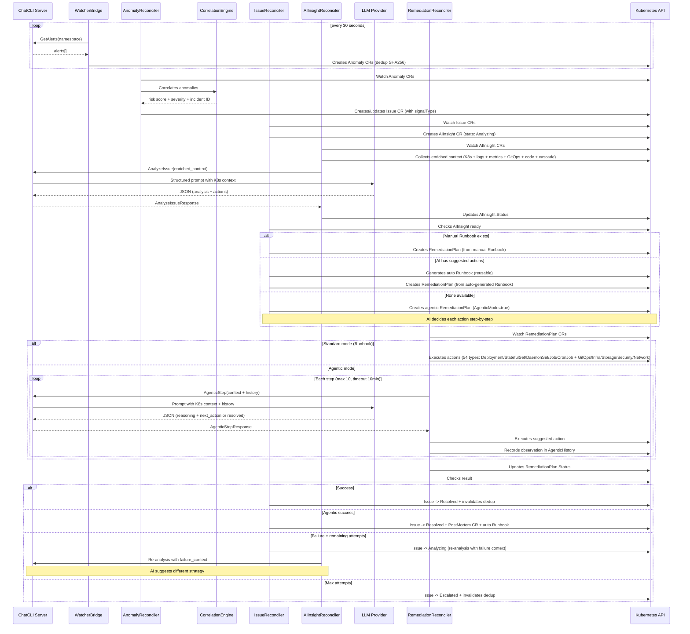
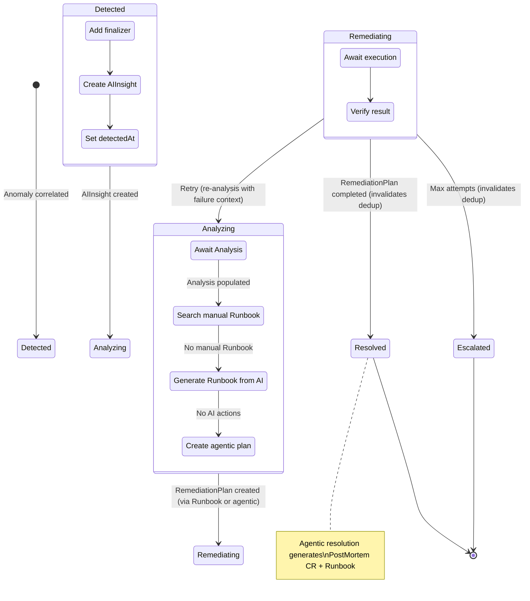
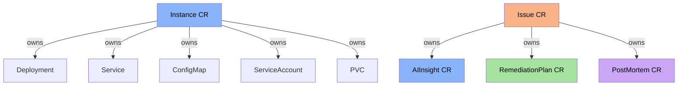

The ChatCLI **AIOps Platform** is an autonomous system that detects problems in Kubernetes, analyzes root causes with AI, and executes automatic remediations -- all orchestrated by native Kubernetes CRDs.

This page covers the internal architecture in depth. For configuration and usage examples, see [K8s Operator](/features/k8s-operator).


## Platform v2 Components

<CardGroup cols={3}>
  <Card title="Notifications" icon="bell" href="/en/features/aiops/notifications">
    NotificationPolicy & EscalationPolicy
  </Card>
  <Card title="SLO & SLA" icon="bullseye" href="/en/features/aiops/slo-sla">
    ServiceLevelObjective & IncidentSLA
  </Card>
  <Card title="Approvals" icon="check-double" href="/en/features/aiops/approvals">
    ApprovalPolicy & ApprovalRequest
  </Card>
  <Card title="Multi-Cluster" icon="globe" href="/en/features/aiops/multi-cluster">
    ClusterRegistration & Federation
  </Card>
  <Card title="Audit" icon="scroll" href="/en/features/aiops/audit">
    AuditEvent (immutable trail)
  </Card>
  <Card title="Chaos Engineering" icon="explosion" href="/en/features/aiops/chaos">
    ChaosExperiment with safety checks
  </Card>
</CardGroup>

### REST API & Dashboard

In addition to gRPC, the operator now exposes a **REST HTTP API** on port `:8090` with **30+ endpoints** covering incidents, SLOs, runbooks, approvals, postmortems, analytics, clusters and audit. Authentication is via `X-API-Key` with role mapping (viewer/operator/admin), rate limited at 100 req/min per key. A **Web Dashboard** is embedded and served at `/`.

For the complete reference, see the [API Reference](/en/reference/api/overview).


## Pipeline Overview




## Internal Components

### 1. WatcherBridge (`watcher_bridge.go`)

The WatcherBridge is the pipeline entry point. It implements the controller-runtime `manager.Runnable` interface and runs as a manager-managed goroutine.

**Responsibilities:**

| Function | Description |
|----------|-------------|
| `Start()` | Starts the polling loop (30s) with cancelable context |
| `poll()` | Queries GetAlerts and creates Anomaly CRs |
| `discoverAndConnect()` | Discovers server via Instance CRs in the cluster |
| `createAnomaly()` | Converts alert -> Anomaly CR with reference labels |
| `alertHash()` | SHA256(type\|deployment\|namespace) for dedup |
| `InvalidateDedupForResource()` | Removes dedup entries for a deployment+namespace |
| `sanitizeK8sName()` | Ensures valid names for K8s objects (63 chars, lowercase, no special characters) |

**SHA256 Dedup:**

```text
hash = SHA256(alertType | deployment | namespace)
```

- **No temporal component**: A continuous problem (e.g., CrashLoopBackOff) generates only one Anomaly
- **TTL**: 2 hours -- expired hashes are pruned automatically
- **Invalidation**: When an Issue reaches a terminal state (Resolved/Escalated), dedup entries for the affected resource are invalidated, allowing immediate recurrence detection
- **Result**: Avoids duplicates during an active problem; detects recurrence after resolution

**Server Discovery:**

<Steps>
  <Step title="Lists Instance CRs in the cluster">
  </Step>
  <Step title="Selects the first Instance with Status.Ready=true">
  </Step>
  <Step title="Connects via gRPC insecure (10s timeout)">
  </Step>
  <Step title="Retry">
    If the connection fails, retries on the next poll cycle.
  </Step>
</Steps>

### 2. AnomalyReconciler (`anomaly_controller.go`)

Watches Anomaly CRs and correlates them into Issues.

**Flow:**

<Steps>
  <Step title="Receives Anomaly CR">
    Newly created Anomaly with `Status.Correlated = false`.
  </Step>
  <Step title="Groups anomalies">
    Calls `CorrelationEngine.FindRelatedAnomalies()` to group.
  </Step>
  <Step title="Calculates risk score and severity">
  </Step>
  <Step title="Creates or updates Issue CR">
  </Step>
  <Step title="Marks Anomaly as correlated">
    Sets `Correlated = true` with reference to the Issue.
  </Step>
</Steps>

### 3. CorrelationEngine (`correlation.go`)

Correlation engine that groups anomalies into incidents.

**Correlation Algorithm:**

```text
For each new anomaly:
  1. Generates incident_id = hash(resource_kind + resource_name + namespace + signal_type)
  2. Searches for existing Issue with the same incident_id
  3. If exists -> adds anomaly to Issue, recalculates risk score
  4. If not exists -> creates new Issue
```

**Risk Scoring:**

| Signal | Weight | Justification |
|--------|--------|---------------|
| `oom_kill` | 30 | Indicates severe memory problem |
| `error_rate` | 25 | Direct impact on users |
| `deploy_failing` | 25 | Service unavailability |
| `latency_spike` | 20 | Performance degradation |
| `pod_restart` | 20 | Pod instability |
| `pod_not_ready` | 20 | Reduced capacity |

**Severity Classification:**

```text
risk_score >= 80 -> Critical
risk_score >= 60 -> High
risk_score >= 40 -> Medium
risk_score <  40 -> Low
```

**Example**: A deployment with `oom_kill` (30) + `pod_restart` (20) = risk 50 -> **Medium**. If adding `error_rate` (25) = risk 75 -> **High**.

**Source Mapping:**

| Anomaly Source | Issue Source |
|---------------|-------------|
| `watcher` | `watcher` |
| `prometheus` | `prometheus` |
| `manual` | `manual` |

### 4. IssueReconciler (`issue_controller.go`)

Manages the complete lifecycle of an Issue through a state machine.

**States and Transitions:**



<AccordionGroup>
  <Accordion title="handleDetected()">
    1. Sets `detectedAt` and `maxRemediationAttempts` (default: 3)
    2. Creates AIInsight CR with owner reference (Issue -> AIInsight)
    3. Transitions to `Analyzing`
    4. Requeues after 10 seconds
  </Accordion>
  <Accordion title="handleAnalyzing()">
    1. Checks if AIInsight has `Analysis` populated
    2. Searches for matching manual Runbook (`findMatchingRunbook` -- tiered matching)
    3. If manual Runbook found -> `createRemediationPlan()` (manual has precedence)
    4. If no manual Runbook but AIInsight has `SuggestedActions` -> `generateRunbookFromAI()` -> `createRemediationPlan()` using the auto-generated Runbook
    5. If none -> `createAgenticRemediationPlan()` (AgenticMode=true, no pre-defined actions -- AI decides each step)
    6. Transitions to `Remediating`
  </Accordion>
  <Accordion title="findMatchingRunbook() -- Tiered Matching">
    - **Tier 1**: SignalType + Severity + ResourceKind (exact match, preferred)
    - **Tier 2**: Severity + ResourceKind (fallback when signal doesn't match)
    - `SignalType` resolved from: `issue.Spec.SignalType` -> fallback `issue.Labels["platform.chatcli.io/signal"]`
  </Accordion>
  <Accordion title="generateRunbookFromAI()">
    - Materializes `SuggestedActions` from AI as a reusable Runbook CR
    - Name: `auto-{signal}-{severity}-{kind}` (sanitized)
    - Labels: `platform.chatcli.io/auto-generated=true`
    - Trigger: SignalType + Severity + ResourceKind (for future reuse)
    - Uses `CreateOrUpdate` for idempotency
  </Accordion>
  <Accordion title="handleRemediating()">
    1. Finds the most recent RemediationPlan (`findLatestRemediationPlan`)
    2. If `Completed` -> Issue `Resolved` + invalidates dedup for the resource
       - If agentic plan: generates **PostMortem CR** (timeline, root cause, impact, lessons) + **reusable Runbook** from successful steps
    3. If `Failed` and remaining attempts -> **re-analysis**: collects failure evidence (`collectFailureEvidence`), clears AIInsight analysis, returns to `Analyzing` state with failure context
    4. If `Failed` and max attempts -> `Escalated` + invalidates dedup for the resource
  </Accordion>
</AccordionGroup>

**Retry with Strategy Escalation:**
- Each retry triggers AI re-analysis with context from previous failures
- AI receives `previous_failure_context` with evidence from failed attempts
- The prompt instructs: "Do not repeat the same actions. Analyze why they failed and suggest a fundamentally different approach"
- Generates new auto-generated Runbook with different strategy (name includes attempt)

**Remediation Priority:**

```text
1. Existing manual Runbook (tiered match: SignalType+Severity+Kind -> Severity+Kind)
2. AI auto-generated Runbook (materialized as reusable CR)
3. Escalation (last resort)
```

### 5. AIInsightReconciler (`aiinsight_controller.go`)

Watches AIInsight CRs and calls the `AnalyzeIssue` RPC to populate the analysis.

**Flow:**

<Steps>
  <Step title="Checks existing analysis">
    Checks if `Status.Analysis` is already populated (skip if yes).
  </Step>
  <Step title="Checks connectivity">
    Checks if server is connected (requeue 15s if not).
  </Step>
  <Step title="Fetches context">
    Fetches parent Issue for context.
  </Step>
  <Step title="Collects K8s context">
    Collects K8s context via `KubernetesContextBuilder` (deployment, pods, events, revisions).
  </Step>
  <Step title="Reads failure context">
    Reads failure context from annotation `platform.chatcli.io/failure-context` (if re-analysis).
  </Step>
  <Step title="Builds request">
    Builds `AnalyzeIssueRequest` with Issue data + K8s context + failure context.
  </Step>
  <Step title="Calls AnalyzeIssue RPC">
    Calls `AnalyzeIssue` RPC via `ServerClient`.
  </Step>
  <Step title="Populates status">
    Populates `Status.Analysis`, `Confidence`, `Recommendations`, `SuggestedActions`. Clears `failure-context` annotation after re-analysis completes.
  </Step>
</Steps>

**KubernetesContextBuilder (`k8s_context.go`):**

Collects real cluster context for **Deployments, StatefulSets, DaemonSets, Jobs, CronJobs, and HPAs** (max 12000 chars):
- **Resource Status**: replicas, conditions, containers, images + resources (each type has a dedicated context builder)
- **StatefulSet**: replicas, update strategy, partition, PodManagementPolicy, VolumeClaimTemplates
- **DaemonSet**: desired/current/ready/available/unavailable, nodeSelector, tolerations
- **Job/CronJob**: active/succeeded/failed, completions, parallelism, schedule, lastSuccessful
- **HPA**: min/max replicas, current/desired, target utilization, current metrics, maxed-out detection
- **Pod Details** (up to 5 pods, unhealthy first): phase, restart count, container states
- **Recent Events** (last 15): type, reason, message, count
- **Revision History**: Last 5 revisions (ReplicaSets) with image diff between revisions

**LogAnalyzer (`log_analyzer.go`):**

Advanced application log analysis (beyond the basic 50-line tail):
- **Stack Trace Extraction**: detects and extracts stack traces from **Java** (Exception/Caused by), **Go** (panic/goroutine), **Python** (Traceback), **Node.js** (Error at)
- **Error Pattern Detection**: 24+ critical patterns categorized (crash, connectivity, dns, auth, storage, tls, database, cache, messaging)
- **Structured Log Parsing**: extracts error/warn entries from JSON logs (fields level, msg, error, timestamp, logger)
- **Init Container Logs**: analyzes init container logs (reveals startup failures)
- **Sidecar Logs**: analyzes sidecar logs (istio-proxy, envoy, datadog-agent, etc.)
- **Critical Lines**: extracts FATAL/PANIC lines with 3 lines of context before/after
- **Temporal Window**: fetches logs by temporal window (10min before the incident), not just tail

**MetricsCollector (`metrics_collector.go`):**

Prometheus queries for quantitative data during analysis:
- **CPU/Memory**: usage trends 30min before → during → 15min after the incident
- **Request/Error Rate**: HTTP requests and 5xx per second
- **Latency**: P50, P95, P99 histogram percentiles
- **HPA Metrics**: current vs desired replicas, CPU target
- **Network**: receive/transmit bytes/s
- **Trend Analysis**: detects spikes, drops, sustained_high/low with % change calculation
- **Enabled via**: `PROMETHEUS_URL` env var on the operator

**GitOpsDetector (`gitops_detector.go`):**

Detects and integrates with GitOps tools:
- **Helm Releases**: detects via Secrets type `helm.sh/release.v1`, status (deployed/failed/pending-upgrade), chart version, previous revision for rollback
- **ArgoCD Applications**: sync status (Synced/OutOfSync), health (Healthy/Degraded), conditions, last sync result
- **Flux Kustomizations**: ready status, source ref, conditions, last applied

**SourceCodeAnalyzer (`source_controller.go`):**

Code-aware diagnostics when `SourceRepository` CRD is configured:
- **Git Correlation**: finds commits in the 30min before the incident
- **Suspected Commit**: identifies the most likely commit (score by temporal proximity + volume of changes)
- **Code Extraction**: extracts code snippets referenced in stack traces (file path + line number → source code)
- **Config Analysis**: reads Dockerfile, values.yaml, Chart.yaml for deploy context

**CascadeAnalyzer (`cascade_analyzer.go`):**

Cross-service cascade failure analysis:
- **Dependency Graph**: discovers dependencies via Services + EndpointSlices
- **Temporal Correlation**: finds active issues in the same namespace and cross-namespace within a 15-20min window
- **Cascade Chain**: orders services by detection time (first = root cause)
- **Root Cause Service**: identifies the service that originated the cascade

**BlastRadiusPredictor (`blast_radius.go`):**

Impact prediction before action execution:
- **PDB Check**: verifies if the action would violate PodDisruptionBudgets
- **Quota Check**: verifies ResourceQuotas (>90% used = warning)
- **Node Capacity**: counts pods on node for cordon/drain actions
- **Affected Services**: discovers which Services would be impacted
- **Risk Level**: classifies as low/medium/high/critical

**AnalyzeIssueRequest:**

| Field | Source | Description |
|-------|--------|-------------|
| `issue_name` | Issue.Name | Issue name |
| `namespace` | Issue.Namespace | Namespace |
| `resource_kind` | Issue.Spec.Resource.Kind | Resource type (Deployment) |
| `resource_name` | Issue.Spec.Resource.Name | Deployment name |
| `signal_type` | Issue.Spec.SignalType / labels | Signal type |
| `severity` | Issue.Spec.Severity | Severity |
| `description` | Issue.Spec.Description | Problem description |
| `risk_score` | Issue.Spec.RiskScore | Risk score |
| `provider` | AIInsight.Spec.Provider | LLM provider |
| `model` | AIInsight.Spec.Model | LLM model |
| `kubernetes_context` | 6 enrichers combined | K8s status (Deploy/STS/DS/Job/CronJob/HPA) + **log analysis** (stack traces, error patterns) + **Prometheus metrics** (trends) + **GitOps** (Helm/ArgoCD/Flux) + **source code** (commits, code snippets) + **cascade analysis** + **RCA enrichment** |
| `previous_failure_context` | Annotation on AIInsight | Evidence from previous attempts (retries) |

### 6. RemediationReconciler (`remediation_controller.go`)

Executes the actions defined in a RemediationPlan.

**Supported Actions (54 types across 9 categories):**

**Deployment / Generic (19 actions):**

| Category | Type | What It Does | Key Parameters |
|----------|------|-------------|----------------|
| Workload | `ScaleDeployment` | Adjusts Deployment replicas | `replicas` |
| Workload | `RestartDeployment` | Rollout restart via annotation | -- |
| Workload | `RollbackDeployment` | Rollback to previous/healthy/specific revision (via ReplicaSet) | `toRevision` |
| Workload | `PatchConfig` | Updates ConfigMap data | `configmap`, `key=value` |
| Workload | `AdjustResources` | Adjusts CPU/memory on Deployment containers | `container`, `memory_limit`, `cpu_limit`, etc. |
| Workload | `DeletePod` | Removes the sickest pod (auto-selects) | `pod` (optional) |
| Workload | `RestartStatefulSetPod` | Restart specific StatefulSet pod or rolling restart | `pod` (optional) |
| GitOps | `HelmRollback` | Rollback Helm release | `revision` |
| GitOps | `ArgoSyncApp` | Trigger ArgoCD sync | `revision` |
| Autoscaling | `AdjustHPA` | Modifies HPA min/max/target | `minReplicas`, `maxReplicas`, `targetCPUUtilization` |
| Infra | `CordonNode` | Marks node unschedulable | `node` |
| Infra | `DrainNode` | Cordons and evicts pods from node | `node` |
| Storage | `ResizePVC` | Expands PVC (no shrinking) | `pvc`, `size` |
| Security | `RotateSecret` | Updates Secret values or copies from source | `secret`, `sourceSecret` or `key=value` |
| Networking | `UpdateIngress` | Modifies Ingress backend/annotations | `ingress`, `backendService`, `backendPort` |
| Networking | `PatchNetworkPolicy` | Adds ports to NetworkPolicy ingress rules | `networkPolicy`, `allowPort`, `protocol` |
| Advanced | `ApplyManifest` | Applies JSON manifest from ConfigMap | `configmap`, `key` |
| Advanced | `ExecDiagnostic` | Runs whitelisted diagnostic command in pod | `command`, `pod`, `container` |
| -- | `Custom` | **Blocked** -- requires manual approval | -- |

**StatefulSet (9 actions):**

| Type | What It Does | Key Parameters |
|------|-------------|----------------|
| `ScaleStatefulSet` | Ordered replica scaling | `replicas` |
| `RestartStatefulSet` | Rolling restart via annotation (ordered) | -- |
| `RollbackStatefulSet` | Rollback via ControllerRevision (not ReplicaSet) | `toRevision` (previous\|N) |
| `AdjustStatefulSetResources` | Adjusts CPU/memory on StatefulSet containers | `container`, `memory_limit`, `cpu_limit`, etc. |
| `DeleteStatefulSetPod` | Deletes specific or unhealthiest pod (preserves PVC identity) | `pod` (optional) |
| `ForceDeleteStatefulSetPod` | Force-delete stuck Terminating pod (grace=0) | `pod` (REQUIRED) |
| `UpdateStatefulSetStrategy` | Changes updateStrategy type | `type` (RollingUpdate\|OnDelete), `maxUnavailable` |
| `RecreateStatefulSetPVC` | Deletes stuck PVC for recreation | `pvc`, `confirm=true` (REQUIRED) |
| `PartitionStatefulSetUpdate` | Sets partition for canary rollout | `partition` |

**DaemonSet (7 actions):**

| Type | What It Does | Key Parameters |
|------|-------------|----------------|
| `RestartDaemonSet` | Rolling restart of all DaemonSet pods across nodes | -- |
| `RollbackDaemonSet` | Rollback via ControllerRevision | `toRevision` (previous\|N) |
| `AdjustDaemonSetResources` | Adjusts CPU/memory on DaemonSet containers | `container`, `memory_limit`, `cpu_limit`, etc. |
| `DeleteDaemonSetPod` | Deletes pod (optionally on specific node) | `pod` or `node` (optional) |
| `UpdateDaemonSetStrategy` | Changes update strategy | `type`, `maxUnavailable`, `maxSurge` |
| `PauseDaemonSetRollout` | Pauses rollout (sets maxUnavailable=0) | -- |
| `CordonAndDeleteDaemonSetPod` | Cordons node + deletes DaemonSet pod on it | `node` (REQUIRED) |

**Job (9 actions):**

| Type | What It Does | Key Parameters |
|------|-------------|----------------|
| `RetryJob` | Deletes failed Job + recreates from spec | -- |
| `AdjustJobResources` | Adjusts CPU/memory on Job template | `container`, `memory_limit`, `cpu_limit`, etc. |
| `DeleteFailedJob` | Cleans up a failed Job and its pods | -- |
| `SuspendJob` | Pauses a running Job (suspend=true) | -- |
| `ResumeJob` | Resumes a suspended Job (suspend=false) | -- |
| `AdjustJobParallelism` | Changes Job parallelism | `parallelism` |
| `AdjustJobDeadline` | Changes activeDeadlineSeconds | `activeDeadlineSeconds` |
| `AdjustJobBackoffLimit` | Changes backoffLimit | `backoffLimit` |
| `ForceDeleteJobPods` | Force-deletes all pods of a Job (grace=0) | -- |

**CronJob (10 actions):**

| Type | What It Does | Key Parameters |
|------|-------------|----------------|
| `SuspendCronJob` | Pauses CronJob scheduling (suspend=true) | -- |
| `ResumeCronJob` | Resumes CronJob scheduling (suspend=false) | -- |
| `TriggerCronJob` | Creates a Job from CronJob template immediately | -- |
| `AdjustCronJobResources` | Adjusts CPU/memory on jobTemplate containers | `container`, `memory_limit`, `cpu_limit`, etc. |
| `AdjustCronJobSchedule` | Changes cron schedule expression | `schedule` |
| `AdjustCronJobDeadline` | Changes startingDeadlineSeconds | `startingDeadlineSeconds` |
| `AdjustCronJobHistory` | Changes success/failure history limits | `successfulJobsHistoryLimit`, `failedJobsHistoryLimit` |
| `AdjustCronJobConcurrency` | Changes concurrencyPolicy | `concurrencyPolicy` (Allow\|Forbid\|Replace) |
| `DeleteCronJobActiveJobs` | Kills all currently running Jobs | -- |
| `ReplaceCronJobTemplate` | Replaces jobTemplate from ConfigMap JSON | `configmap`, `key` |

<Warning>
**Safety Checks (pre-execution):** Scale to 0 replicas blocked (Deployment and StatefulSet). AdjustResources limit cannot be less than request (all resource types). DeletePod/DeleteStatefulSetPod refuses if only 1 pod exists. ForceDeleteStatefulSetPod requires explicit pod name. RecreateStatefulSetPVC requires `confirm=true`. Custom actions are blocked. Blast radius prediction checks PDB violations, resource quotas, and affected services before execution — now generalized for all workload types via `getPodTemplateLabels`.

**Automatic Rollback (post-failure):** Before any action, a structured `ResourceSnapshot` captures the complete resource state. For Deployments: replicas, images, CPU/memory, HPA. For StatefulSets: replicas, containers, updateStrategy, partition. For DaemonSets: containers, updateStrategy, maxUnavailable. For Jobs: suspend, parallelism, backoffLimit, activeDeadlineSeconds, containers. For CronJobs: suspend, schedule, concurrencyPolicy, history limits, containers. If an action fails or health verification expires (90s), the `RollbackEngine` automatically restores the resource to the pre-remediation state. Works for Deployments, StatefulSets, DaemonSets, Jobs, CronJobs, Nodes, and HPAs.
</Warning>

**Execution Flow (Standard):**

```text
Pending -> Snapshot -> Executing -> (checkpoint + action, for each action)
  -> Verifying (90s timeout) -> Completed
  -> If action fails -> Automatic rollback -> RolledBack
  -> If verification fails -> Automatic rollback -> RolledBack
  -> If rollback fails -> Failed
```

**Execution Flow (Agentic):**

```text
Pending -> Executing -> (agentic loop: AI decides -> executes -> observes -> repeat)
  -> Verifying -> Completed | Failed

Each reconcile = 1 step of the agentic loop:
  1. Refresh K8s context (KubernetesContextBuilder)
  2. Send history + context -> AgenticStep RPC
  3. AI responds: {reasoning, resolved, next_action}
  4. If resolved=true -> Verifying (+ annotations with PostMortem data)
  5. If next_action -> execute -> record observation -> requeue 5s
  6. If observation-only -> record -> requeue 10s
  Safety: max 10 steps, timeout 10 minutes
```

### 7. ServerClient (`grpc_client.go`)

Shared gRPC client between WatcherBridge and AIInsightReconciler.

| Method | Description |
|--------|-------------|
| `NewServerClient()` | Creates instance (no connection) |
| `Connect(addr)` | Connects via gRPC insecure (10s timeout) |
| `GetAlerts(namespace)` | Fetches alerts from the watcher |
| `AnalyzeIssue(req)` | Sends issue for AI analysis |
| `AgenticStep(req)` | Executes one step of the agentic loop (context + history -> next action) |
| `IsConnected()` | Checks if connection is active |
| `Close()` | Closes gRPC connection |


## Server and Operator Interaction

### GetAlerts RPC

The server exposes K8s Watcher alerts via gRPC:

```protobuf
rpc GetAlerts(GetAlertsRequest) returns (GetAlertsResponse);

message AlertInfo {
  string alert_type = 1;    // HighRestartCount, OOMKilled, PodNotReady, DeploymentFailing
  string deployment = 2;
  string namespace = 3;
  string message = 4;
  string severity = 5;
  int64 timestamp = 6;
}
```

The server handler iterates over the `ObservabilityStore` of each MultiWatcher target, filters by namespace if specified, and returns active alerts.

### AnalyzeIssue RPC

The server receives the Issue context and calls the LLM for analysis:

```protobuf
rpc AnalyzeIssue(AnalyzeIssueRequest) returns (AnalyzeIssueResponse);

message SuggestedAction {
  string name = 1;
  string action = 2;
  string description = 3;
  map<string, string> params = 4;
}

message AnalyzeIssueResponse {
  string analysis = 1;
  float confidence = 2;
  repeated string recommendations = 3;
  string provider = 4;
  string model = 5;
  repeated SuggestedAction suggested_actions = 6;
}
```

**Structured Prompt:**

The server builds a prompt that includes:

1. Issue context (name, namespace, resource, severity, risk score, description)
2. List of **19 available actions** organized by category (Workload, GitOps, Autoscaling, Infra, Storage, Security, Networking, Advanced)
3. Instructions to return structured JSON with `analysis`, `confidence`, `recommendations`, and `actions` fields

**Response Parsing:**

1. Removes markdown codeblocks (`` ```json ... ``` ``)
2. Parses JSON into `analysisResult`
3. Clamps confidence between 0.0 and 1.0
4. If parsing fails -> uses raw response as analysis with confidence 0.5

### AgenticStep RPC

The server receives the Issue context, history of previous steps, and updated K8s context, and decides the next action:

```protobuf
rpc AgenticStep(AgenticStepRequest) returns (AgenticStepResponse);

message AgenticStepRequest {
  string issue_name = 1;
  string namespace = 2;
  string resource_kind = 3;
  string resource_name = 4;
  string signal_type = 5;
  string severity = 6;
  string description = 7;
  int32 risk_score = 8;
  string provider = 9;
  string model = 10;
  string kubernetes_context = 11;   // refreshed at each step
  repeated AgenticHistoryEntry history = 12;
  int32 max_steps = 13;
  int32 current_step = 14;
}

message AgenticStepResponse {
  string reasoning = 1;              // AI reasoning (recorded in history)
  bool resolved = 2;                 // true = problem resolved
  SuggestedAction next_action = 3;   // null when resolved=true
  // Fields below only populated when resolved=true:
  string postmortem_summary = 4;
  string root_cause = 5;
  string impact = 6;
  repeated string lessons_learned = 7;
  repeated string prevention_actions = 8;
}
```

**AgenticStep Prompt:**

The server builds a structured prompt with:

1. **Role + Issue details**: incident context (type, severity, resource)
2. **Kubernetes context**: real cluster state (refreshed at each step via KubernetesContextBuilder)
3. **Tool definitions**: 18 available mutating actions + "Observe" (no action, wait for next context)
4. **Conversation history**: each previous step formatted with reasoning -> action -> observation
5. **Instructions**: respond JSON, budget (step N of M), safety rules

When `resolved=true`, the response includes data for PostMortem generation (summary, root_cause, impact, lessons_learned, prevention_actions).


## PostMortem Generation

When **any remediation** resolves an Issue (standard or agentic), the `IssueReconciler` automatically generates:

### PostMortem CR

Created via `generatePostMortem()`:

| Field | Source |
|-------|--------|
| `timeline` | Issue.DetectedAt + each step from AgenticHistory + resolved |
| `actionsExecuted` | Steps with Action != nil (includes result) |
| `summary` | Annotation `platform.chatcli.io/postmortem-summary` (AI-generated) |
| `rootCause` | Annotation `platform.chatcli.io/root-cause` |
| `impact` | Annotation `platform.chatcli.io/impact` |
| `lessonsLearned` | Annotation `platform.chatcli.io/lessons-learned` |
| `preventionActions` | Annotation `platform.chatcli.io/prevention-actions` |
| `duration` | Calculated: resolvedAt - detectedAt |

In addition to the fields above, the PostMortem is automatically enriched with:
- **Trending**: detection of recurring incidents (count in the last 30 days, related PostMortems)
- **Cascade Chain**: cascade failure chain if there are correlated cross-service issues
- **Git Correlation**: suspected commit (SHA, author, changed files, confidence)
- **GitOps Context**: Helm/ArgoCD/Flux state at the time of the incident

The PostMortem CR is owned by the Issue (cascade delete).

### Auto-generated Runbook (Agentic)

Created via `generateAgenticRunbook()`:

- **Name**: `agentic-{signal}-{severity}-{kind}` (sanitized)
- **Steps**: only steps with successful actions
- **Labels**: `auto-generated=true`, `source=agentic`
- Uses `CreateOrUpdate` (reused for future incidents of the same type)


## Operator Prometheus Metrics

The operator exposes Prometheus metrics for observability:

| Metric | Type | Description |
|--------|------|-------------|
| `chatcli_operator_issues_total` | Counter | Total issues by severity and state |
| `chatcli_operator_issue_resolution_duration_seconds` | Histogram | Duration from detection to resolution |
| `chatcli_operator_active_issues` | Gauge | Number of unresolved issues |


## Tests

The operator has 130 tests (185 with subtests) covering all components:

| Component | Tests | Coverage |
|-----------|-------|---------|
| InstanceReconciler | 15 | CRUD, watcher, persistence, replicas, RBAC, deletion, deepcopy |
| AnomalyReconciler | 4 | Creation, correlation, attachment to existing Issue |
| IssueReconciler | 12 | State machine, AI fallback, retry, agentic plan, PostMortem generation |
| RemediationReconciler | 38 | All 54 action types (Deployment + StatefulSet + DaemonSet + Job + CronJob), safety constraints, agentic loop, rollback, verification |
| AIInsightReconciler | 12 | Connectivity, mock RPC, analysis parsing, withAuth, TLS/token |
| PostMortemReconciler | 2 | State initialization, terminal state |
| WatcherBridge | 22 | Alert mapping, SHA256 dedup, hash, pruning, Anomaly creation, buildConnectionOpts (TLS, token, both) |
| CorrelationEngine | 4 | Risk scoring, severity, incident ID, related anomalies |
| Pipeline (E2E) | 3 | Complete flow: Anomaly->Issue->Insight->Plan->Resolved, escalation, correlation |
| MapActionType | 6+17 | All 54 string->enum mappings including StatefulSet, DaemonSet, Job, CronJob actions |

### Run Tests

```bash
cd operator
go test ./... -v
```


## Ownership Diagram (Garbage Collection)



- **Instance** is the owner of all Kubernetes resources it creates (Deployment, Service, ConfigMap, SA, PVC)
- **Issue** is the owner of AIInsight, RemediationPlan, and PostMortem (cascade delete)
- Anomalies are independent (no owner) to preserve history


## AIOps Deployment Checklist

<Steps>
  <Step title="Install Operator via Helm (CRDs + RBAC + Deployment + Dashboard)">
    ```bash
    helm install chatcli-operator \
      oci://ghcr.io/diillson/charts/chatcli-operator \
      --namespace chatcli-system --create-namespace
    ```
  </Step>
  <Step title="Create Secret with API keys">
    Create the Secret with the API keys for your chosen LLM provider.
  </Step>
  <Step title="Create Instance CR">
    Create the Instance CR with `watcher.enabled: true` and configured targets.
  </Step>
  <Step title="Verify server">
    `kubectl get instances` -- confirm that the ChatCLI server is running.
  </Step>
  <Step title="Verify AIOps pipeline">
    - `kubectl get anomalies -A` -- anomalies being detected
    - `kubectl get issues -A` -- issues being created
    - `kubectl get aiinsights -A` -- AI analyzing
  </Step>
  <Step title="(Optional) Create manual Runbooks">
    Create manual Runbooks for specific scenarios.
  </Step>
  <Step title="Monitor metrics">
    Monitor operator metrics via Prometheus.
  </Step>
</Steps>


## Next Steps

<CardGroup cols={2}>
  <Card title="K8s Operator" icon="dharmachakra" href="/features/k8s-operator">
    Configuration and examples
  </Card>
  <Card title="K8s Watcher" icon="binoculars" href="/features/k8s-watcher">
    Collection and budget details
  </Card>
  <Card title="Server Mode" icon="server" href="/features/server-mode">
    GetAlerts, AnalyzeIssue, and AgenticStep RPCs
  </Card>
  <Card title="K8s Monitoring" icon="book" href="/cookbook/k8s-monitoring">
    Recipe: K8s Monitoring with AI
  </Card>
</CardGroup>
