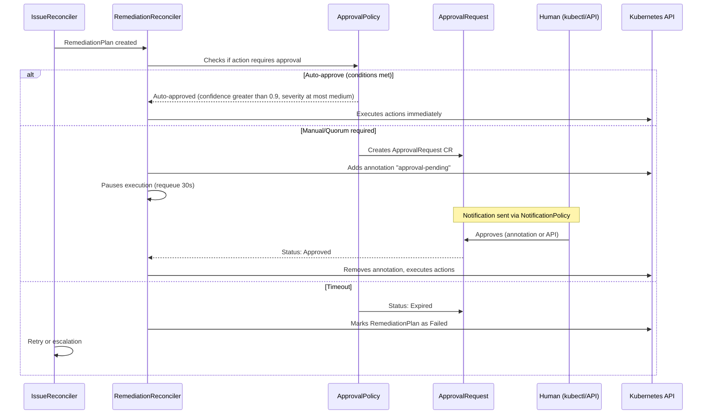
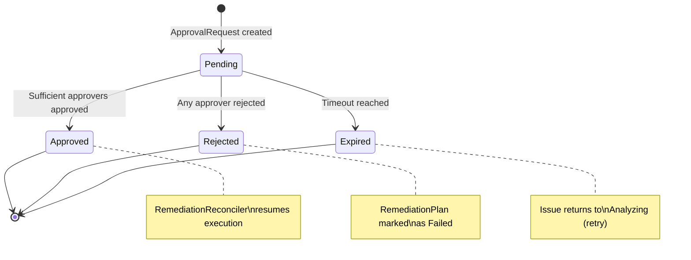
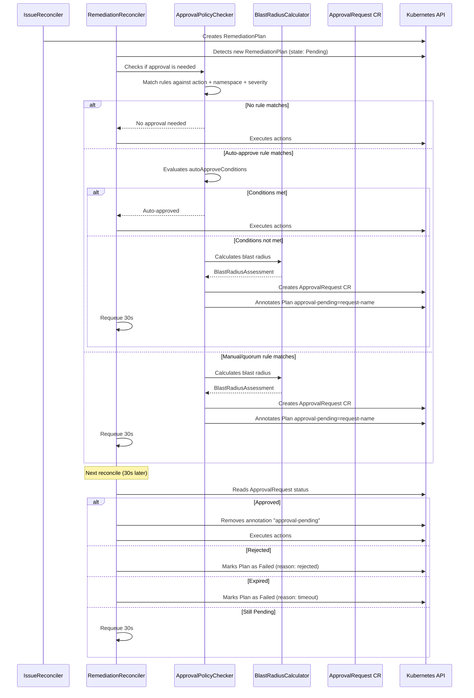

In production environments, not every automatic remediation should be executed without human oversight. The ChatCLI **Approval Workflow** system allows defining granular policies that control which actions require approval, who can approve, and during which change windows actions are allowed.


## Why Approval Workflows are Essential

<CardGroup cols={3}>
  <Card title="Security" icon="shield">
    Prevents automatic remediation from causing greater impact than the original problem (e.g., accidental rollback in production)
  </Card>
  <Card title="Compliance" icon="file-certificate">
    Complete audit trail of who approved, when, and why. Required for SOC2, PCI-DSS, HIPAA.
  </Card>
  <Card title="Trust" icon="handshake">
    Teams adopt AIOps more easily when they know that critical actions require human approval.
  </Card>
</CardGroup>

Without approval workflows, an AI that detects a false positive could execute an unnecessary rollback, affecting a healthy deployment. With approval policies, high-impact actions are blocked until a human validates the analysis and blast radius.


## Flow Overview




## ApprovalPolicy CRD

The `ApprovalPolicy` defines **rules** that determine which remediation actions need approval, under which conditions, and who can approve.

```yaml
apiVersion: platform.chatcli.io/v1alpha1
kind: ApprovalPolicy
metadata:
  name: production-approval-policy
  namespace: production
spec:
  rules:
    - name: auto-approve-low-risk
      match:
        severities: [low, medium]
        actionTypes: [RestartDeployment, ScaleDeployment]
        namespaces: [staging, development]
      mode: auto
      autoApproveConditions:
        minConfidence: 0.85
        maxSeverity: medium
        historicalSuccessRate: 0.90

    - name: manual-approve-rollback
      match:
        actionTypes: [RollbackDeployment]
        namespaces: [production, payments]
      mode: manual
      requiredApprovers: 1
      timeoutMinutes: 30

    - name: quorum-critical-production
      match:
        severities: [critical, high]
        namespaces: [production]
        resourceKinds: [Deployment, StatefulSet]
      mode: quorum
      requiredApprovers: 2
      timeoutMinutes: 15

    - name: block-critical-namespace-rollback
      match:
        actionTypes: [RollbackDeployment]
        namespaces: [payments, auth]
        severities: [critical]
      mode: manual
      requiredApprovers: 2
      timeoutMinutes: 10

  changeWindow:
    timezone: "America/Sao_Paulo"
    allowedDays: [1, 2, 3, 4, 5]    # Monday to Friday
    startHour: 9
    endHour: 18
    overrideForCritical: true         # Critical ignores change window
    blackoutDates:
      - date: "2026-03-20"
        reason: "Q1 pre-release freeze"
      - date: "2026-12-24"
        reason: "Christmas Eve"
      - date: "2026-12-31"
        reason: "New Year's Eve"
```

### Spec Fields

#### ApprovalRule

Each rule defines a **match + mode** pair with specific configurations.

| Field | Type | Required | Description |
|-------|------|:--------:|-------------|
| `name` | string | **Yes** | Unique rule name within the policy |
| `match` | ApprovalMatch | **Yes** | Matching criteria |
| `mode` | string | **Yes** | `auto`, `manual`, `quorum` |
| `requiredApprovers` | int | For manual/quorum | Minimum number of approvers |
| `timeoutMinutes` | int | No | Timeout in minutes (default: `60`) |
| `autoApproveConditions` | AutoApproveConditions | For auto | Conditions for auto-approval |


#### ApprovalMatch

Defines which remediations are covered by this rule. The logic is **AND** between fields and **OR** within each field.

| Field | Type | Description |
|-------|------|-------------|
| `severities` | []string | `critical`, `high`, `medium`, `low` |
| `actionTypes` | []string | `ScaleDeployment`, `RestartDeployment`, `RollbackDeployment`, `PatchConfig`, `AdjustResources`, `DeletePod`, `Custom` |
| `namespaces` | []string | Affected K8s namespaces |
| `resourceKinds` | []string | `Deployment`, `StatefulSet`, `DaemonSet` |

<Note>
When multiple rules match, the **most restrictive** rule prevails. Priority order is: `manual` &gt; `quorum` &gt; `auto`. If one rule requires `quorum` with 2 approvers and another requires `manual` with 1, the system applies `quorum` with 2.
</Note>

#### Three Approval Modes

<Tabs>
  <Tab title="auto">
    **Auto-approve**: The system automatically approves if **all** `autoApproveConditions` are met. Otherwise, it escalates to `manual`.

    | Condition | Type | Description |
    |-----------|------|-------------|
    | `minConfidence` | float64 | Minimum AI analysis confidence (0.0-1.0) |
    | `maxSeverity` | string | Maximum severity for auto-approve |
    | `historicalSuccessRate` | float64 | Minimum historical success rate for this action type |

    ```yaml
    mode: auto
    autoApproveConditions:
      minConfidence: 0.90      # AI has >= 90% confidence
      maxSeverity: medium      # Up to medium severity
      historicalSuccessRate: 0.85  # >= 85% success in similar actions
    ```

    **Evaluation logic:**

    ```text
    auto_approve = (
      ai_confidence >= minConfidence AND
      severity <= maxSeverity AND
      historical_success_rate >= historicalSuccessRate
    )

    If auto_approve = false -> escalates to manual mode (1 approver)
    ```
  </Tab>
  <Tab title="manual">
    **Manual**: Requires explicit approval from at least `requiredApprovers` humans. The RemediationPlan stays paused until approval or timeout.

    ```yaml
    mode: manual
    requiredApprovers: 1
    timeoutMinutes: 30
    ```
  </Tab>
  <Tab title="quorum">
    **Quorum**: Requires approval from `requiredApprovers` people. Ensures that approval does not depend on a single individual.

    ```yaml
    mode: quorum
    requiredApprovers: 2
    timeoutMinutes: 15
    ```

    In this example, at least 2 approvers are needed for the action to be executed.
  </Tab>
</Tabs>

#### ChangeWindowSpec

Defines change windows that control **when** automatic remediation can be executed.

| Field | Type | Required | Description |
|-------|------|:--------:|-------------|
| `timezone` | string | **Yes** | IANA timezone (e.g., `America/Sao_Paulo`) |
| `allowedDays` | []int | **Yes** | Allowed days (0=Sunday, 6=Saturday) |
| `startHour` | int | **Yes** | Window start hour (0-23) |
| `endHour` | int | **Yes** | Window end hour (0-23) |
| `overrideForCritical` | bool | No | If `true`, `critical` severity ignores the change window |
| `blackoutDates` | []BlackoutDate | No | Specific dates with total freeze |

<Warning>
When outside the change window, remediation actions are **queued** (not discarded). They will be automatically executed when the next window opens -- as long as the Issue is still active and the approval has not expired.
</Warning>


## ApprovalRequest CRD

The `ApprovalRequest` is automatically created by the `RemediationReconciler` when an action requires approval. It contains all the information needed for the approver to make an informed decision.

```yaml
apiVersion: platform.chatcli.io/v1alpha1
kind: ApprovalRequest
metadata:
  name: approve-api-gateway-rollback-1234
  namespace: production
  labels:
    platform.chatcli.io/issue: api-gateway-oom-kill-1771276354
    platform.chatcli.io/action-type: RollbackDeployment
    platform.chatcli.io/severity: critical
spec:
  issueRef:
    name: api-gateway-oom-kill-1771276354
  remediationPlanRef:
    name: api-gateway-oom-kill-plan-1
  requestedAction:
    type: RollbackDeployment
    params:
      toRevision: "previous"
  policyRef:
    name: production-approval-policy
    rule: manual-approve-rollback
  requiredApprovers: 1
  timeoutMinutes: 30

  blastRadius:
    affectedPods: 5
    affectedServices:
      - name: api-gateway
        namespace: production
        endpoints: 3
      - name: api-gateway-internal
        namespace: production
        endpoints: 2
    affectedIngresses:
      - name: api-gateway-ingress
        namespace: production
    riskLevel: high
    estimatedDowntime: "30s"
    rollbackAvailable: true

  evidence:
    aiConfidence: 0.87
    analysis: "High restart count caused by OOMKilled. Container memory limit (512Mi) insufficient."
    historicalSuccessRate: 0.92
    similarIncidents: 3
    lastSimilarResolution: "RollbackDeployment to revision 5 (2 days ago, success)"

status:
  state: Pending            # Pending | Approved | Rejected | Expired
  decisions: []
  createdAt: "2026-03-19T14:30:00Z"
  expiresAt: "2026-03-19T15:00:00Z"
```

### Spec Fields

#### Root

| Field | Type | Required | Description |
|-------|------|:--------:|-------------|
| `issueRef` | ObjectRef | **Yes** | Reference to the Issue that originated the request |
| `remediationPlanRef` | ObjectRef | **Yes** | Reference to the paused RemediationPlan |
| `requestedAction` | ActionSpec | **Yes** | Action that requires approval |
| `policyRef` | PolicyRef | **Yes** | Reference to the policy and rule that triggered it |
| `requiredApprovers` | int | **Yes** | Minimum number of approvers |
| `timeoutMinutes` | int | **Yes** | Time until expiration |
| `blastRadius` | BlastRadiusAssessment | **Yes** | Impact assessment |
| `evidence` | ApprovalEvidence | **Yes** | Evidence for decision-making |

#### BlastRadiusAssessment

| Field | Type | Description |
|-------|------|-------------|
| `affectedPods` | int | Number of pods that will be affected by the action |
| `affectedServices` | []ServiceRef | Services that route to the affected pods |
| `affectedIngresses` | []IngressRef | Ingresses that expose the affected services |
| `riskLevel` | string | `critical`, `high`, `medium`, `low` (calculated) |
| `estimatedDowntime` | string | Estimated downtime during the action |
| `rollbackAvailable` | bool | Whether the action can be reverted |

#### ApprovalEvidence

| Field | Type | Description |
|-------|------|-------------|
| `aiConfidence` | float64 | AI analysis confidence level (0.0-1.0) |
| `analysis` | string | AI analysis summary |
| `historicalSuccessRate` | float64 | Success rate of similar actions in history |
| `similarIncidents` | int | Number of similar incidents in the past |
| `lastSimilarResolution` | string | Description of the last similar resolution |

#### ApprovalDecision

Each approval or rejection is recorded as a decision in the status:

| Field | Type | Description |
|-------|------|-------------|
| `approver` | string | Approver identifier (user or system) |
| `decision` | string | `approved` or `rejected` |
| `reason` | string | Justification for the decision |
| `timestamp` | Time | When the decision was made |

#### ApprovalRequest States



<Info>
A single rejection is sufficient to block the action, regardless of the number of approvals. This ensures that any team member can veto a risky action.
</Info>


## Blast Radius Calculator

The blast radius calculator evaluates the potential impact of a remediation action before requesting approval.

### How It Works

<Steps>
  <Step title="Query deployment pods">
    The calculator lists all pods managed by the target deployment using label selectors.

    ```text
    pods = kubectl get pods -l app=api-gateway -n production
    affectedPods = len(pods)  // e.g., 5
    ```
  </Step>
  <Step title="Find services routing to the pods">
    For each Service in the namespace, checks if the selector matches the deployment pod labels.

    ```text
    for service in namespace.services:
      if service.selector matches pod.labels:
        affectedServices.append(service)
    ```
  </Step>
  <Step title="Find ingresses exposing the services">
    For each Ingress in the namespace, checks if it references any of the affected services.

    ```text
    for ingress in namespace.ingresses:
      for rule in ingress.rules:
        if rule.backend.service in affectedServices:
          affectedIngresses.append(ingress)
    ```
  </Step>
  <Step title="Calculate risk level">
    The risk level is determined by the number of affected pods:

    ```text
    if affectedPods > 10:  riskLevel = "critical"
    if affectedPods > 5:   riskLevel = "high"
    if affectedPods > 2:   riskLevel = "medium"
    else:                  riskLevel = "low"
    ```
  </Step>
  <Step title="Estimate downtime">
    Based on the action type:

    | Action | Estimated Downtime |
    |--------|-------------------|
    | `ScaleDeployment` (up) | 0s (no pods removed) |
    | `RestartDeployment` | ~30s (rolling update) |
    | `RollbackDeployment` | ~30-60s (rolling update) |
    | `AdjustResources` | ~30s (rolling update) |
    | `DeletePod` | ~10s (recreation by ReplicaSet) |
    | `PatchConfig` | 0s (no restart) |
  </Step>
</Steps>


## Integration with RemediationReconciler

### Complete Flow



### Control Annotation

The `RemediationReconciler` uses the `platform.chatcli.io/approval-pending` annotation to control the flow:

```yaml
metadata:
  annotations:
    platform.chatcli.io/approval-pending: "approve-api-gateway-rollback-1234"
```

When this annotation is present:
1. The reconciler **does not execute any action**
2. Queries the status of the referenced `ApprovalRequest`
3. Removes the annotation only when the request is `Approved`
4. If `Rejected` or `Expired`, marks the plan as `Failed`


## How to Approve

### Via kubectl

The most direct way to approve is using annotations:

```bash
# Approve
kubectl annotate approvalrequest approve-api-gateway-rollback-1234 \
  -n production \
  platform.chatcli.io/approve="edilson:LGTM, acceptable blast radius"

# Reject
kubectl annotate approvalrequest approve-api-gateway-rollback-1234 \
  -n production \
  platform.chatcli.io/reject="edilson:Risk too high, investigate memory leak first"
```

**Annotation format:**

```text
platform.chatcli.io/approve="<user>:<reason>"
platform.chatcli.io/reject="<user>:<reason>"
```

The `ApprovalRequest` reconciler detects the annotation, records the decision in the status, and removes the annotation.

### Via REST API

The operator exposes a REST API for integrations:

<CodeGroup>

```bash Approve
curl -X POST \
  http://localhost:8090/api/v1/approvals/approve-api-gateway-rollback-1234/approve \
  -H "Content-Type: application/json" \
  -H "Authorization: Bearer $TOKEN" \
  -d '{
    "approver": "edilson",
    "reason": "LGTM, acceptable blast radius. AI confidence 87% with success history."
  }'
```

```bash Reject
curl -X POST \
  http://localhost:8090/api/v1/approvals/approve-api-gateway-rollback-1234/reject \
  -H "Content-Type: application/json" \
  -H "Authorization: Bearer $TOKEN" \
  -d '{
    "approver": "edilson",
    "reason": "Risk too high. Investigate memory leak before rollback."
  }'
```

```bash List pending
curl -X GET \
  http://localhost:8090/api/v1/approvals?state=Pending \
  -H "Authorization: Bearer $TOKEN"
```

```bash Details
curl -X GET \
  http://localhost:8090/api/v1/approvals/approve-api-gateway-rollback-1234 \
  -H "Authorization: Bearer $TOKEN"
```

</CodeGroup>

**API response (example):**

```json
{
  "name": "approve-api-gateway-rollback-1234",
  "namespace": "production",
  "state": "Approved",
  "requestedAction": {
    "type": "RollbackDeployment",
    "params": {"toRevision": "previous"}
  },
  "blastRadius": {
    "affectedPods": 5,
    "riskLevel": "high"
  },
  "decisions": [
    {
      "approver": "edilson",
      "decision": "approved",
      "reason": "LGTM, acceptable blast radius",
      "timestamp": "2026-03-19T14:35:00Z"
    }
  ]
}
```

### Via Slack (interactive)

When integrated with the Slack channel via `NotificationPolicy`, the ApprovalRequest includes interactive buttons in Block Kit:

- **Approve**: Records approval with the Slack user as approver
- **Reject**: Opens a dialog for rejection reason
- **Details**: Expands blast radius and AI evidence

<Note>
The interactive Slack integration requires additional configuration of a Slack App with Interactive Components enabled and a callback endpoint pointing to the operator.
</Note>


## Complete YAML Examples

### Auto-approve for Low Severity + High Confidence

```yaml
apiVersion: platform.chatcli.io/v1alpha1
kind: ApprovalPolicy
metadata:
  name: staging-auto-approve
  namespace: staging
spec:
  rules:
    - name: auto-approve-all-staging
      match:
        severities: [low, medium]
        actionTypes:
          - RestartDeployment
          - ScaleDeployment
          - AdjustResources
          - DeletePod
        namespaces: [staging]
      mode: auto
      autoApproveConditions:
        minConfidence: 0.80
        maxSeverity: medium
        historicalSuccessRate: 0.75

    - name: manual-for-rollback-staging
      match:
        actionTypes: [RollbackDeployment]
        namespaces: [staging]
      mode: manual
      requiredApprovers: 1
      timeoutMinutes: 60

  changeWindow:
    timezone: "America/Sao_Paulo"
    allowedDays: [0, 1, 2, 3, 4, 5, 6]   # All days
    startHour: 0
    endHour: 23
```

### Quorum of 2 Approvers for Production

```yaml
apiVersion: platform.chatcli.io/v1alpha1
kind: ApprovalPolicy
metadata:
  name: production-strict
  namespace: production
spec:
  rules:
    - name: quorum-all-production-actions
      match:
        severities: [critical, high, medium]
        namespaces: [production]
      mode: quorum
      requiredApprovers: 2
      timeoutMinutes: 15

    - name: auto-low-severity-restart
      match:
        severities: [low]
        actionTypes: [RestartDeployment]
        namespaces: [production]
      mode: auto
      autoApproveConditions:
        minConfidence: 0.95
        maxSeverity: low
        historicalSuccessRate: 0.98

  changeWindow:
    timezone: "America/Sao_Paulo"
    allowedDays: [1, 2, 3, 4, 5]
    startHour: 9
    endHour: 18
    overrideForCritical: true
```

### Change Window Weekdays 9-18 UTC

```yaml
apiVersion: platform.chatcli.io/v1alpha1
kind: ApprovalPolicy
metadata:
  name: change-window-policy
  namespace: production
spec:
  rules:
    - name: all-actions-require-approval
      match:
        namespaces: [production]
      mode: manual
      requiredApprovers: 1
      timeoutMinutes: 120

  changeWindow:
    timezone: "UTC"
    allowedDays: [1, 2, 3, 4, 5]    # Monday to Friday
    startHour: 9
    endHour: 18
    overrideForCritical: true
    blackoutDates:
      - date: "2026-03-27"
        reason: "End of Q1 freeze"
      - date: "2026-03-28"
        reason: "End of Q1 freeze"
      - date: "2026-06-30"
        reason: "End of Q2 freeze"
```

<Tip>
Use `overrideForCritical: true` to allow `critical` incidents to be remediated outside the change window. Without this, a critical incident at 3am would be queued until 9am.
</Tip>

### RollbackDeployment Block in Critical Namespaces

```yaml
apiVersion: platform.chatcli.io/v1alpha1
kind: ApprovalPolicy
metadata:
  name: critical-namespace-protection
  namespace: payments
spec:
  rules:
    - name: block-rollback-payments
      match:
        actionTypes: [RollbackDeployment]
        namespaces: [payments, auth, billing]
      mode: quorum
      requiredApprovers: 2
      timeoutMinutes: 10

    - name: block-delete-pod-payments
      match:
        actionTypes: [DeletePod]
        namespaces: [payments]
      mode: manual
      requiredApprovers: 1
      timeoutMinutes: 15

    - name: auto-scale-only
      match:
        actionTypes: [ScaleDeployment]
        namespaces: [payments]
      mode: auto
      autoApproveConditions:
        minConfidence: 0.90
        maxSeverity: high
        historicalSuccessRate: 0.95

  changeWindow:
    timezone: "America/Sao_Paulo"
    allowedDays: [1, 2, 3, 4]    # Mon-Thu (no Friday for pre-weekend freeze)
    startHour: 10
    endHour: 16
    overrideForCritical: true
    blackoutDates:
      - date: "2026-03-31"
        reason: "Month-end close"
      - date: "2026-04-30"
        reason: "Month-end close"
```


## Auditing and Compliance

All approval decisions are recorded in the `ApprovalRequest` CR status, creating a complete audit trail:

```bash
# View approval history
kubectl get approvalrequests -n production \
  -o custom-columns=NAME:.metadata.name,STATE:.status.state,APPROVER:.status.decisions[0].approver,REASON:.status.decisions[0].reason,TIME:.status.decisions[0].timestamp

# Output:
# NAME                                  STATE      APPROVER   REASON              TIME
# approve-api-gw-rollback-1234          Approved   edilson    LGTM                2026-03-19T14:35:00Z
# approve-worker-scale-5678             Approved   system     Auto-approved       2026-03-19T15:00:00Z
# approve-payment-restart-9012          Rejected   maria      Risk too high       2026-03-19T15:30:00Z
# approve-auth-rollback-3456            Expired    -          Timeout (15min)     2026-03-19T16:00:00Z
```

For SOC2 and PCI-DSS compliance, export ApprovalRequests periodically:

```bash
kubectl get approvalrequests -A -o json | jq '.items[] | {
  name: .metadata.name,
  namespace: .metadata.namespace,
  action: .spec.requestedAction.type,
  state: .status.state,
  decisions: .status.decisions,
  blastRadius: .spec.blastRadius.riskLevel,
  created: .status.createdAt
}' > approval-audit-$(date +%Y%m%d).json
```


## Prometheus Metrics

The approval workflow system exposes metrics for monitoring:

| Metric | Type | Labels | Description |
|--------|------|--------|-------------|
| `chatcli_approvals_total` | Counter | `policy`, `rule`, `namespace`, `decision` | Total approvals by decision (approved/rejected/expired/auto) |
| `chatcli_approval_duration_seconds` | Histogram | `policy`, `rule`, `decision` | Time between request creation and decision |
| `chatcli_approvals_pending` | Gauge | `policy`, `namespace` | Number of pending ApprovalRequests |
| `chatcli_approval_auto_approved_total` | Counter | `policy`, `rule`, `namespace` | Total auto-approvals |
| `chatcli_approval_auto_escalated_total` | Counter | `policy`, `rule`, `namespace` | Auto-approve that escalated to manual |
| `chatcli_approval_blast_radius_pods` | Histogram | `namespace`, `action_type` | Distribution of affected pods in requests |
| `chatcli_change_window_blocked_total` | Counter | `policy`, `namespace` | Actions blocked by change window |

**Recommended Prometheus alerts:**

```yaml
groups:
  - name: chatcli-approvals
    rules:
      - alert: ApprovalRequestPendingTooLong
        expr: chatcli_approvals_pending > 0 and time() - chatcli_approval_created_timestamp > 600
        for: 1m
        labels:
          severity: warning
        annotations:
          summary: "ApprovalRequest pending for more than 10 minutes"
          description: "{{ $labels.policy }}/{{ $labels.namespace }} has requests awaiting approval"

      - alert: HighRejectionRate
        expr: rate(chatcli_approvals_total{decision="rejected"}[1h]) / rate(chatcli_approvals_total[1h]) > 0.3
        for: 30m
        labels:
          severity: warning
        annotations:
          summary: "Approval rejection rate above 30%"
          description: "May indicate false positives in AI analysis or an overly permissive policy"

      - alert: ApprovalTimeoutRate
        expr: rate(chatcli_approvals_total{decision="expired"}[1h]) > 0.1
        for: 1h
        labels:
          severity: warning
        annotations:
          summary: "Approvals expiring due to timeout"
          description: "Teams may not be receiving notifications or timeouts are too short"
```


## Next Steps

<CardGroup cols={2}>
  <Card title="Notifications and Escalation" icon="bell" href="/en/features/aiops/notifications">
    Multi-channel notification system and escalation policies
  </Card>
  <Card title="SLOs and SLAs" icon="gauge-high" href="/en/features/aiops/slo-sla">
    Service Level Objectives management with burn rate alerting
  </Card>
  <Card title="AIOps Platform" icon="brain" href="/en/features/aiops-platform">
    Deep-dive into the complete AIOps architecture
  </Card>
  <Card title="K8s Operator" icon="dharmachakra" href="/en/features/k8s-operator">
    Operator configuration and CRDs
  </Card>
</CardGroup>
