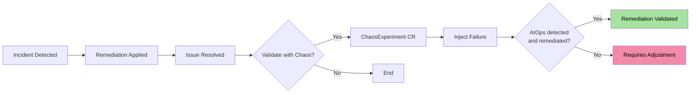
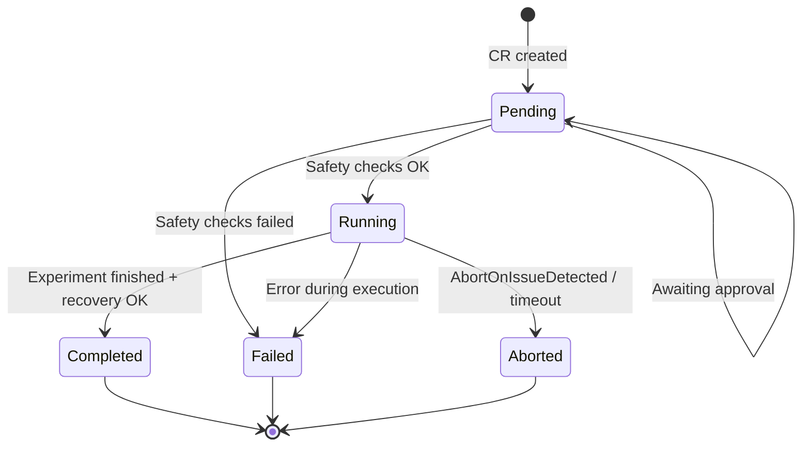

The **Chaos Engineering** module allows validating the resilience of Kubernetes workloads and the effectiveness of AIOps platform remediations. Unlike standalone chaos tools, experiments here are integrated into the AIOps pipeline -- allowing you to validate that a remediation actually works under adverse conditions.

<Info>
  Each experiment is a native Kubernetes CRD. All security controls are
  declarative and auditable, ensuring that chaos experiments never affect
  critical workloads without explicit approval.
</Info>


## Chaos Engineering in the AIOps Context



<CardGroup cols={2}>
  <Card title="Remediation Validation" icon="flask-vial">
    After fixing an incident, re-inject the failure to confirm that
    automatic remediation works.
  </Card>
  <Card title="Resilience Testing" icon="shield-halved">
    Run recurring experiments to ensure the platform detects
    and responds to known failures.
  </Card>
  <Card title="Automated Game Days" icon="calendar-check">
    Schedule experiments via cron to simulate regular game days without
    manual intervention.
  </Card>
  <Card title="Recovery Baseline" icon="stopwatch">
    Measure actual recovery times to establish SLOs and identify
    bottlenecks.
  </Card>
</CardGroup>


## ChaosExperiment CRD

### Complete Specification

```yaml
apiVersion: platform.chatcli.io/v1alpha1
kind: ChaosExperiment
metadata:
  name: validate-api-server-recovery
  namespace: staging
spec:
  # Experiment type
  experimentType: pod_kill

  # Target
  target:
    kind: Deployment
    name: api-server
    namespace: staging

  # Type-specific parameters
  parameters:
    count: 2           # Number of pods to affect
    # Parameters per type (see detailed section below)

  # Maximum duration
  duration: 5m

  # DryRun: simulate without executing
  dryRun: false

  # Scheduling (cron, optional)
  schedule: ""          # E.g., "0 3 * * 1" (every Monday at 3am)

  # Issue reference (post-remediation validation)
  linkedIssueRef:
    name: issue-api-server-crashloop
    namespace: staging

  # Safety Checks
  safetyChecks:
    minHealthyPods: 2
    maxConcurrentExperiments: 1
    abortOnIssueDetected: true
    requireApproval: false
    allowedNamespaces:
      - staging
      - chaos-testing
    blockedNamespaces:
      - production
      - kube-system
      - chatcli-system

  # Post-experiment verification
  postExperiment:
    verifyRecovery: true
    recoveryTimeout: 3m
    runRemediationTest: false

status:
  phase: Completed     # Pending | Running | Completed | Failed | Aborted
  startTime: "2026-03-19T03:00:00Z"
  completionTime: "2026-03-19T03:04:30Z"
  affectedPods:
    - api-server-7d8f9c6b5-x2k4p
    - api-server-7d8f9c6b5-m9n3q
  recoveryVerified: true
  recoveryDuration: "45s"
  conditions:
    - type: SafetyChecksPassed
      status: "True"
    - type: ExperimentCompleted
      status: "True"
    - type: RecoveryVerified
      status: "True"
```


## 7 Experiment Types

### 1. Pod Kill

Deletes pods randomly using the **Fisher-Yates shuffle** algorithm with `crypto/rand` for truly random selection.

```go
func (e *PodKillExperiment) Execute(ctx context.Context, pods []corev1.Pod) error {
    // Fisher-Yates shuffle with crypto/rand
    shuffled := make([]corev1.Pod, len(pods))
    copy(shuffled, pods)
    for i := len(shuffled) - 1; i > 0; i-- {
        jBig, _ := rand.Int(rand.Reader, big.NewInt(int64(i+1)))
        j := jBig.Int64()
        shuffled[i], shuffled[j] = shuffled[j], shuffled[i]
    }

    // Delete the first N pods (forced, no graceful period)
    count := e.Parameters.Count
    for i := 0; i < count && i < len(shuffled); i++ {
        err := e.client.CoreV1().Pods(shuffled[i].Namespace).Delete(ctx,
            shuffled[i].Name,
            metav1.DeleteOptions{
                GracePeriodSeconds: pointer.Int64(0),
            })
        if err != nil {
            return fmt.Errorf("failed to delete pod %s: %w", shuffled[i].Name, err)
        }
    }
    return nil
}
```

| Parameter | Type | Default | Description |
|-----------|------|---------|-------------|
| `count` | int | 1 | Number of pods to delete |

<Warning>
  Pod kill uses `GracePeriodSeconds: 0`, simulating an abrupt failure (e.g., node
  crash). For graceful termination, use `pod_failure`.
</Warning>

### 2. Pod Failure

Graceful pod deletion, respecting the `terminationGracePeriodSeconds` configured in the PodSpec.

| Parameter | Type | Default | Description |
|-----------|------|---------|-------------|
| `count` | int | 1 | Number of pods to delete gracefully |

```yaml
spec:
  experimentType: pod_failure
  target:
    kind: Deployment
    name: payment-service
  parameters:
    count: 1
```

### 3. CPU Stress

Creates a `stress-ng` pod on the **same node** as the target pod to simulate CPU contention.

```yaml
spec:
  experimentType: cpu_stress
  target:
    kind: Deployment
    name: api-server
  parameters:
    cores: 4              # Number of cores to stress
    loadPercent: 80       # Load percentage per core
  duration: 2m
```

**Generated stress pod:**

```yaml
apiVersion: v1
kind: Pod
metadata:
  name: chaos-cpu-stress-api-server-x7k2
  labels:
    platform.chatcli.io/chaos-experiment: validate-cpu-resilience
    platform.chatcli.io/chaos-type: cpu_stress
spec:
  nodeSelector:
    kubernetes.io/hostname: worker-node-3   # Same node as target
  containers:
    - name: stress
      image: alexeiled/stress-ng:latest
      command: ["stress-ng"]
      args: ["--cpu", "4", "--cpu-load", "80", "--timeout", "120"]
      resources:
        limits:
          cpu: "4"
  restartPolicy: Never
```

| Parameter | Type | Default | Description |
|-----------|------|---------|-------------|
| `cores` | int | 1 | Number of stress-ng CPU workers |
| `loadPercent` | int | 100 | Load percentage per core (0-100) |

### 4. Memory Stress

Creates a `stress-ng` pod that allocates memory on the same node as the target.

```yaml
spec:
  experimentType: memory_stress
  target:
    kind: Deployment
    name: cache-service
  parameters:
    vmBytes: "256M"       # Amount of memory to allocate
  duration: 3m
```

**Generated stress-ng command:**

```bash
stress-ng --vm 1 --vm-bytes 256M --timeout 180
```

| Parameter | Type | Default | Description |
|-----------|------|---------|-------------|
| `vmBytes` | string | `128M` | Amount of memory (format: `128M`, `1G`) |

### 5. Network Delay

Simulates network latency using **annotations** on the target pods. The sidecar or CNI plugin interprets the annotation to inject delay.

```yaml
spec:
  experimentType: network_delay
  target:
    kind: Deployment
    name: api-gateway
  parameters:
    latencyMs: 500        # Additional latency in milliseconds
  duration: 5m
```

**Applied annotation:**

```yaml
metadata:
  annotations:
    platform.chatcli.io/chaos-network-delay: "500ms"
    platform.chatcli.io/chaos-experiment-ref: "validate-latency-handling"
```

| Parameter | Type | Default | Description |
|-----------|------|---------|-------------|
| `latencyMs` | int | 100 | Additional latency in milliseconds |

### 6. Network Loss

Simulates network packet loss via annotations.

```yaml
spec:
  experimentType: network_loss
  target:
    kind: Deployment
    name: api-gateway
  parameters:
    percent: 30           # Percentage of dropped packets
  duration: 2m
```

| Parameter | Type | Default | Description |
|-----------|------|---------|-------------|
| `percent` | int | 10 | Packet loss percentage (0-100) |

### 7. Disk Stress

Creates a `stress-ng` pod that generates intensive disk I/O on the same node.

```yaml
spec:
  experimentType: disk_stress
  target:
    kind: Deployment
    name: database-proxy
  parameters:
    hdd: 2                # Number of disk workers
    hddBytes: "1G"        # Amount of data per worker
  duration: 3m
```

**Generated stress-ng command:**

```bash
stress-ng --hdd 2 --hdd-bytes 1G --timeout 180
```

| Parameter | Type | Default | Description |
|-----------|------|---------|-------------|
| `hdd` | int | 1 | Number of stress-ng HDD workers |
| `hddBytes` | string | `512M` | Bytes written per worker |

### Type Summary

| Type | Mechanism | Target | Reversible |
|------|-----------|--------|------------|
| `pod_kill` | Delete (force) | Randomly selected pods | Yes (ReplicaSet recreates) |
| `pod_failure` | Delete (graceful) | Selected pods | Yes (ReplicaSet recreates) |
| `cpu_stress` | stress-ng pod on same node | Node CPU | Yes (pod removed after duration) |
| `memory_stress` | stress-ng pod on same node | Node memory | Yes (pod removed after duration) |
| `network_delay` | Annotation on pod | Pod network | Yes (annotation removed) |
| `network_loss` | Annotation on pod | Pod network | Yes (annotation removed) |
| `disk_stress` | stress-ng pod on same node | Node disk | Yes (pod removed after duration) |


## Safety Checks

Safety checks are the protection layer that prevents chaos experiments from causing real damage.

### MinHealthyPods

Ensures a minimum number of pods remain healthy during the experiment.

```go
func (sc *SafetyChecker) CheckMinHealthyPods(
    ctx context.Context,
    target *ExperimentTarget,
    minHealthy int,
    killCount int,
) error {
    pods, _ := sc.listTargetPods(ctx, target)

    healthyPods := 0
    for _, pod := range pods {
        if isPodReady(&pod) {
            healthyPods++
        }
    }

    remainingHealthy := healthyPods - killCount
    if remainingHealthy < minHealthy {
        return fmt.Errorf(
            "safety check failed: %d healthy pods - %d kill = %d remaining, minimum required: %d",
            healthyPods, killCount, remainingHealthy, minHealthy,
        )
    }
    return nil
}
```

### MaxConcurrentExperiments

Prevents **chaos storms** by limiting the number of simultaneous experiments in the namespace.

```go
func (sc *SafetyChecker) CheckMaxConcurrent(
    ctx context.Context,
    namespace string,
    maxConcurrent int,
) error {
    running, _ := sc.listRunningExperiments(ctx, namespace)
    if len(running) >= maxConcurrent {
        return fmt.Errorf(
            "safety check failed: %d experiments running, maximum allowed: %d",
            len(running), maxConcurrent,
        )
    }
    return nil
}
```

### AbortOnIssueDetected

If AIOps detects a new issue **unrelated to the experiment** during execution, the experiment is **immediately aborted**.

```go
func (sc *SafetyChecker) MonitorForNewIssues(
    ctx context.Context,
    experiment *v1alpha1.ChaosExperiment,
    stopCh <-chan struct{},
) {
    ticker := time.NewTicker(10 * time.Second)
    defer ticker.Stop()

    for {
        select {
        case <-stopCh:
            return
        case <-ticker.C:
            issues, _ := sc.listNewIssues(ctx, experiment.Namespace, experiment.Status.StartTime)
            for _, issue := range issues {
                if !isRelatedToExperiment(&issue, experiment) {
                    sc.abortExperiment(ctx, experiment,
                        fmt.Sprintf("Unrelated issue detected: %s", issue.Name))
                    return
                }
            }
        }
    }
}
```

### RequireApproval

Integrates with the `ApprovalRequest` system to require human approval before executing the experiment.

```yaml
spec:
  safetyChecks:
    requireApproval: true
```

When enabled, the controller creates an `ApprovalRequest` CR and waits for approval before proceeding:

```yaml
apiVersion: platform.chatcli.io/v1alpha1
kind: ApprovalRequest
metadata:
  name: approval-chaos-pod-kill-api-server
spec:
  resourceRef:
    kind: ChaosExperiment
    name: validate-api-server-recovery
  requiredRole: Operator
  expiresIn: 1h
  summary: |
    Chaos experiment: pod_kill on Deployment/api-server (staging)
    Affected pods: 2, MinHealthyPods: 2
    Duration: 5m
```

### AllowedNamespaces / BlockedNamespaces

<Tabs>
  <Tab title="AllowedNamespaces">
    Whitelist of namespaces where experiments can be executed. If defined,
    **only** these namespaces are allowed.

    ```yaml
    safetyChecks:
      allowedNamespaces:
        - staging
        - chaos-testing
        - development
    ```
  </Tab>
  <Tab title="BlockedNamespaces">
    Blocklist of namespaces. Experiments are **never** executed in these
    namespaces, even if they are in the allowed list.

    ```yaml
    safetyChecks:
      blockedNamespaces:
        - production
        - kube-system
        - chatcli-system
        - monitoring
    ```
  </Tab>
</Tabs>

<Warning>
  `blockedNamespaces` takes precedence over `allowedNamespaces`. If a namespace
  appears in both lists, it is **blocked**. The `kube-system` and
  `chatcli-system` namespaces are **always** blocked, regardless of configuration.
</Warning>


## Post-Experiment Verification

### VerifyRecovery

After the experiment completes, the controller verifies whether the deployment returned to a healthy state.

```go
func (v *PostExperimentVerifier) VerifyRecovery(
    ctx context.Context,
    experiment *v1alpha1.ChaosExperiment,
) (bool, time.Duration, error) {
    startCheck := time.Now()
    timeout := experiment.Spec.PostExperiment.RecoveryTimeout

    for time.Since(startCheck) < timeout {
        deployment, _ := v.client.AppsV1().Deployments(
            experiment.Spec.Target.Namespace,
        ).Get(ctx, experiment.Spec.Target.Name, metav1.GetOptions{})

        if deployment.Status.ReadyReplicas == *deployment.Spec.Replicas {
            recoveryTime := time.Since(startCheck)
            return true, recoveryTime, nil
        }

        time.Sleep(5 * time.Second)
    }

    return false, timeout, fmt.Errorf("recovery timeout: deployment did not recover within %v", timeout)
}
```

### RecoveryTimeout

Maximum wait time for recovery verification. If the deployment does not return to a healthy state within this period, the experiment is marked as `Failed`.

### RunRemediationTest

When enabled together with `linkedIssueRef`, the controller:

<Steps>
  <Step title="Re-inject the failure">
    Executes the same experiment again to recreate the original incident scenario.
  </Step>
  <Step title="Wait for detection">
    Waits for the AIOps platform to automatically detect the anomaly.
  </Step>
  <Step title="Verify remediation">
    Confirms that automatic remediation was triggered and resolved the problem.
  </Step>
  <Step title="Record result">
    Updates the `ChaosExperiment.Status` with the validation result.
  </Step>
</Steps>

```yaml
spec:
  linkedIssueRef:
    name: issue-api-server-crashloop
  postExperiment:
    verifyRecovery: true
    recoveryTimeout: 3m
    runRemediationTest: true   # Re-inject and validate automatic remediation
```


## State Machine



| State | Description | Transitions |
|-------|-------------|-------------|
| **Pending** | CR created, awaiting safety checks or approval | Running, Failed |
| **Running** | Experiment in execution, failure being injected | Completed, Failed, Aborted |
| **Completed** | Experiment finished successfully, recovery verified | Terminal |
| **Failed** | Safety check failed, execution error, or recovery timeout | Terminal |
| **Aborted** | Interrupted by detected issue, timeout, or manual intervention | Terminal |


## DryRun Mode

DryRun mode executes all experiment logic (safety checks, pod selection, command generation) **without applying any real changes** to the cluster.

```yaml
spec:
  experimentType: pod_kill
  dryRun: true
  target:
    kind: Deployment
    name: api-server
  parameters:
    count: 3
```

**DryRun result:**

```yaml
status:
  phase: Completed
  dryRun: true
  dryRunResults:
    safetyChecksPassed: true
    podsSelected:
      - api-server-7d8f9c6b5-x2k4p
      - api-server-7d8f9c6b5-m9n3q
      - api-server-7d8f9c6b5-k8j7r
    actionsPlanned:
      - "DELETE pod api-server-7d8f9c6b5-x2k4p (GracePeriod: 0s)"
      - "DELETE pod api-server-7d8f9c6b5-m9n3q (GracePeriod: 0s)"
      - "DELETE pod api-server-7d8f9c6b5-k8j7r (GracePeriod: 0s)"
    warnings:
      - "3 of 5 pods would be deleted, leaving 2 (= minHealthyPods)"
```

<Tip>
  Always run a DryRun before configuring a scheduled experiment. This
  validates that safety checks are correct and that targets are as expected.
</Tip>


## Schedule (Recurring Experiments)

The `schedule` field accepts standard cron expressions for recurring execution:

```yaml
spec:
  schedule: "0 3 * * 1"    # Every Monday at 03:00
  experimentType: pod_kill
  target:
    kind: Deployment
    name: api-server
  parameters:
    count: 1
  safetyChecks:
    minHealthyPods: 3
    abortOnIssueDetected: true
```

| Expression | Frequency |
|------------|-----------|
| `0 3 * * 1` | Every Monday at 03:00 |
| `0 */6 * * *` | Every 6 hours |
| `0 2 1 * *` | First day of the month at 02:00 |
| `30 4 * * 1-5` | Weekdays at 04:30 |

Each scheduled execution creates a new `ChaosExperiment` CR with a timestamp suffix.


## LinkedIssueRef

The `linkedIssueRef` field connects the experiment to a specific incident, allowing validation that the applied remediation actually works.

```yaml
spec:
  linkedIssueRef:
    name: issue-api-server-crashloop
    namespace: staging
  experimentType: pod_kill
  parameters:
    count: 2
  postExperiment:
    verifyRecovery: true
    recoveryTimeout: 3m
    runRemediationTest: true
```

When `linkedIssueRef` is defined, the controller:

1. Fetches the `Issue` CR and associated `RemediationPlan`
2. Records the connection in the experiment status
3. If `runRemediationTest: true`, validates that AIOps detects and remediates automatically
4. Updates the `Issue` CR with the validation result


## Complete YAML Examples

<Accordion title="Pod Kill with Safety Checks">
```yaml
apiVersion: platform.chatcli.io/v1alpha1
kind: ChaosExperiment
metadata:
  name: validate-api-server-pod-kill
  namespace: staging
  labels:
    team: platform
    experiment-type: resilience
spec:
  experimentType: pod_kill
  target:
    kind: Deployment
    name: api-server
    namespace: staging
  parameters:
    count: 2
  duration: 5m
  dryRun: false
  safetyChecks:
    minHealthyPods: 2
    maxConcurrentExperiments: 1
    abortOnIssueDetected: true
    requireApproval: false
    allowedNamespaces: [staging, chaos-testing]
    blockedNamespaces: [production, kube-system]
  postExperiment:
    verifyRecovery: true
    recoveryTimeout: 2m
    runRemediationTest: false
```
</Accordion>

<Accordion title="Weekly Scheduled CPU Stress">
```yaml
apiVersion: platform.chatcli.io/v1alpha1
kind: ChaosExperiment
metadata:
  name: weekly-cpu-stress-api
  namespace: staging
spec:
  experimentType: cpu_stress
  schedule: "0 3 * * 1"     # Every Monday at 03:00
  target:
    kind: Deployment
    name: api-server
    namespace: staging
  parameters:
    cores: 4
    loadPercent: 90
  duration: 10m
  safetyChecks:
    minHealthyPods: 3
    maxConcurrentExperiments: 1
    abortOnIssueDetected: true
    blockedNamespaces: [production, kube-system]
  postExperiment:
    verifyRecovery: true
    recoveryTimeout: 5m
```
</Accordion>

<Accordion title="Post-Remediation Validation">
```yaml
apiVersion: platform.chatcli.io/v1alpha1
kind: ChaosExperiment
metadata:
  name: validate-crashloop-fix
  namespace: staging
spec:
  experimentType: pod_kill
  target:
    kind: Deployment
    name: payment-service
    namespace: staging
  parameters:
    count: 1
  duration: 3m
  linkedIssueRef:
    name: issue-payment-crashloop
    namespace: staging
  safetyChecks:
    minHealthyPods: 1
    abortOnIssueDetected: false   # We expect AIOps to detect
    requireApproval: true
  postExperiment:
    verifyRecovery: true
    recoveryTimeout: 3m
    runRemediationTest: true      # Validate automatic remediation
```
</Accordion>

<Accordion title="DryRun for Configuration Validation">
```yaml
apiVersion: platform.chatcli.io/v1alpha1
kind: ChaosExperiment
metadata:
  name: dryrun-memory-stress
  namespace: staging
spec:
  experimentType: memory_stress
  dryRun: true
  target:
    kind: Deployment
    name: cache-service
    namespace: staging
  parameters:
    vmBytes: "512M"
  duration: 5m
  safetyChecks:
    minHealthyPods: 2
    maxConcurrentExperiments: 1
    blockedNamespaces: [production]
  postExperiment:
    verifyRecovery: true
    recoveryTimeout: 2m
```
</Accordion>


## Metrics

The chaos engineering module exposes Prometheus metrics for observability and resilience tracking.

| Metric | Type | Labels | Description |
|--------|------|--------|-------------|
| `chaos_experiments_total` | Counter | `type`, `result`, `namespace` | Total experiments by type and result |
| `chaos_experiments_active` | Gauge | `namespace` | Currently running experiments |
| `chaos_recovery_time_seconds` | Histogram | `type`, `target` | Recovery time after experiment |
| `chaos_pods_affected_total` | Counter | `type`, `namespace` | Total pods affected by experiments |
| `chaos_safety_checks_failed_total` | Counter | `check_type` | Safety checks that blocked experiments |
| `chaos_aborted_total` | Counter | `reason` | Experiments aborted by reason |
| `chaos_remediation_validated_total` | Counter | `result` | Remediation validations (pass/fail) |

### Alert Examples

```yaml
groups:
  - name: chaos-engineering
    rules:
      - alert: ChaosExperimentFailed
        expr: increase(chaos_experiments_total{result="failed"}[1h]) > 0
        labels:
          severity: warning
        annotations:
          summary: "Chaos experiment failed"
          description: >
            {{ $labels.type }} failed in namespace {{ $labels.namespace }}.
            Check if the deployment recovered correctly.

      - alert: HighRecoveryTime
        expr: >
          histogram_quantile(0.95, chaos_recovery_time_seconds_bucket) > 300
        for: 1h
        labels:
          severity: warning
        annotations:
          summary: "High recovery time after chaos"
          description: >
            P95 recovery time above 5 minutes. Workloads may have
            self-healing issues.

      - alert: RemediationValidationFailed
        expr: increase(chaos_remediation_validated_total{result="fail"}[24h]) > 0
        labels:
          severity: critical
        annotations:
          summary: "Remediation validation failed"
          description: >
            Automatic remediation did not work when the failure was
            re-injected. The AIOps platform may not be responding
            correctly to this type of incident.
```


## Best Practices

<Steps>
  <Step title="Start with DryRun">
    Always run a DryRun before real experiments to validate safety checks
    and target selection.
  </Step>
  <Step title="Staging First">
    Run experiments in staging before enabling in higher-tier environments.
    Use `allowedNamespaces` for enforcement.
  </Step>
  <Step title="Conservative Safety Checks">
    Configure `minHealthyPods` with margin. If the deployment has 5 replicas
    and needs 3 to operate, configure `minHealthyPods: 3`.
  </Step>
  <Step title="Schedule Game Days">
    Use `schedule` for recurring experiments. Resilience is not a one-time
    test -- it is a continuous practice.
  </Step>
  <Step title="Validate Remediations">
    After fixing an incident, use `linkedIssueRef` + `runRemediationTest`
    to confirm that the fix works under failure.
  </Step>
</Steps>


## Next Steps

<CardGroup cols={2}>
  <Card title="Decision Engine" icon="brain-circuit" href="/en/features/aiops/decision-engine">
    Understand how chaos results influence the Pattern Store and engine
    confidence.
  </Card>
  <Card title="Multi-Cluster Federation" icon="network-wired" href="/en/features/aiops/federation">
    Run chaos experiments on specific clusters with per-tier policies.
  </Card>
  <Card title="Audit and Compliance" icon="clipboard-check" href="/en/features/aiops/audit-compliance">
    All experiments generate immutable AuditEvents for complete
    traceability.
  </Card>
  <Card title="AIOps Platform" icon="brain" href="/en/features/aiops-platform">
    Return to the AIOps platform overview.
  </Card>
</CardGroup>
