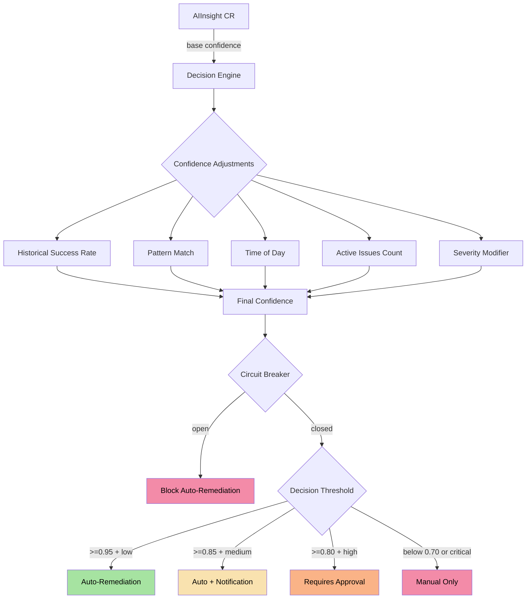
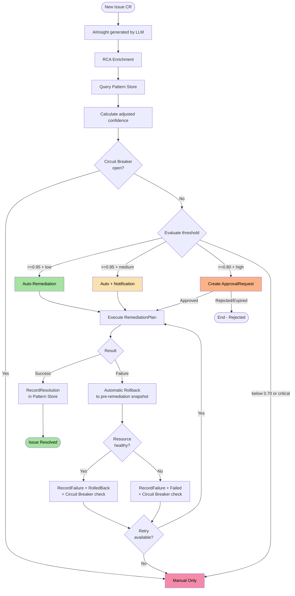

The **Decision Engine** is the central component that determines _when_ and _how_ the AIOps platform should act autonomously. It combines calculated confidence, historical patterns, root cause enrichment, and convergence detection to make safe decisions in production.

<Info>
  The Decision Engine never acts blindly. Every decision goes through a pipeline of
  confidence adjustments, circuit breaker checks, and pattern validation
  before any action is executed.
</Info>


## Architecture Overview




## Base Confidence (AIInsight)

The entire process starts with the `confidence` field of the `AIInsight` CR, which is generated by the LLM provider during root cause analysis. This value represents the AI's certainty about the diagnosis and suggested actions.

<CardGroup cols={2}>
  <Card title="High Confidence" icon="circle-check">
    **0.90 - 1.00** -- The AI identified the problem with high precision. Well-known
    scenarios like OOMKilled, CrashLoopBackOff with invalid image.
  </Card>
  <Card title="Medium Confidence" icon="circle-half-stroke">
    **0.70 - 0.89** -- Probable diagnosis but with uncertainty. Performance
    issues, resource pressure, intermittent dependencies.
  </Card>
  <Card title="Low Confidence" icon="circle-xmark">
    **0.50 - 0.69** -- The AI does not have sufficient certainty. Complex problems
    with multiple possible causes.
  </Card>
  <Card title="Very Low Confidence" icon="triangle-exclamation">
    **&lt; 0.50** -- Unknown scenario or insufficient data. Always requires
    human intervention.
  </Card>
</CardGroup>


## Confidence Adjustment Factors

The base confidence is never used directly. It goes through **5 adjustment factors** that refine it based on the current operational context.

### 1. Historical Success Rate

<Steps>
  <Step title="Query the Pattern Store">
    The engine calculates the success rate of previous remediations for the same
    signal type (`signalType`).
  </Step>
  <Step title="Apply the adjustment">
    - **High success rate** (&gt;80%): adjustment of **+0.10**
    - **Low success rate** (&lt;40%): adjustment of **-0.10**
    - **No history**: no adjustment (0.00)
  </Step>
</Steps>

```go
// Historical adjustment calculation
if successRate > 0.8 {
    adjustment += 0.10
} else if successRate < 0.4 {
    adjustment -= 0.10
}
```

### 2. Pattern Match

When the Pattern Store finds a previously resolved pattern that matches the current incident, confidence receives a significant boost.

| Condition | Adjustment |
|-----------|------------|
| Pattern found with successful resolution | **+0.15** |
| No matching pattern | **0.00** |

<Tip>
  Pattern Match is the most powerful factor. An identical incident resolved
  previously can raise confidence enough to allow auto-remediation
  even in scenarios that would normally require approval.
</Tip>

### 3. Time of Day

Automatic actions outside business hours carry additional risk because fewer engineers are available to intervene if something goes wrong.

| Condition | Adjustment |
|-----------|------------|
| Within business hours (09:00-18:00 local) | **0.00** |
| Outside business hours | **-0.05** |

### 4. Simultaneous Active Issues

When the cluster is under pressure with multiple active incidents, the engine becomes more conservative to avoid chain actions that could worsen the situation.

| Condition | Adjustment |
|-----------|------------|
| Up to 3 active issues | **0.00** |
| Each issue beyond 3 | **-0.02 per issue** |

```go
// Example: 7 active issues
// Adjustment = -(7 - 3) * 0.02 = -0.08
activeIssues := countActiveIssues(namespace)
if activeIssues > 3 {
    adjustment -= float64(activeIssues - 3) * 0.02
}
```

<Warning>
  With 10 or more simultaneous active issues, the cumulative adjustment (-0.14 or more)
  makes it practically impossible to reach the auto-remediation threshold, forcing
  human review -- exactly the desired behavior during a cascade incident.
</Warning>

### 5. Incident Severity

The `Issue` CR severity applies a fixed modifier reflecting the inherent operational risk.

| Severity | Adjustment | Justification |
|----------|------------|---------------|
| **critical** | **-0.10** | Production impact, requires maximum caution |
| **high** | **-0.05** | Significant risk, moderate conservatism |
| **medium** | **0.00** | Standard level, no adjustment |
| **low** | **+0.05** | Low risk, favors automation |


## Practical Calculation Example

<Accordion title="Scenario: CrashLoopBackOff after deploy during business hours">
  **Incident data:**
  - Base AIInsight confidence: **0.88**
  - Severity: **high**
  - Time: 14:30 (business hours)
  - Active issues: 2
  - Pattern Store: pattern found (successful rollback 5 days ago)
  - Historical success rate: 90%

  **Calculation:**
  ```
  Base:                    0.88
  + Historical success:   +0.10  (90% > 80%)
  + Pattern match:        +0.15  (pattern found)
  + Time of day:           0.00  (business hours)
  + Active issues:         0.00  (2 <= 3)
  + Severity (high):      -0.05
  ─────────────────────────────
  Final confidence:        1.00  (capped at 1.0)
  ```

  **Decision:** Confidence 1.00 + severity high = **Requires approval** (threshold &gt;=0.80 + high).

  Even with maximum confidence, `high` incidents always require human approval.
</Accordion>

<Accordion title="Scenario: Pod with OOMKilled in staging namespace at night">
  **Incident data:**
  - Base AIInsight confidence: **0.92**
  - Severity: **low**
  - Time: 02:15 (outside business hours)
  - Active issues: 1
  - Pattern Store: pattern found (successful memory adjustment)
  - Historical success rate: 95%

  **Calculation:**
  ```
  Base:                    0.92
  + Historical success:   +0.10  (95% > 80%)
  + Pattern match:        +0.15  (pattern found)
  + Time of day:          -0.05  (outside business hours)
  + Active issues:         0.00  (1 <= 3)
  + Severity (low):       +0.05
  ─────────────────────────────
  Final confidence:        1.00  (capped at 1.0)
  ```

  **Decision:** Confidence 1.00 + severity low = **Auto-remediation** (threshold &gt;=0.95 + low).
</Accordion>

<Accordion title="Scenario: Unknown problem in overloaded cluster">
  **Incident data:**
  - Base AIInsight confidence: **0.65**
  - Severity: **critical**
  - Time: 10:00 (business hours)
  - Active issues: 8
  - Pattern Store: no matching pattern
  - Historical success rate: 30%

  **Calculation:**
  ```
  Base:                    0.65
  + Historical success:   -0.10  (30% < 40%)
  + Pattern match:         0.00  (no pattern)
  + Time of day:           0.00  (business hours)
  + Active issues:        -0.10  (8-3=5 x 0.02)
  + Severity (critical):  -0.10
  ─────────────────────────────
  Final confidence:        0.35
  ```

  **Decision:** Confidence 0.35 + severity critical = **Manual only** (&lt;0.70 or critical).
</Accordion>


## Decision Thresholds

The combination of final confidence and severity determines the allowed level of autonomy.

<Tabs>
  <Tab title="Full Auto-Remediation">
    **Requirements:** Confidence &gt;= 0.95 **and** severity `low`

    The platform executes remediation automatically without any human intervention.
    The `RemediationPlan` is created and executed immediately.

    ```yaml
    # Automatically generated RemediationPlan
    apiVersion: platform.chatcli.io/v1alpha1
    kind: RemediationPlan
    metadata:
      name: auto-fix-oom-api-server
      annotations:
        platform.chatcli.io/decision-mode: "auto"
        platform.chatcli.io/confidence: "0.97"
    spec:
      issueRef:
        name: issue-oom-api-server
      actions:
        - type: AdjustResources
          target: deployment/api-server
          parameters:
            memoryLimit: "512Mi"
            memoryRequest: "256Mi"
    ```
  </Tab>
  <Tab title="Auto with Notification">
    **Requirements:** Confidence &gt;= 0.85 **and** severity `medium`

    Remediation is executed automatically, but a notification is sent
    to operators for awareness. The `RemediationPlan` includes the
    notification annotation.

    ```yaml
    metadata:
      annotations:
        platform.chatcli.io/decision-mode: "auto-notify"
        platform.chatcli.io/confidence: "0.89"
        platform.chatcli.io/notify: "true"
    ```
  </Tab>
  <Tab title="Requires Approval">
    **Requirements:** Confidence &gt;= 0.80 **and** severity `high`

    An `ApprovalRequest` CR is created and remediation remains pending until an
    operator with the appropriate role approves execution.

    ```yaml
    apiVersion: platform.chatcli.io/v1alpha1
    kind: ApprovalRequest
    metadata:
      name: approval-rollback-payment-svc
    spec:
      remediationPlanRef:
        name: plan-rollback-payment-svc
      requiredRole: Operator
      expiresIn: 30m
      summary: "Rollback of deployment payment-svc to revision 42"
    status:
      state: Pending
    ```
  </Tab>
  <Tab title="Manual Only">
    **Requirements:** Confidence &lt; 0.70 **or** severity `critical`

    No automatic action is taken. The `Issue` is marked as
    `RequiresManualIntervention` and an alert is sent to the on-call team.

    ```yaml
    status:
      phase: RequiresManualIntervention
      conditions:
        - type: AutoRemediationBlocked
          status: "True"
          reason: "LowConfidenceOrCritical"
          message: "Confidence 0.35 below threshold; severity critical"
    ```
  </Tab>
</Tabs>


## Circuit Breaker

The circuit breaker is a safety mechanism that **blocks all auto-remediations** when it detects consecutive failures, preventing the platform from causing cascading damage.

<Steps>
  <Step title="Failure Monitoring">
    Each remediation failure is recorded with a timestamp. The circuit breaker
    maintains a sliding window of **1 hour**.
  </Step>
  <Step title="Circuit Breaker Trigger">
    When **3 or more failures** occur within the 1-hour window, the circuit
    breaker **opens** and blocks all auto-remediation in the namespace.
  </Step>
  <Step title="Open State">
    While open, all `RemediationPlan` CRs are created with
    `requiresApproval: true`, regardless of the calculated confidence.
  </Step>
  <Step title="Reset">
    The circuit breaker closes automatically after the cooldown period or when
    an operator performs a manual reset via annotation.
  </Step>
</Steps>

```go
type CircuitBreaker struct {
    failures    []time.Time
    window      time.Duration  // 1 hour
    threshold   int            // 3 failures
    isOpen      bool
    mu          sync.Mutex
}

func (cb *CircuitBreaker) RecordFailure() {
    cb.mu.Lock()
    defer cb.mu.Unlock()
    now := time.Now()
    cb.failures = append(cb.failures, now)

    // Remove failures outside the window
    cutoff := now.Add(-cb.window)
    var recent []time.Time
    for _, f := range cb.failures {
        if f.After(cutoff) {
            recent = append(recent, f)
        }
    }
    cb.failures = recent

    if len(cb.failures) >= cb.threshold {
        cb.isOpen = true
    }
}

func (cb *CircuitBreaker) IsOpen() bool {
    cb.mu.Lock()
    defer cb.mu.Unlock()
    return cb.isOpen
}
```

<Warning>
  When the circuit breaker is open, the annotation
  `platform.chatcli.io/circuit-breaker: open` is added to the namespace.
  This is visible via `kubectl get ns &lt;namespace&gt; -o yaml` for quick
  diagnosis.
</Warning>


## Pattern Store

The Pattern Store is the platform's pattern learning system. It allows AIOps to "remember" past incidents and use that memory to make more informed decisions.

### SHA256 Fingerprinting

Each pattern is identified by a unique fingerprint calculated as:

```
SHA256(signalType | resourceKind | severity)
```

**Fingerprint examples:**

| Signal Type | Resource Kind | Severity | Fingerprint (truncated) |
|------------|--------------|----------|----------------------|
| `CrashLoopBackOff` | `Deployment` | `high` | `a3f8c2...` |
| `OOMKilled` | `Pod` | `medium` | `7b1d9e...` |
| `FailedScheduling` | `Pod` | `low` | `c4e6a1...` |
| `ImagePullBackOff` | `Deployment` | `high` | `2d8f5b...` |

### ConfigMap Storage

Patterns are persisted in a dedicated `ConfigMap` in the operator namespace:

```yaml
apiVersion: v1
kind: ConfigMap
metadata:
  name: chatcli-pattern-store
  namespace: chatcli-system
  labels:
    app.kubernetes.io/component: pattern-store
    platform.chatcli.io/managed-by: decision-engine
data:
  patterns.json: |
    {
      "a3f8c2...": {
        "signalType": "CrashLoopBackOff",
        "resourceKind": "Deployment",
        "severity": "high",
        "totalOccurrences": 12,
        "successfulResolutions": 10,
        "lastResolution": {
          "action": "Rollback",
          "timestamp": "2026-03-18T14:30:00Z",
          "durationSeconds": 45
        },
        "averageResolutionTime": "38s"
      }
    }
```

### RecordResolution and RecordFailure

<CodeGroup>
```go RecordResolution
func (ps *PatternStore) RecordResolution(fingerprint string, action string) {
    ps.mu.Lock()
    defer ps.mu.Unlock()

    pattern, exists := ps.patterns[fingerprint]
    if !exists {
        pattern = &Pattern{Fingerprint: fingerprint}
        ps.patterns[fingerprint] = pattern
    }

    pattern.TotalOccurrences++
    pattern.SuccessfulResolutions++
    pattern.LastResolution = &Resolution{
        Action:    action,
        Timestamp: time.Now(),
    }

    ps.persistToConfigMap()
}
```

```go RecordFailure
func (ps *PatternStore) RecordFailure(fingerprint string, reason string) {
    ps.mu.Lock()
    defer ps.mu.Unlock()

    pattern, exists := ps.patterns[fingerprint]
    if !exists {
        pattern = &Pattern{Fingerprint: fingerprint}
        ps.patterns[fingerprint] = pattern
    }

    pattern.TotalOccurrences++
    pattern.LastFailureReason = reason

    ps.persistToConfigMap()
}
```
</CodeGroup>

### Confidence Boost Calculation

The confidence boost derived from the Pattern Store is calculated directly from the success rate:

```
ConfidenceBoost = successRate * 0.15
```

| Success Rate | Confidence Boost | Example |
|-------------|------------------|---------|
| 100% (10/10) | +0.150 | All rollbacks successful |
| 80% (8/10) | +0.120 | Most resource adjustments worked |
| 50% (5/10) | +0.075 | Mixed results |
| 20% (2/10) | +0.030 | Most failed |

### Scenario: Recent Similar Incident

<Accordion title="'Similar incident resolved 3 days ago with rollback'">
  When the Pattern Store finds a match, the engine adds context
  to the `AIInsight` and the `RemediationPlan`:

  ```yaml
  status:
    patternMatch:
      found: true
      fingerprint: "a3f8c2..."
      previousResolution:
        action: "Rollback"
        daysAgo: 3
        wasSuccessful: true
        message: "Similar incident resolved 3 days ago with rollback"
      confidenceBoost: 0.15
      successRate: 0.83
  ```

  This information is displayed in the `Issue` CR so operators can quickly
  see that the problem has been resolved before and how.
</Accordion>


## Root Cause Analysis (RCA) Enrichment

Before making any decision, the engine enriches the incident context with additional cluster data. This enrichment feeds both the LLM (for better diagnosis) and the decision engine (for more precise adjustments).

### DeploymentChange Detection

The engine checks if there was a recent deploy change by comparing ReplicaSet revisions:

```go
func (r *RCAEnricher) DetectDeploymentChange(ctx context.Context,
    deployment *appsv1.Deployment) (*DeploymentChange, error) {

    // List ReplicaSets for the deployment
    rsList, _ := r.client.AppsV1().ReplicaSets(deployment.Namespace).List(ctx,
        metav1.ListOptions{
            LabelSelector: labels.SelectorFromSet(deployment.Spec.Selector.MatchLabels).String(),
        })

    // Compare revisions (annotation deployment.kubernetes.io/revision)
    current, previous := findCurrentAndPrevious(rsList.Items)

    if current != nil && previous != nil {
        return &DeploymentChange{
            RevisionBefore: previous.Annotations["deployment.kubernetes.io/revision"],
            RevisionAfter:  current.Annotations["deployment.kubernetes.io/revision"],
            ImageBefore:    previous.Spec.Template.Spec.Containers[0].Image,
            ImageAfter:     current.Spec.Template.Spec.Containers[0].Image,
            Timestamp:      current.CreationTimestamp.Time,
        }, nil
    }
    return nil, nil
}
```

**Enrichment result:**

```yaml
rcaEnrichment:
  deploymentChange:
    detected: true
    revisionBefore: "5"
    revisionAfter: "6"
    imageBefore: "api-server:v2.3.1"
    imageAfter: "api-server:v2.4.0"
    timestamp: "2026-03-19T10:15:00Z"
```

### ConfigChange Detection

The engine searches for Kubernetes events related to ConfigMap and Secret updates:

```yaml
rcaEnrichment:
  configChanges:
    - resource: "ConfigMap/api-config"
      field: "database.maxConnections"
      timestamp: "2026-03-19T10:12:00Z"
      reason: "Updated via kubectl"
```

### Related Issues

Lists active issues in the same namespace that may be correlated:

```yaml
rcaEnrichment:
  relatedIssues:
    - name: issue-high-latency-redis
      severity: medium
      signalType: HighLatency
      resource: deployment/redis-cache
    - name: issue-memory-pressure-node2
      severity: high
      signalType: MemoryPressure
      resource: node/worker-2
```

### Dependency Status

Checks the health of Services and Endpoints that the affected resource depends on:

```yaml
rcaEnrichment:
  dependencyStatus:
    - service: database-svc
      endpointsReady: 3
      endpointsTotal: 3
      healthy: true
    - service: redis-svc
      endpointsReady: 0
      endpointsTotal: 2
      healthy: false
      reason: "No endpoints ready"
```

### Time Correlation

The engine calculates the temporal correlation between detected changes and the incident start:

```yaml
rcaEnrichment:
  timeCorrelation:
    deploymentChange:
      minutesBefore: 3
      message: "Deploy changed 3 min before the incident"
      correlationStrength: "strong"
    configChange:
      minutesBefore: 12
      message: "ConfigMap updated 12 min before the incident"
      correlationStrength: "moderate"
```

<Note>
  Strong temporal correlation (&lt; 5 min) automatically elevates the cause to the top
  of the `PossibleCauses` list, as the probability of a causal relationship is high.
</Note>

### PossibleCauses Ranking

All possible causes are ranked by probability based on the enrichment data:

```yaml
rcaEnrichment:
  possibleCauses:
    - rank: 1
      cause: "New image version (v2.4.0) introduced a memory leak"
      confidence: 0.85
      evidence:
        - "Deploy occurred 3 min before the first OOMKilled"
        - "Image changed from v2.3.1 to v2.4.0"
        - "Similar pattern resolved with rollback 5 days ago"
    - rank: 2
      cause: "Memory limit insufficient for current load"
      confidence: 0.45
      evidence:
        - "Increasing memory usage over the last 2 hours"
        - "No recent change in limits"
    - rank: 3
      cause: "Degraded redis-svc dependency causing retry storm"
      confidence: 0.30
      evidence:
        - "redis-svc with 0/2 ready endpoints"
        - "Weak temporal correlation"
```


## Convergence Detector

The Convergence Detector is designed for the **agentic remediation loop**. It monitors the agent's observations to determine if the situation is improving, stagnating, or worsening.

### IsConverged

Checks if the last **3 observations** are identical, indicating that the system has reached a stable state (for better or worse).

```go
func (cd *ConvergenceDetector) IsConverged(observations []string) bool {
    if len(observations) < 3 {
        return false
    }
    last3 := observations[len(observations)-3:]
    return last3[0] == last3[1] && last3[1] == last3[2]
}
```

### IsOscillating

Detects **A-B-A-B** oscillation patterns where the system alternates between two states without real progress.

```go
func (cd *ConvergenceDetector) IsOscillating(observations []string) bool {
    if len(observations) < 4 {
        return false
    }
    last4 := observations[len(observations)-4:]
    // Pattern A->B->A->B
    return last4[0] == last4[2] && last4[1] == last4[3] && last4[0] != last4[1]
}
```

<Warning>
  Oscillation is a strong signal that the remediation action is creating the problem
  it is trying to solve. When detected, the agentic loop is interrupted
  immediately and the incident is escalated for human intervention.
</Warning>

### ShouldStop

Main function that combines all agentic loop stop criteria:

```go
func (cd *ConvergenceDetector) ShouldStop(
    observations []string,
    startTime time.Time,
    consecutiveFailures int,
) (bool, string) {
    // 1. Convergence
    if cd.IsConverged(observations) {
        return true, "System converged (3 identical observations)"
    }

    // 2. Oscillation
    if cd.IsOscillating(observations) {
        return true, "Oscillation detected (A->B->A->B pattern)"
    }

    // 3. Timeout (10 minutes)
    if time.Since(startTime) > 10*time.Minute {
        return true, "Agentic loop timeout (10 min)"
    }

    // 4. Consecutive failures
    if consecutiveFailures >= 5 {
        return true, "5 consecutive failures"
    }

    return false, ""
}
```

| Criterion | Condition | Action |
|-----------|-----------|--------|
| Convergence | 3 identical observations | Stops the loop, marks as resolved or not |
| Oscillation | A-B-A-B pattern | Stops the loop, escalates to human |
| Timeout | &gt; 10 minutes | Stops the loop, escalates to human |
| Consecutive failures | &gt;= 5 failures | Stops the loop, triggers circuit breaker |

### EstimateProgress

Estimates agentic loop progress from 0.0 to 1.0, used for visual feedback and logging:

```go
func (cd *ConvergenceDetector) EstimateProgress(
    currentStep int,
    maxSteps int,
    lastObservation string,
    targetState string,
) float64 {
    // Base progress by step count
    stepProgress := float64(currentStep) / float64(maxSteps)

    // Adjust if observation indicates improvement
    if strings.Contains(lastObservation, "healthy") ||
       strings.Contains(lastObservation, "running") {
        return math.Min(1.0, stepProgress + 0.2)
    }

    return stepProgress
}
```


## Complete Decision Flow




## Decision Engine Metrics

The engine exposes Prometheus metrics for observability:

| Metric | Type | Description |
|--------|------|-------------|
| `decision_engine_evaluations_total` | Counter | Total confidence evaluations |
| `decision_engine_confidence_histogram` | Histogram | Final confidence distribution |
| `decision_engine_auto_remediations_total` | Counter | Total auto-remediations by mode |
| `decision_engine_circuit_breaker_state` | Gauge | Circuit breaker state (0=closed, 1=open) |
| `decision_engine_pattern_matches_total` | Counter | Total Pattern Store matches |
| `decision_engine_rca_enrichment_duration` | Histogram | RCA enrichment time |
| `decision_engine_convergence_stops_total` | Counter | Total stops by type (convergence, oscillation, timeout, failures) |

```yaml
# Prometheus alert example
groups:
  - name: decision-engine
    rules:
      - alert: CircuitBreakerOpen
        expr: decision_engine_circuit_breaker_state == 1
        for: 5m
        labels:
          severity: warning
        annotations:
          summary: "Decision engine circuit breaker is open"
          description: "3+ remediation failures in the last hour. Auto-remediation blocked."
      - alert: LowPatternMatchRate
        expr: >
          rate(decision_engine_pattern_matches_total[1h])
          / rate(decision_engine_evaluations_total[1h]) < 0.1
        for: 24h
        labels:
          severity: info
        annotations:
          summary: "Low pattern match rate"
          description: "Less than 10% of incidents have a known pattern. Consider reviewing runbooks."
```


## Next Steps

<CardGroup cols={2}>
  <Card title="Multi-Cluster Federation" icon="network-wired" href="/en/features/aiops/federation">
    See how the decision engine operates in multi-cluster environments with policies
    per tier.
  </Card>
  <Card title="Chaos Engineering" icon="explosion" href="/en/features/aiops/chaos-engineering">
    Validate engine decisions with controlled chaos experiments.
  </Card>
  <Card title="Audit and Compliance" icon="clipboard-check" href="/en/features/aiops/audit-compliance">
    Every decision generates an immutable AuditEvent for traceability.
  </Card>
  <Card title="AIOps Platform" icon="brain" href="/en/features/aiops-platform">
    Return to the complete AIOps platform overview.
  </Card>
</CardGroup>
