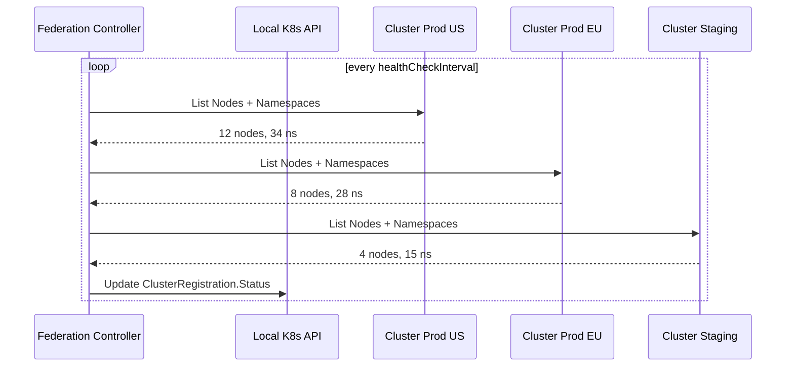
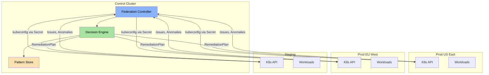

**Multi-Cluster Federation** allows the ChatCLI AIOps platform to manage multiple Kubernetes clusters from a single control plane. Incidents are correlated across clusters, cascades are detected automatically, and remediation policies respect each environment's tier.

<Info>
  Federation does not require a service mesh or external tools. The operator
  connects directly to each cluster via kubeconfig stored in Secrets.
</Info>


## Why Multi-Cluster Federation?

In modern production environments, infrastructure is rarely limited to a single cluster:

<CardGroup cols={3}>
  <Card title="Multi-Region" icon="globe">
    Clusters in us-east-1, eu-west-1, and ap-southeast-1 for latency and
    regional compliance.
  </Card>
  <Card title="Multi-Environment" icon="layer-group">
    Staging, production, and DR in separate clusters with different security
    policies.
  </Card>
  <Card title="Multi-Tenant" icon="building">
    Dedicated clusters per team or product with strong workload isolation.
  </Card>
</CardGroup>

Without federation, each cluster is a silo. AIOps loses the ability to:

- Detect that the same problem affects 5 clusters simultaneously
- Correlate a staging deploy with a production failure
- Apply differentiated remediation policies by cluster importance
- Aggregate health metrics into a global view


## ClusterRegistration CRD

The `ClusterRegistration` CRD is the entry point for adding clusters to the federation.

### Complete Specification

```yaml
apiVersion: platform.chatcli.io/v1alpha1
kind: ClusterRegistration
metadata:
  name: prod-us-east-1
  namespace: chatcli-system
spec:
  # Reference to the Secret containing the kubeconfig
  kubeconfigSecretRef:
    name: cluster-prod-us-east-1-kubeconfig
    key: kubeconfig

  # Cluster metadata
  region: us-east-1
  environment: production
  tier: critical          # critical | standard | non-critical

  # Monitoring configuration
  healthCheckInterval: 30s
  capabilities:
    - monitoring
    - remediation
    - chaos-engineering

  # Safety limits
  maxConcurrentRemediations: 2

status:
  # Automatically populated by the controller
  connected: true
  lastHealthCheck: "2026-03-19T14:30:00Z"
  kubernetesVersion: "v1.29.2"
  nodeCount: 12
  namespaceCount: 34
  conditions:
    - type: Connected
      status: "True"
      lastTransitionTime: "2026-03-19T10:00:00Z"
      reason: HealthCheckSucceeded
      message: "Cluster accessible, 12 nodes, 34 namespaces"
    - type: RemediationCapable
      status: "True"
      lastTransitionTime: "2026-03-19T10:00:00Z"
      reason: RBACConfigured
      message: "ServiceAccount with remediation permissions"
```

### Spec Fields

| Field | Type | Required | Description |
|-------|------|----------|-------------|
| `kubeconfigSecretRef.name` | string | Yes | Name of the Secret with the kubeconfig |
| `kubeconfigSecretRef.key` | string | Yes | Key within the Secret (usually `kubeconfig`) |
| `region` | string | Yes | Geographic region of the cluster |
| `environment` | string | Yes | Environment: `staging`, `production`, `dr`, `development` |
| `tier` | string | Yes | Importance: `critical`, `standard`, `non-critical` |
| `healthCheckInterval` | duration | No | Health check interval (default: `30s`) |
| `capabilities` | []string | No | Enabled capabilities: `monitoring`, `remediation`, `chaos-engineering` |
| `maxConcurrentRemediations` | int | No | Maximum concurrent remediations (default: `3`) |

### Status Fields

| Field | Type | Description |
|-------|------|-------------|
| `connected` | bool | Whether the cluster is accessible |
| `lastHealthCheck` | timestamp | Last successful health check |
| `kubernetesVersion` | string | Remote cluster Kubernetes version |
| `nodeCount` | int | Number of active nodes |
| `namespaceCount` | int | Number of namespaces |
| `conditions` | []Condition | Detailed conditions (Connected, RemediationCapable) |


## How Federation Works

### Kubeconfig Parsing

The controller reads the kubeconfig from the referenced Secret and creates a Kubernetes client configured for the remote cluster.

```go
func (r *FederationReconciler) buildRemoteClient(
    ctx context.Context,
    reg *v1alpha1.ClusterRegistration,
) (kubernetes.Interface, error) {
    // 1. Fetch the Secret with the kubeconfig
    secret := &corev1.Secret{}
    err := r.client.Get(ctx, types.NamespacedName{
        Name:      reg.Spec.KubeconfigSecretRef.Name,
        Namespace: reg.Namespace,
    }, secret)
    if err != nil {
        return nil, fmt.Errorf("secret not found: %w", err)
    }

    // 2. Extract and parse the kubeconfig
    kubeconfigData := secret.Data[reg.Spec.KubeconfigSecretRef.Key]
    config, err := clientcmd.RESTConfigFromKubeConfig(kubeconfigData)
    if err != nil {
        return nil, fmt.Errorf("invalid kubeconfig: %w", err)
    }

    // 3. Create the client
    return kubernetes.NewForConfig(config)
}
```

### Remote Client Cache

Clients are stored in a `sync.Map` for reuse, avoiding unnecessary reconnections:

```go
type FederationManager struct {
    clients    sync.Map  // map[string]kubernetes.Interface
    mu         sync.RWMutex
}

func (fm *FederationManager) GetClient(clusterName string) (kubernetes.Interface, bool) {
    client, ok := fm.clients.Load(clusterName)
    if !ok {
        return nil, false
    }
    return client.(kubernetes.Interface), true
}

func (fm *FederationManager) RegisterClient(clusterName string, client kubernetes.Interface) {
    fm.clients.Store(clusterName, client)
}
```

### Health Check Loop

The controller executes periodic health checks on each registered cluster:

<Steps>
  <Step title="List Nodes">
    Executes `List Nodes` on the remote cluster to verify connectivity and count
    active nodes.
    ```go
    nodes, err := remoteClient.CoreV1().Nodes().List(ctx, metav1.ListOptions{})
    ```
  </Step>
  <Step title="List Namespaces">
    Executes `List Namespaces` to count namespaces and verify RBAC
    permissions.
    ```go
    namespaces, err := remoteClient.CoreV1().Namespaces().List(ctx, metav1.ListOptions{})
    ```
  </Step>
  <Step title="Update Status">
    Updates the `ClusterRegistration.Status` with the results, including
    `connected`, `nodeCount`, `namespaceCount`, and `kubernetesVersion`.
  </Step>
  <Step title="Generate Metrics">
    Exports Prometheus metrics with the cluster state.
  </Step>
</Steps>




## Cross-Cluster Correlation

One of the most powerful federation features is the ability to correlate incidents across clusters.

### Automatic Severity Elevation

When the **same `signalType`** is detected in **3 or more clusters** within a time window, the platform automatically elevates severity to `critical`:

```go
func (ce *CrossClusterCorrelator) Evaluate(issues []FederatedIssue) []Correlation {
    // Group by signalType
    bySignal := make(map[string][]FederatedIssue)
    for _, issue := range issues {
        bySignal[issue.SignalType] = append(bySignal[issue.SignalType], issue)
    }

    var correlations []Correlation
    for signalType, clusterIssues := range bySignal {
        uniqueClusters := countUniqueClusters(clusterIssues)
        if uniqueClusters >= 3 {
            correlations = append(correlations, Correlation{
                SignalType:       signalType,
                AffectedClusters: uniqueClusters,
                ElevateTo:        "critical",
                CorrelationID:    generateCorrelationID(),
            })
        }
    }
    return correlations
}
```

### CorrelationID Annotation

When incidents are correlated across clusters, they all receive the same `correlationID` annotation for traceability:

```yaml
apiVersion: platform.chatcli.io/v1alpha1
kind: Issue
metadata:
  name: issue-oom-api-server
  namespace: production
  annotations:
    platform.chatcli.io/correlation-id: "cross-7f8a2b3c"
    platform.chatcli.io/correlated-clusters: "prod-us-east-1,prod-eu-west-1,prod-ap-southeast-1"
    platform.chatcli.io/elevated-severity: "true"
    platform.chatcli.io/original-severity: "medium"
spec:
  severity: critical  # Elevated from medium to critical
  signalType: OOMKilled
```

<Note>
  The `correlationID` allows operators to run `kubectl` queries to find
  all related incidents across all clusters:
  ```bash
  kubectl get issues -A -l platform.chatcli.io/correlation-id=cross-7f8a2b3c
  ```
</Note>


## Cascade Detection

Cascade detection identifies when a problem in a lower-tier environment (staging) may be about to affect a higher-tier environment (production).

### Staging to Production

```go
func (cd *CascadeDetector) DetectStagingToProd(
    stagingIssues []FederatedIssue,
    prodIssues []FederatedIssue,
) []CascadeAlert {
    var alerts []CascadeAlert

    for _, staging := range stagingIssues {
        for _, prod := range prodIssues {
            // Same signalType AND same resourceKind
            if staging.SignalType == prod.SignalType &&
               staging.ResourceKind == prod.ResourceKind {
                // Staging occurred before production
                if staging.DetectedAt.Before(prod.DetectedAt) {
                    alerts = append(alerts, CascadeAlert{
                        SourceCluster: staging.ClusterName,
                        TargetCluster: prod.ClusterName,
                        SignalType:    staging.SignalType,
                        TimeDelta:     prod.DetectedAt.Sub(staging.DetectedAt),
                    })
                }
            }
        }
    }
    return alerts
}
```

When a cascade is detected, the annotation `platform.chatcli.io/cascade-detected: true` is added to the production Issue:

```yaml
metadata:
  annotations:
    platform.chatcli.io/cascade-detected: "true"
    platform.chatcli.io/cascade-source: "staging-us-east-1"
    platform.chatcli.io/cascade-signal: "CrashLoopBackOff"
    platform.chatcli.io/cascade-delta: "15m"
```

<Warning>
  Detected cascades automatically elevate the issue's priority and add
  extra context to the LLM prompt, including the incident history from the source
  cluster. This allows the AI to recommend preventive actions based on what
  happened in staging.
</Warning>


## Global Status Aggregation

The operator maintains an aggregated status of the entire federation, accessible via CRD and API:

```yaml
apiVersion: platform.chatcli.io/v1alpha1
kind: FederationStatus
metadata:
  name: global-status
  namespace: chatcli-system
status:
  totalClusters: 5
  connectedClusters: 4
  disconnectedClusters:
    - name: dr-us-west-2
      lastSeen: "2026-03-19T12:00:00Z"
      reason: "Network timeout"
  totalActiveIssues: 12
  issuesBySeverity:
    critical: 1
    high: 3
    medium: 5
    low: 3
  issuesByCluster:
    prod-us-east-1: 4
    prod-eu-west-1: 3
    prod-ap-southeast-1: 2
    staging-us-east-1: 3
  crossClusterCorrelations: 2
  cascadesDetected: 1
  remediationsInProgress: 3
  lastUpdated: "2026-03-19T14:35:00Z"
```

<Tabs>
  <Tab title="kubectl">
    ```bash
    # Federation overview
    kubectl get federationstatus global-status -n chatcli-system -o yaml

    # List all registered clusters
    kubectl get clusterregistrations -n chatcli-system

    # See disconnected clusters
    kubectl get clusterregistrations -n chatcli-system \
      -o jsonpath='{range .items[?(@.status.connected==false)]}{.metadata.name}{"\n"}{end}'
    ```
  </Tab>
  <Tab title="REST API">
    ```bash
    # Global status via API
    curl -s https://chatcli.example.com/api/v1/federation/status | jq .

    # List clusters filtered by tier
    curl -s https://chatcli.example.com/api/v1/federation/clusters?tier=critical | jq .

    # Cross-cluster issues
    curl -s https://chatcli.example.com/api/v1/federation/correlations | jq .
    ```
  </Tab>
</Tabs>


## Remediation Policy per Tier

Each cluster has a remediation policy based on its `tier`, which controls the level of autonomy allowed by the Decision Engine.

### Policy Definitions

| Tier | Severity | Policy | Justification |
|------|----------|--------|---------------|
| **critical** | Any | Manual with approval | Zero risk of automatic action on critical infra |
| **standard** | critical/high | Manual with approval | Conservatism for high severities |
| **standard** | medium/low | Auto-remediation | Automation for lower-impact problems |
| **non-critical** | Any | Auto-remediation | Maximum automation in dev/test environments |

```go
func (pm *PolicyManager) GetRemediationPolicy(
    tier string,
    severity string,
) RemediationPolicy {
    switch tier {
    case "critical":
        // Critical clusters: ALWAYS manual
        return RemediationPolicy{
            Mode:            "manual",
            RequiresApproval: true,
            RequiredRole:    "Admin",
            Reason:          "Critical tier cluster: all remediations require approval",
        }

    case "standard":
        switch severity {
        case "critical", "high":
            return RemediationPolicy{
                Mode:            "manual",
                RequiresApproval: true,
                RequiredRole:    "Operator",
                Reason:          "High severity in standard cluster",
            }
        default: // medium, low
            return RemediationPolicy{
                Mode:            "auto",
                RequiresApproval: false,
                Reason:          "Medium/low severity in standard cluster",
            }
        }

    case "non-critical":
        // Dev/test: auto for everything
        return RemediationPolicy{
            Mode:            "auto",
            RequiresApproval: false,
            Reason:          "Non-critical cluster: auto-remediation for all severities",
        }
    }

    // Safe fallback
    return RemediationPolicy{
        Mode:            "manual",
        RequiresApproval: true,
    }
}
```

<Note>
  The per-tier policy is evaluated **before** the Decision Engine calculates
  confidence. If the tier requires manual approval, the confidence calculation
  is still performed (for logging and auditing), but the result does not change
  the decision.
</Note>


## YAML Examples

### Register a Production Cluster

<CodeGroup>
```yaml Secret (kubeconfig)
apiVersion: v1
kind: Secret
metadata:
  name: cluster-prod-us-east-1-kubeconfig
  namespace: chatcli-system
type: Opaque
data:
  kubeconfig: |
    # base64 encoded kubeconfig
    YXBpVmVyc2lvbjogdjEKa2lu...
```

```yaml ClusterRegistration
apiVersion: platform.chatcli.io/v1alpha1
kind: ClusterRegistration
metadata:
  name: prod-us-east-1
  namespace: chatcli-system
  labels:
    environment: production
    region: us-east-1
spec:
  kubeconfigSecretRef:
    name: cluster-prod-us-east-1-kubeconfig
    key: kubeconfig
  region: us-east-1
  environment: production
  tier: critical
  healthCheckInterval: 30s
  capabilities:
    - monitoring
    - remediation
  maxConcurrentRemediations: 2
```
</CodeGroup>

### Register a Staging Cluster

```yaml
apiVersion: platform.chatcli.io/v1alpha1
kind: ClusterRegistration
metadata:
  name: staging-us-east-1
  namespace: chatcli-system
  labels:
    environment: staging
    region: us-east-1
spec:
  kubeconfigSecretRef:
    name: cluster-staging-us-east-1-kubeconfig
    key: kubeconfig
  region: us-east-1
  environment: staging
  tier: non-critical
  healthCheckInterval: 60s
  capabilities:
    - monitoring
    - remediation
    - chaos-engineering   # Chaos enabled only in staging
  maxConcurrentRemediations: 5
```

### Complete Multi-Region Setup

```yaml
# Production US
apiVersion: platform.chatcli.io/v1alpha1
kind: ClusterRegistration
metadata:
  name: prod-us-east-1
  namespace: chatcli-system
spec:
  kubeconfigSecretRef:
    name: kubeconfig-prod-us
    key: kubeconfig
  region: us-east-1
  environment: production
  tier: critical
  healthCheckInterval: 15s
  capabilities: [monitoring, remediation]
  maxConcurrentRemediations: 2
---
# Production EU
apiVersion: platform.chatcli.io/v1alpha1
kind: ClusterRegistration
metadata:
  name: prod-eu-west-1
  namespace: chatcli-system
spec:
  kubeconfigSecretRef:
    name: kubeconfig-prod-eu
    key: kubeconfig
  region: eu-west-1
  environment: production
  tier: critical
  healthCheckInterval: 15s
  capabilities: [monitoring, remediation]
  maxConcurrentRemediations: 2
---
# Production APAC
apiVersion: platform.chatcli.io/v1alpha1
kind: ClusterRegistration
metadata:
  name: prod-ap-southeast-1
  namespace: chatcli-system
spec:
  kubeconfigSecretRef:
    name: kubeconfig-prod-ap
    key: kubeconfig
  region: ap-southeast-1
  environment: production
  tier: critical
  healthCheckInterval: 15s
  capabilities: [monitoring, remediation]
  maxConcurrentRemediations: 2
---
# Staging (shared)
apiVersion: platform.chatcli.io/v1alpha1
kind: ClusterRegistration
metadata:
  name: staging-global
  namespace: chatcli-system
spec:
  kubeconfigSecretRef:
    name: kubeconfig-staging
    key: kubeconfig
  region: us-east-1
  environment: staging
  tier: non-critical
  healthCheckInterval: 60s
  capabilities: [monitoring, remediation, chaos-engineering]
  maxConcurrentRemediations: 10
---
# DR (Disaster Recovery)
apiVersion: platform.chatcli.io/v1alpha1
kind: ClusterRegistration
metadata:
  name: dr-us-west-2
  namespace: chatcli-system
spec:
  kubeconfigSecretRef:
    name: kubeconfig-dr
    key: kubeconfig
  region: us-west-2
  environment: dr
  tier: standard
  healthCheckInterval: 60s
  capabilities: [monitoring]
  maxConcurrentRemediations: 1
```


## Federation Monitoring

### Prometheus Metrics

| Metric | Type | Labels | Description |
|--------|------|--------|-------------|
| `federation_clusters_total` | Gauge | `status` | Total clusters by status (connected/disconnected) |
| `federation_health_check_duration_seconds` | Histogram | `cluster` | Health check time per cluster |
| `federation_cluster_nodes` | Gauge | `cluster`, `region` | Number of nodes per cluster |
| `cross_cluster_issues_total` | Counter | `signal_type` | Total cross-cluster correlated issues |
| `cross_cluster_correlations_active` | Gauge | - | Currently active correlations |
| `cascade_detected_total` | Counter | `source_tier`, `target_tier` | Total cascades detected |
| `federation_remediation_policy_applied` | Counter | `tier`, `mode` | Policies applied by tier and mode |

### Recommended Dashboards

<Accordion title="Grafana Dashboard: Federation Overview">
  ```json
  {
    "panels": [
      {
        "title": "Connected Clusters",
        "type": "stat",
        "targets": [{
          "expr": "federation_clusters_total{status='connected'}"
        }]
      },
      {
        "title": "Issues by Cluster",
        "type": "barchart",
        "targets": [{
          "expr": "sum by (cluster) (aiops_active_issues)"
        }]
      },
      {
        "title": "Cascades Detected (24h)",
        "type": "stat",
        "targets": [{
          "expr": "increase(cascade_detected_total[24h])"
        }]
      },
      {
        "title": "Health Check Latency",
        "type": "timeseries",
        "targets": [{
          "expr": "histogram_quantile(0.95, federation_health_check_duration_seconds_bucket)"
        }]
      }
    ]
  }
  ```
</Accordion>

### Recommended Alerts

```yaml
groups:
  - name: federation
    rules:
      - alert: ClusterDisconnected
        expr: federation_clusters_total{status="disconnected"} > 0
        for: 5m
        labels:
          severity: critical
        annotations:
          summary: "Federated cluster disconnected"
          description: >
            {{ $value }} cluster(s) disconnected for more than 5 minutes.
            Check network connectivity and credentials.

      - alert: CrossClusterIncident
        expr: cross_cluster_correlations_active > 0
        for: 1m
        labels:
          severity: critical
        annotations:
          summary: "Cross-cluster correlated incident"
          description: >
            {{ $value }} active cross-cluster correlation(s).
            Same problem detected in 3+ clusters.

      - alert: CascadeDetected
        expr: increase(cascade_detected_total[1h]) > 0
        labels:
          severity: warning
        annotations:
          summary: "Staging-to-production cascade detected"
          description: >
            Problem detected in staging is propagating to production.
            Check if the same deploy was applied in both environments.
```


## Network Architecture



<Tip>
  The control cluster needs network connectivity to the API server of
  each remote cluster. In restricted network environments, consider using a
  bastion host or dedicated VPN for management traffic.
</Tip>


## Next Steps

<CardGroup cols={2}>
  <Card title="Decision Engine" icon="brain-circuit" href="/en/features/aiops/decision-engine">
    Understand how confidence is calculated and how per-tier policies affect
    decisions.
  </Card>
  <Card title="Chaos Engineering" icon="explosion" href="/en/features/aiops/chaos-engineering">
    Run chaos experiments on specific clusters with safety checks per tier.
  </Card>
  <Card title="Audit and Compliance" icon="clipboard-check" href="/en/features/aiops/audit-compliance">
    Complete audit trail of cross-cluster actions with correlationID.
  </Card>
  <Card title="AIOps Platform" icon="brain" href="/en/features/aiops-platform">
    Return to the AIOps platform overview.
  </Card>
</CardGroup>
