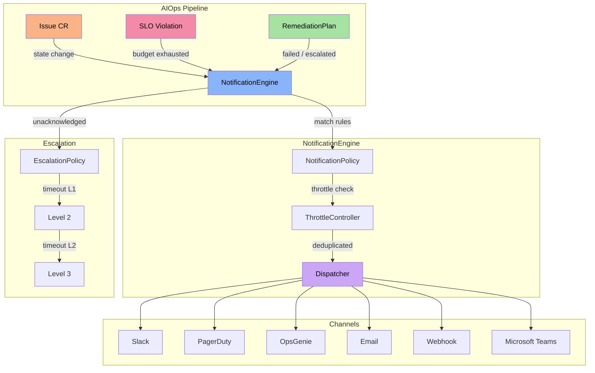
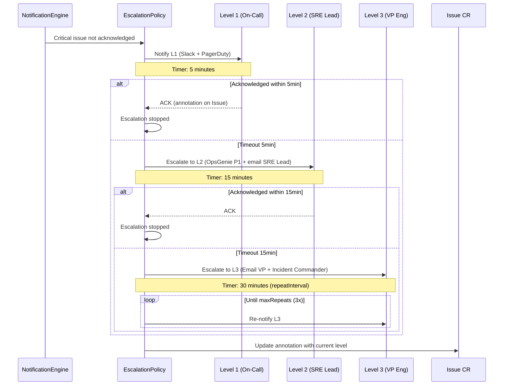

The AIOps platform notification system allows alerts, Issue state changes, and SLA violations to be automatically communicated to the right teams, on the right channels, at the right time. Combined with escalation policies, it ensures that no critical incident goes unnoticed.


## Overview



The `NotificationEngine` is triggered whenever:

| Event | Description |
|-------|-------------|
| **Issue state change** | State transition (Detected, Analyzing, Remediating, Resolved, Escalated) |
| **SLO burn rate alert** | Burn rate exceeds threshold in short+long windows |
| **SLA violation** | Response or resolution time exceeded the limit |
| **Remediation failure** | RemediationPlan failed and reached max attempts |
| **Approval request** | ApprovalRequest created awaiting approval |


## NotificationPolicy CRD

The `NotificationPolicy` defines **which events** trigger notifications, **to which channels**, and with which **throttling rules**.

```yaml
apiVersion: platform.chatcli.io/v1alpha1
kind: NotificationPolicy
metadata:
  name: production-alerts
  namespace: production
spec:
  rules:
    - name: critical-incidents
      match:
        severities: [critical, high]
        signalTypes: [oom_kill, deploy_failing, error_rate]
        namespaces: [production, payments]
        resourceKinds: [Deployment, StatefulSet]
        states: [Detected, Escalated]
      channels:
        - type: slack
          config:
            webhook_url: "https://hooks.slack.com/services/T00/B00/xxxxx"
            channel: "#incidents-critical"
            mention: "@oncall-sre"
        - type: pagerduty
          config:
            routing_key: "R0xxxxxxxxxxxxxxxxxxxxxxxxxxxx"
            severity_mapping:
              critical: critical
              high: error
        - type: opsgenie
          config:
            api_key: "xxxxxxxx-xxxx-xxxx-xxxx-xxxxxxxxxxxx"
            priority_mapping:
              critical: P1
              high: P2
            responders:
              - type: team
                name: platform-sre
            tags: [production, aiops]

    - name: low-severity-digest
      match:
        severities: [medium, low]
        states: [Resolved]
      channels:
        - type: email
          config:
            smtp_host: smtp.company.com
            smtp_port: 587
            from: "aiops@company.com"
            to: ["sre-team@company.com"]
            subject_template: "[ChatCLI AIOps] {{.Severity}} - {{.ResourceName}}"
            tls_skip_verify: false

    - name: all-events-webhook
      match:
        severities: [critical, high, medium, low]
      channels:
        - type: webhook
          config:
            url: "https://internal-api.company.com/aiops/events"
            secret: "whsec_xxxxxxxxxxxxxxxxxxxxxxxx"
            headers:
              X-Source: chatcli-aiops
              X-Environment: production

    - name: teams-infra
      match:
        severities: [critical, high]
        namespaces: [infrastructure]
      channels:
        - type: teams
          config:
            webhook_url: "https://outlook.office.com/webhook/xxx/IncomingWebhook/yyy/zzz"

  throttle:
    deduplicationWindow: "5m"
    maxPerHour: 60
    groupBy: [namespace, resourceName, severity]
```

### Spec Fields

#### NotificationRule

Each rule defines a **match + channels** pair. Multiple rules can be defined in the same policy.

| Field | Type | Required | Description |
|-------|------|:--------:|-------------|
| `name` | string | **Yes** | Unique rule name within the policy |
| `match` | NotificationMatch | **Yes** | Matching criteria |
| `channels` | []ChannelConfig | **Yes** | List of destination channels |

#### NotificationMatch

All fields are optional. If omitted, it acts as a wildcard (match all). When multiple fields are defined, the logic is **AND** between fields and **OR** within each field.

| Field | Type | Description |
|-------|------|-------------|
| `severities` | []string | `critical`, `high`, `medium`, `low` |
| `signalTypes` | []string | `oom_kill`, `pod_restart`, `pod_not_ready`, `deploy_failing`, `error_rate`, `latency_spike` |
| `namespaces` | []string | K8s namespaces to monitor |
| `resourceKinds` | []string | `Deployment`, `StatefulSet`, `DaemonSet` |
| `states` | []string | `Detected`, `Analyzing`, `Remediating`, `Resolved`, `Escalated`, `Failed` |

<Tip>
Combine `severities` with `states` for fine-grained control. Example: notify `critical` only on `Detected` and `Escalated`, avoiding noise from intermediate transitions.
</Tip>

#### ThrottleConfig

Controls the frequency and deduplication of notifications to prevent alert fatigue.

| Field | Type | Default | Description |
|-------|------|---------|-------------|
| `deduplicationWindow` | duration | `5m` | Temporal window for deduplication. Identical notifications within this window are suppressed. |
| `maxPerHour` | int | `120` | Maximum notifications per hour per policy. Excess notifications are queued. |
| `groupBy` | []string | `[namespace, resourceName]` | Fields used to group notifications. Notifications from the same group are consolidated. |

```text
Dedup key = hash(policy_name + rule_name + groupBy_values + severity)

Example with groupBy=[namespace, resourceName, severity]:
  key = hash("production-alerts" + "critical-incidents" + "production" + "api-gateway" + "critical")
```

<Warning>
Setting `maxPerHour` too low (e.g., 5) may suppress critical alerts. Use values &gt;= 30 for policies covering `critical` and `high` severities. The throttle never blocks the first notification of a new incident.
</Warning>


## Notification Channels

### 1. Slack

Sends notifications via Slack Incoming Webhooks using **Block Kit** for rich formatting.

<Accordion title="Full Slack configuration">

| Field | Type | Required | Description |
|-------|------|:--------:|-------------|
| `webhook_url` | string | **Yes** | Slack Incoming Webhook URL |
| `channel` | string | No | Channel override (requires webhook with permission) |
| `mention` | string | No | Mention (@user, @here, @channel, @oncall-group) |
| `username` | string | No | Bot name (default: `ChatCLI AIOps`) |
| `icon_emoji` | string | No | Bot emoji (default: `:robot_face:`) |

**Block Kit colors by severity:**

| Severity | Color (hex) | Visual |
|----------|-------------|--------|
| Critical | `#E74C3C` | Intense red |
| High | `#E67E22` | Orange |
| Medium | `#F1C40F` | Yellow |
| Low | `#2ECC71` | Green |

**Block Kit payload sent:**

```json
{
  "channel": "#incidents-critical",
  "username": "ChatCLI AIOps",
  "icon_emoji": ":robot_face:",
  "blocks": [
    {
      "type": "header",
      "text": {
        "type": "plain_text",
        "text": "CRITICAL: OOMKilled on api-gateway"
      }
    },
    {
      "type": "section",
      "fields": [
        {"type": "mrkdwn", "text": "*Namespace:*\nproduction"},
        {"type": "mrkdwn", "text": "*Resource:*\nDeployment/api-gateway"},
        {"type": "mrkdwn", "text": "*Signal:*\noom_kill"},
        {"type": "mrkdwn", "text": "*Risk Score:*\n85/100"},
        {"type": "mrkdwn", "text": "*State:*\nDetected"},
        {"type": "mrkdwn", "text": "*Confidence:*\n0.92"}
      ]
    },
    {
      "type": "section",
      "text": {
        "type": "mrkdwn",
        "text": "*Analysis:*\nMemory limit (512Mi) insufficient for current workload..."
      }
    },
    {
      "type": "context",
      "elements": [
        {"type": "mrkdwn", "text": "Issue: `api-gateway-oom-kill-1771276354` | <https://grafana.company.com/d/aiops|Dashboard>"}
      ]
    }
  ],
  "attachments": [{"color": "#E74C3C"}]
}
```

</Accordion>

**Minimal example:**

```yaml
channels:
  - type: slack
    config:
      webhook_url: "https://hooks.slack.com/services/T00/B00/xxxxx"
```

### 2. PagerDuty

Integrates with PagerDuty via **Events API v2** for on-call incident management.

<Accordion title="Full PagerDuty configuration">

| Field | Type | Required | Description |
|-------|------|:--------:|-------------|
| `routing_key` | string | **Yes** | PagerDuty service Integration Key (Events API v2) |
| `severity_mapping` | map | No | Mapping of ChatCLI severities to PagerDuty |
| `dedup_key_template` | string | No | Template for dedup_key (default: `{{.IssueName}}`) |
| `custom_details` | map | No | Extra fields in the payload |

**Default severity mapping:**

| ChatCLI | PagerDuty | Behavior |
|---------|-----------|----------|
| `critical` | `critical` | Triggers on-call immediately |
| `high` | `error` | High priority |
| `medium` | `warning` | Moderate priority |
| `low` | `info` | Informational |

**Deduplication:**

The `dedup_key` ensures that updates to the same incident do not create duplicate alerts in PagerDuty. The default uses the Issue name, but it can be customized:

```yaml
dedup_key_template: "{{.Namespace}}-{{.ResourceName}}-{{.SignalType}}"
```

**Payload sent (Events API v2):**

```json
{
  "routing_key": "R0xxxxxxxxxxxxxxxxxxxxxxxxxxxx",
  "event_action": "trigger",
  "dedup_key": "api-gateway-oom-kill-1771276354",
  "payload": {
    "summary": "[CRITICAL] OOMKilled on production/api-gateway",
    "severity": "critical",
    "source": "chatcli-aiops",
    "component": "api-gateway",
    "group": "production",
    "class": "oom_kill",
    "custom_details": {
      "risk_score": 85,
      "confidence": 0.92,
      "analysis": "Memory limit (512Mi) insufficient...",
      "issue_name": "api-gateway-oom-kill-1771276354",
      "remediation_plan": "RestartDeployment + AdjustResources"
    }
  }
}
```

**Automatic resolution:** When the Issue transitions to `Resolved`, the NotificationEngine sends `event_action: resolve` with the same `dedup_key`, automatically closing the incident in PagerDuty.

</Accordion>

### 3. OpsGenie

Integrates with OpsGenie for alerts and on-call management with P1-P4 priorities.

<Accordion title="Full OpsGenie configuration">

| Field | Type | Required | Description |
|-------|------|:--------:|-------------|
| `api_key` | string | **Yes** | OpsGenie API Key |
| `api_url` | string | No | API URL (default: `https://api.opsgenie.com`) |
| `priority_mapping` | map | No | Mapping of severities to priorities |
| `responders` | []Responder | No | Responsible teams or users |
| `tags` | []string | No | Tags to categorize alerts |
| `visible_to` | []Responder | No | Who can see the alert |
| `actions` | []string | No | Custom actions on the alert |

**Default priority mapping:**

| ChatCLI | OpsGenie | Description |
|---------|----------|-------------|
| `critical` | `P1` | Critical - triggers on-call immediately |
| `high` | `P2` | High priority |
| `medium` | `P3` | Moderate priority |
| `low` | `P4` | Low priority |

**Responder types:**

```yaml
responders:
  - type: team       # Entire team
    name: platform-sre
  - type: user       # Specific user
    username: edilson@company.com
  - type: escalation # OpsGenie escalation policy
    name: sre-escalation
  - type: schedule   # On-call schedule
    name: sre-oncall
```

</Accordion>

### 4. Email

Sends notifications via SMTP with STARTTLS support and HTML templates.

<Accordion title="Full Email configuration">

| Field | Type | Required | Description |
|-------|------|:--------:|-------------|
| `smtp_host` | string | **Yes** | SMTP server host |
| `smtp_port` | int | **Yes** | SMTP port (587 for STARTTLS, 465 for SSL) |
| `from` | string | **Yes** | Sender address |
| `to` | []string | **Yes** | List of recipients |
| `cc` | []string | No | Carbon copy |
| `bcc` | []string | No | Blind carbon copy |
| `username` | string | No | SMTP credential (if auth required) |
| `password_secret` | SecretRef | No | Reference to the Secret containing the SMTP password |
| `subject_template` | string | No | Go template for the subject |
| `tls_skip_verify` | bool | No | Skip TLS verification (default: `false`) |
| `html_template` | string | No | Custom HTML template (Go template) |

**Variables available in templates:**

| Variable | Description |
|----------|-------------|
| `{{.Severity}}` | Alert severity |
| `{{.ResourceName}}` | K8s resource name |
| `{{.Namespace}}` | Namespace |
| `{{.SignalType}}` | Signal type |
| `{{.State}}` | Current Issue state |
| `{{.RiskScore}}` | Risk score (0-100) |
| `{{.Analysis}}` | AI analysis |
| `{{.IssueName}}` | Issue CR name |
| `{{.Timestamp}}` | ISO 8601 timestamp |

**Example with STARTTLS:**

```yaml
channels:
  - type: email
    config:
      smtp_host: smtp.company.com
      smtp_port: 587
      from: "aiops@company.com"
      to: ["sre-team@company.com", "platform-leads@company.com"]
      cc: ["vp-engineering@company.com"]
      username: "aiops@company.com"
      password_secret:
        name: smtp-credentials
        key: password
      subject_template: "[{{.Severity}}] {{.SignalType}} on {{.Namespace}}/{{.ResourceName}}"
      tls_skip_verify: false
```

</Accordion>

<Warning>
Never put SMTP credentials directly in the NotificationPolicy YAML. Always use `password_secret` pointing to a Kubernetes Secret.
</Warning>

### 5. Webhook

Sends notifications to arbitrary HTTP endpoints with HMAC-SHA256 signing.

<Accordion title="Full Webhook configuration">

| Field | Type | Required | Description |
|-------|------|:--------:|-------------|
| `url` | string | **Yes** | Destination endpoint URL |
| `secret` | string | No | Key for HMAC-SHA256 signing |
| `headers` | map | No | Custom HTTP headers |
| `method` | string | No | HTTP method (default: `POST`) |
| `timeout` | duration | No | Request timeout (default: `10s`) |
| `retry_count` | int | No | Number of retries on failure (default: `3`) |
| `retry_interval` | duration | No | Interval between retries (default: `5s`) |

**HMAC-SHA256 signing:**

When `secret` is defined, every request includes the `X-ChatCLI-Signature` header with the HMAC-SHA256 signature of the body:

```text
X-ChatCLI-Signature: sha256=<hex(HMAC-SHA256(secret, body))>
```

**Validation on the receiver:**

```python
import hmac, hashlib

def verify_signature(payload: bytes, signature: str, secret: str) -> bool:
    expected = hmac.new(
        secret.encode(), payload, hashlib.sha256
    ).hexdigest()
    return hmac.compare_digest(f"sha256={expected}", signature)
```

**JSON payload sent:**

```json
{
  "event_type": "issue.state_changed",
  "timestamp": "2026-03-19T14:30:00Z",
  "issue": {
    "name": "api-gateway-oom-kill-1771276354",
    "namespace": "production",
    "severity": "critical",
    "state": "Detected",
    "signal_type": "oom_kill",
    "risk_score": 85,
    "resource": {
      "kind": "Deployment",
      "name": "api-gateway"
    }
  },
  "analysis": {
    "text": "Memory limit (512Mi) insufficient...",
    "confidence": 0.92,
    "recommendations": ["Increase memory limit to 1Gi"]
  },
  "remediation": {
    "plan_name": "api-gateway-oom-kill-plan-1",
    "actions": ["RestartDeployment", "AdjustResources"]
  }
}
```

</Accordion>

### 6. Microsoft Teams

Sends notifications to Microsoft Teams channels via **Adaptive Cards** and Incoming Webhooks.

<Accordion title="Full Microsoft Teams configuration">

| Field | Type | Required | Description |
|-------|------|:--------:|-------------|
| `webhook_url` | string | **Yes** | Teams Incoming Webhook URL |
| `title_template` | string | No | Template for the card title |
| `theme_color` | string | No | Theme color (hex, without `#`) |

**Generated Adaptive Card:**

The NotificationEngine builds an Adaptive Card with sections for:
- Header with colored severity
- Resource details (namespace, kind, name)
- AI analysis (if available)
- Suggested actions
- Link to the Grafana dashboard

**Card colors by severity:**

| Severity | theme_color |
|----------|-------------|
| Critical | `E74C3C` |
| High | `E67E22` |
| Medium | `F1C40F` |
| Low | `2ECC71` |

</Accordion>


## EscalationPolicy CRD

The `EscalationPolicy` defines the automatic escalation chain when an alert is not acknowledged within the defined timeout.

```yaml
apiVersion: platform.chatcli.io/v1alpha1
kind: EscalationPolicy
metadata:
  name: production-escalation
  namespace: production
spec:
  match:
    severities: [critical, high]
    namespaces: [production, payments]
  levels:
    - name: L1 - On-Call SRE
      timeout: "5m"
      targets:
        - type: channel
          channel:
            type: slack
            config:
              webhook_url: "https://hooks.slack.com/services/T00/B00/l1-hook"
              channel: "#sre-oncall"
              mention: "@oncall-sre"
        - type: channel
          channel:
            type: pagerduty
            config:
              routing_key: "R0-l1-routing-key"

    - name: L2 - SRE Lead + Platform Team
      timeout: "15m"
      targets:
        - type: user
          user: "sre-lead@company.com"
        - type: team
          team: "platform-engineering"
        - type: channel
          channel:
            type: opsgenie
            config:
              api_key: "xxxxxxxx"
              priority_mapping:
                critical: P1
                high: P1

    - name: L3 - VP Engineering + Incident Commander
      timeout: "30m"
      targets:
        - type: user
          user: "vp-eng@company.com"
        - type: oncall
          oncall:
            schedule: "incident-commander"
            provider: opsgenie
        - type: channel
          channel:
            type: email
            config:
              smtp_host: smtp.company.com
              smtp_port: 587
              from: "aiops-critical@company.com"
              to: ["exec-team@company.com"]

  repeatInterval: "30m"
  maxRepeats: 3
```

### Spec Fields

| Field | Type | Required | Description |
|-------|------|:--------:|-------------|
| `match` | EscalationMatch | **Yes** | Criteria for applying this escalation |
| `levels` | []EscalationLevel | **Yes** | Ordered chain of escalation levels |
| `repeatInterval` | duration | No | Interval to repeat the last level (default: `30m`) |
| `maxRepeats` | int | No | Maximum repetitions of the last level (default: `3`) |

#### EscalationLevel

| Field | Type | Required | Description |
|-------|------|:--------:|-------------|
| `name` | string | **Yes** | Descriptive name of the level |
| `timeout` | duration | **Yes** | Time without acknowledgement before escalating to the next level |
| `targets` | []EscalationTarget | **Yes** | Notification destinations at this level |

#### EscalationTarget

| Field | Type | Description |
|-------|------|-------------|
| `type` | string | `channel`, `user`, `team`, `oncall` |
| `channel` | ChannelConfig | Channel configuration (when type=channel) |
| `user` | string | User email (when type=user) |
| `team` | string | Team name (when type=team) |
| `oncall` | OnCallRef | Reference to the on-call schedule (when type=oncall) |

### How Escalation Works



**Tracking via annotations:**

The `EscalationPolicy` reconciler tracks escalation state using annotations on the Issue CR:

| Annotation | Description |
|------------|-------------|
| `platform.chatcli.io/escalation-level` | Current level (0=L1, 1=L2, 2=L3) |
| `platform.chatcli.io/escalation-started-at` | Timestamp of escalation start |
| `platform.chatcli.io/escalation-acknowledged` | `true` when acknowledged |
| `platform.chatcli.io/escalation-acknowledged-by` | Who acknowledged |
| `platform.chatcli.io/escalation-repeat-count` | Repeat count of the last level |

**Acknowledgement:**

To stop the escalation chain, the on-call must acknowledge the alert:

```bash
kubectl annotate issue api-gateway-oom-kill-1771276354 \
  platform.chatcli.io/escalation-acknowledged=true \
  platform.chatcli.io/escalation-acknowledged-by=edilson
```

Or via PagerDuty/OpsGenie (the return webhook updates the annotation automatically).


## Complete Examples

### Notification Policy: Slack + PagerDuty

```yaml
apiVersion: platform.chatcli.io/v1alpha1
kind: NotificationPolicy
metadata:
  name: critical-alerts-multi-channel
  namespace: production
spec:
  rules:
    - name: critical-to-slack-and-pagerduty
      match:
        severities: [critical]
        states: [Detected, Escalated]
      channels:
        - type: slack
          config:
            webhook_url: "https://hooks.slack.com/services/T00/B00/critical-hook"
            channel: "#p0-incidents"
            mention: "@here"
        - type: pagerduty
          config:
            routing_key: "R0-critical-routing-key"
            severity_mapping:
              critical: critical

    - name: high-to-slack
      match:
        severities: [high]
        states: [Detected, Remediating, Escalated]
      channels:
        - type: slack
          config:
            webhook_url: "https://hooks.slack.com/services/T00/B00/high-hook"
            channel: "#incidents"

    - name: resolved-to-slack
      match:
        states: [Resolved]
      channels:
        - type: slack
          config:
            webhook_url: "https://hooks.slack.com/services/T00/B00/resolved-hook"
            channel: "#incidents"

  throttle:
    deduplicationWindow: "3m"
    maxPerHour: 100
    groupBy: [namespace, resourceName]
```

### Escalation Policy L1 -&gt; L2 -&gt; L3

```yaml
apiVersion: platform.chatcli.io/v1alpha1
kind: EscalationPolicy
metadata:
  name: p0-escalation
  namespace: production
spec:
  match:
    severities: [critical]
  levels:
    - name: L1 - Primary On-Call
      timeout: "5m"
      targets:
        - type: channel
          channel:
            type: pagerduty
            config:
              routing_key: "R0-primary-oncall"
        - type: channel
          channel:
            type: slack
            config:
              webhook_url: "https://hooks.slack.com/services/T00/B00/oncall"
              channel: "#sre-oncall"
              mention: "@oncall-primary"

    - name: L2 - Secondary On-Call + SRE Manager
      timeout: "10m"
      targets:
        - type: oncall
          oncall:
            schedule: "secondary-oncall"
            provider: pagerduty
        - type: user
          user: "sre-manager@company.com"
        - type: channel
          channel:
            type: opsgenie
            config:
              api_key: "xxx"
              priority_mapping:
                critical: P1

    - name: L3 - Engineering Leadership
      timeout: "20m"
      targets:
        - type: team
          team: engineering-leadership
        - type: channel
          channel:
            type: email
            config:
              smtp_host: smtp.company.com
              smtp_port: 587
              from: "aiops-escalation@company.com"
              to: ["cto@company.com", "vp-eng@company.com"]
              subject_template: "[P0 ESCALATED] {{.ResourceName}} - {{.SignalType}} unresolved"

  repeatInterval: "15m"
  maxRepeats: 5
```

### Email for SLA Breaches

```yaml
apiVersion: platform.chatcli.io/v1alpha1
kind: NotificationPolicy
metadata:
  name: sla-breach-notifications
  namespace: production
spec:
  rules:
    - name: sla-violation-email
      match:
        severities: [critical, high]
        signalTypes: [sla_violation]
      channels:
        - type: email
          config:
            smtp_host: smtp.company.com
            smtp_port: 587
            from: "sla-alerts@company.com"
            to:
              - "sre-team@company.com"
              - "service-owners@company.com"
            cc:
              - "vp-eng@company.com"
            username: "sla-alerts@company.com"
            password_secret:
              name: smtp-credentials
              key: password
            subject_template: "[SLA BREACH] {{.Severity}} - {{.Namespace}}/{{.ResourceName}} exceeds SLA"
            tls_skip_verify: false
        - type: slack
          config:
            webhook_url: "https://hooks.slack.com/services/T00/B00/sla-hook"
            channel: "#sla-violations"
            mention: "@service-owners"

  throttle:
    deduplicationWindow: "30m"
    maxPerHour: 20
    groupBy: [namespace, resourceName]
```


## Troubleshooting

<AccordionGroup>
  <Accordion title="Notifications are not being sent">
    **Diagnostic checklist:**

    1. Verify that the `NotificationPolicy` exists in the correct namespace:
    ```bash
    kubectl get notificationpolicies -A
    ```

    2. Check the operator logs for dispatch errors:
    ```bash
    kubectl logs -l app=chatcli-operator -n chatcli-system | grep "notification"
    ```

    3. Confirm that the matching is correct:
    ```bash
    kubectl get issues -n production -o yaml | grep -A5 "severity\|state\|signalType"
    ```

    4. Verify that throttling is not suppressing notifications:
    ```bash
    kubectl logs -l app=chatcli-operator -n chatcli-system | grep "throttled\|deduplicated"
    ```
  </Accordion>

  <Accordion title="Slack returns 404 or invalid_payload error">
    - Confirm that the `webhook_url` is correct and the Slack app is installed in the workspace
    - Verify that the channel exists and the bot has permission to post
    - Test the webhook manually:
    ```bash
    curl -X POST -H 'Content-type: application/json' \
      --data '{"text":"ChatCLI AIOps Test"}' \
      "https://hooks.slack.com/services/T00/B00/xxxxx"
    ```
  </Accordion>

  <Accordion title="PagerDuty does not create incidents">
    - Confirm that the `routing_key` is an Integration Key (not an API Key)
    - Verify that the service in PagerDuty is active
    - Validate the payload in the PagerDuty Event Debugger
    - Confirm that the event is not being deduplicated by the `dedup_key`
  </Accordion>

  <Accordion title="Emails are not arriving">
    - Verify SMTP connectivity:
    ```bash
    kubectl exec -it deploy/chatcli-operator -n chatcli-system -- \
      nc -zv smtp.company.com 587
    ```
    - Confirm credentials in the Secret referenced by `password_secret`
    - Verify that `tls_skip_verify: false` and the server certificate is valid
    - Check the recipients' spam folder
  </Accordion>

  <Accordion title="Escalation does not advance to the next level">
    - Check Issue annotations:
    ```bash
    kubectl get issue &lt;name&gt; -o yaml | grep "escalation"
    ```
    - Confirm that `escalation-acknowledged` is not set to `true`
    - Check the EscalationPolicy reconciler logs
    - Confirm that the level `timeout` is not greater than the time since creation
  </Accordion>

  <Accordion title="Webhook returns signature error">
    - Confirm that the `secret` in the policy is the same used by the receiver for verification
    - Verify that the receiver is reading the raw body before parsing JSON
    - Use `hmac.compare_digest` (or equivalent) to avoid timing attacks
  </Accordion>
</AccordionGroup>


## Prometheus Metrics

The notification system exposes metrics for full observability:

| Metric | Type | Labels | Description |
|--------|------|--------|-------------|
| `chatcli_notifications_sent_total` | Counter | `channel`, `severity`, `rule`, `namespace` | Total notifications sent successfully |
| `chatcli_notifications_failed_total` | Counter | `channel`, `severity`, `rule`, `error_type` | Total notifications that failed |
| `chatcli_notifications_throttled_total` | Counter | `rule`, `reason` | Notifications suppressed by throttle or dedup |
| `chatcli_notification_dispatch_duration_seconds` | Histogram | `channel` | Dispatch latency per channel |
| `chatcli_escalation_level_reached` | Gauge | `policy`, `namespace` | Current escalation level per policy |
| `chatcli_escalation_acknowledged_total` | Counter | `policy`, `level` | Total escalations acknowledged per level |
| `chatcli_escalation_timeout_total` | Counter | `policy`, `level` | Total escalation timeouts per level |

**Recommended Prometheus alerts:**

```yaml
groups:
  - name: chatcli-notifications
    rules:
      - alert: NotificationChannelFailing
        expr: rate(chatcli_notifications_failed_total[5m]) > 0.1
        for: 5m
        labels:
          severity: warning
        annotations:
          summary: "Notification channel {{ $labels.channel }} is failing"
          description: "Failure rate > 0.1/s in the last 5 minutes"

      - alert: EscalationReachedL3
        expr: chatcli_escalation_level_reached >= 2
        for: 1m
        labels:
          severity: critical
        annotations:
          summary: "Escalation reached L3 for policy {{ $labels.policy }}"
          description: "Unacknowledged incident reached the last escalation level"

      - alert: HighThrottleRate
        expr: rate(chatcli_notifications_throttled_total[10m]) > 1
        for: 10m
        labels:
          severity: warning
        annotations:
          summary: "High throttling rate on rule {{ $labels.rule }}"
```


## Next Steps

<CardGroup cols={2}>
  <Card title="SLOs and SLAs" icon="gauge-high" href="/en/features/aiops/slo-sla">
    Service Level Objectives management with burn rate alerting
  </Card>
  <Card title="Approval Workflow" icon="shield-check" href="/en/features/aiops/approval-workflow">
    Change control with approval policies and blast radius
  </Card>
  <Card title="AIOps Platform" icon="brain" href="/en/features/aiops-platform">
    Deep-dive into the AIOps architecture
  </Card>
  <Card title="K8s Operator" icon="dharmachakra" href="/en/features/k8s-operator">
    Operator configuration and CRDs
  </Card>
</CardGroup>
