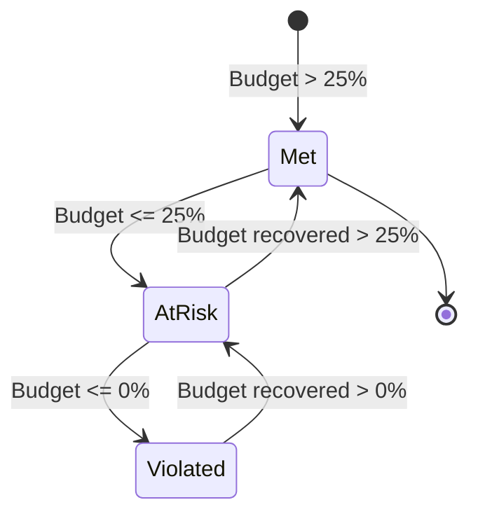

The ChatCLI AIOps platform provides native management of **Service Level Objectives (SLOs)** and **Service Level Agreements (SLAs)** via Kubernetes CRDs. The system implements Google SRE's burn rate model for intelligent alerting and tracks SLA compliance with business hours support.


## SLO vs SLA: Understanding the Difference

| Aspect | SLO (Service Level Objective) | SLA (Service Level Agreement) |
|--------|-------------------------------|-------------------------------|
| **Definition** | **Internal** reliability target for a service | **Formal contract** with customers/stakeholders |
| **Who defines** | Engineering team | Business + engineering + legal |
| **Consequence of violation** | Internal alert, deploy freeze, review | Contractual penalties, credits, fines |
| **Example** | "99.9% availability in 30 days" | "P1 incidents responded to within 5 minutes" |
| **CRD** | `ServiceLevelObjective` | `IncidentSLA` |

<Note>
Best practice is to define SLOs that are **more stringent** than SLAs. If your SLA guarantees 99.9%, set the SLO at 99.95%. This creates a safety margin (internal error budget) that allows detecting degradations before the SLA is violated.
</Note>


## ServiceLevelObjective CRD

The `ServiceLevelObjective` defines a reliability target for a service, with alerts based on burn rate and error budget tracking.

```yaml
apiVersion: platform.chatcli.io/v1alpha1
kind: ServiceLevelObjective
metadata:
  name: api-gateway-availability
  namespace: production
spec:
  service: api-gateway
  description: "API Gateway must maintain 99.9% availability in a 30-day window"

  indicator:
    type: availability
    prometheusQuery:
      goodQuery: 'sum(rate(http_requests_total{service="api-gateway",code=~"2..|3.."}[5m]))'
      totalQuery: 'sum(rate(http_requests_total{service="api-gateway"}[5m]))'

  target:
    percentage: 99.9
    window: 30d

  burnRateAlerts:
    - name: page-fast-burn
      shortWindow: 1h
      longWindow: 6h
      burnRateThreshold: 14.4
      severity: critical
      notificationPolicy: production-alerts

    - name: ticket-medium-burn
      shortWindow: 6h
      longWindow: 3d
      burnRateThreshold: 6.0
      severity: high
      notificationPolicy: production-alerts

    - name: ticket-slow-burn
      shortWindow: 24h
      longWindow: 3d
      burnRateThreshold: 3.0
      severity: medium

    - name: monitor-gradual-burn
      shortWindow: 72h
      longWindow: 30d
      burnRateThreshold: 1.0
      severity: low

  alertPolicy:
    multiWindowRequired: true
    pageOnBudgetExhausted: true
    budgetWarningThresholds: [50, 25, 10, 0]

status:
  currentValue: 99.92
  errorBudgetTotal: 0.001
  errorBudgetRemaining: 0.0008
  errorBudgetRemainingPercent: 80.0
  burnRate: 1.2
  lastCalculatedAt: "2026-03-19T14:00:00Z"
  condition: Met
```

### Spec Fields

#### Root

| Field | Type | Required | Description |
|-------|------|:--------:|-------------|
| `service` | string | **Yes** | Name of the monitored service |
| `description` | string | No | Human-readable description of the SLO |
| `indicator` | SLOIndicator | **Yes** | Service Level Indicator (SLI) definition |
| `target` | SLOTarget | **Yes** | Target and time window |
| `burnRateAlerts` | []BurnRateWindow | No | Multi-window alert configuration |
| `alertPolicy` | SLOAlertPolicy | No | General alert policy |

#### SLOIndicator

Defines **what** to measure. The `type` determines the semantics and required Prometheus queries.

| Field | Type | Required | Description |
|-------|------|:--------:|-------------|
| `type` | string | **Yes** | `availability`, `latency`, `error_rate`, `throughput` |
| `prometheusQuery` | PrometheusQuerySpec | **Yes** | PromQL queries to calculate the SLI |

**Indicator types:**

| Type | Good Events | Total Events | Calculation |
|------|------------|--------------|-------------|
| `availability` | Successful requests (2xx, 3xx) | Total requests | good / total |
| `latency` | Requests below the latency threshold | Total requests | fast / total |
| `error_rate` | N/A (inverted) | Error requests | 1 - (errors / total) |
| `throughput` | Requests processed within budget | Requests received | processed / received |

**PrometheusQuerySpec:**

| Field | Type | Required | Description |
|-------|------|:--------:|-------------|
| `goodQuery` | string | **Yes** | PromQL that returns the rate of "good" events |
| `totalQuery` | string | **Yes** | PromQL that returns the total event rate |

<Tabs>
  <Tab title="Availability">
    ```yaml
    indicator:
      type: availability
      prometheusQuery:
        goodQuery: 'sum(rate(http_requests_total{service="api-gateway",code=~"2..|3.."}[5m]))'
        totalQuery: 'sum(rate(http_requests_total{service="api-gateway"}[5m]))'
    ```
  </Tab>
  <Tab title="Latency (P99 under 500ms)">
    ```yaml
    indicator:
      type: latency
      prometheusQuery:
        goodQuery: 'sum(rate(http_request_duration_seconds_bucket{service="api-gateway",le="0.5"}[5m]))'
        totalQuery: 'sum(rate(http_request_duration_seconds_count{service="api-gateway"}[5m]))'
    ```
  </Tab>
  <Tab title="Error Rate">
    ```yaml
    indicator:
      type: error_rate
      prometheusQuery:
        goodQuery: 'sum(rate(http_requests_total{service="api-gateway",code!~"5.."}[5m]))'
        totalQuery: 'sum(rate(http_requests_total{service="api-gateway"}[5m]))'
    ```
  </Tab>
  <Tab title="Custom (Throughput)">
    ```yaml
    indicator:
      type: throughput
      prometheusQuery:
        goodQuery: 'sum(rate(queue_messages_processed_total{service="worker"}[5m]))'
        totalQuery: 'sum(rate(queue_messages_received_total{service="worker"}[5m]))'
    ```
  </Tab>
</Tabs>

#### SLOTarget

| Field | Type | Required | Description |
|-------|------|:--------:|-------------|
| `percentage` | float64 | **Yes** | Target percentage (e.g., 99.9) |
| `window` | duration | **Yes** | Rolling time window (e.g., `30d`, `7d`, `24h`) |

#### BurnRateWindow

Each entry defines an alert window based on burn rate.

| Field | Type | Required | Description |
|-------|------|:--------:|-------------|
| `name` | string | **Yes** | Alert identifier name |
| `shortWindow` | duration | **Yes** | Short observation window |
| `longWindow` | duration | **Yes** | Long observation window |
| `burnRateThreshold` | float64 | **Yes** | Burn rate threshold to trigger the alert |
| `severity` | string | **Yes** | `critical`, `high`, `medium`, `low` |
| `notificationPolicy` | string | No | NotificationPolicy name for routing |

#### SLOAlertPolicy

| Field | Type | Default | Description |
|-------|------|---------|-------------|
| `multiWindowRequired` | bool | `true` | Requires BOTH windows (short AND long) to exceed the threshold |
| `pageOnBudgetExhausted` | bool | `true` | Sends a critical page when error budget reaches 0% |
| `budgetWarningThresholds` | []int | `[50, 25, 10, 0]` | Remaining budget percentages that trigger warnings |


## How the Calculation Works (Google SRE Model)

The system implements the multi-window, multi-burn-rate alerting model described in Google's **"Site Reliability Engineering"** book.

### Error Budget

The error budget is the maximum amount of "error" allowed within the SLO window.

```text
Error Budget = 1 - (target / 100)

Example for a 99.9% SLO:
  Error Budget = 1 - (99.9 / 100) = 0.001 = 0.1%
```

In a 30-day window, this means:

```text
Allowed downtime = 30 days x 24h x 60min x 0.001 = 43.2 minutes
```

| SLO Target | Error Budget | Downtime/30d |
|-----------|-------------|-------------|
| 99% | 1.0% | 7h 12min |
| 99.5% | 0.5% | 3h 36min |
| 99.9% | 0.1% | 43.2 min |
| 99.95% | 0.05% | 21.6 min |
| 99.99% | 0.01% | 4.32 min |

### Burn Rate

The burn rate indicates **how fast** the error budget is being consumed.

```text
Burn Rate = error_rate_in_window / error_budget

Where:
  error_rate_in_window = 1 - (good_events / total_events) [in the window]
  error_budget = 1 - (target / 100)
```

<Steps>
  <Step title="Calculate error rate in the window">
    Using the Prometheus queries, the ratio of good events vs total in the specified window is calculated.

    ```text
    Example: In the last 1h, there were 10,000 requests, 9,950 successful.
    error_rate = 1 - (9950 / 10000) = 0.005 = 0.5%
    ```
  </Step>
  <Step title="Calculate burn rate">
    Divide the error rate by the error budget.

    ```text
    burn_rate = 0.005 / 0.001 = 5.0x

    Interpretation: The budget is being consumed 5x faster than sustainable.
    At this rate, the 30-day budget would be exhausted in 6 days.
    ```
  </Step>
  <Step title="Verify multi-window">
    To trigger an alert, BOTH windows (short AND long) must exceed the threshold.

    ```text
    Alert "page-fast-burn" (threshold 14.4x):
      - Short window (1h): burn_rate = 16.2x  > 14.4  CHECK
      - Long window (6h):  burn_rate = 15.1x  > 14.4  CHECK
      -> ALERT FIRED (both exceed)

    If short=16.2x but long=12.0x:
      -> DOES NOT fire (long below threshold)
      -> Indicates a temporary spike, not sustained degradation
    ```
  </Step>
  <Step title="Classify and notify">
    Based on the configured severity, the alert is routed to the corresponding `NotificationPolicy`.
  </Step>
</Steps>

### Multi-Window Alerting: Default Thresholds

The default thresholds follow Google SRE's recommendation for a 30-day SLO:

| Name | Short Window | Long Window | Burn Rate | Severity | Meaning |
|------|-------------|-------------|-----------|----------|---------|
| `page-fast-burn` | 1h | 6h | 14.4x | Critical | Budget exhausted in **~2 days**. Requires immediate action. |
| `ticket-medium-burn` | 6h | 3d | 6.0x | High | Budget exhausted in **~5 days**. Create an urgent ticket. |
| `ticket-slow-burn` | 24h | 3d | 3.0x | Medium | Budget exhausted in **~10 days**. Investigate and plan. |
| `monitor-gradual-burn` | 72h | 30d | 1.0x | Low | Budget **exactly at a sustainable pace**. Monitor. |

<Tip>
The formula to calculate the threshold: `burn_rate_threshold = (window_days / budget_consumption_days)`. For a 30-day SLO where you want to alert when the budget would be exhausted in 2 days: `30 / 2.08 = 14.4x`.
</Tip>

### Complete Numerical Example

Consider a **99.9% availability** SLO over **30 days** for the `api-gateway` service:

```text
Configuration:
  Target: 99.9%
  Window: 30 days
  Error Budget: 0.1% = 43.2 minutes of downtime

Current situation (measured by Prometheus):
  Last 24h: 99.85% availability (0.15% error rate)
  Last 6h:  99.80% availability (0.20% error rate)
  Last 1h:  99.70% availability (0.30% error rate)

Burn rate calculation per window:
  1h:  0.003 / 0.001 = 3.0x
  6h:  0.002 / 0.001 = 2.0x
  24h: 0.0015 / 0.001 = 1.5x

Alert evaluation:
  page-fast-burn (14.4x):  1h=3.0x < 14.4  -> DOES NOT fire
  ticket-medium-burn (6x): 6h=2.0x < 6.0   -> DOES NOT fire
  ticket-slow-burn (3x):   24h=1.5x < 3.0  -> DOES NOT fire
  monitor-gradual-burn (1x): both > 1.0     -> FIRES (severity: low)

Result: Slow degradation detected. Not critical, but the budget is
being consumed 1.5x faster than sustainable. At this rate, the
43.2-minute budget would be exhausted in 20 days (instead of 30).

Remaining error budget:
  Consumed so far: ~22 minutes (estimated)
  Remaining: 43.2 - 22 = 21.2 minutes
  Remaining percentage: 49.1%
  -> 50% warning threshold nearly reached
```


## Error Budget Tracking

The `ServiceLevelObjective` status is periodically updated by the reconciler:

| Field | Type | Description |
|-------|------|-------------|
| `currentValue` | float64 | Current SLI value (e.g., 99.92%) |
| `errorBudgetTotal` | float64 | Total budget (e.g., 0.001 for 99.9%) |
| `errorBudgetRemaining` | float64 | Remaining budget |
| `errorBudgetRemainingPercent` | float64 | Remaining budget percentage |
| `burnRate` | float64 | Current burn rate (shortest window) |
| `lastCalculatedAt` | Time | Last calculation |
| `condition` | string | `Met` (within SLO), `AtRisk` (budget &lt; 25%), `Violated` (budget exhausted) |

**SLO Conditions:**



**Budget Warning Thresholds:**

When configured, the system sends notifications upon reaching each threshold:

| Remaining Budget | Action |
|-----------------|--------|
| 50% | Informational notification |
| 25% | Warning: freeze non-essential deploys |
| 10% | Alert: full focus on stability |
| 0% | Critical page (if `pageOnBudgetExhausted: true`) |


## IncidentSLA CRD

The `IncidentSLA` defines response and resolution time contracts by severity, with business hours support and violation tracking.

```yaml
apiVersion: platform.chatcli.io/v1alpha1
kind: IncidentSLA
metadata:
  name: production-sla
  namespace: production
spec:
  service: api-gateway
  description: "Production SLA for the API Gateway"

  responseTimes:
    - severity: critical
      maxResponseTime: "5m"
      maxResolutionTime: "1h"
    - severity: high
      maxResponseTime: "15m"
      maxResolutionTime: "4h"
    - severity: medium
      maxResponseTime: "1h"
      maxResolutionTime: "24h"
    - severity: low
      maxResponseTime: "4h"
      maxResolutionTime: "72h"

  businessHours:
    enabled: true
    timezone: "America/Sao_Paulo"
    startHour: 9
    endHour: 18
    workDays: [1, 2, 3, 4, 5]   # Monday to Friday (0=Sun, 6=Sat)
    holidays:
      - date: "2026-01-01"
        name: "New Year's Day"
      - date: "2026-04-03"
        name: "Good Friday"
      - date: "2026-12-25"
        name: "Christmas"

  violationPolicy:
    notificationPolicy: sla-breach-notifications
    escalationPolicy: p0-escalation
    autoEscalateOnBreach: true

status:
  activeIncidents: 2
  totalViolations: 3
  compliancePercentage: 97.5
  violations:
    - issueName: "api-gateway-oom-kill-1771276354"
      severity: critical
      type: resolution_time
      exceededBy: "12m"
      occurredAt: "2026-03-15T14:30:00Z"
  lastCalculatedAt: "2026-03-19T14:00:00Z"
```

### Spec Fields

#### Root

| Field | Type | Required | Description |
|-------|------|:--------:|-------------|
| `service` | string | **Yes** | Name of the service covered by the SLA |
| `description` | string | No | SLA description |
| `responseTimes` | []ResponseTimeConfig | **Yes** | Maximum times per severity |
| `businessHours` | BusinessHoursSpec | No | Business hours configuration |
| `violationPolicy` | ViolationPolicySpec | No | Actions on violation |

#### ResponseTimeConfig

| Field | Type | Required | Description |
|-------|------|:--------:|-------------|
| `severity` | string | **Yes** | `critical`, `high`, `medium`, `low` |
| `maxResponseTime` | duration | **Yes** | Maximum time for first acknowledgement |
| `maxResolutionTime` | duration | **Yes** | Maximum time for complete resolution |

<Info>
**Response time** is measured as the time between Issue creation (state `Detected`) and the first transition to `Analyzing` or `Remediating`. **Resolution time** is measured between `Detected` and `Resolved`.
</Info>

#### BusinessHoursSpec

| Field | Type | Required | Description |
|-------|------|:--------:|-------------|
| `enabled` | bool | **Yes** | Enable counting only during business hours |
| `timezone` | string | **Yes** | IANA timezone (e.g., `America/Sao_Paulo`) |
| `startHour` | int | **Yes** | Start hour (0-23) |
| `endHour` | int | **Yes** | End hour (0-23) |
| `workDays` | []int | **Yes** | Work days (0=Sunday, 6=Saturday) |
| `holidays` | []Holiday | No | Holidays (clock paused on these days) |

#### How the Business Hours Clock Works

The SLA clock only counts during business hours. Outside of business hours, the clock is automatically paused.

<Steps>
  <Step title="Incident detected">
    Issue created at 17:45 (Friday). Clock starts.

    ```text
    Business hours: 09:00-18:00 (Mon-Fri), timezone America/Sao_Paulo
    ```
  </Step>
  <Step title="Clock counts 15 minutes (Friday)">
    From 17:45 to 18:00 = **15 minutes** of SLA clock.
    Clock **pauses** at 18:00 (end of business hours).
  </Step>
  <Step title="Weekend: clock paused">
    All of Saturday and Sunday: clock remains paused.
    Accumulated SLA time: **15 minutes**.
  </Step>
  <Step title="Monday: clock resumes">
    Clock **resumes** at 09:00 on Monday.
    If the incident is resolved at 10:30 on Monday:
    - Friday: 15 minutes
    - Monday: 1h30 = 90 minutes
    - **Total SLA: 105 minutes (1h45)**
  </Step>
  <Step title="Compliance evaluation">
    For `critical` severity with `maxResolutionTime: 1h`:
    - SLA time spent: 1h45 = 105 minutes
    - Limit: 60 minutes
    - **VIOLATION**: exceeded by 45 minutes

    For `high` severity with `maxResolutionTime: 4h`:
    - SLA time spent: 105 minutes
    - Limit: 240 minutes
    - **WITHIN SLA**
  </Step>
</Steps>

<Warning>
For `critical` incidents, consider disabling business hours (`enabled: false`) and using a 24/7 clock. Critical production issues should not wait for the next business day.
</Warning>

#### ViolationPolicySpec

| Field | Type | Description |
|-------|------|-------------|
| `notificationPolicy` | string | NotificationPolicy to send violation alerts |
| `escalationPolicy` | string | EscalationPolicy to escalate violations |
| `autoEscalateOnBreach` | bool | Automatically escalate when SLA is violated |

#### CompliancePercentage Calculation

```text
CompliancePercentage = ((total_incidents - violations) / total_incidents) * 100

Example:
  Total incidents in the period: 120
  Violations: 3
  Compliance = ((120 - 3) / 120) * 100 = 97.5%
```

Compliance is calculated **per severity** and **aggregated**:

| Severity | Incidents | Violations | Compliance |
|----------|-----------|------------|------------|
| Critical | 5 | 1 | 80.0% |
| High | 15 | 2 | 86.7% |
| Medium | 40 | 0 | 100.0% |
| Low | 60 | 0 | 100.0% |
| **Total** | **120** | **3** | **97.5%** |


## Complete YAML Examples

### 99.9% Availability SLO with Burn Rate Alerting

```yaml
apiVersion: platform.chatcli.io/v1alpha1
kind: ServiceLevelObjective
metadata:
  name: api-gateway-availability-slo
  namespace: production
spec:
  service: api-gateway
  description: "99.9% API Gateway availability measured by HTTP success rate"

  indicator:
    type: availability
    prometheusQuery:
      goodQuery: |
        sum(rate(http_requests_total{
          service="api-gateway",
          code=~"2..|3.."
        }[5m]))
      totalQuery: |
        sum(rate(http_requests_total{
          service="api-gateway"
        }[5m]))

  target:
    percentage: 99.9
    window: 30d

  burnRateAlerts:
    - name: page-immediate
      shortWindow: 1h
      longWindow: 6h
      burnRateThreshold: 14.4
      severity: critical
      notificationPolicy: production-alerts

    - name: ticket-urgent
      shortWindow: 6h
      longWindow: 3d
      burnRateThreshold: 6.0
      severity: high
      notificationPolicy: production-alerts

    - name: ticket-normal
      shortWindow: 24h
      longWindow: 3d
      burnRateThreshold: 3.0
      severity: medium

    - name: monitor
      shortWindow: 72h
      longWindow: 30d
      burnRateThreshold: 1.0
      severity: low

  alertPolicy:
    multiWindowRequired: true
    pageOnBudgetExhausted: true
    budgetWarningThresholds: [50, 25, 10, 0]
```

### SLA P1=5min Response / 1h Resolution (Business Hours)

```yaml
apiVersion: platform.chatcli.io/v1alpha1
kind: IncidentSLA
metadata:
  name: api-gateway-production-sla
  namespace: production
spec:
  service: api-gateway
  description: "Production SLA per enterprise customer contract"

  responseTimes:
    - severity: critical
      maxResponseTime: "5m"
      maxResolutionTime: "1h"
    - severity: high
      maxResponseTime: "15m"
      maxResolutionTime: "4h"
    - severity: medium
      maxResponseTime: "2h"
      maxResolutionTime: "24h"
    - severity: low
      maxResponseTime: "8h"
      maxResolutionTime: "72h"

  businessHours:
    enabled: true
    timezone: "America/Sao_Paulo"
    startHour: 9
    endHour: 18
    workDays: [1, 2, 3, 4, 5]
    holidays:
      - date: "2026-01-01"
        name: "New Year's Day"
      - date: "2026-02-16"
        name: "Carnival"
      - date: "2026-02-17"
        name: "Carnival"
      - date: "2026-04-03"
        name: "Good Friday"
      - date: "2026-04-21"
        name: "Tiradentes Day"
      - date: "2026-05-01"
        name: "Labor Day"
      - date: "2026-09-07"
        name: "Independence Day"
      - date: "2026-10-12"
        name: "Our Lady of Aparecida"
      - date: "2026-11-02"
        name: "All Souls' Day"
      - date: "2026-11-15"
        name: "Republic Proclamation Day"
      - date: "2026-12-25"
        name: "Christmas"

  violationPolicy:
    notificationPolicy: sla-breach-notifications
    escalationPolicy: p0-escalation
    autoEscalateOnBreach: true
```

<Note>
For `critical` severity, even with business hours enabled, consider creating a separate rule with `businessHours.enabled: false`. P1 issues typically require 24/7 response.
</Note>

### SLO with Custom PrometheusQuery (Latency P99)

```yaml
apiVersion: platform.chatcli.io/v1alpha1
kind: ServiceLevelObjective
metadata:
  name: payment-service-latency-slo
  namespace: payments
spec:
  service: payment-service
  description: "99.5% of Payment Service requests must complete in under 500ms"

  indicator:
    type: latency
    prometheusQuery:
      goodQuery: |
        sum(rate(http_request_duration_seconds_bucket{
          service="payment-service",
          le="0.5"
        }[5m]))
      totalQuery: |
        sum(rate(http_request_duration_seconds_count{
          service="payment-service"
        }[5m]))

  target:
    percentage: 99.5
    window: 7d

  burnRateAlerts:
    - name: page-latency-spike
      shortWindow: 30m
      longWindow: 3h
      burnRateThreshold: 14.4
      severity: critical
      notificationPolicy: payments-alerts

    - name: ticket-latency-degradation
      shortWindow: 3h
      longWindow: 1d
      burnRateThreshold: 6.0
      severity: high

    - name: monitor-latency-trend
      shortWindow: 12h
      longWindow: 7d
      burnRateThreshold: 1.0
      severity: low

  alertPolicy:
    multiWindowRequired: true
    pageOnBudgetExhausted: true
    budgetWarningThresholds: [25, 10, 0]
```


## Grafana Dashboards

The AIOps platform provides 4 pre-configured Grafana dashboards for SLO and SLA visualization:

<CardGroup cols={2}>
  <Card title="SLO Overview" icon="chart-line">
    Unified panel with all SLOs, current values, remaining error budget, and burn rate. Includes a burn rate heatmap by service.
  </Card>
  <Card title="Error Budget Burn-Down" icon="chart-area">
    Error budget burn-down chart over time. Shows trends and exhaustion projections. Reference lines for each warning threshold.
  </Card>
  <Card title="SLA Compliance Report" icon="file-chart-line">
    Compliance report by severity and period. Table with each incident, response/resolution times, and compliance status. Exportable to PDF.
  </Card>
  <Card title="Incident Timeline" icon="timeline-arrow">
    Incident timeline with detection, analysis, remediation, and resolution. Visual correlation with SLO burn rate and SLA clock.
  </Card>
</CardGroup>

**Importing the dashboards:**

```bash
# The dashboards are available as ConfigMaps
kubectl apply -f operator/config/grafana/dashboards/

# Or import via the Grafana API
for f in operator/config/grafana/dashboards/*.json; do
  curl -X POST -H "Content-Type: application/json" \
    -H "Authorization: Bearer $GRAFANA_API_KEY" \
    -d @"$f" \
    "https://grafana.company.com/api/dashboards/db"
done
```


## Prometheus Metrics

The SLO and SLA system exposes detailed metrics:

### SLO Metrics

| Metric | Type | Labels | Description |
|--------|------|--------|-------------|
| `chatcli_slo_current_value` | Gauge | `slo`, `service`, `namespace`, `indicator_type` | Current SLI value (e.g., 99.92) |
| `chatcli_slo_target_value` | Gauge | `slo`, `service` | Configured target (e.g., 99.9) |
| `chatcli_slo_error_budget_total` | Gauge | `slo`, `service` | Total error budget (e.g., 0.001) |
| `chatcli_slo_error_budget_remaining` | Gauge | `slo`, `service`, `namespace` | Remaining error budget |
| `chatcli_slo_error_budget_remaining_percent` | Gauge | `slo`, `service` | Remaining budget percentage |
| `chatcli_slo_burn_rate` | Gauge | `slo`, `service`, `window` | Burn rate per window |
| `chatcli_slo_alerts_fired_total` | Counter | `slo`, `service`, `severity`, `alert_name` | Total burn rate alerts fired |
| `chatcli_slo_condition` | Gauge | `slo`, `service`, `condition` | Current state (1=active): `Met`, `AtRisk`, `Violated` |

### SLA Metrics

| Metric | Type | Labels | Description |
|--------|------|--------|-------------|
| `chatcli_sla_violations_total` | Counter | `sla`, `service`, `severity`, `violation_type` | Total SLA violations |
| `chatcli_sla_compliance_percentage` | Gauge | `sla`, `service`, `severity` | Current compliance percentage |
| `chatcli_sla_response_time_seconds` | Histogram | `sla`, `service`, `severity` | Response time distribution |
| `chatcli_sla_resolution_time_seconds` | Histogram | `sla`, `service`, `severity` | Resolution time distribution |
| `chatcli_sla_active_incidents` | Gauge | `sla`, `service` | Currently active incidents |
| `chatcli_sla_business_hours_active` | Gauge | `sla`, `service` | 1 if within business hours, 0 if outside |

**Recommended Prometheus alerts:**

```yaml
groups:
  - name: chatcli-slo-sla
    rules:
      - alert: SLOBudgetExhausted
        expr: chatcli_slo_error_budget_remaining_percent <= 0
        for: 1m
        labels:
          severity: critical
        annotations:
          summary: "Error budget exhausted for SLO {{ $labels.slo }}"
          description: "Service {{ $labels.service }} has exhausted its error budget. No additional downtime is allowed."

      - alert: SLOBudgetLow
        expr: chatcli_slo_error_budget_remaining_percent <= 10 and chatcli_slo_error_budget_remaining_percent > 0
        for: 5m
        labels:
          severity: warning
        annotations:
          summary: "Low error budget ({{ $value }}%) for SLO {{ $labels.slo }}"

      - alert: SLAComplianceBelow95
        expr: chatcli_sla_compliance_percentage < 95
        for: 1m
        labels:
          severity: critical
        annotations:
          summary: "SLA compliance below 95% for {{ $labels.service }}"
          description: "Current compliance: {{ $value }}%. Review recent incidents and take corrective action."

      - alert: SLAResponseTimeExceeded
        expr: histogram_quantile(0.95, rate(chatcli_sla_response_time_seconds_bucket[1h])) > 300
        for: 5m
        labels:
          severity: warning
        annotations:
          summary: "P95 SLA response time exceeds 5 minutes"
```


## Next Steps

<CardGroup cols={2}>
  <Card title="Notifications and Escalation" icon="bell" href="/en/features/aiops/notifications">
    Multi-channel notification system and automatic escalation
  </Card>
  <Card title="Approval Workflow" icon="shield-check" href="/en/features/aiops/approval-workflow">
    Change control with approval policies and blast radius
  </Card>
  <Card title="AIOps Platform" icon="brain" href="/en/features/aiops-platform">
    Deep-dive into the AIOps architecture
  </Card>
  <Card title="K8s Operator" icon="dharmachakra" href="/en/features/k8s-operator">
    Operator configuration and CRDs
  </Card>
</CardGroup>
