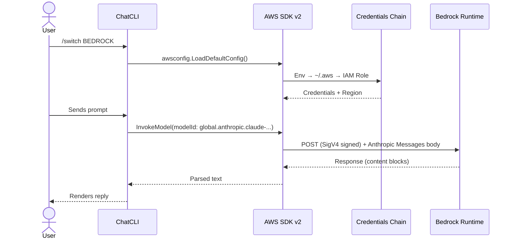

ChatCLI supports **AWS Bedrock** as a native provider (`BEDROCK`), with request/response schema **auto-detected by model family**:

- **Anthropic Claude** — `anthropic.*` and inference profiles (`global./us./eu./apac.anthropic.*`)
- **OpenAI GPT-OSS** — `openai.gpt-oss-*` (OpenAI's open-weights on Bedrock)

Ideal for corporate environments that already manage billing, compliance, and access control through AWS — no need for API keys from the original providers.

---

## Why AWS Bedrock?

<CardGroup cols={2}>
  <Card title="No Anthropic API key" icon="key">
    Uses existing AWS credentials (IAM role, `~/.aws/credentials`, `AWS_PROFILE`).
  </Card>
  <Card title="AWS billing and compliance" icon="receipt">
    Costs appear on your AWS bill. CloudTrail logs, native Bedrock guardrails.
  </Card>
  <Card title="Claude + GPT-OSS" icon="layer-group">
    Claude 3/3.5/3.7/4/4.5/4.6 (via inference profiles) and OpenAI GPT-OSS 20B/120B.
  </Card>
  <Card title="VPC endpoints" icon="network-wired">
    Works in private environments via `AWS_ENDPOINT_URL_BEDROCK_RUNTIME`.
  </Card>
</CardGroup>

---

## Configuration

The provider is auto-detected when ChatCLI finds **valid AWS credentials** (not just file existence):

- **Static creds in env:** `AWS_ACCESS_KEY_ID`
- **Profile selection:** `AWS_PROFILE` (via env var or `.env` file)
- **`~/.aws/credentials` file** with at least one non-empty `aws_access_key_id`
- **AWS SSO:** SSO profile in `~/.aws/config` (detects `sso_session`, `sso_start_url`, `sso_account_id`)
- **Assume-role / credential_process:** profiles with `role_arn` or `credential_process` in `~/.aws/config`
- **SSO token cache:** presence of files in `~/.aws/sso/cache/` (indicating a prior `aws sso login`)
- **Web Identity Token** (EKS IRSA): `AWS_WEB_IDENTITY_TOKEN_FILE`
- **Container Credentials** (ECS): `AWS_CONTAINER_CREDENTIALS_RELATIVE_URI` / `_FULL_URI`

<Warning>
The mere existence of `~/.aws/config` with only `region` or `output` **does not activate** Bedrock. The file must contain credential configuration (SSO, assume-role, credential_process), or credentials must exist in another source.
</Warning>

### Option 1: `~/.aws/credentials` (static credentials)

If you already use AWS CLI, just have a profile configured:

```bash
# ~/.aws/credentials
[default]
aws_access_key_id = AKIA...
aws_secret_access_key = ...

[corp-prod]
aws_access_key_id = AKIA...
aws_secret_access_key = ...
```

```bash
export AWS_PROFILE=corp-prod
export BEDROCK_REGION=us-east-1   # optional, defaults to us-east-1
chatcli
```

Inside ChatCLI:

```bash
/switch BEDROCK
```

<Tip>
You can also set `AWS_PROFILE` in your `.env` file instead of exporting in the shell:
```env
AWS_PROFILE=corp-prod
BEDROCK_REGION=us-east-1
LLM_PROVIDER=BEDROCK
```
ChatCLI reads the `.env` via godotenv and resolves the profile correctly.
</Tip>

### Option 2: AWS SSO (IAM Identity Center)

If your company uses AWS SSO, configure the profile in `~/.aws/config`:

```ini
[profile my-sso]
sso_session = my-session
sso_account_id = 123456789012
sso_role_name = MyRole
region = us-east-1

[sso-session my-session]
sso_start_url = https://my-company.awsapps.com/start
sso_region = us-east-1
```

```bash
# Log in (opens browser)
aws sso login --profile my-sso

# Use with ChatCLI (any of these):
export AWS_PROFILE=my-sso && chatcli
AWS_PROFILE=my-sso chatcli

# Or in .env:
echo 'AWS_PROFILE=my-sso' >> .env
chatcli
```

<Info>
ChatCLI automatically detects SSO profiles in `~/.aws/config` (via `sso_session`, `sso_start_url`, `sso_account_id` keys). If the SSO token expires, the error will be clear (`SSOTokenProviderError`) — just run `aws sso login` again.

**Important:** the AWS SDK **does not** know which profile is "logged in". You **must** indicate the profile via `AWS_PROFILE` (env, `.env`, or flag). If your SSO profile is named `default`, it is used automatically without `AWS_PROFILE`.
</Info>

### Option 3: Environment variables (static credentials)

```bash
export AWS_ACCESS_KEY_ID=AKIA...
export AWS_SECRET_ACCESS_KEY=...
export AWS_SESSION_TOKEN=...      # if using STS
export AWS_REGION=us-east-1
```

### Option 4: IAM Role (EC2/ECS/EKS)

On AWS-native environments, nothing to configure — the SDK picks up the role automatically through IMDSv2 / webidentity. Just make sure the role has the IAM permissions below.

<Info>
ChatCLI disables the IMDS probe (169.254.169.254) by default on machines that are **not** EC2/ECS/EKS, to avoid unnecessary timeouts. IMDS is automatically enabled when container/EKS env vars are detected (`AWS_CONTAINER_CREDENTIALS_*`, `AWS_WEB_IDENTITY_TOKEN_FILE`, `ECS_CONTAINER_METADATA_URI*`).

To force behavior, use:
- `AWS_EC2_METADATA_DISABLED=true` — explicitly disable IMDS
- `CHATCLI_BEDROCK_ENABLE_IMDS=1` — force enable IMDS (useful on EC2 without standard env vars)
</Info>

---

## IAM Permissions

Minimum permissions to invoke and list models:

```json
{
  "Version": "2012-10-17",
  "Statement": [
    {
      "Effect": "Allow",
      "Action": [
        "bedrock:InvokeModel",
        "bedrock:InvokeModelWithResponseStream"
      ],
      "Resource": [
        "arn:aws:bedrock:*::foundation-model/anthropic.*",
        "arn:aws:bedrock:*:*:inference-profile/*anthropic.*"
      ]
    },
    {
      "Effect": "Allow",
      "Action": [
        "bedrock:ListFoundationModels",
        "bedrock:ListInferenceProfiles"
      ],
      "Resource": "*"
    }
  ]
}
```

<Tip>
`ListFoundationModels` and `ListInferenceProfiles` are used by `/switch --model` to dynamically discover what your account can invoke. Without them, ChatCLI falls back to the static catalog (still functional but can't reflect account-specific access).
</Tip>

Also, in the **Bedrock console** you must **enable model access** for each Anthropic model you want to use (one-time per account + region): `Bedrock Console → Model access → Request access`.

---

## Model families and schema selection

Bedrock uses **different payloads** for each model family. ChatCLI auto-detects the schema from the model-id prefix:

| Model id prefix | Family | Schema |
| :--- | :--- | :--- |
| `anthropic.*`, `global.anthropic.*`, `us.anthropic.*`, `eu.anthropic.*`, `apac.anthropic.*` | Anthropic Claude | Anthropic Messages (`anthropic_version`, `messages`, `system`) |
| `openai.*`, `us.openai.*`, ... | OpenAI GPT-OSS | OpenAI Chat Completions (`messages`, `max_completion_tokens`) |
| Others | Not supported in this version | — |

### Manual override

If the model id doesn't start with a known prefix (e.g. custom imports), force the schema via env var:

```bash
export BEDROCK_PROVIDER=anthropic   # or "openai" / "claude" / "gpt"
```

Accepted values: `anthropic`, `claude`, `openai`, `gpt` (case-insensitive). The env var takes precedence over prefix detection.

<Info>
ChatCLI only lists and invokes models from supported families (`anthropic` and `openai`). Meta Llama, Amazon Nova, Mistral, and Cohere models returned by `ListFoundationModels` are filtered out automatically — support for them may be added later.
</Info>

---

## Inference Profiles vs. Model IDs

This is **the most important detail** when using Claude on Bedrock.

Modern Anthropic models (3.7, 4.x, 4.5, 4.6) **do NOT accept direct on-demand invocation by base model ID**. Attempting this returns:

```
on-demand throughput isn't supported. Request with the id or arn of an
inference profile that contains this model.
```

The fix is to use an **inference profile ID** — a logical ARN that routes the call to a region with available capacity. It carries a geography prefix:

| Prefix | Meaning |
| :--- | :--- |
| `global.*` | Global — newest tier, worldwide availability (recommended) |
| `us.*` | Cross-region USA (`us-east-1`, `us-east-2`, `us-west-2`) |
| `eu.*` | Cross-region Europe |
| `apac.*` | Cross-region Asia-Pacific |

**Example:**

```text
anthropic.claude-sonnet-4-5-20250929-v1:0           ❌ on-demand error
global.anthropic.claude-sonnet-4-5-20250929-v1:0    ✅ works
us.anthropic.claude-sonnet-4-5-20250929-v1:0        ✅ works
```

<Info>
ChatCLI already uses a global inference profile as the **default model** (`global.anthropic.claude-sonnet-4-5-20250929-v1:0`). Claude 3 and 3.5 models still accept direct base-ID invocation and are also in the catalog.
</Info>

---

## Model Listing

`/switch --model` queries **two live sources** and merges them with the static catalog:

1. **`bedrock:ListFoundationModels`** — base models (on-demand capable)
2. **`bedrock:ListInferenceProfiles`** — regional/global profiles (paginated)

```bash
/switch BEDROCK
/switch --model
```

Example output (depends on your account's permissions):

```
Available models for BEDROCK (API: 18 + catalog: 14):
  1. global.anthropic.claude-sonnet-4-6-20260115-v1:0 ... [api]
  2. global.anthropic.claude-opus-4-6-20260115-v1:0 ... [api]
  3. global.anthropic.claude-sonnet-4-5-20250929-v1:0 ... [api]
  4. us.anthropic.claude-sonnet-4-20250514-v1:0 ... [api]
  5. eu.anthropic.claude-sonnet-4-20250514-v1:0 ... [api]
  6. anthropic.claude-3-5-sonnet-20241022-v2:0 ... [api]
  ...
```

Models with `[api]` are the ones your account **actually** can invoke in that region. `[catalog]` entries are static registrations that may or may not be enabled.

---

## Corporate Proxy and Private TLS

In corporate environments with a proxy intercepting TLS using a private CA, you may see:

```
tls: failed to verify certificate: x509: certificate signed by unknown authority
```

ChatCLI provides two Bedrock-specific env vars:

| Variable | Description |
| :--- | :--- |
| `CHATCLI_BEDROCK_CA_BUNDLE` | Path to a PEM bundle with the corporate CA. Merged into the system pool and used as `RootCAs`. Takes precedence over `AWS_CA_BUNDLE`. |
| `CHATCLI_BEDROCK_INSECURE_SKIP_VERIFY` | `true` disables TLS verification entirely (equivalent to Node's `NODE_TLS_REJECT_UNAUTHORIZED=0`). **Insecure** — use only to confirm a TLS issue. |

```bash
# Recommended: use a bundle with the corporate CA
export CHATCLI_BEDROCK_CA_BUNDLE=/etc/ssl/corp-ca-bundle.pem

# Last resort (insecure)
export CHATCLI_BEDROCK_INSECURE_SKIP_VERIFY=true
```

<Warning>
`CHATCLI_BEDROCK_INSECURE_SKIP_VERIFY=true` logs a warning and accepts any certificate. Use only for troubleshooting — never in production.
</Warning>

HTTP(S) proxy is honored automatically through Go's standard env vars:

```bash
export HTTPS_PROXY=http://proxy.corp:3128
export HTTP_PROXY=http://proxy.corp:3128
export NO_PROXY=localhost,127.0.0.1,.corp.internal
```

### VPC endpoints / private endpoints

If your company uses a VPC endpoint for Bedrock:

```bash
export AWS_ENDPOINT_URL_BEDROCK_RUNTIME=https://bedrock-runtime.vpc.internal
export AWS_ENDPOINT_URL_BEDROCK=https://bedrock.vpc.internal
```

The SDK v2 reads these natively — no ChatCLI changes needed.

---

## Environment Variables

| Variable | Description | Default |
| :--- | :--- | :--- |
| `BEDROCK_PROVIDER` | Manual schema override: `anthropic` (default) or `openai` | auto-detect |
| `BEDROCK_TEMPERATURE` | Temperature used for OpenAI family models | — |
| `BEDROCK_REGION` | AWS region (takes precedence over `AWS_REGION`) | — |
| `AWS_REGION` | AWS region (fallback) | — |
| `AWS_PROFILE` | Profile in `~/.aws/credentials` or `~/.aws/config` (SSO, assume-role). Can be set in `.env`. | — |
| `AWS_ACCESS_KEY_ID` / `AWS_SECRET_ACCESS_KEY` / `AWS_SESSION_TOKEN` | Static credentials | — |
| `AWS_CA_BUNDLE` | PEM bundle read natively by SDK v2 | — |
| `AWS_ENDPOINT_URL_BEDROCK_RUNTIME` | Override for Bedrock Runtime endpoint | — |
| `AWS_ENDPOINT_URL_BEDROCK` | Override for Bedrock (control plane) endpoint | — |
| `AWS_EC2_METADATA_DISABLED` | `true` explicitly disables IMDS (169.254.169.254) | — |
| `CHATCLI_BEDROCK_ENABLE_IMDS` | `1`/`true` forces IMDS probe on non-EC2 machines | `false` |
| `BEDROCK_MAX_TOKENS` | Output token limit | From catalog |
| `ANTHROPIC_MAX_TOKENS` | Alternative shared with direct Anthropic provider | — |
| `CHATCLI_BEDROCK_CA_BUNDLE` | Bedrock-specific PEM bundle (overrides `AWS_CA_BUNDLE`) | — |
| `CHATCLI_BEDROCK_INSECURE_SKIP_VERIFY` | `true` disables TLS verification (insecure) | `false` |
| `HTTPS_PROXY` / `HTTP_PROXY` / `NO_PROXY` | Standard Go/SDK HTTP proxy | — |

**Default model:** `global.anthropic.claude-sonnet-4-5-20250929-v1:0`
**Default region:** `us-east-1`

---

## Architecture



ChatCLI uses `bedrockruntime.InvokeModel` with body in the **Anthropic Messages** schema (`anthropic_version: "bedrock-2023-05-31"`). Authentication is SigV4, handled transparently by the SDK. The HTTP client can be overridden by ChatCLI when `CHATCLI_BEDROCK_CA_BUNDLE` or `CHATCLI_BEDROCK_INSECURE_SKIP_VERIFY` is set (via `awshttp.BuildableClient`).

---

## Bedrock vs. Direct Anthropic

| Aspect | BEDROCK | CLAUDEAI (direct Anthropic) |
| :--- | :--- | :--- |
| **Auth** | AWS credentials chain (IAM, profile) | API key (`sk-ant-...`) or OAuth |
| **Endpoint** | `bedrock-runtime.<region>.amazonaws.com` | `api.anthropic.com` |
| **Billing** | AWS account (Billing console + CloudTrail) | Anthropic account (console.anthropic.com) |
| **Models** | Claude 3, 3.5, 3.7, 4, 4.1, 4.5, 4.6 (via profiles) | All Claude, latest versions first |
| **Streaming** | Not implemented in this version (uses `InvokeModel`) | Supported |
| **OAuth/1M context** | N/A | Supported (`ANTHROPIC_1MTOKENS_SONNET`) |
| **Private VPC** | Yes (via `AWS_ENDPOINT_URL_*`) | No |
| **Compliance** | Inherits from AWS (SOC2, HIPAA, etc.) | Inherits from Anthropic |

<Tip>
If your company already runs everything on AWS with managed compliance, **BEDROCK is the way**. If you're an individual developer wanting the newest Claude features (1M context, OAuth via Claude Code plan), use **CLAUDEAI** direct.
</Tip>

---

## Troubleshooting

<AccordionGroup>
  <Accordion title="on-demand throughput isn't supported">
    You're invoking a modern model (3.7+, 4.x+, 4.5+, 4.6) by its base ID. Use the inference profile: add prefix `global.`, `us.`, `eu.`, or `apac.`.

    ```bash
    # ❌
    /switch --model anthropic.claude-sonnet-4-5-20250929-v1:0
    # ✅
    /switch --model global.anthropic.claude-sonnet-4-5-20250929-v1:0
    ```
  </Accordion>
  <Accordion title="AccessDeniedException: You don't have access to the model">
    Go to the Bedrock console for that region and enable Model Access for the Anthropic model. Takes a few minutes. Also check the IAM role has `bedrock:InvokeModel` on the model ARN + the inference profile ARN.
  </Accordion>
  <Accordion title="NoCredentialProviders / unable to load SDK config">
    The SDK didn't find credentials. Check:
    ```bash
    aws sts get-caller-identity   # should return your identity
    env | grep -E 'AWS_|BEDROCK_'
    ls -la ~/.aws/
    ```
    If nothing returns credentials, set them up via `aws configure`, `aws sso login`, or export env vars.
  </Accordion>
  <Accordion title="no EC2 IMDS role found / dial tcp 169.254.169.254:80: connect: host is down">
    This error occurs when the AWS SDK tries to reach the **EC2 Instance Metadata Service** (IMDS) on a machine that **is not EC2** (e.g., your laptop). ChatCLI disables the IMDS probe by default on non-EC2, but if the error persists:

    ```bash
    # Solution 1: Set valid credentials
    export AWS_PROFILE=my-profile
    # or
    export AWS_ACCESS_KEY_ID=AKIA...

    # Solution 2: Explicitly disable IMDS
    export AWS_EC2_METADATA_DISABLED=true
    ```

    If you **are actually on EC2** and need IMDS:
    ```bash
    export CHATCLI_BEDROCK_ENABLE_IMDS=1
    ```
  </Accordion>
  <Accordion title="SSOTokenProviderError / expired token (SSO)">
    Your SSO token has expired (default validity ~8h). Log in again:
    ```bash
    aws sso login --profile your-profile
    ```
    Remember to have `AWS_PROFILE` set (env, `.env`, or name your profile `default`).
  </Accordion>
  <Accordion title="x509: certificate signed by unknown authority">
    Corporate proxy doing TLS interception. Configure `CHATCLI_BEDROCK_CA_BUNDLE` with the PEM of the corp CA. For quick troubleshooting, set `CHATCLI_BEDROCK_INSECURE_SKIP_VERIFY=true` (insecure, temporary only).
  </Accordion>
  <Accordion title="ThrottlingException / ServiceQuotaExceededException">
    You've hit on-demand quota for that region. Options:
    - Use a `global.*` inference profile (routes to any available region)
    - Use Provisioned Throughput (configure in the Bedrock console)
    - Raise quotas via AWS Service Quotas
  </Accordion>
</AccordionGroup>

---

## Next Steps

<CardGroup cols={2}>
  <Card title="Provider Fallback" icon="arrows-rotate" href="/en/features/provider-fallback">
    Configure automatic failover between Bedrock and other providers
  </Card>
  <Card title="OAuth Authentication" icon="key" href="/en/features/oauth-authentication">
    Authentication alternatives for other providers
  </Card>
  <Card title="Supported Models" icon="list" href="/en/reference/supported-models">
    Full list of Claude models per provider
  </Card>
  <Card title="Environment Variables" icon="sliders" href="/en/reference/environment-variables">
    Complete configuration reference
  </Card>
</CardGroup>
