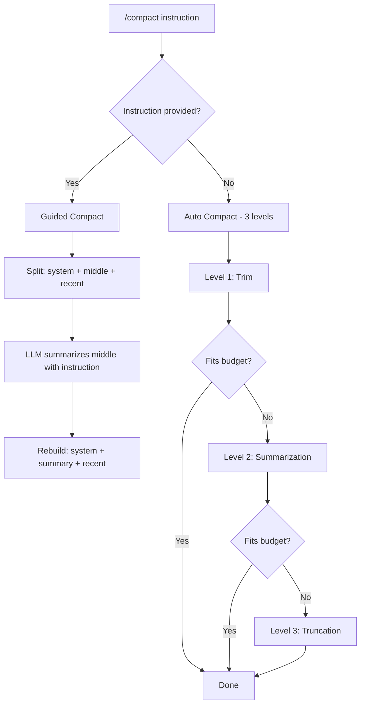

ChatCLI provides two powerful mechanisms for conversation history control: **intelligent compaction** to reduce context size without losing critical information, and **rewind** to restore the conversation to an earlier point.

---

## /compact — Context Compaction

The `/compact` command reduces conversation history size so it fits within the model's context window, preserving the most important information.

### Usage Modes

<Tabs>
  <Tab title="Automatic">
    Without arguments, runs the 3-level compaction pipeline:

    ```bash
    /compact
    ```

    The automatic pipeline follows this order:

    1. **Level 1 — Trimming** (near-lossless): strips `<reasoning>` tags, compacts XML, removes duplicates
    2. **Level 2 — Structured summarization**: extracts facts (files read, modified, commands executed, decisions) in bullet point format
    3. **Level 3 — Emergency truncation**: drops middle messages, keeping system prompt and recent messages

    During the pipeline, the terminal shows **live feedback** for each phase (no more silent freeze):

    ```text
    │ 📦 Compacting history (23 msgs, 4.2 MB → target 2.9 MB)
    │ 🧹 Trim: stripping reasoning/dedup (no LLM)…
    │ 🧠 Summarizing old messages via LLM (may take 30-90s — ESC cancels)…
    │ ✓ Summary applied (23 → 9 msgs, 4.2 MB → 1.8 MB)
    ```

    Press **ESC** or **Ctrl+C** to abort Level 2 (LLM). Cancellation propagates through context and preserves history intact (no blind fallthrough to Level 3).
  </Tab>
  <Tab title="Guided">
    With an instruction, you tell the AI **what to preserve**:

    ```bash
    /compact preserve the auth module architecture and errors found
    ```

    ```bash
    /compact keep all file paths and refactoring decisions
    ```

    Guided mode sends your instruction as a directive to the summarizer AI, ensuring that information you consider critical is retained during compaction.
  </Tab>
</Tabs>

### How It Works



### Message Preservation

In both modes:
- **System messages** are always fully preserved
- **Recent messages** (4 in guided, 10 in automatic) are kept verbatim
- Only the **middle block** is summarized or removed
- Metadata indicates the message is a summary (`IsSummary: true`)

### Example Output

After compaction, a summary message replaces the middle messages:

```text
[GUIDED COMPACT — covering 42 earlier messages | instruction: "preserve auth architecture"]

## Files Read
- pkg/auth/handler.go (120 lines) - HTTP handlers for authentication
- pkg/auth/middleware.go (85 lines) - JWT validation middleware

## Files Modified
- pkg/auth/handler.go:45-60 - Added refresh token endpoint

## Key Decisions
- JWT tokens expire in 15 minutes with refresh token rotation
- Middleware validates at gateway level, not per-service

## Errors & Resolutions
- "token expired" panic in middleware → added nil check on claims
```

---

## /rewind — Go Back in Time

`/rewind` lets you restore the conversation to an earlier point, undoing unwanted messages and responses.

### How It Works

ChatCLI automatically saves **checkpoints** of the conversation before each LLM call. You can revert to any of those points.

```bash
/rewind
```

This displays an interactive menu:

```text
  REWIND — Select a checkpoint to restore
  ─────────────────────────────────────────
  [1]  14:32:05  28 msgs  implement the refresh token endpoint
  [2]  14:28:12  24 msgs  fix the JWT middleware bug
  [3]  14:25:01  20 msgs  analyze the authentication module
  [4]  14:20:33  16 msgs  (start)

  Select [1-4] or (q)uit:
```

Select the checkpoint number to restore. The history is reverted to the exact state at that point, including all messages and context.

### Keyboard Shortcut: Esc+Esc

Press **Esc** twice quickly (less than 500ms between presses) to open the rewind menu directly from the prompt, without typing `/rewind`.

### Limits

- A maximum of **20 checkpoints** are kept (oldest ones are discarded)
- Checkpoints exist only in the current session (not persisted to disk)
- When rewinding, checkpoints after the restored point are removed

---

## Unified History

ChatCLI uses a **single history array** shared across all modes (chat, agent, coder). This means:

- Switching between `/agent`, `/coder`, and chat **preserves all context**
- The AI doesn't "forget" what was done in another mode
- `/compact` and `/rewind` operate on the complete history, regardless of mode

<Info>
Sessions saved with older ChatCLI versions that used separate per-mode histories are automatically converted when loaded — histories are merged in chronological order.
</Info>

---

## When to Use

<CardGroup cols={2}>
  <Card title="/compact (automatic)" icon="compress">
    When ChatCLI warns that the context is large, or when you notice degraded responses.
  </Card>
  <Card title="/compact <instruction>" icon="crosshairs">
    When you know exactly which information is critical and must not be lost during compaction.
  </Card>
  <Card title="/rewind" icon="rotate-left">
    When the AI took a wrong path, generated incorrect code, or you want to try a different approach.
  </Card>
  <Card title="Esc+Esc" icon="keyboard">
    Quick shortcut for rewind without leaving your typing flow.
  </Card>
</CardGroup>

---

## Next Steps

<CardGroup cols={2}>
  <Card title="Session Management" icon="floppy-disk" href="/en/features/session-management">
    Save and reuse conversations across projects.
  </Card>
  <Card title="Bootstrap and Memory" icon="memory" href="/en/features/bootstrap-memory">
    Customize the AI and maintain long-term context across sessions.
  </Card>
</CardGroup>
