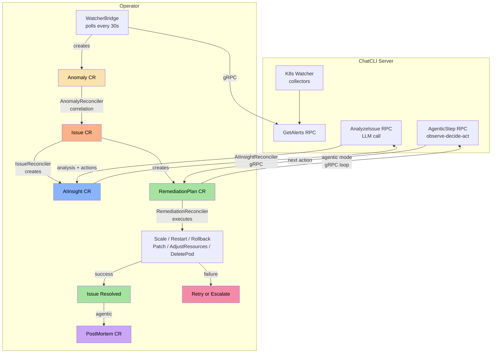
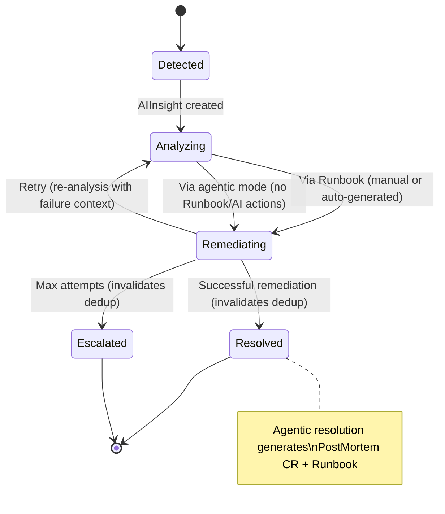

The **ChatCLI Operator** goes beyond instance management. It implements a **complete AIOps platform** that autonomously detects anomalies, correlates signals, requests AI analysis, and executes remediation -- all without external dependencies beyond the LLM provider.


## API Group and CRDs

The operator uses the API group `platform.chatcli.io/v1alpha1` with 16 Custom Resource Definitions:

| CRD | Short Name | Description |
|-----|-----------|-------------|
| **Instance** | `inst` | ChatCLI server instance (Deployment, Service, RBAC, PVC) |
| **Anomaly** | `anom` | Raw signal from the K8s Watcher (restarts, OOM, deploy failures) |
| **Issue** | `iss` | Correlated incident grouping multiple anomalies |
| **AIInsight** | `ai` | AI-generated root cause analysis with suggested actions |
| **RemediationPlan** | `rp` | Concrete actions to resolve the problem (runbook or agentic AI) |
| **Runbook** | `rb` | Manual operational procedures (optional) |
| **PostMortem** | `pm` | Auto-generated incident report after agentic resolution |
| **NotificationPolicy** | `np` | Multi-channel notification routing with throttling and templates |
| **EscalationPolicy** | `ep` | Tiered escalation chains with timeouts (L1→L2→L3) |
| **ServiceLevelObjective** | `slo` | SLO with multi-window burn rate alerting (Google SRE model) |
| **IncidentSLA** | `sla` | Response/resolution SLA targets per severity with business hours |
| **ApprovalPolicy** | `ap` | Auto/manual/quorum approval policies with change windows |
| **ApprovalRequest** | `ar` | Approval workflow with blast radius assessment |
| **ClusterRegistration** | `cr` | Multi-cluster federation with kubeconfig and health checks |
| **AuditEvent** | `ae` | Immutable audit trail (append-only) |
| **ChaosExperiment** | `chaos` | Chaos engineering experiments with 7 types and safety checks |

<Info>
For detailed documentation on each v2 CRD (NotificationPolicy, EscalationPolicy, SLO, SLA, ApprovalPolicy, ApprovalRequest, ClusterRegistration, AuditEvent, ChaosExperiment), see the [AIOps Platform sub-pages](/en/features/aiops/notifications).
</Info>


## Operator Installation

<Steps>
  <Step title="Install CRDs">
    ```bash
    kubectl apply -f operator/config/crd/bases/
    ```
  </Step>
  <Step title="Install RBAC and Manager">
    ```bash
    kubectl apply -f operator/config/rbac/role.yaml
    kubectl apply -f operator/config/manager/manager.yaml
    ```
  </Step>
</Steps>

<Accordion title="Build via Docker (optional)">
  ```bash
  cd operator
  make docker-build IMG=ghcr.io/diillson/chatcli-operator:latest
  make docker-push IMG=ghcr.io/diillson/chatcli-operator:latest
  ```
</Accordion>


## AIOps Platform Architecture



### Autonomous Pipeline

| Phase | Component | What It Does |
|-------|-----------|--------------|
| **1. Detection** | WatcherBridge | Queries `GetAlerts` from the server every 30s. Creates Anomaly CRs (dedup SHA256). Invalidates dedup when Issue reaches terminal state. |
| **2. Correlation** | AnomalyReconciler + CorrelationEngine | Groups anomalies by resource + time window. Calculates risk score and severity. Creates/updates Issue CRs with `signalType`. |
| **3. Analysis** | AIInsightReconciler + KubernetesContextBuilder | Collects real K8s context (deployment, pods, events, revisions). Calls `AnalyzeIssue` RPC with enriched context. |
| **4. Remediation** | IssueReconciler | Runbook-first: **(a)** Manual Runbook (tiered matching), **(b)** generates auto Runbook from AI, or **(c)** agentic remediation (AI acts step-by-step). |
| **5. Execution** | RemediationReconciler | Executes actions on the cluster: ScaleDeployment, RestartDeployment, RollbackDeployment, PatchConfig, AdjustResources, DeletePod. Agentic mode: AI decides each action via observe-decide-act loop. |
| **6. Resolution** | IssueReconciler | Success -> Resolved (invalidates dedup). Failure -> re-analysis with failure context (different strategy) -> up to maxAttempts -> Escalated. |
| **7. PostMortem** | IssueReconciler | Agentic resolution -> auto-generated PostMortem CR (timeline, root cause, lessons learned) + reusable Runbook from successful steps. |

### Issue State Machine




## CRD: Instance

The `Instance` manages ChatCLI server instances in the cluster.

### Complete Specification

```yaml
apiVersion: platform.chatcli.io/v1alpha1
kind: Instance
metadata:
  name: chatcli-prod
  namespace: chatcli          # The namespace must exist before creating the Instance
spec:
  replicas: 1
  provider: CLAUDEAI       # OPENAI, CLAUDEAI, GOOGLEAI, XAI, STACKSPOT, OLLAMA, COPILOT
  model: claude-sonnet-4-5

  image:
    repository: ghcr.io/diillson/chatcli
    tag: latest
    pullPolicy: IfNotPresent

  server:
    port: 50051
    tls:
      enabled: true
      secretName: chatcli-tls
    token:
      name: chatcli-auth
      key: token

  watcher:
    enabled: true
    interval: "30s"
    window: "2h"
    maxLogLines: 100
    maxContextChars: 32000
    targets:
      - deployment: api-gateway
        namespace: production
        metricsPort: 9090
        metricsFilter: ["http_requests_*", "http_request_duration_*"]
      - deployment: auth-service
        namespace: production
        metricsPort: 9090
      - deployment: worker
        namespace: batch

  resources:
    requests:
      cpu: 100m
      memory: 128Mi
    limits:
      cpu: 500m
      memory: 512Mi

  persistence:
    enabled: true
    size: 1Gi
    storageClassName: standard

  securityContext:
    runAsNonRoot: true
    runAsUser: 1000
    seccompProfile:
      type: RuntimeDefault

  apiKeys:
    name: chatcli-api-keys
```

### Spec Fields

#### Root

| Field | Type | Required | Default | Description |
|-------|------|:--------:|---------|-------------|
| `replicas` | int32 | No | `1` | Number of server replicas |
| `provider` | string | **Yes** | | LLM provider |
| `model` | string | No | | LLM model |
| `image` | ImageSpec | No | | Image configuration |
| `server` | ServerSpec | No | | gRPC server configuration |
| `watcher` | WatcherSpec | No | | K8s Watcher configuration |
| `resources` | ResourceRequirements | No | | CPU and memory requests/limits |
| `persistence` | PersistenceSpec | No | | Session persistence |
| `securityContext` | PodSecurityContext | No | nonroot/1000 | Pod security context |
| `apiKeys` | SecretRefSpec | No | | Secret with API keys |

#### WatcherSpec

| Field | Type | Required | Default | Description |
|-------|------|:--------:|---------|-------------|
| `enabled` | bool | No | `false` | Enables the watcher |
| `targets` | []WatchTargetSpec | No | | List of deployments (multi-target) |
| `deployment` | string | No | | Single deployment (legacy) |
| `namespace` | string | No | | Deployment namespace (legacy) |
| `interval` | string | No | `"30s"` | Collection interval |
| `window` | string | No | `"2h"` | Observation window |
| `maxLogLines` | int32 | No | `100` | Max log lines per pod |
| `maxContextChars` | int32 | No | `32000` | LLM context budget |

#### WatchTargetSpec

| Field | Type | Required | Default | Description |
|-------|------|:--------:|---------|-------------|
| `deployment` | string | **Yes** | | Deployment name |
| `namespace` | string | **Yes** | | Deployment namespace |
| `metricsPort` | int32 | No | `0` | Prometheus port (0 = disabled) |
| `metricsPath` | string | No | `/metrics` | Prometheus endpoint path |
| `metricsFilter` | []string | No | | Glob filters for metrics |

### Resources Created by Instance

| Resource | Name | Description |
|----------|------|-------------|
| **Deployment** | `<name>` | ChatCLI server pods |
| **Service** | `<name>` | gRPC Service (automatic headless when replicas > 1 for client-side LB) |
| **ConfigMap** | `<name>` | Environment variables (provider, model, etc.) |
| **ConfigMap** | `<name>-watch-config` | Multi-target YAML (if `targets` defined) |
| **ServiceAccount** | `<name>` | Identity for RBAC |
| **Role/ClusterRole** | `<name>-watcher` | K8s watcher permissions |
| **RoleBinding/CRB** | `<name>-watcher` | SA to Role binding |
| **PVC** | `<name>-sessions` | Persistence (if enabled) |

### gRPC Load Balancing

gRPC uses persistent HTTP/2 connections that pin to a single pod via kube-proxy, leaving extra replicas idle.

- **1 replica** (default): Standard ClusterIP Service
- **Multiple replicas**: Headless Service (`ClusterIP: None`) is created automatically, enabling client-side round-robin via gRPC `dns:///` resolver
- **Keepalive**: WatcherBridge pings every 30s (5s timeout) to detect inactive pods quickly. The server accepts pings with a minimum interval of 20s (`EnforcementPolicy.MinTime`)
- **Transition**: When scaling from 1 to 2+ replicas (or back), the operator deletes and recreates the Service automatically (ClusterIP is immutable in Kubernetes)

### Automatic RBAC

- **Single-namespace** (all targets in the same namespace): Creates `Role` + `RoleBinding`
- **Multi-namespace** (targets in different namespaces): Creates `ClusterRole` + `ClusterRoleBinding` automatically
- On CR deletion, cluster-scoped resources are cleaned up by the finalizer

### Auto-Rollout on Configuration Changes

The operator monitors changes in ConfigMaps and Secrets referenced by the Instance and triggers rolling updates automatically via hash annotations on the PodTemplate:

| Annotation | Source | When It Changes |
|------------|--------|-----------------|
| `chatcli.io/watch-config-hash` | ConfigMap `<name>-watch-config` | Watcher targets changed |
| `chatcli.io/configmap-hash` | ConfigMap `<name>` | Environment variables updated |
| `chatcli.io/secret-hash` | Secret referenced in `apiKeys.name` | API keys created or updated |
| `chatcli.io/tls-hash` | Secret referenced in `server.tls.secretName` | TLS certificates renewed |

<Tip>
Adding/removing targets in `watcher.targets` and applying the Instance causes automatic rollout. Creating or updating the API keys Secret and renewing TLS certificates also trigger rollout automatically.
</Tip>

### Secret and ConfigMap Observation

The operator watches (`Watches`) Secrets in the Instance namespace. When a Secret referenced in `apiKeys.name` or `server.tls.secretName` is created or updated, the reconciler is triggered automatically -- even if the Secret did not exist when the Instance was created.

- **ConfigMap and Secret `envFrom`**: Marked as `optional: true`, allowing the Instance to be created before the Secret/ConfigMap
- **Flexible deploy order**: Namespace -> Instance -> Secret/ConfigMap (any order after the namespace)


## AIOps Platform CRDs

### Anomaly

Represents a raw signal detected by the WatcherBridge.

```yaml
apiVersion: platform.chatcli.io/v1alpha1
kind: Anomaly
metadata:
  name: watcher-highrestartcount-api-gateway-1234567890
  namespace: production
spec:
  signalType: pod_restart    # pod_restart | oom_kill | pod_not_ready | deploy_failing | error_rate | latency_spike
  source: watcher            # watcher | prometheus | manual
  severity: warning          # critical | high | medium | low | warning
  resource:
    kind: Deployment
    name: api-gateway
    namespace: production
  description: "HighRestartCount on api-gateway: container app restarted 8 times"
  detectedAt: "2026-02-16T10:30:00Z"
status:
  correlated: true
  issueRef:
    name: api-gateway-pod-restart-1771276354
```

#### Anomaly Spec Fields

| Field | Type | Description |
|-------|------|-------------|
| `signalType` | AnomalySignalType | Type of detected signal |
| `source` | AnomalySource | Detection origin (watcher, prometheus, manual) |
| `severity` | IssueSeverity | Signal severity |
| `resource` | ResourceRef | Affected K8s resource (kind, name, namespace) |
| `description` | string | Human-readable description of the problem |
| `detectedAt` | Time | Detection timestamp |

#### Signals Detected by Watcher

| AlertType (Server) | SignalType (Anomaly) | Description |
|--------------------|---------------------|-------------|
| `HighRestartCount` | `pod_restart` | Pod with many restarts (CrashLoopBackOff) |
| `OOMKilled` | `oom_kill` | Container terminated due to lack of memory |
| `PodNotReady` | `pod_not_ready` | Pod is not in the Ready state |
| `DeploymentFailing` | `deploy_failing` | Deployment with Available=False |

### Issue

Correlated incident that groups anomalies and manages the remediation lifecycle.

```yaml
apiVersion: platform.chatcli.io/v1alpha1
kind: Issue
metadata:
  name: api-gateway-pod-restart-1771276354
  namespace: production
spec:
  severity: high
  source: watcher
  signalType: pod_restart        # Propagated from Anomaly for tiered Runbook matching
  description: "Correlated incident: pod_restart on api-gateway"
  resource:
    kind: Deployment
    name: api-gateway
    namespace: production
  riskScore: 65
  correlatedAnomalies:
    - name: watcher-highrestartcount-api-gateway-1234567890
    - name: watcher-oomkilled-api-gateway-1234567891
status:
  state: Analyzing          # Detected | Analyzing | Remediating | Resolved | Escalated | Failed
  remediationAttempts: 0
  maxRemediationAttempts: 3
  detectedAt: "2026-02-16T10:30:00Z"
  conditions:
    - type: Analyzing
      status: "True"
      reason: AIInsightCreated
```

#### Issue States

| State | Description |
|-------|-------------|
| `Detected` | Newly created issue, awaiting analysis |
| `Analyzing` | AIInsight created, awaiting AI response (or re-analysis with failure context) |
| `Remediating` | RemediationPlan in execution |
| `Resolved` | Successful remediation (dedup invalidated for recurrence detection) |
| `Escalated` | Max attempts reached or no available actions (dedup invalidated) |
| `Failed` | Terminal failure |

### AIInsight

AI-generated root cause analysis with suggested actions for automatic remediation.

```yaml
apiVersion: platform.chatcli.io/v1alpha1
kind: AIInsight
metadata:
  name: api-gateway-pod-restart-1771276354-insight
  namespace: production
spec:
  issueRef:
    name: api-gateway-pod-restart-1771276354
  provider: CLAUDEAI
  model: claude-sonnet-4-5
status:
  analysis: "High restart count caused by OOMKilled. Container memory limit (512Mi) is insufficient for the current workload pattern."
  confidence: 0.87
  recommendations:
    - "Increase memory limit to 1Gi"
    - "Investigate possible memory leak in the application"
    - "Monitor GC pressure metrics"
  suggestedActions:
    - name: "Restart deployment"
      action: RestartDeployment
      description: "Restart pods to reclaim leaked memory immediately"
    - name: "Scale up replicas"
      action: ScaleDeployment
      description: "Add more replicas to distribute memory pressure"
      params:
        replicas: "4"
  generatedAt: "2026-02-16T10:31:00Z"
```

#### AIInsight Status Fields

| Field | Type | Description |
|-------|------|-------------|
| `analysis` | string | AI-generated root cause analysis |
| `confidence` | float64 | Analysis confidence level (0.0-1.0) |
| `recommendations` | []string | Human-readable recommendations |
| `suggestedActions` | []SuggestedAction | Structured actions for automatic remediation |
| `generatedAt` | Time | When the analysis was generated |

#### SuggestedAction

| Field | Type | Description |
|-------|------|-------------|
| `name` | string | Human-readable action name |
| `action` | string | Action type: `ScaleDeployment`, `RestartDeployment`, `RollbackDeployment`, `PatchConfig` |
| `description` | string | Explanation of why this action is needed |
| `params` | map[string]string | Action parameters (e.g., `replicas: "4"`) |

### RemediationPlan

Concrete remediation plan automatically generated from a Runbook or AI actions.

```yaml
apiVersion: platform.chatcli.io/v1alpha1
kind: RemediationPlan
metadata:
  name: api-gateway-pod-restart-1771276354-plan-1
  namespace: production
spec:
  issueRef:
    name: api-gateway-pod-restart-1771276354
  attempt: 1
  strategy: "Attempt 1 (AI-generated): High restart count caused by OOMKilled"
  actions:
    - type: RestartDeployment
    - type: ScaleDeployment
      params:
        replicas: "4"
  safetyConstraints:
    - "No delete operations"
    - "No destructive changes"
    - "Rollback on failure"
status:
  state: Completed           # Pending | Executing | Completed | Failed | RolledBack
  result: "Deployment restarted and scaled to 4 replicas successfully"
  startedAt: "2026-02-16T10:31:30Z"
  completedAt: "2026-02-16T10:32:15Z"
```

#### Action Types

| Type | Description | Parameters |
|------|-------------|-----------|
| `ScaleDeployment` | Adjusts the number of replicas | `replicas` |
| `RestartDeployment` | Rollout restart of the deployment | -- |
| `RollbackDeployment` | Undoes rollout (previous, healthy, or specific revision) | `toRevision` (optional: `previous`, `healthy`, or number) |
| `PatchConfig` | Updates keys of a ConfigMap | `configmap`, `key=value` |
| `AdjustResources` | Adjusts CPU/memory requests/limits for containers | `memory_limit`, `memory_request`, `cpu_limit`, `cpu_request`, `container` |
| `DeletePod` | Removes the sickest pod (CrashLoop > restarts) | `pod` (optional -- auto-selects the sickest) |
| `Custom` | Custom action (blocked by safety checks) | -- |

### Runbook (Manual or Auto-generated)

Operational procedures. **Manual** Runbooks have priority over everything. When there is no manual Runbook, the AI **automatically generates** a reusable Runbook CR from the suggested actions.

<Tabs>
  <Tab title="Manual Runbook">
    ```yaml
    apiVersion: platform.chatcli.io/v1alpha1
    kind: Runbook
    metadata:
      name: high-error-rate-deployment
      namespace: production
    spec:
      description: "Standard procedure for high error rate incidents on Deployments"
      trigger:
        signalType: error_rate
        severity: high
        resourceKind: Deployment
      steps:
        - name: Scale up
          action: ScaleDeployment
          description: "Increase replicas to absorb the error spike"
          params:
            replicas: "4"
        - name: Rollback
          action: RollbackDeployment
          description: "Revert to previous stable version if scaling doesn't help"
      maxAttempts: 3
    ```
  </Tab>
  <Tab title="AI Auto-generated Runbook">
    ```yaml
    apiVersion: platform.chatcli.io/v1alpha1
    kind: Runbook
    metadata:
      name: auto-pod-restart-high-deployment
      labels:
        platform.chatcli.io/auto-generated: "true"
        platform.chatcli.io/source-issue: "api-gateway-pod-restart-1771276354"
    spec:
      description: "Auto-generated: High restart count caused by OOMKilled..."
      trigger:
        signalType: pod_restart
        severity: high
        resourceKind: Deployment
      steps:
        - name: Restart deployment
          action: RestartDeployment
        - name: Scale up replicas
          action: ScaleDeployment
          params:
            replicas: "4"
      maxAttempts: 3
    ```

    Auto-generated Runbooks are **reused** for future Issues with the same trigger, avoiding unnecessary LLM calls.
  </Tab>
</Tabs>

### RemediationPlan (Agentic Mode)

When there is no manual Runbook or AI-suggested actions, the operator creates an **agentic plan**. The AI acts as an agent with Kubernetes skills in an observe-decide-act loop:

```yaml
apiVersion: platform.chatcli.io/v1alpha1
kind: RemediationPlan
metadata:
  name: api-gateway-pod-restart-plan-1
  namespace: production
spec:
  issueRef:
    name: api-gateway-pod-restart-1771276354
  attempt: 1
  strategy: "Agentic AI remediation"
  agenticMode: true
  agenticMaxSteps: 10
  agenticHistory:
    - stepNumber: 1
      aiMessage: "High restart count with OOMKilled. Scaling up to reduce memory pressure."
      action:
        type: ScaleDeployment
        params:
          replicas: "5"
      observation: "SUCCESS: ScaleDeployment executed successfully"
    - stepNumber: 2
      aiMessage: "Pods still restarting. Adjusting memory limits."
      action:
        type: AdjustResources
        params:
          memory_limit: "1Gi"
          memory_request: "512Mi"
      observation: "SUCCESS: AdjustResources executed successfully"
    - stepNumber: 3
      aiMessage: "All pods running stable. Issue resolved."
status:
  state: Completed
  agenticStepCount: 3
  agenticStartedAt: "2026-02-16T10:31:00Z"
```

<Note>
Safety Guards: Maximum of 10 steps (configurable via `agenticMaxSteps`), timeout of 10 minutes. If an action fails, the observation reports "FAILED: error" and the loop continues -- the AI receives the feedback and adapts.
</Note>

**On agentic resolution:** The operator automatically generates:
1. **PostMortem CR** with timeline, root cause, impact, lessons learned
2. **Reusable Runbook CR** with successful steps (label `source=agentic`)

### PostMortem (Auto-generated)

Incident report automatically generated after resolution by agentic remediation. Contains the complete incident history: detection, analysis, executed actions, and resolution.

```yaml
apiVersion: platform.chatcli.io/v1alpha1
kind: PostMortem
metadata:
  name: pm-api-gateway-pod-restart-1771276354
  namespace: production
spec:
  issueRef:
    name: api-gateway-pod-restart-1771276354
  resource:
    kind: Deployment
    name: api-gateway
    namespace: production
  severity: high
status:
  state: Open              # Open | InReview | Closed
  summary: "OOMKilled containers caused cascading restarts on api-gateway"
  rootCause: "Memory limit (512Mi) insufficient for current workload pattern"
  impact: "Service degradation for 5 minutes, 30% error rate increase"
  timeline:
    - timestamp: "2026-02-16T10:30:00Z"
      type: detected
      detail: "Issue detected: pod_restart on api-gateway"
    - timestamp: "2026-02-16T10:31:00Z"
      type: action_executed
      detail: "ScaleDeployment to 5 replicas"
    - timestamp: "2026-02-16T10:31:35Z"
      type: action_executed
      detail: "AdjustResources memory_limit=1Gi"
    - timestamp: "2026-02-16T10:32:10Z"
      type: resolved
      detail: "All pods stable, issue resolved"
  lessonsLearned:
    - "Memory limits should account for peak workload patterns"
    - "Set up HPA to auto-scale on memory pressure"
  preventionActions:
    - "Configure HPA with min 3 replicas for api-gateway"
    - "Set memory limit to 1Gi across all environments"
  duration: "2m10s"
  generatedAt: "2026-02-16T10:32:10Z"
```

#### PostMortem Status Fields

| Field | Type | Description |
|-------|------|-------------|
| `state` | PostMortemState | State: Open, InReview, Closed |
| `summary` | string | AI-generated incident summary |
| `rootCause` | string | Root cause determined by AI |
| `impact` | string | Incident impact |
| `timeline` | []TimelineEvent | Timeline (detected, analyzed, action_executed, resolved) |
| `actionsExecuted` | []ActionRecord | Executed actions with result |
| `lessonsLearned` | []string | Lessons learned |
| `preventionActions` | []string | Suggested preventive actions |
| `duration` | string | Total incident duration |
| `generatedAt` | Time | When the PostMortem was generated |

#### Runbook Matching (Tiered)

```text
Tier 1: SignalType + Severity + ResourceKind (exact match, preferred)
Tier 2: Severity + ResourceKind (fallback when signal doesn't match)
```

#### Remediation Priority

```text
1. Existing manual Runbook (tiered match)
2. AI auto-generated Runbook (materialized as reusable CR)
3. Agentic AI remediation (observe-decide-act loop, generates PostMortem + Runbook)
4. Escalation (only when agentic fails after max attempts)
```


## Correlation Engine

The correlation engine groups anomalies into issues using:

### Risk Scoring

Each signal type has a weight:

| Signal | Weight |
|--------|--------|
| `oom_kill` | 30 |
| `error_rate` | 25 |
| `deploy_failing` | 25 |
| `latency_spike` | 20 |
| `pod_restart` | 20 |
| `pod_not_ready` | 20 |

The risk score is the sum of correlated anomaly weights (maximum 100).

### Severity Classification

| Risk Score | Severity |
|-----------|----------|
| >= 80 | Critical |
| >= 60 | High |
| >= 40 | Medium |
| &lt; 40 | Low |

### Grouping

- Anomalies on the **same resource** (deployment + namespace) within the **same time window** are grouped into the same Issue
- **Incident ID** is deterministic: hash of resource + signal type (prevents duplicates)


## WatcherBridge

The `WatcherBridge` is the component that connects the ChatCLI server to the operator:

- **Polling**: Queries `GetAlerts` from the server every 30 seconds
- **Discovery**: Locates the server via Instance CRs (first Instance with a ready gRPC endpoint)
- **Dedup**: SHA256 hash of type+deployment+namespace (no temporal component -- a continuous problem generates only one Anomaly). 2-hour TTL
- **Dedup invalidation**: When an Issue reaches a terminal state (Resolved/Escalated), dedup entries for the resource are removed, allowing immediate recurrence detection
- **Pruning**: Removes expired hashes automatically (> 2h)
- **Creation**: Converts alerts to Anomaly CRs with valid K8s names


## Usage Examples

<Tabs>
  <Tab title="Minimal (no AIOps)">
    ```yaml
    apiVersion: platform.chatcli.io/v1alpha1
    kind: Instance
    metadata:
      name: chatcli-simple
    spec:
      provider: OPENAI
      apiKeys:
        name: chatcli-api-keys
    ```
  </Tab>
  <Tab title="Full AIOps">
    ```yaml
    apiVersion: platform.chatcli.io/v1alpha1
    kind: Instance
    metadata:
      name: chatcli-aiops
    spec:
      provider: CLAUDEAI
      apiKeys:
        name: chatcli-api-keys
      server:
        port: 50051
      watcher:
        enabled: true
        interval: "15s"
        maxContextChars: 32000
        targets:
          - deployment: api-gateway
            namespace: production
            metricsPort: 9090
            metricsFilter: ["http_*", "grpc_*"]
          - deployment: auth-service
            namespace: production
            metricsPort: 9090
          - deployment: worker
            namespace: batch
          - deployment: ml-inference
            namespace: ml
            metricsPort: 8080
      resources:
        requests:
          cpu: 200m
          memory: 256Mi
        limits:
          cpu: "1"
          memory: 1Gi
      persistence:
        enabled: true
        size: 5Gi
    ```
  </Tab>
  <Tab title="Manual Runbook (optional)">
    ```yaml
    apiVersion: platform.chatcli.io/v1alpha1
    kind: Runbook
    metadata:
      name: oom-kill-runbook
      namespace: production
    spec:
      description: "Procedure for OOMKilled containers"
      trigger:
        signalType: oom_kill
        severity: critical
        resourceKind: Deployment
      steps:
        - name: Restart pods
          action: RestartDeployment
          description: "Restart to reclaim leaked memory"
        - name: Scale up
          action: ScaleDeployment
          description: "Add replicas to distribute memory pressure"
          params:
            replicas: "5"
      maxAttempts: 2
    ```
  </Tab>
  <Tab title="API Keys Secret">
    ```yaml
    apiVersion: v1
    kind: Secret
    metadata:
      name: chatcli-api-keys
    type: Opaque
    stringData:
      ANTHROPIC_API_KEY: "sk-ant-xxx"
      # OPENAI_API_KEY: "sk-xxx"
      # GOOGLE_AI_API_KEY: "xxx"
    ```
  </Tab>
</Tabs>


## Status and Monitoring

<AccordionGroup>
  <Accordion title="Check Instances">
    ```bash
    kubectl get instances
    ```
    ```text
    NAME            READY   REPLICAS   PROVIDER    AGE
    chatcli-aiops   true    1          CLAUDEAI    5m
    ```
  </Accordion>
  <Accordion title="Check Active Issues">
    ```bash
    kubectl get issues -A
    ```
    ```text
    NAME                                    SEVERITY   STATE         RISK   AGE
    api-gateway-pod-restart-1771276354      high       Remediating   65     2m
    worker-oom-kill-3847291023              critical   Analyzing     90     30s
    ```
  </Accordion>
  <Accordion title="Check AI Insights">
    ```bash
    kubectl get aiinsights -A
    ```
    ```text
    NAME                                           ISSUE                                   PROVIDER   CONFIDENCE   AGE
    api-gateway-pod-restart-1771276354-insight      api-gateway-pod-restart-1771276354      CLAUDEAI   0.87         1m
    ```
  </Accordion>
  <Accordion title="Check Remediation Plans">
    ```bash
    kubectl get remediationplans -A
    ```
    ```text
    NAME                                          ISSUE                                   ATTEMPT   STATE       AGE
    api-gateway-pod-restart-1771276354-plan-1      api-gateway-pod-restart-1771276354      1         Completed   1m
    ```
  </Accordion>
  <Accordion title="Check PostMortems">
    ```bash
    kubectl get postmortems -A
    ```
    ```text
    NAME                                          ISSUE                                   SEVERITY   STATE   AGE
    pm-api-gateway-pod-restart-1771276354         api-gateway-pod-restart-1771276354      high       Open    30s
    ```
  </Accordion>
  <Accordion title="Check Anomalies">
    ```bash
    kubectl get anomalies -A
    ```
    ```text
    NAME                                               SIGNAL        SOURCE    SEVERITY   AGE
    watcher-highrestartcount-api-gateway-1234567890     pod_restart   watcher   warning    3m
    watcher-oomkilled-worker-9876543210                 oom_kill      watcher   critical   1m
    ```
  </Accordion>
</AccordionGroup>


## Development

```bash
cd operator

# Build
go build ./...

# Tests (96 functions, 125 with subtests)
go test ./... -v

# Docker (must be built from the repository root)
docker build -f operator/Dockerfile -t myregistry/chatcli-operator:dev .

# Install CRDs in the cluster
kubectl apply -f config/crd/bases/

# Deploy the operator
make deploy IMG=myregistry/chatcli-operator:dev
```


## Next Steps

<CardGroup cols={2}>
  <Card title="AIOps Platform" icon="brain" href="/features/aiops-platform">
    Deep-dive into the AIOps architecture
  </Card>
  <Card title="K8s Watcher" icon="binoculars" href="/features/k8s-watcher">
    Collection and budget details
  </Card>
  <Card title="Server Mode" icon="server" href="/features/server-mode">
    GetAlerts and AnalyzeIssue RPCs
  </Card>
  <Card title="K8s Monitoring" icon="book" href="/cookbook/k8s-monitoring">
    Recipe: K8s Monitoring with AI
  </Card>
</CardGroup>
