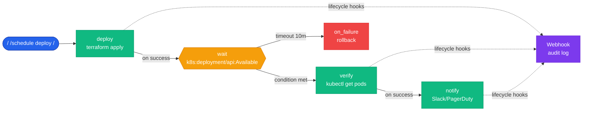

The **Scheduler** (codename **Chronos**) is ChatCLI's durable automation layer. It lets you:

- **Schedule actions** by absolute time, relative delay, cron or interval.
- **Wait for conditions** (HTTP, K8s, Docker, TCP, file, shell, LLM) and fire an action only when satisfied.
- **Chain jobs** in a DAG with `DependsOn` / `Triggers`.
- **Run in daemon mode** that survives closing the CLI — ideal for long deploys, `terraform apply`, database migrations.
- **Give agents** a `@scheduler` tool so they plan their own follow-ups ("wait for the deploy and notify me").

Everything is persistent via **WAL with CRC32**, periodic **snapshots**, **circuit breakers** per evaluator/action, **rate limiter** (global + per-owner), append-only **audit log** (JSONL), **Prometheus metrics** and lifecycle **hooks**.

<Info>
All three ChatCLI modes (interactive CLI, gRPC server, K8s operator) can use the scheduler. The daemon is optional — in casual use the scheduler runs in-process and the WAL replays jobs the next time you open the CLI.
</Info>

---

## Flow overview

Each job can fire immediately, wait for a condition, chain other jobs, and propagate lifecycle hooks. The diagram below shows a typical deploy + verify + notify pipeline:



---

## Why you need this

Before the scheduler, ChatCLI was always synchronous. You asked, waited, got a response. Now:

```bash
❯ /schedule deploy --when +0s --do "shell: terraform apply -auto-approve" --triggers verify
❯ /schedule verify --when manual --do "/run kubectl get pods" --wait "k8s:deployment/prod/api:Available" --timeout 10m

❯ exit    # safe to close if the daemon is running
```

The `terraform apply` runs, waits for the deployment to become Available, then runs the final check. You come back hours later and ask `/jobs history` to see what happened.

---

## Two execution modes

<Tabs>
<Tab title="In-process (default)">

**No setup.** Open chatcli as usual and use `/schedule` / `/wait` / `/jobs`. The scheduler runs inside the process.

```bash
❯ chatcli
❯ /schedule backup --cron "0 2 * * *" --do "/run nightly backup"
```

The prompt status line shows `[jobs: 1⏳]` while jobs are active.

<Warning>
If you exit chatcli, workers stop. Pending jobs stay in the WAL (`~/.chatcli/scheduler/wal/`) and are **replayed** automatically the next time you open the CLI.
</Warning>

</Tab>
<Tab title="Daemon (autonomous)">

**Set up once, runs by itself.** Jobs keep running even when you close the terminal.

```bash
# Start the daemon in the background
$ chatcli daemon start --detach
chatcli daemon started (pid=12345, socket=/tmp/chatcli-scheduler.sock, log=~/.chatcli/scheduler/daemon.log)

# Any chatcli you open connects automatically
$ chatcli
[scheduler: connected to daemon at /tmp/chatcli-scheduler.sock]

❯ /schedule deploy ...
❯ exit
# Daemon keeps running. Come back later:

$ chatcli daemon status
chatcli daemon
  socket   : /tmp/chatcli-scheduler.sock
  uptime   : 3h 14m
  jobs     : 4 active, queue=2
  wal segs : 11
  clients  : 0
```

**Stop the daemon:** `chatcli daemon stop` — pending jobs stay in the WAL and resume on the next start.

</Tab>
</Tabs>

---

## `/schedule` — create a job

```bash
/schedule <name> --when <t> --do <action> [flags]
```

### `--when` values

The DSL accepts multiple formats:

| Format | Example | Behavior |
|---|---|---|
| Relative | `+5m`, `in 30s`, `after 2h` | Once, after the duration |
| Absolute | `at 2026-04-25T14:00`, `at now` | Once, at exact time |
| 5-field cron | `cron:0 2 * * *`, `0 2 * * *` | Recurring, Vixie-cron convention |
| Cron shorthand | `@hourly`, `@daily`, `@weekly`, `@monthly`, `@yearly` | Common presets |
| Interval | `every 30s`, `every 5m`, `every 1h` | Recurring with fixed step |
| Condition-gated | `when-ready` | No time — fires when `--wait` is satisfied |
| Manual | `manual`, `triggered` | Only fires via another job's `--triggers` |

### `--do` values

Seven action types:

| Type | Syntax | Description |
|---|---|---|
| **Slash command** | `/run tests` / `/coder refactor X` | Runs a slash command as if the user typed it |
| **Shell** | `shell: docker compose up -d` | Shell command under CoderMode safety |
| **Agent task** | `agent: deploy and verify` | Boots a ReAct agent with the task |
| **LLM prompt** | `llm: summarize the weekly report` | One-shot headless LLM call |
| **Webhook** | `POST https://hooks.slack.com/... \| hello` | HTTP request |
| **Hook** | `hook:PostToolUse` | Fires a chatcli hook by event name |
| **Noop** | `noop` | Useful for triggers-only pipelines |

### Full flag set

<Expandable title="/schedule flags">
| Flag | Value | Description |
|---|---|---|
| `--when` | DSL | When to fire (required) |
| `--cron` | 5-field expr | Shortcut for `--when cron:<expr>` |
| `--every` | duration | Shortcut for `--when every <dur>` |
| `--do` | DSL | Action to execute (required) |
| `--wait` / `--until` | condition DSL | Poll until satisfied before action |
| `--timeout` | duration | Action timeout (default 5m) |
| `--wait-timeout` | duration | Wait-loop timeout (default 30m) |
| `--poll` | duration | Interval between polls (default 5s) |
| `--max-polls` | int | Poll cap (0=unlimited) |
| `--max-retries` | int | Retries on transient failure |
| `--depends-on` | job_id | Blocks until a job completes |
| `--triggers` | job_id | Fires a job on completion |
| `--ttl` | duration | How long to keep the record post-terminal |
| `--description` | text | Free-form description for `/jobs show` |
| `--tag` | k=v | Tag for filtering in `/jobs list` |
| `--on-timeout` | `fail\|fire_anyway\|fallback` | Wait-timeout behavior |
| `--async` | — | Don't block — return the job ID |
| `--i-know` | — | Acknowledge a dangerous shell command |
</Expandable>

### Examples

```bash
# Daily cron
/schedule backup --cron "0 2 * * *" --do "/run backup --full"

# One-shot with wait
/schedule deploy --when +0s --do "shell: terraform apply -auto-approve" \
  --wait "k8s:deployment/prod/api:Available" --timeout 15m \
  --triggers smoke-tests

# Interval with tag
/schedule health-check --every 30s --do "/run healthcheck prod" --tag env=prod

# Manual (only fires via parent's triggers)
/schedule notify --when manual --do "POST https://slack.webhook | deploy done"
```

---

## `/wait` — block until condition

Sugar for "wait for X to happen and optionally do Y".

```bash
/wait --until <condition> [--then <action>] [flags]
```

### Condition DSL

| Syntax | Evaluator | Example |
|---|---|---|
| `http://host/path==200` | `http_status` | Wait for HTTP 200 |
| `http://host~=/ok/` | `http_status` (regex) | Wait for regex match in body |
| `tcp://host:port` | `tcp_reachable` | Wait for TCP port open |
| `k8s:<kind>/<ns>/<name>:<cond>` | `k8s_resource_ready` | `k8s:pod/prod/api:Ready` |
| `k8s:<kind>/<name>` | `k8s_resource_ready` | Default namespace, condition `Ready` |
| `docker:<name>:running` | `docker_running` | Container running |
| `docker:<name>:healthy` | `docker_running` | Container healthcheck OK |
| `file:/path` | `file_exists` | File exists |
| `file:/path>=100` | `file_exists` (min_size) | File ≥ 100 bytes |
| `shell: <cmd>` | `shell_exit` | Shell returns 0 |
| `<cmd>~=/pattern/` | `regex_match` | cmd output matches regex |
| `llm: <question>` | `llm_check` | LLM answers YES |
| `and(<expr>, <expr>, ...)` | `all_of` | All satisfied |
| `or(<expr>, <expr>, ...)` | `any_of` | Any satisfied |
| `not <expr>` | `negate` | Negate child |

### Examples

```bash
# Wait for endpoint to be healthy and run smoke test
/wait --until http://localhost:8080/health==200 --then "/run smoke" --every 5s --timeout 10m

# Async: registers and returns immediately; see it in /jobs list
/wait --until "k8s:pod/prod/api-*:Ready" --async --name api-ready

# Composite: port open AND lock file gone
/wait --until "and(tcp://db:5432, not file:/tmp/migrating)" --then "/run app restart"
```

### Timeouts

- **`--on-timeout fail`** (default) — mark as `timed_out` and stop.
- **`--on-timeout fire_anyway`** — run the action even without satisfaction.
- **`--on-timeout fallback`** — run the alternate action defined in `WaitSpec.Fallback` (via JSON spec) then fail.

---

## `/jobs` — manage

```bash
/jobs list                    # active (pending, blocked, waiting, running, paused)
/jobs list --all              # include terminal
/jobs list --status running
/jobs list --owner me
/jobs list --tag env=prod --name backup

/jobs show <id>               # full detail + execution history
/jobs tree                    # ASCII DAG (depends_on / triggers)
/jobs logs <id>               # execution history (errors, outputs)
/jobs history                 # terminal jobs

/jobs cancel <id> [reason...]
/jobs pause <id>
/jobs resume <id>

/jobs daemon                  # daemon or in-process status
/jobs gc                      # force snapshot + WAL GC
```

Autocomplete (press Tab) suggests:
- Subcommands (`list`, `show`, `cancel`, …)
- Live job IDs for `show`/`cancel`/`pause`/`resume`/`logs`
- Values for `--status` (pending, running, waiting, …) and `--owner` (me, user, agent, worker, system, hook)

---

## Daemon mode

### Lifecycle

```bash
chatcli daemon start [--detach] [--socket <path>]
chatcli daemon stop  [--socket <path>]
chatcli daemon status [--socket <path>]
chatcli daemon ping  [--socket <path>]
chatcli daemon install    # print systemd/launchd template
```

- **`--detach`** re-execs with `setsid` (Unix) / `CREATE_NEW_PROCESS_GROUP` (Windows), freeing the terminal. Log goes to `<socket_dir>/daemon.log`.
- The interactive CLI auto-detects a daemon on the configured socket and becomes a **thin client** — `/schedule`, `/wait`, `/jobs` round-trip over IPC.
- Stale sockets (dead process) are cleaned automatically before `start`.

### IPC protocol

UNIX socket with 4-byte length-prefix + JSON payload frames. Kinds:
- `ping`, `bye` — health/close
- `enqueue`, `cancel`, `pause`, `resume`, `query`, `list`, `snapshot`, `stats` — operations
- `subscribe` — server-sent events for UI

**Durability** is identical to in-process: WAL fsync before admit, periodic snapshot, replay on boot.

### systemd / launchd

`chatcli daemon install` prints a template ready to paste into `/etc/systemd/system/chatcli-scheduler.service` or `~/Library/LaunchAgents/`.

---

## `@scheduler` — tool for agents

Inside the ReAct loop, the agent can call `@scheduler` with 5 subcommands. This lets agents plan their own pauses autonomously.

```xml
<tool_call name="@scheduler" args='{
  "cmd": "schedule",
  "args": {
    "name": "wait-deploy",
    "when": "+0s",
    "do": "/run kubectl get pods -n prod",
    "until": "k8s:deployment/prod/api:Available",
    "timeout": "10m"
  }
}' />
```

Subcommands:

| `cmd` | Args shape | Returns |
|---|---|---|
| `schedule` | `{name, when, do, wait?, timeout?, depends_on?, triggers?, ...}` | `{job_id, status, summary}` |
| `wait` | `{until, every?, timeout?, async?, then?}` | Sync: `{outcome, job}` · Async: `{job_id, status}` |
| `query` | `{id}` | Full job (status, history, transitions) |
| `list` | `{filter?: {owner, statuses, tag, name_substr, include_terminal}}` | `{jobs: [...]}` |
| `cancel` | `{id, reason?}` | `{ok, job_id}` |

<Tip>
Agent owner is preserved automatically — `filter.owner == OwnerAgent` by default in `list`, and agents can only cancel jobs they created (or jobs of child workers).
</Tip>

---

## Evaluators and actions — plug-in registry

### Built-in evaluators

Each implements `ConditionEvaluator` in `cli/scheduler/condition/`:

<CardGroup cols={2}>
<Card title="shell_exit" icon="terminal">
Runs a command, compares exit code with `expected` (default 0).
</Card>
<Card title="http_status" icon="globe">
GET/POST to URL, exact or regex match against body.
</Card>
<Card title="file_exists" icon="file">
File presence, min size, stable mtime.
</Card>
<Card title="k8s_resource_ready" icon="cubes">
`kubectl get` + jsonpath; Pod, Deployment, StatefulSet, Service, etc.
</Card>
<Card title="docker_running" icon="docker">
`docker inspect`; running + healthcheck.
</Card>
<Card title="tcp_reachable" icon="network-wired">
TCP dial with timeout.
</Card>
<Card title="regex_match" icon="code">
Shell cmd + regex against stdout/stderr/combined.
</Card>
<Card title="llm_check" icon="sparkles">
Headless LLM answers YES/NO.
</Card>
<Card title="custom" icon="gear">
User script — args via env `CHATCLI_SCHEDULER_SPEC`.
</Card>
<Card title="all_of / any_of" icon="sitemap">
Composite with short-circuit and per-child negation.
</Card>
</CardGroup>

### Built-in actions

In `cli/scheduler/action/`:

- **slash_cmd** — invokes `/foo args` via the command handler.
- **shell** — shell command under CoderMode safety (allowlist/denylist from `/config security`).
- **agent_task** — boots ReAct loop with the task.
- **worker_dispatch** — single-agent worker invocation.
- **llm_prompt** — headless LLM call, option to append to history.
- **webhook** — HTTP POST/GET/PUT with JSON body, headers, expected status.
- **hook** — fires chatcli hook by event.
- **noop** — useful for triggers-only pipelines.
- **agent_resume** — resumes an agent parked via `@park`. Loads the snapshot, re-enters the ReAct loop with restored history. See [Agent Park & Resume](/en/features/agent-park).
- **park_poll** — polling driver for `@park for_url` / `for_cmd`. Runs every interval; when `success_when` matches or the deadline elapses, fires an `agent_resume`. Crash-safe via WAL-replay self-rescheduling.

---

## Durability

### WAL (Write-Ahead Log)

- One file per job: `~/.chatcli/scheduler/wal/<jobid>.wal`
- Framing: `magic[4] | length[4] | crc32[4] | payload | crc32[4]` — double CRC detects torn writes.
- Atomic write via `tmp+rename` + `dir fsync`.
- Corrupt files are renamed to `<jobid>.wal.corrupt` for inspection.

### Snapshot

- Written every `SNAPSHOT_INTERVAL` (default 5m) to `snapshot.json`.
- Atomic replace via tmp-rename.
- Boot prefers: snapshot → overlay any newer `.wal`.

### Replay on boot

- `Running` / `Waiting` jobs at crash time come back as `Pending` with `Attempts` preserved.
- Missed fires honor `MissPolicy`:
  - **`fire_once`** (default) — coalesce all missed ticks into a single fire.
  - **`fire_all`** — fire per missed tick (opt-in, can saturate).
  - **`skip`** — ignore the missed window, forward to next.

### Garbage collection

- Terminal jobs stay for `TTL` on disk (default 24h) for `/jobs history`.
- GC loop (`WAL_GC_INTERVAL`, default 1h) unlinks expired `.wal`.

---

## Security

### Action allowlist

`CHATCLI_SCHEDULER_ACTION_ALLOWLIST` controls which action types may be scheduled. Default:

```
slash_cmd, llm_prompt, agent_task, worker_dispatch, hook, noop, webhook, shell
```

Each action type passes through its own security door:
- `shell` → **enqueue preflight + fire-time re-check against CoderMode** (see next section).
- `webhook` → http.Client with timeout and max response size.
- `agent_task` → re-enters the ReAct loop, which keeps its own interactive policy.
- `slash_cmd` → flows through the CLI's CommandHandler (subject to the normal session rules).

### CoderMode preflight for shell

<Warning>
The scheduler **never prompts interactively**. In daemon mode there is no user present; under a nightly cron the user may be offline. So **every approval happens at `/schedule` time**, not at fire.
</Warning>

Every shell command embedded in a job (in `Action`, in `Wait.Condition`, or in `all_of`/`any_of` composite children) is passed to CoderMode's `PolicyManager` — the same one `/coder` and `/agent` use interactively. Three outcomes:

| Classification | Scheduler behavior |
|---|---|
| **Allow** (allowlist match, or known read-only like `kubectl get`) | ✅ job admitted |
| **Deny** (denylist match) | ❌ rejected at `/schedule` with `ErrShellPolicyDeny`. **Denylist beats `--i-know`** — not an override. |
| **Ask** (outside allowlist, unknown command) | ⚠️ rejected with `ErrShellPolicyAsk` **unless** the job has `DangerousConfirmed=true` (via `--i-know`) |

The preflight runs **before the WAL write**, so dangerous jobs never get persisted. At fire time, `RunShell` on the bridge **reloads the on-disk policy and re-classifies** — if the operator added a Deny rule between schedule and execution, the job fails instead of running.

### How to edit the CoderMode policy

`/config security` is now **hierarchical**. The bare form still dumps the read-only panorama; new subcommands mutate the `PolicyManager` live and persist to `~/.chatcli/coder_policy.json`:

```bash
/config security                              # read-only dump (legacy)
/config security rules                        # list active rules, grouped by action
/config security allow "@coder exec my-tool"  # add ALLOW
/config security deny "@coder exec rm -rf /"  # add DENY (prompts [y/N])
/config security forget "<pattern>"           # remove rule (prompts [y/N])
/config security reload                       # re-read the JSON from disk
```

Typical flow after `/schedule` refuses a command:

```
❯ /schedule backup --when +5m --do "shell: my-tool --backup"
  ❌ scheduler: shell command requires approval: my-tool --backup

❯ /config security allow "@coder exec my-tool"
  ✔ ALLOW rule added: @coder exec my-tool
  persisted to ~/.chatcli/coder_policy.json

❯ /schedule backup --when +5m --do "shell: my-tool --backup"
  ✔ Job a1b2c3 created (backup).
```

**Destructive confirmation:** `deny` and `forget` always prompt `[y/N]`. `allow` prompts only when the pattern is "broad" (e.g. `@coder exec` alone, or a very short suffix). Add `--yes` / `-y` to skip the prompt in scripts.

**Scope of changes:** `allow` / `deny` / `forget` update the JSON immediately; the interactive CLI (`workerPolicyAdapter`) reloads on every Ask prompt, and the scheduler reloads on every `RunShell`. If you edited the JSON externally, run `/config security reload` to force every cache to re-read.

The older paths remain valid:

1. **Through the `/coder` interactive prompt** — choosing "Allow always" or "Deny forever" on a safety prompt also persists the rule via `PolicyManager.AddRule`. Same infrastructure as `/config security allow/deny`.

2. **Edit `~/.chatcli/coder_policy.json` directly** — useful for bulk onboarding (ship a ready-made file to the team) or for per-project rules in `<root>/coder_policy.json` (merged with the global).
   ```json
   {
     "rules": [
       {"pattern": "@coder exec my-proprietary-tool", "action": "allow"},
       {"pattern": "@coder exec rm -rf /",            "action": "deny"}
     ],
     "merge": true
   }
   ```
   Patterns use prefix matching on `<toolName> <args>` as the PolicyManager normalizes. Deny always beats allow.

### `--i-know` and `i_know` (agents)

When you want to schedule a command outside the allowlist without adding it permanently:

```bash
/schedule custom-probe --when +30s \
  --do "shell: my-proprietary-tool --probe" \
  --i-know
```

That sets `Job.DangerousConfirmed=true` and the job passes preflight even with an `Ask` classification. Denylist **still** blocks — `--i-know` does not override an explicit `deny`.

Agents get the equivalent via tool call:

```xml
<tool_call name="@scheduler" args='{
  "cmd": "schedule",
  "args": {
    "name": "probe",
    "when": "+30s",
    "do": "shell: my-proprietary-tool --probe",
    "i_know": true
  }
}' />
```

The authorization here is implicit: you already authorized the agent when you ran `/agent`. To keep agents from using `i_know`, set `CHATCLI_SCHEDULER_ALLOW_AGENTS=false` or keep dangerous commands on the denylist (agents can never bypass denylist).

### Full bypass (trusted automation)

For internal automation in a trusted environment you can disable the policy check per-job entirely:

1. Operator enables it: `CHATCLI_SCHEDULER_SHELL_ALLOW_BYPASS=true`
2. Job carries `bypass_safety: true` in the action payload:
   ```json
   {"type": "shell", "payload": {"command": "...", "bypass_safety": true}}
   ```

**Avoid** this in most cases — the right path is almost always to approve the command once via `/coder` (choose "Allow always") or use `--i-know` explicitly on `/schedule`. Bypass is for CI/CD in ephemeral containers where the sandbox is the isolation.

### Rate limiting

Global + per-owner token bucket with nanodelay tolerance:

```
CHATCLI_SCHEDULER_RATE_LIMIT_GLOBAL_RPS=5.0    # default
CHATCLI_SCHEDULER_RATE_LIMIT_GLOBAL_BURST=20
CHATCLI_SCHEDULER_RATE_LIMIT_OWNER_RPS=1.0
CHATCLI_SCHEDULER_RATE_LIMIT_OWNER_BURST=10
```

A runaway ReAct-loop agent can't flood the queue — the rate limiter rejects with a `Retry-After` hint.

### Circuit breakers

One breaker per evaluator type and one per action type, classic `closed → open → half_open`:

```
CHATCLI_SCHEDULER_BREAKER_FAILURE_THRESHOLD=5
CHATCLI_SCHEDULER_BREAKER_WINDOW=60s
CHATCLI_SCHEDULER_BREAKER_COOLDOWN=30s
```

If the K8s API goes down, the `k8s_resource_ready` breaker opens and all dependent jobs fail-fast with `ErrBreakerOpen` instead of saturating the worker pool.

### Audit log

Every mutation (create, transition, cancel, fire) writes a JSON line to `~/.chatcli/scheduler/audit.log`. Rotation via lumberjack (default 10 MiB, 7 backups, 30 days).

### Authorization

- `OwnerUser` and `OwnerSystem` may cancel any job.
- `OwnerAgent` may only cancel jobs it owns or those of child workers.
- Cross-owner cancel returns `ErrNotAuthorized` and fires the `PreJobCancel` hook for auditing.

---

## Observability

### Prometheus metrics

| Metric | Type | Labels |
|---|---|---|
| `chatcli_scheduler_jobs_created_total` | Counter | `owner_kind`, `action_type` |
| `chatcli_scheduler_jobs_fired_total` | Counter | `outcome`, `action_type` |
| `chatcli_scheduler_wait_checks_total` | Counter | `condition_type`, `satisfied` |
| `chatcli_scheduler_wait_duration_seconds` | Histogram | `condition_type` |
| `chatcli_scheduler_action_duration_seconds` | Histogram | `action_type`, `outcome` |
| `chatcli_scheduler_queue_depth` | Gauge | — |
| `chatcli_scheduler_active_jobs` | Gauge | — |
| `chatcli_scheduler_breaker_state` | Gauge | `kind`, `key` (0=closed, 1=open, 2=half_open) |
| `chatcli_scheduler_retries_total` | Counter | `attempt` (bucketed 1/2/3/4+) |
| `chatcli_scheduler_enqueue_errors_total` | Counter | `reason` (rate_limited, full, invalid, …) |
| `chatcli_scheduler_wal_segments` | Gauge | — |
| `chatcli_scheduler_audit_writes_total` | Counter | — |
| `chatcli_scheduler_daemon_connections` | Gauge | — |

### Events

The scheduler publishes on `cli/bus` and fires chatcli hooks:

- `job.created`, `job.scheduled`, `job.fired`
- `job.wait_started`, `job.wait_tick`, `job.wait_satisfied`
- `job.running`, `job.completed`, `job.failed`, `job.timed_out`, `job.cancelled`, `job.skipped`
- `job.retry_queued`, `job.paused`, `job.resumed`, `job.dependency_resolved`
- `breaker.opened`, `breaker.half_open`, `breaker.closed`
- `daemon.started`, `daemon.stopped`

Hooks receive `Scheduler.<event>` as `HookEvent.Type` — you can wire a Slack webhook to `Scheduler.job.failed` via `~/.chatcli/hooks.json`.

### Status line

When jobs are active, the prompt prefix gains `[jobs: 2▶ 1⏳ 1✗]`:
- `▶` running
- `👁` waiting (polling)
- `⏳` pending
- `⛓` blocked (waiting on deps)
- `✗` failed

---

## Full configuration

See [Environment Variables → Scheduler](/en/reference/environment-variables#scheduler) for the ~25 env vars.

### `/config scheduler`

```
❯ /config scheduler

⏲ Scheduler (Chronos) — Scheduling & Wait-Until
  Core
    CHATCLI_SCHEDULER_ENABLED:        enabled
    CHATCLI_SCHEDULER_DATA_DIR:       ~/.chatcli/scheduler
    CHATCLI_SCHEDULER_MAX_JOBS:       256
    CHATCLI_SCHEDULER_WORKER_COUNT:   4
    CHATCLI_SCHEDULER_ALLOW_AGENTS:   enabled
    CHATCLI_SCHEDULER_ACTION_ALLOWLIST: slash_cmd,shell,agent_task,...
  Default Budget
    CHATCLI_SCHEDULER_DEFAULT_ACTION_TIMEOUT:  5m
    CHATCLI_SCHEDULER_DEFAULT_POLL_INTERVAL:   5s
    CHATCLI_SCHEDULER_DEFAULT_WAIT_TIMEOUT:    30m
    ...
  Daemon
    CHATCLI_SCHEDULER_DAEMON_SOCKET:           /tmp/chatcli-scheduler.sock
    CHATCLI_SCHEDULER_DAEMON_AUTO_CONNECT:     enabled
  Active jobs: 3
  Queue depth: 2
  WAL segments: 11
  Daemon:      connected @ /tmp/chatcli-scheduler.sock
```

---

## Internal architecture (brief)

```
┌──────────────────────────────────────────────────────────────┐
│  ChatCLI process                                             │
│                                                              │
│  /schedule  ─┐                                               │
│  /wait      ─┼──▶ Scheduler ◀──▶ WAL + snapshot              │
│  /jobs      ─┘      │                                        │
│  @scheduler ────────┤                                        │
│                     │                                        │
│                     ├──▶ Condition evaluators (plug-in)      │
│                     ├──▶ Action executors (plug-in)          │
│                     ├──▶ Rate limiter (global + per-owner)   │
│                     ├──▶ Circuit breakers (cond + action)    │
│                     ├──▶ bus.EventBus + hook manager         │
│                     └──▶ audit log (JSONL) + Prometheus      │
└──────────────────────────────────────────────────────────────┘
             │
             ▼ (optional)
       UNIX socket ─▶ chatcli-daemon (same binary, --detach)
```

- **Schedule pump** (1 goroutine) drains the priority queue by `NextFireAt`.
- **Worker pool** (N goroutines = `WORKER_COUNT`) runs handleJob (wait → action → finalize).
- **Snapshot loop** (1 goroutine) periodic freeze.
- **GC loop** (1 goroutine) reaps expired terminal records.

---

## Next steps

<CardGroup cols={2}>
<Card title="Cookbook: automations" icon="book" href="/en/cookbook/scheduler-automations">
Practical recipes: deploy with wait, cron backup, DAG pipeline.
</Card>
<Card title="Reference: Commands" icon="rectangle-list" href="/en/reference/command-reference#scheduler">
Full table of flags and subcommands.
</Card>
<Card title="Reference: Env vars" icon="sliders" href="/en/reference/environment-variables#scheduler">
All 25+ scheduler variables.
</Card>
<Card title="Hooks System" icon="webhook" href="/en/features/hooks-system">
Wire Slack/PagerDuty webhooks to scheduler events.
</Card>
</CardGroup>
