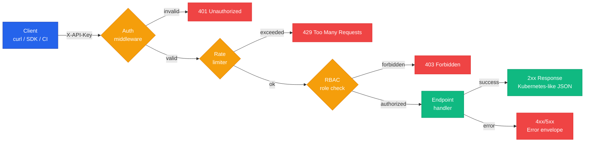

The ChatCLI AIOps Platform **REST API** provides full programmatic access to every platform feature. Built on **Kubernetes-like** patterns (apiVersion + kind + metadata + spec + status), with API key authentication and per-role rate limiting.

<CardGroup cols={3}>
  <Card title="Incidents" icon="siren-on" href="/en/reference/api/list-incidents">
    Detection, ack, snooze, timeline, remediation, and resolution
  </Card>
  <Card title="Runbooks" icon="book-open" href="/en/reference/api/list-runbooks">
    Full CRUD for remediation plans
  </Card>
  <Card title="Analytics" icon="chart-line" href="/en/reference/api/analytics-summary">
    MTTD, MTTR, trends, top resources, capacity, compliance
  </Card>
  <Card title="SLOs" icon="gauge" href="/en/reference/api/list-slos">
    Targets, error budget, burn rate, and history
  </Card>
  <Card title="Federation" icon="network-wired" href="/en/reference/api/federation-status">
    Multi-cluster status, cross-tier correlations
  </Card>
  <Card title="Health" icon="heart-pulse" href="/en/reference/api/health-endpoints">
    Liveness and readiness probes
  </Card>
</CardGroup>

---

## Base URL

```
http://<operator-host>:8090/api/v1
```

<Info>
The default port is **8090** but can be changed via Helm (`--set apiPort=...`) or env var `CHATCLI_API_PORT`. In production, expose behind an Ingress with TLS.
</Info>

---

## Request flow



---

## Authentication

All requests must include the `X-API-Key` header with a valid key:

<CodeGroup>
```bash curl
curl -H "X-API-Key: ck_live_abc123" \
  http://operator:8090/api/v1/incidents
```

```python Python
import requests

resp = requests.get(
    "http://operator:8090/api/v1/incidents",
    headers={"X-API-Key": "ck_live_abc123"},
)
incidents = resp.json()["items"]
```

```go Go
req, _ := http.NewRequest("GET", "http://operator:8090/api/v1/incidents", nil)
req.Header.Set("X-API-Key", "ck_live_abc123")
resp, _ := http.DefaultClient.Do(req)
defer resp.Body.Close()
```

```javascript Node.js
const resp = await fetch("http://operator:8090/api/v1/incidents", {
  headers: { "X-API-Key": "ck_live_abc123" },
});
const { items } = await resp.json();
```
</CodeGroup>

### Roles

<CardGroup cols={3}>
  <Card title="viewer" icon="eye">
    **Read-only.** GET on all endpoints. Ideal for dashboards and observability tools.
  </Card>
  <Card title="operator" icon="user-shield">
    **Daily ops.** GET + POST actions (acknowledge, approve, reject). NOC, SRE, and on-call.
  </Card>
  <Card title="admin" icon="user-gear">
    **Full access.** GET, POST, PUT, DELETE. CI/CD, privileged automation, management tooling.
  </Card>
</CardGroup>

API keys are configured in the operator's ConfigMap:

```yaml
apiVersion: v1
kind: ConfigMap
metadata:
  name: chatcli-operator-config
  namespace: chatcli-system
data:
  api-keys: |
    - key: "ck_live_abc123..."
      role: admin
      description: "CI/CD Pipeline"
    - key: "ck_live_def456..."
      role: operator
      description: "NOC Team"
    - key: "ck_live_ghi789..."
      role: viewer
      description: "Grafana dashboard"
```

<Tip>
In dev environments, if the `chatcli-api-keys` ConfigMap is missing, the operator runs in **dev mode without auth** — useful for local tests, **never for production**.
</Tip>

---

## Rate limiting

| Role | Limit | Window |
|:-----|:------|:-------|
| `viewer` | 100 req | per minute |
| `operator` | 500 req | per minute |
| `admin` | 1000 req | per minute |

Rate limit headers returned in every response:

```http
X-RateLimit-Limit: 500
X-RateLimit-Remaining: 487
X-RateLimit-Reset: 1710864000
```

<Warning>
When the limit is exceeded the operator returns `429 Too Many Requests` with a `Retry-After` header (seconds). Implement exponential backoff in production clients.
</Warning>

---

## Response format

All responses follow a **Kubernetes-like** pattern:

<Tabs>
  <Tab title="List">
    ```json
    {
      "apiVersion": "v1",
      "kind": "IncidentList",
      "metadata": {
        "totalCount": 42,
        "page": 1,
        "pageSize": 20
      },
      "items": [
        { "..." : "..." }
      ]
    }
    ```
  </Tab>
  <Tab title="Single resource">
    ```json
    {
      "apiVersion": "v1",
      "kind": "Incident",
      "metadata": {
        "name": "INC-20260319-001",
        "namespace": "production",
        "createdAt": "2026-03-19T15:20:00Z"
      },
      "spec":   { "...": "..." },
      "status": { "...": "..." }
    }
    ```
  </Tab>
  <Tab title="Error">
    ```json
    {
      "apiVersion": "v1",
      "kind": "Error",
      "error": {
        "code": 401,
        "message": "Invalid or missing API key",
        "details": "Include the X-API-Key header with a valid key"
      }
    }
    ```
  </Tab>
</Tabs>

---

## Error codes

| Code | Meaning | When it happens |
|:-----|:--------|:----------------|
| `400` | Bad Request | Missing or malformed parameters |
| `401` | Unauthorized | `X-API-Key` missing or invalid |
| `403` | Forbidden | Insufficient role for the operation |
| `404` | Not Found | Resource does not exist |
| `409` | Conflict | Resource already exists or invalid state for the operation |
| `429` | Too Many Requests | Rate limit exceeded — see `Retry-After` |
| `500` | Internal Server Error | Operator failure — inspect logs |

---

## Pagination

Endpoints that return lists support pagination via query parameters:

<ParamField query="page" type="integer" default="1">
  Page number (starts at 1)
</ParamField>

<ParamField query="pageSize" type="integer" default="20">
  Items per page (maximum: **100**)
</ParamField>

```bash
curl -H "X-API-Key: $KEY" \
  "http://operator:8090/api/v1/incidents?page=2&pageSize=50"
```

The response includes `metadata.totalCount` so you can compute the total number of pages.

---

## Versioning

The API uses path-based versioning (`/api/v1/`). Future versions will be added as `/api/v2/` while maintaining **backward compatibility** with v1.

<Info>
Breaking changes only happen across major versions. Within a version only compatible additions (new optional fields, new endpoints) are released.
</Info>

---

## Next steps

<CardGroup cols={2}>
  <Card title="AIOps Platform overview" icon="brain" href="/en/features/aiops-platform">
    How the platform detects, analyzes, and remediates incidents
  </Card>
  <Card title="Kubernetes Operator" icon="dharmachakra" href="/en/features/k8s-operator">
    Operator deployment, CRDs, and configuration
  </Card>
  <Card title="Incident lifecycle" icon="siren-on" href="/en/features/aiops/incident-lifecycle">
    Full flow: detection → analysis → remediation → resolution
  </Card>
  <Card title="AIOps in production" icon="rocket" href="/en/cookbook/aiops-production-setup">
    Cookbook: full setup with TLS, RBAC, notifications, and SLOs
  </Card>
</CardGroup>
