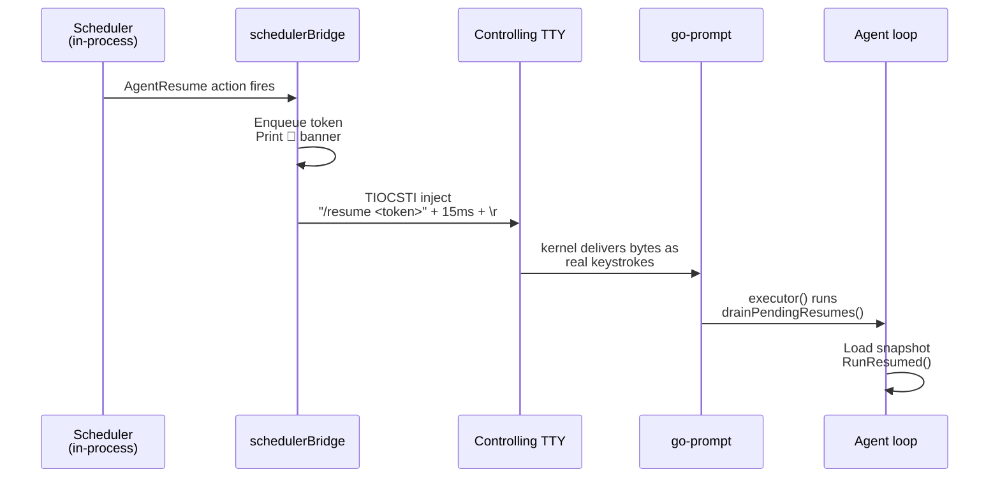

O **Park & Resume** transforma o agent loop em algo que pode esperar **sem travar o terminal**. Em vez do antigo padrão `bash sleep 300` que bloqueia 5 minutos a tela inteira, o agent emite um único tool call `@park` que:

1. **Snapshota** o estado do loop (history, counters, modo) em disco.
2. **Libera o terminal** — você pode chatar, listar jobs, abrir outro `/coder`.
3. **Agenda** o resume no scheduler durável (sobrevive a crash/restart).
4. **Auto-retoma** sozinho quando o timer/polling completa, **sem você apertar Enter**.

<Info>
Disponível desde **chatcli 1.111.x** (PR #879). Funciona em modo `/coder`, `/agent` e `/run`. Auto-resume via TIOCSTI no Unix e `WriteConsoleInputW` no Windows; fallback transparente quando o sistema operacional restringe a injeção.
</Info>

---

## Visão geral do fluxo

```mermaid
flowchart LR
  U([Usuário]) -->|/coder fix CI| A1[Agent loop]
  A1 -->|@park delay=5m| Snap[Snapshot<br/>~/.chatcli/parked/]
  Snap --> Sched[Scheduler<br/>job AgentResume]
  A1 -->|return nil| T([Terminal livre])

  T -.->|usuário usa normalmente| T
  Sched -->|fires after 5m| Notify[NotifyParkComplete]
  Notify -->|TIOCSTI inject| Prompt[/resume token]
  Prompt -->|drain queue| A2[Agent loop continua]
  A2 -->|history restored| Done([Tarefa concluída])

  classDef user fill:#2563EB,stroke:#1E40AF,color:#fff
  classDef agent fill:#10B981,stroke:#059669,color:#fff
  classDef storage fill:#F59E0B,stroke:#D97706,color:#fff
  classDef sched fill:#7C3AED,stroke:#6D28D9,color:#fff

  class U,T user
  class A1,A2,Done agent
  class Snap storage
  class Sched,Notify,Prompt sched
```

---

## Por que isso é necessário

Antes do park, esperar dentro de um `/coder` significava:

```bash
# ruim — terminal travado, cada turno do agent é uma "ação"
bash sleep 300     # 5 minutos parado, você não pode digitar nada
curl ...           # checa CI
[ $? -eq 0 ] && ...
```

Problemas:

- **Terminal bloqueado** os 300 s inteiros.
- Cada `bash` consome **um turn** do orçamento de turns do agent (default 100).
- Crash do CLI = perde o sleep e o estado.
- Sem audit trail — só fica no histórico do shell.

Com `@park`:

- **Terminal liberado** imediatamente; você usa o CLI normalmente.
- Park ocupa **um único turn**, independente da duração (10 s ou 14 dias).
- **Crash-safe** — snapshot em disco + scheduler WAL replay no boot.
- **Audit completo** via `/jobs logs` e `/parked`.

---

## Quatro modos do `@park`

<Tabs>
<Tab title="delay">

Timer fixo. Single-shot. Ideal para "espere antes de checar".

```xml
<tool_call name="@park" args='{
  "cmd": "delay",
  "args": {
    "duration": "5m",
    "note": "esperando CI #1234"
  }
}' />
```

| Campo | Tipo | Obrigatório | Descrição |
|---|---|---|---|
| `duration` | string | ✅ | Go duration: `30s`, `5m`, `1h`. Máximo 14 dias. |
| `note` | string | — | Label humano mostrado no `/parked`. |

</Tab>
<Tab title="until">

Wallclock absoluto ou DSL relativo. Single-shot.

```xml
<tool_call name="@park" args='{
  "cmd": "until",
  "args": {
    "when": "2026-05-04T18:00:00Z",
    "note": "janela de deploy"
  }
}' />
```

Formatos aceitos em `when`:

- RFC3339: `2026-05-04T18:00:00Z`
- Layouts comuns: `2006-01-02 15:04:05`, `2006-01-02 15:04`, `15:04`
- Relativo: `+5m`, `in 5m`, `after 30s`, `5m`

`15:04` é projetado pra hoje; se já passou, vai pra amanhã.

</Tab>
<Tab title="for_url">

Polling HTTP até o response casar com `success_when` (ou deadline elapsar).

```xml
<tool_call name="@park" args='{
  "cmd": "for_url",
  "args": {
    "url": "https://api.github.com/repos/x/y/actions/runs/12345",
    "interval": "30s",
    "deadline": "15m",
    "method": "GET",
    "headers": {"Authorization": "Bearer ghp_..."},
    "success_when": "body contains:\"status\":\"completed\""
  }
}' />
```

| Campo | Obrigatório | Descrição |
|---|---|---|
| `url` | ✅ | http(s):// |
| `interval` | ✅ | Cadência do poll (mínimo 5 s) |
| `deadline` | ✅ | Tempo máximo total (Go duration ou RFC3339) |
| `method` | — | Default `GET` |
| `headers` | — | Map opcional |
| `success_when` | — | DSL — vide [Matchers](#matchers-do-success_when). Vazio = qualquer 2xx |

</Tab>
<Tab title="for_cmd">

Polling de comando shell até `success_when` casar (ou deadline). Sujeito à mesma policy de segurança do `@coder exec`.

```xml
<tool_call name="@park" args='{
  "cmd": "for_cmd",
  "args": {
    "cmd": "terraform plan -detailed-exitcode -no-color",
    "interval": "45s",
    "deadline": "20m",
    "success_when": "exit=0"
  }
}' />
```

| Campo | Obrigatório | Descrição |
|---|---|---|
| `cmd` | ✅ | Comando shell — passa pela policy do `/coder` |
| `interval` | ✅ | Mínimo 5 s |
| `deadline` | ✅ | Máximo total |
| `success_when` | — | DSL. Vazio = exit code 0 |

</Tab>
</Tabs>

### Matchers do `success_when`

DSL livre. Vazio assume "sucesso default" (HTTP 2xx ou exit 0).

| Forma | Exemplo | Significado |
|---|---|---|
| `status=N` | `status=200` | HTTP status exato |
| `status=lo..hi` | `status=200..299` | HTTP status no range |
| `exit=N` | `exit=0` | Shell exit code exato |
| `body contains:<str>` | `body contains:completed` | Substring no body/stdout |
| `body matches:<re>` | `body matches:^OK$` | Regex (Go regexp) no body/stdout |

Múltiplos matchers em um único spec não são suportados; combine via custom `body matches:` se precisar de lógica.

---

## Comandos de gerenciamento

<Tabs>
<Tab title="/parked">

Lista todos os parks pendentes em disco com cross-check do scheduler job.

```bash
❯ /parked
  Agents estacionados (token / modo / descrição / status do scheduler):
    3e06f8d5  [delay] delay 10m — esperando CI #1234
              resume_at=15:42:00  job=cc230eb0c9eafcf7 (queued)
              created=2026-05-04 15:32:00

    8b7e1234  [for_url] polling https://api.github.com/... every 30s
              resume_at=14:47:00 (deadline)  job=ab1234... (running)
              created=2026-05-04 14:32:00
```

Subcomandos:

| Comando | Descrição |
|---|---|
| `/parked` | Lista (default) |
| `/parked prune` | Remove snapshots cujo job está em estado terminal (completed/failed/cancelled/timed_out) — limpa após resume |
| `/parked gc <duration>` | Remove snapshots mais antigos que `<duration>` independente de status (ex: `/parked gc 24h`) |
| `/parked help` | Mostra usage |

</Tab>
<Tab title="/resume">

Força o resume imediato (skip do wait restante).

```bash
❯ /resume 3e06f8d5
  ▶️  Agent retomado (token=3e06f8d5..., outcome=manual) — continuando de onde parou.
```

Aceita prefix único do token (8 chars suficiente na maioria dos casos), igual ao `git checkout abc123`.

<Tip>
Se o auto-resume já consumiu o token (race comum), `/resume <mesmo-token>` é silencioso (no-op idempotente). Errors só aparecem para tokens realmente inválidos. TTL de detecção: 30 s após auto-resume.
</Tip>

</Tab>
<Tab title="/cancel-park">

Aborta um park: remove snapshot + cancela job no scheduler.

```bash
❯ /cancel-park 3e06f8d5
  ✓ Park 3e06f8d5d984... cancelado e snapshot removido.
```

Idempotente: cancelar um park já consumido apenas remove o arquivo se existir.

</Tab>
</Tabs>

---

## Auto-resume — como o terminal "acorda sozinho"

Aqui está a parte que diferencia park de uma simples scheduled-task: quando o wait completa, o agent volta ao foreground **sem você fazer nada**.



### Por que TIOCSTI

`TIOCSTI` é um ioctl POSIX que injeta bytes no input buffer da TTY como se o usuário tivesse digitado. Funciona com qualquer aplicação que lê stdin no controlling tty — não precisa modificar o go-prompt.

### Por que dois bursts (body + 15ms + \r)

go-prompt v0.2.6 usa `bytes.Equal` para classificar keys (`input.go:24`). Um buffer multi-byte como `/resume abc\r` não casa com nenhuma sequência da tabela ASCII e cai no branch default que **insere como texto** — incluindo o `\r` final, que vira literal e nunca submete. Solução: split.

1. Body do comando vai num burst (multi-byte → text insert).
2. Pause de 15 ms (acima do poll de 10 ms do `readBuffer`).
3. `\r` solo num segundo burst (1 byte → matcheia ControlM → submete).

### Windows usa WriteConsoleInputW

Sem TIOCSTI no Windows — o kernel32.dll expõe `WriteConsoleInputW` que aceita `INPUT_RECORD` estruturados. Cada char vira um par key-down/key-up; o Enter final usa `VirtualKeyCode=VK_RETURN` para go-prompt classificar como Enter nativo.

---

## Matriz de plataformas

<Tabs>
<Tab title="Linux">

**TIOCSTI** com gate `/proc/sys/dev/tty/legacy_tiocsti`:

| Kernel | Default | Auto-resume |
|---|---|---|
| Pre-5.16 | TIOCSTI sempre habilitado | ✅ funciona |
| 5.16+ servidor (Ubuntu LTS, RHEL) | `legacy_tiocsti=0` | ✅ funciona |
| 6.x+ desktop, Docker Desktop linuxkit | `legacy_tiocsti=1` | ❌ EPERM, fallback ativa |

Para reabilitar (root):

```bash
sudo sysctl -w dev.tty.legacy_tiocsti=0
```

Trade-off: re-habilita uma feature que distros desabilitaram por causa de [CVE-2017-5226](https://nvd.nist.gov/vuln/detail/CVE-2017-5226) (escape de sandboxes via injeção). Em ambiente dev pessoal é seguro; em servidores compartilhados, considere o fallback.

</Tab>
<Tab title="macOS">

**TIOCSTI** com gate `kern.tiocsti_disable`:

| Versão | Default | Auto-resume |
|---|---|---|
| Pre-Ventura (macOS 12 e anteriores) | `kern.tiocsti_disable=0` | ✅ |
| Ventura+ (macOS 13, 14, 15, 26) | `kern.tiocsti_disable=1` | ❌ EPERM, fallback |

Reabilitar (sudo):

```bash
sudo sysctl -w kern.tiocsti_disable=0
```

Como no Linux, decisão local — pra dev pessoal ok, em ambiente compartilhado considere.

</Tab>
<Tab title="Windows">

`WriteConsoleInputW` é parte da API do conhost e está sempre disponível — não há equivalente do `legacy_tiocsti`. Auto-resume funciona em **Windows Terminal** e **conhost.exe** sem ajustes.

| Console | Auto-resume |
|---|---|
| Windows Terminal | ✅ |
| conhost.exe (cmd nativo) | ✅ |
| Sessão sem console anexado (pipe stdin) | ❌ fallback (esperado) |

</Tab>
<Tab title="BSDs">

FreeBSD/NetBSD/OpenBSD não restringem TIOCSTI por default — funciona out-of-the-box.

</Tab>
</Tabs>

### Fallback quando TIOCSTI/WriteConsoleInput não disponível

Quando a injeção é rejeitada, o `🔔 park ready` ainda aparece e o token entra na pendingResumeQueue. Você precisa **digitar qualquer caractere + Enter** no prompt — o executor consome a queue antes de processar seu input. UX equivalente, com um clique extra.

O prompt prefix mostra `[🅿️ resume ready: N] ❯` enquanto há resume pendente, então é difícil esquecer.

---

## Exemplos práticos

### CI do GitHub Actions

```bash
❯ /coder
> Faz git push e me chama quando o CI passar. Se passar, deploy via terraform.
```

Agent emite (resumido):

```xml
<tool_call name="@coder" args='{"cmd":"exec","args":{"cmd":"git push"}}' />
<tool_call name="@park" args='{
  "cmd":"for_url",
  "args":{
    "url":"https://api.github.com/repos/me/repo/actions/runs?branch=feature&per_page=1",
    "interval":"30s",
    "deadline":"20m",
    "headers":{"Authorization":"Bearer ghp_..."},
    "success_when":"body contains:\"conclusion\":\"success\""
  }
}' />
```

Terminal volta. Você abre outro `/coder` pra refatorar testes em paralelo. ~15 minutos depois:

```
🔔 park ready: token=8b7e... outcome=matched
▶️ Agent retomado — continuando de onde parou.
[agent] CI passou. Aplicando terraform...
<tool_call name="@coder" args='{"cmd":"exec","args":{"cmd":"terraform apply -auto-approve"}}' />
```

### Terraform apply lento

```xml
<tool_call name="@park" args='{
  "cmd":"for_cmd",
  "args":{
    "cmd":"terraform plan -detailed-exitcode -no-color",
    "interval":"45s",
    "deadline":"30m",
    "success_when":"exit=0"
  }
}' />
```

Detalhe importante: `terraform plan -detailed-exitcode` retorna `0` se não há diff, `2` se há diff, `1` em erro. Aqui esperamos `0` (convergência). Para esperar "diff aplicado", troque pra `success_when:exit=2`.

### Janela de deploy noturna

```xml
<tool_call name="@park" args='{
  "cmd":"until",
  "args":{
    "when":"2026-05-05T02:00:00-03:00",
    "note":"deploy off-peak"
  }
}' />
```

Agent dorme até 02:00, retoma e executa o deploy.

### Health check pós-rollout

```xml
<tool_call name="@park" args='{
  "cmd":"for_url",
  "args":{
    "url":"https://prod.example.com/healthz",
    "interval":"15s",
    "deadline":"5m",
    "success_when":"status=200..299"
  }
}' />
```

---

## Modelo de segurança

### Aprovação no @park = aprovação do polling

Quando o agent emite `@park for_cmd cmd="echo done"`, o `/coder` mostra a security check com **os args completos**, incluindo o cmd embedded:

```
🔒 VERIFICAÇÃO DE SEGURANÇA
 ⚡ Ação:   @park
           {"cmd":"for_cmd","args":{"cmd":"echo done","interval":"5s",...}}
```

Quando você responde `[y]`, está pré-autorizando o polling shell rodar **aquele cmd específico** que você acabou de ver. O ChatCLI propaga `DangerousConfirmed=true` no scheduler job, então o poll fire não tropeça em `ShellPolicyAsk` (não há humano no fire-time pra aprovar de novo).

<Warning>
Denylist sempre vence. Mesmo com a aprovação interativa, comandos que casam com regras `Deny` na sua coder policy são rejeitados no fire-time. Veja [Coder Security](/features/coder-security).
</Warning>

### Snapshots têm permissão 0o600

`~/.chatcli/parked/<token>.json` contém o histórico de chat completo do park. Arquivos são criados com `0o600` (owner-only) e o diretório com `0o700`. Snapshots **nunca** vazam pra outros usuários do host.

### Token não permite path traversal

Tokens são gerados com `crypto/rand` (16 bytes hex = 32 chars) e validados contra regex `[a-zA-Z0-9._-]{8,128}`. Não há como `/resume ../etc/passwd` escapar do diretório.

---

## Variáveis de ambiente

| Variável | Default | Descrição |
|---|---|---|
| `CHATCLI_PARK_DIR` | `$XDG_CONFIG_HOME/chatcli/parked` | Override do diretório de snapshots — útil em testes |

A maioria do comportamento é controlada pelo scheduler subjacente — veja [Scheduler env vars](/reference/environment-variables).

---

## Internos — para quem quer hackear

### Snapshot format

JSON serializado com `json.MarshalIndent`. Schema versionado (`SchemaVersion = 1`). Campos principais:

```json
{
  "version": 1,
  "token": "3e06f8d5d984152a48f50f1c734380fd",
  "created_at": "2026-05-04T15:32:00Z",
  "history": [...],
  "is_coder_mode": true,
  "provider": "ANTHROPIC",
  "model": "claude-opus-4-7",
  "park": {
    "mode": "delay",
    "delay": 600000000000,
    "note": "esperando CI"
  },
  "scheduler_job_id": "cc230eb0c9eafcf7",
  "pending_tool_call_id": "tu_abc123"
}
```

`pending_tool_call_id` é o native tool_use ID da Anthropic — preservado pra reconstruir o pairing tool_use/tool_result no resume (caso contrário a próxima request à API rejeita por unmatched tool_call).

### Action types do scheduler

Park introduz 2 action types:

| Type | Payload | Dispara |
|---|---|---|
| `agent_resume` | `{resume_token, outcome, detail}` | Bridge.NotifyParkComplete → drainPendingResumes → RunResumed |
| `park_poll` | `{resume_token, mode, url\|cmd, interval, deadline_unix, success_when, ...}` | Probe → matched? AgentResume : reschedule self |

`park_poll` se auto-reschedula a cada interval até casar ou deadline elapsar. Crash-safe via WAL replay — uma iteração interrompida volta no boot.

### Idempotência do /resume

O auto-resume injeta `/resume <token>\r` via TIOCSTI. Mas o executor já fez o resume na primeira linha (drainPendingResumes), então quando o `/resume <token>` chega no command handler o snapshot já foi deletado.

Solução: `markRecentlyResumed(token)` no drain (TTL 30s) e `wasRecentlyResumed(token)` no handleResumeCommand → no-op silencioso. Tokens realmente inválidos (typos do user) ainda surgem como erro porque o TTL é curto.

---

## Troubleshooting

<AccordionGroup>
<Accordion title="Auto-resume não dispara — vejo 🔔 banner mas nada acontece">

Causa mais comum: `legacy_tiocsti=1` no Linux ou `kern.tiocsti_disable=1` no macOS. O banner é printado pela bridge mas a injeção foi rejeitada pelo kernel.

Verificação:

```bash
# Linux
cat /proc/sys/dev/tty/legacy_tiocsti

# macOS
sysctl kern.tiocsti_disable
```

Se retorna `1`, ou habilita (vide [Matriz de plataformas](#matriz-de-plataformas)) ou usa o fallback: digite qualquer caractere + Enter no prompt e o drain consome o resume.

</Accordion>

<Accordion title="park: nenhum snapshot bate com '<token>'">

Você está usando o **job ID** (segunda coluna do `/parked`) em vez do **token** (primeira coluna). Tokens têm 8 chars visíveis no `/parked`; job IDs são do scheduler interno.

Cole sempre da primeira coluna do `/parked` ou use auto-complete (`Tab`).

</Accordion>

<Accordion title="Park ficou em (failed) no /parked">

Veja `/jobs show <job_id>`. Causas comuns:

- **`echo done` (ou cmd qualquer) com policy Ask + sem DangerousConfirmed**: deveria ser propagado automaticamente; reporte como bug.
- **HTTP 5xx persistente em for_url**: cada poll falha, scheduler pode marcar job como failed depois de N retries. Aumente `interval` ou `deadline`.
- **Comando shell denylist**: regra `Deny` na coder policy bate sempre, mesmo com aprovação. Veja `/config security rules`.

</Accordion>

<Accordion title="Snapshot acumulando em ~/.chatcli/parked/">

Use `/parked prune` para remover snapshots cujo job está terminal (completed/failed/cancelled/timed_out). Em sistemas longevos, considere `/parked gc 24h` periódico.

</Accordion>

<Accordion title="Como saber qual é o controlling TTY que recebe a injeção?">

```bash
tty
```

Mostra `/dev/pts/N` (Linux) ou `/dev/ttysNNN` (macOS). É essa fd que `injectTTYLine` abre via `/dev/tty`.

</Accordion>
</AccordionGroup>

---

## Reference rápida

```bash
# Tool no agent (XML/JSON envelope)
<tool_call name="@park" args='{"cmd":"<delay|until|for_url|for_cmd>","args":{...}}' />

# Comandos de gerenciamento
/parked                         # lista
/parked prune                   # limpa terminais
/parked gc 24h                  # limpa antigos
/resume <token>                 # força resume
/cancel-park <token>            # aborta + remove

# DSL do success_when (for_url e for_cmd)
status=200            # HTTP exato
status=200..299       # HTTP range
exit=0                # shell exit
body contains:done    # substring
body matches:^OK$     # regex
```

Pra contexto da feature de scheduler que sustenta o park, veja [Scheduler](/features/scheduler). Para a security policy do `@coder exec`, veja [Coder Security](/features/coder-security).
