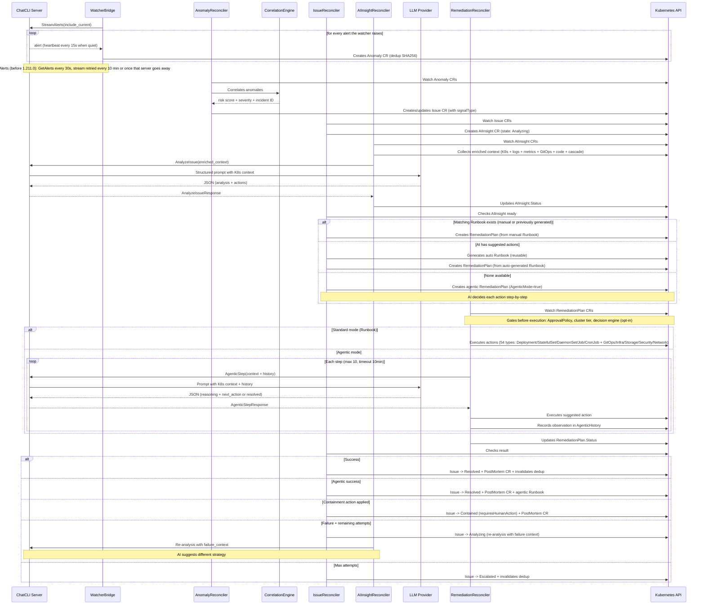
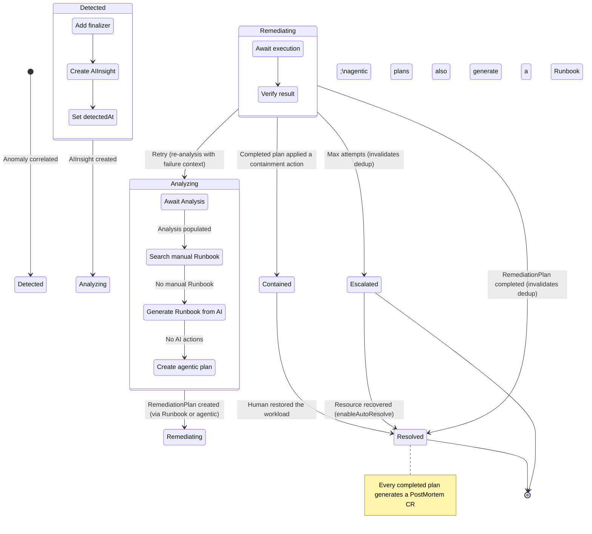
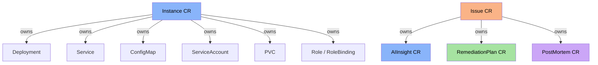

The ChatCLI **AIOps Platform** is an autonomous system that detects problems in Kubernetes, analyzes root causes with AI, and executes automatic remediations -- all orchestrated by native Kubernetes CRDs.

This page covers the internal architecture in depth. For configuration and usage examples, see [K8s Operator](/features/k8s-operator).


## Platform v2 Components

<CardGroup cols={3}>
  <Card title="Notifications" icon="bell" href="/features/aiops/notifications">
    NotificationPolicy & EscalationPolicy
  </Card>
  <Card title="SLO & SLA" icon="bullseye" href="/features/aiops/slo-sla">
    ServiceLevelObjective & IncidentSLA
  </Card>
  <Card title="Approvals" icon="check-double" href="/features/aiops/approval-workflow">
    ApprovalPolicy & ApprovalRequest
  </Card>
  <Card title="Multi-Cluster" icon="globe" href="/features/aiops/federation">
    ClusterRegistration & Federation
  </Card>
  <Card title="Audit" icon="scroll" href="/features/aiops/audit-compliance">
    AuditEvent (immutable trail)
  </Card>
  <Card title="Chaos Engineering" icon="explosion" href="/features/aiops/chaos-engineering">
    ChaosExperiment with safety checks
  </Card>
  <Card title="Decision Engine" icon="brain-circuit" href="/features/aiops/decision-engine">
    Opt-in confidence gate and circuit breaker
  </Card>
  <Card title="Capacity & Cost" icon="chart-line" href="/features/aiops/capacity-cost">
    Capacity forecast, noise reduction, LLM cost per incident
  </Card>
  <Card title="Web Dashboard" icon="gauge" href="/features/aiops/web-dashboard">
    Embedded UI on the operator's port 8090
  </Card>
</CardGroup>

### REST API & Dashboard

The operator also exposes a **REST HTTP API** on port `8090` (chart value `api.port`, env `CHATCLI_AIOPS_PORT`), reached through the Service `chatcli-operator` in the operator namespace (not the Instance Service). Its 40+ endpoints cover incidents, AI insights, remediations, runbooks, approvals, SLOs, post-mortems, analytics (including LLM cost), clusters, federation, policies and audit. A **Web Dashboard** is embedded and served at `/` on the same port.

- **Authentication:** header `X-API-Key`. Keys are read from the Secret `chatcli-operator-secrets`, key `api-keys` (fallback: ConfigMap `chatcli-operator-config`), in the operator namespace, as a YAML list of `{key, role, description}`. Roles are `viewer` < `operator` < `admin`; any other role string is denied. Changes are picked up within about 30 seconds; an `api-keys` entry that is not valid YAML keeps the last valid key set in force, and a Secret without the entry falls back to the ConfigMap. Create it yourself, or let the operator chart render it (`apiKeys.create: true` with `apiKeys.entries`). With no keys configured every `/api/` call returns `401`, unless `CHATCLI_OPERATOR_DEV_MODE=true` (admin without a key, development only).
- **Rate limit:** 30 requests per minute per client host without a valid API key, 600 per minute per valid key (`429` with `Retry-After`).
- **CORS:** deny-all unless `CHATCLI_CORS_ALLOWED_ORIGINS` / `CHATCLI_CORS_ORIGIN` are set. **TLS:** set `CHATCLI_AIOPS_TLS_CERT` and `CHATCLI_AIOPS_TLS_KEY` to serve HTTPS (TLS 1.3).
- **Local preview:** `make dash-preview` in `operator/` serves the dashboard over synthetic data, no cluster needed, at `http://127.0.0.1:8085` with the API key `preview`.

<Note>
  Every operator replica serves the REST API and the dashboard on 8090, so `replicaCount > 1` works behind the Service without pinning requests to the leader.
</Note>

For the complete reference, see the [API Reference](/reference/api/overview).

Four Grafana dashboards (JSON) live in `deploy/grafana/`. The `dashboards-configmap.yaml` there holds only the two ServiceMonitors (operator and server, the latter selecting `app.kubernetes.io/name: chatcli`), not the dashboards: create the ConfigMap by naming each JSON file (see [Web Dashboard](/features/aiops/web-dashboard)) or import the JSON files by hand.


## Pipeline Overview


```mermaid
sequenceDiagram
    participant Server as ChatCLI Server
    participant WB as WatcherBridge
    participant AR as AnomalyReconciler
    participant CE as CorrelationEngine
    participant IR as IssueReconciler
    participant AIR as AIInsightReconciler
    participant LLM as LLM Provider
    participant RR as RemediationReconciler
    participant K8s as Kubernetes API

    WB->>Server: StreamAlerts(include_current)
    loop for every alert the watcher raises
        Server-->>WB: alert (heartbeat every 15s when quiet)
        WB->>K8s: Creates Anomaly CR (dedup SHA256)
    end
    Note over WB,Server: Server without StreamAlerts (before 1.211.0): GetAlerts every 30s, stream retried every 10 min or once that server goes away

    AR->>K8s: Watch Anomaly CRs
    AR->>CE: Correlates anomalies
    CE-->>AR: risk score + severity + incident ID
    AR->>K8s: Creates/updates Issue CR (with signalType)

    IR->>K8s: Watch Issue CRs
    IR->>K8s: Creates AIInsight CR (state: Analyzing)

    AIR->>K8s: Watch AIInsight CRs
    AIR->>K8s: Collects enriched context (K8s + logs + metrics + GitOps + code + cascade)
    AIR->>Server: AnalyzeIssue(enriched_context)
    Server->>LLM: Structured prompt with K8s context
    LLM-->>Server: JSON (analysis + actions)
    Server-->>AIR: AnalyzeIssueResponse
    AIR->>K8s: Updates AIInsight.Status

    IR->>K8s: Checks AIInsight ready
    alt Matching Runbook exists (manual or previously generated)
        IR->>K8s: Creates RemediationPlan (from manual Runbook)
    else AI has suggested actions
        IR->>K8s: Generates auto Runbook (reusable)
        IR->>K8s: Creates RemediationPlan (from auto-generated Runbook)
    else None available
        IR->>K8s: Creates agentic RemediationPlan (AgenticMode=true)
        Note over IR,K8s: AI decides each action step-by-step
    end

    RR->>K8s: Watch RemediationPlan CRs
    Note over RR,K8s: Gates before execution: ApprovalPolicy, cluster tier, decision engine (opt-in)

    alt Standard mode (Runbook)
        RR->>K8s: Executes actions (54 types: Deployment/StatefulSet/DaemonSet/Job/CronJob + GitOps/Infra/Storage/Security/Network)
    else Agentic mode
        loop Each step (max 10, timeout 10min)
            RR->>Server: AgenticStep(context + history)
            Server->>LLM: Prompt with K8s context + history
            LLM-->>Server: JSON (reasoning + next_action or resolved)
            Server-->>RR: AgenticStepResponse
            RR->>K8s: Executes suggested action
            RR->>K8s: Records observation in AgenticHistory
        end
    end
    RR->>K8s: Updates RemediationPlan.Status

    IR->>K8s: Checks result
    alt Success
        IR->>K8s: Issue -> Resolved + PostMortem CR + invalidates dedup
    else Agentic success
        IR->>K8s: Issue -> Resolved + PostMortem CR + agentic Runbook
    else Containment action applied
        IR->>K8s: Issue -> Contained (requiresHumanAction) + PostMortem CR
    else Failure + remaining attempts
        IR->>K8s: Issue -> Analyzing (re-analysis with failure context)
        AIR->>Server: Re-analysis with failure_context
        Note over AIR,Server: AI suggests different strategy
    else Max attempts
        IR->>K8s: Issue -> Escalated + invalidates dedup
    end
```


## Internal Components

### 1. WatcherBridge (`watcher_bridge.go`)

The WatcherBridge is the pipeline entry point. It implements the controller-runtime `manager.Runnable` interface and runs as a manager-managed goroutine.

**Responsibilities:**

| Function | Description |
|----------|-------------|
| `Start()` | Keeps the bridge attached to a ready Instance: stream first, polling fallback, cancelable context |
| `consumeStream()` | Holds the StreamAlerts stream open, turns each alert into an Anomaly, reopens after 60s of silence |
| `poll()` | Queries GetAlerts once (fallback for a server without StreamAlerts, retried as a stream every 10 minutes or once that server stops answering, or `CHATCLI_OPERATOR_ALERT_TRANSPORT=poll`) |
| `discoverAndConnect()` | Discovers server via Instance CRs in the cluster |
| `createAnomaly()` | Converts alert -> Anomaly CR (name `watcher-<type>-<deployment>-<timestamp>`, in the alert's namespace) with reference labels |
| `alertHash()` | SHA256(type\|deployment\|namespace\|resource UID) for dedup |
| `InvalidateDedupForResource()` | Removes dedup entries for a deployment+namespace |
| `sanitizeK8sName()` | Ensures valid names for K8s objects (63 chars, lowercase, no special characters) |

**SHA256 Dedup:**

```text
hash = SHA256(alertType | deployment | namespace | resourceUID)
```

- **No temporal component**: A continuous problem (e.g., CrashLoopBackOff) generates only one Anomaly
- **Resource UID**: a deleted and recreated workload gets a new UID, so its alerts are not swallowed by the old entry
- **TTL**: 30 minutes by default (Instance `spec.aiops.dedupTTLMinutes`, 5–1440) -- expired hashes are pruned automatically
- **Invalidation**: When an Issue is resolved, contained or escalated, dedup entries for the affected resource are invalidated, allowing immediate recurrence detection
- **Result**: Avoids duplicates during an active problem; detects recurrence after resolution

**Server Discovery:**

<Steps>
  <Step title="Lists Instance CRs in the whole cluster">
  </Step>
  <Step title="Selects the first Instance with Status.Ready=true">
    Only one Instance per cluster drives AIOps: the bridge (and the AIInsight and Remediation reconcilers, which share its client) talk to the first ready Instance it finds.
  </Step>
  <Step title="Connects over gRPC with TLS 1.3">
    Target `dns:///<name>.<namespace>.svc.cluster.local:<port>`, with the credential and CA taken from the Instance spec. TLS is mandatory: the Instance needs `spec.server.tls.enabled: true` and a certificate valid for that name.
  </Step>
  <Step title="Retry">
    If the connection fails, retries on the next poll cycle (30s). After 3 silent stream attempts the bridge drops the connection and rediscovers the Instance.
  </Step>
</Steps>

### 2. AnomalyReconciler (`anomaly_controller.go`)

Watches Anomaly CRs and correlates them into Issues.

**Flow:**

<Steps>
  <Step title="Receives Anomaly CR">
    Newly created Anomaly with `Status.Correlated = false`.
  </Step>
  <Step title="Attaches to an active Issue">
    If a non-terminal Issue already exists for the same resource (kind, name, namespace), the Anomaly is attached to it; the Issue's risk score is recalculated from every anomaly the Issue now holds in the correlation window, the one just attached included, and only ever goes up.
  </Step>
  <Step title="Suppression checks">
    Skips the Anomaly when the same resource was resolved within the resolution cooldown (Instance `spec.aiops.resolutionCooldownMinutes`, default 10; `0` turns the cooldown off) or when the noise reducer flags it (repetitive, flapping, seasonal).
  </Step>
  <Step title="Groups anomalies and calculates risk score and severity">
    Calls `CorrelationEngine.FindRelatedAnomalies()` for uncorrelated anomalies on the same resource within 10 minutes.
  </Step>
  <Step title="Creates the Issue CR">
    Name `<resource>-<signal>-<unix time>`, with labels `platform.chatcli.io/inc-id` (`INC-YYYYMMDD-NNN`), `platform.chatcli.io/resource` and `platform.chatcli.io/signal`.
  </Step>
  <Step title="Marks Anomaly as correlated">
    Sets `Correlated = true` with reference to the Issue.
  </Step>
</Steps>

### 3. CorrelationEngine (`correlation.go`)

Correlation engine that groups anomalies into incidents.

**Correlation Algorithm:**

```text
For each new anomaly:
  1. Looks for a non-terminal Issue on the same resource (kind + name + namespace)
  2. If one exists -> attaches the anomaly (risk score recalculated, never lowered)
  3. Otherwise -> sums the weights of the uncorrelated anomalies on that resource
     from the last 10 minutes and creates a new Issue
  4. The incident ID INC-YYYYMMDD-NNN is a per-namespace, per-day sequence (label, not the Issue name)
```

**Risk Scoring** (sum of weights, capped at 100):

| Signal | Weight |
|--------|--------|
| `oom_kill` | 40 |
| `error_rate` | 30 |
| `pod_restart` | 25 |
| `deploy_failing` | 25 |
| `latency` | 20 |
| `pod_not_ready` | 20 |
| `cpu_high` | 15 |
| `memory_high` | 15 |
| any other signal | 10 |

**Severity Classification:**

```text
signal oom_kill  -> Critical (always)
risk_score >= 80 -> Critical
risk_score >= 60 -> High
risk_score >= 30 -> Medium
risk_score <  30 -> Low
```

**Example**: a Deployment with `pod_restart` (25) + `memory_high` (15) = risk 40 -> **Medium**. Adding `error_rate` (30) = risk 70 -> **High**. An Issue opened by an `oom_kill` anomaly is **Critical** whatever the score.

**Source Mapping:** the Issue source mirrors the Anomaly source (`watcher`, `prometheus`, `events`, `logs`, `webhook`); an unknown source maps to `prometheus`.

### 4. IssueReconciler (`issue_controller.go`)

Manages the complete lifecycle of an Issue through a state machine.

**States and Transitions:**


```mermaid
stateDiagram-v2
    [*] --> Detected : Anomaly correlated

    state "Detected" as D {
        state "Add finalizer" as D1
        state "Create AIInsight" as D2
        state "Set detectedAt" as D3
        D1 --> D2
        D2 --> D3
    }

    D --> Analyzing : AIInsight created

    state "Analyzing" as A {
        state "Await Analysis" as A1
        state "Search manual Runbook" as A2
        state "Generate Runbook from AI" as A3
        state "Create agentic plan" as A4
        A1 --> A2 : Analysis populated
        A2 --> A3 : No manual Runbook
        A3 --> A4 : No AI actions
    }

    A --> Remediating : RemediationPlan created (via Runbook or agentic)

    state "Remediating" as R {
        state "Await execution" as R1
        state "Verify result" as R2
        R1 --> R2
    }

    R --> Resolved : RemediationPlan completed (invalidates dedup)
    R --> Contained : Completed plan applied a containment action
    R --> A : Retry (re-analysis with failure context)
    R --> Escalated : Max attempts (invalidates dedup)
    Contained --> Resolved : Human restored the workload
    Escalated --> Resolved : Resource recovered (enableAutoResolve)

    note right of Resolved : Every completed plan generates a PostMortem CR;\nagentic plans also generate a Runbook

    Resolved --> [*]
    Escalated --> [*]
```

`Contained` means the plan silenced the workload (for example `ScaleDeployment` to 0 with `containment=true`) without fixing it: the Issue carries `status.requiresHumanAction: true` and `status.requiredAction`, and it moves to `Resolved` only once the workload is restored. `Escalated` Issues are re-checked every 30 seconds and auto-resolve when the resource is healthy again, unless the Instance sets `spec.aiops.enableAutoResolve: false`. The health check understands Deployments, StatefulSets, DaemonSets, Jobs (healthy once `Complete`) and Nodes (healthy when `Ready`); an Issue on any other kind is not auto-resolved. `Failed` is terminal.

The AIOps settings (`spec.aiops`) come from the Instance the WatcherBridge uses: the WatcherBridge labels each Anomaly with `platform.chatcli.io/instance` and `platform.chatcli.io/instance-namespace`, the Issue inherits them, and without the labels the first Ready Instance applies.

<AccordionGroup>
  <Accordion title="handleDetected()">
    1. Sets `detectedAt` and `maxRemediationAttempts` (default: 5, configurable via Instance `aiops.maxRemediationAttempts`; read from the Instance the WatcherBridge uses)
    2. Creates AIInsight CR `<issue>-insight` with owner reference (Issue -> AIInsight), annotated with the candidate Runbooks
    3. Transitions to `Analyzing`
    4. Runs the federation checks (cascade detection, cross-cluster correlation), best effort
    5. Requeues after 10 seconds
  </Accordion>
  <Accordion title="handleAnalyzing()">
    1. Checks if AIInsight has `Analysis` populated
    2. Searches for matching manual Runbook (`findMatchingRunbook` -- tiered matching)
    3. If manual Runbook found -> `createRemediationPlan()` (manual has precedence)
    4. If no manual Runbook but AIInsight has `SuggestedActions` -> `generateRunbookFromAI()` -> `createRemediationPlan()` using the auto-generated Runbook
    5. If none -> `createAgenticRemediationPlan()` (AgenticMode=true, no pre-defined actions -- AI decides each step)
    6. Transitions to `Remediating`
  </Accordion>
  <Accordion title="findMatchingRunbook() -- Tiered Matching">
    - **Tier 1**: SignalType + Severity + ResourceKind (exact match, preferred)
    - **Tier 2**: Severity + ResourceKind (fallback when signal doesn't match)
    - `SignalType` resolved from: `issue.Spec.SignalType` -> fallback `issue.Labels["platform.chatcli.io/signal"]`
    - Runbooks are searched in **every namespace**, not only the Issue's: the Issue's namespace first, then the others, each Runbook once
  </Accordion>
  <Accordion title="generateRunbookFromAI()">
    - Materializes `SuggestedActions` from AI as a reusable Runbook CR
    - Name: `auto-{signal}-{severity}-{kind}-{hash}` (sanitized; `hash` = first 6 hex chars of the SHA256 of the analysis, so different root causes produce different Runbooks)
    - Labels: `platform.chatcli.io/auto-generated=true`
    - Trigger: SignalType + Severity + ResourceKind (for future reuse)
    - Uses `CreateOrUpdate` for idempotency
  </Accordion>
  <Accordion title="handleRemediating()">
    1. Finds the most recent RemediationPlan (`findLatestRemediationPlan`)
    2. If `Completed` -> Issue `Resolved` (or `Contained` when the plan applied a containment action) + **PostMortem CR** (timeline, root cause, impact, lessons) + invalidates dedup for the resource
       - If agentic plan: also generates a **reusable Runbook** from successful steps
    3. If `Failed` and remaining attempts -> **re-analysis**: collects failure evidence (`collectFailureEvidence`), clears AIInsight analysis, returns to `Analyzing` state with failure context
    4. If `Failed` and max attempts -> `Escalated` + invalidates dedup for the resource
  </Accordion>
</AccordionGroup>

**Retry with Strategy Escalation:**
- Each retry triggers AI re-analysis with context from previous failures
- AI receives `previous_failure_context` with evidence from failed attempts
- The prompt instructs: "Do not repeat the same actions. Analyze why they failed and suggest a fundamentally different approach"
- Generates a new auto-generated Runbook when the new analysis differs (the name carries a hash of the analysis)

**Remediation Priority:**

```text
1. Existing Runbook (tiered match: SignalType+Severity+Kind -> Severity+Kind)
2. AI auto-generated Runbook (materialized as reusable CR)
3. Agentic plan (AI decides each step)
4. Escalation after maxRemediationAttempts failed attempts
```

### 5. AIInsightReconciler (`aiinsight_controller.go`)

Watches AIInsight CRs and calls the `AnalyzeIssue` RPC to populate the analysis.

**Flow:**

<Steps>
  <Step title="Checks existing analysis">
    Checks if `Status.Analysis` is already populated (skip if yes).
  </Step>
  <Step title="Checks connectivity">
    Checks if server is connected (requeue 15s if not).
  </Step>
  <Step title="Fetches context">
    Fetches parent Issue for context.
  </Step>
  <Step title="Collects K8s context">
    Collects K8s context via `KubernetesContextBuilder` (deployment, pods, events, revisions).
  </Step>
  <Step title="Reads failure context">
    Reads failure context from annotation `platform.chatcli.io/failure-context` (if re-analysis).
  </Step>
  <Step title="Builds request">
    Builds `AnalyzeIssueRequest` with Issue data + K8s context + failure context.
  </Step>
  <Step title="Calls AnalyzeIssue RPC">
    Calls `AnalyzeIssue` RPC via `ServerClient`.
  </Step>
  <Step title="Populates status">
    Populates `Status.Analysis`, `Confidence`, `Recommendations`, `SuggestedActions`. Clears `failure-context` annotation after re-analysis completes.
  </Step>
</Steps>

**KubernetesContextBuilder (`k8s_context.go`):**

Collects real cluster context for **Deployments, StatefulSets, DaemonSets, Jobs, CronJobs, and HPAs** (max 15000 chars):
- **Resource Status**: replicas, conditions, containers, images + resources (each type has a dedicated context builder)
- **StatefulSet**: replicas, update strategy, partition, PodManagementPolicy, VolumeClaimTemplates
- **DaemonSet**: desired/current/ready/available/unavailable, nodeSelector, tolerations
- **Job/CronJob**: active/succeeded/failed, completions, parallelism, schedule, lastSuccessful
- **HPA**: min/max replicas, current/desired, target utilization, current metrics, maxed-out detection
- **Pod Details** (up to 5 pods, unhealthy first): phase, restart count, container states
- **Recent Events** (last 15): type, reason, message, count
- **Revision History**: Last 5 revisions (ReplicaSets) with image diff between revisions

**LogAnalyzer (`log_analyzer.go`):**

Advanced application log analysis (beyond the basic 50-line tail):
- **Stack Trace Extraction**: detects and extracts stack traces from **Java** (Exception/Caused by), **Go** (panic/goroutine), **Python** (Traceback), **Node.js** (Error at)
- **Error Pattern Detection**: 24+ critical patterns categorized (crash, connectivity, dns, auth, storage, tls, database, cache, messaging)
- **Structured Log Parsing**: extracts error/warn entries from JSON logs (fields level, msg, error, timestamp, logger)
- **Init Container Logs**: analyzes init container logs (reveals startup failures)
- **Sidecar Logs**: analyzes sidecar logs (istio-proxy, envoy, datadog-agent, etc.)
- **Critical Lines**: extracts FATAL/PANIC lines with 3 lines of context before/after
- **Temporal Window**: fetches logs by temporal window (10min before the incident), not just tail

**MetricsCollector (`metrics_collector.go`):**

Prometheus queries for quantitative data during analysis:
- **CPU/Memory**: usage trends 30min before → during → 15min after the incident
- **Request/Error Rate**: HTTP requests and 5xx per second
- **Latency**: P50, P95, P99 histogram percentiles
- **HPA Metrics**: current vs desired replicas, CPU target
- **Network**: receive/transmit bytes/s
- **Trend Analysis**: detects spikes, drops, sustained_high/low with % change calculation
- **Enabled via**: `PROMETHEUS_URL` env var on the operator

**GitOpsDetector (`gitops_detector.go`):**

Detects and integrates with GitOps tools:
- **Helm Releases**: detects via Secrets type `helm.sh/release.v1`, status (deployed/failed/pending-upgrade), chart version, previous revision for rollback
- **ArgoCD Applications**: sync status (Synced/OutOfSync), health (Healthy/Degraded), conditions, last sync result
- **Flux Kustomizations**: ready status, source ref, conditions, last applied

**SourceCodeAnalyzer (`source_controller.go`):**

Code-aware diagnostics when `SourceRepository` CRD is configured:
- **Git Correlation**: finds commits in the 30min before the incident
- **Suspected Commit**: identifies the most likely commit (score by temporal proximity + volume of changes)
- **Code Extraction**: extracts code snippets referenced in stack traces (file path + line number → source code)
- **Config Analysis**: reads Dockerfile, values.yaml, Chart.yaml for deploy context
- **Credentials**: Secret keys `token`, `username` + `password`, or `ssh-key` + `known_hosts`; HTTPS credentials go through a `GIT_ASKPASS` helper and are never written to `.git/config`; SSH verifies host keys against `known_hosts` (`spec.sshHostKeyPolicy: acceptNew` trusts the first key when the Secret has none). See [Source repositories](/features/k8s-operator#source-repositories)

**CascadeAnalyzer (`cascade_analyzer.go`):**

Cross-service cascade failure analysis:
- **Dependency Graph**: discovers dependencies via Services + EndpointSlices
- **Temporal Correlation**: finds active issues in the same namespace and cross-namespace within a 15-20min window
- **Cascade Chain**: orders services by detection time (first = root cause)
- **Root Cause Service**: identifies the service that originated the cascade

**BlastRadiusPredictor (`blast_radius.go`):**

Impact prediction before action execution:
- **PDB Check**: verifies if the action would violate PodDisruptionBudgets
- **Quota Check**: verifies ResourceQuotas (>90% used = warning)
- **Node Capacity**: counts pods on node for cordon/drain actions
- **Affected Services**: discovers which Services would be impacted
- **Risk Level**: classifies as low/medium/high/critical

**AnalyzeIssueRequest:**

| Field | Source | Description |
|-------|--------|-------------|
| `issue_name` | Issue.Name | Issue name |
| `namespace` | Issue.Namespace | Namespace |
| `resource_kind` | Issue.Spec.Resource.Kind | Resource type (Deployment) |
| `resource_name` | Issue.Spec.Resource.Name | Deployment name |
| `signal_type` | Issue.Spec.SignalType / labels | Signal type |
| `severity` | Issue.Spec.Severity | Severity |
| `description` | Issue.Spec.Description | Problem description |
| `risk_score` | Issue.Spec.RiskScore | Risk score |
| `provider` | AIInsight.Spec.Provider | LLM provider |
| `model` | AIInsight.Spec.Model | LLM model |
| `kubernetes_context` | 6 enrichers combined | K8s status (Deploy/STS/DS/Job/CronJob/HPA) + **log analysis** (stack traces, error patterns) + **Prometheus metrics** (trends) + **GitOps** (Helm/ArgoCD/Flux) + **source code** (commits, code snippets) + **cascade analysis** + **RCA enrichment** |
| `previous_failure_context` | Annotation on AIInsight | Evidence from previous attempts (retries) |

### 6. RemediationReconciler (`remediation_controller.go`)

Executes the actions defined in a RemediationPlan.

**Supported Actions (54 types, plus `Custom`, which is always rejected):**

**Deployment / Generic (19 actions + `Custom`):**

| Category | Type | What It Does | Key Parameters |
|----------|------|-------------|----------------|
| Workload | `ScaleDeployment` | Adjusts Deployment replicas | `replicas` |
| Workload | `RestartDeployment` | Rollout restart via annotation | -- |
| Workload | `RollbackDeployment` | Rollback to previous/healthy/specific revision (via ReplicaSet) | `toRevision` |
| Workload | `PatchConfig` | Updates ConfigMap data | `configmap`, `key=value` |
| Workload | `AdjustResources` | Adjusts CPU/memory on Deployment containers | `container`, `memory_limit`, `cpu_limit`, etc. |
| Workload | `DeletePod` | Removes the sickest pod (auto-selects) | `pod` (optional) |
| Workload | `RestartStatefulSetPod` | Restart specific StatefulSet pod or rolling restart | `pod` (optional) |
| GitOps | `HelmRollback` | Rollback Helm release | `revision` |
| GitOps | `ArgoSyncApp` | Trigger ArgoCD sync | `revision` |
| Autoscaling | `AdjustHPA` | Modifies HPA min/max/target | `minReplicas`, `maxReplicas`, `targetCPUUtilization` |
| Infra | `CordonNode` | Marks node unschedulable | `node` |
| Infra | `UncordonNode` | Marks node schedulable again | `node` |
| Infra | `DrainNode` | Cordons and evicts pods from node | `node` |
| Storage | `ResizePVC` | Expands PVC (no shrinking) | `pvc`, `size` |
| Security | `RotateSecret` | Updates Secret values or copies from source | `secret`, `sourceSecret` or `key=value` |
| Networking | `UpdateIngress` | Modifies Ingress backend/annotations | `ingress`, `backendService`, `backendPort` |
| Networking | `PatchNetworkPolicy` | Adds ports to NetworkPolicy ingress rules | `networkPolicy`, `allowPort`, `protocol` |
| Advanced | `ApplyManifest` | Applies JSON manifest from ConfigMap | `configmap`, `key` |
| Advanced | `ExecDiagnostic` | Runs a command from a read-only allowlist inside a pod | `command` (see [allowlist](/features/k8s-operator#execdiagnostic-allowlist)), `pod`, `container` |
| -- | `Custom` | **Blocked** -- requires manual approval | -- |

**StatefulSet (9 actions):**

| Type | What It Does | Key Parameters |
|------|-------------|----------------|
| `ScaleStatefulSet` | Ordered replica scaling | `replicas` |
| `RestartStatefulSet` | Rolling restart via annotation (ordered) | -- |
| `RollbackStatefulSet` | Rollback via ControllerRevision (not ReplicaSet) | `toRevision` (previous\|N) |
| `AdjustStatefulSetResources` | Adjusts CPU/memory on StatefulSet containers | `container`, `memory_limit`, `cpu_limit`, etc. |
| `DeleteStatefulSetPod` | Deletes specific or unhealthiest pod (preserves PVC identity) | `pod` (optional) |
| `ForceDeleteStatefulSetPod` | Force-delete stuck Terminating pod (grace=0) | `pod` (REQUIRED) |
| `UpdateStatefulSetStrategy` | Changes updateStrategy type | `type` (RollingUpdate\|OnDelete), `maxUnavailable` |
| `RecreateStatefulSetPVC` | Deletes stuck PVC for recreation | `pvc`, `confirm=true` (REQUIRED) |
| `PartitionStatefulSetUpdate` | Sets partition for canary rollout | `partition` |

**DaemonSet (7 actions):**

| Type | What It Does | Key Parameters |
|------|-------------|----------------|
| `RestartDaemonSet` | Rolling restart of all DaemonSet pods across nodes | -- |
| `RollbackDaemonSet` | Rollback via ControllerRevision | `toRevision` (previous\|N) |
| `AdjustDaemonSetResources` | Adjusts CPU/memory on DaemonSet containers | `container`, `memory_limit`, `cpu_limit`, etc. |
| `DeleteDaemonSetPod` | Deletes pod (optionally on specific node) | `pod` or `node` (optional) |
| `UpdateDaemonSetStrategy` | Changes update strategy | `type`, `maxUnavailable`, `maxSurge` |
| `PauseDaemonSetRollout` | Pauses rollout (sets maxUnavailable=0) | -- |
| `CordonAndDeleteDaemonSetPod` | Cordons node + deletes DaemonSet pod on it | `node` (REQUIRED) |

**Job (9 actions):**

| Type | What It Does | Key Parameters |
|------|-------------|----------------|
| `RetryJob` | Deletes failed Job + recreates from spec | -- |
| `AdjustJobResources` | Adjusts CPU/memory on Job template | `container`, `memory_limit`, `cpu_limit`, etc. |
| `DeleteFailedJob` | Cleans up a failed Job and its pods | -- |
| `SuspendJob` | Pauses a running Job (suspend=true) | -- |
| `ResumeJob` | Resumes a suspended Job (suspend=false) | -- |
| `AdjustJobParallelism` | Changes Job parallelism | `parallelism` |
| `AdjustJobDeadline` | Changes activeDeadlineSeconds | `activeDeadlineSeconds` |
| `AdjustJobBackoffLimit` | Changes backoffLimit | `backoffLimit` |
| `ForceDeleteJobPods` | Force-deletes all pods of a Job (grace=0) | -- |

**CronJob (10 actions):**

| Type | What It Does | Key Parameters |
|------|-------------|----------------|
| `SuspendCronJob` | Pauses CronJob scheduling (suspend=true) | -- |
| `ResumeCronJob` | Resumes CronJob scheduling (suspend=false) | -- |
| `TriggerCronJob` | Creates a Job from CronJob template immediately | -- |
| `AdjustCronJobResources` | Adjusts CPU/memory on jobTemplate containers | `container`, `memory_limit`, `cpu_limit`, etc. |
| `AdjustCronJobSchedule` | Changes cron schedule expression | `schedule` |
| `AdjustCronJobDeadline` | Changes startingDeadlineSeconds | `startingDeadlineSeconds` |
| `AdjustCronJobHistory` | Changes success/failure history limits | `successfulJobsHistoryLimit`, `failedJobsHistoryLimit` |
| `AdjustCronJobConcurrency` | Changes concurrencyPolicy | `concurrencyPolicy` (Allow\|Forbid\|Replace) |
| `DeleteCronJobActiveJobs` | Kills all currently running Jobs | -- |
| `ReplaceCronJobTemplate` | Replaces jobTemplate from ConfigMap JSON | `configmap`, `key` |

<Warning>
**Safety Checks (pre-execution):** Scale to 0 replicas blocked (Deployment and StatefulSet) unless the action carries `containment=true`, which marks a deliberate stop-the-bleeding step and moves the Issue to `Contained`. AdjustResources limit cannot be less than request (all resource types). DeletePod/DeleteStatefulSetPod refuses if only 1 pod exists. ForceDeleteStatefulSetPod requires explicit pod name. RecreateStatefulSetPVC requires `confirm=true`. Custom actions are blocked. Blast radius prediction checks PDB violations, resource quotas, and affected services before execution — now generalized for all workload types via `getPodTemplateLabels`.

**Automatic Rollback (post-failure):** Before any action, a structured `ResourceSnapshot` captures the complete resource state. For Deployments: replicas, images, CPU/memory, HPA. For StatefulSets: replicas, containers, updateStrategy, partition. For DaemonSets: containers, updateStrategy, maxUnavailable. For Jobs: suspend, parallelism, backoffLimit, activeDeadlineSeconds, containers. For CronJobs: suspend, schedule, concurrencyPolicy, history limits, containers. If an action fails or health verification expires (90s), the `RollbackEngine` automatically restores the resource to the pre-remediation state. Works for Deployments, StatefulSets, DaemonSets, Jobs, CronJobs, Nodes, and HPAs.
</Warning>

**Execution Flow (Standard):**

```text
Pending -> Snapshot -> Executing -> (checkpoint + action, for each action)
  -> Verifying (90s timeout) -> Completed
  -> If action fails -> Automatic rollback -> RolledBack
  -> If verification fails -> Automatic rollback -> RolledBack
  -> If rollback fails -> Failed
```

**Execution Flow (Agentic):**

```text
Pending -> Executing -> (agentic loop: AI decides -> executes -> observes -> repeat)
  -> Verifying -> Completed | Failed

Each reconcile = 1 step of the agentic loop:
  1. Refresh K8s context (KubernetesContextBuilder)
  2. Send history + context -> AgenticStep RPC
  3. AI responds: {reasoning, resolved, next_action}
  4. If resolved=true -> Verifying (+ annotations with PostMortem data)
  5. If next_action -> execute -> record observation -> requeue 5s
  6. If observation-only -> record -> requeue 10s
  7. If next_action diverges from the AIInsight without a divergence_reason
     -> recorded as rejected, not executed, the AI is asked again
  Safety: max steps (Instance aiops.agenticMaxSteps, default 10), timeout 10 minutes,
  convergence detector (repeated observations, A-B-A-B oscillation, 5 failures in a row,
  more than 8 minutes elapsed) fails the plan early
```

### 7. ServerClient (`grpc_client.go`)

Shared gRPC client between the WatcherBridge, the AIInsightReconciler and the RemediationReconciler.

| Method | Description |
|--------|-------------|
| `NewServerClient()` | Creates instance (no connection) |
| `Connect(addr, opts)` | Connects over gRPC with TLS 1.3 (always) and the Instance credential; keepalive 30s/5s |
| `GetAlerts(ctx)` | Fetches the active alerts from the watcher |
| `StreamAlerts(ctx, includeCurrent)` | Opens the alert stream; lives as long as ctx |
| `AnalyzeIssue(req)` | Sends issue for AI analysis |
| `AgenticStep(req)` | Executes one step of the agentic loop (context + history -> next action) |
| `Health()` / `GetServerInfo()` | Probe and authenticated info call |
| `IsConnected()` | Checks if connection is active |
| `Close()` | Closes gRPC connection |


## Server and Operator Interaction

### StreamAlerts and GetAlerts RPCs

The server pushes K8s Watcher alerts over `StreamAlerts` (server streaming with heartbeats; see [Server Mode](/features/server-mode#streamalerts)) and still exposes them for one-shot reads via gRPC:

```protobuf
rpc GetAlerts(GetAlertsRequest) returns (GetAlertsResponse);
rpc StreamAlerts(StreamAlertsRequest) returns (stream StreamAlertsResponse);

message WatcherAlert {
  string type = 1;            // HighRestartCount, OOMKilled, PodNotReady, DeploymentFailing, ...
  string severity = 2;        // info, warning, critical
  string message = 3;
  string object = 4;          // e.g. pod name
  string namespace = 5;
  string deployment = 6;
  int64 timestamp_unix = 7;
}

message GetAlertsRequest {
  string namespace = 1;       // optional filter
  string deployment = 2;      // optional filter
}
```

The server handler iterates over the `ObservabilityStore` of each MultiWatcher target, filters by namespace if specified, and returns active alerts.

### AnalyzeIssue RPC

The server receives the Issue context and calls the LLM for analysis:

```protobuf
rpc AnalyzeIssue(AnalyzeIssueRequest) returns (AnalyzeIssueResponse);

message SuggestedAction {
  string name = 1;
  string action = 2;
  string description = 3;
  map<string, string> params = 4;
}

message AnalyzeIssueResponse {
  string analysis = 1;
  float confidence = 2;       // 0.0 to 1.0
  repeated string recommendations = 3;
  string model = 4;
  string provider = 5;
  repeated SuggestedAction suggested_actions = 6;
  TokenUsage usage = 7;       // feeds the cost ledger
}
```

**Structured Prompt:**

The server builds a prompt that includes:

1. Issue context (name, namespace, resource, severity, risk score, description)
2. The action catalog (the 54 action types, with their parameters and resource-kind rules)
3. Instructions to return structured JSON with `analysis`, `confidence`, `recommendations`, and `actions` fields

**Response Parsing:**

1. Removes markdown codeblocks (`` ```json ... ``` ``)
2. Parses JSON into `analysisResult`
3. Clamps confidence between 0.0 and 1.0
4. If parsing fails -> uses raw response as analysis with confidence 0.5

### AgenticStep RPC

The server receives the Issue context, history of previous steps, and updated K8s context, and decides the next action:

```protobuf
rpc AgenticStep(AgenticStepRequest) returns (AgenticStepResponse);

message AgenticStepRequest {
  string issue_name = 1;
  string namespace = 2;
  string resource_kind = 3;
  string resource_name = 4;
  string signal_type = 5;
  string severity = 6;
  string description = 7;
  int32 risk_score = 8;
  string provider = 9;
  string model = 10;
  string kubernetes_context = 11;   // refreshed at each step
  repeated AgenticHistoryEntry history = 12;
  int32 max_steps = 13;
  int32 current_step = 14;
  // Prior AIInsight guidance, so the loop cannot silently contradict its own analysis
  string insight_analysis = 15;
  float insight_confidence = 16;
  repeated string insight_recommendations = 17;
  repeated SuggestedAction insight_suggested_actions = 18;
}

message AgenticStepResponse {
  string reasoning = 1;              // AI reasoning (recorded in history)
  bool resolved = 2;                 // true = problem resolved
  SuggestedAction next_action = 3;   // null when resolved=true
  // Fields below only populated when resolved=true:
  string postmortem_summary = 4;
  string root_cause = 5;
  string impact = 6;
  repeated string lessons_learned = 7;
  repeated string prevention_actions = 8;
  bool diverges_from_insight = 9;     // next_action contradicts the AIInsight
  string divergence_reason = 10;      // justification when diverging on purpose
  TokenUsage usage = 11;
}
```

**AgenticStep Prompt:**

The server builds a structured prompt with:

1. **Role + Issue details**: incident context (type, severity, resource)
2. **Kubernetes context**: real cluster state (refreshed at each step via KubernetesContextBuilder)
3. **Tool definitions**: the action catalog + "Observe" (no action, wait for next context)
4. **Conversation history**: each previous step formatted with reasoning -> action -> observation
5. **Instructions**: respond JSON, budget (step N of M), safety rules

When `resolved=true`, the response includes data for PostMortem generation (summary, root_cause, impact, lessons_learned, prevention_actions). When `diverges_from_insight` is true and `divergence_reason` is empty, the operator records the step as rejected and does not execute the proposed action.


## PostMortem Generation

When **any remediation plan completes** (standard or agentic, including a containment that leaves the Issue `Contained`), the `IssueReconciler` automatically generates:

### PostMortem CR

Created via `generatePostMortem()`, named `pm-<issue>` in the Issue's namespace:

| Field | Source |
|-------|--------|
| `timeline` | `detected` event + one `action_executed`/`action_failed` event per action (agentic steps or plan actions) + `resolved` event |
| `actionsExecuted` | Agentic steps with an action, or the plan's actions (includes result) |
| `summary` | Annotation `platform.chatcli.io/postmortem-summary` (AI-generated; falls back to the AIInsight analysis) |
| `rootCause` | Annotation `platform.chatcli.io/root-cause` |
| `impact` | Annotation `platform.chatcli.io/impact` |
| `lessonsLearned` | Annotation `platform.chatcli.io/lessons-learned` |
| `preventionActions` | Annotation `platform.chatcli.io/prevention-actions` |
| `duration` | Calculated: resolvedAt - detectedAt |

In addition to the fields above, the PostMortem is automatically enriched with:
- **Trending**: detection of recurring incidents (count in the last 30 days, related PostMortems)
- **Cascade Chain**: cascade failure chain if there are correlated cross-service issues
- **Git Correlation**: suspected commit (SHA, author, changed files, confidence)
- **GitOps Context**: Helm/ArgoCD/Flux state at the time of the incident

The PostMortem CR is owned by the Issue (cascade delete).

### Auto-generated Runbook (Agentic)

Created via `generateAgenticRunbook()`:

- **Name**: `agentic-{signal}-{severity}-{kind}` (sanitized)
- **Steps**: only steps with successful actions
- **Labels**: `auto-generated=true`, `source=agentic`
- Uses `CreateOrUpdate` (reused for future incidents of the same type)


## Operator Prometheus Metrics

The operator exposes Prometheus metrics on its metrics port (`8080`, plain HTTP, path `/metrics`; chart `serviceMonitor.enabled` creates a ServiceMonitor). The pipeline metrics:

| Metric | Type | Description |
|--------|------|-------------|
| `chatcli_operator_anomalies_processed_total` | Counter | Anomalies processed, by outcome (new Issue, attached, suppressed) |
| `chatcli_operator_issues_created_by_correlation_total` | Counter | Issues created by the correlation engine |
| `chatcli_operator_issues_total` | Counter | Total issues by severity and state |
| `chatcli_operator_issue_resolution_duration_seconds` | Histogram | Duration from detection to resolution (chaos-induced Issues excluded) |
| `chatcli_operator_active_issues` | Gauge | Number of unresolved issues |
| `chatcli_operator_remediations_total` | Counter | Remediation actions by `action_type` and `result` |
| `chatcli_operator_remediation_duration_seconds` | Histogram | Remediation plan execution time |
| `chatcli_operator_decision_engine_evaluations_total` | Counter | Decision engine verdicts by `mode` (only when the engine is enabled) |
| `chatcli_operator_decision_engine_circuit_breaker_state` | Gauge | `1` while a namespace's circuit breaker is open |
| `chatcli_operator_agentic_convergence_stops_total` | Counter | Agentic loops stopped by the convergence detector, by `reason` |

Approvals, SLA/SLO, notifications, escalation, federation and chaos experiments have their own `chatcli_operator_*` metrics, listed on their pages; controller-runtime adds its default reconcile metrics.


## Tests

The operator's unit tests run over the controller-runtime fake client and cover every component on this page:

| Component | Coverage |
|-----------|---------|
| InstanceReconciler | CRUD, watcher, persistence, replicas, RBAC, deletion, auth pre-check, server probe |
| AnomalyReconciler | Creation, correlation, attachment to existing Issue |
| IssueReconciler | State machine, AI fallback, retry, agentic plan, containment, PostMortem generation |
| RemediationReconciler | All 54 action types (Deployment + StatefulSet + DaemonSet + Job + CronJob), safety constraints, agentic loop, rollback, verification, decision engine and tier gates |
| AIInsightReconciler | Connectivity, mock RPC, analysis parsing, credentials |
| PostMortemReconciler | State initialization, terminal state |
| WatcherBridge | Alert mapping, SHA256 dedup, pruning, Anomaly creation, stream and poll transports, connection options |
| CorrelationEngine | Risk scoring, severity, incident ID, related anomalies |
| MapActionType | All string -> enum mappings |

### Run Tests

```bash
cd operator
go test ./... -v          # unit tests over the fake client
make test-integration    # envtest: real API server, CRDs, every controller wired
```

The integration suite (`operator/integration`) proves what the fake client cannot: CRD schemas and required fields, status subresources, owner references and controllers reacting to each other's writes. Its scenarios are an Instance provisioning its owned workload only when a credential is configured, one anomaly travelling Anomaly → Issue → AIInsight → RemediationPlan → scaled Deployment → completed plan → resolved Issue → PostMortem, an ApprovalPolicy parking a plan until a human approves, and an IncidentSLA recording a resolution violation. CI runs it with `KUBEBUILDER_ASSETS` exported and counts it toward coverage.


## Ownership Diagram (Garbage Collection)


```mermaid
graph TD
    INST[Instance CR] -->|owns| DEP[Deployment]
    INST -->|owns| SVC[Service]
    INST -->|owns| CM[ConfigMap]
    INST -->|owns| SA[ServiceAccount]
    INST -->|owns| PVC[PVC]
    INST -->|owns| RB[Role / RoleBinding]

    ISS[Issue CR] -->|owns| INSIGHT[AIInsight CR]
    ISS -->|owns| PLAN[RemediationPlan CR]
    ISS -->|owns| PM[PostMortem CR]

    style INST fill:#89b4fa,color:#000
    style ISS fill:#fab387,color:#000
    style INSIGHT fill:#89b4fa,color:#000
    style PLAN fill:#a6e3a1,color:#000
    style PM fill:#cba6f7,color:#000
```

- **Instance** is the owner of the namespaced resources it creates (Deployment, Service, ConfigMaps, SA, PVC, watcher Role/RoleBinding); a cross-namespace watcher ClusterRoleBinding is removed by the Instance finalizer instead
- **Issue** is the owner of AIInsight, RemediationPlan, and PostMortem (cascade delete)
- Anomalies are independent (no owner) to preserve history


## AIOps Deployment Checklist

<Steps>
  <Step title="Install Operator via Helm (CRDs + RBAC + Deployment + Dashboard)">
    ```bash
    helm install chatcli-operator \
      oci://ghcr.io/diillson/charts/chatcli-operator \
      --version 1.212.0 \
      --namespace chatcli-system --create-namespace
    ```
  </Step>
  <Step title="Create the Secrets the Instance needs">
    - the LLM provider keys (for example `ANTHROPIC_API_KEY`), referenced by `spec.apiKeys.name`
    - a server token (or JWT material): an in-cluster server listens on `0.0.0.0` and refuses to run without a credential, and the operator does not create the Deployment without one (`AuthenticationConfigured=False`)
    - a TLS Secret (`tls.crt`, `tls.key`, optionally `ca.crt`) valid for `<instance>.<namespace>.svc.cluster.local`: the operator always dials the server over TLS 1.3

    ```bash
    kubectl create namespace chatcli
    kubectl -n chatcli create secret generic chatcli-api-keys --from-literal=ANTHROPIC_API_KEY=<your-key>
    kubectl -n chatcli create secret generic chatcli-server-token --from-literal=token="$(openssl rand -hex 32)"
    kubectl -n chatcli create secret tls chatcli-tls --cert=tls.crt --key=tls.key
    ```
  </Step>
  <Step title="Create Instance CR">
    ```yaml
    apiVersion: platform.chatcli.io/v1alpha1
    kind: Instance
    metadata:
      name: chatcli
      namespace: chatcli
    spec:
      provider: CLAUDEAI
      apiKeys:
        name: chatcli-api-keys
      server:
        tls:
          enabled: true
          secretName: chatcli-tls
        token:
          name: chatcli-server-token
          key: token
      watcher:
        enabled: true
        targets:
          - name: my-app
            kind: Deployment
            namespace: production
    ```

    A watcher target outside the Instance namespace needs the pre-provisioned ClusterRole `chatcli-watcher` (created by the chart).

    Create **one** Instance for AIOps per cluster: the pipeline connects to the first ready Instance it finds, cluster-wide.
  </Step>
  <Step title="Verify server">
    `kubectl get instances -A` -- `READY` must be `true`; check the conditions `AuthenticationConfigured` and `ServerReachable` with `kubectl describe instance chatcli -n chatcli`.
  </Step>
  <Step title="Verify AIOps pipeline">
    - `kubectl get anomalies -A` -- anomalies being detected
    - `kubectl get issues -A` -- issues being created
    - `kubectl get aiinsights -A` -- AI analyzing
  </Step>
  <Step title="(Optional) Enable the dashboard and REST API">
    Create the Secret `chatcli-operator-secrets` (key `api-keys`) in `chatcli-system`, then `kubectl -n chatcli-system port-forward svc/chatcli-operator 8090:8090` and open `http://localhost:8090`.
  </Step>
  <Step title="(Optional) Create manual Runbooks">
    Create manual Runbooks for specific scenarios.
  </Step>
  <Step title="Monitor metrics">
    Monitor operator metrics via Prometheus (`serviceMonitor.enabled=true` in the chart).
  </Step>
</Steps>


## Next Steps

<CardGroup cols={2}>
  <Card title="K8s Operator" icon="dharmachakra" href="/features/k8s-operator">
    Configuration and examples
  </Card>
  <Card title="K8s Watcher" icon="binoculars" href="/features/k8s-watcher">
    Collection and budget details
  </Card>
  <Card title="Server Mode" icon="server" href="/features/server-mode">
    StreamAlerts, GetAlerts, AnalyzeIssue, and AgenticStep RPCs
  </Card>
  <Card title="K8s Monitoring" icon="book" href="/cookbook/k8s-monitoring">
    Recipe: K8s Monitoring with AI
  </Card>
</CardGroup>
