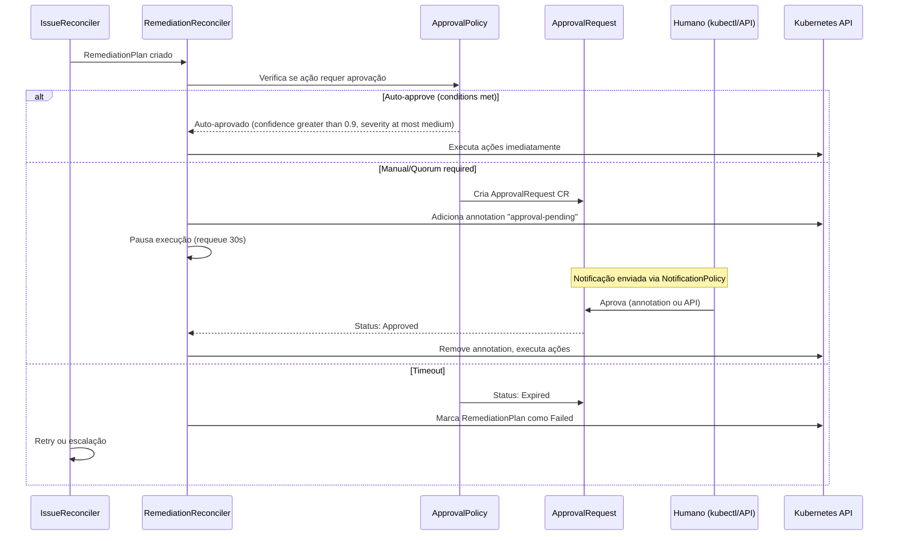
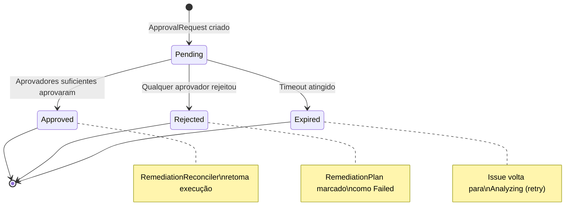
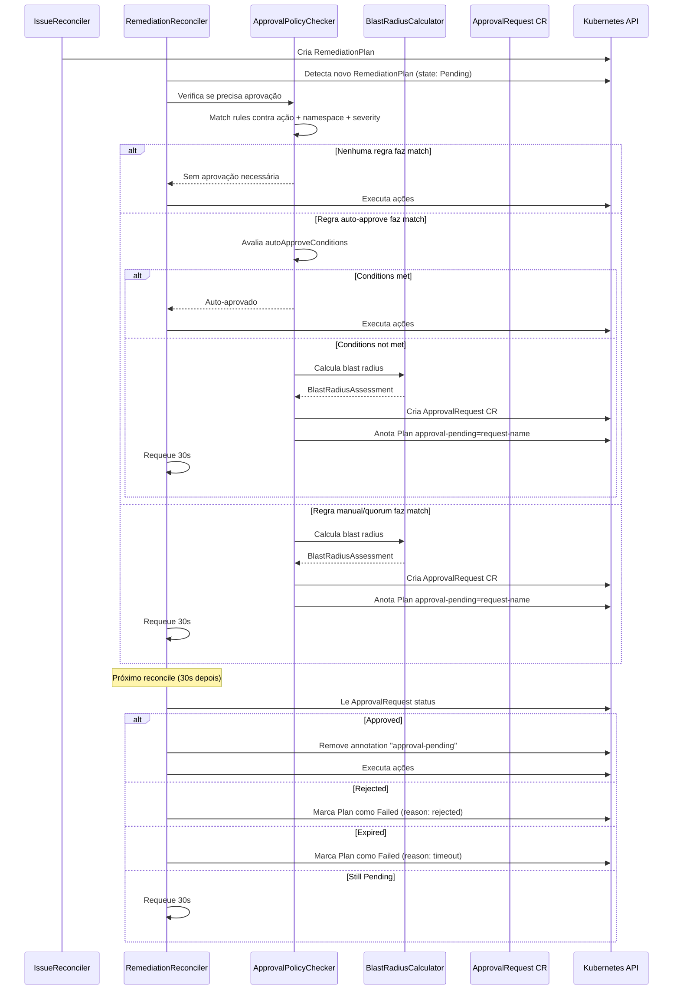

Em ambientes de produção, nem toda remediação automática deve ser executada sem supervisão humana. O sistema de **Approval Workflow** do ChatCLI permite definir políticas granulares que controlam quais ações requerem aprovação, quem pode aprovar, e em quais janelas de mudança (change windows) as ações são permitidas.


## Por que Approval Workflows são Essenciais

<CardGroup cols={3}>
  <Card title="Segurança" icon="shield">
    Previne que remediação automática cause impacto maior que o problema original (ex: rollback acidental em produção)
  </Card>
  <Card title="Compliance" icon="file-certificate">
    Auditoria completa de quem aprovou, quando, e por que. Requisito para SOC2, PCI-DSS, HIPAA.
  </Card>
  <Card title="Confiança" icon="handshake">
    Equipes adotam AIOps mais facilmente quando sabem que ações críticas requerem aprovação humana.
  </Card>
</CardGroup>

Sem approval workflows, uma IA que detecta um falso positivo pode executar um rollback desnecessário, afetando um deployment saudável. Com approval policies, ações de alto impacto são bloqueadas até que um humano valide a análise e o blast radius.


## Visão Geral do Fluxo




## ApprovalPolicy CRD

O `ApprovalPolicy` define **regras** que determinam quais ações de remediação precisam de aprovação, em quais condições, e quem pode aprovar.

```yaml
apiVersion: platform.chatcli.io/v1alpha1
kind: ApprovalPolicy
metadata:
  name: production-approval-policy
  namespace: production
spec:
  rules:
    - name: auto-approve-low-risk
      match:
        severities: [low, medium]
        actionTypes: [RestartDeployment, ScaleDeployment]
        namespaces: [staging, development]
      mode: auto
      autoApproveConditions:
        minConfidence: 0.85
        maxSeverity: medium
        historicalSuccessRate: 0.90

    - name: manual-approve-rollback
      match:
        actionTypes: [RollbackDeployment]
        namespaces: [production, payments]
      mode: manual
      requiredApprovers: 1
      timeoutMinutes: 30

    - name: quorum-critical-production
      match:
        severities: [critical, high]
        namespaces: [production]
        resourceKinds: [Deployment, StatefulSet]
      mode: quorum
      requiredApprovers: 2
      timeoutMinutes: 15

    - name: block-critical-namespace-rollback
      match:
        actionTypes: [RollbackDeployment]
        namespaces: [payments, auth]
        severities: [critical]
      mode: manual
      requiredApprovers: 2
      timeoutMinutes: 10

  changeWindow:
    timezone: "America/Sao_Paulo"
    allowedDays: [1, 2, 3, 4, 5]    # Segunda a Sexta
    startHour: 9
    endHour: 18
    overrideForCritical: true         # Critical ignora change window
    blackoutDates:
      - date: "2026-03-20"
        reason: "Congelamento pré-release Q1"
      - date: "2026-12-24"
        reason: "Véspera de Natal"
      - date: "2026-12-31"
        reason: "Véspera de Ano Novo"
```

### Campos do Spec

#### ApprovalRule

Cada regra define um par **match + mode** com configurações específicas.

| Campo | Tipo | Obrigatório | Descrição |
|-------|------|:-----------:|-----------|
| `name` | string | **Sim** | Nome único da regra dentro da policy |
| `match` | ApprovalMatch | **Sim** | Critérios de matching |
| `mode` | string | **Sim** | `auto`, `manual`, `quorum` |
| `requiredApprovers` | int | Para manual/quorum | Número mínimo de aprovadores |
| `timeoutMinutes` | int | Não | Timeout em minutos (padrão: `60`) |
| `autoApproveConditions` | AutoApproveConditions | Para auto | Condições para auto-aprovação |


#### ApprovalMatch

Define quais remediações são cobertas por esta regra. A lógica é **AND** entre campos e **OR** dentro de cada campo.

| Campo | Tipo | Descrição |
|-------|------|-----------|
| `severities` | []string | `critical`, `high`, `medium`, `low` |
| `actionTypes` | []string | `ScaleDeployment`, `RestartDeployment`, `RollbackDeployment`, `PatchConfig`, `AdjustResources`, `DeletePod`, `Custom` |
| `namespaces` | []string | Namespaces K8s afetados |
| `resourceKinds` | []string | `Deployment`, `StatefulSet`, `DaemonSet` |

<Note>
Quando múltiplas regras fazem match, a regra **mais restritiva** prevalece. A ordem de prioridade é: `manual` > `quorum` > `auto`. Se uma regra exige `quorum` com 2 aprovadores e outra exige `manual` com 1, o sistema aplica `quorum` com 2.
</Note>

#### Três Modos de Aprovação

<Tabs>
  <Tab title="auto">
    **Auto-approve**: O sistema aprova automaticamente se **todas** as condições de `autoApproveConditions` forem atendidas. Caso contrário, escala para `manual`.

    | Condição | Tipo | Descrição |
    |----------|------|-----------|
    | `minConfidence` | float64 | Confiança mínima da análise de IA (0.0-1.0) |
    | `maxSeverity` | string | Severidade máxima para auto-approve |
    | `historicalSuccessRate` | float64 | Taxa mínima de sucesso histórico para este tipo de ação |

    ```yaml
    mode: auto
    autoApproveConditions:
      minConfidence: 0.90      # IA tem >= 90% de confiança
      maxSeverity: medium      # Até severidade medium
      historicalSuccessRate: 0.85  # >= 85% de sucesso em ações similares
    ```

    **Lógica de avaliação:**

    ```text
    auto_approve = (
      ai_confidence >= minConfidence AND
      severity <= maxSeverity AND
      historical_success_rate >= historicalSuccessRate
    )

    Se auto_approve = false -> escala para modo manual (1 approver)
    ```
  </Tab>
  <Tab title="manual">
    **Manual**: Requer aprovação explícita de pelo menos `requiredApprovers` humanos. O RemediationPlan fica pausado até a aprovação ou timeout.

    ```yaml
    mode: manual
    requiredApprovers: 1
    timeoutMinutes: 30
    ```
  </Tab>
  <Tab title="quorum">
    **Quorum**: Requer aprovação de `requiredApprovers` pessoas. Garante que a aprovação não depende de um único indivíduo.

    ```yaml
    mode: quorum
    requiredApprovers: 2
    timeoutMinutes: 15
    ```

    Neste exemplo, são necessários pelo menos 2 aprovadores para que a ação seja executada.
  </Tab>
</Tabs>

#### ChangeWindowSpec

Define janelas de mudança (change windows) que controlam **quando** remediação automática pode ser executada.

| Campo | Tipo | Obrigatório | Descrição |
|-------|------|:-----------:|-----------|
| `timezone` | string | **Sim** | Timezone IANA (ex: `America/Sao_Paulo`) |
| `allowedDays` | []int | **Sim** | Dias permitidos (0=Domingo, 6=Sábado) |
| `startHour` | int | **Sim** | Hora de início da janela (0-23) |
| `endHour` | int | **Sim** | Hora de fim da janela (0-23) |
| `overrideForCritical` | bool | Não | Se `true`, severidade `critical` ignora a change window |
| `blackoutDates` | []BlackoutDate | Não | Datas específicas com congelamento total |

<Warning>
Quando fora da change window, ações de remediação ficam **enfileiradas** (não descartadas). Elas serão executadas automaticamente quando a próxima janela abrir — desde que o Issue ainda esteja ativo e o approval não tenha expirado.
</Warning>


## ApprovalRequest CRD

O `ApprovalRequest` é criado automaticamente pelo `RemediationReconciler` quando uma ação requer aprovação. Contém todas as informações necessárias para o aprovador tomar uma decisão informada.

```yaml
apiVersion: platform.chatcli.io/v1alpha1
kind: ApprovalRequest
metadata:
  name: approve-api-gateway-rollback-1234
  namespace: production
  labels:
    platform.chatcli.io/issue: api-gateway-oom-kill-1771276354
    platform.chatcli.io/action-type: RollbackDeployment
    platform.chatcli.io/severity: critical
spec:
  issueRef:
    name: api-gateway-oom-kill-1771276354
  remediationPlanRef:
    name: api-gateway-oom-kill-plan-1
  requestedAction:
    type: RollbackDeployment
    params:
      toRevision: "previous"
  policyRef:
    name: production-approval-policy
    rule: manual-approve-rollback
  requiredApprovers: 1
  timeoutMinutes: 30

  blastRadius:
    affectedPods: 5
    affectedServices:
      - name: api-gateway
        namespace: production
        endpoints: 3
      - name: api-gateway-internal
        namespace: production
        endpoints: 2
    affectedIngresses:
      - name: api-gateway-ingress
        namespace: production
    riskLevel: high
    estimatedDowntime: "30s"
    rollbackAvailable: true

  evidence:
    aiConfidence: 0.87
    analysis: "High restart count caused by OOMKilled. Container memory limit (512Mi) insufficient."
    historicalSuccessRate: 0.92
    similarIncidents: 3
    lastSimilarResolution: "RollbackDeployment to revision 5 (2 days ago, success)"

status:
  state: Pending            # Pending | Approved | Rejected | Expired
  decisions: []
  createdAt: "2026-03-19T14:30:00Z"
  expiresAt: "2026-03-19T15:00:00Z"
```

### Campos do Spec

#### Raiz

| Campo | Tipo | Obrigatório | Descrição |
|-------|------|:-----------:|-----------|
| `issueRef` | ObjectRef | **Sim** | Referência ao Issue que originou o request |
| `remediationPlanRef` | ObjectRef | **Sim** | Referência ao RemediationPlan pausado |
| `requestedAction` | ActionSpec | **Sim** | Ação que requer aprovação |
| `policyRef` | PolicyRef | **Sim** | Referência a policy e regra que disparou |
| `requiredApprovers` | int | **Sim** | Número mínimo de aprovadores |
| `timeoutMinutes` | int | **Sim** | Tempo até expirar |
| `blastRadius` | BlastRadiusAssessment | **Sim** | Avaliação de impacto |
| `evidence` | ApprovalEvidence | **Sim** | Evidências para tomada de decisão |

#### BlastRadiusAssessment

| Campo | Tipo | Descrição |
|-------|------|-----------|
| `affectedPods` | int | Número de pods que serão afetados pela ação |
| `affectedServices` | []ServiceRef | Services que roteiam para os pods afetados |
| `affectedIngresses` | []IngressRef | Ingresses que expõem os services afetados |
| `riskLevel` | string | `critical`, `high`, `medium`, `low` (calculado) |
| `estimatedDowntime` | string | Estimativa de downtime durante a ação |
| `rollbackAvailable` | bool | Se a ação pode ser revertida |

#### ApprovalEvidence

| Campo | Tipo | Descrição |
|-------|------|-----------|
| `aiConfidence` | float64 | Nível de confiança da análise da IA (0.0-1.0) |
| `analysis` | string | Resumo da análise da IA |
| `historicalSuccessRate` | float64 | Taxa de sucesso de ações similares no histórico |
| `similarIncidents` | int | Número de incidentes similares no passado |
| `lastSimilarResolution` | string | Descrição da última resolução similar |

#### ApprovalDecision

Cada aprovação ou rejeição é registrada como uma decision no status:

| Campo | Tipo | Descrição |
|-------|------|-----------|
| `approver` | string | Identificador do aprovador (usuário ou sistema) |
| `decision` | string | `approved` ou `rejected` |
| `reason` | string | Justificativa para a decisão |
| `timestamp` | Time | Quando a decisão foi feita |

#### Estados do ApprovalRequest



<Info>
Uma única rejeição é suficiente para bloquear a ação, independente do número de aprovações. Isso garante que qualquer membro da equipe pode vetar uma ação de risco.
</Info>


## Blast Radius Calculator

O blast radius calculator avalia o impacto potencial de uma ação de remediação antes de solicitar aprovação.

### Como Funciona

<Steps>
  <Step title="Consulta pods do deployment">
    O calculator lista todos os pods gerenciados pelo deployment alvo usando label selectors.

    ```text
    pods = kubectl get pods -l app=api-gateway -n production
    affectedPods = len(pods)  // ex: 5
    ```
  </Step>
  <Step title="Encontra services que roteiam para os pods">
    Para cada Service no namespace, verifica se o selector faz match com as labels dos pods do deployment.

    ```text
    for service in namespace.services:
      if service.selector matches pod.labels:
        affectedServices.append(service)
    ```
  </Step>
  <Step title="Encontra ingresses que expoe os services">
    Para cada Ingress no namespace, verifica se referência algum dos services afetados.

    ```text
    for ingress in namespace.ingresses:
      for rule in ingress.rules:
        if rule.backend.service in affectedServices:
          affectedIngresses.append(ingress)
    ```
  </Step>
  <Step title="Calcula risk level">
    O risk level é determinado pelo número de pods afetados:

    ```text
    if affectedPods > 10:  riskLevel = "critical"
    if affectedPods > 5:   riskLevel = "high"
    if affectedPods > 2:   riskLevel = "medium"
    else:                  riskLevel = "low"
    ```
  </Step>
  <Step title="Estima downtime">
    Com base no tipo de ação:

    | Ação | Downtime Estimado |
    |------|------------------|
    | `ScaleDeployment` (up) | 0s (nenhum pod removido) |
    | `RestartDeployment` | ~30s (rolling update) |
    | `RollbackDeployment` | ~30-60s (rolling update) |
    | `AdjustResources` | ~30s (rolling update) |
    | `DeletePod` | ~10s (recriação pelo ReplicaSet) |
    | `PatchConfig` | 0s (sem restart) |
  </Step>
</Steps>


## Integração com RemediationReconciler

### Fluxo Completo



### Annotation de Controle

O `RemediationReconciler` usa a annotation `platform.chatcli.io/approval-pending` para controlar o fluxo:

```yaml
metadata:
  annotations:
    platform.chatcli.io/approval-pending: "approve-api-gateway-rollback-1234"
```

Quando esta annotation está presente:
1. O reconciler  **não executa nenhuma ação**
2. Consulta o status do `ApprovalRequest` referenciado
3. Remove a annotation apenas quando o request é `Approved`
4. Se `Rejected` ou `Expired`, marca o plan como `Failed`


## Como Aprovar

### Via kubectl

A maneira mais direta de aprovar é usando annotations:

```bash
# Aprovar
kubectl annotate approvalrequest approve-api-gateway-rollback-1234 \
  -n production \
  platform.chatcli.io/approve="edilson:LGTM, blast radius aceitavel"

# Rejeitar
kubectl annotate approvalrequest approve-api-gateway-rollback-1234 \
  -n production \
  platform.chatcli.io/reject="edilson:Risk too high, investigate memory leak first"
```

**Formato da annotation:**

```text
platform.chatcli.io/approve="<usuário>:<motivo>"
platform.chatcli.io/reject="<usuário>:<motivo>"
```

O reconciler do `ApprovalRequest` detecta a annotation, registra a decision no status, e remove a annotation.

### Via REST API

O operator expõe uma API REST para integrações:

<CodeGroup>

```bash Aprovar
curl -X POST \
  http://localhost:8090/api/v1/approvals/approve-api-gateway-rollback-1234/approve \
  -H "Content-Type: application/json" \
  -H "Authorization: Bearer $TOKEN" \
  -d '{
    "approver": "edilson",
    "reason": "LGTM, blast radius aceitavel. AI confidence 87% com histórico de sucesso."
  }'
```

```bash Rejeitar
curl -X POST \
  http://localhost:8090/api/v1/approvals/approve-api-gateway-rollback-1234/reject \
  -H "Content-Type: application/json" \
  -H "Authorization: Bearer $TOKEN" \
  -d '{
    "approver": "edilson",
    "reason": "Risk too high. Investigar memory leak antes de rollback."
  }'
```

```bash Listar pendentes
curl -X GET \
  http://localhost:8090/api/v1/approvals?state=Pending \
  -H "Authorization: Bearer $TOKEN"
```

```bash Detalhes
curl -X GET \
  http://localhost:8090/api/v1/approvals/approve-api-gateway-rollback-1234 \
  -H "Authorization: Bearer $TOKEN"
```

</CodeGroup>

**Resposta da API (exemplo):**

```json
{
  "name": "approve-api-gateway-rollback-1234",
  "namespace": "production",
  "state": "Approved",
  "requestedAction": {
    "type": "RollbackDeployment",
    "params": {"toRevision": "previous"}
  },
  "blastRadius": {
    "affectedPods": 5,
    "riskLevel": "high"
  },
  "decisions": [
    {
      "approver": "edilson",
      "decision": "approved",
      "reason": "LGTM, blast radius aceitavel",
      "timestamp": "2026-03-19T14:35:00Z"
    }
  ]
}
```

### Via Slack (interativo)

Quando integrado com o canal Slack via `NotificationPolicy`, o ApprovalRequest inclui botões interativos no Block Kit:

- **Approve**: Registra aprovação com o usuário Slack como aprovador
- **Reject**: Abre dialog para motivo de rejeição
- **Details**: Expande blast radius e evidências da IA

<Note>
A integração Slack interativa requer configuração adicional de um Slack App com Interactive Components habilitado e endpoint de callback apontando para o operator.
</Note>


## Exemplos YAML Completos

### Auto-approve para Low Severity + High Confidence

```yaml
apiVersion: platform.chatcli.io/v1alpha1
kind: ApprovalPolicy
metadata:
  name: staging-auto-approve
  namespace: staging
spec:
  rules:
    - name: auto-approve-all-staging
      match:
        severities: [low, medium]
        actionTypes:
          - RestartDeployment
          - ScaleDeployment
          - AdjustResources
          - DeletePod
        namespaces: [staging]
      mode: auto
      autoApproveConditions:
        minConfidence: 0.80
        maxSeverity: medium
        historicalSuccessRate: 0.75

    - name: manual-for-rollback-staging
      match:
        actionTypes: [RollbackDeployment]
        namespaces: [staging]
      mode: manual
      requiredApprovers: 1
      timeoutMinutes: 60

  changeWindow:
    timezone: "America/Sao_Paulo"
    allowedDays: [0, 1, 2, 3, 4, 5, 6]   # Todos os dias
    startHour: 0
    endHour: 23
```

### Quorum de 2 Approvers para Produção

```yaml
apiVersion: platform.chatcli.io/v1alpha1
kind: ApprovalPolicy
metadata:
  name: production-strict
  namespace: production
spec:
  rules:
    - name: quorum-all-production-actions
      match:
        severities: [critical, high, medium]
        namespaces: [production]
      mode: quorum
      requiredApprovers: 2
      timeoutMinutes: 15

    - name: auto-low-severity-restart
      match:
        severities: [low]
        actionTypes: [RestartDeployment]
        namespaces: [production]
      mode: auto
      autoApproveConditions:
        minConfidence: 0.95
        maxSeverity: low
        historicalSuccessRate: 0.98

  changeWindow:
    timezone: "America/Sao_Paulo"
    allowedDays: [1, 2, 3, 4, 5]
    startHour: 9
    endHour: 18
    overrideForCritical: true
```

### Change Window Weekdays 9-18 UTC

```yaml
apiVersion: platform.chatcli.io/v1alpha1
kind: ApprovalPolicy
metadata:
  name: change-window-policy
  namespace: production
spec:
  rules:
    - name: all-actions-require-approval
      match:
        namespaces: [production]
      mode: manual
      requiredApprovers: 1
      timeoutMinutes: 120

  changeWindow:
    timezone: "UTC"
    allowedDays: [1, 2, 3, 4, 5]    # Monday to Friday
    startHour: 9
    endHour: 18
    overrideForCritical: true
    blackoutDates:
      - date: "2026-03-27"
        reason: "End of Q1 freeze"
      - date: "2026-03-28"
        reason: "End of Q1 freeze"
      - date: "2026-06-30"
        reason: "End of Q2 freeze"
```

<Tip>
Use `overrideForCritical: true` para permitir que incidentes `critical` sejam remediados fora da change window. Sem isso, um incidente crítico às 3h da manhã ficará enfileirado até as 9h.
</Tip>

### Bloqueio de RollbackDeployment em Namespaces Críticos

```yaml
apiVersion: platform.chatcli.io/v1alpha1
kind: ApprovalPolicy
metadata:
  name: critical-namespace-protection
  namespace: payments
spec:
  rules:
    - name: block-rollback-payments
      match:
        actionTypes: [RollbackDeployment]
        namespaces: [payments, auth, billing]
      mode: quorum
      requiredApprovers: 2
      timeoutMinutes: 10

    - name: block-delete-pod-payments
      match:
        actionTypes: [DeletePod]
        namespaces: [payments]
      mode: manual
      requiredApprovers: 1
      timeoutMinutes: 15

    - name: auto-scale-only
      match:
        actionTypes: [ScaleDeployment]
        namespaces: [payments]
      mode: auto
      autoApproveConditions:
        minConfidence: 0.90
        maxSeverity: high
        historicalSuccessRate: 0.95

  changeWindow:
    timezone: "America/Sao_Paulo"
    allowedDays: [1, 2, 3, 4]    # Seg-Qui (sem sexta para freeze pre-fim-de-semana)
    startHour: 10
    endHour: 16
    overrideForCritical: true
    blackoutDates:
      - date: "2026-03-31"
        reason: "Fechamento mensal"
      - date: "2026-04-30"
        reason: "Fechamento mensal"
```


## Auditoria e Compliance

Todas as decisões de aprovação são registradas no status do `ApprovalRequest` CR, criando um trail de auditoria completo:

```bash
# Ver histórico de aprovações
kubectl get approvalrequests -n production \
  -o custom-columns=NAME:.metadata.name,STATE:.status.state,APPROVER:.status.decisions[0].approver,REASON:.status.decisions[0].reason,TIME:.status.decisions[0].timestamp

# Output:
# NAME                                  STATE      APPROVER   REASON              TIME
# approve-api-gw-rollback-1234          Approved   edilson    LGTM                2026-03-19T14:35:00Z
# approve-worker-scale-5678             Approved   system     Auto-approved       2026-03-19T15:00:00Z
# approve-payment-restart-9012          Rejected   maria      Risk too high       2026-03-19T15:30:00Z
# approve-auth-rollback-3456            Expired    -          Timeout (15min)     2026-03-19T16:00:00Z
```

Para compliance SOC2 e PCI-DSS, exporte os ApprovalRequests periodicamente:

```bash
kubectl get approvalrequests -A -o json | jq '.items[] | {
  name: .metadata.name,
  namespace: .metadata.namespace,
  action: .spec.requestedAction.type,
  state: .status.state,
  decisions: .status.decisions,
  blastRadius: .spec.blastRadius.riskLevel,
  created: .status.createdAt
}' > approval-audit-$(date +%Y%m%d).json
```


## Prometheus Metrics

O sistema de approval workflow expõe métricas para monitoramento:

| Métrica | Tipo | Labels | Descrição |
|---------|------|--------|-----------|
| `chatcli_approvals_total` | Counter | `policy`, `rule`, `namespace`, `decision` | Total de aprovações por decision (approved/rejected/expired/auto) |
| `chatcli_approval_duration_seconds` | Histogram | `policy`, `rule`, `decision` | Tempo entre criação do request e decisão |
| `chatcli_approvals_pending` | Gauge | `policy`, `namespace` | Número de ApprovalRequests pendentes |
| `chatcli_approval_auto_approved_total` | Counter | `policy`, `rule`, `namespace` | Total de auto-aprovações |
| `chatcli_approval_auto_escalated_total` | Counter | `policy`, `rule`, `namespace` | Auto-approve que escalou para manual |
| `chatcli_approval_blast_radius_pods` | Histogram | `namespace`, `action_type` | Distribuição de pods afetados nos requests |
| `chatcli_change_window_blocked_total` | Counter | `policy`, `namespace` | Ações bloqueadas por change window |

**Alertas Prometheus recomendados:**

```yaml
groups:
  - name: chatcli-approvals
    rules:
      - alert: ApprovalRequestPendingTooLong
        expr: chatcli_approvals_pending > 0 and time() - chatcli_approval_created_timestamp > 600
        for: 1m
        labels:
          severity: warning
        annotations:
          summary: "ApprovalRequest pendente há mais de 10 minutos"
          description: "{{ $labels.policy }}/{{ $labels.namespace }} tem requests aguardando aprovação"

      - alert: HighRejectionRate
        expr: rate(chatcli_approvals_total{decision="rejected"}[1h]) / rate(chatcli_approvals_total[1h]) > 0.3
        for: 30m
        labels:
          severity: warning
        annotations:
          summary: "Taxa de rejeição de aprovações acima de 30%"
          description: "Pode indicar falsos positivos na análise de IA ou política muito permissiva"

      - alert: ApprovalTimeoutRate
        expr: rate(chatcli_approvals_total{decision="expired"}[1h]) > 0.1
        for: 1h
        labels:
          severity: warning
        annotations:
          summary: "Aprovações expirando por timeout"
          description: "Equipes podem não estar recebendo notificações ou timeouts estão curtos demais"
```


## Próximo Passo

<CardGroup cols={2}>
  <Card title="Notificações e Escalação" icon="bell" href="/features/aiops/notifications">
    Sistema de notificações multi-canal e políticas de escalação
  </Card>
  <Card title="SLOs e SLAs" icon="gauge-high" href="/features/aiops/slo-sla">
    Gestão de Service Level Objectives com burn rate alerting
  </Card>
  <Card title="AIOps Platform" icon="brain" href="/features/aiops-platform">
    Deep-dive na arquitetura AIOps completa
  </Card>
  <Card title="K8s Operator" icon="dharmachakra" href="/features/k8s-operator">
    Configuração e CRDs do operator
  </Card>
</CardGroup>
