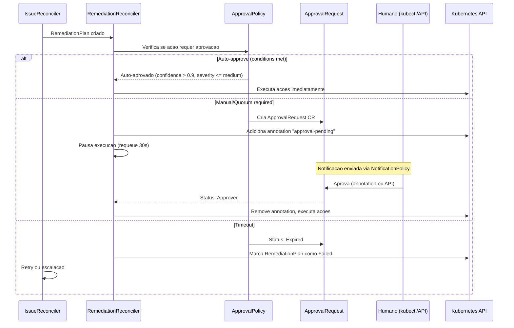

Em ambientes de producao, nem toda remediacao automatica deve ser executada sem supervisao humana. O sistema de **Approval Workflow** do ChatCLI permite definir politicas granulares que controlam quais acoes requerem aprovacao, quem pode aprovar, e em quais janelas de mudanca (change windows) as acoes sao permitidas.

---

## Por que Approval Workflows sao Essenciais

<CardGroup cols={3}>
  <Card title="Seguranca" icon="shield">
    Previne que remediacao automatica cause impacto maior que o problema original (ex: rollback acidental em producao)
  </Card>
  <Card title="Compliance" icon="file-certificate">
    Auditoria completa de quem aprovou, quando, e por que. Requisito para SOC2, PCI-DSS, HIPAA.
  </Card>
  <Card title="Confianca" icon="handshake">
    Equipes adotam AIOps mais facilmente quando sabem que acoes criticas requerem aprovacao humana.
  </Card>
</CardGroup>

Sem approval workflows, uma IA que detecta um falso positivo pode executar um rollback desnecessario, afetando um deployment saudavel. Com approval policies, acoes de alto impacto sao bloqueadas ate que um humano valide a analise e o blast radius.

---

## Visao Geral do Fluxo



---

## ApprovalPolicy CRD

O `ApprovalPolicy` define **regras** que determinam quais acoes de remediacao precisam de aprovacao, em quais condicoes, e quem pode aprovar.

```yaml
apiVersion: platform.chatcli.io/v1alpha1
kind: ApprovalPolicy
metadata:
  name: production-approval-policy
  namespace: production
spec:
  rules:
    - name: auto-approve-low-risk
      match:
        severities: [low, medium]
        actionTypes: [RestartDeployment, ScaleDeployment]
        namespaces: [staging, development]
      mode: auto
      autoApproveConditions:
        minConfidence: 0.85
        maxSeverity: medium
        historicalSuccessRate: 0.90

    - name: manual-approve-rollback
      match:
        actionTypes: [RollbackDeployment]
        namespaces: [production, payments]
      mode: manual
      requiredApprovers: 1
      timeoutMinutes: 30

    - name: quorum-critical-production
      match:
        severities: [critical, high]
        namespaces: [production]
        resourceKinds: [Deployment, StatefulSet]
      mode: quorum
      requiredApprovers: 2
      timeoutMinutes: 15
      approverGroups:
        - sre-team
        - platform-engineering

    - name: block-critical-namespace-rollback
      match:
        actionTypes: [RollbackDeployment]
        namespaces: [payments, auth]
        severities: [critical]
      mode: manual
      requiredApprovers: 2
      timeoutMinutes: 10
      approverGroups:
        - security-team
        - platform-leads

  changeWindow:
    timezone: "America/Sao_Paulo"
    allowedDays: [1, 2, 3, 4, 5]    # Segunda a Sexta
    startHour: 9
    endHour: 18
    overrideForCritical: true         # Critical ignora change window
    blackoutDates:
      - date: "2026-03-20"
        reason: "Congelamento pre-release Q1"
      - date: "2026-12-24"
        reason: "Vespera de Natal"
      - date: "2026-12-31"
        reason: "Vespera de Ano Novo"
```

### Campos do Spec

#### ApprovalRule

Cada regra define um par **match + mode** com configuracoes especificas.

| Campo | Tipo | Obrigatorio | Descricao |
|-------|------|:-----------:|-----------|
| `name` | string | **Sim** | Nome unico da regra dentro da policy |
| `match` | ApprovalMatch | **Sim** | Criterios de matching |
| `mode` | string | **Sim** | `auto`, `manual`, `quorum` |
| `requiredApprovers` | int | Para manual/quorum | Numero minimo de aprovadores |
| `timeoutMinutes` | int | Nao | Timeout em minutos (padrao: `60`) |
| `autoApproveConditions` | AutoApproveConditions | Para auto | Condicoes para auto-aprovacao |
| `approverGroups` | []string | Nao | Grupos que podem aprovar (quando vazio, qualquer usuario) |

#### ApprovalMatch

Define quais remediacoes sao cobertas por esta regra. A logica e **AND** entre campos e **OR** dentro de cada campo.

| Campo | Tipo | Descricao |
|-------|------|-----------|
| `severities` | []string | `critical`, `high`, `medium`, `low` |
| `actionTypes` | []string | `ScaleDeployment`, `RestartDeployment`, `RollbackDeployment`, `PatchConfig`, `AdjustResources`, `DeletePod`, `Custom` |
| `namespaces` | []string | Namespaces K8s afetados |
| `resourceKinds` | []string | `Deployment`, `StatefulSet`, `DaemonSet` |

<Note>
Quando multiplas regras fazem match, a regra **mais restritiva** prevalece. A ordem de prioridade e: `manual` > `quorum` > `auto`. Se uma regra exige `quorum` com 2 aprovadores e outra exige `manual` com 1, o sistema aplica `quorum` com 2.
</Note>

#### Tres Modos de Aprovacao

<Tabs>
  <Tab title="auto">
    **Auto-approve**: O sistema aprova automaticamente se **todas** as condicoes de `autoApproveConditions` forem atendidas. Caso contrario, escala para `manual`.

    | Condicao | Tipo | Descricao |
    |----------|------|-----------|
    | `minConfidence` | float64 | Confianca minima da analise de IA (0.0-1.0) |
    | `maxSeverity` | string | Severidade maxima para auto-approve |
    | `historicalSuccessRate` | float64 | Taxa minima de sucesso historico para este tipo de acao |

    ```yaml
    mode: auto
    autoApproveConditions:
      minConfidence: 0.90      # IA tem >= 90% de confianca
      maxSeverity: medium      # Ate severidade medium
      historicalSuccessRate: 0.85  # >= 85% de sucesso em acoes similares
    ```

    **Logica de avaliacao:**

    ```text
    auto_approve = (
      ai_confidence >= minConfidence AND
      severity <= maxSeverity AND
      historical_success_rate >= historicalSuccessRate
    )

    Se auto_approve = false -> escala para modo manual (1 approver)
    ```
  </Tab>
  <Tab title="manual">
    **Manual**: Requer aprovacao explicita de pelo menos `requiredApprovers` humanos. O RemediationPlan fica pausado ate a aprovacao ou timeout.

    ```yaml
    mode: manual
    requiredApprovers: 1
    timeoutMinutes: 30
    ```
  </Tab>
  <Tab title="quorum">
    **Quorum**: Requer aprovacao de `requiredApprovers` pessoas de grupos **diferentes** (se `approverGroups` definido). Garante que a aprovacao nao depende de um unico time.

    ```yaml
    mode: quorum
    requiredApprovers: 2
    approverGroups:
      - sre-team
      - platform-engineering
    timeoutMinutes: 15
    ```

    Neste exemplo, sao necessarios pelo menos 2 aprovadores, vindos de times diferentes (`sre-team` E `platform-engineering`).
  </Tab>
</Tabs>

#### ChangeWindowSpec

Define janelas de mudanca (change windows) que controlam **quando** remediacao automatica pode ser executada.

| Campo | Tipo | Obrigatorio | Descricao |
|-------|------|:-----------:|-----------|
| `timezone` | string | **Sim** | Timezone IANA (ex: `America/Sao_Paulo`) |
| `allowedDays` | []int | **Sim** | Dias permitidos (0=Domingo, 6=Sabado) |
| `startHour` | int | **Sim** | Hora de inicio da janela (0-23) |
| `endHour` | int | **Sim** | Hora de fim da janela (0-23) |
| `overrideForCritical` | bool | Nao | Se `true`, severidade `critical` ignora a change window |
| `blackoutDates` | []BlackoutDate | Nao | Datas especificas com congelamento total |

<Warning>
Quando fora da change window, acoes de remediacao ficam **enfileiradas** (nao descartadas). Elas serao executadas automaticamente quando a proxima janela abrir — desde que o Issue ainda esteja ativo e o approval nao tenha expirado.
</Warning>

---

## ApprovalRequest CRD

O `ApprovalRequest` e criado automaticamente pelo `RemediationReconciler` quando uma acao requer aprovacao. Contem todas as informacoes necessarias para o aprovador tomar uma decisao informada.

```yaml
apiVersion: platform.chatcli.io/v1alpha1
kind: ApprovalRequest
metadata:
  name: approve-api-gateway-rollback-1234
  namespace: production
  labels:
    platform.chatcli.io/issue: api-gateway-oom-kill-1771276354
    platform.chatcli.io/action-type: RollbackDeployment
    platform.chatcli.io/severity: critical
spec:
  issueRef:
    name: api-gateway-oom-kill-1771276354
  remediationPlanRef:
    name: api-gateway-oom-kill-plan-1
  requestedAction:
    type: RollbackDeployment
    params:
      toRevision: "previous"
  policyRef:
    name: production-approval-policy
    rule: manual-approve-rollback
  requiredApprovers: 1
  timeoutMinutes: 30

  blastRadius:
    affectedPods: 5
    affectedServices:
      - name: api-gateway
        namespace: production
        endpoints: 3
      - name: api-gateway-internal
        namespace: production
        endpoints: 2
    affectedIngresses:
      - name: api-gateway-ingress
        namespace: production
    riskLevel: high
    estimatedDowntime: "30s"
    rollbackAvailable: true

  evidence:
    aiConfidence: 0.87
    analysis: "High restart count caused by OOMKilled. Container memory limit (512Mi) insufficient."
    historicalSuccessRate: 0.92
    similarIncidents: 3
    lastSimilarResolution: "RollbackDeployment to revision 5 (2 days ago, success)"

status:
  state: Pending            # Pending | Approved | Rejected | Expired
  decisions: []
  createdAt: "2026-03-19T14:30:00Z"
  expiresAt: "2026-03-19T15:00:00Z"
```

### Campos do Spec

#### Raiz

| Campo | Tipo | Obrigatorio | Descricao |
|-------|------|:-----------:|-----------|
| `issueRef` | ObjectRef | **Sim** | Referencia ao Issue que originou o request |
| `remediationPlanRef` | ObjectRef | **Sim** | Referencia ao RemediationPlan pausado |
| `requestedAction` | ActionSpec | **Sim** | Acao que requer aprovacao |
| `policyRef` | PolicyRef | **Sim** | Referencia a policy e regra que disparou |
| `requiredApprovers` | int | **Sim** | Numero minimo de aprovadores |
| `timeoutMinutes` | int | **Sim** | Tempo ate expirar |
| `blastRadius` | BlastRadiusAssessment | **Sim** | Avaliacao de impacto |
| `evidence` | ApprovalEvidence | **Sim** | Evidencias para tomada de decisao |

#### BlastRadiusAssessment

| Campo | Tipo | Descricao |
|-------|------|-----------|
| `affectedPods` | int | Numero de pods que serao afetados pela acao |
| `affectedServices` | []ServiceRef | Services que roteiam para os pods afetados |
| `affectedIngresses` | []IngressRef | Ingresses que expoe os services afetados |
| `riskLevel` | string | `critical`, `high`, `medium`, `low` (calculado) |
| `estimatedDowntime` | string | Estimativa de downtime durante a acao |
| `rollbackAvailable` | bool | Se a acao pode ser revertida |

#### ApprovalEvidence

| Campo | Tipo | Descricao |
|-------|------|-----------|
| `aiConfidence` | float64 | Nivel de confianca da analise da IA (0.0-1.0) |
| `analysis` | string | Resumo da analise da IA |
| `historicalSuccessRate` | float64 | Taxa de sucesso de acoes similares no historico |
| `similarIncidents` | int | Numero de incidentes similares no passado |
| `lastSimilarResolution` | string | Descricao da ultima resolucao similar |

#### ApprovalDecision

Cada aprovacao ou rejeicao e registrada como uma decision no status:

| Campo | Tipo | Descricao |
|-------|------|-----------|
| `approver` | string | Identificador do aprovador (usuario ou sistema) |
| `decision` | string | `approved` ou `rejected` |
| `reason` | string | Justificativa para a decisao |
| `timestamp` | Time | Quando a decisao foi feita |

#### Estados do ApprovalRequest


<Info>
Uma unica rejeicao e suficiente para bloquear a acao, independente do numero de aprovacoes. Isso garante que qualquer membro da equipe pode vetar uma acao de risco.
</Info>

---

## Blast Radius Calculator

O blast radius calculator avalia o impacto potencial de uma acao de remediacao antes de solicitar aprovacao.

### Como Funciona

<Steps>
  <Step title="Consulta pods do deployment">
    O calculator lista todos os pods gerenciados pelo deployment alvo usando label selectors.

    ```text
    pods = kubectl get pods -l app=api-gateway -n production
    affectedPods = len(pods)  // ex: 5
    ```
  </Step>
  <Step title="Encontra services que roteiam para os pods">
    Para cada Service no namespace, verifica se o selector faz match com as labels dos pods do deployment.

    ```text
    for service in namespace.services:
      if service.selector matches pod.labels:
        affectedServices.append(service)
    ```
  </Step>
  <Step title="Encontra ingresses que expoe os services">
    Para cada Ingress no namespace, verifica se referencia algum dos services afetados.

    ```text
    for ingress in namespace.ingresses:
      for rule in ingress.rules:
        if rule.backend.service in affectedServices:
          affectedIngresses.append(ingress)
    ```
  </Step>
  <Step title="Calcula risk level">
    O risk level e determinado pelo numero de pods afetados:

    ```text
    if affectedPods > 10:  riskLevel = "critical"
    if affectedPods > 5:   riskLevel = "high"
    if affectedPods > 2:   riskLevel = "medium"
    else:                  riskLevel = "low"
    ```
  </Step>
  <Step title="Estima downtime">
    Com base no tipo de acao:

    | Acao | Downtime Estimado |
    |------|------------------|
    | `ScaleDeployment` (up) | 0s (nenhum pod removido) |
    | `RestartDeployment` | ~30s (rolling update) |
    | `RollbackDeployment` | ~30-60s (rolling update) |
    | `AdjustResources` | ~30s (rolling update) |
    | `DeletePod` | ~10s (recreacao pelo ReplicaSet) |
    | `PatchConfig` | 0s (sem restart) |
  </Step>
</Steps>

---

## Integracao com RemediationReconciler

### Fluxo Completo


### Annotation de Controle

O `RemediationReconciler` usa a annotation `platform.chatcli.io/approval-pending` para controlar o fluxo:

```yaml
metadata:
  annotations:
    platform.chatcli.io/approval-pending: "approve-api-gateway-rollback-1234"
```

Quando esta annotation esta presente:
1. O reconciler **nao executa nenhuma acao**
2. Consulta o status do `ApprovalRequest` referenciado
3. Remove a annotation apenas quando o request e `Approved`
4. Se `Rejected` ou `Expired`, marca o plan como `Failed`

---

## Como Aprovar

### Via kubectl

A maneira mais direta de aprovar e usando annotations:

```bash
# Aprovar
kubectl annotate approvalrequest approve-api-gateway-rollback-1234 \
  -n production \
  platform.chatcli.io/approve="edilson:LGTM, blast radius aceitavel"

# Rejeitar
kubectl annotate approvalrequest approve-api-gateway-rollback-1234 \
  -n production \
  platform.chatcli.io/reject="edilson:Risk too high, investigate memory leak first"
```

**Formato da annotation:**

```text
platform.chatcli.io/approve="<usuario>:<motivo>"
platform.chatcli.io/reject="<usuario>:<motivo>"
```

O reconciler do `ApprovalRequest` detecta a annotation, registra a decision no status, e remove a annotation.

### Via REST API

O operator expoe uma API REST para integracoes:

<CodeGroup>

```bash Aprovar
curl -X POST \
  http://localhost:8090/api/v1/approvals/approve-api-gateway-rollback-1234/approve \
  -H "Content-Type: application/json" \
  -H "Authorization: Bearer $TOKEN" \
  -d '{
    "approver": "edilson",
    "reason": "LGTM, blast radius aceitavel. AI confidence 87% com historico de sucesso."
  }'
```

```bash Rejeitar
curl -X POST \
  http://localhost:8090/api/v1/approvals/approve-api-gateway-rollback-1234/reject \
  -H "Content-Type: application/json" \
  -H "Authorization: Bearer $TOKEN" \
  -d '{
    "approver": "edilson",
    "reason": "Risk too high. Investigar memory leak antes de rollback."
  }'
```

```bash Listar pendentes
curl -X GET \
  http://localhost:8090/api/v1/approvals?state=Pending \
  -H "Authorization: Bearer $TOKEN"
```

```bash Detalhes
curl -X GET \
  http://localhost:8090/api/v1/approvals/approve-api-gateway-rollback-1234 \
  -H "Authorization: Bearer $TOKEN"
```

</CodeGroup>

**Resposta da API (exemplo):**

```json
{
  "name": "approve-api-gateway-rollback-1234",
  "namespace": "production",
  "state": "Approved",
  "requestedAction": {
    "type": "RollbackDeployment",
    "params": {"toRevision": "previous"}
  },
  "blastRadius": {
    "affectedPods": 5,
    "riskLevel": "high"
  },
  "decisions": [
    {
      "approver": "edilson",
      "decision": "approved",
      "reason": "LGTM, blast radius aceitavel",
      "timestamp": "2026-03-19T14:35:00Z"
    }
  ]
}
```

### Via Slack (interativo)

Quando integrado com o canal Slack via `NotificationPolicy`, o ApprovalRequest inclui botoes interativos no Block Kit:

- **Approve**: Registra aprovacao com o usuario Slack como aprovador
- **Reject**: Abre dialog para motivo de rejeicao
- **Details**: Expande blast radius e evidencias da IA

<Note>
A integracao Slack interativa requer configuracao adicional de um Slack App com Interactive Components habilitado e endpoint de callback apontando para o operator.
</Note>

---

## Exemplos YAML Completos

### Auto-approve para Low Severity + High Confidence

```yaml
apiVersion: platform.chatcli.io/v1alpha1
kind: ApprovalPolicy
metadata:
  name: staging-auto-approve
  namespace: staging
spec:
  rules:
    - name: auto-approve-all-staging
      match:
        severities: [low, medium]
        actionTypes:
          - RestartDeployment
          - ScaleDeployment
          - AdjustResources
          - DeletePod
        namespaces: [staging]
      mode: auto
      autoApproveConditions:
        minConfidence: 0.80
        maxSeverity: medium
        historicalSuccessRate: 0.75

    - name: manual-for-rollback-staging
      match:
        actionTypes: [RollbackDeployment]
        namespaces: [staging]
      mode: manual
      requiredApprovers: 1
      timeoutMinutes: 60

  changeWindow:
    timezone: "America/Sao_Paulo"
    allowedDays: [0, 1, 2, 3, 4, 5, 6]   # Todos os dias
    startHour: 0
    endHour: 23
```

### Quorum de 2 Approvers para Producao

```yaml
apiVersion: platform.chatcli.io/v1alpha1
kind: ApprovalPolicy
metadata:
  name: production-strict
  namespace: production
spec:
  rules:
    - name: quorum-all-production-actions
      match:
        severities: [critical, high, medium]
        namespaces: [production]
      mode: quorum
      requiredApprovers: 2
      timeoutMinutes: 15
      approverGroups:
        - sre-team
        - platform-engineering
        - service-owners

    - name: auto-low-severity-restart
      match:
        severities: [low]
        actionTypes: [RestartDeployment]
        namespaces: [production]
      mode: auto
      autoApproveConditions:
        minConfidence: 0.95
        maxSeverity: low
        historicalSuccessRate: 0.98

  changeWindow:
    timezone: "America/Sao_Paulo"
    allowedDays: [1, 2, 3, 4, 5]
    startHour: 9
    endHour: 18
    overrideForCritical: true
```

### Change Window Weekdays 9-18 UTC

```yaml
apiVersion: platform.chatcli.io/v1alpha1
kind: ApprovalPolicy
metadata:
  name: change-window-policy
  namespace: production
spec:
  rules:
    - name: all-actions-require-approval
      match:
        namespaces: [production]
      mode: manual
      requiredApprovers: 1
      timeoutMinutes: 120

  changeWindow:
    timezone: "UTC"
    allowedDays: [1, 2, 3, 4, 5]    # Monday to Friday
    startHour: 9
    endHour: 18
    overrideForCritical: true
    blackoutDates:
      - date: "2026-03-27"
        reason: "End of Q1 freeze"
      - date: "2026-03-28"
        reason: "End of Q1 freeze"
      - date: "2026-06-30"
        reason: "End of Q2 freeze"
```

<Tip>
Use `overrideForCritical: true` para permitir que incidentes `critical` sejam remediados fora da change window. Sem isso, um incidente critico as 3h da manha ficara enfileirado ate as 9h.
</Tip>

### Bloqueio de RollbackDeployment em Namespaces Criticos

```yaml
apiVersion: platform.chatcli.io/v1alpha1
kind: ApprovalPolicy
metadata:
  name: critical-namespace-protection
  namespace: payments
spec:
  rules:
    - name: block-rollback-payments
      match:
        actionTypes: [RollbackDeployment]
        namespaces: [payments, auth, billing]
      mode: quorum
      requiredApprovers: 2
      timeoutMinutes: 10
      approverGroups:
        - security-team
        - payments-team-leads

    - name: block-delete-pod-payments
      match:
        actionTypes: [DeletePod]
        namespaces: [payments]
      mode: manual
      requiredApprovers: 1
      timeoutMinutes: 15
      approverGroups:
        - payments-sre

    - name: auto-scale-only
      match:
        actionTypes: [ScaleDeployment]
        namespaces: [payments]
      mode: auto
      autoApproveConditions:
        minConfidence: 0.90
        maxSeverity: high
        historicalSuccessRate: 0.95

  changeWindow:
    timezone: "America/Sao_Paulo"
    allowedDays: [1, 2, 3, 4]    # Seg-Qui (sem sexta para freeze pre-fim-de-semana)
    startHour: 10
    endHour: 16
    overrideForCritical: true
    blackoutDates:
      - date: "2026-03-31"
        reason: "Fechamento mensal"
      - date: "2026-04-30"
        reason: "Fechamento mensal"
```

---

## Auditoria e Compliance

Todas as decisoes de aprovacao sao registradas no status do `ApprovalRequest` CR, criando um trail de auditoria completo:

```bash
# Ver historico de aprovacoes
kubectl get approvalrequests -n production \
  -o custom-columns=NAME:.metadata.name,STATE:.status.state,APPROVER:.status.decisions[0].approver,REASON:.status.decisions[0].reason,TIME:.status.decisions[0].timestamp

# Output:
# NAME                                  STATE      APPROVER   REASON              TIME
# approve-api-gw-rollback-1234          Approved   edilson    LGTM                2026-03-19T14:35:00Z
# approve-worker-scale-5678             Approved   system     Auto-approved       2026-03-19T15:00:00Z
# approve-payment-restart-9012          Rejected   maria      Risk too high       2026-03-19T15:30:00Z
# approve-auth-rollback-3456            Expired    -          Timeout (15min)     2026-03-19T16:00:00Z
```

Para compliance SOC2 e PCI-DSS, exporte os ApprovalRequests periodicamente:

```bash
kubectl get approvalrequests -A -o json | jq '.items[] | {
  name: .metadata.name,
  namespace: .metadata.namespace,
  action: .spec.requestedAction.type,
  state: .status.state,
  decisions: .status.decisions,
  blastRadius: .spec.blastRadius.riskLevel,
  created: .status.createdAt
}' > approval-audit-$(date +%Y%m%d).json
```

---

## Prometheus Metrics

O sistema de approval workflow expoe metricas para monitoramento:

| Metrica | Tipo | Labels | Descricao |
|---------|------|--------|-----------|
| `chatcli_approvals_total` | Counter | `policy`, `rule`, `namespace`, `decision` | Total de aprovacoes por decision (approved/rejected/expired/auto) |
| `chatcli_approval_duration_seconds` | Histogram | `policy`, `rule`, `decision` | Tempo entre criacao do request e decisao |
| `chatcli_approvals_pending` | Gauge | `policy`, `namespace` | Numero de ApprovalRequests pendentes |
| `chatcli_approval_auto_approved_total` | Counter | `policy`, `rule`, `namespace` | Total de auto-aprovacoes |
| `chatcli_approval_auto_escalated_total` | Counter | `policy`, `rule`, `namespace` | Auto-approve que escalou para manual |
| `chatcli_approval_blast_radius_pods` | Histogram | `namespace`, `action_type` | Distribuicao de pods afetados nos requests |
| `chatcli_change_window_blocked_total` | Counter | `policy`, `namespace` | Acoes bloqueadas por change window |

**Alertas Prometheus recomendados:**

```yaml
groups:
  - name: chatcli-approvals
    rules:
      - alert: ApprovalRequestPendingTooLong
        expr: chatcli_approvals_pending > 0 and time() - chatcli_approval_created_timestamp > 600
        for: 1m
        labels:
          severity: warning
        annotations:
          summary: "ApprovalRequest pendente ha mais de 10 minutos"
          description: "{{ $labels.policy }}/{{ $labels.namespace }} tem requests aguardando aprovacao"

      - alert: HighRejectionRate
        expr: rate(chatcli_approvals_total{decision="rejected"}[1h]) / rate(chatcli_approvals_total[1h]) > 0.3
        for: 30m
        labels:
          severity: warning
        annotations:
          summary: "Taxa de rejeicao de aprovacoes acima de 30%"
          description: "Pode indicar falsos positivos na analise de IA ou politica muito permissiva"

      - alert: ApprovalTimeoutRate
        expr: rate(chatcli_approvals_total{decision="expired"}[1h]) > 0.1
        for: 1h
        labels:
          severity: warning
        annotations:
          summary: "Aprovacoes expirando por timeout"
          description: "Equipes podem nao estar recebendo notificacoes ou timeouts estao curtos demais"
```

---

## Proximo Passo

<CardGroup cols={2}>
  <Card title="Notificacoes e Escalacao" icon="bell" href="/features/aiops/notifications">
    Sistema de notificacoes multi-canal e politicas de escalacao
  </Card>
  <Card title="SLOs e SLAs" icon="gauge-high" href="/features/aiops/slo-sla">
    Gestao de Service Level Objectives com burn rate alerting
  </Card>
  <Card title="AIOps Platform" icon="brain" href="/features/aiops-platform">
    Deep-dive na arquitetura AIOps completa
  </Card>
  <Card title="K8s Operator" icon="dharmachakra" href="/features/k8s-operator">
    Configuracao e CRDs do operator
  </Card>
</CardGroup>
