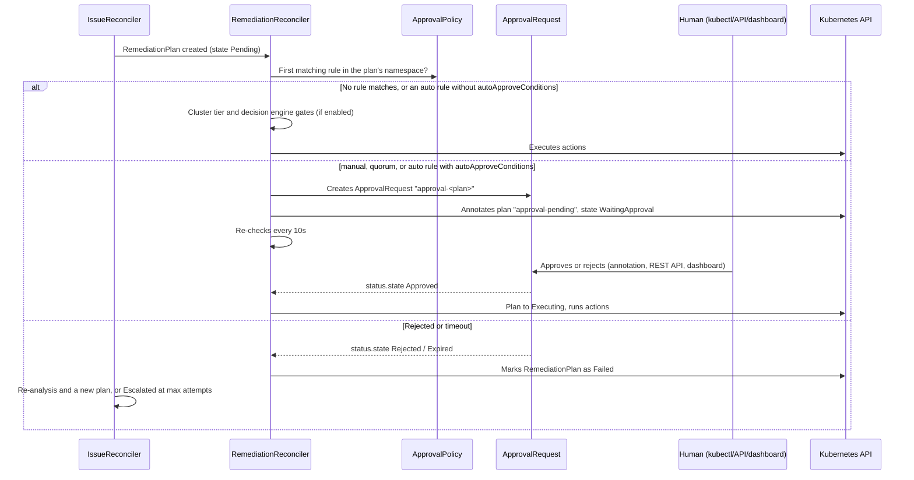
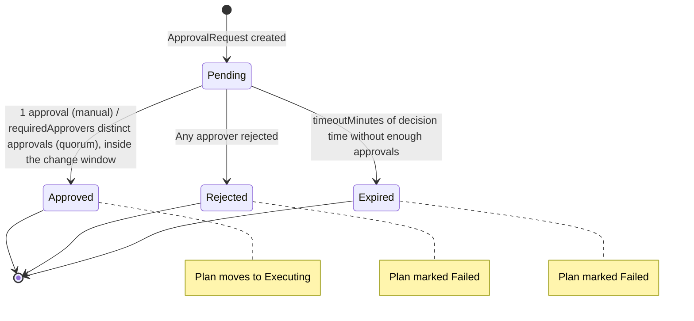
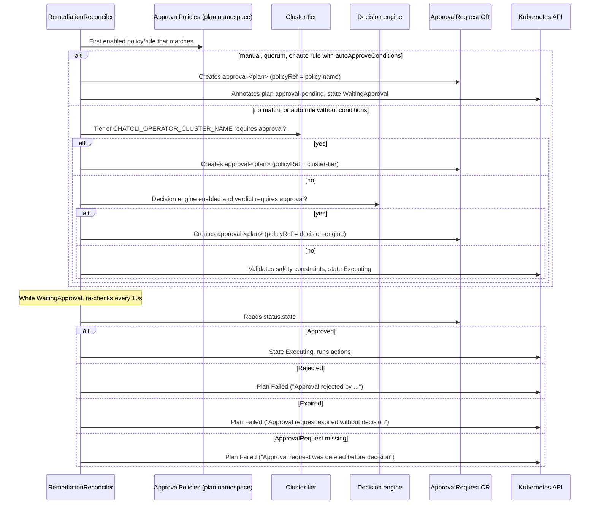

In production environments, not every automatic remediation should be executed without human oversight. The ChatCLI **Approval Workflow** lets you define policies that control which remediation plans must wait for a human, how many approvals they need, and during which change windows a decision can be applied.


## Why Approval Workflows are Essential

<CardGroup cols={3}>
  <Card title="Security" icon="shield">
    Prevents automatic remediation from causing greater impact than the original problem (e.g., accidental rollback in production)
  </Card>
  <Card title="Compliance" icon="file-certificate">
    Every request, decision and expiry is kept on the `ApprovalRequest` CR and recorded as an `AuditEvent`.
  </Card>
  <Card title="Trust" icon="handshake">
    Teams adopt AIOps more easily when they know that critical actions require human approval.
  </Card>
</CardGroup>

Without approval workflows, an AI that detects a false positive could execute an unnecessary rollback, affecting a healthy deployment. With approval policies, high-impact plans are parked until a human validates the analysis and blast radius.


## Flow Overview


```mermaid
sequenceDiagram
    participant IR as IssueReconciler
    participant RR as RemediationReconciler
    participant AP as ApprovalPolicy
    participant AR as ApprovalRequest
    participant H as Human (kubectl/API/dashboard)
    participant K8s as Kubernetes API

    IR->>RR: RemediationPlan created (state Pending)
    RR->>AP: First matching rule in the plan's namespace?

    alt No rule matches, or an auto rule without autoApproveConditions
        RR->>RR: Cluster tier and decision engine gates (if enabled)
        RR->>K8s: Executes actions
    else manual, quorum, or auto rule with autoApproveConditions
        RR->>AR: Creates ApprovalRequest "approval-<plan>"
        RR->>K8s: Annotates plan "approval-pending", state WaitingApproval
        RR->>RR: Re-checks every 10s

        H->>AR: Approves or rejects (annotation, REST API, dashboard)
        AR-->>RR: status.state Approved
        RR->>K8s: Plan to Executing, runs actions
    else Rejected or timeout
        AR-->>RR: status.state Rejected / Expired
        RR->>K8s: Marks RemediationPlan as Failed
        IR->>IR: Re-analysis and a new plan, or Escalated at max attempts
    end
```

<Note>
The operator does **not** send a notification when an ApprovalRequest is created. NotificationPolicies are driven by Issue state changes, not by approval requests. Watch `kubectl get approvalrequests -A`, the web dashboard, or alert on the metrics below to know a request is waiting.
</Note>


## ApprovalPolicy CRD

The `ApprovalPolicy` (short name `ap`) defines **rules** that decide which remediation plans need approval and how that approval is obtained. It only applies to plans in **its own namespace**: the operator lists the enabled ApprovalPolicies in the namespace of the RemediationPlan (the namespace of the Issue), never across namespaces.

```yaml
apiVersion: platform.chatcli.io/v1alpha1
kind: ApprovalPolicy
metadata:
  name: production-approval-policy
  namespace: production
spec:
  enabled: true
  rules:
    - name: quorum-critical-production
      match:
        severities: [critical, high]
        resourceKinds: [Deployment, StatefulSet]
      mode: quorum
      requiredApprovers: 2
      timeoutMinutes: 15

    - name: manual-approve-rollback
      match:
        actionTypes: [RollbackDeployment, HelmRollback]
      mode: manual
      timeoutMinutes: 30
      changeWindow:
        timezone: "America/Sao_Paulo"
        allowedDays: [Monday, Tuesday, Wednesday, Thursday, Friday]
        startHour: 9
        endHour: 18

    - name: restarts-without-approval
      match:
        severities: [low, medium]
        actionTypes: [RestartDeployment, ScaleDeployment]
      mode: auto
```

### Spec Fields

| Field | Type | Required | Description |
|-------|------|:--------:|-------------|
| `rules` | []ApprovalRule | **Yes** | Evaluated top to bottom; the first rule that matches wins |
| `enabled` | bool | No (default `true`) | Disabled policies are skipped |
| `defaultMode` | string | No (default `manual`) | Informational: shown in `kubectl get ap`, but **not applied by the operator**. When no rule matches, the policy does not gate the plan; end the rules with a catch-all rule (`match: {}`) to gate everything else |

#### ApprovalRule

Each rule defines a **match + mode** pair with specific configurations.

| Field | Type | Required | Description |
|-------|------|:--------:|-------------|
| `name` | string | **Yes** | Rule name, copied to the request as `spec.ruleName` |
| `match` | ApprovalMatch | **Yes** | Matching criteria |
| `mode` | string | **Yes** (default `manual`) | `auto`, `manual`, `quorum` |
| `requiredApprovers` | int | No (default `1`) | Distinct approvers needed in `quorum` mode (ignored by `manual`) |
| `timeoutMinutes` | int | No (default `30`) | Minutes the request may wait for a decision before it expires (with a `changeWindow`, only time while the window is open counts) |
| `changeWindow` | ChangeWindowSpec | No | When a decision on this rule's requests may be applied |
| `autoApproveConditions` | AutoApproveConditions | No | `auto` mode only: the plan waits and is approved automatically when every condition holds (see the `auto` tab below) |

#### ApprovalMatch

Defines which remediations are covered by this rule. The logic is **AND** between fields and **OR** within each field. An empty field matches everything, so a rule with an empty `match` matches every plan.

| Field | Type | Matched against |
|-------|------|-----------------|
| `severities` | []string | Issue `spec.severity`: `critical`, `high`, `medium`, `low` |
| `actionTypes` | []string | Matches if **any** action of the plan has one of these types. Any value of the RemediationPlan action enum, e.g. `ScaleDeployment`, `RestartDeployment`, `RollbackDeployment`, `PatchConfig`, `AdjustResources`, `DeletePod`, `HelmRollback`, `ArgoSyncApp`, `DrainNode`, `ApplyManifest`, `RestartStatefulSet`, `RetryJob`, `SuspendCronJob`, `Custom` (see the [K8s Operator](/features/k8s-operator) page for the full list) |
| `namespaces` | []string | Issue `spec.resource.namespace` |
| `resourceKinds` | []string | Issue `spec.resource.kind`, case-insensitive (e.g. `Deployment`, `StatefulSet`, `DaemonSet`, `Job`, `CronJob`) |

<Note>
There is no "most restrictive rule wins" merging. Within a policy the **first matching rule** is used and the rest are ignored, so put the strict rules first. If several enabled ApprovalPolicies exist in the same namespace, the order in which they are evaluated is not guaranteed; keep one policy per namespace, or make their matches disjoint.
</Note>

#### Three Approval Modes

<Tabs>
  <Tab title="auto">
    **Auto**: a matching `auto` rule **without** `autoApproveConditions` means "this plan does not need approval from the policy". No ApprovalRequest is created and the plan proceeds (the cluster tier and the decision engine, when enabled, still evaluate it).

    Because the first match wins, an `auto` rule also shadows every rule below it for the plans it matches.

    With `autoApproveConditions`, the rule parks the plan in an ApprovalRequest, and the approval controller approves it automatically (`status.autoApproved: true`, decision by `auto-policy`) only when **all** conditions hold. Otherwise the request waits for a human decision like a `manual` rule, and still expires on `timeoutMinutes`:

    | Condition | Type | Description |
    |-----------|------|-------------|
    | `minConfidence` | float64 | Minimum AIInsight confidence (0.0-1.0) |
    | `maxSeverity` | string | Maximum Issue severity (`low` < `medium` < `high` < `critical`); an Issue whose severity cannot be read does not meet it |
    | `historicalSuccessRate` | float64 | Minimum success rate of the same action types in this namespace (0.0-1.0) |

    ```yaml
    mode: auto
    autoApproveConditions:
      minConfidence: 0.85
      maxSeverity: medium
      historicalSuccessRate: 0.8
    timeoutMinutes: 30
    ```

    The confidence comes from the Issue's AIInsight; a missing AIInsight counts as confidence `0`, so the conditions are not met and a human decides.
  </Tab>
  <Tab title="manual">
    **Manual**: the plan waits until **one** human approves or rejects it, or the request times out. `requiredApprovers` is ignored in this mode: the first approval approves the request.

    ```yaml
    mode: manual
    timeoutMinutes: 30
    ```
  </Tab>
  <Tab title="quorum">
    **Quorum**: requires `requiredApprovers` approvals from distinct approvers. Any single rejection rejects the request.

    ```yaml
    mode: quorum
    requiredApprovers: 2
    timeoutMinutes: 15
    ```

    In this example, two approvals from different approvers are needed for the plan to run.

    <Warning>
    Each approver counts once. Annotation approvers are counted by name, case-insensitively; the name is free text and is not verified against the Kubernetes user who wrote it, so the real control is who has RBAC to update `approvalrequests`. REST API and dashboard approvers are counted by **API key**: a shared key, or dev mode, cannot satisfy `requiredApprovers: 2`, so give each approver their own key (see [Via REST API](#via-rest-api)).
    </Warning>
  </Tab>
</Tabs>

#### ChangeWindowSpec

A change window is set **per rule** (`rules[].changeWindow`), not at the policy level. It only affects requests raised by that rule.

| Field | Type | Required | Description |
|-------|------|:--------:|-------------|
| `timezone` | string | No (default `UTC`) | IANA timezone (e.g., `America/Sao_Paulo`) |
| `allowedDays` | []string | No (default Monday to Friday) | Day names in English, case-insensitive: `Monday` ... `Sunday` |
| `startHour` | int | **Yes** | Window start hour (0-23, inclusive) |
| `endHour` | int | **Yes** | Window end hour (0-23, **exclusive**). If `startHour > endHour` the window spans midnight (e.g. 22 to 6) |

There are no blackout dates and no override for critical severity.

The window controls when an approval **takes effect**, whatever channel the decision came from (annotation, REST API or dashboard):

- Decisions are recorded at any time, and a rejection takes effect immediately.
- The timeout clock only runs while the window is open, so a request raised at night keeps its full `timeoutMinutes` for when the approvers can act on it.
- A request that already has the approvals it needs and waits only for the window does not expire. It carries the condition `ChangeWindow=False` (reason `OutsideChangeWindow`) and turns `Approved` when the window opens (re-checked every minute); approvals inside the window set `ChangeWindow=True` (`WithinChangeWindow`).

<Warning>
A window that can never open (an unknown `timezone`, no valid day in `allowedDays`, or `startHour` equal to `endHour`) is logged, blocks approval, and the request expires on wall-clock time.
</Warning>


## ApprovalRequest CRD

The `ApprovalRequest` (short name `ar`) is created by the `RemediationReconciler` when a plan must wait. Its name is always `approval-<plan-name>`, it lives in the plan's namespace, and it is owned by the RemediationPlan (deleting the plan deletes it).

```yaml
apiVersion: platform.chatcli.io/v1alpha1
kind: ApprovalRequest
metadata:
  name: approval-api-gateway-oom-kill-1771276354-plan-1
  namespace: production
  labels:
    platform.chatcli.io/issue: api-gateway-oom-kill-1771276354
    platform.chatcli.io/remediation-plan: api-gateway-oom-kill-1771276354-plan-1
    platform.chatcli.io/policy: production-approval-policy
  annotations:
    # Added by the approval controller (advisory prediction, see Blast Radius)
    platform.chatcli.io/blast-risk-level: medium
spec:
  issueRef:
    name: api-gateway-oom-kill-1771276354
  remediationPlanRef: api-gateway-oom-kill-1771276354-plan-1
  policyRef: production-approval-policy
  ruleName: manual-approve-rollback
  requester: chatcli-operator
  requestedActions:
    - type: RollbackDeployment
      params:
        toRevision: "previous"
  requiredApprovers: 1
  timeoutMinutes: 30
  blastRadius:
    affectedPods: 5
    affectedServices: 2
    affectedNamespaces: [production]
    riskLevel: medium
    description: "Medium blast radius: 5 pods and 2 services affected"
  evidence:
    aiConfidence: 0.87
    aiAnalysis: "High restart count caused by OOMKilled. Container memory limit (512Mi) insufficient."
    historicalSuccessRate: 0.92
    previousAttempts: 12
status:
  state: Pending            # Pending | Approved | Rejected | Expired
  autoApproved: false
```

### Spec Fields

#### Root

| Field | Type | Description |
|-------|------|-------------|
| `issueRef.name` | string | Issue that originated the plan |
| `remediationPlanRef` | string | Name of the parked RemediationPlan |
| `policyRef` | string | ApprovalPolicy name, or `decision-engine` / `cluster-tier` for [synthetic requests](#requests-without-an-approvalpolicy) |
| `ruleName` | string | Rule that matched |
| `requestedActions` | []RemediationAction | All actions of the plan (`type`, `params`) |
| `requester` | string | Always `chatcli-operator` for operator-created requests |
| `requiredApprovers` | int | Copied from the rule (default `1`) |
| `timeoutMinutes` | int | Copied from the rule (default `30`) |
| `blastRadius` | BlastRadiusAssessment | Impact assessment computed at creation |
| `evidence` | ApprovalEvidence | Evidence for the decision |

#### BlastRadiusAssessment

| Field | Type | Description |
|-------|------|-------------|
| `affectedPods` | int | Pods of the target workload |
| `affectedServices` | int | Number of Services whose selector matches the pod template |
| `affectedNamespaces` | []string | The target's namespace |
| `riskLevel` | string | `low`, `medium`, `high`, `critical` (or `unknown` if the calculation failed) |
| `description` | string | Human-readable summary |

#### ApprovalEvidence

| Field | Type | Description |
|-------|------|-------------|
| `aiConfidence` | float64 | Confidence of the Issue's AIInsight (0.0-1.0); `0` if the insight was not found |
| `aiAnalysis` | string | AIInsight analysis text |
| `historicalSuccessRate` | float64 | Share of finished plans in this namespace, sharing an action type with this plan, that ended `Completed` (vs `Failed`/`RolledBack`); `0` when there is no history |
| `previousAttempts` | int | Sample size of that rate (finished plans sharing an action type, counted once per matching action), not the attempt number of this Issue |
| `preflightSnapshot` | string | Defined in the CRD, not filled by the operator |

#### Status

| Field | Description |
|-------|-------------|
| `state` | `Pending`, `Approved`, `Rejected`, `Expired` |
| `decisions[]` | `approver`, `decision` (`approved`/`rejected`), `reason`, `timestamp`, recorded for every decision (annotation, REST API, dashboard, and `auto-policy` for automatic approvals) |
| `approvedAt`, `rejectedAt`, `expiredAt` | Transition timestamps |
| `autoApproved` | `true` only when an `auto` rule's conditions approved it |
| `conditions[]` | `ChangeWindow` condition on requests whose rule has a change window (`WithinChangeWindow` / `OutsideChangeWindow`) |

#### ApprovalRequest States


```mermaid
stateDiagram-v2
    [*] --> Pending : ApprovalRequest created
    Pending --> Approved : 1 approval (manual) / requiredApprovers distinct approvals (quorum), inside the change window
    Pending --> Rejected : Any approver rejected
    Pending --> Expired : timeoutMinutes of decision time without enough approvals
    Approved --> [*]
    Rejected --> [*]
    Expired --> [*]

    note right of Approved : Plan moves to Executing
    note right of Rejected : Plan marked Failed
    note right of Expired : Plan marked Failed
```

<Info>
A single rejection is sufficient to block the plan, regardless of the number of approvals. A rejected or expired plan counts as a failed remediation attempt: the Issue goes back to `Analyzing` for a new plan while attempts remain (which may raise a new ApprovalRequest), and becomes `Escalated` when the maximum is reached. Deleting the ApprovalRequest before a decision also fails the plan; it never lets it run.
</Info>


## Blast Radius Calculator

Two calculations run, both informational: neither one blocks a plan on its own.

### How It Works

<Steps>
  <Step title="Assessment stored in the spec (at request creation)">
    For a `Deployment` target, the calculator counts the pods matching the Deployment selector (falling back to `spec.replicas` when none are found) and the Services in the namespace whose selector matches the pod template labels. For other kinds it counts the pods in the namespace that have an owner reference with the target's name, and reports `0` services.
  </Step>
  <Step title="Risk level from the pod count">
    ```text
    if affectedPods > 10:  riskLevel = "critical"
    elif affectedPods > 5: riskLevel = "high"
    elif affectedPods > 2: riskLevel = "medium"
    else:                  riskLevel = "low"
    ```
  </Step>
  <Step title="Adjustment by action type">
    A `RollbackDeployment` action raises `low` to `medium`. A `Custom` action raises `low` or `medium` to `high`. Other action types do not change the level. Ingresses and estimated downtime are not computed.
  </Step>
  <Step title="Prediction annotations (approval controller)">
    While the request is `Pending`, the approval controller runs the blast radius predictor on the **first** action of the plan (PodDisruptionBudget, ResourceQuota, node capacity and affected Services checks) and stores the result in two annotations on the ApprovalRequest: `platform.chatcli.io/blast-radius` (text summary) and `platform.chatcli.io/blast-risk-level`. This happens once per request. The REST API returns the request's annotations, so the dashboard's approval card shows the risk level as a badge.
  </Step>
</Steps>


## Integration with RemediationReconciler

### Complete Flow

When a RemediationPlan is `Pending`, the RemediationReconciler runs three gates in order. The first one that parks the plan wins; the next ones are skipped.


```mermaid
sequenceDiagram
    participant RR as RemediationReconciler
    participant AP as ApprovalPolicies (plan namespace)
    participant CT as Cluster tier
    participant DE as Decision engine
    participant AReq as ApprovalRequest CR
    participant K8s as Kubernetes API

    RR->>AP: First enabled policy/rule that matches
    alt manual, quorum, or auto rule with autoApproveConditions
        RR->>AReq: Creates approval-<plan> (policyRef = policy name)
        RR->>K8s: Annotates plan approval-pending, state WaitingApproval
    else no match, or auto rule without conditions
        RR->>CT: Tier of CHATCLI_OPERATOR_CLUSTER_NAME requires approval?
        alt yes
            RR->>AReq: Creates approval-<plan> (policyRef = cluster-tier)
        else no
            RR->>DE: Decision engine enabled and verdict requires approval?
            alt yes
                RR->>AReq: Creates approval-<plan> (policyRef = decision-engine)
            else no
                RR->>K8s: Validates safety constraints, state Executing
            end
        end
    end

    Note over RR: While WaitingApproval, re-checks every 10s
    RR->>AReq: Reads status.state
    alt Approved
        RR->>K8s: State Executing, runs actions
    else Rejected
        RR->>K8s: Plan Failed ("Approval rejected by ...")
    else Expired
        RR->>K8s: Plan Failed ("Approval request expired without decision")
    else ApprovalRequest missing
        RR->>K8s: Plan Failed ("Approval request was deleted before decision")
    end
```

The gate **fails closed**. If the Issue, the AIInsight or the ApprovalPolicies cannot be read, or the decision engine returns an error, the plan stays `Pending`, a Warning Event `ApprovalGateUnavailable` is recorded on it, and the reconcile is retried with backoff; the plan never runs because a gate errored. If creating the ApprovalRequest or annotating the plan fails, the plan also stays `Pending` and is retried. An ApprovalRequest that already exists with the same name is reused rather than skipped.

A plan whose parent Issue no longer exists fails ("Parent issue not found; approval policies cannot be evaluated without it") instead of running ungated. A missing AIInsight is not an error: the evidence carries confidence `0`, which only makes auto-approval conditions and the decision engine stricter. The cluster-tier gate follows the same rule: a failure to list the ClusterRegistrations keeps the plan `Pending` and retries, and a `CHATCLI_OPERATOR_CLUSTER_NAME` that matches no ClusterRegistration parks the plan for manual approval under the `cluster-tier` policy, with the reason `Cluster name "<name>" (CHATCLI_OPERATOR_CLUSTER_NAME) is not registered: ...`. With the variable unset the tier gate does not apply.

```bash
kubectl -n production get events --field-selector reason=ApprovalGateUnavailable
```

### Requests without an ApprovalPolicy

The [cluster tier](/features/aiops/federation#remediation-policy-per-tier) and the [decision engine](/features/aiops/decision-engine) can park a plan even when no ApprovalPolicy exists. Their requests carry a synthetic `policyRef` (`cluster-tier` or `decision-engine`) and always follow the same built-in rule: `manual` mode, one approver, 30-minute timeout, no change window. They are approved or rejected exactly like any other request.

| Gate | Enabled by | Parks the plan when |
|------|------------|---------------------|
| Cluster tier | Operator env `CHATCLI_OPERATOR_CLUSTER_NAME` (chart `clusterName`) naming a ClusterRegistration (by name or `displayName`) | tier `critical`: every severity; `standard`: `critical` and `high`; `non-critical`: never; a name no ClusterRegistration carries: every severity |
| Decision engine | `CHATCLI_OPERATOR_DECISION_ENGINE=true` (chart `decisionEngine.enabled`) | Circuit breaker open (3+ failed or rolled-back plans in the namespace in the last hour), or the adjusted confidence/severity verdict is `approval` or `manual` |

The decision engine also leaves its verdict on the plan as annotations: `platform.chatcli.io/decision-mode`, `platform.chatcli.io/confidence`, `platform.chatcli.io/risk` and `platform.chatcli.io/decision-reason`. See the [Decision Engine](/features/aiops/decision-engine) page for the thresholds.

### Control Annotation

When a plan is parked, the reconciler sets `platform.chatcli.io/approval-pending` on the RemediationPlan to the name of the ApprovalRequest:

```yaml
metadata:
  annotations:
    platform.chatcli.io/approval-pending: "approval-api-gateway-oom-kill-1771276354-plan-1"
```

The annotation is informational. The gate is the plan's `WaitingApproval` state plus the ApprovalRequest status, which the reconciler always reads directly, so deleting the annotation does not bypass approval. On approval or rejection the approval controller removes it; on rejection it also writes `platform.chatcli.io/rejection-reason` on the plan.

A request whose ApprovalPolicy (or rule) was deleted in the meantime is still evaluated, with its own `requiredApprovers` and `timeoutMinutes`, no change window and no automatic approval: it still needs a human and still expires.


## How to Approve

### Via kubectl

The recommended way to decide is an annotation on the ApprovalRequest:

```bash
# Approve
kubectl annotate approvalrequest approval-api-gateway-oom-kill-1771276354-plan-1 \
  -n production \
  platform.chatcli.io/approve="alice:LGTM, acceptable blast radius"

# Reject
kubectl annotate approvalrequest approval-api-gateway-oom-kill-1771276354-plan-1 \
  -n production \
  platform.chatcli.io/reject="bob:Risk too high, investigate memory leak first"
```

**Annotation format:**

```text
platform.chatcli.io/approve="<approver>:<reason>"
platform.chatcli.io/reject="<approver>:<reason>"
```

The approval controller (it polls pending requests every 15 seconds) records the decision in `status.decisions`, then removes the annotation (the decision is stored first, so it is never lost), and evaluates the rule: quorum, change window, timeout. A second decision from the same approver is ignored. For a quorum, each approver adds the annotation in turn after the previous one was consumed; if two people annotate before the controller runs, the second needs `--overwrite` and replaces the first.

<Note>
`<approver>` is whatever text is written: the operator does not check it against the identity of the Kubernetes user. Restrict `update`/`patch` on `approvalrequests` with RBAC to the people allowed to approve.
</Note>

### Via REST API

The operator REST API (port `8090`) exposes the requests. Authentication is the `X-API-Key` header; listing needs the `viewer` role, approve/reject need `operator`. Pass `?namespace=` to target a namespace; without it the request is looked up by name across all namespaces.

<CodeGroup>

```bash Approve
curl -X POST \
  "http://localhost:8090/api/v1/approvals/approval-api-gateway-oom-kill-1771276354-plan-1/approve?namespace=production" \
  -H "Content-Type: application/json" \
  -H "X-API-Key: $CHATCLI_API_KEY" \
  -d '{
    "approver": "alice",
    "reason": "LGTM, acceptable blast radius."
  }'
```

```bash Reject
curl -X POST \
  "http://localhost:8090/api/v1/approvals/approval-api-gateway-oom-kill-1771276354-plan-1/reject?namespace=production" \
  -H "Content-Type: application/json" \
  -H "X-API-Key: $CHATCLI_API_KEY" \
  -d '{
    "approver": "bob",
    "reason": "Risk too high. Investigate memory leak before rollback."
  }'
```

```bash List pending
curl "http://localhost:8090/api/v1/approvals?state=Pending&namespace=production" \
  -H "X-API-Key: $CHATCLI_API_KEY"
```

```bash Details
curl "http://localhost:8090/api/v1/approvals/approval-api-gateway-oom-kill-1771276354-plan-1?namespace=production" \
  -H "X-API-Key: $CHATCLI_API_KEY"
```

</CodeGroup>

The call records one decision on a `Pending` request, exactly like an annotation: an entry in `status.decisions` with the approver, the reason and a timestamp. It never sets the state itself; the ApprovalReconciler evaluates the decisions against the rule (`requiredApprovers`, change window) and moves the request to `Approved` or `Rejected`, so the response usually still shows `Pending` and the new entry in `decisions`.

- `approver` is required in the body (`400` when empty). The approver recorded is `<typed name> (api-key: <identity>)`, where the identity is the `name` of the API key entry, else its `description`, else a `key-<hash>` fingerprint (`dev-mode` in dev mode). See [Fail-Closed Authentication](/features/security#fail-closed-authentication).
- A quorum counts distinct API keys: two calls with the same key count once, whatever names are typed. Give each approver their own key.
- `409` when the request is no longer `Pending`, or when the same key already decided on it. `404` when the request does not exist.

**API response (example):**

```json
{
  "apiVersion": "v1",
  "kind": "ApprovalRequest",
  "spec": {
    "name": "approval-api-gateway-oom-kill-1771276354-plan-1",
    "namespace": "production",
    "resource": "api-gateway-oom-kill-1771276354",
    "action": "RollbackDeployment",
    "reason": "production-approval-policy",
    "requestedBy": "chatcli-operator",
    "state": "Pending",
    "approvedBy": "alice (api-key: sre-alice)",
    "decisionReason": "LGTM, acceptable blast radius.",
    "creationTimestamp": "2026-03-19T14:30:00Z",
    "requiredApprovers": 2,
    "decisions": [
      {
        "approver": "alice (api-key: sre-alice)",
        "decision": "approved",
        "reason": "LGTM, acceptable blast radius.",
        "timestamp": "2026-03-19T14:35:00Z"
      }
    ]
  },
  "resourceMeta": {
    "name": "approval-api-gateway-oom-kill-1771276354-plan-1",
    "namespace": "production"
  }
}
```

In this representation `resource` is the Issue name, `action` the first requested action and `reason` the policy name. `approvedBy`, `rejectedBy` and `decisionReason` are derived from `decisions`, and `decidedAt` is set once the request is finished.

The [web dashboard](/features/aiops/web-dashboard) uses the same endpoints: it asks for your name (remembered in the browser) and shows the quorum progress on requests that need more than one approver.

### Via Slack

There is no interactive Slack approval. The operator has no Slack callback endpoint and does not post approval requests to any channel.


## Complete YAML Examples

### No Approval for Low-Risk Actions in Staging

```yaml
apiVersion: platform.chatcli.io/v1alpha1
kind: ApprovalPolicy
metadata:
  name: staging-approval
  namespace: staging
spec:
  rules:
    # Rollbacks first: the first matching rule wins
    - name: manual-for-rollback-staging
      match:
        actionTypes: [RollbackDeployment, HelmRollback]
      mode: manual
      timeoutMinutes: 60

    - name: low-risk-without-approval
      match:
        severities: [low, medium]
        actionTypes:
          - RestartDeployment
          - ScaleDeployment
          - AdjustResources
          - DeletePod
      mode: auto
```

A plan that contains a rollback and a restart matches the first rule and waits for approval. Plans matching no rule are not gated by this policy.

### Quorum of 2 Approvers for Production

```yaml
apiVersion: platform.chatcli.io/v1alpha1
kind: ApprovalPolicy
metadata:
  name: production-strict
  namespace: production
spec:
  rules:
    - name: low-severity-restart
      match:
        severities: [low]
        actionTypes: [RestartDeployment]
      mode: auto

    - name: quorum-all-production-actions
      match:
        severities: [critical, high, medium]
      mode: quorum
      requiredApprovers: 2
      timeoutMinutes: 15
```

### Change Window Weekdays 9-18 UTC

```yaml
apiVersion: platform.chatcli.io/v1alpha1
kind: ApprovalPolicy
metadata:
  name: change-window-policy
  namespace: production
spec:
  rules:
    - name: all-actions-require-approval
      match: {}                # matches every plan in this namespace
      mode: manual
      timeoutMinutes: 960      # long enough to survive the night until the window opens
      changeWindow:
        timezone: "UTC"
        allowedDays: [Monday, Tuesday, Wednesday, Thursday, Friday]
        startHour: 9
        endHour: 18            # decisions applied from 09:00 to 17:59 UTC
```

<Tip>
There is no override for critical incidents: a critical plan raised at 3am waits until 9am like any other. If critical incidents must be handled at night, put a rule without `changeWindow` for `severities: [critical]` above the windowed rule.
</Tip>

### Rollback Protection in a Critical Namespace

```yaml
apiVersion: platform.chatcli.io/v1alpha1
kind: ApprovalPolicy
metadata:
  name: critical-namespace-protection
  namespace: payments
spec:
  rules:
    - name: quorum-rollback-payments
      match:
        actionTypes: [RollbackDeployment, HelmRollback]
      mode: quorum
      requiredApprovers: 2
      timeoutMinutes: 10

    - name: manual-delete-pod-payments
      match:
        actionTypes: [DeletePod]
      mode: manual
      timeoutMinutes: 15
      changeWindow:
        timezone: "America/Sao_Paulo"
        allowedDays: [Monday, Tuesday, Wednesday, Thursday]   # no Friday changes
        startHour: 10
        endHour: 16

    - name: scale-without-approval
      match:
        actionTypes: [ScaleDeployment]
      mode: auto
```

Because a policy only covers its own namespace, create one per namespace you want to protect (`payments`, `auth`, `billing`, ...).


## Auditing and Compliance

Annotation-based decisions are recorded in the `ApprovalRequest` status:

```bash
# View approval history
kubectl get approvalrequests -n production \
  -o custom-columns=NAME:.metadata.name,STATE:.status.state,APPROVER:.status.decisions[0].approver,REASON:.status.decisions[0].reason,TIME:.status.decisions[0].timestamp

# Output:
# NAME                              STATE      APPROVER   REASON          TIME
# approval-api-gw-oom-plan-1        Approved   alice      LGTM            2026-03-19T14:35:00Z
# approval-payment-restart-plan-2   Rejected   bob        Risk too high   2026-03-19T15:30:00Z
# approval-auth-rollback-plan-1     Expired    <none>     <none>          <none>
```

The default `kubectl get ar` columns are `Issue`, `Plan`, `State`, `Rule`, `Age`.

The RemediationReconciler also writes `AuditEvent` CRs for the lifecycle: `approval_requested` when a plan is parked, and `approval_approved`, `approval_rejected` or `approval_expired` when it acts on the outcome (`correlationId` = Issue name). A human approval or rejection names the approvers from `status.decisions` as the event's actor (`actor.type: user`, plus an `approvers` detail); an auto-approval or an expiry is attributed to the `ApprovalReconciler`. See [Audit and Compliance](/features/aiops/audit-compliance).

ApprovalRequests are owned by their RemediationPlan and are deleted with it, so export them periodically if you need long-term records:

```bash
kubectl get approvalrequests -A -o json | jq '.items[] | {
  name: .metadata.name,
  namespace: .metadata.namespace,
  policy: .spec.policyRef,
  rule: .spec.ruleName,
  actions: [.spec.requestedActions[].type],
  state: .status.state,
  decisions: .status.decisions,
  blastRadius: .spec.blastRadius.riskLevel,
  created: .metadata.creationTimestamp
}' > approval-audit-$(date +%Y%m%d).json
```

The ApprovalPolicy status keeps `totalApproved`, `totalRejected`, `totalExpired` and `totalAutoApproved` (not kept for synthetic requests). Each finished request is counted once (the request is marked `platform.chatcli.io/policy-counted`), including across operator restarts.


## Prometheus Metrics

The approval workflow system exposes these metrics on the operator metrics endpoint (port `8080`):

| Metric | Type | Labels | Description |
|--------|------|--------|-------------|
| `chatcli_operator_approvals_total` | Counter | `mode` (`auto`/`manual`/`quorum`), `result` (`approved`/`rejected`/`expired`) | Finished requests, counted once when the approval controller moves the request to its final state (whatever channel the decisions came from) |
| `chatcli_operator_approval_duration_seconds` | Histogram | `mode` | Time from request creation to the final state |
| `chatcli_operator_decision_engine_evaluations_total` | Counter | `mode` (`auto`/`auto-notify`/`approval`/`manual`/`blocked`) | Decision engine verdicts |
| `chatcli_operator_decision_engine_circuit_breaker_state` | Gauge | `namespace` | `1` when the decision engine circuit breaker is open |

There is no gauge of pending requests; count them with `kubectl get ar -A` or the REST API (`?state=Pending`).

**Recommended Prometheus alerts:**

```yaml
groups:
  - name: chatcli-approvals
    rules:
      - alert: HighRejectionRate
        expr: |
          sum(rate(chatcli_operator_approvals_total{result="rejected"}[1h]))
            / sum(rate(chatcli_operator_approvals_total[1h])) > 0.3
        for: 30m
        labels:
          severity: warning
        annotations:
          summary: "Approval rejection rate above 30%"
          description: "May indicate false positives in AI analysis or an overly permissive policy"

      - alert: ApprovalTimeoutRate
        expr: sum(increase(chatcli_operator_approvals_total{result="expired"}[1h])) > 0
        for: 1h
        labels:
          severity: warning
        annotations:
          summary: "Approvals expiring due to timeout"
          description: "Nobody is watching pending ApprovalRequests, or timeouts are too short for the change window"

      - alert: DecisionEngineCircuitBreakerOpen
        expr: max by (namespace) (chatcli_operator_decision_engine_circuit_breaker_state) == 1
        for: 5m
        labels:
          severity: warning
        annotations:
          summary: "Decision engine circuit breaker open in {{ $labels.namespace }}"
          description: "Every plan in this namespace now waits for approval"
```


## Next Steps

<CardGroup cols={2}>
  <Card title="Notifications and Escalation" icon="bell" href="/features/aiops/notifications">
    Multi-channel notification system and escalation policies
  </Card>
  <Card title="SLOs and SLAs" icon="gauge-high" href="/features/aiops/slo-sla">
    Service Level Objectives management with burn rate alerting
  </Card>
  <Card title="AIOps Platform" icon="brain" href="/features/aiops-platform">
    Deep-dive into the complete AIOps architecture
  </Card>
  <Card title="K8s Operator" icon="dharmachakra" href="/features/k8s-operator">
    Operator configuration and CRDs
  </Card>
</CardGroup>
