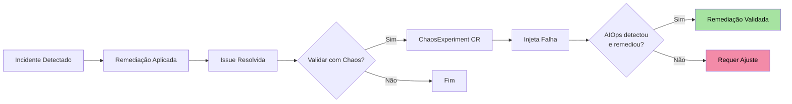
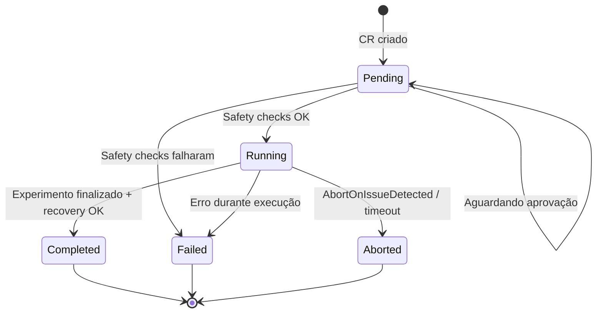

O módulo de **Chaos Engineering** permite validar a resiliência de workloads Kubernetes e a eficácia das remediações da plataforma AIOps. Diferente de ferramentas de chaos standalone, os experimentos aqui são integrados ao pipeline de AIOps — permitindo validar que uma remediação realmente funciona sob condições adversas.

<Info>
  Cada experimento é um CRD nativo do Kubernetes. Todos os controles de
  segurança são declarativos e auditáveis, garantindo que chaos experiments
  nunca afetem workloads críticos sem aprovação explícita.
</Info>

---

## Chaos Engineering no Contexto AIOps



<CardGroup cols={2}>
  <Card title="Validação de Remediações" icon="flask-vial">
    Após corrigir um incidente, re-injete a falha para confirmar que a
    remediação automática funciona.
  </Card>
  <Card title="Testes de Resiliência" icon="shield-halved">
    Execute experimentos recorrentes para garantir que a plataforma detecta
    e responde a falhas conhecidas.
  </Card>
  <Card title="Game Days Automatizados" icon="calendar-check">
    Agende experimentos via cron para simular game days regulares sem
    intervenção manual.
  </Card>
  <Card title="Baseline de Recovery" icon="stopwatch">
    Meça tempos de recuperação reais para estabelecer SLOs e identificar
    gargalos.
  </Card>
</CardGroup>

---

## ChaosExperiment CRD

### Especificação Completa

```yaml
apiVersion: platform.chatcli.io/v1alpha1
kind: ChaosExperiment
metadata:
  name: validate-api-server-recovery
  namespace: staging
spec:
  # Tipo do experimento
  experimentType: pod_kill

  # Alvo
  target:
    kind: Deployment
    name: api-server
    namespace: staging

  # Parâmetros específicos do tipo
  parameters:
    count: 2           # Número de pods a afetar
    # Parâmetros por tipo (veja seção detalhada abaixo)

  # Duração máxima
  duration: 5m

  # DryRun: simula sem executar
  dryRun: false

  # Agendamento (cron, opcional)
  schedule: ""          # Ex: "0 3 * * 1" (toda segunda às 3h)

  # Referência a issue (validação pós-remediação)
  linkedIssueRef:
    name: issue-api-server-crashloop
    namespace: staging

  # Safety Checks
  safetyChecks:
    minHealthyPods: 2
    maxConcurrentExperiments: 1
    abortOnIssueDetected: true
    requireApproval: false
    allowedNamespaces:
      - staging
      - chaos-testing
    blockedNamespaces:
      - production
      - kube-system
      - chatcli-system

  # Verificação pós-experimento
  postExperiment:
    verifyRecovery: true
    recoveryTimeout: 3m
    runRemediationTest: false

status:
  phase: Completed     # Pending | Running | Completed | Failed | Aborted
  startTime: "2026-03-19T03:00:00Z"
  completionTime: "2026-03-19T03:04:30Z"
  affectedPods:
    - api-server-7d8f9c6b5-x2k4p
    - api-server-7d8f9c6b5-m9n3q
  recoveryVerified: true
  recoveryDuration: "45s"
  conditions:
    - type: SafetyChecksPassed
      status: "True"
    - type: ExperimentCompleted
      status: "True"
    - type: RecoveryVerified
      status: "True"
```

---

## 7 Tipos de Experimento

### 1. Pod Kill

Deleta pods aleatoriamente usando o algoritmo **Fisher-Yates shuffle** com `crypto/rand` para seleção verdadeiramente aleatória.

```go
func (e *PodKillExperiment) Execute(ctx context.Context, pods []corev1.Pod) error {
    // Fisher-Yates shuffle com crypto/rand
    shuffled := make([]corev1.Pod, len(pods))
    copy(shuffled, pods)
    for i := len(shuffled) - 1; i > 0; i-- {
        jBig, _ := rand.Int(rand.Reader, big.NewInt(int64(i+1)))
        j := jBig.Int64()
        shuffled[i], shuffled[j] = shuffled[j], shuffled[i]
    }

    // Deleta os primeiros N pods (forçado, sem graceful period)
    count := e.Parameters.Count
    for i := 0; i < count && i < len(shuffled); i++ {
        err := e.client.CoreV1().Pods(shuffled[i].Namespace).Delete(ctx,
            shuffled[i].Name,
            metav1.DeleteOptions{
                GracePeriodSeconds: pointer.Int64(0),
            })
        if err != nil {
            return fmt.Errorf("falha ao deletar pod %s: %w", shuffled[i].Name, err)
        }
    }
    return nil
}
```

| Parâmetro | Tipo | Padrão | Descrição |
|-----------|------|--------|-----------|
| `count` | int | 1 | Número de pods a deletar |

<Warning>
  Pod kill usa `GracePeriodSeconds: 0`, simulando uma falha abrupta (ex: node
  crash). Para terminação graceful, use `pod_failure`.
</Warning>

### 2. Pod Failure

Deleção graceful de pods, respeitando o `terminationGracePeriodSeconds` configurado no PodSpec.

| Parâmetro | Tipo | Padrão | Descrição |
|-----------|------|--------|-----------|
| `count` | int | 1 | Número de pods a deletar gracefully |

```yaml
spec:
  experimentType: pod_failure
  target:
    kind: Deployment
    name: payment-service
  parameters:
    count: 1
```

### 3. CPU Stress

Cria um pod `stress-ng` no **mesmo node** do pod alvo para simular contenção de CPU.

```yaml
spec:
  experimentType: cpu_stress
  target:
    kind: Deployment
    name: api-server
  parameters:
    cores: 4              # Número de cores a estressar
    loadPercent: 80       # Percentual de carga por core
  duration: 2m
```

**Pod de stress gerado:**

```yaml
apiVersion: v1
kind: Pod
metadata:
  name: chaos-cpu-stress-api-server-x7k2
  labels:
    platform.chatcli.io/chaos-experiment: validate-cpu-resilience
    platform.chatcli.io/chaos-type: cpu_stress
spec:
  nodeSelector:
    kubernetes.io/hostname: worker-node-3   # Mesmo node do alvo
  containers:
    - name: stress
      image: alexeiled/stress-ng:latest
      command: ["stress-ng"]
      args: ["--cpu", "4", "--cpu-load", "80", "--timeout", "120"]
      resources:
        limits:
          cpu: "4"
  restartPolicy: Never
```

| Parâmetro | Tipo | Padrão | Descrição |
|-----------|------|--------|-----------|
| `cores` | int | 1 | Número de workers CPU do stress-ng |
| `loadPercent` | int | 100 | Percentual de carga por core (0-100) |

### 4. Memory Stress

Cria um pod `stress-ng` que aloca memória no mesmo node do alvo.

```yaml
spec:
  experimentType: memory_stress
  target:
    kind: Deployment
    name: cache-service
  parameters:
    vmBytes: "256M"       # Quantidade de memória a alocar
  duration: 3m
```

**Comando stress-ng gerado:**

```bash
stress-ng --vm 1 --vm-bytes 256M --timeout 180
```

| Parâmetro | Tipo | Padrão | Descrição |
|-----------|------|--------|-----------|
| `vmBytes` | string | `128M` | Quantidade de memória (formato: `128M`, `1G`) |

### 5. Network Delay

Simula latência de rede usando **annotations** nos pods alvo. O sidecar ou CNI plugin interpreta a annotation para injetar delay.

```yaml
spec:
  experimentType: network_delay
  target:
    kind: Deployment
    name: api-gateway
  parameters:
    latencyMs: 500        # Latência adicional em milissegundos
  duration: 5m
```

**Annotation aplicada:**

```yaml
metadata:
  annotations:
    platform.chatcli.io/chaos-network-delay: "500ms"
    platform.chatcli.io/chaos-experiment-ref: "validate-latency-handling"
```

| Parâmetro | Tipo | Padrão | Descrição |
|-----------|------|--------|-----------|
| `latencyMs` | int | 100 | Latência adicional em milissegundos |

### 6. Network Loss

Simula perda de pacotes de rede via annotations.

```yaml
spec:
  experimentType: network_loss
  target:
    kind: Deployment
    name: api-gateway
  parameters:
    percent: 30           # Percentual de pacotes perdidos
  duration: 2m
```

| Parâmetro | Tipo | Padrão | Descrição |
|-----------|------|--------|-----------|
| `percent` | int | 10 | Percentual de perda de pacotes (0-100) |

### 7. Disk Stress

Cria um pod `stress-ng` que gera I/O intenso no disco do mesmo node.

```yaml
spec:
  experimentType: disk_stress
  target:
    kind: Deployment
    name: database-proxy
  parameters:
    hdd: 2                # Número de workers de disco
    hddBytes: "1G"        # Quantidade de dados por worker
  duration: 3m
```

**Comando stress-ng gerado:**

```bash
stress-ng --hdd 2 --hdd-bytes 1G --timeout 180
```

| Parâmetro | Tipo | Padrão | Descrição |
|-----------|------|--------|-----------|
| `hdd` | int | 1 | Número de workers HDD do stress-ng |
| `hddBytes` | string | `512M` | Bytes escritos por worker |

### Resumo dos Tipos

| Tipo | Mecanismo | Alvo | Reversível |
|------|-----------|------|-----------|
| `pod_kill` | Delete (force) | Pods selecionados aleatoriamente | Sim (ReplicaSet recria) |
| `pod_failure` | Delete (graceful) | Pods selecionados | Sim (ReplicaSet recria) |
| `cpu_stress` | Pod stress-ng no mesmo node | CPU do node | Sim (pod removido após duração) |
| `memory_stress` | Pod stress-ng no mesmo node | Memória do node | Sim (pod removido após duração) |
| `network_delay` | Annotation no pod | Rede do pod | Sim (annotation removida) |
| `network_loss` | Annotation no pod | Rede do pod | Sim (annotation removida) |
| `disk_stress` | Pod stress-ng no mesmo node | Disco do node | Sim (pod removido após duração) |

---

## Safety Checks

Os safety checks são a camada de proteção que impede que experimentos de chaos causem danos reais.

### MinHealthyPods

Garante que um número mínimo de pods permaneça saudável durante o experimento.

```go
func (sc *SafetyChecker) CheckMinHealthyPods(
    ctx context.Context,
    target *ExperimentTarget,
    minHealthy int,
    killCount int,
) error {
    pods, _ := sc.listTargetPods(ctx, target)

    healthyPods := 0
    for _, pod := range pods {
        if isPodReady(&pod) {
            healthyPods++
        }
    }

    remainingHealthy := healthyPods - killCount
    if remainingHealthy < minHealthy {
        return fmt.Errorf(
            "safety check falhou: %d pods saudáveis - %d kill = %d restantes, mínimo requerido: %d",
            healthyPods, killCount, remainingHealthy, minHealthy,
        )
    }
    return nil
}
```

### MaxConcurrentExperiments

Previne **chaos storms** limitando o número de experimentos simultâneos no namespace.

```go
func (sc *SafetyChecker) CheckMaxConcurrent(
    ctx context.Context,
    namespace string,
    maxConcurrent int,
) error {
    running, _ := sc.listRunningExperiments(ctx, namespace)
    if len(running) >= maxConcurrent {
        return fmt.Errorf(
            "safety check falhou: %d experimentos rodando, máximo permitido: %d",
            len(running), maxConcurrent,
        )
    }
    return nil
}
```

### AbortOnIssueDetected

Se a AIOps detectar uma nova issue **não relacionada ao experimento** durante a execução, o experimento é **abortado imediatamente**.

```go
func (sc *SafetyChecker) MonitorForNewIssues(
    ctx context.Context,
    experiment *v1alpha1.ChaosExperiment,
    stopCh <-chan struct{},
) {
    ticker := time.NewTicker(10 * time.Second)
    defer ticker.Stop()

    for {
        select {
        case <-stopCh:
            return
        case <-ticker.C:
            issues, _ := sc.listNewIssues(ctx, experiment.Namespace, experiment.Status.StartTime)
            for _, issue := range issues {
                if !isRelatedToExperiment(&issue, experiment) {
                    sc.abortExperiment(ctx, experiment,
                        fmt.Sprintf("Issue não relacionada detectada: %s", issue.Name))
                    return
                }
            }
        }
    }
}
```

### RequireApproval

Integra com o sistema de `ApprovalRequest` para exigir aprovação humana antes de executar o experimento.

```yaml
spec:
  safetyChecks:
    requireApproval: true
```

Quando habilitado, o controller cria um `ApprovalRequest` CR e aguarda aprovação antes de prosseguir:

```yaml
apiVersion: platform.chatcli.io/v1alpha1
kind: ApprovalRequest
metadata:
  name: approval-chaos-pod-kill-api-server
spec:
  resourceRef:
    kind: ChaosExperiment
    name: validate-api-server-recovery
  requiredRole: Operator
  expiresIn: 1h
  summary: |
    Experimento de chaos: pod_kill em Deployment/api-server (staging)
    Pods afetados: 2, MinHealthyPods: 2
    Duração: 5m
```

### AllowedNamespaces / BlockedNamespaces

<Tabs>
  <Tab title="AllowedNamespaces">
    Lista branca de namespaces onde experimentos podem ser executados. Se
    definida, **apenas** estes namespaces são permitidos.

    ```yaml
    safetyChecks:
      allowedNamespaces:
        - staging
        - chaos-testing
        - development
    ```
  </Tab>
  <Tab title="BlockedNamespaces">
    Lista negra de namespaces bloqueados. Experimentos **nunca** são executados
    nestes namespaces, mesmo que estejam na lista de permitidos.

    ```yaml
    safetyChecks:
      blockedNamespaces:
        - production
        - kube-system
        - chatcli-system
        - monitoring
    ```
  </Tab>
</Tabs>

<Warning>
  `blockedNamespaces` tem precedência sobre `allowedNamespaces`. Se um namespace
  aparece em ambas as listas, ele é **bloqueado**. Os namespaces `kube-system` e
  `chatcli-system` são **sempre** bloqueados, independente da configuração.
</Warning>

---

## Verificação Pós-Experimento

### VerifyRecovery

Após o experimento completar, o controller verifica se o deployment voltou ao estado saudável.

```go
func (v *PostExperimentVerifier) VerifyRecovery(
    ctx context.Context,
    experiment *v1alpha1.ChaosExperiment,
) (bool, time.Duration, error) {
    startCheck := time.Now()
    timeout := experiment.Spec.PostExperiment.RecoveryTimeout

    for time.Since(startCheck) < timeout {
        deployment, _ := v.client.AppsV1().Deployments(
            experiment.Spec.Target.Namespace,
        ).Get(ctx, experiment.Spec.Target.Name, metav1.GetOptions{})

        if deployment.Status.ReadyReplicas == *deployment.Spec.Replicas {
            recoveryTime := time.Since(startCheck)
            return true, recoveryTime, nil
        }

        time.Sleep(5 * time.Second)
    }

    return false, timeout, fmt.Errorf("recovery timeout: deployment não recuperou em %v", timeout)
}
```

### RecoveryTimeout

Tempo máximo de espera para verificação de recuperação. Se o deployment não voltar ao estado saudável dentro deste período, o experimento é marcado como `Failed`.

### RunRemediationTest

Quando habilitado em conjunto com `linkedIssueRef`, o controller:

<Steps>
  <Step title="Re-injeta a falha">
    Executa o mesmo experimento novamente para recriar o cenário do incidente
    original.
  </Step>
  <Step title="Aguarda detecção">
    Espera que a plataforma AIOps detecte a anomalia automaticamente.
  </Step>
  <Step title="Verifica remediação">
    Confirma que a remediação automática foi disparada e resolveu o problema.
  </Step>
  <Step title="Registra resultado">
    Atualiza o `ChaosExperiment.Status` com o resultado da validação.
  </Step>
</Steps>

```yaml
spec:
  linkedIssueRef:
    name: issue-api-server-crashloop
  postExperiment:
    verifyRecovery: true
    recoveryTimeout: 3m
    runRemediationTest: true   # Re-injeta e valida remediação automática
```

---

## Máquina de Estados



| Estado | Descrição | Transições |
|--------|-----------|------------|
| **Pending** | CR criado, aguardando safety checks ou aprovação | Running, Failed |
| **Running** | Experimento em execução, falha sendo injetada | Completed, Failed, Aborted |
| **Completed** | Experimento finalizado com sucesso, recovery verificado | Terminal |
| **Failed** | Safety check falhou, erro de execução ou recovery timeout | Terminal |
| **Aborted** | Interrompido por issue detectada, timeout ou intervençao manual | Terminal |

---

## DryRun Mode

O modo DryRun executa toda a lógica do experimento (safety checks, seleção de pods, geração de comandos) **sem aplicar nenhuma mudança real** no cluster.

```yaml
spec:
  experimentType: pod_kill
  dryRun: true
  target:
    kind: Deployment
    name: api-server
  parameters:
    count: 3
```

**Resultado de um DryRun:**

```yaml
status:
  phase: Completed
  dryRun: true
  dryRunResults:
    safetyChecksPassed: true
    podsSelected:
      - api-server-7d8f9c6b5-x2k4p
      - api-server-7d8f9c6b5-m9n3q
      - api-server-7d8f9c6b5-k8j7r
    actionsPlanned:
      - "DELETE pod api-server-7d8f9c6b5-x2k4p (GracePeriod: 0s)"
      - "DELETE pod api-server-7d8f9c6b5-m9n3q (GracePeriod: 0s)"
      - "DELETE pod api-server-7d8f9c6b5-k8j7r (GracePeriod: 0s)"
    warnings:
      - "3 de 5 pods seriam deletados, restando 2 (= minHealthyPods)"
```

<Tip>
  Sempre execute um DryRun antes de configurar um experimento agendado. Isso
  valida que os safety checks estão corretos e que os alvos são os esperados.
</Tip>

---

## Schedule (Experimentos Recorrentes)

O campo `schedule` aceita expressões cron padrão para execução recorrente:

```yaml
spec:
  schedule: "0 3 * * 1"    # Toda segunda-feira às 03:00
  experimentType: pod_kill
  target:
    kind: Deployment
    name: api-server
  parameters:
    count: 1
  safetyChecks:
    minHealthyPods: 3
    abortOnIssueDetected: true
```

| Expressão | Frequência |
|-----------|-----------|
| `0 3 * * 1` | Toda segunda às 03:00 |
| `0 */6 * * *` | A cada 6 horas |
| `0 2 1 * *` | Primeiro dia do mês às 02:00 |
| `30 4 * * 1-5` | Dias úteis às 04:30 |

Cada execução agendada cria um novo `ChaosExperiment` CR com sufixo de timestamp.

---

## LinkedIssueRef

O campo `linkedIssueRef` conecta o experimento a um incidente específico, permitindo validar que a remediação aplicada realmente funciona.

```yaml
spec:
  linkedIssueRef:
    name: issue-api-server-crashloop
    namespace: staging
  experimentType: pod_kill
  parameters:
    count: 2
  postExperiment:
    verifyRecovery: true
    recoveryTimeout: 3m
    runRemediationTest: true
```

Quando `linkedIssueRef` é definido, o controller:

1. Busca o `Issue` CR e o `RemediationPlan` associado
2. Registra a conexão no status do experimento
3. Se `runRemediationTest: true`, valida que a AIOps detecta e remedia automaticamente
4. Atualiza o `Issue` CR com o resultado da validação

---

## Exemplos YAML Completos

<Accordion title="Pod Kill com Safety Checks">
```yaml
apiVersion: platform.chatcli.io/v1alpha1
kind: ChaosExperiment
metadata:
  name: validate-api-server-pod-kill
  namespace: staging
  labels:
    team: platform
    experiment-type: resilience
spec:
  experimentType: pod_kill
  target:
    kind: Deployment
    name: api-server
    namespace: staging
  parameters:
    count: 2
  duration: 5m
  dryRun: false
  safetyChecks:
    minHealthyPods: 2
    maxConcurrentExperiments: 1
    abortOnIssueDetected: true
    requireApproval: false
    allowedNamespaces: [staging, chaos-testing]
    blockedNamespaces: [production, kube-system]
  postExperiment:
    verifyRecovery: true
    recoveryTimeout: 2m
    runRemediationTest: false
```
</Accordion>

<Accordion title="CPU Stress Semanal Agendado">
```yaml
apiVersion: platform.chatcli.io/v1alpha1
kind: ChaosExperiment
metadata:
  name: weekly-cpu-stress-api
  namespace: staging
spec:
  experimentType: cpu_stress
  schedule: "0 3 * * 1"     # Toda segunda às 03:00
  target:
    kind: Deployment
    name: api-server
    namespace: staging
  parameters:
    cores: 4
    loadPercent: 90
  duration: 10m
  safetyChecks:
    minHealthyPods: 3
    maxConcurrentExperiments: 1
    abortOnIssueDetected: true
    blockedNamespaces: [production, kube-system]
  postExperiment:
    verifyRecovery: true
    recoveryTimeout: 5m
```
</Accordion>

<Accordion title="Validação Pós-Remediação">
```yaml
apiVersion: platform.chatcli.io/v1alpha1
kind: ChaosExperiment
metadata:
  name: validate-crashloop-fix
  namespace: staging
spec:
  experimentType: pod_kill
  target:
    kind: Deployment
    name: payment-service
    namespace: staging
  parameters:
    count: 1
  duration: 3m
  linkedIssueRef:
    name: issue-payment-crashloop
    namespace: staging
  safetyChecks:
    minHealthyPods: 1
    abortOnIssueDetected: false   # Esperamos que a AIOps detecte
    requireApproval: true
  postExperiment:
    verifyRecovery: true
    recoveryTimeout: 3m
    runRemediationTest: true      # Valida remediação automática
```
</Accordion>

<Accordion title="DryRun para Validação de Configuração">
```yaml
apiVersion: platform.chatcli.io/v1alpha1
kind: ChaosExperiment
metadata:
  name: dryrun-memory-stress
  namespace: staging
spec:
  experimentType: memory_stress
  dryRun: true
  target:
    kind: Deployment
    name: cache-service
    namespace: staging
  parameters:
    vmBytes: "512M"
  duration: 5m
  safetyChecks:
    minHealthyPods: 2
    maxConcurrentExperiments: 1
    blockedNamespaces: [production]
  postExperiment:
    verifyRecovery: true
    recoveryTimeout: 2m
```
</Accordion>

---

## Métricas

O módulo de chaos engineering expõe métricas Prometheus para observabilidade e tracking de resiliência.

| Métrica | Tipo | Labels | Descrição |
|---------|------|--------|-----------|
| `chaos_experiments_total` | Counter | `type`, `result`, `namespace` | Total de experimentos por tipo e resultado |
| `chaos_experiments_active` | Gauge | `namespace` | Experimentos em execução no momento |
| `chaos_recovery_time_seconds` | Histogram | `type`, `target` | Tempo de recuperação após experimento |
| `chaos_pods_affected_total` | Counter | `type`, `namespace` | Total de pods afetados por experimentos |
| `chaos_safety_checks_failed_total` | Counter | `check_type` | Safety checks que bloquearam experimentos |
| `chaos_aborted_total` | Counter | `reason` | Experimentos abortados por motivo |
| `chaos_remediation_validated_total` | Counter | `result` | Validações de remediação (pass/fail) |

### Exemplo de Alertas

```yaml
groups:
  - name: chaos-engineering
    rules:
      - alert: ChaosExperimentFailed
        expr: increase(chaos_experiments_total{result="failed"}[1h]) > 0
        labels:
          severity: warning
        annotations:
          summary: "Experimento de chaos falhou"
          description: >
            {{ $labels.type }} falhou no namespace {{ $labels.namespace }}.
            Verifique se o deployment se recuperou corretamente.

      - alert: HighRecoveryTime
        expr: >
          histogram_quantile(0.95, chaos_recovery_time_seconds_bucket) > 300
        for: 1h
        labels:
          severity: warning
        annotations:
          summary: "Tempo de recuperação alto após chaos"
          description: >
            P95 de recuperação acima de 5 minutos. Workloads podem ter
            problemas de self-healing.

      - alert: RemediationValidationFailed
        expr: increase(chaos_remediation_validated_total{result="fail"}[24h]) > 0
        labels:
          severity: critical
        annotations:
          summary: "Validação de remediação falhou"
          description: >
            A remediação automática não funcionou quando a falha foi
            re-injetada. A plataforma AIOps pode não estar respondendo
            corretamente a este tipo de incidente.
```

---

## Boas Práticas

<Steps>
  <Step title="Comece com DryRun">
    Sempre execute um DryRun antes de experimentos reais para validar safety
    checks e seleção de alvos.
  </Step>
  <Step title="Staging Primeiro">
    Execute experimentos em staging antes de habilitar em ambientes de maior
    tier. Use `allowedNamespaces` para enforcement.
  </Step>
  <Step title="Safety Checks Conservadores">
    Configure `minHealthyPods` com margem. Se o deployment tem 5 réplicas
    e precisa de 3 para operar, configure `minHealthyPods: 3`.
  </Step>
  <Step title="Agende Game Days">
    Use `schedule` para experimentos recorrentes. Resiliência não é um teste
    único — é uma prática contínua.
  </Step>
  <Step title="Valide Remediações">
    Após corrigir um incidente, use `linkedIssueRef` + `runRemediationTest`
    para confirmar que a correção funciona sob falha.
  </Step>
</Steps>

---

## Próximos Passos

<CardGroup cols={2}>
  <Card title="Motor de Decisão" icon="brain-circuit" href="/features/aiops/decision-engine">
    Entenda como os resultados de chaos influenciam o Pattern Store e a
    confiança do motor.
  </Card>
  <Card title="Federação Multi-Cluster" icon="network-wired" href="/features/aiops/federation">
    Execute chaos experiments em clusters específicos com políticas por tier.
  </Card>
  <Card title="Auditoria e Compliance" icon="clipboard-check" href="/features/aiops/audit-compliance">
    Todos os experimentos geram AuditEvents imutáveis para rastreabilidade
    completa.
  </Card>
  <Card title="AIOps Platform" icon="brain" href="/features/aiops-platform">
    Retorne à visão geral da plataforma AIOps.
  </Card>
</CardGroup>
