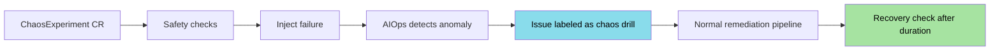
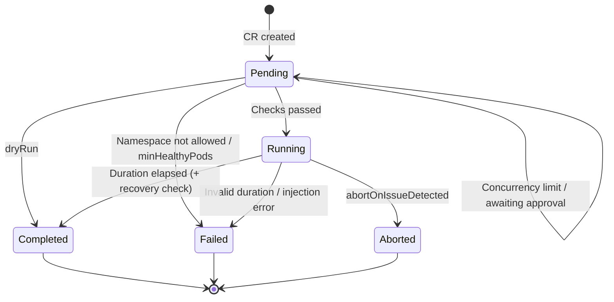

The **Chaos Engineering** module lets you inject failures into Kubernetes workloads and watch how the AIOps platform reacts. Unlike standalone chaos tools, experiments here are wired into the AIOps pipeline: Issues raised while an experiment runs are tagged as chaos drills, so they do not page anyone and do not pollute the production MTTR histogram.

<Info>
  Each experiment is a `ChaosExperiment` custom resource reconciled by the
  operator's chaos controller. Guardrails (namespace allow/block lists,
  minimum healthy pods, concurrency limit, abort on new Issue) are declarative
  fields on the CR. Nothing is protected by default: every guardrail is
  opt-in.
</Info>

<Warning>
  **What works out of the box.** With the RBAC shipped by the operator Helm chart and
  `operator/config/rbac/role.yaml`, the operator may only `get`, `list`, `watch` and `delete` pods. That is enough for
  `pod_kill` and `pod_failure`. The other types need more:

  - `cpu_stress`, `memory_stress`, `disk_stress` create a stress pod and need `create` on pods. Without it the experiment goes to `Failed` (`execution failed: creating ... stress pod: ... forbidden`).
  - `network_delay` and `network_loss` only **annotate** the target pods (they need `update` on pods). Nothing in ChatCLI reads those annotations, so no latency or packet loss is injected, even when the annotation is written. Without the permission, the annotation errors are only logged and the experiment still ends `Completed`.

  See [Granting pod permissions](#granting-pod-permissions) below.
</Warning>


## Chaos Engineering in the AIOps Context


```mermaid
flowchart LR
    A[ChaosExperiment CR] --> B[Safety checks]
    B --> C[Inject failure]
    C --> D[AIOps detects anomaly]
    D --> E[Issue labeled as chaos drill]
    E --> F[Normal remediation pipeline]
    F --> G[Recovery check after duration]

    style E fill:#89dceb,color:#000
    style G fill:#a6e3a1,color:#000
```

<CardGroup cols={2}>
  <Card title="Remediation Validation" icon="flask-vial">
    After fixing an incident, re-create the failure with a new experiment and
    watch whether the platform detects and remediates it again.
  </Card>
  <Card title="Resilience Testing" icon="shield-halved">
    Check that workloads come back to full readiness after pods are killed.
  </Card>
  <Card title="Game Days" icon="calendar-check">
    Run experiments on demand. The `schedule` field is not implemented yet;
    use an external scheduler to create experiments periodically.
  </Card>
  <Card title="Drill-aware Analytics" icon="stopwatch">
    Chaos-induced Issues are counted separately, so drills do not inflate
    production incident numbers.
  </Card>
</CardGroup>


## Automatic Correlation with Issues

When the anomaly controller creates an Issue, it looks for a `ChaosExperiment` **in the same namespace as the affected resource** whose `spec.target` has the same `kind`, `name` and `namespace`, and that is either `Running` or finished (`Completed`/`Aborted`) less than **2 minutes** ago. If it finds one, the Issue gets two labels:

```yaml
metadata:
  labels:
    platform.chatcli.io/source: chaos-experiment
    platform.chatcli.io/chaos-experiment: <experiment-name>
```

The Issue then goes through the normal AIOps pipeline, with these differences:

| Behavior | Production Issue | Chaos-induced Issue |
|----------|------------------|---------------------|
| AIOps pipeline (analysis, remediation, PostMortem) | Yes | Yes |
| NotificationPolicy rules | Yes | Yes (not suppressed) |
| Escalation when the Issue reaches `Escalated` | Yes | Skipped |
| `chatcli_operator_issue_resolution_duration_seconds` histogram | Observed | Not observed |
| PostMortem labels | - | Same two labels copied |
| REST `incidents` / `postmortems` items | - | `chaosInduced: true`, `chaosExperiment: <name>` |
| REST `analytics/summary` | - | Counted in `chaosInducedIssues` |
| Dashboard incident lists | Visible | Hidden by default (filter "Hide chaos drills") |

<Note>
  The REST `analytics/mttd` and `analytics/mttr` endpoints do **not** filter chaos
  drills out; only the Prometheus resolution histogram does. NotificationPolicy
  rules cannot match on labels, so drills still reach every channel whose rule
  matches the Issue's severity, namespace, kind or state. Run drills in a
  dedicated namespace if you want to route them separately.
</Note>

<Tip>
  Create the `ChaosExperiment` in the **same namespace as its target**. The
  correlation lookup only searches the target's namespace, while
  `linkedIssueRef` and the approval request are resolved in the experiment's
  namespace.
</Tip>


## ChaosExperiment CRD

Short name: `chaos`. Printer columns: `Type`, `Target`, `State`, `Duration`, `Age`.

```bash
kubectl get chaos -n staging
kubectl get chaos validate-api-server-recovery -n staging -o jsonpath='{.status.result}'
```

### Complete Specification

```yaml
apiVersion: platform.chatcli.io/v1alpha1
kind: ChaosExperiment
metadata:
  name: validate-api-server-recovery
  namespace: staging
spec:
  # Experiment type (required)
  experimentType: pod_kill

  # Target (required). kind, name and namespace are all required.
  # Only Deployment and StatefulSet are supported.
  target:
    kind: Deployment
    name: api-server
    namespace: staging

  # Type-specific parameters. The field is map[string]string:
  # values MUST be quoted strings.
  parameters:
    count: "2"

  # Required. Go duration syntax: 30s, 5m, 1h30m (no "d").
  duration: 5m

  # Only run safety checks and record what would happen
  dryRun: false

  # Accepted but NOT implemented: the controller ignores it
  schedule: ""

  # Optional link to an Issue in the experiment's namespace (name only)
  linkedIssueRef:
    name: issue-api-server-crashloop

  # Guardrails (all optional)
  safetyChecks:
    minHealthyPods: 2
    maxConcurrentExperiments: 1   # default 1
    abortOnIssueDetected: true
    requireApproval: false
    allowedNamespaces:
      - staging
      - chaos-testing
    blockedNamespaces:
      - production
      - kube-system
      - chatcli-system

  # Post-experiment verification
  postExperiment:
    verifyRecovery: true
    recoveryTimeout: 3m           # default 5m
    runRemediationTest: false

  # Default true. Disabled experiments are skipped by the controller.
  enabled: true

status:
  state: Completed               # Pending | Running | Completed | Failed | Aborted
  startedAt: "2026-03-19T03:00:00Z"
  completedAt: "2026-03-19T03:05:02Z"
  result: "completed: pod_kill experiment finished; recovery verified in 4ms"
  podsAffected: 2
  recoveryVerified: true
  recoveryTime: "4ms"
  preExperimentSnapshot: "Deployment staging/api-server: replicas=5, ready=5, available=5, updated=5"
  postExperimentSnapshot: "Deployment staging/api-server: replicas=5, ready=5, available=5, updated=5"
```

<Note>
  The controller never writes `status.conditions`. Use `status.state` and
  `status.result` (a human-readable summary) to follow an experiment.
</Note>


## 7 Experiment Types

The failure is injected **once**, on the first reconcile after the experiment enters `Running`. `duration` is the observation window: the controller waits for it to elapse (checking every 10 seconds at most) and then runs the post-experiment steps. Target pods are the pods owned by the Deployment (through its ReplicaSets) or by the StatefulSet. Any other `target.kind` makes the experiment fail.

Parameters that are missing or not valid integers fall back to their defaults silently.

### 1. Pod Kill

Deletes randomly chosen target pods with `gracePeriodSeconds: 0`. The random selection is a Fisher-Yates shuffle using `crypto/rand`.

| Parameter | Type | Default | Description |
|-----------|------|---------|-------------|
| `count` | string (integer) | `"1"` | Number of pods to delete. If it is greater than or equal to the number of pods, **all** target pods are deleted. |

<Warning>
  Pod kill simulates an abrupt failure (e.g., node crash). Use
  `safetyChecks.minHealthyPods` to avoid taking down every replica.
</Warning>

### 2. Pod Failure

Same selection as `pod_kill`, but deletes with a grace period taken from the experiment (it overrides the pod's own `terminationGracePeriodSeconds`).

| Parameter | Type | Default | Description |
|-----------|------|---------|-------------|
| `count` | string (integer) | `"1"` | Number of pods to delete |
| `gracePeriodSeconds` | string (integer) | `"30"` | Grace period used for the deletion |

```yaml
spec:
  experimentType: pod_failure
  target:
    kind: Deployment
    name: payment-service
    namespace: staging
  parameters:
    count: "1"
    gracePeriodSeconds: "10"
  duration: 2m
```

### 3. CPU Stress

Creates a `stress-ng` pod pinned to the **node** of the first target pod. It stresses the node, not the target container.

```yaml
spec:
  experimentType: cpu_stress
  target:
    kind: Deployment
    name: api-server
    namespace: staging
  parameters:
    cores: "2"
    loadPercent: "80"
  duration: 2m
```

**Generated stress pod** (same shape for the three stress types; only the name prefix and command change):

```yaml
apiVersion: v1
kind: Pod
metadata:
  name: chaos-cpu-<experiment-name>        # chaos-mem-… / chaos-disk-…
  namespace: <target namespace>
  labels:
    platform.chatcli.io/chaos-experiment: <experiment-name>
    platform.chatcli.io/chaos-role: stress
spec:
  nodeName: <node of the first target pod>  # bypasses the scheduler
  restartPolicy: Never
  tolerations:
    - operator: Exists                      # tolerates every taint
  containers:
    - name: stress
      image: alexeiled/stress-ng:latest
      command: ["stress-ng", "--cpu", "2", "--cpu-load", "80", "--timeout", "2m"]
      resources:
        requests: { cpu: 100m, memory: 64Mi }
        limits:   { cpu: 500m, memory: 512Mi }
```

| Parameter | Type | Default | Description |
|-----------|------|---------|-------------|
| `cores` | string | `"1"` | stress-ng CPU workers (`--cpu`) |
| `loadPercent` | string | `"80"` | Load per worker (`--cpu-load`) |

<Warning>
  The stress pod's resources are fixed: it can use at most **500m CPU and
  512Mi memory**, whatever `cores`, `loadPercent` or `bytes` say. The image
  (`alexeiled/stress-ng:latest`, from Docker Hub) cannot be changed, and the pod
  has no `securityContext`, so namespaces that enforce the `restricted` Pod
  Security Standard reject it.
</Warning>

### 4. Memory Stress

Creates a `stress-ng` pod that allocates memory on the target's node: `stress-ng --vm <workers> --vm-bytes <bytes> --timeout <duration>`.

```yaml
spec:
  experimentType: memory_stress
  target:
    kind: Deployment
    name: cache-service
    namespace: staging
  parameters:
    bytes: "256M"
    workers: "1"
  duration: 3m
```

| Parameter | Type | Default | Description |
|-----------|------|---------|-------------|
| `bytes` | string | `"256M"` | Memory per worker, passed as-is to `--vm-bytes` (use stress-ng syntax such as `256M`, `1G`) |
| `workers` | string | `"1"` | stress-ng VM workers (`--vm`) |

Because of the 512Mi limit, asking for more memory gets the stress container OOM-killed rather than putting pressure on the node.

### 5. Network Delay

Adds an annotation to **every** target pod. No latency is injected: ChatCLI ships no sidecar or CNI integration that reads it. The annotation is only a marker that your own tooling could act on.

```yaml
spec:
  experimentType: network_delay
  target:
    kind: Deployment
    name: api-gateway
    namespace: staging
  parameters:
    latencyMs: "500"
    jitterMs: "50"
  duration: 5m
```

**Applied annotation:**

```yaml
metadata:
  annotations:
    platform.chatcli.io/chaos-network-delay: "500ms jitter=50ms experiment=<experiment-name>"
```

| Parameter | Type | Default | Description |
|-----------|------|---------|-------------|
| `latencyMs` | string | `"100"` | Latency written into the annotation |
| `jitterMs` | string | `"10"` | Jitter written into the annotation |

The annotation is removed when the experiment completes or is aborted. `podsAffected` counts every target pod, even when writing the annotation failed.

### 6. Network Loss

Same mechanism as `network_delay`, with the annotation `platform.chatcli.io/chaos-network-loss: "<percent>% correlation=<correlation>% experiment=<name>"`. No packets are dropped.

```yaml
spec:
  experimentType: network_loss
  target:
    kind: Deployment
    name: api-gateway
    namespace: staging
  parameters:
    percent: "30"
  duration: 2m
```

| Parameter | Type | Default | Description |
|-----------|------|---------|-------------|
| `percent` | string | `"10"` | Loss percentage written into the annotation |
| `correlation` | string | `"25"` | Correlation percentage written into the annotation |

### 7. Disk Stress

Creates a `stress-ng` pod that generates disk I/O on the target's node: `stress-ng --hdd <workers> --hdd-bytes <size> --timeout <duration>`. The I/O goes to the stress container's own filesystem.

```yaml
spec:
  experimentType: disk_stress
  target:
    kind: Deployment
    name: database-proxy
    namespace: staging
  parameters:
    workers: "2"
    size: "1G"
  duration: 3m
```

| Parameter | Type | Default | Description |
|-----------|------|---------|-------------|
| `workers` | string | `"1"` | stress-ng HDD workers (`--hdd`) |
| `size` | string | `"1G"` | Bytes per worker (`--hdd-bytes`) |

### Type Summary

| Type | Mechanism | Pod permission needed | Cleanup |
|------|-----------|-----------------------|---------|
| `pod_kill` | Delete with grace period 0 | `delete` (granted) | ReplicaSet/StatefulSet recreates the pods |
| `pod_failure` | Delete with `gracePeriodSeconds` | `delete` (granted) | ReplicaSet/StatefulSet recreates the pods |
| `cpu_stress` | stress-ng pod on the target's node | `create` (not granted) | stress-ng exits at `--timeout`; the pod is deleted at the end |
| `memory_stress` | stress-ng pod on the target's node | `create` (not granted) | Same as above |
| `disk_stress` | stress-ng pod on the target's node | `create` (not granted) | Same as above |
| `network_delay` | Annotation only (no effect) | `update` (not granted) | Annotation removed at the end |
| `network_loss` | Annotation only (no effect) | `update` (not granted) | Annotation removed at the end |

### Granting Pod Permissions

To use the stress types (and to have the network annotations written), give the operator's ServiceAccount the missing verbs. For example, cluster-wide:

```yaml
apiVersion: rbac.authorization.k8s.io/v1
kind: ClusterRole
metadata:
  name: chatcli-operator-chaos-pods
rules:
  - apiGroups: [""]
    resources: ["pods"]
    verbs: ["create", "update"]
---
apiVersion: rbac.authorization.k8s.io/v1
kind: ClusterRoleBinding
metadata:
  name: chatcli-operator-chaos-pods
roleRef:
  apiGroup: rbac.authorization.k8s.io
  kind: ClusterRole
  name: chatcli-operator-chaos-pods
subjects:
  - kind: ServiceAccount
    name: chatcli-operator        # your operator ServiceAccount
    namespace: chatcli-system
```

To limit the blast radius, bind the same rules with a `Role`/`RoleBinding` in the namespaces you run experiments in instead.


## Safety Checks

Safety checks run in this order while the experiment is `Pending`. All of them are evaluated once, before the failure is injected, except `abortOnIssueDetected`, which is checked while the experiment runs.

### AllowedNamespaces / BlockedNamespaces

Checked against `spec.target.namespace`. A blocked namespace, or a namespace missing from a non-empty allow list, moves the experiment to `Failed` (`namespace "<ns>" is not allowed by safety checks`).

<Tabs>
  <Tab title="AllowedNamespaces">
    Allow list. If it is set, **only** these namespaces can be targeted. If it
    is empty, every namespace that is not blocked is allowed.

    ```yaml
    safetyChecks:
      allowedNamespaces:
        - staging
        - chaos-testing
        - development
    ```
  </Tab>
  <Tab title="BlockedNamespaces">
    Block list. Experiments are **never** executed in these namespaces, even
    if they are also in the allow list.

    ```yaml
    safetyChecks:
      blockedNamespaces:
        - production
        - kube-system
        - chatcli-system
        - monitoring
    ```
  </Tab>
</Tabs>

<Warning>
  `blockedNamespaces` takes precedence over `allowedNamespaces`. There are
  **no built-in blocked namespaces**: `kube-system` and `chatcli-system` are
  only protected if you list them.
</Warning>

### MaxConcurrentExperiments

Counts experiments in `Running` state **across all namespaces** and compares the count with this experiment's own `maxConcurrentExperiments` (default `1`; `0` or less is treated as `1`). When the limit is reached, the experiment stays `Pending` and is retried every 15 seconds. It does not fail.

### MinHealthyPods

If greater than `0`, the controller counts the target pods whose `Ready` condition is `True`, subtracts the `count` parameter (default 1, whatever the experiment type), and moves the experiment to `Failed` when the result is below `minHealthyPods`:

```
safety check failed: killing 2 pods would leave 1 healthy (min required: 2, total: 3)
```

This check runs once, before injection. It does not watch pod health during the experiment.

### RequireApproval

When `true`, the controller looks for an `ApprovalRequest` named `chaos-<experiment-name>` in the experiment's namespace, creates it if missing, and re-checks every 30 seconds. The experiment starts only when that request's `status.state` is `Approved`.

The request the controller builds looks like this:

```yaml
apiVersion: platform.chatcli.io/v1alpha1
kind: ApprovalRequest
metadata:
  name: chaos-validate-api-server-recovery
  namespace: staging
  labels:
    platform.chatcli.io/chaos-experiment: validate-api-server-recovery
spec:
  issueRef:
    name: chaos-experiment-validate-api-server-recovery   # or spec.linkedIssueRef
  remediationPlanRef: validate-api-server-recovery        # the experiment name
  policyRef: chaos-safety
  ruleName: chaos-experiment-approval
  requester: chaos-controller
  timeoutMinutes: 30
  requiredApprovers: 1
```

<Warning>
  **Known limitations of `requireApproval` (code-derived):**

  - The controller does not set `spec.requestedActions`, which the ApprovalRequest CRD marks as required. The API server rejects the create, so the experiment stays in `Pending` and the operator logs `checking approval: creating approval request: ...` on every retry.
  - `policyRef: chaos-safety` does not refer to a built-in policy. Unless you create an ApprovalPolicy with that name and a rule named `chaos-experiment-approval` in the same namespace, the approval controller never processes the request: it does not expire it after 30 minutes, and it does not act on approve/reject annotations.
  - If the request is `Rejected` or `Expired`, the experiment does **not** move to `Failed`. It stays `Pending` and the controller keeps retrying with backoff. Delete the experiment to stop it.

  Workaround: create the request yourself before the experiment (same name, with `requestedActions: []`), then approve it by writing its status directly:

  ```bash
  kubectl patch approvalrequest chaos-validate-api-server-recovery -n staging \
    --subresource=status --type=merge \
    -p '{"status":{"state":"Approved","autoApproved":false}}'
  ```
</Warning>

### AbortOnIssueDetected

While the experiment is `Running` and its `duration` has not elapsed, each reconcile (every 10 seconds at most) lists the Issues in the target namespace. If any Issue has exactly the same `spec.resource` kind, name and namespace as the target and was created after `status.startedAt`, the experiment moves to `Aborted` with `result: "aborted: new issue detected: <issue>"`. Stress pods are then deleted and network annotations removed.

<Warning>
  The check does not distinguish Issues caused by the experiment itself. If
  AIOps detects the failure you injected (the usual goal of a drill), the
  experiment aborts. Leave `abortOnIssueDetected: false` when you expect
  AIOps to raise an Issue for the target.
</Warning>


## Post-Experiment Verification

When `duration` has elapsed, the controller deletes the stress pods, removes the network annotations, stores `postExperimentSnapshot`, and runs the steps below. The experiment always ends in `Completed` from here, even if recovery was not verified.

### VerifyRecovery

The target counts as healthy when a Deployment has `readyReplicas` and `availableReplicas` at least equal to `spec.replicas`, or a StatefulSet has `readyReplicas` at least equal to `spec.replicas`. If it is not healthy yet, the controller re-checks every 5 seconds.

### RecoveryTimeout

How long to keep re-checking after `duration` has elapsed. Default `5m`. An invalid value silently falls back to `5m`. When the timeout passes, the experiment is marked `Completed` with `recoveryVerified: false`, `recoveryTime: "timeout"`, and a result ending in `recovery NOT verified (timeout)`. It is not marked `Failed`.

<Warning>
  **`recoveryTime` does not measure recovery.** The timer starts right before
  the final health check that succeeds, so the value (and the
  `chatcli_operator_chaos_recovery_time_seconds` histogram) is always a few
  milliseconds. Use `recoveryVerified` as a pass/fail signal, and compare
  `status.startedAt`/`status.completedAt` if you need an upper bound on the
  recovery time.
</Warning>

### RunRemediationTest

This option does **not** re-inject the failure. At completion, the controller reads the Issue named in `linkedIssueRef` (in the experiment's namespace) and only checks whether its `status.state` is `Resolved`:

- `Resolved`: `result: "completed: <type> experiment finished; remediation validation passed"`
- anything else, or no `linkedIssueRef`: `result: "completed: <type> experiment finished; no remediation was applied during experiment"`

If the linked Issue was already `Resolved` before the experiment started, the check passes regardless of what happened during the experiment. When `runRemediationTest` is `true`, the result text does not mention recovery; read `recoveryVerified` for that.

```yaml
spec:
  linkedIssueRef:
    name: issue-api-server-crashloop
  postExperiment:
    verifyRecovery: true
    recoveryTimeout: 3m
    runRemediationTest: true   # checks that the linked Issue is Resolved
```


## State Machine


```mermaid
stateDiagram-v2
    [*] --> Pending: CR created

    Pending --> Pending: Concurrency limit / awaiting approval
    Pending --> Failed: Namespace not allowed / minHealthyPods
    Pending --> Completed: dryRun
    Pending --> Running: Checks passed

    Running --> Failed: Invalid duration / injection error
    Running --> Aborted: abortOnIssueDetected
    Running --> Completed: Duration elapsed (+ recovery check)

    Completed --> [*]
    Failed --> [*]
    Aborted --> [*]
```

| State | Description | Transitions |
|-------|-------------|-------------|
| **Pending** | Safety checks, concurrency limit and approval are evaluated | Running, Failed, Completed (dry run) |
| **Running** | Failure injected once; controller waits for `duration` | Completed, Failed, Aborted |
| **Completed** | Duration elapsed and post-experiment steps done (recovery may still be unverified), or dry run finished | Terminal |
| **Failed** | Namespace blocked, `minHealthyPods` violated, invalid `duration`, no target pods (pod and stress types), unsupported `target.kind`, or injection error | Terminal |
| **Aborted** | A new Issue for the target was detected (`abortOnIssueDetected`) | Terminal |

Terminal experiments are never run again. To repeat an experiment, delete it and create it again (resetting the status by hand does not re-inject the failure, because the controller skips injection when `podsAffected` is already set).

There is no field to abort a running experiment. Deleting the CR or setting `enabled: false` makes the controller stop handling it, but it does not clean up: stress pods keep running until stress-ng's `--timeout`, and network annotations stay on the pods.

<Note>
  `duration` is only parsed once the experiment is `Running`, so an invalid
  value (for example `1d`) is caught after the safety checks and approval have
  passed.
</Note>


## DryRun Mode

With `dryRun: true`, the controller runs the `Pending` checks (namespaces, concurrency, `minHealthyPods`, and approval if required) and then moves the experiment straight to `Completed`, without touching any pod. It does not select pods or plan individual actions.

```yaml
spec:
  experimentType: pod_kill
  dryRun: true
  target:
    kind: Deployment
    name: api-server
    namespace: staging
  parameters:
    count: "3"
  duration: 5m
```

**DryRun result:**

```yaml
status:
  state: Completed
  startedAt: "2026-03-19T03:00:00Z"
  completedAt: "2026-03-19T03:00:00Z"
  result: "dry-run: would execute pod_kill on staging/api-server for 5m"
  podsAffected: 0
  recoveryVerified: false
  preExperimentSnapshot: "Deployment staging/api-server: replicas=5, ready=5, available=5, updated=5"
  postExperimentSnapshot: "Deployment staging/api-server: replicas=5, ready=5, available=5, updated=5"
```

A dry run increments `chatcli_operator_chaos_experiments_total{result="dry_run"}`.

<Tip>
  Run a dry run first to confirm that the namespace lists and `minHealthyPods`
  accept the target. If a safety check fails, the dry run ends in `Failed`
  with the same message a real run would get.
</Tip>


## Schedule (Recurring Experiments)

<Warning>
  The `schedule` field exists in the CRD but **is not implemented**: the chaos
  controller never reads it. An experiment with a `schedule` runs once, like
  any other, and is never repeated.
</Warning>

For recurring game days, create a fresh `ChaosExperiment` on a schedule from outside the operator, for example with a Kubernetes CronJob that runs `kubectl create -f` on a manifest that uses `metadata.generateName` (so each run gets a new name and a new status). Clean up old experiments yourself; the operator does not prune them.


## LinkedIssueRef

`linkedIssueRef` takes only a `name`; the Issue is looked up in the experiment's namespace. It is used in two places:

1. **Approval:** when `requireApproval` is `true`, it becomes the `spec.issueRef` of the generated ApprovalRequest.
2. **`runRemediationTest`:** at completion, the controller checks whether this Issue is `Resolved` and writes the outcome into `status.result`.

The controller does not modify the Issue or its RemediationPlan, and does not record the link anywhere else in the experiment status.

```yaml
spec:
  linkedIssueRef:
    name: issue-api-server-crashloop
  experimentType: pod_kill
  parameters:
    count: "2"
  postExperiment:
    verifyRecovery: true
    recoveryTimeout: 3m
    runRemediationTest: true
```


## Complete YAML Examples

<Accordion title="Pod Kill with Safety Checks">
```yaml
apiVersion: platform.chatcli.io/v1alpha1
kind: ChaosExperiment
metadata:
  name: validate-api-server-pod-kill
  namespace: staging
  labels:
    team: platform
    experiment-type: resilience
spec:
  experimentType: pod_kill
  target:
    kind: Deployment
    name: api-server
    namespace: staging
  parameters:
    count: "2"
  duration: 5m
  dryRun: false
  safetyChecks:
    minHealthyPods: 2
    maxConcurrentExperiments: 1
    abortOnIssueDetected: false
    requireApproval: false
    allowedNamespaces: [staging, chaos-testing]
    blockedNamespaces: [production, kube-system]
  postExperiment:
    verifyRecovery: true
    recoveryTimeout: 2m
    runRemediationTest: false
```
</Accordion>

<Accordion title="CPU Stress (requires pod create permission)">
```yaml
apiVersion: platform.chatcli.io/v1alpha1
kind: ChaosExperiment
metadata:
  name: cpu-stress-api
  namespace: staging
spec:
  experimentType: cpu_stress
  target:
    kind: Deployment
    name: api-server
    namespace: staging
  parameters:
    cores: "2"
    loadPercent: "90"
  duration: 10m
  safetyChecks:
    maxConcurrentExperiments: 1
    abortOnIssueDetected: true
    blockedNamespaces: [production, kube-system]
  postExperiment:
    verifyRecovery: true
    recoveryTimeout: 5m
```
</Accordion>

<Accordion title="Post-Remediation Validation">
```yaml
apiVersion: platform.chatcli.io/v1alpha1
kind: ChaosExperiment
metadata:
  name: validate-crashloop-fix
  namespace: staging
spec:
  experimentType: pod_kill
  target:
    kind: Deployment
    name: payment-service
    namespace: staging
  parameters:
    count: "1"
  duration: 3m
  linkedIssueRef:
    name: issue-payment-crashloop
  safetyChecks:
    minHealthyPods: 1
    abortOnIssueDetected: false   # we expect AIOps to detect the failure
  postExperiment:
    verifyRecovery: true
    recoveryTimeout: 3m
    runRemediationTest: true      # checks that the linked Issue is Resolved
```
</Accordion>

<Accordion title="DryRun for Configuration Validation">
```yaml
apiVersion: platform.chatcli.io/v1alpha1
kind: ChaosExperiment
metadata:
  name: dryrun-memory-stress
  namespace: staging
spec:
  experimentType: memory_stress
  dryRun: true
  target:
    kind: Deployment
    name: cache-service
    namespace: staging
  parameters:
    bytes: "256M"
  duration: 5m
  safetyChecks:
    minHealthyPods: 2
    maxConcurrentExperiments: 1
    blockedNamespaces: [production]
```
</Accordion>


## Metrics

The chaos controller registers three metrics on the operator's metrics endpoint (port 8080 by default):

| Metric | Type | Labels | Description |
|--------|------|--------|-------------|
| `chatcli_operator_chaos_experiments_total` | Counter | `type`, `result` | Experiments by type and outcome. `result` is `completed`, `failed`, `aborted` or `dry_run` |
| `chatcli_operator_chaos_recovery_time_seconds` | Histogram | `type` | Observed only when recovery is verified. See the `recoveryTime` warning above: values are near zero |
| `chatcli_operator_chaos_pods_affected_total` | Counter | `type` | Pods deleted, stress pods created (1 per experiment), or pods annotated |

`result="failed"` means a safety check or the injection failed. A target that did not recover in time is still counted as `completed`.

### Alert Examples

```yaml
groups:
  - name: chaos-engineering
    rules:
      - alert: ChaosExperimentFailed
        expr: increase(chatcli_operator_chaos_experiments_total{result="failed"}[1h]) > 0
        labels:
          severity: warning
        annotations:
          summary: "Chaos experiment failed"
          description: >
            A {{ $labels.type }} experiment failed a safety check or could not
            inject the failure. Check status.result on the ChaosExperiment.

      - alert: ChaosExperimentAborted
        expr: increase(chatcli_operator_chaos_experiments_total{result="aborted"}[1h]) > 0
        labels:
          severity: info
        annotations:
          summary: "Chaos experiment aborted"
          description: >
            A {{ $labels.type }} experiment was aborted because a new Issue
            was raised for its target.
```

To alert on unverified recovery, query the CRs (`status.recoveryVerified: false` on `Completed` experiments); there is no metric for it.


## Best Practices

<Steps>
  <Step title="Start with DryRun">
    Confirm that the namespace lists and `minHealthyPods` accept the target
    before running a real experiment.
  </Step>
  <Step title="Staging First">
    Run experiments in staging before higher-tier environments. Set
    `allowedNamespaces` and `blockedNamespaces` explicitly; nothing is
    blocked by default.
  </Step>
  <Step title="Conservative Safety Checks">
    Configure `minHealthyPods` with margin. If the deployment has 5 replicas
    and needs 3 to operate, set `minHealthyPods: 3`, and keep `count` low:
    a `count` at or above the replica count deletes every pod.
  </Step>
  <Step title="Choose abortOnIssueDetected Deliberately">
    Turn it on to stop a drill as soon as AIOps reacts; turn it off when the
    point of the drill is to let AIOps detect and remediate.
  </Step>
  <Step title="Recreate for Every Run">
    Experiments run once. Use an external scheduler that creates a new CR
    (with `generateName`) for recurring game days.
  </Step>
</Steps>


## Next Steps

<CardGroup cols={2}>
  <Card title="Approval Workflow" icon="user-check" href="/features/aiops/approval-workflow">
    How ApprovalRequests are decided, used by `requireApproval`.
  </Card>
  <Card title="Incident Lifecycle" icon="arrows-spin" href="/features/aiops/incident-lifecycle">
    The Issue pipeline that chaos-induced Issues go through.
  </Card>
  <Card title="Web Dashboard" icon="gauge" href="/features/aiops/web-dashboard">
    Filter chaos drills in or out of the incident views.
  </Card>
  <Card title="AIOps Platform" icon="brain" href="/features/aiops-platform">
    Return to the AIOps platform overview.
  </Card>
</CardGroup>
