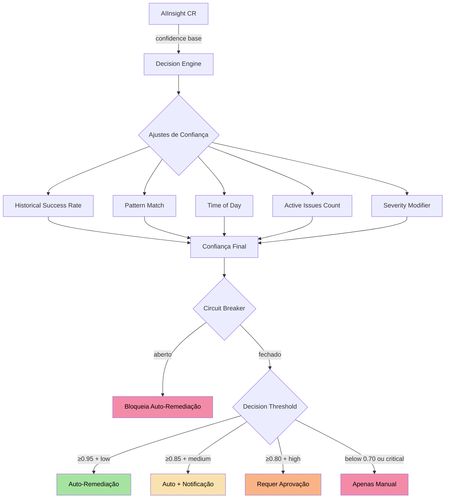
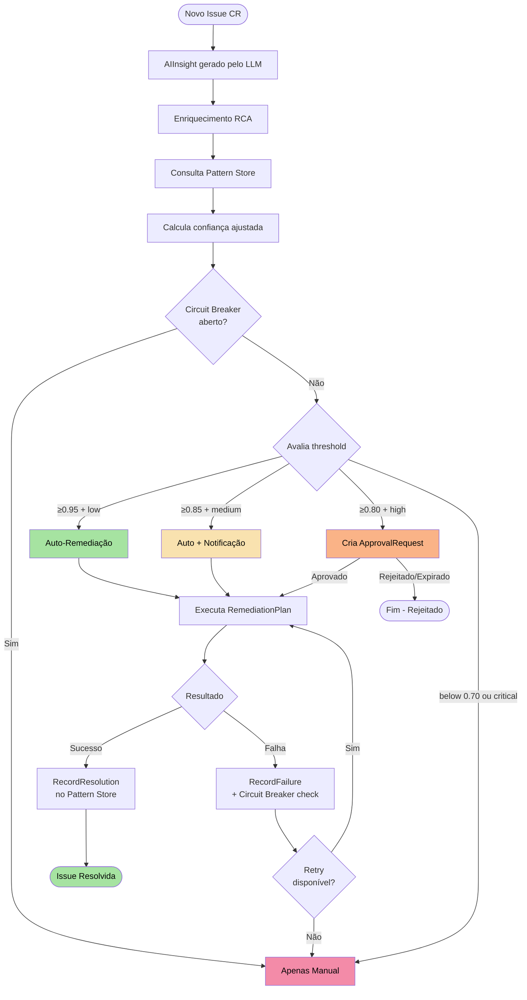

O **Motor de Decisão** é o componente central que determina _quando_ e _como_ a plataforma AIOps deve agir autonomamente. Ele combina confiança calculada, histórico de padrões, enriquecimento de causa raiz e detecção de convergência para tomar decisões seguras em produção.

<Info>
  O Motor de Decisão nunca age às cegas. Cada decisão passa por um pipeline de
  ajustes de confiança, verificações de circuit breaker e validação de padrões
  antes de qualquer ação ser executada.
</Info>

---

## Visão Geral da Arquitetura



---

## Confiança Base (AIInsight)

Todo o processo começa com o campo `confidence` do `AIInsight` CR, que é gerado pelo provedor LLM durante a análise de causa raiz. Esse valor representa a certeza da IA sobre o diagnóstico e as ações sugeridas.

<CardGroup cols={2}>
  <Card title="Confiança Alta" icon="circle-check">
    **0.90 - 1.00** — A IA identificou o problema com alta precisão. Cenários bem
    conhecidos como OOMKilled, CrashLoopBackOff com imagem inválida.
  </Card>
  <Card title="Confiança Média" icon="circle-half-stroke">
    **0.70 - 0.89** — Diagnóstico provável mas com incerteza. Problemas de
    performance, resource pressure, dependências intermitentes.
  </Card>
  <Card title="Confiança Baixa" icon="circle-xmark">
    **0.50 - 0.69** — A IA não tem certeza suficiente. Problemas complexos com
    múltiplas causas possíveis.
  </Card>
  <Card title="Confiança Muito Baixa" icon="triangle-exclamation">
    **&lt; 0.50** — Cenário desconhecido ou dados insuficientes. Sempre requer
    intervenção humana.
  </Card>
</CardGroup>

---

## Fatores de Ajuste de Confiança

A confiança base nunca é usada diretamente. Ela passa por **5 fatores de ajuste** que a refinam com base no contexto operacional atual.

### 1. Taxa de Sucesso Histórica

<Steps>
  <Step title="Consulta o Pattern Store">
    O engine calcula a taxa de sucesso de remediações anteriores para o mesmo
    tipo de sinal (`signalType`).
  </Step>
  <Step title="Aplica o ajuste">
    - **Taxa de sucesso alta** (>80%): ajuste de **+0.10**
    - **Taxa de sucesso baixa** (&lt;40%): ajuste de **-0.10**
    - **Sem histórico**: nenhum ajuste (0.00)
  </Step>
</Steps>

```go
// Cálculo do ajuste histórico
if successRate > 0.8 {
    adjustment += 0.10
} else if successRate < 0.4 {
    adjustment -= 0.10
}
```

### 2. Pattern Match (Correspondência de Padrão)

Quando o Pattern Store encontra um padrão previamente resolvido que corresponde ao incidente atual, a confiança recebe um boost significativo.

| Condição | Ajuste |
|----------|--------|
| Padrão encontrado com resolução bem-sucedida | **+0.15** |
| Nenhum padrão correspondente | **0.00** |

<Tip>
  O Pattern Match é o fator mais poderoso. Um incidente idêntico resolvido
  anteriormente pode elevar a confiança o suficiente para permitir auto-remediação
  mesmo em cenários que normalmente exigiriam aprovação.
</Tip>

### 3. Horário do Dia (Time of Day)

Ações automáticas fora do horário comercial carregam risco adicional porque há menos engenheiros disponíveis para intervir caso algo dê errado.

| Condição | Ajuste |
|----------|--------|
| Dentro do horário comercial (09:00-18:00 local) | **0.00** |
| Fora do horário comercial | **-0.05** |

### 4. Issues Ativas Simultâneas

Quando o cluster está sob pressão com múltiplos incidentes ativos, o motor se torna mais conservador para evitar ações em cadeia que possam agravar a situação.

| Condição | Ajuste |
|----------|--------|
| Até 3 issues ativas | **0.00** |
| Cada issue além de 3 | **-0.02 por issue** |

```go
// Exemplo: 7 issues ativas
// Ajuste = -(7 - 3) * 0.02 = -0.08
activeIssues := countActiveIssues(namespace)
if activeIssues > 3 {
    adjustment -= float64(activeIssues - 3) * 0.02
}
```

<Warning>
  Com 10 ou mais issues ativas simultâneas, o ajuste cumulativo (-0.14 ou mais)
  torna praticamente impossível atingir o threshold de auto-remediação, forçando
  revisão humana — exatamente o comportamento desejado durante um incidente em
  cascata.
</Warning>

### 5. Severidade do Incidente

A severidade do `Issue` CR aplica um modificador fixo que reflete o risco operacional inerente.

| Severidade | Ajuste | Justificativa |
|-----------|--------|---------------|
| **critical** | **-0.10** | Impacto em produção, requer máxima cautela |
| **high** | **-0.05** | Risco significativo, conservadorismo moderado |
| **medium** | **0.00** | Nível padrão, sem ajuste |
| **low** | **+0.05** | Baixo risco, favorece automação |

---

## Exemplo Prático de Cálculo

<Accordion title="Cenário: CrashLoopBackOff após deploy em horário comercial">
  **Dados do incidente:**
  - Confiança base do AIInsight: **0.88**
  - Severidade: **high**
  - Horário: 14:30 (horário comercial)
  - Issues ativas: 2
  - Pattern Store: padrão encontrado (rollback bem-sucedido há 5 dias)
  - Taxa de sucesso histórica: 90%

  **Cálculo:**
  ```
  Base:                    0.88
  + Historical success:   +0.10  (90% > 80%)
  + Pattern match:        +0.15  (padrão encontrado)
  + Time of day:           0.00  (horário comercial)
  + Active issues:         0.00  (2 ≤ 3)
  + Severity (high):      -0.05
  ─────────────────────────────
  Confiança final:         1.00  (capped at 1.0)
  ```

  **Decisão:** Confiança 1.00 + severidade high = **Requer aprovação** (threshold ≥0.80 + high).

  Mesmo com confiança máxima, incidentes `high` sempre exigem aprovação humana.
</Accordion>

<Accordion title="Cenário: Pod com OOMKilled em namespace de staging à noite">
  **Dados do incidente:**
  - Confiança base do AIInsight: **0.92**
  - Severidade: **low**
  - Horário: 02:15 (fora do horário comercial)
  - Issues ativas: 1
  - Pattern Store: padrão encontrado (ajuste de memória bem-sucedido)
  - Taxa de sucesso histórica: 95%

  **Cálculo:**
  ```
  Base:                    0.92
  + Historical success:   +0.10  (95% > 80%)
  + Pattern match:        +0.15  (padrão encontrado)
  + Time of day:          -0.05  (fora do horário)
  + Active issues:         0.00  (1 ≤ 3)
  + Severity (low):       +0.05
  ─────────────────────────────
  Confiança final:         1.00  (capped at 1.0)
  ```

  **Decisão:** Confiança 1.00 + severidade low = **Auto-remediação** (threshold ≥0.95 + low).
</Accordion>

<Accordion title="Cenário: Problema desconhecido em cluster sobrecarregado">
  **Dados do incidente:**
  - Confiança base do AIInsight: **0.65**
  - Severidade: **critical**
  - Horário: 10:00 (horário comercial)
  - Issues ativas: 8
  - Pattern Store: nenhum padrão correspondente
  - Taxa de sucesso histórica: 30%

  **Cálculo:**
  ```
  Base:                    0.65
  + Historical success:   -0.10  (30% &lt; 40%)
  + Pattern match:         0.00  (nenhum padrão)
  + Time of day:           0.00  (horário comercial)
  + Active issues:        -0.10  (8-3=5 × 0.02)
  + Severity (critical):  -0.10
  ─────────────────────────────
  Confiança final:         0.35
  ```

  **Decisão:** Confiança 0.35 + severidade critical = **Apenas manual** (&lt;0.70 ou critical).
</Accordion>

---

## Thresholds de Decisão

A combinação de confiança final e severidade determina o nível de autonomia permitido.

<Tabs>
  <Tab title="Auto-Remediação Completa">
    **Requisitos:** Confiança ≥ 0.95 **e** severidade `low`

    A plataforma executa a remediação automaticamente sem qualquer intervenção humana.
    O `RemediationPlan` é criado e executado imediatamente.

    ```yaml
    # RemediationPlan gerado automaticamente
    apiVersion: platform.chatcli.io/v1alpha1
    kind: RemediationPlan
    metadata:
      name: auto-fix-oom-api-server
      annotations:
        platform.chatcli.io/decision-mode: "auto"
        platform.chatcli.io/confidence: "0.97"
    spec:
      issueRef:
        name: issue-oom-api-server
      actions:
        - type: AdjustResources
          target: deployment/api-server
          parameters:
            memoryLimit: "512Mi"
            memoryRequest: "256Mi"
    ```
  </Tab>
  <Tab title="Auto com Notificação">
    **Requisitos:** Confiança ≥ 0.85 **e** severidade `medium`

    A remediação é executada automaticamente, mas uma notificação é enviada
    aos operadores para awareness. O `RemediationPlan` inclui a annotation
    de notificação.

    ```yaml
    metadata:
      annotations:
        platform.chatcli.io/decision-mode: "auto-notify"
        platform.chatcli.io/confidence: "0.89"
        platform.chatcli.io/notify: "true"
    ```
  </Tab>
  <Tab title="Requer Aprovação">
    **Requisitos:** Confiança ≥ 0.80 **e** severidade `high`

    Um `ApprovalRequest` CR é criado e a remediação fica pendente até que um
    operador com a role adequada aprove a execução.

    ```yaml
    apiVersion: platform.chatcli.io/v1alpha1
    kind: ApprovalRequest
    metadata:
      name: approval-rollback-payment-svc
    spec:
      remediationPlanRef:
        name: plan-rollback-payment-svc
      requiredRole: Operator
      expiresIn: 30m
      summary: "Rollback do deployment payment-svc para revisão 42"
    status:
      state: Pending
    ```
  </Tab>
  <Tab title="Apenas Manual">
    **Requisitos:** Confiança &lt; 0.70 **ou** severidade `critical`

    Nenhuma ação automática é tomada. O `Issue` é marcado como
    `RequiresManualIntervention` e um alerta é enviado à equipe de plantão.

    ```yaml
    status:
      phase: RequiresManualIntervention
      conditions:
        - type: AutoRemediationBlocked
          status: "True"
          reason: "LowConfidenceOrCritical"
          message: "Confiança 0.35 abaixo do threshold; severidade critical"
    ```
  </Tab>
</Tabs>

---

## Circuit Breaker

O circuit breaker é um mecanismo de segurança que **bloqueia todas as auto-remediações** quando detecta falhas consecutivas, prevenindo que a plataforma cause danos em cascata.

<Steps>
  <Step title="Monitoramento de Falhas">
    Cada falha de remediação é registrada com timestamp. O circuit breaker
    mantém uma janela deslizante de **1 hora**.
  </Step>
  <Step title="Disparo do Circuit Breaker">
    Quando **3 ou mais falhas** ocorrem dentro da janela de 1 hora, o circuit
    breaker **abre** e bloqueia toda auto-remediação no namespace.
  </Step>
  <Step title="Estado Aberto">
    Enquanto aberto, todos os `RemediationPlan` CRs são criados com
    `requiresApproval: true`, independente da confiança calculada.
  </Step>
  <Step title="Reset">
    O circuit breaker fecha automaticamente após o período de cooldown ou quando
    um operador faz reset manual via annotation.
  </Step>
</Steps>

```go
type CircuitBreaker struct {
    failures    []time.Time
    window      time.Duration  // 1 hora
    threshold   int            // 3 falhas
    isOpen      bool
    mu          sync.Mutex
}

func (cb *CircuitBreaker) RecordFailure() {
    cb.mu.Lock()
    defer cb.mu.Unlock()
    now := time.Now()
    cb.failures = append(cb.failures, now)

    // Remove falhas fora da janela
    cutoff := now.Add(-cb.window)
    var recent []time.Time
    for _, f := range cb.failures {
        if f.After(cutoff) {
            recent = append(recent, f)
        }
    }
    cb.failures = recent

    if len(cb.failures) >= cb.threshold {
        cb.isOpen = true
    }
}

func (cb *CircuitBreaker) IsOpen() bool {
    cb.mu.Lock()
    defer cb.mu.Unlock()
    return cb.isOpen
}
```

<Warning>
  Quando o circuit breaker está aberto, a annotation
  `platform.chatcli.io/circuit-breaker: open` é adicionada ao namespace.
  Isso é visível via `kubectl get ns &lt;namespace&gt; -o yaml` para diagnóstico
  rápido.
</Warning>

---

## Pattern Store

O Pattern Store é o sistema de aprendizado de padrões da plataforma. Ele permite que a AIOps "lembre" de incidentes passados e use essa memória para tomar decisões mais informadas.

### Fingerprinting SHA256

Cada padrão é identificado por uma fingerprint única calculada como:

```
SHA256(signalType | resourceKind | severity)
```

**Exemplos de fingerprints:**

| Signal Type | Resource Kind | Severity | Fingerprint (truncada) |
|------------|--------------|----------|----------------------|
| `CrashLoopBackOff` | `Deployment` | `high` | `a3f8c2...` |
| `OOMKilled` | `Pod` | `medium` | `7b1d9e...` |
| `FailedScheduling` | `Pod` | `low` | `c4e6a1...` |
| `ImagePullBackOff` | `Deployment` | `high` | `2d8f5b...` |

### Armazenamento em ConfigMap

Os padrões são persistidos em um `ConfigMap` dedicado no namespace do operator:

```yaml
apiVersion: v1
kind: ConfigMap
metadata:
  name: chatcli-pattern-store
  namespace: chatcli-system
  labels:
    app.kubernetes.io/component: pattern-store
    platform.chatcli.io/managed-by: decision-engine
data:
  patterns.json: |
    {
      "a3f8c2...": {
        "signalType": "CrashLoopBackOff",
        "resourceKind": "Deployment",
        "severity": "high",
        "totalOccurrences": 12,
        "successfulResolutions": 10,
        "lastResolution": {
          "action": "Rollback",
          "timestamp": "2026-03-18T14:30:00Z",
          "durationSeconds": 45
        },
        "averageResolutionTime": "38s"
      }
    }
```

### RecordResolution e RecordFailure

<CodeGroup>
```go RecordResolution
func (ps *PatternStore) RecordResolution(fingerprint string, action string) {
    ps.mu.Lock()
    defer ps.mu.Unlock()

    pattern, exists := ps.patterns[fingerprint]
    if !exists {
        pattern = &Pattern{Fingerprint: fingerprint}
        ps.patterns[fingerprint] = pattern
    }

    pattern.TotalOccurrences++
    pattern.SuccessfulResolutions++
    pattern.LastResolution = &Resolution{
        Action:    action,
        Timestamp: time.Now(),
    }

    ps.persistToConfigMap()
}
```

```go RecordFailure
func (ps *PatternStore) RecordFailure(fingerprint string, reason string) {
    ps.mu.Lock()
    defer ps.mu.Unlock()

    pattern, exists := ps.patterns[fingerprint]
    if !exists {
        pattern = &Pattern{Fingerprint: fingerprint}
        ps.patterns[fingerprint] = pattern
    }

    pattern.TotalOccurrences++
    pattern.LastFailureReason = reason

    ps.persistToConfigMap()
}
```
</CodeGroup>

### Cálculo do Confidence Boost

O boost de confiança derivado do Pattern Store é calculado diretamente a partir da taxa de sucesso:

```
ConfidenceBoost = successRate * 0.15
```

| Taxa de Sucesso | Confidence Boost | Exemplo |
|----------------|------------------|---------|
| 100% (10/10) | +0.150 | Todos os rollbacks bem-sucedidos |
| 80% (8/10) | +0.120 | Maioria dos ajustes de recursos funcionou |
| 50% (5/10) | +0.075 | Resultados mistos |
| 20% (2/10) | +0.030 | A maioria falhou |

### Cenário: Incidente Similar Recente

<Accordion title="'Incidente similar resolvido 3 dias atrás com rollback'">
  Quando o Pattern Store encontra uma correspondência, o motor adiciona contexto
  ao `AIInsight` e ao `RemediationPlan`:

  ```yaml
  status:
    patternMatch:
      found: true
      fingerprint: "a3f8c2..."
      previousResolution:
        action: "Rollback"
        daysAgo: 3
        wasSuccessful: true
        message: "Incidente similar resolvido 3 dias atrás com rollback"
      confidenceBoost: 0.15
      successRate: 0.83
  ```

  Essa informação é exibida no `Issue` CR para que operadores possam ver
  rapidamente que o problema já foi resolvido antes e como.
</Accordion>

---

## Enriquecimento de Causa Raiz (RCA)

Antes de tomar qualquer decisão, o motor enriquece o contexto do incidente com dados adicionais do cluster. Esse enriquecimento alimenta tanto o LLM (para melhor diagnóstico) quanto o motor de decisão (para ajustes mais precisos).

### DeploymentChange Detection

O motor verifica se houve uma mudança de deploy recente comparando revisões de ReplicaSets:

```go
func (r *RCAEnricher) DetectDeploymentChange(ctx context.Context,
    deployment *appsv1.Deployment) (*DeploymentChange, error) {

    // Lista ReplicaSets do deployment
    rsList, _ := r.client.AppsV1().ReplicaSets(deployment.Namespace).List(ctx,
        metav1.ListOptions{
            LabelSelector: labels.SelectorFromSet(deployment.Spec.Selector.MatchLabels).String(),
        })

    // Compara revisões (annotation deployment.kubernetes.io/revision)
    current, previous := findCurrentAndPrevious(rsList.Items)

    if current != nil && previous != nil {
        return &DeploymentChange{
            RevisionBefore: previous.Annotations["deployment.kubernetes.io/revision"],
            RevisionAfter:  current.Annotations["deployment.kubernetes.io/revision"],
            ImageBefore:    previous.Spec.Template.Spec.Containers[0].Image,
            ImageAfter:     current.Spec.Template.Spec.Containers[0].Image,
            Timestamp:      current.CreationTimestamp.Time,
        }, nil
    }
    return nil, nil
}
```

**Resultado do enriquecimento:**

```yaml
rcaEnrichment:
  deploymentChange:
    detected: true
    revisionBefore: "5"
    revisionAfter: "6"
    imageBefore: "api-server:v2.3.1"
    imageAfter: "api-server:v2.4.0"
    timestamp: "2026-03-19T10:15:00Z"
```

### ConfigChange Detection

O motor busca eventos do Kubernetes relacionados a atualizações de ConfigMaps e Secrets:

```yaml
rcaEnrichment:
  configChanges:
    - resource: "ConfigMap/api-config"
      field: "database.maxConnections"
      timestamp: "2026-03-19T10:12:00Z"
      reason: "Updated via kubectl"
```

### Related Issues

Lista issues ativas no mesmo namespace que podem estar correlacionadas:

```yaml
rcaEnrichment:
  relatedIssues:
    - name: issue-high-latency-redis
      severity: medium
      signalType: HighLatency
      resource: deployment/redis-cache
    - name: issue-memory-pressure-node2
      severity: high
      signalType: MemoryPressure
      resource: node/worker-2
```

### Dependency Status

Verifica a saúde dos Services e Endpoints dos quais o recurso afetado depende:

```yaml
rcaEnrichment:
  dependencyStatus:
    - service: database-svc
      endpointsReady: 3
      endpointsTotal: 3
      healthy: true
    - service: redis-svc
      endpointsReady: 0
      endpointsTotal: 2
      healthy: false
      reason: "Nenhum endpoint pronto"
```

### Time Correlation

O motor calcula a correlação temporal entre mudanças detectadas e o início do incidente:

```yaml
rcaEnrichment:
  timeCorrelation:
    deploymentChange:
      minutesBefore: 3
      message: "Deploy mudou 3 min antes do incidente"
      correlationStrength: "strong"
    configChange:
      minutesBefore: 12
      message: "ConfigMap atualizado 12 min antes do incidente"
      correlationStrength: "moderate"
```

<Note>
  Correlação temporal forte (&lt; 5 min) eleva automaticamente a causa para o topo
  da lista de `PossibleCauses`, pois a probabilidade de relação causal é alta.
</Note>

### PossibleCauses Ranking

Todas as causas possíveis são ranqueadas por probabilidade com base nos dados de enriquecimento:

```yaml
rcaEnrichment:
  possibleCauses:
    - rank: 1
      cause: "Nova versão da imagem (v2.4.0) introduziu memory leak"
      confidence: 0.85
      evidence:
        - "Deploy ocorreu 3 min antes do primeiro OOMKilled"
        - "Imagem mudou de v2.3.1 para v2.4.0"
        - "Padrão similar resolvido com rollback há 5 dias"
    - rank: 2
      cause: "Memory limit insuficiente para carga atual"
      confidence: 0.45
      evidence:
        - "Uso de memória crescente nas últimas 2 horas"
        - "Sem mudança recente nos limits"
    - rank: 3
      cause: "Dependência redis-svc degradada causando retry storm"
      confidence: 0.30
      evidence:
        - "redis-svc com 0/2 endpoints prontos"
        - "Correlação temporal fraca"
```

---

## Detector de Convergência

O Detector de Convergência é projetado para o **loop agêntico** de remediação. Ele monitora as observações do agente para determinar se a situação está melhorando, estagnada ou piorando.

### IsConverged

Verifica se as últimas **3 observações** são idênticas, indicando que o sistema atingiu um estado estável (para melhor ou pior).

```go
func (cd *ConvergenceDetector) IsConverged(observations []string) bool {
    if len(observations) < 3 {
        return false
    }
    last3 := observations[len(observations)-3:]
    return last3[0] == last3[1] && last3[1] == last3[2]
}
```

### IsOscillating

Detecta padrões de oscilação **A-B-A-B** onde o sistema alterna entre dois estados sem progresso real.

```go
func (cd *ConvergenceDetector) IsOscillating(observations []string) bool {
    if len(observations) < 4 {
        return false
    }
    last4 := observations[len(observations)-4:]
    // Padrão A→B→A→B
    return last4[0] == last4[2] && last4[1] == last4[3] && last4[0] != last4[1]
}
```

<Warning>
  Oscilação é um sinal forte de que a ação de remediação está criando o problema
  que tenta resolver. Quando detectada, o loop agêntico é interrompido
  imediatamente e o incidente é escalado para intervenção humana.
</Warning>

### ShouldStop

Função principal que combina todos os critérios de parada do loop agêntico:

```go
func (cd *ConvergenceDetector) ShouldStop(
    observations []string,
    startTime time.Time,
    consecutiveFailures int,
) (bool, string) {
    // 1. Convergência
    if cd.IsConverged(observations) {
        return true, "Sistema convergiu (3 observações idênticas)"
    }

    // 2. Oscilação
    if cd.IsOscillating(observations) {
        return true, "Oscilação detectada (padrão A→B→A→B)"
    }

    // 3. Timeout (10 minutos)
    if time.Since(startTime) > 10*time.Minute {
        return true, "Timeout do loop agêntico (10 min)"
    }

    // 4. Falhas consecutivas
    if consecutiveFailures >= 5 {
        return true, "5 falhas consecutivas"
    }

    return false, ""
}
```

| Critério | Condição | Ação |
|----------|----------|------|
| Convergência | 3 observações idênticas | Para o loop, marca como resolvido ou não |
| Oscilação | Padrão A-B-A-B | Para o loop, escala para humano |
| Timeout | > 10 minutos | Para o loop, escala para humano |
| Falhas consecutivas | ≥ 5 falhas | Para o loop, dispara circuit breaker |

### EstimateProgress

Estima o progresso do loop agêntico de 0.0 a 1.0, usado para feedback visual e logging:

```go
func (cd *ConvergenceDetector) EstimateProgress(
    currentStep int,
    maxSteps int,
    lastObservation string,
    targetState string,
) float64 {
    // Progresso base pelo número de steps
    stepProgress := float64(currentStep) / float64(maxSteps)

    // Ajuste se a observação indica melhoria
    if strings.Contains(lastObservation, "healthy") ||
       strings.Contains(lastObservation, "running") {
        return math.Min(1.0, stepProgress + 0.2)
    }

    return stepProgress
}
```

---

## Fluxo Completo de Decisão



---

## Métricas do Motor de Decisão

O motor expõe métricas Prometheus para observabilidade:

| Métrica | Tipo | Descrição |
|---------|------|-----------|
| `decision_engine_evaluations_total` | Counter | Total de avaliações de confiança |
| `decision_engine_confidence_histogram` | Histogram | Distribuição de confiança final |
| `decision_engine_auto_remediations_total` | Counter | Total de auto-remediações por modo |
| `decision_engine_circuit_breaker_state` | Gauge | Estado do circuit breaker (0=fechado, 1=aberto) |
| `decision_engine_pattern_matches_total` | Counter | Total de correspondências no Pattern Store |
| `decision_engine_rca_enrichment_duration` | Histogram | Tempo de enriquecimento RCA |
| `decision_engine_convergence_stops_total` | Counter | Total de paradas por tipo (convergência, oscilação, timeout, falhas) |

```yaml
# Exemplo de alerta Prometheus
groups:
  - name: decision-engine
    rules:
      - alert: CircuitBreakerOpen
        expr: decision_engine_circuit_breaker_state == 1
        for: 5m
        labels:
          severity: warning
        annotations:
          summary: "Circuit breaker do motor de decisão aberto"
          description: "3+ falhas de remediação na última hora. Auto-remediação bloqueada."
      - alert: LowPatternMatchRate
        expr: >
          rate(decision_engine_pattern_matches_total[1h])
          / rate(decision_engine_evaluations_total[1h]) < 0.1
        for: 24h
        labels:
          severity: info
        annotations:
          summary: "Baixa taxa de correspondência de padrões"
          description: "Menos de 10% dos incidentes têm padrão conhecido. Considere revisar runbooks."
```

---

## Próximos Passos

<CardGroup cols={2}>
  <Card title="Federação Multi-Cluster" icon="network-wired" href="/features/aiops/federation">
    Veja como o motor de decisão opera em ambientes multi-cluster com políticas
    por tier.
  </Card>
  <Card title="Chaos Engineering" icon="explosion" href="/features/aiops/chaos-engineering">
    Valide as decisões do motor com experimentos de chaos controlados.
  </Card>
  <Card title="Auditoria e Compliance" icon="clipboard-check" href="/features/aiops/audit-compliance">
    Cada decisão gera um AuditEvent imutável para rastreabilidade.
  </Card>
  <Card title="AIOps Platform" icon="brain" href="/features/aiops-platform">
    Retorne à visão geral completa da plataforma AIOps.
  </Card>
</CardGroup>
