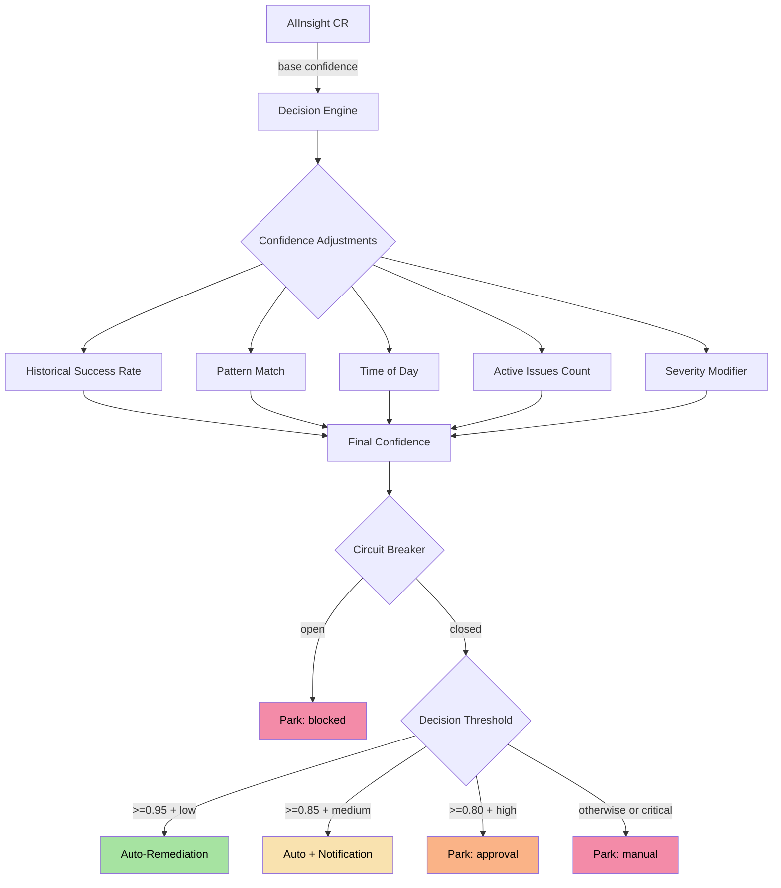
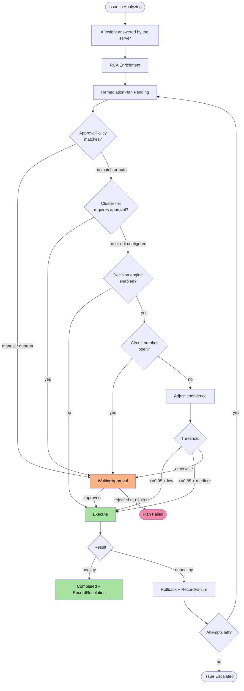

The **Decision Engine** is the central component that determines _when_ and _how_ the AIOps platform should act autonomously. It combines calculated confidence, historical patterns, root cause enrichment, and convergence detection to make safe decisions in production.

<Info>
  The Decision Engine never acts blindly. Every decision goes through a pipeline of
  confidence adjustments, circuit breaker checks, and pattern validation
  before any action is executed.
</Info>


## Architecture Overview


```mermaid
flowchart TD
    A[AIInsight CR] -->|base confidence| B[Decision Engine]
    B --> C{Confidence Adjustments}
    C --> D[Historical Success Rate]
    C --> E[Pattern Match]
    C --> F[Time of Day]
    C --> G[Active Issues Count]
    C --> H[Severity Modifier]
    D & E & F & G & H --> I[Final Confidence]
    I --> J{Circuit Breaker}
    J -->|open| K[Park: blocked]
    J -->|closed| L{Decision Threshold}
    L -->|>=0.95 + low| M[Auto-Remediation]
    L -->|>=0.85 + medium| N[Auto + Notification]
    L -->|>=0.80 + high| O[Park: approval]
    L -->|otherwise or critical| P[Park: manual]
    style M fill:#a6e3a1,color:#000
    style N fill:#f9e2af,color:#000
    style O fill:#fab387,color:#000
    style P fill:#f38ba8,color:#000
    style K fill:#f38ba8,color:#000
```

### Enabling the engine

The engine is **off by default**: ApprovalPolicies are then the only gate. Turn it on per operator:

```yaml
# Helm values (chatcli-operator)
decisionEngine:
  enabled: true
```

or set `CHATCLI_OPERATOR_DECISION_ENGINE=true` on the operator Deployment. The RemediationReconciler then evaluates every plan that reaches `Pending`, after the ApprovalPolicies and the [cluster tier](/features/aiops/federation#remediation-policy-per-tier) had their say: a plan an ApprovalPolicy already parked is not re-evaluated, a plan an `auto` rule let through still is.

Every evaluation leaves its verdict on the plan, whether it ran or waited:

```yaml
metadata:
  annotations:
    platform.chatcli.io/decision-mode: "auto-notify"   # auto | auto-notify | approval | manual | blocked
    platform.chatcli.io/confidence: "0.91"             # final confidence after adjustments
    platform.chatcli.io/risk: "medium"                 # low | medium | high | critical
    platform.chatcli.io/decision-reason: "Auto-approved with notification: confidence 0.91 + medium severity"
```

A plan that must wait is parked in `WaitingApproval` under the synthetic policy `decision-engine`: an ApprovalRequest with `policyRef: decision-engine`, one required approver and a 30-minute timeout, decided like any other request (dashboard, `platform.chatcli.io/approve` annotation or the REST API). No ApprovalPolicy object is needed.


## Base Confidence (AIInsight)

The entire process starts with the `confidence` field of the `AIInsight` CR, which is generated by the LLM provider during root cause analysis. This value represents the AI's certainty about the diagnosis and suggested actions.

<CardGroup cols={2}>
  <Card title="High Confidence" icon="circle-check">
    **0.90 - 1.00** -- The AI identified the problem with high precision. Well-known
    scenarios like OOMKilled, CrashLoopBackOff with invalid image.
  </Card>
  <Card title="Medium Confidence" icon="circle-half-stroke">
    **0.70 - 0.89** -- Probable diagnosis but with uncertainty. Performance
    issues, resource pressure, intermittent dependencies.
  </Card>
  <Card title="Low Confidence" icon="circle-xmark">
    **0.50 - 0.69** -- The AI does not have sufficient certainty. Complex problems
    with multiple possible causes.
  </Card>
  <Card title="Very Low Confidence" icon="triangle-exclamation">
    **&lt; 0.50** -- Unknown scenario or insufficient data. Always requires
    human intervention.
  </Card>
</CardGroup>


## Confidence Adjustment Factors

The base confidence from the AIInsight is adjusted by five factors, then clamped to `0.0`–`1.0`. Every number below is what the operator applies.

### 1. Historical Success Rate

The engine counts RemediationPlans of the last 30 days in the Issue's namespace whose actions include the plan's first action type, and needs at least **3** finished ones (Completed, Failed or RolledBack) before it adjusts:

| Success rate | Adjustment |
|--------------|------------|
| ≥ 90% | **+0.10** |
| ≥ 70% | **+0.05** |
| 50%–70% | 0.00 |
| < 50% | **−0.10** |
| fewer than 3 finished plans | 0.00 |

Agentic plans carry no pre-planned actions, so this factor does not apply to them.

### 2. Pattern Match

When the [Pattern Store](#pattern-store) holds a resolved pattern with the same signal type, resource kind and severity, its stored `ConfidenceBoost` is added. The boost is learned per pattern from past resolutions; there is no fixed value.

### 3. Time of Day

| Condition | Adjustment |
|-----------|------------|
| 09:00–17:59 **UTC** | 0.00 |
| any other hour | **−0.05** |

The clock is UTC on purpose: the operator has no notion of the team's local business hours.

### 4. Simultaneous Active Issues

Non-terminal Issues in the same namespace, the one being evaluated included:

| Condition | Adjustment |
|-----------|------------|
| up to 3 active issues | 0.00 |
| each issue beyond 3 | **−0.02**, capped at **−0.10** |

### 5. Incident Severity

| Severity | Adjustment |
|----------|------------|
| `critical` | **−0.10** |
| `high` | **−0.05** |
| `medium` | 0.00 |
| `low` | **+0.05** |

## Practical Calculation Example

```text
Issue: error_rate on Deployment checkout (medium), namespace production, 03:10 UTC
AIInsight confidence (base):                       0.88
1. History: 5 finished ScaleDeployment plans,
   4 completed (80%)  → ≥ 70%                      +0.05
2. Pattern Store: matching pattern, boost learned   +0.10
3. Time of day: 03:10 UTC                           −0.05
4. Active issues in namespace: 2                    0.00
5. Severity medium                                  0.00
Final confidence                                   0.98  → clamp keeps 0.98
Verdict: 0.98 ≥ 0.85 and severity medium → auto-notify (executes, operators notified)
```

The same Issue at severity `critical` would end at 0.88 and be parked as `manual`: critical never runs unattended.


## Decision Thresholds

The final confidence and the severity together decide how much autonomy the plan gets.

<Tabs>
  <Tab title="Auto-Remediation">
    **Requirements:** confidence ≥ 0.95 **and** severity `low`

    The plan executes immediately. The verdict stays on the plan:

    ```yaml
    metadata:
      annotations:
        platform.chatcli.io/decision-mode: "auto"
        platform.chatcli.io/confidence: "0.97"
        platform.chatcli.io/risk: "low"
    ```
  </Tab>
  <Tab title="Auto with Notification">
    **Requirements:** confidence ≥ 0.85 **and** severity `medium`

    The plan executes; the Issue's state changes reach the NotificationPolicies as usual, so operators are told.

    ```yaml
    metadata:
      annotations:
        platform.chatcli.io/decision-mode: "auto-notify"
        platform.chatcli.io/confidence: "0.89"
        platform.chatcli.io/risk: "medium"
    ```
  </Tab>
  <Tab title="Requires Approval">
    **Requirements:** confidence ≥ 0.80 **and** severity `high`

    The plan waits in `WaitingApproval`. The ApprovalRequest points at the synthetic policy:

    ```yaml
    apiVersion: platform.chatcli.io/v1alpha1
    kind: ApprovalRequest
    metadata:
      name: approval-checkout-error-rate-plan-1
    spec:
      remediationPlanRef: checkout-error-rate-plan-1
      policyRef: decision-engine
      ruleName: decision-engine
      requiredApprovers: 1
      timeoutMinutes: 30
    status:
      state: Pending
    ```

    The plan carries `decision-mode: approval`. Approve or reject it like any request; after 30 minutes without a decision it expires and the plan fails.
  </Tab>
  <Tab title="Manual">
    **Requirements:** severity `critical`, or any severity below its threshold

    Same mechanism as above, with `decision-mode: manual` and the reason spelled out, for example `Manual approval required: critical severity (confidence 0.88)`. Nothing runs until a human decides.
  </Tab>
</Tabs>

<Note>
  A plan that an ApprovalPolicy already parked is not evaluated again. A plan an `auto` rule let through still is: the engine can only add caution, never remove a policy's gate.
</Note>

## Circuit Breaker

The circuit breaker blocks every new plan in a namespace when remediations there keep failing, so the platform stops compounding damage.

<Steps>
  <Step title="Failure window">
    On each evaluation the engine counts RemediationPlans in the namespace that ended `Failed` or `RolledBack` within the last **1 hour**. The time of failure is `completedAt`, or `startedAt` when a failure path did not stamp it, or the plan's creation time.
  </Step>
  <Step title="Open">
    **3 or more** failures in the window open the breaker: the plan is parked as `decision-mode: blocked` with the reason `Circuit breaker open: 3 remediations failed in last hour`, and `chatcli_operator_decision_engine_circuit_breaker_state{namespace}` reads `1`.
  </Step>
  <Step title="Close">
    The breaker closes on its own once the failures age out of the hour. There is no manual reset: approve the parked requests you want to run, or fix the cause and wait.
  </Step>
</Steps>

The state is derived from the plans on every evaluation, not kept in memory, so an operator restart does not lose it.


## Pattern Store

The Pattern Store is the platform's pattern learning system. It allows AIOps to "remember" past incidents and use that memory to make more informed decisions.

### SHA256 Fingerprinting

Each pattern is identified by a unique fingerprint calculated as:

```
SHA256(signalType | resourceKind | severity)
```

**Fingerprint examples:**

| Signal Type | Resource Kind | Severity | Fingerprint (truncated) |
|------------|--------------|----------|----------------------|
| `CrashLoopBackOff` | `Deployment` | `high` | `a3f8c2...` |
| `OOMKilled` | `Pod` | `medium` | `7b1d9e...` |
| `FailedScheduling` | `Pod` | `low` | `c4e6a1...` |
| `ImagePullBackOff` | `Deployment` | `high` | `2d8f5b...` |

### ConfigMap Storage

Patterns are persisted in a dedicated `ConfigMap` in the operator namespace:

```yaml
apiVersion: v1
kind: ConfigMap
metadata:
  name: chatcli-pattern-store
  namespace: chatcli-system
  labels:
    app.kubernetes.io/component: pattern-store
    platform.chatcli.io/managed-by: decision-engine
data:
  patterns.json: |
    {
      "a3f8c2...": {
        "signalType": "CrashLoopBackOff",
        "resourceKind": "Deployment",
        "severity": "high",
        "totalOccurrences": 12,
        "successfulResolutions": 10,
        "lastResolution": {
          "action": "Rollback",
          "timestamp": "2026-03-18T14:30:00Z",
          "durationSeconds": 45
        },
        "averageResolutionTime": "38s"
      }
    }
```

### RecordResolution and RecordFailure

<CodeGroup>
```go RecordResolution
func (ps *PatternStore) RecordResolution(fingerprint string, action string) {
    ps.mu.Lock()
    defer ps.mu.Unlock()

    pattern, exists := ps.patterns[fingerprint]
    if !exists {
        pattern = &Pattern{Fingerprint: fingerprint}
        ps.patterns[fingerprint] = pattern
    }

    pattern.TotalOccurrences++
    pattern.SuccessfulResolutions++
    pattern.LastResolution = &Resolution{
        Action:    action,
        Timestamp: time.Now(),
    }

    ps.persistToConfigMap()
}
```

```go RecordFailure
func (ps *PatternStore) RecordFailure(fingerprint string, reason string) {
    ps.mu.Lock()
    defer ps.mu.Unlock()

    pattern, exists := ps.patterns[fingerprint]
    if !exists {
        pattern = &Pattern{Fingerprint: fingerprint}
        ps.patterns[fingerprint] = pattern
    }

    pattern.TotalOccurrences++
    pattern.LastFailureReason = reason

    ps.persistToConfigMap()
}
```
</CodeGroup>

### Confidence Boost Calculation

The confidence boost derived from the Pattern Store is calculated directly from the success rate:

```
ConfidenceBoost = successRate * 0.15
```

| Success Rate | Confidence Boost | Example |
|-------------|------------------|---------|
| 100% (10/10) | +0.150 | All rollbacks successful |
| 80% (8/10) | +0.120 | Most resource adjustments worked |
| 50% (5/10) | +0.075 | Mixed results |
| 20% (2/10) | +0.030 | Most failed |

### Scenario: Recent Similar Incident

<Accordion title="'Similar incident resolved 3 days ago with rollback'">
  When the Pattern Store finds a match, the engine adds context
  to the `AIInsight` and the `RemediationPlan`:

  ```yaml
  status:
    patternMatch:
      found: true
      fingerprint: "a3f8c2..."
      previousResolution:
        action: "Rollback"
        daysAgo: 3
        wasSuccessful: true
        message: "Similar incident resolved 3 days ago with rollback"
      confidenceBoost: 0.15
      successRate: 0.83
  ```

  This information is displayed in the `Issue` CR so operators can quickly
  see that the problem has been resolved before and how.
</Accordion>


## Root Cause Analysis (RCA) Enrichment

Before making any decision, the engine enriches the incident context with additional cluster data. This enrichment feeds both the LLM (for better diagnosis) and the decision engine (for more precise adjustments).

### DeploymentChange Detection

The engine checks if there was a recent deploy change by comparing ReplicaSet revisions:

```go
func (r *RCAEnricher) DetectDeploymentChange(ctx context.Context,
    deployment *appsv1.Deployment) (*DeploymentChange, error) {

    // List ReplicaSets for the deployment
    rsList, _ := r.client.AppsV1().ReplicaSets(deployment.Namespace).List(ctx,
        metav1.ListOptions{
            LabelSelector: labels.SelectorFromSet(deployment.Spec.Selector.MatchLabels).String(),
        })

    // Compare revisions (annotation deployment.kubernetes.io/revision)
    current, previous := findCurrentAndPrevious(rsList.Items)

    if current != nil && previous != nil {
        return &DeploymentChange{
            RevisionBefore: previous.Annotations["deployment.kubernetes.io/revision"],
            RevisionAfter:  current.Annotations["deployment.kubernetes.io/revision"],
            ImageBefore:    previous.Spec.Template.Spec.Containers[0].Image,
            ImageAfter:     current.Spec.Template.Spec.Containers[0].Image,
            Timestamp:      current.CreationTimestamp.Time,
        }, nil
    }
    return nil, nil
}
```

**Enrichment result:**

```yaml
rcaEnrichment:
  deploymentChange:
    detected: true
    revisionBefore: "5"
    revisionAfter: "6"
    imageBefore: "api-server:v2.3.1"
    imageAfter: "api-server:v2.4.0"
    timestamp: "2026-03-19T10:15:00Z"
```

### ConfigChange Detection

The engine searches for Kubernetes events related to ConfigMap and Secret updates:

```yaml
rcaEnrichment:
  configChanges:
    - resource: "ConfigMap/api-config"
      field: "database.maxConnections"
      timestamp: "2026-03-19T10:12:00Z"
      reason: "Updated via kubectl"
```

### Related Issues

Lists active issues in the same namespace that may be correlated:

```yaml
rcaEnrichment:
  relatedIssues:
    - name: issue-high-latency-redis
      severity: medium
      signalType: HighLatency
      resource: deployment/redis-cache
    - name: issue-memory-pressure-node2
      severity: high
      signalType: MemoryPressure
      resource: node/worker-2
```

### Dependency Status

Checks the health of Services and Endpoints that the affected resource depends on:

```yaml
rcaEnrichment:
  dependencyStatus:
    - service: database-svc
      endpointsReady: 3
      endpointsTotal: 3
      healthy: true
    - service: redis-svc
      endpointsReady: 0
      endpointsTotal: 2
      healthy: false
      reason: "No endpoints ready"
```

### Time Correlation

The engine calculates the temporal correlation between detected changes and the incident start:

```yaml
rcaEnrichment:
  timeCorrelation:
    deploymentChange:
      minutesBefore: 3
      message: "Deploy changed 3 min before the incident"
      correlationStrength: "strong"
    configChange:
      minutesBefore: 12
      message: "ConfigMap updated 12 min before the incident"
      correlationStrength: "moderate"
```

<Note>
  Strong temporal correlation (&lt; 5 min) automatically elevates the cause to the top
  of the `PossibleCauses` list, as the probability of a causal relationship is high.
</Note>

### PossibleCauses Ranking

All possible causes are ranked by probability based on the enrichment data:

```yaml
rcaEnrichment:
  possibleCauses:
    - rank: 1
      cause: "New image version (v2.4.0) introduced a memory leak"
      confidence: 0.85
      evidence:
        - "Deploy occurred 3 min before the first OOMKilled"
        - "Image changed from v2.3.1 to v2.4.0"
        - "Similar pattern resolved with rollback 5 days ago"
    - rank: 2
      cause: "Memory limit insufficient for current load"
      confidence: 0.45
      evidence:
        - "Increasing memory usage over the last 2 hours"
        - "No recent change in limits"
    - rank: 3
      cause: "Degraded redis-svc dependency causing retry storm"
      confidence: 0.30
      evidence:
        - "redis-svc with 0/2 ready endpoints"
        - "Weak temporal correlation"
```


## Convergence Detector

The Convergence Detector is designed for the **agentic remediation loop**. It monitors the agent's observations to determine if the situation is improving, stagnating, or worsening.

### IsConverged

Checks if the last **3 observations** are identical, indicating that the system has reached a stable state (for better or worse).

```go
func (cd *ConvergenceDetector) IsConverged(observations []string) bool {
    if len(observations) < 3 {
        return false
    }
    last3 := observations[len(observations)-3:]
    return last3[0] == last3[1] && last3[1] == last3[2]
}
```

### IsOscillating

Detects **A-B-A-B** oscillation patterns where the system alternates between two states without real progress.

```go
func (cd *ConvergenceDetector) IsOscillating(observations []string) bool {
    if len(observations) < 4 {
        return false
    }
    last4 := observations[len(observations)-4:]
    // Pattern A->B->A->B
    return last4[0] == last4[2] && last4[1] == last4[3] && last4[0] != last4[1]
}
```

<Warning>
  Oscillation is a strong signal that the remediation action is creating the problem
  it is trying to solve. When detected, the agentic loop is interrupted
  immediately and the incident is escalated for human intervention.
</Warning>

### ShouldStop

The RemediationReconciler calls the detector before every agentic step, after the hard limits (max steps, 10-minute timeout):

```go
func (cd *ConvergenceDetector) ShouldStop(history []AgenticStep, elapsed time.Duration) (bool, string)
```

| Criterion | Condition | Reason recorded |
|-----------|-----------|-----------------|
| Convergence | the last 3 observations are identical | `Converged: Last 3 observations identical: …` |
| Oscillation | the last 4 actions alternate A, B, A, B | `Oscillating: between A and B` |
| Approaching timeout | more than 8 minutes elapsed (limit 10) | `Approaching timeout: 8m12s elapsed (limit: 10m)` |
| Repeated failure | the last 5 actions all observed `FAILED:` | `Last 5 actions all failed` |

A stop fails the plan with `status.result` set to `Agentic loop stopped: <reason> (estimated progress NN%)` and increments `chatcli_operator_agentic_convergence_stops_total{reason}` with `converged`, `oscillating`, `timeout` or `failures`. The Issue then retries with its next attempt or escalates, exactly as after any failed plan.

### EstimateProgress

Estimates agentic loop progress from 0.0 to 1.0, used for visual feedback and logging:

```go
func (cd *ConvergenceDetector) EstimateProgress(
    currentStep int,
    maxSteps int,
    lastObservation string,
    targetState string,
) float64 {
    // Base progress by step count
    stepProgress := float64(currentStep) / float64(maxSteps)

    // Adjust if observation indicates improvement
    if strings.Contains(lastObservation, "healthy") ||
       strings.Contains(lastObservation, "running") {
        return math.Min(1.0, stepProgress + 0.2)
    }

    return stepProgress
}
```


## Complete Decision Flow


```mermaid
flowchart TD
    START([Issue in Analyzing]) --> INSIGHT[AIInsight answered by the server]
    INSIGHT --> RCA[RCA Enrichment]
    RCA --> PLAN[RemediationPlan Pending]
    PLAN --> POLICY{ApprovalPolicy<br/>matches?}
    POLICY -->|manual / quorum| PARK[WaitingApproval]
    POLICY -->|no match or auto| TIER{Cluster tier<br/>requires approval?}
    TIER -->|yes| PARK
    TIER -->|no or not configured| ENGINE{Decision engine<br/>enabled?}
    ENGINE -->|no| EXEC[Execute]
    ENGINE -->|yes| CB{Circuit breaker<br/>open?}
    CB -->|yes| PARK
    CB -->|no| CALC[Adjust confidence]
    CALC --> THRESHOLD{Threshold}
    THRESHOLD -->|>=0.95 + low| EXEC
    THRESHOLD -->|>=0.85 + medium| EXEC
    THRESHOLD -->|otherwise| PARK
    PARK -->|approved| EXEC
    PARK -->|rejected or expired| FAIL([Plan Failed])
    EXEC --> RESULT{Result}
    RESULT -->|healthy| OK[Completed + RecordResolution]
    RESULT -->|unhealthy| RB[Rollback + RecordFailure]
    RB --> RETRY{Attempts left?}
    RETRY -->|yes| PLAN
    RETRY -->|no| ESC([Issue Escalated])
    style EXEC fill:#a6e3a1,color:#000
    style PARK fill:#fab387,color:#000
    style FAIL fill:#f38ba8,color:#000
    style OK fill:#a6e3a1,color:#000
```

## Decision Engine Metrics

| Metric | Type | Labels | Description |
|--------|------|--------|-------------|
| `chatcli_operator_decision_engine_evaluations_total` | Counter | `mode` | Evaluations by the mode granted: `auto`, `auto-notify`, `approval`, `manual`, `blocked` |
| `chatcli_operator_decision_engine_circuit_breaker_state` | Gauge | `namespace` | `1` while the namespace's breaker is open, `0` otherwise |
| `chatcli_operator_agentic_convergence_stops_total` | Counter | `reason` | Agentic loops stopped by the detector: `converged`, `oscillating`, `timeout`, `failures` |

```yaml
# Prometheus alert example
groups:
  - name: decision-engine
    rules:
      - alert: CircuitBreakerOpen
        expr: chatcli_operator_decision_engine_circuit_breaker_state == 1
        for: 5m
        labels:
          severity: warning
        annotations:
          summary: "Decision engine circuit breaker is open in {{ $labels.namespace }}"
          description: "3+ remediation failures in the last hour. New plans wait for a human."
      - alert: MostPlansWaitForHumans
        expr: >
          sum(rate(chatcli_operator_decision_engine_evaluations_total{mode=~"approval|manual"}[6h]))
          / sum(rate(chatcli_operator_decision_engine_evaluations_total[6h])) > 0.8
        for: 6h
        labels:
          severity: info
        annotations:
          summary: "Over 80% of plans are parked for approval"
          description: "Confidence rarely clears the thresholds. Review runbooks and the Pattern Store."
```

## Next Steps

<CardGroup cols={2}>
  <Card title="Multi-Cluster Federation" icon="network-wired" href="/features/aiops/federation">
    See how the decision engine operates in multi-cluster environments with policies
    per tier.
  </Card>
  <Card title="Chaos Engineering" icon="explosion" href="/features/aiops/chaos-engineering">
    Validate engine decisions with controlled chaos experiments.
  </Card>
  <Card title="Audit and Compliance" icon="clipboard-check" href="/features/aiops/audit-compliance">
    Every decision generates an immutable AuditEvent for traceability.
  </Card>
  <Card title="AIOps Platform" icon="brain" href="/features/aiops-platform">
    Return to the complete AIOps platform overview.
  </Card>
</CardGroup>
