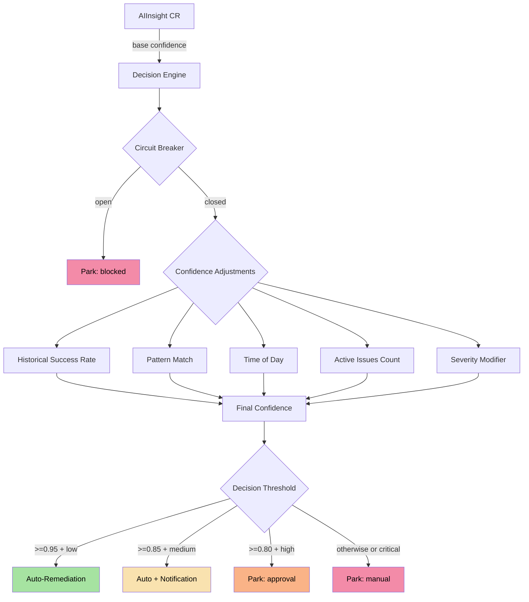
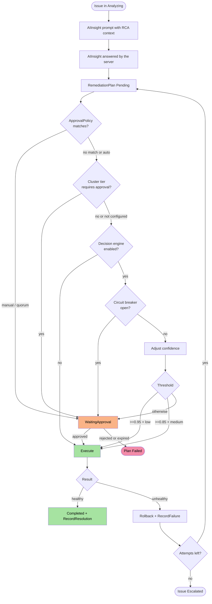

The **Decision Engine** is the central component that determines _when_ and _how_ the AIOps platform should act autonomously. It combines calculated confidence, historical patterns, root cause enrichment, and convergence detection to make safe decisions in production.

<Info>
  The Decision Engine never acts blindly. Every decision goes through a pipeline of
  confidence adjustments, circuit breaker checks, and pattern validation
  before any action is executed.
</Info>


## Architecture Overview


```mermaid
flowchart TD
    A[AIInsight CR] -->|base confidence| B[Decision Engine]
    B --> J{Circuit Breaker}
    J -->|open| K[Park: blocked]
    J -->|closed| C{Confidence Adjustments}
    C --> D[Historical Success Rate]
    C --> E[Pattern Match]
    C --> F[Time of Day]
    C --> G[Active Issues Count]
    C --> H[Severity Modifier]
    D & E & F & G & H --> I[Final Confidence]
    I --> L{Decision Threshold}
    L -->|>=0.95 + low| M[Auto-Remediation]
    L -->|>=0.85 + medium| N[Auto + Notification]
    L -->|>=0.80 + high| O[Park: approval]
    L -->|otherwise or critical| P[Park: manual]
    style M fill:#a6e3a1,color:#000
    style N fill:#f9e2af,color:#000
    style O fill:#fab387,color:#000
    style P fill:#f38ba8,color:#000
    style K fill:#f38ba8,color:#000
```

### Enabling the engine

The engine is **off by default**: ApprovalPolicies are then the only gate. Turn it on per operator:

```yaml
# Helm values (chatcli-operator)
decisionEngine:
  enabled: true
```

or set `CHATCLI_OPERATOR_DECISION_ENGINE=true` on the operator Deployment. The RemediationReconciler then evaluates every plan that reaches `Pending`, after the ApprovalPolicies and the [cluster tier](/features/aiops/federation#remediation-policy-per-tier) had their say: a plan an ApprovalPolicy already parked is not re-evaluated, a plan an `auto` rule let through still is.

Every evaluation leaves its verdict on the plan, whether it ran or waited:

```yaml
metadata:
  annotations:
    platform.chatcli.io/decision-mode: "auto-notify"   # auto | auto-notify | approval | manual | blocked
    platform.chatcli.io/confidence: "0.91"             # final confidence after adjustments
    platform.chatcli.io/risk: "medium"                 # low | medium | high | critical
    platform.chatcli.io/decision-reason: "Auto-approved with notification: confidence 0.91 + medium severity"
```

A plan that must wait is parked in `WaitingApproval` under the synthetic policy `decision-engine`: an ApprovalRequest with `policyRef: decision-engine`, one required approver and a 30-minute timeout, decided like any other request (dashboard, REST API, or the `platform.chatcli.io/approve` / `platform.chatcli.io/reject` annotation with the value `<approver>:<reason>`). No ApprovalPolicy object is needed.

<Note>
  Only the annotation path records who decided and why in `status.decisions`. A decision made through the REST API or the dashboard changes the request's state (the plan runs or fails as expected), but in current releases the approver name and reason are not persisted: the ApprovalRequest status schema has no fields for them.
</Note>

The engine reads the base confidence from the AIInsight named `<issue>-insight`. When that AIInsight is missing, the base confidence is `0` and the plan ends up `manual`. The AIInsight comes from the ChatCLI server the operator is connected to; only one Instance per cluster drives AIOps (the operator uses the first ready Instance it finds cluster-wide).


## Base Confidence (AIInsight)

The entire process starts with the `confidence` field of the `AIInsight` CR, which is generated by the LLM provider during root cause analysis. This value represents the AI's certainty about the diagnosis and suggested actions.

<CardGroup cols={2}>
  <Card title="High Confidence" icon="circle-check">
    **0.90 - 1.00** -- The AI identified the problem with high precision. Well-known
    scenarios like OOMKilled, CrashLoopBackOff with invalid image.
  </Card>
  <Card title="Medium Confidence" icon="circle-half-stroke">
    **0.70 - 0.89** -- Probable diagnosis but with uncertainty. Performance
    issues, resource pressure, intermittent dependencies.
  </Card>
  <Card title="Low Confidence" icon="circle-xmark">
    **0.50 - 0.69** -- The AI does not have sufficient certainty. Complex problems
    with multiple possible causes.
  </Card>
  <Card title="Very Low Confidence" icon="triangle-exclamation">
    **&lt; 0.50** -- Unknown scenario or insufficient data. Always requires
    human intervention.
  </Card>
</CardGroup>


## Confidence Adjustment Factors

The base confidence from the AIInsight is adjusted by five factors, then clamped to `0.0`–`1.0`. Every number below is what the operator applies.

### 1. Historical Success Rate

The engine counts RemediationPlans of the last 30 days in the Issue's namespace whose actions include the plan's first action type, and needs at least **3** finished ones (Completed, Failed or RolledBack) before it adjusts:

| Success rate | Adjustment |
|--------------|------------|
| ≥ 90% | **+0.10** |
| ≥ 70% | **+0.05** |
| 50%–70% | 0.00 |
| < 50% | **−0.10** |
| fewer than 3 finished plans | 0.00 |

Agentic plans carry no pre-planned actions, so this factor does not apply to them.

### 2. Pattern Match

When the [Pattern Store](#pattern-store) of the Issue's namespace holds a pattern with the same signal type, resource kind and severity that has been resolved successfully **at least twice**, its stored `confidenceBoost` is added. The boost is learned per pattern: `successCount / (successCount + failureCount) × 0.15`, so it is never more than **+0.15**.

### 3. Time of Day

| Condition | Adjustment |
|-----------|------------|
| 09:00–17:59 **UTC** | 0.00 |
| any other hour | **−0.05** |

The clock is UTC on purpose: the operator has no notion of the team's local business hours.

### 4. Simultaneous Active Issues

Non-terminal Issues in the same namespace, the one being evaluated included:

| Condition | Adjustment |
|-----------|------------|
| up to 3 active issues | 0.00 |
| each issue beyond 3 | **−0.02**, capped at **−0.10** |

### 5. Incident Severity

| Severity | Adjustment |
|----------|------------|
| `critical` | **−0.10** |
| `high` | **−0.05** |
| `medium` | 0.00 |
| `low` | **+0.05** |

## Practical Calculation Example

```text
Issue: error_rate on Deployment checkout (medium), namespace production, 03:10 UTC
AIInsight confidence (base):                       0.88
1. History: 5 finished ScaleDeployment plans,
   4 completed (80%)  → ≥ 70%                      +0.05
2. Pattern Store: matching pattern, boost learned   +0.10
3. Time of day: 03:10 UTC                           −0.05
4. Active issues in namespace: 2                    0.00
5. Severity medium                                  0.00
Final confidence                                   0.98  → clamp keeps 0.98
Verdict: 0.98 ≥ 0.85 and severity medium → auto-notify (executes, operators notified)
```

The same Issue at severity `critical` would end at 0.88 and be parked as `manual`: critical never runs unattended.


## Decision Thresholds

The final confidence and the severity together decide how much autonomy the plan gets.

<Tabs>
  <Tab title="Auto-Remediation">
    **Requirements:** confidence ≥ 0.95 **and** severity `low`

    The plan executes immediately. The verdict stays on the plan:

    ```yaml
    metadata:
      annotations:
        platform.chatcli.io/decision-mode: "auto"
        platform.chatcli.io/confidence: "0.97"
        platform.chatcli.io/risk: "low"
    ```
  </Tab>
  <Tab title="Auto with Notification">
    **Requirements:** confidence ≥ 0.85 **and** severity `medium`

    The plan executes; the Issue's state changes reach the NotificationPolicies as usual, so operators are told.

    ```yaml
    metadata:
      annotations:
        platform.chatcli.io/decision-mode: "auto-notify"
        platform.chatcli.io/confidence: "0.89"
        platform.chatcli.io/risk: "medium"
    ```
  </Tab>
  <Tab title="Requires Approval">
    **Requirements:** confidence ≥ 0.80 **and** severity `high`

    The plan waits in `WaitingApproval`. The ApprovalRequest points at the synthetic policy:

    ```yaml
    apiVersion: platform.chatcli.io/v1alpha1
    kind: ApprovalRequest
    metadata:
      name: approval-checkout-error-rate-plan-1
    spec:
      remediationPlanRef: checkout-error-rate-plan-1
      policyRef: decision-engine
      ruleName: decision-engine
      requiredApprovers: 1
      timeoutMinutes: 30
    status:
      state: Pending
    ```

    The plan carries `decision-mode: approval`. Approve or reject it like any request; after 30 minutes without a decision it expires and the plan fails.
  </Tab>
  <Tab title="Manual">
    **Requirements:** severity `critical`, or any severity below its threshold

    Same mechanism as above, with `decision-mode: manual` and the reason spelled out, for example `Manual approval required: critical severity (confidence 0.88)`. Nothing runs until a human decides.
  </Tab>
</Tabs>

<Note>
  A plan that an ApprovalPolicy already parked is not evaluated again. A plan an `auto` rule let through still is: the engine can only add caution, never remove a policy's gate.
</Note>

## Circuit Breaker

The circuit breaker blocks every new plan in a namespace when remediations there keep failing, so the platform stops compounding damage.

<Steps>
  <Step title="Failure window">
    On each evaluation the engine counts RemediationPlans in the namespace that ended `Failed` or `RolledBack` within the last **1 hour**. The time of failure is `completedAt`, or `startedAt` when a failure path did not stamp it, or the plan's creation time.
  </Step>
  <Step title="Open">
    **3 or more** failures in the window open the breaker: the plan is parked as `decision-mode: blocked` with the reason `Circuit breaker open: 3 remediations failed in last hour`, and `chatcli_operator_decision_engine_circuit_breaker_state{namespace}` reads `1`.
  </Step>
  <Step title="Close">
    The breaker closes on its own once the failures age out of the hour. There is no manual reset: approve the parked requests you want to run, or fix the cause and wait.
  </Step>
</Steps>

The state is derived from the plans on every evaluation, not kept in memory, so an operator restart does not lose it.


## Pattern Store

The Pattern Store is the platform's pattern learning system. It lets AIOps "remember" how past incidents ended and feed that memory back into the [pattern match](#2-pattern-match) adjustment.

### Fingerprint

Each pattern is keyed by a fingerprint of the Issue's signal type, resource kind and severity, lowercased:

```
hex( SHA256( lower(signalType) | lower(resourceKind) | lower(severity) )[:12] )
```

The result is a 24-character hex string. Two Issues share a pattern exactly when those three values match; the resource name and the namespace's other Issues play no part.

### ConfigMap Storage

Patterns live in a ConfigMap named `chatcli-pattern-store` **in the Issue's namespace** (one per namespace that has had remediations), created by the operator on first use. Each data key is a fingerprint and its value is the pattern as JSON:

```yaml
apiVersion: v1
kind: ConfigMap
metadata:
  name: chatcli-pattern-store
  namespace: production
  labels:
    app.kubernetes.io/managed-by: chatcli-operator
    app.kubernetes.io/component: pattern-store
data:
  3f9a0c1d2e4b5a6978c0d1e2: |
    {"fingerprint":"3f9a0c1d2e4b5a6978c0d1e2","signalType":"oom_kill","resourceKind":"Deployment","severity":"high","successfulActions":["AdjustResources","RestartDeployment"],"successCount":10,"failureCount":2,"averageResolutionSecs":38,"lastSeenAt":"2026-03-18T14:30:00Z","confidenceBoost":0.125}
```

### When patterns are recorded

The RemediationReconciler updates the pattern when a plan reaches a terminal state:

| Plan outcome | Effect on the pattern |
|--------------|-----------------------|
| `Completed` | `successCount` +1; the plan's action types are merged into `successfulActions` (for agentic plans, the actions whose observation did not start with `FAILED:`); `averageResolutionSecs` is updated from the Issue's `detectedAt` → `resolvedAt` when both are set |
| `Failed` or `RolledBack` | `failureCount` +1 |

Both paths recompute `confidenceBoost` and refresh `lastSeenAt`.

### Confidence Boost Calculation

```
confidenceBoost = successCount / (successCount + failureCount) × 0.15
```

The boost is applied only once `successCount ≥ 2`.

| Successes / total | Confidence Boost |
|-------------------|------------------|
| 10 / 10 | +0.150 |
| 8 / 10 | +0.120 |
| 5 / 10 | +0.075 |
| 2 / 10 | +0.030 |
| 1 / 1 | 0 (fewer than 2 successes) |

<Note>
  A pattern match is visible only through its effect on the verdict: the final value in the plan's `platform.chatcli.io/confidence` annotation. The operator does not write pattern details to the Issue, the AIInsight or the RemediationPlan.
</Note>


## Root Cause Analysis (RCA) Enrichment

Before asking the ChatCLI server for an analysis, the AIInsight controller gathers extra cluster context about the Issue and appends it to the analysis prompt as a text block (capped at 4,000 characters). It feeds the **LLM's diagnosis**, and through it the AIInsight's `confidence`; the decision engine does not read it directly, and it is not stored as a structured field on any CR.

The enricher looks back **30 minutes** from the Issue's `detectedAt` (or its creation time):

| Signal | How it is collected |
|--------|---------------------|
| Deployment changes | ReplicaSets owned by the Deployment named in the Issue's resource, sorted by the `deployment.kubernetes.io/revision` annotation. Each revision created in the window is reported with its number, the first container's image before and after, and the `kubernetes.io/change-cause` annotation. |
| Config changes | Events in the namespace on a `ConfigMap` with reason `Updated` or `Modified` in the window. Only the ConfigMap name and time are reported (no keys or values). Secrets are not checked. |
| Related issues | Other non-terminal Issues in the same namespace (name, severity, resource, state). |
| Service health | Services in the namespace whose selector matches the Deployment's pod template labels, with their ready endpoint count from EndpointSlices; a Service with no ready endpoint is reported as unhealthy. These are the Services in front of the affected workload, not its upstream dependencies. |
| Time correlation | Every deployment or ConfigMap change that happened **up to 10 minutes** before detection, e.g. `Deployment revision 6 changed 3m0s before incident (image: api-server:v2.3.1 -> api-server:v2.4.0)`. |

The block ends with a fixed list of "possible causes", in this order and only when the matching signal exists: a recent deployment change, a recent ConfigMap change, each unhealthy Service, related active Issues, or, when none apply, `No obvious external cause detected — may be resource exhaustion or application bug`. The list is a heuristic hint for the LLM, not a scored ranking.

```text
## Root Cause Analysis Context

### Temporal Correlations
Deployment revision 6 changed 3m0s before incident (image: api-server:v2.3.1 -> api-server:v2.4.0)

### Possible Causes (ranked)
1. Recent deployment change detected — possible bad release
2. 1 related active issues in same namespace — possible systemic problem

### Recent Deployment Changes
- Revision 6 at 10:15:00: api-server:v2.3.1 → api-server:v2.4.0 (by release pipeline)

### Related Active Issues
- redis-cache-latency [medium] Deployment/redis-cache state=Analyzing
```


## Convergence Detector

The Convergence Detector guards the **agentic remediation loop**. It inspects the plan's `spec.agenticHistory` (each step's action and observation) to stop loops that are stuck, oscillating, failing repeatedly or about to time out, instead of letting them burn the remaining steps.

### IsConverged

True when the last **3 steps** of the agentic history have the same observation (compared trimmed and lowercased, and not empty): the loop is no longer changing anything, for better or worse.

```go
func (cd *ConvergenceDetector) IsConverged(history []platformv1alpha1.AgenticStep) (bool, string)
```

### IsOscillating

True when the **actions** of the last 4 steps alternate between two different action types, A → B → A → B (for example `ScaleDeployment`, `RestartDeployment`, `ScaleDeployment`, `RestartDeployment`). Steps without an action break the pattern.

```go
func (cd *ConvergenceDetector) IsOscillating(history []platformv1alpha1.AgenticStep) (bool, string)
```

<Warning>
  Oscillation is a strong signal that the remediation is undoing itself. The loop is
  stopped at that step and the plan fails; the Issue then follows its normal retry
  or escalation path (see below).
</Warning>

### ShouldStop

The RemediationReconciler calls the detector before every agentic step, after the hard limits (max steps, 10-minute timeout):

```go
func (cd *ConvergenceDetector) ShouldStop(history []platformv1alpha1.AgenticStep, elapsed time.Duration) (bool, string)
```

| Criterion | Condition | Reason recorded |
|-----------|-----------|-----------------|
| Convergence | the last 3 observations are identical | `Converged: Last 3 observations identical: "<observation, first 80 chars>"` |
| Oscillation | the last 4 actions alternate A, B, A, B | `Oscillating: Oscillating between <A> and <B>` |
| Approaching timeout | more than 8 minutes elapsed (limit 10) | `Approaching timeout: 8m12s elapsed (limit: 10m)` |
| Repeated failure | the last 5 steps all had an action whose observation starts with `FAILED:` | `Last 5 actions all failed` |

A stop fails the plan with `status.result` set to `Agentic loop stopped: <reason> (estimated progress NN%)` and increments `chatcli_operator_agentic_convergence_stops_total{reason}` with `converged`, `oscillating`, `timeout` or `failures`. The Issue then retries with its next attempt or escalates, exactly as after any failed plan.

### EstimateProgress

Estimates agentic loop progress from 0.0 to 1.0; the value only appears in the stop message above.

```go
func (cd *ConvergenceDetector) EstimateProgress(history []platformv1alpha1.AgenticStep) float64
```

| Part | Value |
|------|-------|
| Base | `0.7 × (steps with an action whose observation does not start with FAILED:) / (steps with an action)` |
| Bonus | `+0.3` when the last observation contains `SUCCESS`, `healthy` or `ready` (case-sensitive) |
| No action taken yet | `0.1` (empty history: `0.0`) |

The result is capped at `1.0`.


## Complete Decision Flow


```mermaid
flowchart TD
    START([Issue in Analyzing]) --> RCA[AIInsight prompt with RCA context]
    RCA --> INSIGHT[AIInsight answered by the server]
    INSIGHT --> PLAN[RemediationPlan Pending]
    PLAN --> POLICY{ApprovalPolicy<br/>matches?}
    POLICY -->|manual / quorum| PARK[WaitingApproval]
    POLICY -->|no match or auto| TIER{Cluster tier<br/>requires approval?}
    TIER -->|yes| PARK
    TIER -->|no or not configured| ENGINE{Decision engine<br/>enabled?}
    ENGINE -->|no| EXEC[Execute]
    ENGINE -->|yes| CB{Circuit breaker<br/>open?}
    CB -->|yes| PARK
    CB -->|no| CALC[Adjust confidence]
    CALC --> THRESHOLD{Threshold}
    THRESHOLD -->|>=0.95 + low| EXEC
    THRESHOLD -->|>=0.85 + medium| EXEC
    THRESHOLD -->|otherwise| PARK
    PARK -->|approved| EXEC
    PARK -->|rejected or expired| FAIL([Plan Failed])
    EXEC --> RESULT{Result}
    RESULT -->|healthy| OK[Completed + RecordResolution]
    RESULT -->|unhealthy| RB[Rollback + RecordFailure]
    RB --> RETRY{Attempts left?}
    RETRY -->|yes| PLAN
    RETRY -->|no| ESC([Issue Escalated])
    style EXEC fill:#a6e3a1,color:#000
    style PARK fill:#fab387,color:#000
    style FAIL fill:#f38ba8,color:#000
    style OK fill:#a6e3a1,color:#000
```

## Decision Engine Metrics

| Metric | Type | Labels | Description |
|--------|------|--------|-------------|
| `chatcli_operator_decision_engine_evaluations_total` | Counter | `mode` | Evaluations by the mode granted: `auto`, `auto-notify`, `approval`, `manual`, `blocked` |
| `chatcli_operator_decision_engine_circuit_breaker_state` | Gauge | `namespace` | `1` while the namespace's breaker is open, `0` otherwise |
| `chatcli_operator_agentic_convergence_stops_total` | Counter | `reason` | Agentic loops stopped by the detector: `converged`, `oscillating`, `timeout`, `failures` |

```yaml
# Prometheus alert example
groups:
  - name: decision-engine
    rules:
      - alert: CircuitBreakerOpen
        expr: chatcli_operator_decision_engine_circuit_breaker_state == 1
        for: 5m
        labels:
          severity: warning
        annotations:
          summary: "Decision engine circuit breaker is open in {{ $labels.namespace }}"
          description: "3+ remediation failures in the last hour. New plans wait for a human."
      - alert: MostPlansWaitForHumans
        expr: >
          sum(rate(chatcli_operator_decision_engine_evaluations_total{mode=~"approval|manual"}[6h]))
          / sum(rate(chatcli_operator_decision_engine_evaluations_total[6h])) > 0.8
        for: 6h
        labels:
          severity: info
        annotations:
          summary: "Over 80% of plans are parked for approval"
          description: "Confidence rarely clears the thresholds. Review runbooks and the Pattern Store."
```

## Next Steps

<CardGroup cols={2}>
  <Card title="Multi-Cluster Federation" icon="network-wired" href="/features/aiops/federation">
    See how the decision engine operates in multi-cluster environments with policies
    per tier.
  </Card>
  <Card title="Chaos Engineering" icon="explosion" href="/features/aiops/chaos-engineering">
    Validate engine decisions with controlled chaos experiments.
  </Card>
  <Card title="Audit and Compliance" icon="clipboard-check" href="/features/aiops/audit-compliance">
    Parked plans, approval decisions and remediation start, success and failure are recorded as AuditEvents.
  </Card>
  <Card title="AIOps Platform" icon="brain" href="/features/aiops-platform">
    Return to the complete AIOps platform overview.
  </Card>
</CardGroup>
