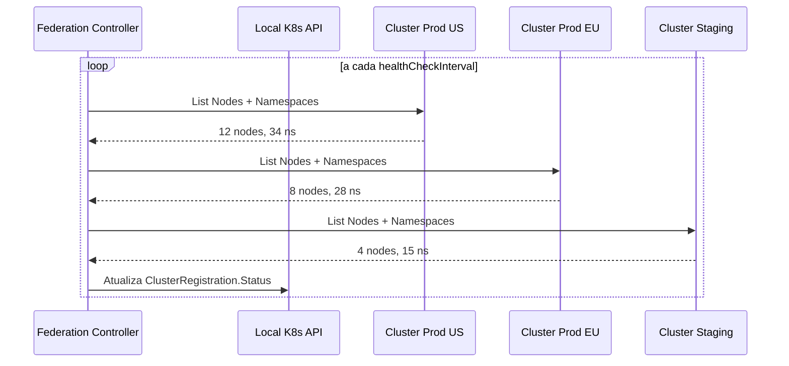
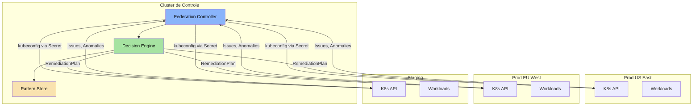

A **Federação Multi-Cluster** permite que a plataforma AIOps do ChatCLI gerencie múltiplos clusters Kubernetes a partir de um único plano de controle. Incidentes são correlacionados entre clusters, cascatas são detectadas automaticamente e políticas de remediação respeitam o tier de cada ambiente.

<Info>
  A federação não requer um service mesh ou ferramentas externas. O operator
  se conecta diretamente a cada cluster via kubeconfig armazenado em Secrets.
</Info>

---

## Por que Federação Multi-Cluster?

Em ambientes de produção modernos, a infraestrutura raramente se limita a um único cluster:

<CardGroup cols={3}>
  <Card title="Multi-Região" icon="globe">
    Clusters em us-east-1, eu-west-1 e ap-southeast-1 para latência e
    compliance regionais.
  </Card>
  <Card title="Multi-Ambiente" icon="layer-group">
    Staging, production e DR em clusters separados com diferentes políticas de
    segurança.
  </Card>
  <Card title="Multi-Tenant" icon="building">
    Clusters dedicados por equipe ou produto com isolamento forte de workloads.
  </Card>
</CardGroup>

Sem federação, cada cluster é um silo. A AIOps perde a capacidade de:

- Detectar que o mesmo problema afeta 5 clusters simultaneamente
- Correlacionar um deploy em staging com uma falha em produção
- Aplicar políticas de remediação diferenciadas por importância do cluster
- Agregar métricas de saúde em uma visão global

---

## ClusterRegistration CRD

O CRD `ClusterRegistration` é o ponto de entrada para adicionar clusters à federação.

### Especificação Completa

```yaml
apiVersion: platform.chatcli.io/v1alpha1
kind: ClusterRegistration
metadata:
  name: prod-us-east-1
  namespace: chatcli-system
spec:
  # Referência ao Secret contendo o kubeconfig
  kubeconfigSecretRef:
    name: cluster-prod-us-east-1-kubeconfig
    key: kubeconfig

  # Metadados do cluster
  region: us-east-1
  environment: production
  tier: critical          # critical | standard | non-critical

  # Configuração de monitoramento
  healthCheckInterval: 30s
  capabilities:
    - monitoring
    - remediation
    - chaos-engineering

  # Limites de segurança
  maxConcurrentRemediations: 2

status:
  # Preenchido automaticamente pelo controller
  connected: true
  lastHealthCheck: "2026-03-19T14:30:00Z"
  kubernetesVersion: "v1.29.2"
  nodeCount: 12
  namespaceCount: 34
  conditions:
    - type: Connected
      status: "True"
      lastTransitionTime: "2026-03-19T10:00:00Z"
      reason: HealthCheckSucceeded
      message: "Cluster acessível, 12 nodes, 34 namespaces"
    - type: RemediationCapable
      status: "True"
      lastTransitionTime: "2026-03-19T10:00:00Z"
      reason: RBACConfigured
      message: "ServiceAccount com permissões de remediação"
```

### Campos do Spec

| Campo | Tipo | Obrigatório | Descrição |
|-------|------|-------------|-----------|
| `kubeconfigSecretRef.name` | string | Sim | Nome do Secret com o kubeconfig |
| `kubeconfigSecretRef.key` | string | Sim | Chave dentro do Secret (geralmente `kubeconfig`) |
| `region` | string | Sim | Região geográfica do cluster |
| `environment` | string | Sim | Ambiente: `staging`, `production`, `dr`, `development` |
| `tier` | string | Sim | Importância: `critical`, `standard`, `non-critical` |
| `healthCheckInterval` | duration | Não | Intervalo de health check (padrão: `30s`) |
| `capabilities` | []string | Não | Capabilities habilitadas: `monitoring`, `remediation`, `chaos-engineering` |
| `maxConcurrentRemediations` | int | Não | Máximo de remediações simultâneas (padrão: `3`) |

### Campos do Status

| Campo | Tipo | Descrição |
|-------|------|-----------|
| `connected` | bool | Se o cluster está acessível |
| `lastHealthCheck` | timestamp | Último health check bem-sucedido |
| `kubernetesVersion` | string | Versão do Kubernetes do cluster remoto |
| `nodeCount` | int | Número de nodes ativos |
| `namespaceCount` | int | Número de namespaces |
| `conditions` | []Condition | Condições detalhadas (Connected, RemediationCapable) |

---

## Como a Federação Funciona

### Kubeconfig Parsing

O controller lê o kubeconfig do Secret referenciado e cria um client Kubernetes configurado para o cluster remoto.

```go
func (r *FederationReconciler) buildRemoteClient(
    ctx context.Context,
    reg *v1alpha1.ClusterRegistration,
) (kubernetes.Interface, error) {
    // 1. Busca o Secret com o kubeconfig
    secret := &corev1.Secret{}
    err := r.client.Get(ctx, types.NamespacedName{
        Name:      reg.Spec.KubeconfigSecretRef.Name,
        Namespace: reg.Namespace,
    }, secret)
    if err != nil {
        return nil, fmt.Errorf("secret não encontrado: %w", err)
    }

    // 2. Extrai e parseia o kubeconfig
    kubeconfigData := secret.Data[reg.Spec.KubeconfigSecretRef.Key]
    config, err := clientcmd.RESTConfigFromKubeConfig(kubeconfigData)
    if err != nil {
        return nil, fmt.Errorf("kubeconfig inválido: %w", err)
    }

    // 3. Cria o client
    return kubernetes.NewForConfig(config)
}
```

### Cache de Clients Remotos

Os clients são armazenados em um `sync.Map` para reutilização, evitando reconexões desnecessárias:

```go
type FederationManager struct {
    clients    sync.Map  // map[string]kubernetes.Interface
    mu         sync.RWMutex
}

func (fm *FederationManager) GetClient(clusterName string) (kubernetes.Interface, bool) {
    client, ok := fm.clients.Load(clusterName)
    if !ok {
        return nil, false
    }
    return client.(kubernetes.Interface), true
}

func (fm *FederationManager) RegisterClient(clusterName string, client kubernetes.Interface) {
    fm.clients.Store(clusterName, client)
}
```

### Health Check Loop

O controller executa health checks periódicos em cada cluster registrado:

<Steps>
  <Step title="Lista Nodes">
    Executa `List Nodes` no cluster remoto para verificar conectividade e contar
    nodes ativos.
    ```go
    nodes, err := remoteClient.CoreV1().Nodes().List(ctx, metav1.ListOptions{})
    ```
  </Step>
  <Step title="Lista Namespaces">
    Executa `List Namespaces` para contar namespaces e verificar permissões
    RBAC.
    ```go
    namespaces, err := remoteClient.CoreV1().Namespaces().List(ctx, metav1.ListOptions{})
    ```
  </Step>
  <Step title="Atualiza Status">
    Atualiza o `ClusterRegistration.Status` com os resultados, incluindo
    `connected`, `nodeCount`, `namespaceCount` e `kubernetesVersion`.
  </Step>
  <Step title="Gera Métricas">
    Exporta métricas Prometheus com o estado do cluster.
  </Step>
</Steps>



---

## Correlação Cross-Cluster

Um dos recursos mais poderosos da federação é a capacidade de correlacionar incidentes entre clusters.

### Elevação Automática de Severidade

Quando o **mesmo `signalType`** é detectado em **3 ou mais clusters** dentro de uma janela de tempo, a plataforma eleva automaticamente a severidade para `critical`:

```go
func (ce *CrossClusterCorrelator) Evaluate(issues []FederatedIssue) []Correlation {
    // Agrupa por signalType
    bySignal := make(map[string][]FederatedIssue)
    for _, issue := range issues {
        bySignal[issue.SignalType] = append(bySignal[issue.SignalType], issue)
    }

    var correlations []Correlation
    for signalType, clusterIssues := range bySignal {
        uniqueClusters := countUniqueClusters(clusterIssues)
        if uniqueClusters >= 3 {
            correlations = append(correlations, Correlation{
                SignalType:       signalType,
                AffectedClusters: uniqueClusters,
                ElevateTo:        "critical",
                CorrelationID:    generateCorrelationID(),
            })
        }
    }
    return correlations
}
```

### CorrelationID Annotation

Quando incidentes são correlacionados entre clusters, todos recebem a mesma annotation `correlationID` para rastreabilidade:

```yaml
apiVersion: platform.chatcli.io/v1alpha1
kind: Issue
metadata:
  name: issue-oom-api-server
  namespace: production
  annotations:
    platform.chatcli.io/correlation-id: "cross-7f8a2b3c"
    platform.chatcli.io/correlated-clusters: "prod-us-east-1,prod-eu-west-1,prod-ap-southeast-1"
    platform.chatcli.io/elevated-severity: "true"
    platform.chatcli.io/original-severity: "medium"
spec:
  severity: critical  # Elevado de medium para critical
  signalType: OOMKilled
```

<Note>
  O `correlationID` permite que operadores façam `kubectl` queries para encontrar
  todos os incidentes relacionados em todos os clusters:
  ```bash
  kubectl get issues -A -l platform.chatcli.io/correlation-id=cross-7f8a2b3c
  ```
</Note>

---

## Detecção de Cascata

A detecção de cascata identifica quando um problema em um ambiente de menor tier (staging) pode estar prestes a afetar um ambiente de maior tier (produção).

### Staging para Produção

```go
func (cd *CascadeDetector) DetectStagingToProd(
    stagingIssues []FederatedIssue,
    prodIssues []FederatedIssue,
) []CascadeAlert {
    var alerts []CascadeAlert

    for _, staging := range stagingIssues {
        for _, prod := range prodIssues {
            // Mesmo signalType E mesmo resourceKind
            if staging.SignalType == prod.SignalType &&
               staging.ResourceKind == prod.ResourceKind {
                // Staging aconteceu antes de produção
                if staging.DetectedAt.Before(prod.DetectedAt) {
                    alerts = append(alerts, CascadeAlert{
                        SourceCluster: staging.ClusterName,
                        TargetCluster: prod.ClusterName,
                        SignalType:    staging.SignalType,
                        TimeDelta:     prod.DetectedAt.Sub(staging.DetectedAt),
                    })
                }
            }
        }
    }
    return alerts
}
```

Quando uma cascata é detectada, a annotation `platform.chatcli.io/cascade-detected: true` é adicionada ao Issue em produção:

```yaml
metadata:
  annotations:
    platform.chatcli.io/cascade-detected: "true"
    platform.chatcli.io/cascade-source: "staging-us-east-1"
    platform.chatcli.io/cascade-signal: "CrashLoopBackOff"
    platform.chatcli.io/cascade-delta: "15m"
```

<Warning>
  Cascatas detectadas elevam automaticamente a prioridade da issue e adicionam
  contexto extra ao prompt do LLM, incluindo o histórico do incidente no cluster
  de origem. Isso permite que a IA recomende ações preventivas baseadas no que
  aconteceu no staging.
</Warning>

---

## Agregação de Status Global

O operator mantém um status agregado de toda a federação, acessível via CRD e API:

```yaml
apiVersion: platform.chatcli.io/v1alpha1
kind: FederationStatus
metadata:
  name: global-status
  namespace: chatcli-system
status:
  totalClusters: 5
  connectedClusters: 4
  disconnectedClusters:
    - name: dr-us-west-2
      lastSeen: "2026-03-19T12:00:00Z"
      reason: "Network timeout"
  totalActiveIssues: 12
  issuesBySeverity:
    critical: 1
    high: 3
    medium: 5
    low: 3
  issuesByCluster:
    prod-us-east-1: 4
    prod-eu-west-1: 3
    prod-ap-southeast-1: 2
    staging-us-east-1: 3
  crossClusterCorrelations: 2
  cascadesDetected: 1
  remediationsInProgress: 3
  lastUpdated: "2026-03-19T14:35:00Z"
```

<Tabs>
  <Tab title="kubectl">
    ```bash
    # Visão geral da federação
    kubectl get federationstatus global-status -n chatcli-system -o yaml

    # Listar todos os clusters registrados
    kubectl get clusterregistrations -n chatcli-system

    # Ver clusters desconectados
    kubectl get clusterregistrations -n chatcli-system \
      -o jsonpath='{range .items[?(@.status.connected==false)]}{.metadata.name}{"\n"}{end}'
    ```
  </Tab>
  <Tab title="API REST">
    ```bash
    # Status global via API
    curl -s https://chatcli.example.com/api/v1/federation/status | jq .

    # Listar clusters com filtro por tier
    curl -s https://chatcli.example.com/api/v1/federation/clusters?tier=critical | jq .

    # Issues cross-cluster
    curl -s https://chatcli.example.com/api/v1/federation/correlations | jq .
    ```
  </Tab>
</Tabs>

---

## Política de Remediação por Tier

Cada cluster tem uma política de remediação baseada no seu `tier`, que controla o nível de autonomia permitido pelo Motor de Decisão.

### Definição de Políticas

| Tier | Severidade | Política | Justificativa |
|------|-----------|----------|---------------|
| **critical** | Qualquer | Manual com aprovação | Zero risco de ação automática em infra crítica |
| **standard** | critical/high | Manual com aprovação | Conservadorismo para severidades altas |
| **standard** | medium/low | Auto-remediação | Automação para problemas de menor impacto |
| **non-critical** | Qualquer | Auto-remediação | Máxima automação em ambientes de dev/test |

```go
func (pm *PolicyManager) GetRemediationPolicy(
    tier string,
    severity string,
) RemediationPolicy {
    switch tier {
    case "critical":
        // Clusters críticos: SEMPRE manual
        return RemediationPolicy{
            Mode:            "manual",
            RequiresApproval: true,
            RequiredRole:    "Admin",
            Reason:          "Cluster tier critical: todas as remediações requerem aprovação",
        }

    case "standard":
        switch severity {
        case "critical", "high":
            return RemediationPolicy{
                Mode:            "manual",
                RequiresApproval: true,
                RequiredRole:    "Operator",
                Reason:          "Severidade alta em cluster standard",
            }
        default: // medium, low
            return RemediationPolicy{
                Mode:            "auto",
                RequiresApproval: false,
                Reason:          "Severidade média/baixa em cluster standard",
            }
        }

    case "non-critical":
        // Dev/test: auto para tudo
        return RemediationPolicy{
            Mode:            "auto",
            RequiresApproval: false,
            Reason:          "Cluster non-critical: auto-remediação para todas as severidades",
        }
    }

    // Fallback seguro
    return RemediationPolicy{
        Mode:            "manual",
        RequiresApproval: true,
    }
}
```

<Note>
  A política por tier é avaliada **antes** do Motor de Decisão calcular
  confiança. Se o tier exige aprovação manual, o cálculo de confiança ainda
  é feito (para registro e auditoria), mas o resultado não altera a decisão.
</Note>

---

## Exemplos YAML

### Registrar Cluster de Produção

<CodeGroup>
```yaml Secret (kubeconfig)
apiVersion: v1
kind: Secret
metadata:
  name: cluster-prod-us-east-1-kubeconfig
  namespace: chatcli-system
type: Opaque
data:
  kubeconfig: |
    # base64 encoded kubeconfig
    YXBpVmVyc2lvbjogdjEKa2lu...
```

```yaml ClusterRegistration
apiVersion: platform.chatcli.io/v1alpha1
kind: ClusterRegistration
metadata:
  name: prod-us-east-1
  namespace: chatcli-system
  labels:
    environment: production
    region: us-east-1
spec:
  kubeconfigSecretRef:
    name: cluster-prod-us-east-1-kubeconfig
    key: kubeconfig
  region: us-east-1
  environment: production
  tier: critical
  healthCheckInterval: 30s
  capabilities:
    - monitoring
    - remediation
  maxConcurrentRemediations: 2
```
</CodeGroup>

### Registrar Cluster de Staging

```yaml
apiVersion: platform.chatcli.io/v1alpha1
kind: ClusterRegistration
metadata:
  name: staging-us-east-1
  namespace: chatcli-system
  labels:
    environment: staging
    region: us-east-1
spec:
  kubeconfigSecretRef:
    name: cluster-staging-us-east-1-kubeconfig
    key: kubeconfig
  region: us-east-1
  environment: staging
  tier: non-critical
  healthCheckInterval: 60s
  capabilities:
    - monitoring
    - remediation
    - chaos-engineering   # Chaos habilitado apenas em staging
  maxConcurrentRemediations: 5
```

### Setup Multi-Região Completo

```yaml
# Produção US
apiVersion: platform.chatcli.io/v1alpha1
kind: ClusterRegistration
metadata:
  name: prod-us-east-1
  namespace: chatcli-system
spec:
  kubeconfigSecretRef:
    name: kubeconfig-prod-us
    key: kubeconfig
  region: us-east-1
  environment: production
  tier: critical
  healthCheckInterval: 15s
  capabilities: [monitoring, remediation]
  maxConcurrentRemediations: 2
---
# Produção EU
apiVersion: platform.chatcli.io/v1alpha1
kind: ClusterRegistration
metadata:
  name: prod-eu-west-1
  namespace: chatcli-system
spec:
  kubeconfigSecretRef:
    name: kubeconfig-prod-eu
    key: kubeconfig
  region: eu-west-1
  environment: production
  tier: critical
  healthCheckInterval: 15s
  capabilities: [monitoring, remediation]
  maxConcurrentRemediations: 2
---
# Produção APAC
apiVersion: platform.chatcli.io/v1alpha1
kind: ClusterRegistration
metadata:
  name: prod-ap-southeast-1
  namespace: chatcli-system
spec:
  kubeconfigSecretRef:
    name: kubeconfig-prod-ap
    key: kubeconfig
  region: ap-southeast-1
  environment: production
  tier: critical
  healthCheckInterval: 15s
  capabilities: [monitoring, remediation]
  maxConcurrentRemediations: 2
---
# Staging (compartilhado)
apiVersion: platform.chatcli.io/v1alpha1
kind: ClusterRegistration
metadata:
  name: staging-global
  namespace: chatcli-system
spec:
  kubeconfigSecretRef:
    name: kubeconfig-staging
    key: kubeconfig
  region: us-east-1
  environment: staging
  tier: non-critical
  healthCheckInterval: 60s
  capabilities: [monitoring, remediation, chaos-engineering]
  maxConcurrentRemediations: 10
---
# DR (Disaster Recovery)
apiVersion: platform.chatcli.io/v1alpha1
kind: ClusterRegistration
metadata:
  name: dr-us-west-2
  namespace: chatcli-system
spec:
  kubeconfigSecretRef:
    name: kubeconfig-dr
    key: kubeconfig
  region: us-west-2
  environment: dr
  tier: standard
  healthCheckInterval: 60s
  capabilities: [monitoring]
  maxConcurrentRemediations: 1
```

---

## Monitoramento da Federação

### Métricas Prometheus

| Métrica | Tipo | Labels | Descrição |
|---------|------|--------|-----------|
| `federation_clusters_total` | Gauge | `status` | Total de clusters por status (connected/disconnected) |
| `federation_health_check_duration_seconds` | Histogram | `cluster` | Tempo de health check por cluster |
| `federation_cluster_nodes` | Gauge | `cluster`, `region` | Número de nodes por cluster |
| `cross_cluster_issues_total` | Counter | `signal_type` | Total de issues correlacionadas cross-cluster |
| `cross_cluster_correlations_active` | Gauge | - | Correlações ativas no momento |
| `cascade_detected_total` | Counter | `source_tier`, `target_tier` | Total de cascatas detectadas |
| `federation_remediation_policy_applied` | Counter | `tier`, `mode` | Políticas aplicadas por tier e modo |

### Dashboards Recomendados

<Accordion title="Grafana Dashboard: Federation Overview">
  ```json
  {
    "panels": [
      {
        "title": "Clusters Conectados",
        "type": "stat",
        "targets": [{
          "expr": "federation_clusters_total{status='connected'}"
        }]
      },
      {
        "title": "Issues por Cluster",
        "type": "barchart",
        "targets": [{
          "expr": "sum by (cluster) (aiops_active_issues)"
        }]
      },
      {
        "title": "Cascatas Detectadas (24h)",
        "type": "stat",
        "targets": [{
          "expr": "increase(cascade_detected_total[24h])"
        }]
      },
      {
        "title": "Latência de Health Check",
        "type": "timeseries",
        "targets": [{
          "expr": "histogram_quantile(0.95, federation_health_check_duration_seconds_bucket)"
        }]
      }
    ]
  }
  ```
</Accordion>

### Alertas Recomendados

```yaml
groups:
  - name: federation
    rules:
      - alert: ClusterDisconnected
        expr: federation_clusters_total{status="disconnected"} > 0
        for: 5m
        labels:
          severity: critical
        annotations:
          summary: "Cluster federado desconectado"
          description: >
            {{ $value }} cluster(s) desconectado(s) há mais de 5 minutos.
            Verifique a conectividade de rede e credenciais.

      - alert: CrossClusterIncident
        expr: cross_cluster_correlations_active > 0
        for: 1m
        labels:
          severity: critical
        annotations:
          summary: "Incidente correlacionado entre clusters"
          description: >
            {{ $value }} correlação(ões) cross-cluster ativa(s).
            Mesmo problema detectado em 3+ clusters.

      - alert: CascadeDetected
        expr: increase(cascade_detected_total[1h]) > 0
        labels:
          severity: warning
        annotations:
          summary: "Cascata staging→produção detectada"
          description: >
            Problema detectado em staging está se propagando para produção.
            Verifique se o mesmo deploy foi aplicado em ambos os ambientes.
```

---

## Arquitetura de Rede



<Tip>
  O cluster de controle precisa de conectividade de rede para o API server de
  cada cluster remoto. Em ambientes com rede restrita, considere usar um
  bastion host ou VPN dedicada para o tráfego de gerenciamento.
</Tip>

---

## Próximos Passos

<CardGroup cols={2}>
  <Card title="Motor de Decisão" icon="brain-circuit" href="/features/aiops/decision-engine">
    Entenda como a confiança é calculada e como as políticas por tier afetam as
    decisões.
  </Card>
  <Card title="Chaos Engineering" icon="explosion" href="/features/aiops/chaos-engineering">
    Execute experimentos de chaos em clusters específicos com safety checks por
    tier.
  </Card>
  <Card title="Auditoria e Compliance" icon="clipboard-check" href="/features/aiops/audit-compliance">
    Audit trail completo de ações cross-cluster com correlationID.
  </Card>
  <Card title="AIOps Platform" icon="brain" href="/features/aiops-platform">
    Retorne à visão geral da plataforma AIOps.
  </Card>
</CardGroup>
