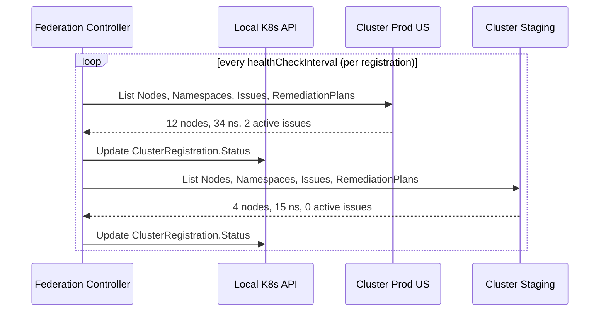
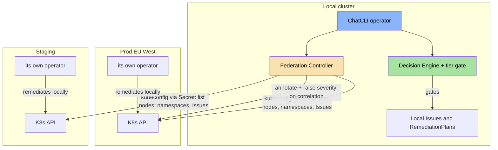

**Multi-Cluster Federation** lets a ChatCLI operator see beyond its own cluster. You register the other clusters with a `ClusterRegistration`; the operator health-checks them, correlates new Issues with the Issues running there, flags staging-to-production cascades, and applies a remediation policy based on its own cluster's tier.

<Info>
  Federation does not require a service mesh or external tools. The operator
  connects directly to each registered cluster with a kubeconfig stored in a Secret.
</Info>

<Warning>
  Federation reads other clusters; it does not remediate them. Detection and
  remediation stay local: each cluster that should heal itself runs its own
  operator (and its own ChatCLI Instance; only one Instance per cluster drives
  AIOps). Through the registered kubeconfig the operator only lists nodes,
  namespaces, Issues and RemediationPlans, and updates remote Issues when it
  correlates them.
</Warning>


## Why Multi-Cluster Federation?

In modern production environments, infrastructure is rarely limited to a single cluster:

<CardGroup cols={3}>
  <Card title="Multi-Region" icon="globe">
    Clusters in us-east-1, eu-west-1, and ap-southeast-1 for latency and
    regional compliance.
  </Card>
  <Card title="Multi-Environment" icon="layer-group">
    Staging, production, and DR in separate clusters with different security
    policies.
  </Card>
  <Card title="Multi-Tenant" icon="building">
    Dedicated clusters per team or product with strong workload isolation.
  </Card>
</CardGroup>

Without federation, each cluster is a silo. AIOps loses the ability to:

- Detect that the same problem affects 5 clusters simultaneously
- Correlate a staging deploy with a production failure
- Apply differentiated remediation policies by cluster importance
- Aggregate cluster health into a global view


## ClusterRegistration CRD

The `ClusterRegistration` CRD is the entry point for adding clusters to the federation. Create it in the cluster where the operator runs, in any namespace; the kubeconfig Secret must live in the same namespace.

### Complete Specification

```yaml
apiVersion: platform.chatcli.io/v1alpha1
kind: ClusterRegistration
metadata:
  name: prod-us-east-1
  namespace: chatcli-system
spec:
  displayName: prod-us-east-1
  # Secret in the same namespace; the kubeconfig must be under the key "kubeconfig"
  kubeconfigSecretRef:
    name: cluster-prod-us-east-1-kubeconfig

  # Cluster metadata
  region: us-east-1
  environment: prod       # prod | staging | dev
  tier: critical          # critical | standard | non-critical

  # Monitoring configuration
  healthCheckInterval: 30s

  # Informational (stored, not enforced)
  capabilities:
    - metrics-server
    - prometheus
  maxConcurrentRemediations: 2

status:
  # Populated by the controller
  connected: true
  lastHealthCheck: "2026-03-19T14:30:00Z"
  kubernetesVersion: "v1.29.2"
  nodeCount: 12
  namespaceCount: 34
  activeIssues: 2
  activeRemediations: 1
```

### Spec Fields

| Field | Type | Required | Description |
|-------|------|----------|-------------|
| `displayName` | string | Yes | Human-readable name; also accepted by `clusterName` for the [tier gate](#remediation-policy-per-tier) |
| `kubeconfigSecretRef.name` | string | Yes | Secret in the same namespace holding the kubeconfig under the fixed key `kubeconfig` |
| `region` | string | No | Geographic region of the cluster (informational) |
| `environment` | string | Yes (default `dev`) | `prod`, `staging` or `dev`. [Cascade detection](#cascade-detection) uses `staging` and `prod` |
| `tier` | string | Yes (default `standard`) | `critical`, `standard` or `non-critical` |
| `labels` | map | No | Custom metadata (informational) |
| `healthCheckInterval` | duration | No | Health check interval (default `30s`; an unparseable value falls back to `30s`) |
| `capabilities` | []string | No | Free-form list of cluster features, e.g. `metrics-server`, `prometheus`, `istio`. Stored only; no code reads it |
| `maxConcurrentRemediations` | int | No | Default `3`. Stored only; the operator does not enforce it |

### Status Fields

| Field | Type | Description |
|-------|------|-------------|
| `connected` | bool | Whether the last health check succeeded |
| `lastHealthCheck` | timestamp | Time of the last health check, successful or not |
| `kubernetesVersion` | string | Kubelet version of the remote cluster's first node |
| `nodeCount` | int | Number of nodes |
| `namespaceCount` | int | Number of namespaces |
| `activeIssues` | int | Non-terminal Issues in the remote cluster (0 when its CRDs are not installed) |
| `activeRemediations` | int | RemediationPlans in `Pending`, `Executing` or `Verifying` in the remote cluster |
| `conditions` | []Condition | `Connected` (`True`/`HealthCheckPassed` while the health check passes; `False` with reason `KubeconfigUnusable`, `NodeListFailed` or `NamespaceListFailed` and the error) and `Degraded` (`True`/`NodesNotReady` when the cluster answers but some nodes are not Ready, `False`/`AllNodesReady`, `Unknown`/`Disconnected` while it is unreachable) |


## How Federation Works

### Kubeconfig and client cache

On each reconcile the FederationReconciler reads `data.kubeconfig` from the Secret named in `kubeconfigSecretRef`, in the ClusterRegistration's namespace, builds a controller-runtime client from it, and caches that client by registration name. The cache is dropped when a health check fails or the registration is deleted, so a rotated kubeconfig is picked up after the next failed check (or an operator restart).

The kubeconfig identity needs, on the remote cluster: `list` on nodes and namespaces for the health check; `list` on `issues` and `remediationplans` (group `platform.chatcli.io`) for the counters and correlation; and `update` on `issues` for correlation to annotate them.

### Health Check Loop

<Steps>
  <Step title="List Nodes">
    Lists the remote nodes to verify connectivity, count them and read the first node's kubelet version.
  </Step>
  <Step title="List Namespaces">
    Lists the remote namespaces and counts them.
  </Step>
  <Step title="Count AIOps work">
    Lists remote Issues and RemediationPlans, when those CRDs exist there, to fill `activeIssues` and `activeRemediations`.
  </Step>
  <Step title="Update Status">
    Writes `connected`, `lastHealthCheck`, `kubernetesVersion`, `nodeCount`, `namespaceCount`, `activeIssues`, `activeRemediations` and the `Connected`/`Degraded` conditions, refreshes the `chatcli_operator_federation_clusters_total` gauge, then requeues after `healthCheckInterval`. A failure at any step before this one sets `connected: false`, refreshes `lastHealthCheck` and records the failure in the `Connected` condition.
  </Step>
</Steps>


```mermaid
sequenceDiagram
    participant FC as Federation Controller
    participant K8s as Local K8s API
    participant RC1 as Cluster Prod US
    participant RC2 as Cluster Staging

    loop every healthCheckInterval (per registration)
        FC->>RC1: List Nodes, Namespaces, Issues, RemediationPlans
        RC1-->>FC: 12 nodes, 34 ns, 2 active issues
        FC->>K8s: Update ClusterRegistration.Status
        FC->>RC2: List Nodes, Namespaces, Issues, RemediationPlans
        RC2-->>FC: 4 nodes, 15 ns, 0 active issues
        FC->>K8s: Update ClusterRegistration.Status
    end
```


## Cross-Cluster Correlation

When an Issue is detected, the IssueReconciler asks the federation controller to look for the same problem elsewhere. Both checks below run only against ClusterRegistrations that are `connected` and whose kubeconfig client is cached; with no registrations they cost two cached lists and change nothing.

### Automatic Severity Elevation

The controller lists the active (non-terminal) Issues with the **same `signalType`** on the local cluster and on every connected cluster. When they span **3 or more clusters** (the local one counts as one), every matching Issue, local and remote, is annotated and raised to `critical`:

```yaml
apiVersion: platform.chatcli.io/v1alpha1
kind: Issue
metadata:
  name: api-gateway-error-rate-1790368432
  namespace: production
  annotations:
    platform.chatcli.io/cross-cluster-correlation: "xcluster-7f8a2b3c"
    platform.chatcli.io/affected-clusters: "3"
spec:
  severity: critical   # raised from medium
  signalType: error_rate
```

An Issue raised to `critical` also gets `platform.chatcli.io/elevated-severity: "true"`. One correlation keeps **one id**: when a new matching Issue arrives and one of the matching Issues already carries a correlation id, the group reuses it instead of relabeling everything, and `affected-clusters` is refreshed. The counter `chatcli_operator_federation_cross_cluster_issues_total` increments once per new correlation id. An Issue that changed underneath the update (a conflict) is skipped and not retried; the next correlation of the group annotates it.

<Note>
  The correlation id is an annotation, so find the related Issues with:

  ```bash
  kubectl get issues -A -o json \
    | jq -r '.items[] | select(.metadata.annotations["platform.chatcli.io/cross-cluster-correlation"]=="xcluster-7f8a2b3c") | "\(.metadata.namespace)/\(.metadata.name)"'
  ```
</Note>

`GET /api/v1/federation/correlations` lists the correlations from the local Issues, one entry per correlation id, with `correlationId`, `issue`, `namespace`, `severity`, `signalType`, `correlatedClusters` (from `affected-clusters`), `elevated` (from `elevated-severity`) and `cascade`. It also reads the older `platform.chatcli.io/correlation-id` / `correlated-clusters` keys, so Issues annotated with them still show up.

## Cascade Detection

Cascade detection flags a newly detected Issue whose resource (same name) already failed earlier in a staging cluster: the same problem is rolling through the environments.

### Staging to Production

The check needs at least one connected registration with `environment: staging` and one with `environment: prod`. It runs for every Issue the local operator detects (the local cluster's own environment is not consulted); for that Issue, the controller lists the Issues on every staging cluster and looks for one on a resource with the **same name** whose `detectedAt` is **earlier** than the local Issue's. The first match annotates the local Issue:

```yaml
metadata:
  annotations:
    platform.chatcli.io/cascade-detected: "true"
    platform.chatcli.io/cascade-source-cluster: "staging-us-east-1"
    platform.chatcli.io/cascade-source-issue: "checkout-crashloop-1790360001"
```

and increments `chatcli_operator_federation_cascade_detected_total`.

<Note>
  The annotation is the whole effect: severity, notifications and the AI prompt are not changed by a cascade. Route on it from a NotificationPolicy or a dashboard filter if a cascade should page differently.
</Note>

## Global Status Aggregation

There is no federation status CRD. The aggregated view is computed on request by the operator's REST API from the ClusterRegistrations and the local Issues:

| Endpoint | Returns |
|----------|---------|
| `GET /api/v1/federation/status` (also `GET /api/v1/federation`) | `totalClusters`, `connectedClusters` (degraded clusters included), `degradedClusters`, `disconnectedClusters`, and `totalActiveIssues` (local Issues not `Resolved` or `Failed`) |
| `GET /api/v1/federation/clusters?tier=critical` | The registrations, optionally filtered by tier |
| `GET /api/v1/clusters/global-status` | `totalClusters`, `healthyClusters` (connected, every node Ready), `degradedClusters` (connected, with the `Degraded` condition), `offlineClusters` and the cluster list (each with `connected` and `degraded`) |
| `GET /api/v1/federation/correlations` | Cross-cluster correlations (see [above](#automatic-severity-elevation)) |

```json
{
  "apiVersion": "v1",
  "kind": "FederationStatus",
  "spec": {
    "totalClusters": 5,
    "connectedClusters": 4,
    "degradedClusters": 1,
    "disconnectedClusters": 1,
    "totalActiveIssues": 12
  }
}
```

<Tabs>
  <Tab title="kubectl">
    ```bash
    # List all registered clusters (CONNECTED column comes from status.connected)
    kubectl get clusterregistrations -A

    # See disconnected clusters
    kubectl get clusterregistrations -A \
      -o jsonpath='{range .items[?(@.status.connected==false)]}{.metadata.namespace}/{.metadata.name}{"\n"}{end}'
    ```
  </Tab>
  <Tab title="REST API">
    ```bash
    # The API is served by the operator (Service chatcli-operator, port 8090)
    kubectl -n chatcli-system port-forward svc/chatcli-operator 8090:8090 &

    # Global status
    curl -s -H "X-API-Key: $CHATCLI_API_KEY" http://localhost:8090/api/v1/federation/status | jq .

    # List clusters filtered by tier
    curl -s -H "X-API-Key: $CHATCLI_API_KEY" "http://localhost:8090/api/v1/federation/clusters?tier=critical" | jq .
    ```
    See the [API overview](/reference/api/overview) for API keys and roles (`viewer` is enough for these endpoints).
  </Tab>
</Tabs>


## Remediation Policy per Tier

Each cluster has a remediation policy based on the `tier` of its ClusterRegistration, which controls how much autonomy the operator running **in that cluster** grants before the [Decision Engine](/features/aiops/decision-engine) evaluates confidence.

### Policy Definitions

| Tier | Severity | Policy | Justification |
|------|----------|--------|---------------|
| **critical** | Any | Manual with approval | Zero risk of automatic action on critical infra |
| **standard** | critical/high | Manual with approval | Conservatism for high severities |
| **standard** | medium/low | Auto-remediation | Automation for lower-impact problems |
| **non-critical** | Any | Auto-remediation | Maximum automation in dev/test environments |
| any other value | Any | Manual with approval | Safe fallback (the CRD enum normally prevents it; the tier is compared case-insensitively) |

### Wiring

Tell the operator which registration is its own cluster:

```yaml
# Helm values (chatcli-operator)
clusterName: prod-us-east-1      # ClusterRegistration name or displayName
```

or `CHATCLI_OPERATOR_CLUSTER_NAME` on the Deployment. The operator looks the value up among the ClusterRegistrations of **its own cluster** (any namespace), matching `metadata.name` or `spec.displayName`, so register the local cluster too; only the `tier` is read, so the gate works even while that registration is not `connected`. When no registration matches, the tier is unknown and the gate fails closed: every plan that reaches it waits for manual approval under the synthetic `cluster-tier` policy, with the reason `Cluster name "<name>" (CHATCLI_OPERATOR_CLUSTER_NAME) is not registered: ...` on the plan, until the registration exists. If the registrations cannot be listed, the plan stays `Pending` and the reconcile is retried. Empty (the default) disables the tier gate. With it set, every plan that reaches `Pending` and was not parked by an ApprovalPolicy is checked against the table: when the tier says "manual", the plan waits in `WaitingApproval` under the synthetic policy `cluster-tier` (one approver, 30-minute timeout, decided like any ApprovalRequest) and its annotations carry `decision-mode: approval` and the reason, for example `Cluster prod-us-east-1 tier policy "manual" requires approval for high severity`.

<Note>
  The tier gate runs **before** the Decision Engine and independently of it: a plan the tier parks is not evaluated for confidence, and a plan the tier lets through is still subject to the engine when the engine is enabled.
</Note>

## YAML Examples

### Register a Production Cluster

<CodeGroup>
```bash Secret (kubeconfig)
kubectl -n chatcli-system create secret generic cluster-prod-us-east-1-kubeconfig \
  --from-file=kubeconfig=./prod-us-east-1.kubeconfig
```

```yaml ClusterRegistration
apiVersion: platform.chatcli.io/v1alpha1
kind: ClusterRegistration
metadata:
  name: prod-us-east-1
  namespace: chatcli-system
  labels:
    environment: prod
    region: us-east-1
spec:
  displayName: prod-us-east-1
  kubeconfigSecretRef:
    name: cluster-prod-us-east-1-kubeconfig
  region: us-east-1
  environment: prod
  tier: critical
  healthCheckInterval: 30s
```
</CodeGroup>

### Register a Staging Cluster

```yaml
apiVersion: platform.chatcli.io/v1alpha1
kind: ClusterRegistration
metadata:
  name: staging-us-east-1
  namespace: chatcli-system
  labels:
    environment: staging
    region: us-east-1
spec:
  displayName: staging-us-east-1
  kubeconfigSecretRef:
    name: cluster-staging-us-east-1-kubeconfig
  region: us-east-1
  environment: staging
  tier: non-critical
  healthCheckInterval: 60s
```

### Complete Multi-Region Setup

```yaml
# Production US
apiVersion: platform.chatcli.io/v1alpha1
kind: ClusterRegistration
metadata:
  name: prod-us-east-1
  namespace: chatcli-system
spec:
  displayName: prod-us-east-1
  kubeconfigSecretRef:
    name: kubeconfig-prod-us
  region: us-east-1
  environment: prod
  tier: critical
  healthCheckInterval: 15s
---
# Production EU
apiVersion: platform.chatcli.io/v1alpha1
kind: ClusterRegistration
metadata:
  name: prod-eu-west-1
  namespace: chatcli-system
spec:
  displayName: prod-eu-west-1
  kubeconfigSecretRef:
    name: kubeconfig-prod-eu
  region: eu-west-1
  environment: prod
  tier: critical
  healthCheckInterval: 15s
---
# Production APAC
apiVersion: platform.chatcli.io/v1alpha1
kind: ClusterRegistration
metadata:
  name: prod-ap-southeast-1
  namespace: chatcli-system
spec:
  displayName: prod-ap-southeast-1
  kubeconfigSecretRef:
    name: kubeconfig-prod-ap
  region: ap-southeast-1
  environment: prod
  tier: critical
  healthCheckInterval: 15s
---
# Staging (shared)
apiVersion: platform.chatcli.io/v1alpha1
kind: ClusterRegistration
metadata:
  name: staging-global
  namespace: chatcli-system
spec:
  displayName: staging-global
  kubeconfigSecretRef:
    name: kubeconfig-staging
  region: us-east-1
  environment: staging
  tier: non-critical
  healthCheckInterval: 60s
---
# DR (Disaster Recovery): the environment enum has no "dr" value
apiVersion: platform.chatcli.io/v1alpha1
kind: ClusterRegistration
metadata:
  name: dr-us-west-2
  namespace: chatcli-system
  labels:
    role: dr
spec:
  displayName: dr-us-west-2
  kubeconfigSecretRef:
    name: kubeconfig-dr
  region: us-west-2
  environment: prod
  tier: standard
  healthCheckInterval: 60s
```


## Federation Monitoring

### Prometheus Metrics

Served on the operator metrics port (8080, `/metrics`):

| Metric | Type | Labels | Description |
|--------|------|--------|-------------|
| `chatcli_operator_federation_clusters_total` | Gauge | `status` (`connected`, `degraded`, `disconnected`) | Number of registered clusters in each state. Set for every state from the ClusterRegistrations that exist, so a cluster that changes state or is deleted moves between the series |
| `chatcli_operator_federation_cross_cluster_issues_total` | Counter | - | Cross-cluster correlations raised (one per new correlation id) |
| `chatcli_operator_federation_cascade_detected_total` | Counter | - | Staging-to-production cascades detected |

<Note>
  The three states are exclusive: `degraded` is a cluster that answers the health check with some nodes not Ready; it is not counted as `connected` in the gauge (the REST `connectedClusters` does include it).
</Note>

### Recommended Dashboards

<Accordion title="Grafana Dashboard: Federation Overview">
  ```json
  {
    "panels": [
      {
        "title": "Disconnected Clusters",
        "type": "stat",
        "targets": [{
          "expr": "chatcli_operator_federation_clusters_total{status='disconnected'}"
        }]
      },
      {
        "title": "Cross-Cluster Correlations (24h)",
        "type": "stat",
        "targets": [{
          "expr": "increase(chatcli_operator_federation_cross_cluster_issues_total[24h])"
        }]
      },
      {
        "title": "Cascades Detected (24h)",
        "type": "stat",
        "targets": [{
          "expr": "increase(chatcli_operator_federation_cascade_detected_total[24h])"
        }]
      }
    ]
  }
  ```
</Accordion>

### Recommended Alerts

```yaml
groups:
  - name: federation
    rules:
      - alert: ClusterHealthCheckFailing
        expr: chatcli_operator_federation_clusters_total{status="disconnected"} > 0
        for: 5m
        labels:
          severity: critical
        annotations:
          summary: "Federated cluster health checks failing"
          description: >
            At least one ClusterRegistration has been failing its health check
            for 5 minutes. Check network connectivity and the kubeconfig Secret.

      - alert: CrossClusterIncident
        expr: increase(chatcli_operator_federation_cross_cluster_issues_total[10m]) > 0
        labels:
          severity: critical
        annotations:
          summary: "Cross-cluster correlated incident"
          description: >
            The same signal is active in 3+ clusters; the matching Issues were
            raised to critical.

      - alert: CascadeDetected
        expr: increase(chatcli_operator_federation_cascade_detected_total[1h]) > 0
        labels:
          severity: warning
        annotations:
          summary: "Staging-to-production cascade detected"
          description: >
            A resource that failed in staging is now failing here.
            Check if the same deploy was applied in both environments.
```


## Network Architecture


```mermaid
graph TB
    subgraph "Local cluster"
        OP[ChatCLI operator]
        FC[Federation Controller]
        DE[Decision Engine + tier gate]
        LI[Local Issues and RemediationPlans]
    end

    subgraph "Prod EU West"
        K2[K8s API]
        O2[its own operator]
    end

    subgraph "Staging"
        K3[K8s API]
        O3[its own operator]
    end

    OP --> FC
    OP --> DE
    DE -->|gates| LI
    FC -->|kubeconfig via Secret: list nodes, namespaces, Issues| K2
    FC -->|kubeconfig via Secret: list nodes, namespaces, Issues| K3
    FC -->|annotate + raise severity on correlation| K2
    O2 -->|remediates locally| K2
    O3 -->|remediates locally| K3

    style OP fill:#89b4fa,color:#000
    style DE fill:#a6e3a1,color:#000
    style FC fill:#f9e2af,color:#000
```

<Tip>
  The operator needs network connectivity to the API server of each registered
  cluster. In restricted network environments, consider using a bastion host or
  dedicated VPN for management traffic.
</Tip>


## Next Steps

<CardGroup cols={2}>
  <Card title="Decision Engine" icon="brain-circuit" href="/features/aiops/decision-engine">
    Understand how confidence is calculated and how it combines with the tier gate.
  </Card>
  <Card title="Chaos Engineering" icon="explosion" href="/features/aiops/chaos-engineering">
    Run controlled chaos experiments to validate remediation.
  </Card>
  <Card title="Audit and Compliance" icon="clipboard-check" href="/features/aiops/audit-compliance">
    Audit trail of Issues, approvals and remediations.
  </Card>
  <Card title="AIOps Platform" icon="brain" href="/features/aiops-platform">
    Return to the AIOps platform overview.
  </Card>
</CardGroup>
