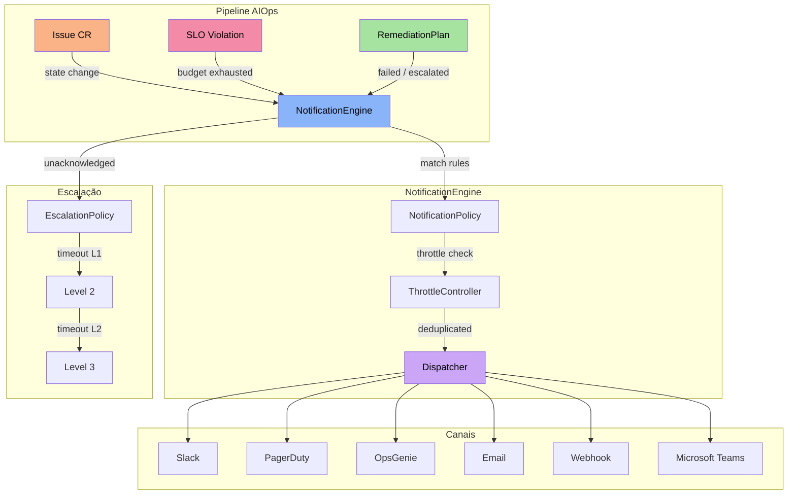
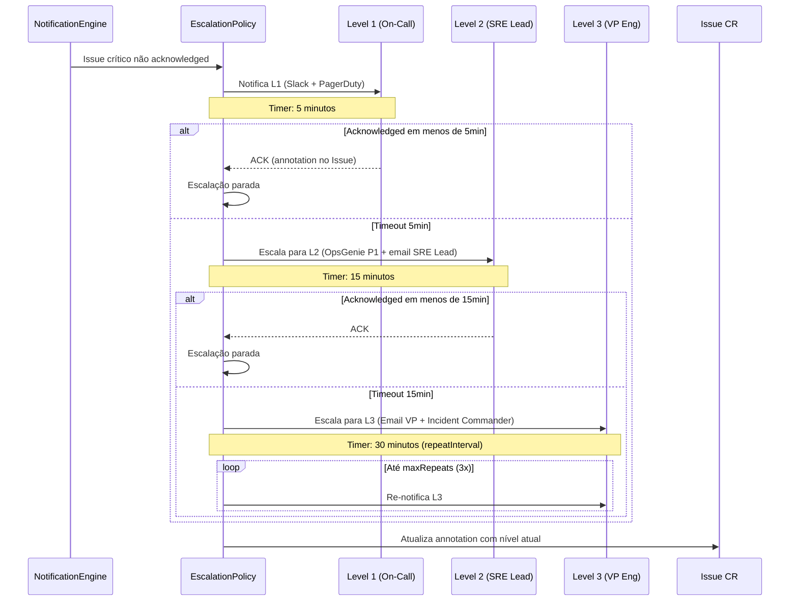

O sistema de notificações da plataforma AIOps permite que alertas, mudanças de estado de Issues e violações de SLA sejam comunicados automaticamente para as equipes corretas, nos canais corretos, no momento correto. Combinado com políticas de escalação, garante que nenhum incidente crítico passe despercebido.


## Visão Geral



O `NotificationEngine` é acionado sempre que:

| Evento | Descrição |
|--------|-----------|
| **Issue state change** | Transicao de estado (Detected, Analyzing, Remediating, Resolved, Escalated) |
| **SLO burn rate alert** | Burn rate excede threshold em janelas short+long |
| **SLA violation** | Tempo de resposta ou resolução excedeu o limite |
| **Remediation failure** | RemediationPlan falhou e atingiu max attempts |
| **Approval request** | ApprovalRequest criado aguardando aprovação |


## NotificationPolicy CRD

O `NotificationPolicy` define **quais eventos** disparam notificações, **para quais canais**, e com quais **regras de throttling**.

```yaml
apiVersion: platform.chatcli.io/v1alpha1
kind: NotificationPolicy
metadata:
  name: production-alerts
  namespace: production
spec:
  rules:
    - name: critical-incidents
      match:
        severities: [critical, high]
        signalTypes: [oom_kill, deploy_failing, error_rate]
        namespaces: [production, payments]
        resourceKinds: [Deployment, StatefulSet]
        states: [Detected, Escalated]
      channels:
        - type: slack
          config:
            webhook_url: "https://hooks.slack.com/services/T00/B00/xxxxx"
            channel: "#incidents-critical"
            mention: "@oncall-sre"
        - type: pagerduty
          config:
            routing_key: "R0xxxxxxxxxxxxxxxxxxxxxxxxxxxx"
            severity_mapping:
              critical: critical
              high: error
        - type: opsgenie
          config:
            api_key: "xxxxxxxx-xxxx-xxxx-xxxx-xxxxxxxxxxxx"
            priority_mapping:
              critical: P1
              high: P2
            responders:
              - type: team
                name: platform-sre
            tags: [production, aiops]

    - name: low-severity-digest
      match:
        severities: [medium, low]
        states: [Resolved]
      channels:
        - type: email
          config:
            smtp_host: smtp.company.com
            smtp_port: 587
            from: "aiops@company.com"
            to: ["sre-team@company.com"]
            subject_template: "[ChatCLI AIOps] {{.Severity}} - {{.ResourceName}}"
            tls_skip_verify: false

    - name: all-events-webhook
      match:
        severities: [critical, high, medium, low]
      channels:
        - type: webhook
          config:
            url: "https://internal-api.company.com/aiops/events"
            secret: "whsec_xxxxxxxxxxxxxxxxxxxxxxxx"
            headers:
              X-Source: chatcli-aiops
              X-Environment: production

    - name: teams-infra
      match:
        severities: [critical, high]
        namespaces: [infrastructure]
      channels:
        - type: teams
          config:
            webhook_url: "https://outlook.office.com/webhook/xxx/IncomingWebhook/yyy/zzz"

  throttle:
    deduplicationWindow: "5m"
    maxPerHour: 60
    groupBy: [namespace, resourceName, severity]
```

### Campos do Spec

#### NotificationRule

Cada regra define um par **match + channels**. Múltiplas regras podem ser definidas em uma mesma policy.

| Campo | Tipo | Obrigatório | Descrição |
|-------|------|:-----------:|-----------|
| `name` | string | **Sim** | Nome único da regra dentro da policy |
| `match` | NotificationMatch | **Sim** | Critérios de matching |
| `channels` | []ChannelConfig | **Sim** | Lista de canais de destino |

#### NotificationMatch

Todos os campos são opcionais. Se omitido, funciona como wildcard (match all). Quando múltiplos campos são definidos, a lógica é **AND** entre campos e **OR** dentro de cada campo.

| Campo | Tipo | Descrição |
|-------|------|-----------|
| `severities` | []string | `critical`, `high`, `medium`, `low` |
| `signalTypes` | []string | `oom_kill`, `pod_restart`, `pod_not_ready`, `deploy_failing`, `error_rate`, `latency_spike` |
| `namespaces` | []string | Namespaces K8s a monitorar |
| `resourceKinds` | []string | `Deployment`, `StatefulSet`, `DaemonSet` |
| `states` | []string | `Detected`, `Analyzing`, `Remediating`, `Resolved`, `Escalated`, `Failed` |

<Tip>
Combine `severities` com `states` para controle fino. Exemplo: notifique `critical` apenas em `Detected` e `Escalated`, evitando ruido de transicoes intermediarias.
</Tip>

#### ThrottleConfig

Controla a frequência e deduplicação de notificações para evitar alert fatigue.

| Campo | Tipo | Padrão | Descrição |
|-------|------|--------|-----------|
| `deduplicationWindow` | duration | `5m` | Janela temporal para deduplicação. Notificações idênticas dentro desta janela são suprimidas. |
| `maxPerHour` | int | `120` | Máximo de notificações por hora por policy. Excedentes são enfileirados. |
| `groupBy` | []string | `[namespace, resourceName]` | Campos usados para agrupar notificações. Notificações do mesmo grupo são consolidadas. |

```text
Dedup key = hash(policy_name + rule_name + groupBy_values + severity)

Exemplo com groupBy=[namespace, resourceName, severity]:
  key = hash("production-alerts" + "critical-incidents" + "production" + "api-gateway" + "critical")
```

<Warning>
Definir `maxPerHour` muito baixo (ex: 5) pode suprimir alertas criticos. Use valores >= 30 para policies que cobrem severidades `critical` e `high`. O throttle nunca bloqueia a primeira notificação de um novo incidente.
</Warning>


## Canais de Notificação

### 1. Slack

Envia notificações via Slack Incoming Webhooks usando **Block Kit** para rich formatting.

<Accordion title="Configuração completa do Slack">

| Campo | Tipo | Obrigatório | Descrição |
|-------|------|:-----------:|-----------|
| `webhook_url` | string | **Sim** | URL do Incoming Webhook do Slack |
| `channel` | string | Não | Override do canal (requer webhook com permissao) |
| `mention` | string | Não | Mencao (@user, @here, @channel, @oncall-group) |
| `username` | string | Não | Nome do bot (padrão: `ChatCLI AIOps`) |
| `icon_emoji` | string | Não | Emoji do bot (padrão: `:robot_face:`) |

**Cores por severidade no Block Kit:**

| Severidade | Cor (hex) | Visual |
|-----------|-----------|--------|
| Critical | `#E74C3C` | Vermelho intenso |
| High | `#E67E22` | Laranja |
| Medium | `#F1C40F` | Amarelo |
| Low | `#2ECC71` | Verde |

**Payload Block Kit enviado:**

```json
{
  "channel": "#incidents-critical",
  "username": "ChatCLI AIOps",
  "icon_emoji": ":robot_face:",
  "blocks": [
    {
      "type": "header",
      "text": {
        "type": "plain_text",
        "text": "CRITICAL: OOMKilled on api-gateway"
      }
    },
    {
      "type": "section",
      "fields": [
        {"type": "mrkdwn", "text": "*Namespace:*\nproduction"},
        {"type": "mrkdwn", "text": "*Resource:*\nDeployment/api-gateway"},
        {"type": "mrkdwn", "text": "*Signal:*\noom_kill"},
        {"type": "mrkdwn", "text": "*Risk Score:*\n85/100"},
        {"type": "mrkdwn", "text": "*State:*\nDetected"},
        {"type": "mrkdwn", "text": "*Confidence:*\n0.92"}
      ]
    },
    {
      "type": "section",
      "text": {
        "type": "mrkdwn",
        "text": "*Analysis:*\nMemory limit (512Mi) insufficient for current workload..."
      }
    },
    {
      "type": "context",
      "elements": [
        {"type": "mrkdwn", "text": "Issue: `api-gateway-oom-kill-1771276354` | <https://grafana.company.com/d/aiops|Dashboard>"}
      ]
    }
  ],
  "attachments": [{"color": "#E74C3C"}]
}
```

</Accordion>

**Exemplo mínimo:**

```yaml
channels:
  - type: slack
    config:
      webhook_url: "https://hooks.slack.com/services/T00/B00/xxxxx"
```

### 2. PagerDuty

Integra com PagerDuty via **Events API v2** para gerenciamento de incidentes on-call.

<Accordion title="Configuração completa do PagerDuty">

| Campo | Tipo | Obrigatório | Descrição |
|-------|------|:-----------:|-----------|
| `routing_key` | string | **Sim** | Integration Key do serviço PagerDuty (Events API v2) |
| `severity_mapping` | map | Não | Mapeamento de severidades ChatCLI para PagerDuty |
| `dedup_key_template` | string | Não | Template para dedup_key (padrão: `{{.IssueName}}`) |
| `custom_details` | map | Não | Campos extras no payload |

**Mapeamento de severidades padrão:**

| ChatCLI | PagerDuty | Comportamento |
|---------|-----------|---------------|
| `critical` | `critical` | Aciona on-call imediatamente |
| `high` | `error` | Alta prioridade |
| `medium` | `warning` | Prioridade moderada |
| `low` | `info` | Informativo |

**Deduplicação:**

O `dedup_key` garante que atualizações de um mesmo incidente não criem alertas duplicados no PagerDuty. O padrão usa o nome do Issue, mas pode ser customizado:

```yaml
dedup_key_template: "{{.Namespace}}-{{.ResourceName}}-{{.SignalType}}"
```

**Payload enviado (Events API v2):**

```json
{
  "routing_key": "R0xxxxxxxxxxxxxxxxxxxxxxxxxxxx",
  "event_action": "trigger",
  "dedup_key": "api-gateway-oom-kill-1771276354",
  "payload": {
    "summary": "[CRITICAL] OOMKilled on production/api-gateway",
    "severity": "critical",
    "source": "chatcli-aiops",
    "component": "api-gateway",
    "group": "production",
    "class": "oom_kill",
    "custom_details": {
      "risk_score": 85,
      "confidence": 0.92,
      "analysis": "Memory limit (512Mi) insufficient...",
      "issue_name": "api-gateway-oom-kill-1771276354",
      "remediation_plan": "RestartDeployment + AdjustResources"
    }
  }
}
```

**Resolução automatica:** Quando o Issue transiciona para `Resolved`, o NotificationEngine envia `event_action: resolve` com o mesmo `dedup_key`, fechando o incidente no PagerDuty automaticamente.

</Accordion>

### 3. OpsGenie

Integra com OpsGenie para alertas e on-call management com prioridades P1-P4.

<Accordion title="Configuração completa do OpsGenie">

| Campo | Tipo | Obrigatório | Descrição |
|-------|------|:-----------:|-----------|
| `api_key` | string | **Sim** | API Key do OpsGenie |
| `api_url` | string | Não | URL da API (padrão: `https://api.opsgenie.com`) |
| `priority_mapping` | map | Não | Mapeamento de severidades para prioridades |
| `responders` | []Responder | Não | Times ou usuários responsáveis |
| `tags` | []string | Não | Tags para categorizar alertas |
| `visible_to` | []Responder | Não | Quem pode ver o alerta |
| `actions` | []string | Não | Ações customizadas no alerta |

**Mapeamento de prioridades padrão:**

| ChatCLI | OpsGenie | Descrição |
|---------|----------|-----------|
| `critical` | `P1` | Crítico - aciona on-call imediatamente |
| `high` | `P2` | Alta prioridade |
| `medium` | `P3` | Prioridade moderada |
| `low` | `P4` | Baixa prioridade |

**Responder types:**

```yaml
responders:
  - type: team       # Time inteiro
    name: platform-sre
  - type: user       # Usuário específico
    username: edilson@company.com
  - type: escalation # Política de escalação do OpsGenie
    name: sre-escalation
  - type: schedule   # Schedule de on-call
    name: sre-oncall
```

</Accordion>

### 4. Email

Envia notificações via SMTP com suporte a STARTTLS e templates HTML.

<Accordion title="Configuração completa do Email">

| Campo | Tipo | Obrigatório | Descrição |
|-------|------|:-----------:|-----------|
| `smtp_host` | string | **Sim** | Host do servidor SMTP |
| `smtp_port` | int | **Sim** | Porta SMTP (587 para STARTTLS, 465 para SSL) |
| `from` | string | **Sim** | Endereço do remetente |
| `to` | []string | **Sim** | Lista de destinatarios |
| `cc` | []string | Não | Copia |
| `bcc` | []string | Não | Copia oculta |
| `username` | string | Não | Credencial SMTP (se auth requerida) |
| `password_secret` | SecretRef | Não | Referência ao Secret com a senha SMTP |
| `subject_template` | string | Não | Template Go para o assunto |
| `tls_skip_verify` | bool | Não | Pular verificação TLS (padrão: `false`) |
| `html_template` | string | Não | Template HTML customizado (Go template) |

**Variáveis disponíveis nos templates:**

| Variável | Descrição |
|----------|-----------|
| `{{.Severity}}` | Severidade do alerta |
| `{{.ResourceName}}` | Nome do recurso K8s |
| `{{.Namespace}}` | Namespace |
| `{{.SignalType}}` | Tipo do sinal |
| `{{.State}}` | Estado atual do Issue |
| `{{.RiskScore}}` | Risk score (0-100) |
| `{{.Analysis}}` | Análise da IA |
| `{{.IssueName}}` | Nome do Issue CR |
| `{{.Timestamp}}` | Timestamp ISO 8601 |

**Exemplo com STARTTLS:**

```yaml
channels:
  - type: email
    config:
      smtp_host: smtp.company.com
      smtp_port: 587
      from: "aiops@company.com"
      to: ["sre-team@company.com", "platform-leads@company.com"]
      cc: ["vp-engineering@company.com"]
      username: "aiops@company.com"
      password_secret:
        name: smtp-credentials
        key: password
      subject_template: "[{{.Severity}}] {{.SignalType}} on {{.Namespace}}/{{.ResourceName}}"
      tls_skip_verify: false
```

</Accordion>

<Warning>
Nunca coloque credenciais SMTP diretamente no YAML da NotificationPolicy. Use sempre `password_secret` apontando para um Kubernetes Secret.
</Warning>

### 5. Webhook

Envia notificações para endpoints HTTP arbitrarios com assinatura HMAC-SHA256.

<Accordion title="Configuração completa do Webhook">

| Campo | Tipo | Obrigatório | Descrição |
|-------|------|:-----------:|-----------|
| `url` | string | **Sim** | URL do endpoint de destino |
| `secret` | string | Não | Chave para assinatura HMAC-SHA256 |
| `headers` | map | Não | Headers HTTP customizados |
| `method` | string | Não | Método HTTP (padrão: `POST`) |
| `timeout` | duration | Não | Timeout da requisição (padrão: `10s`) |
| `retry_count` | int | Não | Número de retries em caso de falha (padrão: `3`) |
| `retry_interval` | duration | Não | Intervalo entre retries (padrão: `5s`) |

**Assinatura HMAC-SHA256:**

Quando `secret` é definido, toda requisição inclui o header `X-ChatCLI-Signature` com a assinatura HMAC-SHA256 do body:

```text
X-ChatCLI-Signature: sha256=<hex(HMAC-SHA256(secret, body))>
```

**Validação no receptor:**

```python
import hmac, hashlib

def verify_signature(payload: bytes, signature: str, secret: str) -> bool:
    expected = hmac.new(
        secret.encode(), payload, hashlib.sha256
    ).hexdigest()
    return hmac.compare_digest(f"sha256={expected}", signature)
```

**Payload JSON enviado:**

```json
{
  "event_type": "issue.state_changed",
  "timestamp": "2026-03-19T14:30:00Z",
  "issue": {
    "name": "api-gateway-oom-kill-1771276354",
    "namespace": "production",
    "severity": "critical",
    "state": "Detected",
    "signal_type": "oom_kill",
    "risk_score": 85,
    "resource": {
      "kind": "Deployment",
      "name": "api-gateway"
    }
  },
  "analysis": {
    "text": "Memory limit (512Mi) insufficient...",
    "confidence": 0.92,
    "recommendations": ["Increase memory limit to 1Gi"]
  },
  "remediation": {
    "plan_name": "api-gateway-oom-kill-plan-1",
    "actions": ["RestartDeployment", "AdjustResources"]
  }
}
```

</Accordion>

### 6. Microsoft Teams

Envia notificações para canais do Microsoft Teams via **Adaptive Cards** e Incoming Webhooks.

<Accordion title="Configuração completa do Microsoft Teams">

| Campo | Tipo | Obrigatório | Descrição |
|-------|------|:-----------:|-----------|
| `webhook_url` | string | **Sim** | URL do Incoming Webhook do Teams |
| `title_template` | string | Não | Template para o titulo do card |
| `theme_color` | string | Não | Cor do tema (hex, sem `#`) |

**Adaptive Card gerado:**

O NotificationEngine monta um Adaptive Card com secoes de:
- Header com severidade colorida
- Detalhes do recurso (namespace, kind, name)
- Análise da IA (se disponível)
- Ações sugeridas
- Link para o dashboard Grafana

**Cores por severidade no card:**

| Severidade | theme_color |
|-----------|-------------|
| Critical | `E74C3C` |
| High | `E67E22` |
| Medium | `F1C40F` |
| Low | `2ECC71` |

</Accordion>


## EscalationPolicy CRD

A `EscalationPolicy` define a cadeia de escalação automática quando um alerta não é reconhecido (acknowledged) dentro do timeout definido.

```yaml
apiVersion: platform.chatcli.io/v1alpha1
kind: EscalationPolicy
metadata:
  name: production-escalation
  namespace: production
spec:
  match:
    severities: [critical, high]
    namespaces: [production, payments]
  levels:
    - name: L1 - On-Call SRE
      timeout: "5m"
      targets:
        - type: channel
          channel:
            type: slack
            config:
              webhook_url: "https://hooks.slack.com/services/T00/B00/l1-hook"
              channel: "#sre-oncall"
              mention: "@oncall-sre"
        - type: channel
          channel:
            type: pagerduty
            config:
              routing_key: "R0-l1-routing-key"

    - name: L2 - SRE Lead + Platform Team
      timeout: "15m"
      targets:
        - type: user
          user: "sre-lead@company.com"
        - type: team
          team: "platform-engineering"
        - type: channel
          channel:
            type: opsgenie
            config:
              api_key: "xxxxxxxx"
              priority_mapping:
                critical: P1
                high: P1

    - name: L3 - VP Engineering + Incident Commander
      timeout: "30m"
      targets:
        - type: user
          user: "vp-eng@company.com"
        - type: oncall
          oncall:
            schedule: "incident-commander"
            provider: opsgenie
        - type: channel
          channel:
            type: email
            config:
              smtp_host: smtp.company.com
              smtp_port: 587
              from: "aiops-critical@company.com"
              to: ["exec-team@company.com"]

  repeatInterval: "30m"
  maxRepeats: 3
```

### Campos do Spec

| Campo | Tipo | Obrigatório | Descrição |
|-------|------|:-----------:|-----------|
| `match` | EscalationMatch | **Sim** | Critérios para aplicar esta escalação |
| `levels` | []EscalationLevel | **Sim** | Cadeia ordenada de níveis de escalação |
| `repeatInterval` | duration | Não | Intervalo para repetir o último nível (padrão: `30m`) |
| `maxRepeats` | int | Não | Máximo de repetições do último nível (padrão: `3`) |

#### EscalationLevel

| Campo | Tipo | Obrigatório | Descrição |
|-------|------|:-----------:|-----------|
| `name` | string | **Sim** | Nome descritivo do nível |
| `timeout` | duration | **Sim** | Tempo sem acknowledgement antes de escalar para o próximo nível |
| `targets` | []EscalationTarget | **Sim** | Destinos da notificação neste nível |

#### EscalationTarget

| Campo | Tipo | Descrição |
|-------|------|-----------|
| `type` | string | `channel`, `user`, `team`, `oncall` |
| `channel` | ChannelConfig | Configuração do canal (quando type=channel) |
| `user` | string | Email do usuário (quando type=user) |
| `team` | string | Nome do time (quando type=team) |
| `oncall` | OnCallRef | Referência ao schedule de on-call (quando type=oncall) |

### Como a Escalação Funciona



**Tracking via annotations:**

O `EscalationPolicy` reconciler rastreia o estado da escalação usando annotations no Issue CR:

| Annotation | Descrição |
|------------|-----------|
| `platform.chatcli.io/escalation-level` | Nível atual (0=L1, 1=L2, 2=L3) |
| `platform.chatcli.io/escalation-started-at` | Timestamp do início da escalação |
| `platform.chatcli.io/escalation-acknowledged` | `true` quando reconhecido |
| `platform.chatcli.io/escalation-acknowledged-by` | Quem reconheceu |
| `platform.chatcli.io/escalation-repeat-count` | Contagem de repetições do último nível |

**Acknowledgement:**

Para parar a cadeia de escalação, o on-call deve reconhecer o alerta:

```bash
kubectl annotate issue api-gateway-oom-kill-1771276354 \
  platform.chatcli.io/escalation-acknowledged=true \
  platform.chatcli.io/escalation-acknowledged-by=edilson
```

Ou via PagerDuty/OpsGenie (o webhook de retorno atualiza a annotation automaticamente).


## Exemplos Completos

### Política de Notificação: Slack + PagerDuty

```yaml
apiVersion: platform.chatcli.io/v1alpha1
kind: NotificationPolicy
metadata:
  name: critical-alerts-multi-channel
  namespace: production
spec:
  rules:
    - name: critical-to-slack-and-pagerduty
      match:
        severities: [critical]
        states: [Detected, Escalated]
      channels:
        - type: slack
          config:
            webhook_url: "https://hooks.slack.com/services/T00/B00/critical-hook"
            channel: "#p0-incidents"
            mention: "@here"
        - type: pagerduty
          config:
            routing_key: "R0-critical-routing-key"
            severity_mapping:
              critical: critical

    - name: high-to-slack
      match:
        severities: [high]
        states: [Detected, Remediating, Escalated]
      channels:
        - type: slack
          config:
            webhook_url: "https://hooks.slack.com/services/T00/B00/high-hook"
            channel: "#incidents"

    - name: resolved-to-slack
      match:
        states: [Resolved]
      channels:
        - type: slack
          config:
            webhook_url: "https://hooks.slack.com/services/T00/B00/resolved-hook"
            channel: "#incidents"

  throttle:
    deduplicationWindow: "3m"
    maxPerHour: 100
    groupBy: [namespace, resourceName]
```

### Política de Escalação L1 -> L2 -> L3

```yaml
apiVersion: platform.chatcli.io/v1alpha1
kind: EscalationPolicy
metadata:
  name: p0-escalation
  namespace: production
spec:
  match:
    severities: [critical]
  levels:
    - name: L1 - Primary On-Call
      timeout: "5m"
      targets:
        - type: channel
          channel:
            type: pagerduty
            config:
              routing_key: "R0-primary-oncall"
        - type: channel
          channel:
            type: slack
            config:
              webhook_url: "https://hooks.slack.com/services/T00/B00/oncall"
              channel: "#sre-oncall"
              mention: "@oncall-primary"

    - name: L2 - Secondary On-Call + SRE Manager
      timeout: "10m"
      targets:
        - type: oncall
          oncall:
            schedule: "secondary-oncall"
            provider: pagerduty
        - type: user
          user: "sre-manager@company.com"
        - type: channel
          channel:
            type: opsgenie
            config:
              api_key: "xxx"
              priority_mapping:
                critical: P1

    - name: L3 - Engineering Leadership
      timeout: "20m"
      targets:
        - type: team
          team: engineering-leadership
        - type: channel
          channel:
            type: email
            config:
              smtp_host: smtp.company.com
              smtp_port: 587
              from: "aiops-escalation@company.com"
              to: ["cto@company.com", "vp-eng@company.com"]
              subject_template: "[P0 ESCALATED] {{.ResourceName}} - {{.SignalType}} não resolvido"

  repeatInterval: "15m"
  maxRepeats: 5
```

### Email para SLA Breaches

```yaml
apiVersion: platform.chatcli.io/v1alpha1
kind: NotificationPolicy
metadata:
  name: sla-breach-notifications
  namespace: production
spec:
  rules:
    - name: sla-violation-email
      match:
        severities: [critical, high]
        signalTypes: [sla_violation]
      channels:
        - type: email
          config:
            smtp_host: smtp.company.com
            smtp_port: 587
            from: "sla-alerts@company.com"
            to:
              - "sre-team@company.com"
              - "service-owners@company.com"
            cc:
              - "vp-eng@company.com"
            username: "sla-alerts@company.com"
            password_secret:
              name: smtp-credentials
              key: password
            subject_template: "[SLA BREACH] {{.Severity}} - {{.Namespace}}/{{.ResourceName}} exceeds SLA"
            tls_skip_verify: false
        - type: slack
          config:
            webhook_url: "https://hooks.slack.com/services/T00/B00/sla-hook"
            channel: "#sla-violations"
            mention: "@service-owners"

  throttle:
    deduplicationWindow: "30m"
    maxPerHour: 20
    groupBy: [namespace, resourceName]
```


## Troubleshooting

<AccordionGroup>
  <Accordion title="Notificações não estão sendo enviadas">
    **Checklist de diagnóstico:**

    1. Verifique se a `NotificationPolicy` existe no namespace correto:
    ```bash
    kubectl get notificationpolicies -A
    ```

    2. Verifique os logs do operator para erros de dispatch:
    ```bash
    kubectl logs -l app=chatcli-operator -n chatcli-system | grep "notification"
    ```

    3. Confirme que o matching está correto:
    ```bash
    kubectl get issues -n production -o yaml | grep -A5 "severity\|state\|signalType"
    ```

    4. Verifique se o throttle não está suprimindo:
    ```bash
    kubectl logs -l app=chatcli-operator -n chatcli-system | grep "throttled\|deduplicated"
    ```
  </Accordion>

  <Accordion title="Slack retorna erro 404 ou invalid_payload">
    - Confirme que o `webhook_url` está correto e o app Slack está instalado no workspace
    - Verifique se o canal existe e o bot tem permissao de postar
    - Teste o webhook manualmente:
    ```bash
    curl -X POST -H 'Content-type: application/json' \
      --data '{"text":"Teste ChatCLI AIOps"}' \
      "https://hooks.slack.com/services/T00/B00/xxxxx"
    ```
  </Accordion>

  <Accordion title="PagerDuty não cria incidentes">
    - Confirme que o `routing_key` e uma Integration Key (não API Key)
    - Verifique se o serviço no PagerDuty está ativo
    - Valide o payload no PagerDuty Event Debugger
    - Confirme que o evento não está sendo deduplicado pelo `dedup_key`
  </Accordion>

  <Accordion title="Emails não chegam">
    - Verifique conectividade SMTP:
    ```bash
    kubectl exec -it deploy/chatcli-operator -n chatcli-system -- \
      nc -zv smtp.company.com 587
    ```
    - Confirme credenciais no Secret referenciado em `password_secret`
    - Verifique se `tls_skip_verify: false` e o certificado do servidor e valido
    - Cheque a pasta de spam dos destinatarios
  </Accordion>

  <Accordion title="Escalação não avança de nível">
    - Verifique annotations do Issue:
    ```bash
    kubectl get issue &lt;nome&gt; -o yaml | grep "escalation"
    ```
    - Confirme que `escalation-acknowledged` não está setado como `true`
    - Verifique os logs do EscalationPolicy reconciler
    - Confirme que o `timeout` do nível não e maior que o tempo desde a criacao
  </Accordion>

  <Accordion title="Webhook retorna erro de assinatura">
    - Confirme que o `secret` na policy e o mesmo usado no receptor para verificação
    - Verifique se o receptor está lendo o body raw antes de parsear JSON
    - Use `hmac.compare_digest` (ou equivalente) para evitar timing attacks
  </Accordion>
</AccordionGroup>


## Prometheus Metrics

O sistema de notificações expõe métricas para observabilidade completa:

| Metrica | Tipo | Labels | Descrição |
|---------|------|--------|-----------|
| `chatcli_notifications_sent_total` | Counter | `channel`, `severity`, `rule`, `namespace` | Total de notificações enviadas com sucesso |
| `chatcli_notifications_failed_total` | Counter | `channel`, `severity`, `rule`, `error_type` | Total de notificações que falharam |
| `chatcli_notifications_throttled_total` | Counter | `rule`, `reason` | Notificações suprimidas por throttle ou dedup |
| `chatcli_notification_dispatch_duration_seconds` | Histogram | `channel` | Latencia do envio por canal |
| `chatcli_escalation_level_reached` | Gauge | `policy`, `namespace` | Nível de escalação atual por policy |
| `chatcli_escalation_acknowledged_total` | Counter | `policy`, `level` | Total de escalações reconhecidas por nível |
| `chatcli_escalation_timeout_total` | Counter | `policy`, `level` | Total de timeouts de escalação por nível |

**Alertas Prometheus recomendados:**

```yaml
groups:
  - name: chatcli-notifications
    rules:
      - alert: NotificationChannelFailing
        expr: rate(chatcli_notifications_failed_total[5m]) > 0.1
        for: 5m
        labels:
          severity: warning
        annotations:
          summary: "Canal de notificação {{ $labels.channel }} com falhas"
          description: "Taxa de falha > 0.1/s nos ultimos 5 minutos"

      - alert: EscalationReachedL3
        expr: chatcli_escalation_level_reached >= 2
        for: 1m
        labels:
          severity: critical
        annotations:
          summary: "Escalação atingiu L3 para policy {{ $labels.policy }}"
          description: "Incidente não reconhecido atingiu o último nível de escalação"

      - alert: HighThrottleRate
        expr: rate(chatcli_notifications_throttled_total[10m]) > 1
        for: 10m
        labels:
          severity: warning
        annotations:
          summary: "Alta taxa de throttling na rule {{ $labels.rule }}"
```


## Próximo Passo

<CardGroup cols={2}>
  <Card title="SLOs e SLAs" icon="gauge-high" href="/features/aiops/slo-sla">
    Gestão de Service Level Objectives com burn rate alerting
  </Card>
  <Card title="Workflow de Aprovação" icon="shield-check" href="/features/aiops/approval-workflow">
    Controle de mudancas com approval policies e blast radius
  </Card>
  <Card title="AIOps Platform" icon="brain" href="/features/aiops-platform">
    Deep-dive na arquitetura AIOps
  </Card>
  <Card title="K8s Operator" icon="dharmachakra" href="/features/k8s-operator">
    Configuração e CRDs do operator
  </Card>
</CardGroup>
