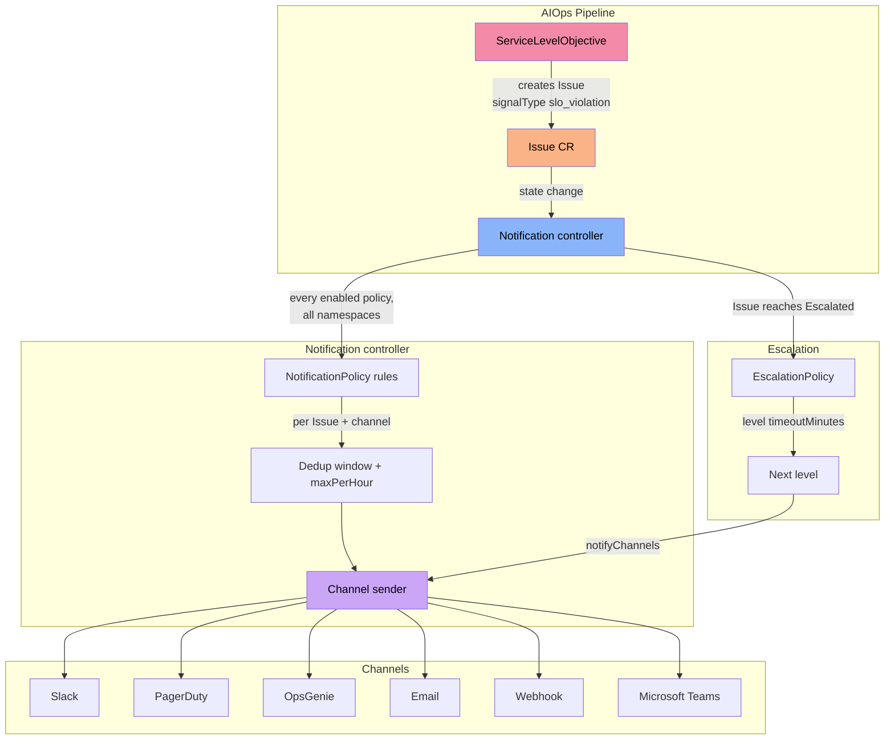
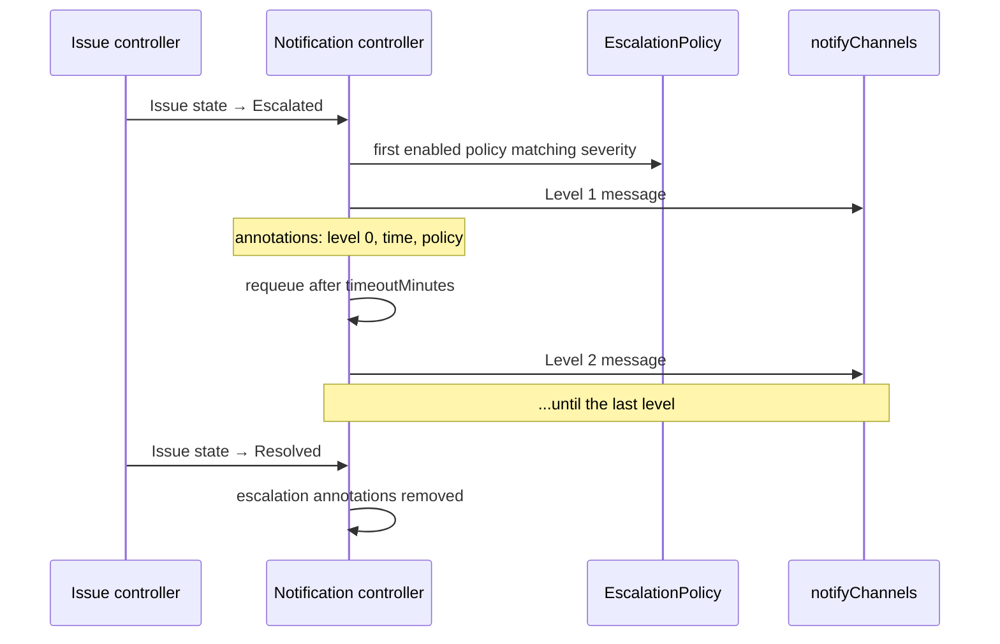

The AIOps platform notification system sends Issue state changes to the right teams on the right channels (Slack, PagerDuty, OpsGenie, email, generic webhooks and Microsoft Teams). Escalation policies add a timed chain of levels for Issues that automatic remediation could not fix.

Everything described on this page is done by one controller in the operator, the **notification controller** (`NotificationReconciler`), which watches `Issue` resources. `NotificationPolicy` and `EscalationPolicy` have no controller of their own: the notification controller reads them whenever an Issue changes.

## Overview


```mermaid
graph TD
    subgraph "AIOps Pipeline"
        ISS[Issue CR] -->|state change| NC[Notification controller]
        SLO[ServiceLevelObjective] -->|creates Issue<br/>signalType slo_violation| ISS
    end

    subgraph "Notification controller"
        NC -->|every enabled policy,<br/>all namespaces| NP[NotificationPolicy rules]
        NP -->|per Issue + channel| TC[Dedup window + maxPerHour]
        TC --> DISPATCH[Channel sender]
    end

    subgraph "Channels"
        DISPATCH --> SLACK[Slack]
        DISPATCH --> PD[PagerDuty]
        DISPATCH --> OG[OpsGenie]
        DISPATCH --> EMAIL[Email]
        DISPATCH --> WH[Webhook]
        DISPATCH --> TEAMS[Microsoft Teams]
    end

    subgraph "Escalation"
        NC -->|Issue reaches Escalated| EP[EscalationPolicy]
        EP -->|level timeoutMinutes| L2[Next level]
        L2 -->|notifyChannels| DISPATCH
    end

    style ISS fill:#fab387,color:#000
    style SLO fill:#f38ba8,color:#000
    style NC fill:#89b4fa,color:#000
    style DISPATCH fill:#cba6f7,color:#000
```

### What triggers a notification

The only trigger is a **change of `status.state` on an Issue**. The controller stores the last state it handled in the Issue annotation `platform.chatcli.io/last-notified-state`, and it evaluates the policies once for each new state: `Detected`, `Analyzing`, `Remediating`, `Contained`, `Resolved`, `Escalated`, `Failed`.

Other events reach a channel only if they turn into an Issue state change:

| Event | What actually happens |
|-------|------------------------|
| **SLO burn rate alert / budget exhausted** | The SLO controller creates an Issue with `signalType: slo_violation` (see [SLOs and SLAs](/features/aiops/slo-sla)). That Issue is then notified like any other. |
| **SLA violation** | **No notification.** The SLA controller records the breach in the `IncidentSLA` status and in the Issue annotation `platform.chatcli.io/sla-violated`. |
| **Remediation failure** | Visible only through the Issue states it causes (`Remediating` → `Analyzing` for a retry, `Escalated` once attempts run out). |
| **ApprovalRequest created** | **No notification.** Pending approvals show up in the dashboard, the REST API and `kubectl get approvalrequests`. |

<Warning>
`IncidentSLA.spec.notificationPolicyRef`, `IncidentSLA.spec.escalationPolicyRef` and `ServiceLevelObjective.spec.alertPolicy.notificationPolicyRef` exist in the CRDs, but no controller reads them. Routing is decided only by the `rules` of your NotificationPolicies. To route SLO alerts, match `signalTypes: [slo_violation]`.
</Warning>

<Note>
Issues created by a `ChaosExperiment` (label `platform.chatcli.io/source: chaos-experiment`) still produce normal state-change notifications. They **never start an escalation**, so a chaos drill never pages anyone through an EscalationPolicy.
</Note>

## NotificationPolicy CRD

A `NotificationPolicy` (short name `np`) declares a set of named **channels**, a list of **rules** that pick channels by name, **throttling**, and optional message **templates**.

```yaml
apiVersion: platform.chatcli.io/v1alpha1
kind: NotificationPolicy
metadata:
  name: production-alerts
  namespace: chatcli-system
spec:
  enabled: true
  channels:
    - name: slack-critical
      type: slack
      config:
        channel: "#incidents-critical"
      secretRef:
        name: slack-webhook            # Secret key: webhook_url
    - name: pagerduty-sre
      type: pagerduty
      config: {}
      secretRef:
        name: pagerduty-routing        # Secret key: routing_key
    - name: opsgenie-sre
      type: opsgenie
      config:
        tags: "production,aiops"
        responders: '[{"type":"team","name":"platform-sre"}]'
      secretRef:
        name: opsgenie-api             # Secret key: api_key
    - name: email-sre
      type: email
      config:
        smtp_host: smtp.example.com
        smtp_port: "587"
        from: "aiops@example.com"
        to: "sre-team@example.com,platform-leads@example.com"
      secretRef:
        name: smtp-credentials         # Secret keys: smtp_user, smtp_password
    - name: events-webhook
      type: webhook
      config:
        url: "https://events.example.com/aiops"
        headers: '{"X-Source":"chatcli-aiops","X-Environment":"production"}'
      secretRef:
        name: webhook-hmac             # Secret key: secret
    - name: teams-infra
      type: teams
      config: {}
      secretRef:
        name: teams-webhook            # Secret key: webhook_url

  rules:
    - name: critical-incidents
      severities: [critical, high]
      signalTypes: [oom_kill, deploy_failing, error_rate]
      namespaces: [production, payments]
      resourceKinds: [Deployment, StatefulSet]
      states: [Detected, Escalated, Resolved]
      channels: [slack-critical, pagerduty-sre, opsgenie-sre]

    - name: low-severity-resolved
      severities: [medium, low]
      states: [Resolved]
      channels: [email-sre]

    - name: all-events-webhook
      channels: [events-webhook]

    - name: teams-infra
      severities: [critical, high]
      namespaces: [infrastructure]
      channels: [teams-infra]

  throttle:
    deduplicationWindow: "5m"
    maxPerHour: 10

  templates:
    issue_created: "{{.Severity}} {{.SignalType}} on {{.Resource}} ({{.Namespace}}): {{.Description}}"
    issue_resolved: "{{.Resource}} in {{.Namespace}} is back to normal."
```

The Secrets referenced above live in the **same namespace as the policy**:

```bash
kubectl -n chatcli-system create secret generic slack-webhook \
  --from-literal=webhook_url='https://hooks.slack.com/services/T000/B000/XXXX'
kubectl -n chatcli-system create secret generic smtp-credentials \
  --from-literal=smtp_user='aiops@example.com' --from-literal=smtp_password='<password>'
```

### How policies are applied

- **Every enabled policy in every namespace** is evaluated for **every Issue** in the cluster. The namespace of the policy does not limit its scope. Use the rule's `namespaces` filter for that.
- Inside a policy, **every matching rule** sends to its channels. The same channel can receive the same Issue twice if two rules match, but the dedup window (below) usually suppresses the second send.
- A rule that names a channel missing from `spec.channels` is skipped with the log line `channel not found in policy`.

### Spec Fields

#### NotificationPolicySpec

| Field | Type | Required | Default | Description |
|-------|------|:--------:|---------|-------------|
| `channels` | []NotificationChannel | **Yes** | | Channels this policy can deliver to |
| `rules` | []NotificationRule | **Yes** | | When and where to send |
| `throttle` | ThrottleConfig | No | | Rate limiting |
| `templates` | map[string]string | No | | Custom message body per event key |
| `enabled` | bool | No | `true` | Disabled policies are ignored |

#### NotificationChannel

| Field | Type | Required | Description |
|-------|------|:--------:|-------------|
| `name` | string | **Yes** | Name that rules (and escalation levels) refer to |
| `type` | enum | **Yes** | `slack`, `pagerduty`, `opsgenie`, `email`, `webhook`, `teams` |
| `config` | map[string]string | **Yes** | Channel-specific keys (see each channel below). Use `config: {}` when everything comes from `secretRef`. |
| `secretRef.name` | string | No | Secret in the policy's namespace. **Every key** of the Secret is merged into `config` and overrides keys with the same name. |

<Warning>
`config` is a **map of strings**. Numbers, booleans, lists and maps must be written as strings: `smtp_port: "587"`, `tls_skip_verify: "true"`, `to: "a@example.com,b@example.com"`, `headers: '{"X-Env":"prod"}'`. An unquoted `587` or a YAML list is rejected by the API server.
</Warning>

<Warning>
`GET /api/v1/policies/notification` on the operator REST API returns the full `spec`, including `config`, to any key with the `viewer` role. Keep webhook URLs, routing keys, API keys and passwords in the `secretRef` Secret, not in `config`.
</Warning>

#### NotificationRule

The filters sit directly on the rule (there is no `match` block). An omitted or empty filter matches everything. The logic is **AND** between filters and **OR** within a filter.

| Field | Type | Description |
|-------|------|-------------|
| `name` | string | **Required.** Rule name (used in logs) |
| `severities` | []enum | `critical`, `high`, `medium`, `low` |
| `signalTypes` | []string | Compared with the Issue's `spec.signalType`, for example `oom_kill`, `pod_restart`, `pod_not_ready`, `deploy_failing`, `error_rate`, `crashloop_backoff`, `slo_violation` |
| `namespaces` | []string | Compared with the **affected resource's** namespace (`spec.resource.namespace`), not the Issue's own namespace |
| `resourceKinds` | []string | Compared with `spec.resource.kind`, for example `Deployment`, `StatefulSet`, `DaemonSet` |
| `states` | []enum | `Detected`, `Analyzing`, `Remediating`, `Contained`, `Resolved`, `Escalated`, `Failed` |
| `channels` | []string | **Required.** Names of channels from `spec.channels` |

<Tip>
Always list `states`. Without it, every transition of the Issue (`Detected` → `Analyzing` → `Remediating` → ...) is a candidate. Also include `Resolved` for PagerDuty and OpsGenie channels: that is what resolves or closes the alert on their side.
</Tip>

#### ThrottleConfig

| Field | Type | Default | What the code does |
|-------|------|---------|--------------------|
| `deduplicationWindow` | duration string | `5m` | After a successful send, further sends **for the same Issue to the same channel name** are dropped until the window has passed. Parsed with Go `time.ParseDuration` (`30s`, `5m`, `2h`). An invalid value such as `1d` silently falls back to `5m`. |
| `maxPerHour` | int | `10` | At most this many successful sends **per Issue per channel name per clock hour**. `0` or a negative value means `10`. |
| `groupingWindow` | duration string | `1m` | **Not implemented.** Accepted by the CRD, ignored by the controller. There is no grouping or digest. |

```text
Throttle key = <issue namespace>/<issue name>/<channel name>
```

<Warning>
Throttled notifications are **dropped, not queued**, and the state is still marked as handled, so it is never sent later. With the default `5m` window, an Issue that goes `Detected` → `Analyzing` → `Remediating` → `Resolved` within five minutes sends **only the first matching state** to each channel. For PagerDuty and OpsGenie, that can mean the `Resolved` event (resolve/close) is dropped and the alert stays open. For channels that must see every transition, use a short window such as `30s`.

The throttle state is kept **in the operator's memory**: it resets when the operator restarts. The window is measured per channel **name**, so two policies that use the same channel name share it.
</Warning>

#### Templates

`templates` replaces the **message body** (the title and email subject stay the same). The key is chosen from the new state:

| Issue state | Template key |
|-------------|--------------|
| `Detected` (and any state not listed below, such as `Analyzing` or `Contained`) | `issue_created` |
| `Remediating` | `remediation_started` |
| `Resolved` | `issue_resolved` |
| `Escalated` | `issue_escalated` |
| `Failed` | `remediation_failed` |

The key `remediation_completed` is accepted but never used. Templates are **not** Go `text/template`: they are plain placeholder replacement, and only these exact tokens are replaced: `{{.Name}}` (Issue name), `{{.Namespace}}`, `{{.Severity}}`, `{{.State}}`, `{{.Resource}}` (`Kind/name`), `{{.Description}}`, `{{.Source}}`, `{{.SignalType}}`, `{{.RiskScore}}`. Anything else (conditionals, functions, other fields) is sent literally.

Without a template, the body is the Issue's `spec.description`, or `Issue <name> on <Kind>/<name> transitioned to <State>.` when the description is empty.

### Message content

Every channel receives the same message:

- **Title**: `<severity emoji> [<SEVERITY>] <namespace>/<resource name> — <State>`, for example `🔴 [CRITICAL] production/api-gateway — Detected`.
- **Body**: the template or description (see above).
- **Fields**: `Source`, `SignalType`, `RiskScore`, plus `CorrelationID`, `RemediationAttempts` (`n/max`) and `Resolution` when they are set.
- **Color** by severity: critical `#FF0000`, high `#FF8C00`, medium `#FFD700`, low `#00CC00`.

The message does not include the AI analysis, the remediation plan or a dashboard link. Every HTTP channel uses a 30-second timeout and makes **a single attempt**, with no retries.

### Status

| Field | Description |
|-------|-------------|
| `status.totalSent` / `status.failedCount` | Counters of successful and failed deliveries |
| `status.lastNotifiedAt` | Time of the last successful delivery |
| `status.recentDeliveries` | The last 20 attempts (`channel`, `sentAt`, `success`, `error`) |
| `status.conditions[Ready]` | `True/DeliverySucceeded` or `False/DeliveryFailed` with the last error |

Escalation notifications are not counted in this status. Every delivery attempt, including escalation sends, is also recorded as an `AuditEvent` with `eventType: notification_sent` (see [Audit and Compliance](/features/aiops/audit-compliance)).

```bash
kubectl get np -A
# NAME                ENABLED   CHANNELS   SENT   FAILED   AGE
# production-alerts   true      <none>     42     1        3d
kubectl get np production-alerts -n chatcli-system -o jsonpath='{.status.recentDeliveries}'
```

<Note>
The `CHANNELS` printer column always shows `<none>`: it points at the `spec.channels` array, but it is declared as an integer column, which Kubernetes cannot render.
</Note>

## Notification Channels

### 1. Slack

Posts to a Slack **Incoming Webhook** using Block Kit.

<Accordion title="Full Slack configuration">

| Key | Required | Description |
|-----|:--------:|-------------|
| `webhook_url` | **Yes** | Incoming Webhook URL |
| `channel` | No | Sent as `channel` in the payload. Webhooks created by a Slack app post to their own channel and ignore it. |
| `username` | No | Sent as `username` in the payload |

No other keys are read (there is no mention or icon option). To mention a group, put the mention in a template, for example `issue_created: "<!subteam^S0123ABC> {{.Description}}"`.

**Payload sent:**

```json
{
  "channel": "#incidents-critical",
  "blocks": [
    {"type": "header", "text": {"type": "plain_text", "text": "🔴 [CRITICAL] production/api-gateway — Detected"}},
    {
      "type": "section",
      "text": {"type": "mrkdwn", "text": "OOMKilled: container exceeded its 512Mi memory limit"},
      "fields": [
        {"type": "mrkdwn", "text": "*Severity:* 🔴 critical"},
        {"type": "mrkdwn", "text": "*Resource:* Deployment/api-gateway"},
        {"type": "mrkdwn", "text": "*Namespace:* production"},
        {"type": "mrkdwn", "text": "*State:* Detected"},
        {"type": "mrkdwn", "text": "*SignalType:* oom_kill"},
        {"type": "mrkdwn", "text": "*RiskScore:* 85"},
        {"type": "mrkdwn", "text": "*Source:* watcher"}
      ]
    },
    {"type": "context", "elements": [{"type": "mrkdwn", "text": "Issue: *api-gateway-oom-kill-1771276354* | 2026-03-19T14:30:00Z"}]}
  ],
  "attachments": [{"color": "#FF0000", "blocks": []}]
}
```

The extra fields (`SignalType`, `RiskScore`, ...) come from a map, so their order can change between messages.

</Accordion>

**Minimal example:**

```yaml
channels:
  - name: slack
    type: slack
    config:
      webhook_url: "https://hooks.slack.com/services/T000/B000/XXXX"
rules:
  - name: everything-to-slack
    states: [Detected, Escalated, Resolved]
    channels: [slack]
```

### 2. PagerDuty

Sends events to the PagerDuty **Events API v2** (`https://events.pagerduty.com/v2/enqueue`; the endpoint is fixed).

<Accordion title="Full PagerDuty configuration">

| Key | Required | Description |
|-----|:--------:|-------------|
| `routing_key` | **Yes** | Integration Key of an Events API v2 integration |

No other keys are read. The severity mapping and the dedup key are fixed (the `severity_map` key mentioned in the CRD field description is not implemented):

| ChatCLI | PagerDuty |
|---------|-----------|
| `critical` | `critical` |
| `high` | `error` |
| `medium` | `warning` |
| `low` | `info` |

**Deduplication:** `dedup_key` is always `chatcli-<resource namespace>-<issue name>`, so every notified state of one Issue updates the same PagerDuty alert.

**Payload sent:**

```json
{
  "routing_key": "<routing_key>",
  "event_action": "trigger",
  "dedup_key": "chatcli-production-api-gateway-oom-kill-1771276354",
  "payload": {
    "summary": "🔴 [CRITICAL] production/api-gateway — Detected",
    "source": "chatcli/production/Deployment/api-gateway",
    "severity": "critical",
    "timestamp": "2026-03-19T14:30:00Z",
    "component": "Deployment/api-gateway",
    "group": "production",
    "class": "critical",
    "custom_details": {
      "resource": "Deployment/api-gateway",
      "namespace": "production",
      "state": "Detected",
      "severity": "critical",
      "Source": "watcher",
      "SignalType": "oom_kill",
      "RiskScore": "85"
    }
  }
}
```

**Automatic resolution:** when a notification is sent for the `Resolved` state, the event uses `event_action: resolve` with the same `dedup_key`. This happens only if a rule sends `Resolved` to this channel and the send is not throttled (see the throttle warning above).

</Accordion>

### 3. OpsGenie

Creates alerts through the OpsGenie Alert API (`https://api.opsgenie.com/v2/alerts`; the endpoint is fixed, so accounts on the EU instance are not supported).

<Accordion title="Full OpsGenie configuration">

| Key | Required | Description |
|-----|:--------:|-------------|
| `api_key` | **Yes** | API key, sent as `Authorization: GenieKey <api_key>` |
| `tags` | No | Comma-separated string, for example `"production,aiops"` |
| `responders` | No | A **JSON string** with a list of responder objects. Invalid JSON is silently ignored. |

**Priority mapping (fixed):** `critical` → `P1`, `high` → `P2`, `medium` → `P3`, `low` → `P4`.

**Responders:**

```yaml
config:
  responders: '[{"type":"team","name":"platform-sre"},{"type":"user","username":"oncall@example.com"},{"type":"escalation","name":"sre-escalation"},{"type":"schedule","name":"sre-oncall"}]'
```

The alert `alias` is `chatcli-<resource namespace>-<issue name>`, `source` is `ChatCLI AIOps`, `entity` is the resource, and `details` has `resource`, `namespace`, `severity`, `state` and `issue`.

**Automatic close:** for the `Resolved` state, the channel closes the alert by alias instead of creating one (same conditions as PagerDuty).

</Accordion>

### 4. Email

Sends an HTML email over SMTP.

<Accordion title="Full Email configuration">

| Key | Required | Description |
|-----|:--------:|-------------|
| `smtp_host` | **Yes** | SMTP server host |
| `smtp_port` | **Yes** | Port, as a string (`"587"`, `"25"`) |
| `from` | **Yes** | Sender address |
| `to` | **Yes** | Comma-separated recipients |
| `smtp_user` | No | Enables SMTP `PLAIN` authentication |
| `smtp_password` | No | Password for `smtp_user` (keep it in the Secret) |
| `tls_skip_verify` | No | `"true"` skips certificate verification for STARTTLS |

There are no `cc`, `bcc`, subject or HTML template options. The subject is always `[<SEVERITY>] <title>` and the body is a fixed HTML layout with the fields table.

**TLS behavior:**

- The connection starts in plain text. STARTTLS is used **only if the server advertises it**.
- Implicit TLS (port `465`) is **not supported**.
- If the server does not offer STARTTLS and `smtp_user` is set, authentication fails (Go refuses to send `PLAIN` credentials over an unencrypted connection, except to `localhost`).
- The SMTP connection has no timeout of its own, so an unreachable server can hold the reconcile until the operating system's TCP timeout expires.

**Example:**

```yaml
channels:
  - name: email-sre
    type: email
    config:
      smtp_host: smtp.example.com
      smtp_port: "587"
      from: "aiops@example.com"
      to: "sre-team@example.com,platform-leads@example.com"
    secretRef:
      name: smtp-credentials   # keys: smtp_user, smtp_password
```

</Accordion>

<Warning>
Never put SMTP credentials directly in the NotificationPolicy YAML. Put `smtp_user` and `smtp_password` in a Secret and reference it with `secretRef`.
</Warning>

### 5. Webhook

Sends the message as JSON to any HTTP endpoint, optionally signed with HMAC-SHA256.

<Accordion title="Full Webhook configuration">

| Key | Required | Description |
|-----|:--------:|-------------|
| `url` | **Yes** | Destination URL |
| `method` | No | HTTP method (default `POST`) |
| `headers` | No | A **JSON object string** of extra headers, for example `'{"X-Source":"chatcli-aiops"}'`. Invalid JSON is silently ignored. |
| `secret` | No | Key for the HMAC-SHA256 signature |

Every request has `Content-Type: application/json` and `User-Agent: ChatCLI-AIOps/1.0`. The timeout is 30 seconds and there are no retries.

**HMAC-SHA256 signing:**

When `secret` is set, the request carries the header `X-Signature-256` with the HMAC-SHA256 of the raw body:

```text
X-Signature-256: sha256=<hex(HMAC-SHA256(secret, body))>
```

**Validation on the receiver:**

```python
import hmac, hashlib

def verify_signature(payload: bytes, signature: str, secret: str) -> bool:
    expected = hmac.new(
        secret.encode(), payload, hashlib.sha256
    ).hexdigest()
    return hmac.compare_digest(f"sha256={expected}", signature)
```

**JSON payload sent:**

```json
{
  "title": "🔴 [CRITICAL] production/api-gateway — Detected",
  "body": "OOMKilled: container exceeded its 512Mi memory limit",
  "severity": "critical",
  "issueName": "api-gateway-oom-kill-1771276354",
  "namespace": "production",
  "resource": "Deployment/api-gateway",
  "state": "Detected",
  "timestamp": "2026-03-19T14:30:00.123456789Z",
  "fields": {
    "Source": "watcher",
    "SignalType": "oom_kill",
    "RiskScore": "85"
  },
  "color": "#FF0000"
}
```

</Accordion>

### 6. Microsoft Teams

Posts an **Adaptive Card** (version 1.4) to a Teams incoming webhook URL.

<Accordion title="Full Microsoft Teams configuration">

| Key | Required | Description |
|-----|:--------:|-------------|
| `webhook_url` | **Yes** | Teams webhook URL |

No other keys are read.

**Generated card:**

- A large, bold title (the message title)
- The body text
- A FactSet with `Severity`, `Resource`, `Namespace`, `State`, `Issue` and the extra fields
- A footer with the generation time

The message also carries `themeColor` with the severity color without `#` (`FF0000`, `FF8C00`, `FFD700`, `00CC00`).

</Accordion>

## EscalationPolicy CRD

An `EscalationPolicy` (short name `ep`) is an ordered chain of levels. It is used when an Issue enters the **`Escalated`** state, which the Issue controller sets when automatic remediation gives up (for example, all remediation attempts failed).

```yaml
apiVersion: platform.chatcli.io/v1alpha1
kind: EscalationPolicy
metadata:
  name: production-escalation
  namespace: chatcli-system
spec:
  enabled: true
  severities: [critical, high]
  levels:
    - name: L1-OnCall
      timeoutMinutes: 5
      targets:
        - type: oncall
          name: sre-primary
      notifyChannels: [slack-critical, pagerduty-sre]

    - name: L2-SeniorSRE
      timeoutMinutes: 15
      targets:
        - type: user
          name: sre-lead@example.com
        - type: team
          name: platform-engineering
      notifyChannels: [opsgenie-sre, email-sre]

    - name: L3-Management
      timeoutMinutes: 30
      targets:
        - type: team
          name: engineering-leadership
      notifyChannels: [email-sre]
```

### Spec Fields

| Field | Type | Required | Default | Description |
|-------|------|:--------:|---------|-------------|
| `levels` | []EscalationLevel | **Yes** | | Ordered chain, first level first |
| `severities` | []enum | No | all | Issue severities this policy applies to |
| `defaultPolicy` | bool | No | `false` | Used when no policy matches by severity |
| `enabled` | bool | No | `true` | Disabled policies are ignored |

#### EscalationLevel

| Field | Type | Required | Default | Description |
|-------|------|:--------:|---------|-------------|
| `name` | string | **Yes** | | Level name (shown in the message and in the metric label) |
| `timeoutMinutes` | int | **Yes** | `15` | Minutes at this level before moving to the next one |
| `targets` | []EscalationTarget | **Yes** | | Who is responsible at this level |
| `notifyChannels` | []string | No | | Channel **names** from NotificationPolicies. This is the only way a level delivers anything. |
| `repeatIntervalMinutes` | int | No | `0` | **Not implemented.** Accepted, never read. Levels are not re-notified. |

#### EscalationTarget

| Field | Type | Description |
|-------|------|-------------|
| `type` | enum | `channel`, `user`, `team`, `oncall` |
| `name` | string | User email, team name, channel name or on-call schedule name |

<Warning>
**Targets are informational only.** The operator does not contact users, teams or on-call schedules. It writes the list (for example `oncall:sre-primary, user:sre-lead@example.com`) into the escalation message and sends that message to the level's `notifyChannels`. A level without `notifyChannels` notifies nobody.
</Warning>

### How Escalation Works

1. **Start.** When an Issue changes to `Escalated` (and it is not chaos-induced), the controller picks a policy: the **first enabled policy, from any namespace**, whose `severities` contains the Issue's severity, or that has no `severities`. A policy with `defaultPolicy: true` is used only when no policy matched. If nothing is found, no escalation happens (log line `no escalation policy found for issue`).
2. **Level 1** is notified right away. The Issue gets the annotations below and the policy status gets an `activeEscalations` entry.
3. **Advance.** When `timeoutMinutes` of the current level has passed, the next level is notified with the title `<emoji> ESCALATION [<SEVERITY>] <issue> — Level <n>: <level name>`.
4. **Last level.** The chain stops there. Nothing is repeated.
5. **Stop.** The escalation ends only when the Issue reaches `Resolved`: the three annotations are removed. There is no acknowledgement step (see below).

Escalation messages are sent to every channel in any enabled NotificationPolicy whose name is listed in `notifyChannels` (Secrets are read from that policy's namespace). They do not go through the rules, the throttle or the templates.


```mermaid
sequenceDiagram
    participant IC as Issue controller
    participant NC as Notification controller
    participant EP as EscalationPolicy
    participant CH as notifyChannels

    IC->>NC: Issue state → Escalated
    NC->>EP: first enabled policy matching severity
    NC->>CH: Level 1 message
    Note over NC: annotations: level 0, time, policy
    NC->>NC: requeue after timeoutMinutes
    NC->>CH: Level 2 message
    Note over NC,CH: ...until the last level
    IC->>NC: Issue state → Resolved
    NC->>NC: escalation annotations removed
```

**Issue annotations used for tracking:**

| Annotation | Description |
|------------|-------------|
| `platform.chatcli.io/escalation-level` | Current level index (`0` = first level) |
| `platform.chatcli.io/escalation-time` | RFC 3339 time the current level was reached |
| `platform.chatcli.io/escalation-policy` | Name of the EscalationPolicy in use |

```bash
kubectl get issue <name> -n <namespace> -o jsonpath='{.metadata.annotations}'
kubectl get ep -A
kubectl get ep production-escalation -n chatcli-system -o jsonpath='{.status.activeEscalations}'
```

The `LEVELS` printer column of `kubectl get ep` always shows `<none>`, for the same reason as the NotificationPolicy `CHANNELS` column. Entries in `status.activeEscalations` are never removed when an Issue is resolved, and `acknowledgedAt`/`acknowledgedBy` are never filled.

### Acknowledgement and stopping an escalation

There is **no acknowledgement mechanism** that stops the chain:

- `POST /api/v1/incidents/{name}/acknowledge` (operator role, `X-API-Key` header) only adds the annotations `aiops.chatcli.io/acknowledged`, `aiops.chatcli.io/acknowledged-at` and `aiops.chatcli.io/acknowledged-by` (the caller's role). The escalation logic does not read them.
- `POST /api/v1/incidents/{name}/snooze` only records `aiops.chatcli.io/snoozed-until`. Notifications and escalation ignore it.
- Acknowledging in PagerDuty or OpsGenie does nothing on the cluster side: there is no inbound webhook.

To end an escalation, **resolve the Issue**, for example with `POST /api/v1/incidents/{name}/resolve` (operator role) or from the dashboard. That also sends the `Resolved` notifications that resolve the PagerDuty event and close the OpsGenie alert.

<Warning>
**Known limitation: level changes are not saved.** When a level times out, the controller sends the next level's message but does not persist the new `escalation-level` / `escalation-time` annotations unless the Issue's state changes at the same moment. In practice, after the first timeout the **second level's message is re-sent every time that level's `timeoutMinutes` elapses** (and also on other updates to the Issue), and levels beyond the second are not reached. Until this is fixed, design policies with two levels and put everyone who must be paged in the second level's `notifyChannels`. The `escalation_level_reached` metric counts every re-send.
</Warning>

## Complete Examples

### Notification Policy: Slack + PagerDuty

```yaml
apiVersion: platform.chatcli.io/v1alpha1
kind: NotificationPolicy
metadata:
  name: critical-alerts-multi-channel
  namespace: chatcli-system
spec:
  channels:
    - name: slack-p0
      type: slack
      config: {}
      secretRef: {name: slack-p0-webhook}         # webhook_url
    - name: slack-incidents
      type: slack
      config: {}
      secretRef: {name: slack-incidents-webhook}  # webhook_url
    - name: pagerduty-critical
      type: pagerduty
      config: {}
      secretRef: {name: pagerduty-critical}       # routing_key

  rules:
    - name: critical-to-slack-and-pagerduty
      severities: [critical]
      states: [Detected, Escalated, Resolved]
      channels: [slack-p0, pagerduty-critical]

    - name: high-to-slack
      severities: [high]
      states: [Detected, Remediating, Escalated]
      channels: [slack-incidents]

    - name: resolved-to-slack
      states: [Resolved]
      channels: [slack-incidents]

  throttle:
    deduplicationWindow: "30s"
    maxPerHour: 20
```

The short `30s` window makes the `Resolved` event (which resolves the PagerDuty incident) much less likely to be dropped after a fast recovery.

### Escalation Policy with two levels

```yaml
apiVersion: platform.chatcli.io/v1alpha1
kind: EscalationPolicy
metadata:
  name: p0-escalation
  namespace: chatcli-system
spec:
  severities: [critical]
  levels:
    - name: L1-PrimaryOnCall
      timeoutMinutes: 5
      targets:
        - type: oncall
          name: primary-oncall
      notifyChannels: [pagerduty-critical, slack-p0]

    - name: L2-SecondaryOnCall-and-Manager
      timeoutMinutes: 15
      targets:
        - type: oncall
          name: secondary-oncall
        - type: user
          name: sre-manager@example.com
      notifyChannels: [slack-p0, email-leadership]
---
apiVersion: platform.chatcli.io/v1alpha1
kind: EscalationPolicy
metadata:
  name: catch-all-escalation
  namespace: chatcli-system
spec:
  defaultPolicy: true
  severities: [high, medium, low]
  levels:
    - name: L1-Team
      timeoutMinutes: 30
      targets:
        - type: team
          name: platform-sre
      notifyChannels: [slack-incidents]
```

`email-leadership` must be a channel defined in some NotificationPolicy. Because of the limitation above, the second level's message repeats every 15 minutes until the Issue is resolved.

### SLO violation alerts

SLO burn-rate and budget-exhaustion alerts arrive as Issues with `signalType: slo_violation` and `source: watcher`:

```yaml
apiVersion: platform.chatcli.io/v1alpha1
kind: NotificationPolicy
metadata:
  name: slo-notifications
  namespace: chatcli-system
spec:
  channels:
    - name: email-service-owners
      type: email
      config:
        smtp_host: smtp.example.com
        smtp_port: "587"
        from: "slo-alerts@example.com"
        to: "sre-team@example.com,service-owners@example.com"
      secretRef: {name: smtp-credentials}    # smtp_user, smtp_password
    - name: slack-slo
      type: slack
      config:
        channel: "#slo-violations"
      secretRef: {name: slack-slo-webhook}   # webhook_url
  rules:
    - name: slo-violations
      severities: [critical, high]
      signalTypes: [slo_violation]
      states: [Detected, Resolved]
      channels: [email-service-owners, slack-slo]
  throttle:
    deduplicationWindow: "30m"
    maxPerHour: 5
  templates:
    issue_created: "SLO alert: {{.Description}}"
```

## Troubleshooting

<AccordionGroup>
  <Accordion title="Notifications are not being sent">
    **Diagnostic checklist:**

    1. Check that the policy exists and is enabled (policies in any namespace apply):
    ```bash
    kubectl get np -A
    ```

    2. Check the policy status for delivery errors:
    ```bash
    kubectl get np <policy> -n <namespace> -o jsonpath='{.status.recentDeliveries}'
    ```

    3. Check the operator logs (`rule matched`, `notification sent`, `failed to send notification`, `channel not found in policy`, `failed to resolve channel config`):
    ```bash
    kubectl logs -n chatcli-system deploy/chatcli-operator | grep -i notification
    ```

    4. Compare the Issue with the rule filters. Remember that `namespaces` is compared with `spec.resource.namespace`:
    ```bash
    kubectl get issue <name> -n <namespace> \
      -o jsonpath='{.spec.severity} {.spec.signalType} {.spec.resource.kind} {.spec.resource.namespace} {.status.state}{"\n"}'
    ```

    5. Check whether the throttle dropped it (log line `notification throttled`). Another state of the same Issue may have been sent to that channel within `deduplicationWindow`.

    6. If `platform.chatcli.io/last-notified-state` already equals the current state, that state was already handled and is not evaluated again.
  </Accordion>

  <Accordion title="The policy is rejected by kubectl apply">
    - Every `config` value must be a string: quote numbers (`smtp_port: "587"`) and booleans (`tls_skip_verify: "true"`), and write lists as comma-separated strings.
    - Every channel needs `name`, `type` and `config` (use `config: {}` when the values come from `secretRef`).
    - Rule filters sit directly on the rule; a `match:` block is not part of the schema.
  </Accordion>

  <Accordion title="Slack returns 404 or invalid_payload error">
    - Confirm that the `webhook_url` is correct and the Slack app is still installed in the workspace
    - Test the webhook manually:
    ```bash
    curl -X POST -H 'Content-type: application/json' \
      --data '{"text":"ChatCLI AIOps Test"}' \
      "https://hooks.slack.com/services/T000/B000/XXXX"
    ```
  </Accordion>

  <Accordion title="PagerDuty does not create or resolve incidents">
    - Confirm that the `routing_key` is an Events API v2 Integration Key (not a REST API key)
    - Confirm that the service in PagerDuty is active, and check the payload in the PagerDuty Event Debugger
    - If incidents are never resolved, make sure a rule sends `Resolved` to the channel and that the throttle did not drop it (use a short `deduplicationWindow`)
  </Accordion>

  <Accordion title="Emails are not arriving">
    - Test SMTP connectivity from inside the cluster:
    ```bash
    kubectl run smtp-check -n chatcli-system --rm -it --restart=Never \
      --image=curlimages/curl -- curl -v --max-time 5 telnet://smtp.example.com:587
    ```
    - Use a port that offers STARTTLS (`587`, `25`); implicit TLS on `465` is not supported
    - Confirm that the Secret has the keys `smtp_user` and `smtp_password` (not `username`/`password`)
    - Check the recipients' spam folder
  </Accordion>

  <Accordion title="Escalation does not start or does not advance">
    - Escalation starts only when the Issue enters `Escalated`. Check `kubectl get issue <name> -o jsonpath='{.status.state}'`.
    - Chaos-induced Issues never escalate.
    - Check the annotations `platform.chatcli.io/escalation-level`, `escalation-time` and `escalation-policy`.
    - Make sure each level has `notifyChannels` whose names exist in an enabled NotificationPolicy.
    - Look for `escalation initiated`, `escalation advanced` and `no escalation policy found for issue` in the operator logs.
    - Levels beyond the second are not reached (see the known limitation above).
  </Accordion>

  <Accordion title="Webhook returns signature error">
    - Read the signature from the `X-Signature-256` header
    - Confirm that the `secret` in the policy's Secret is the same one the receiver uses
    - Compute the HMAC over the raw body, before parsing the JSON
    - Use `hmac.compare_digest` (or equivalent) to avoid timing attacks
  </Accordion>
</AccordionGroup>

## Prometheus Metrics

The operator exposes these metrics on its metrics endpoint (port `8080`, path `/metrics`):

| Metric | Type | Labels | Description |
|--------|------|--------|-------------|
| `chatcli_operator_notifications_sent_total` | Counter | `channel_type`, `severity`, `result` | Send attempts, with `result` = `success` or `failure` |
| `chatcli_operator_notifications_failed_total` | Counter | `channel_type`, `reason` | Failures, with `reason` = `config_resolve` (Secret not readable), `sender_create` (unknown type) or `send` |
| `chatcli_operator_escalation_level_reached` | Counter | `policy`, `level` | Increments every time an escalation level is notified; `level` is the level **name** |

There are no metrics for throttled notifications or for send latency. Throttling is visible only in the logs (`notification throttled`).

**Recommended Prometheus alerts:**

```yaml
groups:
  - name: chatcli-notifications
    rules:
      - alert: NotificationChannelFailing
        expr: sum by (channel_type, reason) (increase(chatcli_operator_notifications_failed_total[10m])) > 0
        for: 5m
        labels:
          severity: warning
        annotations:
          summary: "Notification channel {{ $labels.channel_type }} is failing ({{ $labels.reason }})"
          description: "At least one notification failed in the last 10 minutes"

      - alert: EscalationActive
        expr: sum by (policy, level) (increase(chatcli_operator_escalation_level_reached[15m])) > 0
        labels:
          severity: critical
        annotations:
          summary: "Escalation level {{ $labels.level }} notified for policy {{ $labels.policy }}"
          description: "An Issue reached the Escalated state and is going through its escalation chain"
```

## Next Steps

<CardGroup cols={2}>
  <Card title="SLOs and SLAs" icon="gauge-high" href="/features/aiops/slo-sla">
    Service Level Objectives management with burn rate alerting
  </Card>
  <Card title="Approval Workflow" icon="shield-check" href="/features/aiops/approval-workflow">
    Change control with approval policies and blast radius
  </Card>
  <Card title="AIOps Platform" icon="brain" href="/features/aiops-platform">
    Deep-dive into the AIOps architecture
  </Card>
  <Card title="K8s Operator" icon="dharmachakra" href="/features/k8s-operator">
    Operator configuration and CRDs
  </Card>
</CardGroup>
