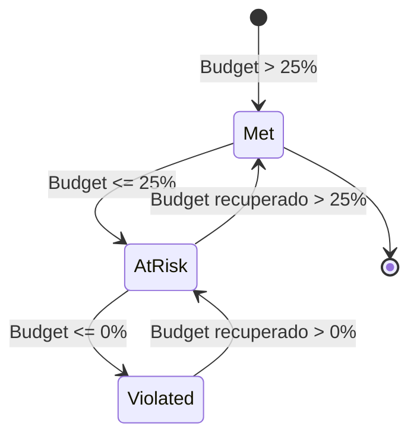

A plataforma AIOps do ChatCLI oferece gestao nativa de **Service Level Objectives (SLOs)** e **Service Level Agreements (SLAs)** via CRDs Kubernetes. O sistema implementa o modelo de burn rate do Google SRE para alertas inteligentes e rastreia compliance de SLAs com suporte a business hours.

---

## SLO vs SLA: Entendendo a Diferenca

| Aspecto | SLO (Service Level Objective) | SLA (Service Level Agreement) |
|---------|-------------------------------|-------------------------------|
| **Definicao** | Meta **interna** de confiabilidade de um servico | **Contrato** formal com clientes/stakeholders |
| **Quem define** | Equipe de engenharia | Negocio + engenharia + juridico |
| **Consequencia de violacao** | Alerta interno, freeze de deploys, revisao | Penalidades contratuais, creditos, multas |
| **Exemplo** | "99.9% availability em 30 dias" | "P1 incidents respondidos em 5 minutos" |
| **CRD** | `ServiceLevelObjective` | `IncidentSLA` |

<Note>
A boa pratica e definir SLOs **mais rigorosos** que os SLAs. Se seu SLA garante 99.9%, defina o SLO em 99.95%. Isso cria uma margem de seguranca (error budget interno) que permite detectar degradacoes antes que o SLA seja violado.
</Note>

---

## ServiceLevelObjective CRD

O `ServiceLevelObjective` define uma meta de confiabilidade para um servico, com alertas baseados em burn rate e tracking de error budget.

```yaml
apiVersion: platform.chatcli.io/v1alpha1
kind: ServiceLevelObjective
metadata:
  name: api-gateway-availability
  namespace: production
spec:
  service: api-gateway
  description: "API Gateway deve manter 99.9% de availability em janela de 30 dias"

  indicator:
    type: availability
    prometheusQuery:
      goodQuery: 'sum(rate(http_requests_total{service="api-gateway",code=~"2..|3.."}[5m]))'
      totalQuery: 'sum(rate(http_requests_total{service="api-gateway"}[5m]))'

  target:
    percentage: 99.9
    window: 30d

  burnRateAlerts:
    - name: page-fast-burn
      shortWindow: 1h
      longWindow: 6h
      burnRateThreshold: 14.4
      severity: critical
      notificationPolicy: production-alerts

    - name: ticket-medium-burn
      shortWindow: 6h
      longWindow: 3d
      burnRateThreshold: 6.0
      severity: high
      notificationPolicy: production-alerts

    - name: ticket-slow-burn
      shortWindow: 24h
      longWindow: 3d
      burnRateThreshold: 3.0
      severity: medium

    - name: monitor-gradual-burn
      shortWindow: 72h
      longWindow: 30d
      burnRateThreshold: 1.0
      severity: low

  alertPolicy:
    multiWindowRequired: true
    pageOnBudgetExhausted: true
    budgetWarningThresholds: [50, 25, 10, 0]

status:
  currentValue: 99.92
  errorBudgetTotal: 0.001
  errorBudgetRemaining: 0.0008
  errorBudgetRemainingPercent: 80.0
  burnRate: 1.2
  lastCalculatedAt: "2026-03-19T14:00:00Z"
  condition: Met
```

### Campos do Spec

#### Raiz

| Campo | Tipo | Obrigatorio | Descricao |
|-------|------|:-----------:|-----------|
| `service` | string | **Sim** | Nome do servico monitorado |
| `description` | string | Nao | Descricao legivel do SLO |
| `indicator` | SLOIndicator | **Sim** | Definicao do indicador de nivel de servico (SLI) |
| `target` | SLOTarget | **Sim** | Meta e janela temporal |
| `burnRateAlerts` | []BurnRateWindow | Nao | Configuracao de alertas multi-window |
| `alertPolicy` | SLOAlertPolicy | Nao | Politica geral de alertas |

#### SLOIndicator

Define **o que** medir. O `type` determina a semantica e as queries Prometheus necessarias.

| Campo | Tipo | Obrigatorio | Descricao |
|-------|------|:-----------:|-----------|
| `type` | string | **Sim** | `availability`, `latency`, `error_rate`, `throughput` |
| `prometheusQuery` | PrometheusQuerySpec | **Sim** | Queries PromQL para calcular o SLI |

**Tipos de indicador:**

| Tipo | Good Events | Total Events | Calculo |
|------|------------|--------------|---------|
| `availability` | Requests com sucesso (2xx, 3xx) | Total de requests | good / total |
| `latency` | Requests abaixo do threshold de latencia | Total de requests | fast / total |
| `error_rate` | N/A (invertido) | Requests com erro | 1 - (errors / total) |
| `throughput` | Requests processados dentro do budget | Requests recebidos | processed / received |

**PrometheusQuerySpec:**

| Campo | Tipo | Obrigatorio | Descricao |
|-------|------|:-----------:|-----------|
| `goodQuery` | string | **Sim** | PromQL que retorna a taxa de eventos "bons" |
| `totalQuery` | string | **Sim** | PromQL que retorna a taxa total de eventos |

<Tabs>
  <Tab title="Availability">
    ```yaml
    indicator:
      type: availability
      prometheusQuery:
        goodQuery: 'sum(rate(http_requests_total{service="api-gateway",code=~"2..|3.."}[5m]))'
        totalQuery: 'sum(rate(http_requests_total{service="api-gateway"}[5m]))'
    ```
  </Tab>
  <Tab title="Latency (P99 menor que 500ms)">
    ```yaml
    indicator:
      type: latency
      prometheusQuery:
        goodQuery: 'sum(rate(http_request_duration_seconds_bucket{service="api-gateway",le="0.5"}[5m]))'
        totalQuery: 'sum(rate(http_request_duration_seconds_count{service="api-gateway"}[5m]))'
    ```
  </Tab>
  <Tab title="Error Rate">
    ```yaml
    indicator:
      type: error_rate
      prometheusQuery:
        goodQuery: 'sum(rate(http_requests_total{service="api-gateway",code!~"5.."}[5m]))'
        totalQuery: 'sum(rate(http_requests_total{service="api-gateway"}[5m]))'
    ```
  </Tab>
  <Tab title="Custom (Throughput)">
    ```yaml
    indicator:
      type: throughput
      prometheusQuery:
        goodQuery: 'sum(rate(queue_messages_processed_total{service="worker"}[5m]))'
        totalQuery: 'sum(rate(queue_messages_received_total{service="worker"}[5m]))'
    ```
  </Tab>
</Tabs>

#### SLOTarget

| Campo | Tipo | Obrigatorio | Descricao |
|-------|------|:-----------:|-----------|
| `percentage` | float64 | **Sim** | Meta em porcentagem (ex: 99.9) |
| `window` | duration | **Sim** | Janela temporal rolling (ex: `30d`, `7d`, `24h`) |

#### BurnRateWindow

Cada entrada define uma janela de alerta baseada em burn rate.

| Campo | Tipo | Obrigatorio | Descricao |
|-------|------|:-----------:|-----------|
| `name` | string | **Sim** | Nome identificador do alerta |
| `shortWindow` | duration | **Sim** | Janela curta de observacao |
| `longWindow` | duration | **Sim** | Janela longa de observacao |
| `burnRateThreshold` | float64 | **Sim** | Threshold de burn rate para disparar alerta |
| `severity` | string | **Sim** | `critical`, `high`, `medium`, `low` |
| `notificationPolicy` | string | Nao | Nome da NotificationPolicy para routing |

#### SLOAlertPolicy

| Campo | Tipo | Padrao | Descricao |
|-------|------|--------|-----------|
| `multiWindowRequired` | bool | `true` | Requer que AMBAS as janelas (short E long) excedam o threshold |
| `pageOnBudgetExhausted` | bool | `true` | Envia page critico quando error budget chega a 0% |
| `budgetWarningThresholds` | []int | `[50, 25, 10, 0]` | Porcentagens de budget restante que disparam warnings |

---

## Como Funciona o Calculo (Google SRE Model)

O sistema implementa o modelo de multi-window, multi-burn-rate alerting descrito no livro **"Site Reliability Engineering"** do Google.

### Error Budget

O error budget e a quantidade maxima de "erro" permitida dentro da janela do SLO.

```text
Error Budget = 1 - (target / 100)

Exemplo para SLO de 99.9%:
  Error Budget = 1 - (99.9 / 100) = 0.001 = 0.1%
```

Em uma janela de 30 dias, isso significa:

```text
Downtime permitido = 30 dias x 24h x 60min x 0.001 = 43.2 minutos
```

| SLO Target | Error Budget | Downtime/30d |
|-----------|-------------|-------------|
| 99% | 1.0% | 7h 12min |
| 99.5% | 0.5% | 3h 36min |
| 99.9% | 0.1% | 43.2 min |
| 99.95% | 0.05% | 21.6 min |
| 99.99% | 0.01% | 4.32 min |

### Burn Rate

O burn rate indica **a velocidade** com que o error budget esta sendo consumido.

```text
Burn Rate = error_rate_in_window / error_budget

Onde:
  error_rate_in_window = 1 - (good_events / total_events) [na janela]
  error_budget = 1 - (target / 100)
```

<Steps>
  <Step title="Calcular error rate na janela">
    Usando as queries Prometheus, calcula-se a proporcao de eventos bons vs total na janela especificada.

    ```text
    Exemplo: Na ultima 1h, houve 10.000 requests, 9.950 com sucesso.
    error_rate = 1 - (9950 / 10000) = 0.005 = 0.5%
    ```
  </Step>
  <Step title="Calcular burn rate">
    Divide o error rate pelo error budget.

    ```text
    burn_rate = 0.005 / 0.001 = 5.0x

    Interpretacao: O budget esta sendo consumido 5x mais rapido que o sustentavel.
    A esse ritmo, o budget de 30 dias se esgotaria em 6 dias.
    ```
  </Step>
  <Step title="Verificar multi-window">
    Para disparar um alerta, AMBAS as janelas (short E long) devem exceder o threshold.

    ```text
    Alerta "page-fast-burn" (threshold 14.4x):
      - Short window (1h): burn_rate = 16.2x  > 14.4  CHECK
      - Long window (6h):  burn_rate = 15.1x  > 14.4  CHECK
      -> ALERTA DISPARADO (ambas excedem)

    Se short=16.2x mas long=12.0x:
      -> NAO dispara (long abaixo do threshold)
      -> Indica spike temporario, nao degradacao sustentada
    ```
  </Step>
  <Step title="Classificar e notificar">
    Com base na severidade configurada, o alerta e roteado para a `NotificationPolicy` correspondente.
  </Step>
</Steps>

### Multi-Window Alerting: Thresholds Padrao

Os thresholds padrao seguem a recomendacao do Google SRE para um SLO de 30 dias:

| Nome | Short Window | Long Window | Burn Rate | Severidade | Significado |
|------|-------------|-------------|-----------|-----------|-------------|
| `page-fast-burn` | 1h | 6h | 14.4x | Critical | Budget se esgota em **~2 dias**. Requer acao imediata. |
| `ticket-medium-burn` | 6h | 3d | 6.0x | High | Budget se esgota em **~5 dias**. Crie ticket urgente. |
| `ticket-slow-burn` | 24h | 3d | 3.0x | Medium | Budget se esgota em **~10 dias**. Investigue e planeje. |
| `monitor-gradual-burn` | 72h | 30d | 1.0x | Low | Budget **exatamente no ritmo sustentavel**. Monitore. |

<Tip>
A formula para calcular o threshold: `burn_rate_threshold = (window_days / budget_consumption_days)`. Para um SLO de 30 dias onde voce quer alertar quando o budget se esgotaria em 2 dias: `30 / 2.08 = 14.4x`.
</Tip>

### Exemplo Numerico Completo

Considere um SLO de **99.9% availability** em **30 dias** para o servico `api-gateway`:

```text
Configuracao:
  Target: 99.9%
  Window: 30 dias
  Error Budget: 0.1% = 43.2 minutos de downtime

Situacao atual (medido pelo Prometheus):
  Ultimas 24h: 99.85% availability (0.15% error rate)
  Ultimas 6h:  99.80% availability (0.20% error rate)
  Ultima 1h:   99.70% availability (0.30% error rate)

Calculo de burn rate por janela:
  1h:  0.003 / 0.001 = 3.0x
  6h:  0.002 / 0.001 = 2.0x
  24h: 0.0015 / 0.001 = 1.5x

Avaliacao de alertas:
  page-fast-burn (14.4x):  1h=3.0x < 14.4  -> NAO dispara
  ticket-medium-burn (6x): 6h=2.0x < 6.0   -> NAO dispara
  ticket-slow-burn (3x):   24h=1.5x < 3.0  -> NAO dispara
  monitor-gradual-burn (1x): ambas > 1.0    -> DISPARA (severity: low)

Resultado: Degradacao lenta detectada. Nao e critico, mas o budget esta
sendo consumido 1.5x mais rapido que o sustentavel. A esse ritmo, o
budget de 43.2 minutos se esgotaria em 20 dias (ao inves de 30).

Error budget restante:
  Consumido ate agora: ~22 minutos (estimado)
  Restante: 43.2 - 22 = 21.2 minutos
  Porcentagem restante: 49.1%
  -> Warning threshold de 50% quase atingido
```

---

## Error Budget Tracking

O status do `ServiceLevelObjective` e atualizado periodicamente pelo reconciler:

| Campo | Tipo | Descricao |
|-------|------|-----------|
| `currentValue` | float64 | Valor atual do SLI (ex: 99.92%) |
| `errorBudgetTotal` | float64 | Budget total (ex: 0.001 para 99.9%) |
| `errorBudgetRemaining` | float64 | Budget restante |
| `errorBudgetRemainingPercent` | float64 | Porcentagem restante do budget |
| `burnRate` | float64 | Burn rate atual (janela mais curta) |
| `lastCalculatedAt` | Time | Ultimo calculo |
| `condition` | string | `Met` (dentro do SLO), `AtRisk` (budget &lt; 25%), `Violated` (budget esgotado) |

**Condicoes do SLO:**



**Budget Warning Thresholds:**

Quando configurados, o sistema envia notificacoes ao atingir cada threshold:

| Budget Restante | Acao |
|----------------|------|
| 50% | Notificacao informativa |
| 25% | Warning: congelar deploys nao-essenciais |
| 10% | Alerta: foco total em estabilidade |
| 0% | Page critico (se `pageOnBudgetExhausted: true`) |

---

## IncidentSLA CRD

O `IncidentSLA` define contratos de tempo de resposta e resolucao por severidade, com suporte a business hours e tracking de violacoes.

```yaml
apiVersion: platform.chatcli.io/v1alpha1
kind: IncidentSLA
metadata:
  name: production-sla
  namespace: production
spec:
  service: api-gateway
  description: "SLA de producao para o API Gateway"

  responseTimes:
    - severity: critical
      maxResponseTime: "5m"
      maxResolutionTime: "1h"
    - severity: high
      maxResponseTime: "15m"
      maxResolutionTime: "4h"
    - severity: medium
      maxResponseTime: "1h"
      maxResolutionTime: "24h"
    - severity: low
      maxResponseTime: "4h"
      maxResolutionTime: "72h"

  businessHours:
    enabled: true
    timezone: "America/Sao_Paulo"
    startHour: 9
    endHour: 18
    workDays: [1, 2, 3, 4, 5]   # Segunda a Sexta (0=Dom, 6=Sab)
    holidays:
      - date: "2026-01-01"
        name: "Ano Novo"
      - date: "2026-04-03"
        name: "Sexta-feira Santa"
      - date: "2026-12-25"
        name: "Natal"

  violationPolicy:
    notificationPolicy: sla-breach-notifications
    escalationPolicy: p0-escalation
    autoEscalateOnBreach: true

status:
  activeIncidents: 2
  totalViolations: 3
  compliancePercentage: 97.5
  violations:
    - issueName: "api-gateway-oom-kill-1771276354"
      severity: critical
      type: resolution_time
      exceededBy: "12m"
      occurredAt: "2026-03-15T14:30:00Z"
  lastCalculatedAt: "2026-03-19T14:00:00Z"
```

### Campos do Spec

#### Raiz

| Campo | Tipo | Obrigatorio | Descricao |
|-------|------|:-----------:|-----------|
| `service` | string | **Sim** | Nome do servico coberto pelo SLA |
| `description` | string | Nao | Descricao do SLA |
| `responseTimes` | []ResponseTimeConfig | **Sim** | Tempos maximos por severidade |
| `businessHours` | BusinessHoursSpec | Nao | Configuracao de horario comercial |
| `violationPolicy` | ViolationPolicySpec | Nao | Acoes em caso de violacao |

#### ResponseTimeConfig

| Campo | Tipo | Obrigatorio | Descricao |
|-------|------|:-----------:|-----------|
| `severity` | string | **Sim** | `critical`, `high`, `medium`, `low` |
| `maxResponseTime` | duration | **Sim** | Tempo maximo para primeiro acknowledgement |
| `maxResolutionTime` | duration | **Sim** | Tempo maximo para resolucao completa |

<Info>
**Response time** e medido como o tempo entre a criacao do Issue (estado `Detected`) e a primeira transicao para `Analyzing` ou `Remediating`. **Resolution time** e medido entre `Detected` e `Resolved`.
</Info>

#### BusinessHoursSpec

| Campo | Tipo | Obrigatorio | Descricao |
|-------|------|:-----------:|-----------|
| `enabled` | bool | **Sim** | Ativa contagem apenas em horario comercial |
| `timezone` | string | **Sim** | Timezone IANA (ex: `America/Sao_Paulo`) |
| `startHour` | int | **Sim** | Hora de inicio (0-23) |
| `endHour` | int | **Sim** | Hora de fim (0-23) |
| `workDays` | []int | **Sim** | Dias uteis (0=Domingo, 6=Sabado) |
| `holidays` | []Holiday | Nao | Feriados (clock parado nesses dias) |

#### Como o Clock de Business Hours Funciona

O SLA clock conta apenas durante horario comercial. Fora do horario, o clock e pausado automaticamente.

<Steps>
  <Step title="Incidente detectado">
    Issue criado as 17:45 (sexta-feira). Clock inicia.

    ```text
    Horario comercial: 09:00-18:00 (Seg-Sex), timezone America/Sao_Paulo
    ```
  </Step>
  <Step title="Clock conta 15 minutos (sexta)">
    De 17:45 ate 18:00 = **15 minutos** de SLA clock.
    Clock **pausa** as 18:00 (fim do horario comercial).
  </Step>
  <Step title="Fim de semana: clock pausado">
    Sabado e domingo inteiros: clock permanece pausado.
    Tempo SLA acumulado: **15 minutos**.
  </Step>
  <Step title="Segunda-feira: clock retoma">
    Clock **retoma** as 09:00 de segunda-feira.
    Se o incidente e resolvido as 10:30 de segunda:
    - Sexta: 15 minutos
    - Segunda: 1h30 = 90 minutos
    - **Total SLA: 105 minutos (1h45)**
  </Step>
  <Step title="Avaliacao de compliance">
    Para severidade `critical` com `maxResolutionTime: 1h`:
    - Tempo SLA gasto: 1h45 = 105 minutos
    - Limite: 60 minutos
    - **VIOLACAO**: excedeu por 45 minutos

    Para severidade `high` com `maxResolutionTime: 4h`:
    - Tempo SLA gasto: 105 minutos
    - Limite: 240 minutos
    - **DENTRO DO SLA**
  </Step>
</Steps>

<Warning>
Para incidentes `critical`, considere desabilitar business hours (`enabled: false`) e usar clock 24/7. Problemas criticos em producao nao devem aguardar o proximo dia util.
</Warning>

#### ViolationPolicySpec

| Campo | Tipo | Descricao |
|-------|------|-----------|
| `notificationPolicy` | string | NotificationPolicy para enviar alertas de violacao |
| `escalationPolicy` | string | EscalationPolicy para escalar violacoes |
| `autoEscalateOnBreach` | bool | Escalar automaticamente quando SLA e violado |

#### CompliancePercentage Calculation

```text
CompliancePercentage = ((total_incidents - violations) / total_incidents) * 100

Exemplo:
  Total de incidentes no periodo: 120
  Violacoes: 3
  Compliance = ((120 - 3) / 120) * 100 = 97.5%
```

O compliance e calculado **por severity** e **agregado**:

| Severidade | Incidentes | Violacoes | Compliance |
|-----------|-----------|-----------|------------|
| Critical | 5 | 1 | 80.0% |
| High | 15 | 2 | 86.7% |
| Medium | 40 | 0 | 100.0% |
| Low | 60 | 0 | 100.0% |
| **Total** | **120** | **3** | **97.5%** |

---

## Exemplos YAML Completos

### SLO de 99.9% Availability com Burn Rate Alerting

```yaml
apiVersion: platform.chatcli.io/v1alpha1
kind: ServiceLevelObjective
metadata:
  name: api-gateway-availability-slo
  namespace: production
spec:
  service: api-gateway
  description: "99.9% availability do API Gateway medido por taxa de sucesso HTTP"

  indicator:
    type: availability
    prometheusQuery:
      goodQuery: |
        sum(rate(http_requests_total{
          service="api-gateway",
          code=~"2..|3.."
        }[5m]))
      totalQuery: |
        sum(rate(http_requests_total{
          service="api-gateway"
        }[5m]))

  target:
    percentage: 99.9
    window: 30d

  burnRateAlerts:
    - name: page-immediate
      shortWindow: 1h
      longWindow: 6h
      burnRateThreshold: 14.4
      severity: critical
      notificationPolicy: production-alerts

    - name: ticket-urgent
      shortWindow: 6h
      longWindow: 3d
      burnRateThreshold: 6.0
      severity: high
      notificationPolicy: production-alerts

    - name: ticket-normal
      shortWindow: 24h
      longWindow: 3d
      burnRateThreshold: 3.0
      severity: medium

    - name: monitor
      shortWindow: 72h
      longWindow: 30d
      burnRateThreshold: 1.0
      severity: low

  alertPolicy:
    multiWindowRequired: true
    pageOnBudgetExhausted: true
    budgetWarningThresholds: [50, 25, 10, 0]
```

### SLA P1=5min Response / 1h Resolution (Business Hours)

```yaml
apiVersion: platform.chatcli.io/v1alpha1
kind: IncidentSLA
metadata:
  name: api-gateway-production-sla
  namespace: production
spec:
  service: api-gateway
  description: "SLA de producao conforme contrato com clientes enterprise"

  responseTimes:
    - severity: critical
      maxResponseTime: "5m"
      maxResolutionTime: "1h"
    - severity: high
      maxResponseTime: "15m"
      maxResolutionTime: "4h"
    - severity: medium
      maxResponseTime: "2h"
      maxResolutionTime: "24h"
    - severity: low
      maxResponseTime: "8h"
      maxResolutionTime: "72h"

  businessHours:
    enabled: true
    timezone: "America/Sao_Paulo"
    startHour: 9
    endHour: 18
    workDays: [1, 2, 3, 4, 5]
    holidays:
      - date: "2026-01-01"
        name: "Confraternizacao Universal"
      - date: "2026-02-16"
        name: "Carnaval"
      - date: "2026-02-17"
        name: "Carnaval"
      - date: "2026-04-03"
        name: "Sexta-feira Santa"
      - date: "2026-04-21"
        name: "Tiradentes"
      - date: "2026-05-01"
        name: "Dia do Trabalho"
      - date: "2026-09-07"
        name: "Independencia"
      - date: "2026-10-12"
        name: "Nossa Senhora Aparecida"
      - date: "2026-11-02"
        name: "Finados"
      - date: "2026-11-15"
        name: "Proclamacao da Republica"
      - date: "2026-12-25"
        name: "Natal"

  violationPolicy:
    notificationPolicy: sla-breach-notifications
    escalationPolicy: p0-escalation
    autoEscalateOnBreach: true
```

<Note>
Para severidade `critical`, mesmo com business hours habilitado, considere criar uma regra separada com `businessHours.enabled: false`. Problemas P1 geralmente exigem resposta 24/7.
</Note>

### SLO com PrometheusQuery Custom (Latency P99)

```yaml
apiVersion: platform.chatcli.io/v1alpha1
kind: ServiceLevelObjective
metadata:
  name: payment-service-latency-slo
  namespace: payments
spec:
  service: payment-service
  description: "99.5% dos requests do Payment Service devem completar em menos de 500ms"

  indicator:
    type: latency
    prometheusQuery:
      goodQuery: |
        sum(rate(http_request_duration_seconds_bucket{
          service="payment-service",
          le="0.5"
        }[5m]))
      totalQuery: |
        sum(rate(http_request_duration_seconds_count{
          service="payment-service"
        }[5m]))

  target:
    percentage: 99.5
    window: 7d

  burnRateAlerts:
    - name: page-latency-spike
      shortWindow: 30m
      longWindow: 3h
      burnRateThreshold: 14.4
      severity: critical
      notificationPolicy: payments-alerts

    - name: ticket-latency-degradation
      shortWindow: 3h
      longWindow: 1d
      burnRateThreshold: 6.0
      severity: high

    - name: monitor-latency-trend
      shortWindow: 12h
      longWindow: 7d
      burnRateThreshold: 1.0
      severity: low

  alertPolicy:
    multiWindowRequired: true
    pageOnBudgetExhausted: true
    budgetWarningThresholds: [25, 10, 0]
```

---

## Grafana Dashboards

A plataforma AIOps disponibiliza 4 dashboards Grafana pre-configurados para visualizacao de SLOs e SLAs:

<CardGroup cols={2}>
  <Card title="SLO Overview" icon="chart-line">
    Painel unificado com todos os SLOs, valores atuais, error budget restante e burn rate. Inclui heatmap de burn rate por servico.
  </Card>
  <Card title="Error Budget Burn-Down" icon="chart-area">
    Grafico burn-down do error budget ao longo do tempo. Mostra tendencia e projecao de esgotamento. Linhas de referencia para cada threshold de warning.
  </Card>
  <Card title="SLA Compliance Report" icon="file-chart-line">
    Relatorio de compliance por severidade e periodo. Tabela com cada incidente, tempos de resposta/resolucao e status de compliance. Exportavel para PDF.
  </Card>
  <Card title="Incident Timeline" icon="timeline-arrow">
    Timeline de incidentes com deteccao, analise, remediacao e resolucao. Correlacao visual com SLO burn rate e SLA clock.
  </Card>
</CardGroup>

**Importando os dashboards:**

```bash
# Os dashboards estao disponiveis como ConfigMaps
kubectl apply -f operator/config/grafana/dashboards/

# Ou importe via API do Grafana
for f in operator/config/grafana/dashboards/*.json; do
  curl -X POST -H "Content-Type: application/json" \
    -H "Authorization: Bearer $GRAFANA_API_KEY" \
    -d @"$f" \
    "https://grafana.company.com/api/dashboards/db"
done
```

---

## Prometheus Metrics

O sistema de SLOs e SLAs expoe metricas detalhadas:

### Metricas de SLO

| Metrica | Tipo | Labels | Descricao |
|---------|------|--------|-----------|
| `chatcli_slo_current_value` | Gauge | `slo`, `service`, `namespace`, `indicator_type` | Valor atual do SLI (ex: 99.92) |
| `chatcli_slo_target_value` | Gauge | `slo`, `service` | Meta configurada (ex: 99.9) |
| `chatcli_slo_error_budget_total` | Gauge | `slo`, `service` | Error budget total (ex: 0.001) |
| `chatcli_slo_error_budget_remaining` | Gauge | `slo`, `service`, `namespace` | Error budget restante |
| `chatcli_slo_error_budget_remaining_percent` | Gauge | `slo`, `service` | Porcentagem restante do budget |
| `chatcli_slo_burn_rate` | Gauge | `slo`, `service`, `window` | Burn rate por janela |
| `chatcli_slo_alerts_fired_total` | Counter | `slo`, `service`, `severity`, `alert_name` | Total de alertas de burn rate disparados |
| `chatcli_slo_condition` | Gauge | `slo`, `service`, `condition` | Estado atual (1=ativo): `Met`, `AtRisk`, `Violated` |

### Metricas de SLA

| Metrica | Tipo | Labels | Descricao |
|---------|------|--------|-----------|
| `chatcli_sla_violations_total` | Counter | `sla`, `service`, `severity`, `violation_type` | Total de violacoes de SLA |
| `chatcli_sla_compliance_percentage` | Gauge | `sla`, `service`, `severity` | Porcentagem de compliance atual |
| `chatcli_sla_response_time_seconds` | Histogram | `sla`, `service`, `severity` | Distribuicao de tempos de resposta |
| `chatcli_sla_resolution_time_seconds` | Histogram | `sla`, `service`, `severity` | Distribuicao de tempos de resolucao |
| `chatcli_sla_active_incidents` | Gauge | `sla`, `service` | Incidentes ativos no momento |
| `chatcli_sla_business_hours_active` | Gauge | `sla`, `service` | 1 se dentro do horario comercial, 0 se fora |

**Alertas Prometheus recomendados:**

```yaml
groups:
  - name: chatcli-slo-sla
    rules:
      - alert: SLOBudgetExhausted
        expr: chatcli_slo_error_budget_remaining_percent <= 0
        for: 1m
        labels:
          severity: critical
        annotations:
          summary: "Error budget esgotado para SLO {{ $labels.slo }}"
          description: "O servico {{ $labels.service }} esgotou o error budget. Nenhum downtime adicional e permitido."

      - alert: SLOBudgetLow
        expr: chatcli_slo_error_budget_remaining_percent <= 10 and chatcli_slo_error_budget_remaining_percent > 0
        for: 5m
        labels:
          severity: warning
        annotations:
          summary: "Error budget baixo ({{ $value }}%) para SLO {{ $labels.slo }}"

      - alert: SLAComplianceBelow95
        expr: chatcli_sla_compliance_percentage < 95
        for: 1m
        labels:
          severity: critical
        annotations:
          summary: "SLA compliance abaixo de 95% para {{ $labels.service }}"
          description: "Compliance atual: {{ $value }}%. Revise incidentes recentes e tome acoes corretivas."

      - alert: SLAResponseTimeExceeded
        expr: histogram_quantile(0.95, rate(chatcli_sla_response_time_seconds_bucket[1h])) > 300
        for: 5m
        labels:
          severity: warning
        annotations:
          summary: "P95 do tempo de resposta SLA excede 5 minutos"
```

---

## Proximo Passo

<CardGroup cols={2}>
  <Card title="Notificacoes e Escalacao" icon="bell" href="/features/aiops/notifications">
    Sistema de notificacoes multi-canal e escalacao automatica
  </Card>
  <Card title="Workflow de Aprovacao" icon="shield-check" href="/features/aiops/approval-workflow">
    Controle de mudancas com approval policies e blast radius
  </Card>
  <Card title="AIOps Platform" icon="brain" href="/features/aiops-platform">
    Deep-dive na arquitetura AIOps
  </Card>
  <Card title="K8s Operator" icon="dharmachakra" href="/features/k8s-operator">
    Configuracao e CRDs do operator
  </Card>
</CardGroup>
