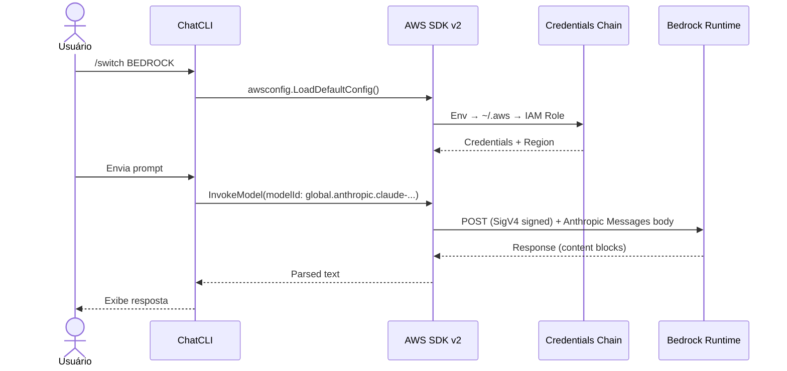

O ChatCLI suporta o **AWS Bedrock** como provedor nativo (`BEDROCK`), com schema de request/response **auto-detectado por família de modelo**:

- **Anthropic Claude** — `anthropic.*` e inference profiles (`global./us./eu./apac.anthropic.*`)
- **OpenAI GPT-OSS** — `openai.gpt-oss-*` (open-weights da OpenAI no Bedrock)

Ideal para ambientes corporativos que já têm billing, compliance e controle de acesso via AWS — sem precisar de API keys das provedoras originais.

---

## Por que AWS Bedrock?

<CardGroup cols={2}>
  <Card title="Sem API key Anthropic" icon="key">
    Usa credenciais AWS existentes (IAM role, `~/.aws/credentials`, `AWS_PROFILE`).
  </Card>
  <Card title="Billing e compliance AWS" icon="receipt">
    Custos aparecem na sua conta AWS. Logs via CloudTrail, guardrails nativos do Bedrock.
  </Card>
  <Card title="Claude + GPT-OSS" icon="layer-group">
    Claude 3/3.5/3.7/4/4.5/4.6 (via inference profiles) e GPT-OSS 20B/120B da OpenAI.
  </Card>
  <Card title="VPC endpoints" icon="network-wired">
    Funciona em ambientes privados com `AWS_ENDPOINT_URL_BEDROCK_RUNTIME`.
  </Card>
</CardGroup>

---

## Configuração

O provedor é detectado automaticamente quando o ChatCLI encontra **credenciais AWS válidas** (não apenas a existência de arquivos):

- **Credenciais estáticas em env:** `AWS_ACCESS_KEY_ID`
- **Profile selecionado:** `AWS_PROFILE` (via env var ou `.env` file)
- **Arquivo `~/.aws/credentials`** com ao menos um `aws_access_key_id` preenchido
- **AWS SSO:** perfil SSO em `~/.aws/config` (detecta `sso_session`, `sso_start_url`, `sso_account_id`)
- **Assume-role / credential_process:** perfis com `role_arn` ou `credential_process` em `~/.aws/config`
- **Token cache SSO:** presença de arquivos em `~/.aws/sso/cache/` (indicando `aws sso login` anterior)
- **Web Identity Token** (EKS IRSA): `AWS_WEB_IDENTITY_TOKEN_FILE`
- **Container Credentials** (ECS): `AWS_CONTAINER_CREDENTIALS_RELATIVE_URI` / `_FULL_URI`

<Warning>
A mera existência de `~/.aws/config` com apenas `region` ou `output` **não ativa** o Bedrock. É necessário que o arquivo contenha configuração de credenciais (SSO, assume-role, credential_process) ou que credenciais estáticas existam em outra fonte.
</Warning>

### Opção 1: `~/.aws/credentials` (credenciais estáticas)

Se você já usa AWS CLI, basta ter um profile configurado:

```bash
# ~/.aws/credentials
[default]
aws_access_key_id = AKIA...
aws_secret_access_key = ...

[corp-prod]
aws_access_key_id = AKIA...
aws_secret_access_key = ...
```

```bash
export AWS_PROFILE=corp-prod
export BEDROCK_REGION=us-east-1   # opcional, default us-east-1
chatcli
```

Dentro do ChatCLI:

```bash
/switch BEDROCK
```

<Tip>
Você também pode definir `AWS_PROFILE` no seu arquivo `.env` em vez de exportar no shell:
```env
AWS_PROFILE=corp-prod
BEDROCK_REGION=us-east-1
LLM_PROVIDER=BEDROCK
```
O ChatCLI lê o `.env` via godotenv e resolve o profile corretamente.
</Tip>

### Opção 2: AWS SSO (IAM Identity Center)

Se sua empresa usa AWS SSO, configure o profile no `~/.aws/config`:

```ini
[profile meu-sso]
sso_session = minha-sessao
sso_account_id = 123456789012
sso_role_name = MeuRole
region = us-east-1

[sso-session minha-sessao]
sso_start_url = https://minha-empresa.awsapps.com/start
sso_region = us-east-1
```

```bash
# Faça login (abre o browser)
aws sso login --profile meu-sso

# Use com ChatCLI (qualquer forma):
export AWS_PROFILE=meu-sso && chatcli
AWS_PROFILE=meu-sso chatcli

# Ou no .env:
echo 'AWS_PROFILE=meu-sso' >> .env
chatcli
```

<Info>
O ChatCLI detecta automaticamente profiles SSO em `~/.aws/config` (pelas chaves `sso_session`, `sso_start_url`, `sso_account_id`). Se o token SSO expirar, o erro será claro (`SSOTokenProviderError`) — basta executar `aws sso login` novamente.

**Importante:** o AWS SDK **não** sabe qual profile está "logado". Você **precisa** indicar o profile via `AWS_PROFILE` (env, `.env`, ou flag). Se seu profile SSO se chama `default`, ele é usado automaticamente sem `AWS_PROFILE`.
</Info>

### Opção 3: Environment variables (credenciais estáticas)

```bash
export AWS_ACCESS_KEY_ID=AKIA...
export AWS_SECRET_ACCESS_KEY=...
export AWS_SESSION_TOKEN=...      # se usar STS
export AWS_REGION=us-east-1
```

### Opção 4: IAM Role (EC2/ECS/EKS)

Em ambientes AWS nativos, não precisa configurar nada — o SDK pega a role automaticamente pelo IMDSv2 / webidentity. Só precisa garantir que a role tem as permissões IAM abaixo.

<Info>
O ChatCLI desabilita o probe IMDS (169.254.169.254) por padrão em máquinas que **não** são EC2/ECS/EKS, para evitar timeouts desnecessários. O IMDS é habilitado automaticamente quando env vars de container/EKS são detectadas (`AWS_CONTAINER_CREDENTIALS_*`, `AWS_WEB_IDENTITY_TOKEN_FILE`, `ECS_CONTAINER_METADATA_URI*`).

Para forçar o comportamento, use:
- `AWS_EC2_METADATA_DISABLED=true` — desabilita IMDS explicitamente
- `CHATCLI_BEDROCK_ENABLE_IMDS=1` — força habilitar IMDS (útil em EC2 sem as env vars padrão)
</Info>

---

## Permissões IAM

Permissões mínimas para invocar e listar modelos:

```json
{
  "Version": "2012-10-17",
  "Statement": [
    {
      "Effect": "Allow",
      "Action": [
        "bedrock:InvokeModel",
        "bedrock:InvokeModelWithResponseStream"
      ],
      "Resource": [
        "arn:aws:bedrock:*::foundation-model/anthropic.*",
        "arn:aws:bedrock:*:*:inference-profile/*anthropic.*"
      ]
    },
    {
      "Effect": "Allow",
      "Action": [
        "bedrock:ListFoundationModels",
        "bedrock:ListInferenceProfiles"
      ],
      "Resource": "*"
    }
  ]
}
```

<Tip>
As ações `ListFoundationModels` e `ListInferenceProfiles` são usadas pelo `/switch --model` para descobrir dinamicamente o que sua conta pode invocar. Sem elas, o ChatCLI cai para o catálogo estático (ainda funcional, mas desatualizável).
</Tip>

Adicionalmente, no **console Bedrock** você precisa **habilitar o model access** pra cada modelo Anthropic que pretende usar (uma vez por conta + região): `Bedrock Console → Model access → Request access`.

---

## Famílias de modelos e seleção de schema

O Bedrock usa **payloads diferentes** para cada família de modelo. O ChatCLI detecta automaticamente qual schema usar pelo prefixo do model id:

| Prefixo do model id | Família | Schema |
| :--- | :--- | :--- |
| `anthropic.*`, `global.anthropic.*`, `us.anthropic.*`, `eu.anthropic.*`, `apac.anthropic.*` | Anthropic Claude | Anthropic Messages (`anthropic_version`, `messages`, `system`) |
| `openai.*`, `us.openai.*`, ... | OpenAI GPT-OSS | OpenAI Chat Completions (`messages`, `max_completion_tokens`) |
| Outros | Não suportado nesta versão | — |

### Override manual

Se o model id não começar com um prefixo conhecido (ex.: custom imports), force o schema via env var:

```bash
export BEDROCK_PROVIDER=anthropic   # ou "openai" / "claude" / "gpt"
```

Valores aceitos: `anthropic`, `claude`, `openai`, `gpt` (case-insensitive). A env var tem precedência sobre a detecção por prefixo.

<Info>
O ChatCLI só lista e invoca modelos das famílias suportadas (`anthropic` e `openai`). Modelos Meta Llama, Amazon Nova, Mistral e Cohere que apareçam no `ListFoundationModels` são filtrados automaticamente — suporte a eles pode ser adicionado no futuro.
</Info>

---

## Inference Profiles vs. Model IDs

Esse é **o detalhe mais importante** do Bedrock com Claude.

Modelos Anthropic **modernos (3.7, 4.x, 4.5, 4.6) NÃO aceitam invocação on-demand direto pelo ID base**. Se você tentar, recebe:

```
on-demand throughput isn't supported. Request with the id or arn of an
inference profile that contains this model.
```

A solução é usar um **inference profile ID**, que é um ARN lógico que roteia a chamada pra região com capacidade disponível. Ele vem com um prefixo de geografia:

| Prefixo | Significado |
| :--- | :--- |
| `global.*` | Global — tier mais novo, disponibilidade mundial (recomendado) |
| `us.*` | Cross-region EUA (`us-east-1`, `us-east-2`, `us-west-2`) |
| `eu.*` | Cross-region Europa |
| `apac.*` | Cross-region Ásia-Pacífico |

**Exemplo:**

```text
anthropic.claude-sonnet-4-5-20250929-v1:0           ❌ erro on-demand
global.anthropic.claude-sonnet-4-5-20250929-v1:0    ✅ funciona
us.anthropic.claude-sonnet-4-5-20250929-v1:0        ✅ funciona
```

<Info>
O ChatCLI já usa um inference profile global como **modelo padrão** (`global.anthropic.claude-sonnet-4-5-20250929-v1:0`). Os modelos Claude 3 e 3.5 ainda aceitam invocação direta pelo ID base e também estão no catálogo.
</Info>

---

## Listagem de Modelos

O `/switch --model` consulta **duas fontes** ao vivo e as mescla com o catálogo estático:

1. **`bedrock:ListFoundationModels`** — modelos base (on-demand capable)
2. **`bedrock:ListInferenceProfiles`** — profiles regionais/global (paginado)

```bash
/switch BEDROCK
/switch --model
```

Exemplo de saída (depende das permissões da sua conta):

```
Available models for BEDROCK (API: 18 + catalog: 14):
  1. global.anthropic.claude-sonnet-4-6-20260115-v1:0 ... [api]
  2. global.anthropic.claude-opus-4-6-20260115-v1:0 ... [api]
  3. global.anthropic.claude-sonnet-4-5-20250929-v1:0 ... [api]
  4. us.anthropic.claude-sonnet-4-20250514-v1:0 ... [api]
  5. eu.anthropic.claude-sonnet-4-20250514-v1:0 ... [api]
  6. anthropic.claude-3-5-sonnet-20241022-v2:0 ... [api]
  ...
```

Modelos com `[api]` são os que sua conta **realmente** pode invocar naquela região. Os `[catalog]` são registros estáticos que podem ou não estar habilitados.

---

## Proxy Corporativo e TLS Privado

Em ambientes corporativos com proxy interceptando TLS com uma CA privada, você pode ver:

```
tls: failed to verify certificate: x509: certificate signed by unknown authority
```

O ChatCLI oferece duas env vars específicas pro Bedrock:

| Variável | Descrição |
| :--- | :--- |
| `CHATCLI_BEDROCK_CA_BUNDLE` | Caminho para um bundle PEM com a CA corporativa. Mescla no pool do sistema e usa como `RootCAs`. Tem precedência sobre `AWS_CA_BUNDLE`. |
| `CHATCLI_BEDROCK_INSECURE_SKIP_VERIFY` | `true` desabilita verificação TLS por completo (equivalente ao `NODE_TLS_REJECT_UNAUTHORIZED=0` do Node). **Inseguro** — use só pra confirmar que é problema de TLS. |

```bash
# Recomendado: usar bundle com a CA corporativa
export CHATCLI_BEDROCK_CA_BUNDLE=/etc/ssl/corp-ca-bundle.pem

# Último recurso (inseguro)
export CHATCLI_BEDROCK_INSECURE_SKIP_VERIFY=true
```

<Warning>
`CHATCLI_BEDROCK_INSECURE_SKIP_VERIFY=true` emite warning no log e aceita qualquer certificado. Use apenas em troubleshooting — nunca em produção.
</Warning>

Proxy HTTP(S) é respeitado automaticamente via env vars padrão do Go:

```bash
export HTTPS_PROXY=http://proxy.corp:3128
export HTTP_PROXY=http://proxy.corp:3128
export NO_PROXY=localhost,127.0.0.1,.corp.internal
```

### VPC Endpoints / endpoints privados

Se a empresa usa VPC endpoint para Bedrock:

```bash
export AWS_ENDPOINT_URL_BEDROCK_RUNTIME=https://bedrock-runtime.vpc.internal
export AWS_ENDPOINT_URL_BEDROCK=https://bedrock.vpc.internal
```

O SDK v2 lê essas vars nativamente — não é necessário mudar nada no ChatCLI.

---

## Variáveis de Ambiente

| Variável | Descrição | Padrão |
| :--- | :--- | :--- |
| `BEDROCK_PROVIDER` | Override manual do schema: `anthropic` (default) ou `openai` | auto-detect |
| `BEDROCK_TEMPERATURE` | Temperature usada nos modelos OpenAI | — |
| `BEDROCK_REGION` | Região AWS (prioridade sobre `AWS_REGION`) | — |
| `AWS_REGION` | Região AWS (fallback) | — |
| `AWS_PROFILE` | Profile em `~/.aws/credentials` ou `~/.aws/config` (SSO, assume-role). Pode ser definido no `.env`. | — |
| `AWS_ACCESS_KEY_ID` / `AWS_SECRET_ACCESS_KEY` / `AWS_SESSION_TOKEN` | Credenciais estáticas | — |
| `AWS_CA_BUNDLE` | Bundle PEM lido nativamente pelo SDK v2 | — |
| `AWS_ENDPOINT_URL_BEDROCK_RUNTIME` | Override de endpoint do Bedrock Runtime | — |
| `AWS_ENDPOINT_URL_BEDROCK` | Override de endpoint do Bedrock (control plane) | — |
| `AWS_EC2_METADATA_DISABLED` | `true` desabilita IMDS (169.254.169.254) explicitamente | — |
| `CHATCLI_BEDROCK_ENABLE_IMDS` | `1`/`true` força habilitar o probe IMDS em máquinas não-EC2 | `false` |
| `BEDROCK_MAX_TOKENS` | Limite de tokens de saída | Do catálogo |
| `ANTHROPIC_MAX_TOKENS` | Alternativa compartilhada com o provedor Anthropic direto | — |
| `CHATCLI_BEDROCK_CA_BUNDLE` | Bundle PEM específico do Bedrock (precede `AWS_CA_BUNDLE`) | — |
| `CHATCLI_BEDROCK_INSECURE_SKIP_VERIFY` | `true` desabilita verificação TLS (inseguro) | `false` |
| `HTTPS_PROXY` / `HTTP_PROXY` / `NO_PROXY` | Proxy HTTP padrão Go/SDK | — |

**Default model:** `global.anthropic.claude-sonnet-4-5-20250929-v1:0`
**Default region:** `us-east-1`

---

## Arquitetura



O ChatCLI usa `bedrockruntime.InvokeModel` com body no schema **Anthropic Messages** (`anthropic_version: "bedrock-2023-05-31"`). A autenticação é SigV4, feita transparentemente pelo SDK. O HTTP client pode ser sobrescrito pelo ChatCLI quando `CHATCLI_BEDROCK_CA_BUNDLE` ou `CHATCLI_BEDROCK_INSECURE_SKIP_VERIFY` estão definidos (via `awshttp.BuildableClient`).

---

## Diferença entre Bedrock e Anthropic Direto

| Aspecto | BEDROCK | CLAUDEAI (Anthropic direto) |
| :--- | :--- | :--- |
| **Auth** | AWS credentials chain (IAM, profile) | API key (`sk-ant-...`) ou OAuth |
| **Endpoint** | `bedrock-runtime.<region>.amazonaws.com` | `api.anthropic.com` |
| **Billing** | Conta AWS (console Billing + CloudTrail) | Conta Anthropic (console.anthropic.com) |
| **Modelos** | Claude 3, 3.5, 3.7, 4, 4.1, 4.5, 4.6 (via profiles) | Todos Claude, com as versões mais recentes primeiro |
| **Streaming** | Não implementado nesta versão (usa `InvokeModel`) | Suportado |
| **OAuth/1M context** | N/A | Suportado (`ANTHROPIC_1MTOKENS_SONNET`) |
| **VPC privado** | Sim (via `AWS_ENDPOINT_URL_*`) | Não |
| **Compliance** | Inherits from AWS (SOC2, HIPAA, etc.) | Inherits from Anthropic |

<Tip>
Se sua empresa já roda tudo em AWS com compliance gerenciado, **BEDROCK é o melhor caminho**. Se você é individual developer querendo as features mais novas do Claude (1M context, OAuth via Claude Code plan), use **CLAUDEAI** direto.
</Tip>

---

## Troubleshooting

<AccordionGroup>
  <Accordion title="on-demand throughput isn't supported">
    Você está invocando um modelo moderno (3.7+, 4.x+, 4.5+, 4.6) pelo ID base. Use o inference profile: adicione prefixo `global.`, `us.`, `eu.` ou `apac.`.

    ```bash
    # ❌
    /switch --model anthropic.claude-sonnet-4-5-20250929-v1:0
    # ✅
    /switch --model global.anthropic.claude-sonnet-4-5-20250929-v1:0
    ```
  </Accordion>
  <Accordion title="AccessDeniedException: You don't have access to the model">
    Vá no console Bedrock da região e habilite Model Access pro modelo Anthropic. Demora alguns minutos. Também cheque se a role IAM tem `bedrock:InvokeModel` no ARN do modelo + do inference profile.
  </Accordion>
  <Accordion title="NoCredentialProviders / unable to load SDK config">
    O SDK não achou credenciais. Verifique:
    ```bash
    aws sts get-caller-identity   # deve retornar sua identidade
    env | grep -E 'AWS_|BEDROCK_'
    ls -la ~/.aws/
    ```
    Se nenhum retornar credenciais, configure via `aws configure`, `aws sso login`, ou exporte as env vars.
  </Accordion>
  <Accordion title="no EC2 IMDS role found / dial tcp 169.254.169.254:80: connect: host is down">
    Este erro ocorre quando o AWS SDK tenta alcançar o **EC2 Instance Metadata Service** (IMDS) em uma máquina que **não é EC2** (ex.: seu laptop). O ChatCLI desabilita o probe IMDS por padrão em máquinas não-EC2, mas se o erro persistir:

    ```bash
    # Solução 1: Defina credenciais válidas
    export AWS_PROFILE=meu-profile
    # ou
    export AWS_ACCESS_KEY_ID=AKIA...

    # Solução 2: Desabilite IMDS explicitamente
    export AWS_EC2_METADATA_DISABLED=true
    ```

    Se você **realmente está em EC2** e precisa do IMDS:
    ```bash
    export CHATCLI_BEDROCK_ENABLE_IMDS=1
    ```
  </Accordion>
  <Accordion title="SSOTokenProviderError / expired token (SSO)">
    O token do SSO expirou (validade padrão ~8h). Faça login novamente:
    ```bash
    aws sso login --profile seu-profile
    ```
    Lembre-se de ter `AWS_PROFILE` definido (env, `.env`, ou o profile se chamar `default`).
  </Accordion>
  <Accordion title="x509: certificate signed by unknown authority">
    Proxy corporativo fazendo TLS interception. Configure `CHATCLI_BEDROCK_CA_BUNDLE` com o PEM da CA corp. Para destravar rapidamente durante troubleshooting, use `CHATCLI_BEDROCK_INSECURE_SKIP_VERIFY=true` (inseguro, apenas temporário).
  </Accordion>
  <Accordion title="ThrottlingException / ServiceQuotaExceededException">
    Você atingiu o quota on-demand da região. Opções:
    - Use um inference profile `global.*` (roteia pra qualquer região disponível)
    - Use Provisioned Throughput (precisa ser configurado no console Bedrock)
    - Aumente os limites via Service Quotas na AWS
  </Accordion>
</AccordionGroup>

---

## Próximos Passos

<CardGroup cols={2}>
  <Card title="Provider Fallback" icon="arrows-rotate" href="/features/provider-fallback">
    Configure failover automático entre Bedrock e outros provedores
  </Card>
  <Card title="OAuth Authentication" icon="key" href="/features/oauth-authentication">
    Alternativas de autenticação para outros provedores
  </Card>
  <Card title="Modelos Suportados" icon="list" href="/reference/supported-models">
    Lista completa de modelos Claude por provedor
  </Card>
  <Card title="Variáveis de Ambiente" icon="sliders" href="/reference/environment-variables">
    Referência completa de configuração
  </Card>
</CardGroup>
