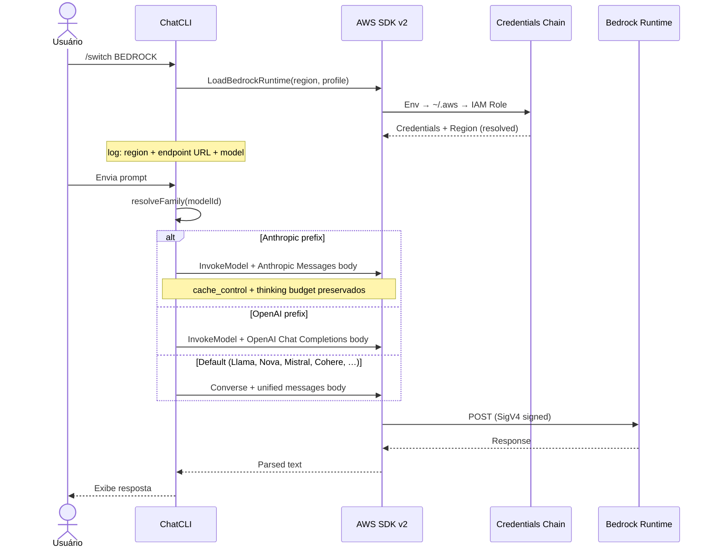

O ChatCLI suporta o **AWS Bedrock** como provedor nativo (`BEDROCK`), com **três paths de dispatch** que cobrem o catálogo inteiro de modelos hospedados pela AWS:

- **Anthropic Messages** — `anthropic.*` e inference profiles (`global./us./eu./apac.anthropic.*`). Preserva cache markers e extended-thinking.
- **OpenAI Chat Completions** — `openai.gpt-oss-*` (open-weights da OpenAI no Bedrock).
- **Converse API (default)** — schema unificado da AWS que cobre tudo o mais: Llama, Amazon Nova, Mistral, Cohere, AI21 Jamba, DeepSeek, Stability, Writer Palmyra, Moonshot Kimi, MiniMax, Qwen, Z.AI/GLM, Google Gemma, NVIDIA Nemotron, TwelveLabs Pegasus, e qualquer provider que a AWS adicionar no futuro.

A listagem do `/switch --model` confia 100% no que sua conta AWS retorna via `ListFoundationModels` + `ListInferenceProfiles` — sem allowlist hardcoded. Modelo novo na AWS aparece no próximo `/switch --model` sem precisar de release do ChatCLI.

Ideal para ambientes corporativos que já têm billing, compliance e controle de acesso via AWS — sem precisar de API keys das provedoras originais.

---

## Por que AWS Bedrock?

<CardGroup cols={2}>
  <Card title="Sem API key por provider" icon="key">
    Usa credenciais AWS existentes (IAM role, `~/.aws/credentials`, `AWS_PROFILE`). Uma única identidade pra todos os modelos.
  </Card>
  <Card title="Billing e compliance AWS" icon="receipt">
    Custos aparecem na sua conta AWS. Logs via CloudTrail, guardrails nativos do Bedrock.
  </Card>
  <Card title="Catálogo completo" icon="layer-group">
    Anthropic, OpenAI, Llama, Nova, Mistral, Cohere, AI21, DeepSeek, Moonshot Kimi, MiniMax, Qwen, Z.AI/GLM, Gemma, Nemotron, TwelveLabs — tudo via uma conta.
  </Card>
  <Card title="VPC endpoints" icon="network-wired">
    Funciona em ambientes privados com `AWS_ENDPOINT_URL_BEDROCK_RUNTIME`.
  </Card>
  <Card title="Auto-detecção de família" icon="route">
    Anthropic e OpenAI vão pros paths dedicados (cache, thinking); o resto cai em Converse — uma chamada cobre tudo.
  </Card>
  <Card title="Embeddings nativos" icon="vector-square">
    Provider de embeddings reusa a mesma cadeia de credenciais AWS. Titan v1/v2 + Cohere v3. Veja [RAG + HyDE](/features/quality/rag-hyde).
  </Card>
</CardGroup>

---

## Configuração

O provedor é detectado automaticamente quando o ChatCLI encontra **credenciais AWS válidas** (não apenas a existência de arquivos):

- **Credenciais estáticas em env:** `AWS_ACCESS_KEY_ID`
- **Profile selecionado:** `AWS_PROFILE` (via env var ou `.env` file)
- **Arquivo `~/.aws/credentials`** com ao menos um `aws_access_key_id` preenchido
- **AWS SSO:** perfil SSO em `~/.aws/config` (detecta `sso_session`, `sso_start_url`, `sso_account_id`)
- **Assume-role / credential_process:** perfis com `role_arn` ou `credential_process` em `~/.aws/config`
- **Token cache SSO:** presença de arquivos em `~/.aws/sso/cache/` (indicando `aws sso login` anterior)
- **Web Identity Token** (EKS IRSA): `AWS_WEB_IDENTITY_TOKEN_FILE`
- **Container Credentials** (ECS): `AWS_CONTAINER_CREDENTIALS_RELATIVE_URI` / `_FULL_URI`

<Warning>
A mera existência de `~/.aws/config` com apenas `region` ou `output` **não ativa** o Bedrock. É necessário que o arquivo contenha configuração de credenciais (SSO, assume-role, credential_process) ou que credenciais estáticas existam em outra fonte.
</Warning>

### Opção 1: `~/.aws/credentials` (credenciais estáticas)

Se você já usa AWS CLI, basta ter um profile configurado:

```bash
# ~/.aws/credentials
[default]
aws_access_key_id = AKIA...
aws_secret_access_key = ...

[corp-prod]
aws_access_key_id = AKIA...
aws_secret_access_key = ...
```

```bash
export AWS_PROFILE=corp-prod
export BEDROCK_REGION=us-east-1   # opcional, default us-east-1
chatcli
```

Dentro do ChatCLI:

```bash
/switch BEDROCK
```

<Tip>
Você também pode definir `AWS_PROFILE` no seu arquivo `.env` em vez de exportar no shell:
```env
AWS_PROFILE=corp-prod
BEDROCK_REGION=us-east-1
LLM_PROVIDER=BEDROCK
```
O ChatCLI lê o `.env` via godotenv e resolve o profile corretamente.
</Tip>

### Opção 2: AWS SSO (IAM Identity Center)

Se sua empresa usa AWS SSO, configure o profile no `~/.aws/config`:

```ini
[profile meu-sso]
sso_session = minha-sessao
sso_account_id = 123456789012
sso_role_name = MeuRole
region = us-east-1

[sso-session minha-sessao]
sso_start_url = https://minha-empresa.awsapps.com/start
sso_region = us-east-1
```

```bash
# Faça login (abre o browser)
aws sso login --profile meu-sso

# Use com ChatCLI (qualquer forma):
export AWS_PROFILE=meu-sso && chatcli
AWS_PROFILE=meu-sso chatcli

# Ou no .env:
echo 'AWS_PROFILE=meu-sso' >> .env
chatcli
```

<Info>
O ChatCLI detecta automaticamente profiles SSO em `~/.aws/config` (pelas chaves `sso_session`, `sso_start_url`, `sso_account_id`). Se o token SSO expirar, o erro será claro (`SSOTokenProviderError`) — basta executar `aws sso login` novamente.

**Importante:** o AWS SDK **não** sabe qual profile está "logado". Você **precisa** indicar o profile via `AWS_PROFILE` (env, `.env`, ou flag). Se seu profile SSO se chama `default`, ele é usado automaticamente sem `AWS_PROFILE`.
</Info>

### Opção 3: Environment variables (credenciais estáticas)

```bash
export AWS_ACCESS_KEY_ID=AKIA...
export AWS_SECRET_ACCESS_KEY=...
export AWS_SESSION_TOKEN=...      # se usar STS
export AWS_REGION=us-east-1
```

### Opção 4: IAM Role (EC2/ECS/EKS)

Em ambientes AWS nativos, não precisa configurar nada — o SDK pega a role automaticamente pelo IMDSv2 / webidentity. Só precisa garantir que a role tem as permissões IAM abaixo.

<Info>
O ChatCLI desabilita o probe IMDS (169.254.169.254) por padrão em máquinas que **não** são EC2/ECS/EKS, para evitar timeouts desnecessários. O IMDS é habilitado automaticamente quando env vars de container/EKS são detectadas (`AWS_CONTAINER_CREDENTIALS_*`, `AWS_WEB_IDENTITY_TOKEN_FILE`, `ECS_CONTAINER_METADATA_URI*`).

Para forçar o comportamento, use:
- `AWS_EC2_METADATA_DISABLED=true` — desabilita IMDS explicitamente
- `CHATCLI_BEDROCK_ENABLE_IMDS=1` — força habilitar IMDS (útil em EC2 sem as env vars padrão)
</Info>

---

## Permissões IAM

Permissões mínimas para invocar e listar modelos. A action `bedrock:InvokeModel` cobre tanto `InvokeModel` (Anthropic/OpenAI) quanto `Converse` (todo o resto):

```json
{
  "Version": "2012-10-17",
  "Statement": [
    {
      "Effect": "Allow",
      "Action": [
        "bedrock:InvokeModel",
        "bedrock:InvokeModelWithResponseStream"
      ],
      "Resource": [
        "arn:aws:bedrock:*::foundation-model/*",
        "arn:aws:bedrock:*:*:inference-profile/*"
      ]
    },
    {
      "Effect": "Allow",
      "Action": [
        "bedrock:ListFoundationModels",
        "bedrock:ListInferenceProfiles"
      ],
      "Resource": "*"
    }
  ]
}
```

<Tip>
Se quiser restringir a providers específicos, troque os ARNs de `Resource` por lista (ex.: `arn:aws:bedrock:*::foundation-model/anthropic.*`, `arn:aws:bedrock:*::foundation-model/moonshotai.*`). Lembre-se de incluir os ARNs dos inference profiles correspondentes (`*:inference-profile/*anthropic.*` etc.), senão Claude 3.7+ e equivalentes de outros providers param de funcionar.
</Tip>

<Tip>
As ações `ListFoundationModels` e `ListInferenceProfiles` são usadas pelo `/switch --model` para descobrir dinamicamente o que sua conta pode invocar. Sem elas, o ChatCLI cai para o catálogo estático (ainda funcional, mas desatualizável).
</Tip>

Adicionalmente, no **console Bedrock** você precisa **habilitar o model access** pra cada modelo Anthropic que pretende usar (uma vez por conta + região): `Bedrock Console → Model access → Request access`.

---

## Famílias de modelos e seleção de schema

O Bedrock usa **schemas diferentes** dependendo do modelo. O ChatCLI tem três paths e detecta automaticamente qual usar pelo prefixo do model id:

| Prefixo do model id | Família | Schema | Por quê |
| :--- | :--- | :--- | :--- |
| `anthropic.*`, `global./us./eu./apac.anthropic.*` e qualquer id contendo `claude`/`fable` | **Anthropic Messages** | `anthropic_version`, `messages`, `system` (com `cache_control`) | Preserva cache breakpoints, extended-thinking budget, todos os knobs Claude. IDs bare (ex.: `claude-fable-5`) são normalizados pro ID invocável do catálogo — antes eles caíam no Converse, que **descarta os markers de cache** |
| `openai.*`, `us.openai.*`, etc. | **OpenAI Chat Completions** | `messages`, `max_completion_tokens` | Schema estável e amplamente coberto pra GPT-OSS |
| Qualquer outro (Llama, Nova, Mistral, Cohere, AI21, DeepSeek, Stability, Writer, Moonshot, MiniMax, Qwen, Z.AI, Gemma, Nemotron, TwelveLabs, ...) | **Converse API** (default) | `messages`, `system`, `inferenceConfig` | Schema unificado da AWS — uma implementação cobre todos os providers que não exigem features específicas |

### Override manual

Se quiser forçar uma família independente do prefixo (ex.: testar Converse num modelo Anthropic), use a env var:

```bash
export BEDROCK_PROVIDER=anthropic   # ou "claude"
export BEDROCK_PROVIDER=openai      # ou "gpt"
export BEDROCK_PROVIDER=converse    # ou "auto"
```

Valores aceitos: `anthropic` / `claude`, `openai` / `gpt`, `converse` / `auto` (case-insensitive). A env var tem precedência sobre a detecção por prefixo.

<Tip>
**Por que Anthropic e OpenAI ficam fora do Converse?** Anthropic mantém cache_control breakpoints e extended-thinking que mapeiam pro Converse com shape diferente — escolhemos não perturbar o cache planner que já está provado em produção. OpenAI gpt-oss roda estável no `InvokeModel` direto e a cobertura do Converse pra esses IDs varia por região. Se quiser experimentar, `BEDROCK_PROVIDER=converse` força tudo no Converse.
</Tip>

<Info>
**Sem allowlist hardcoded.** O `/switch --model` lista qualquer text-output model com inference on-demand que sua conta tem acesso — Kimi K2.6, GLM 4.7, Qwen3 Coder Next, Nemotron Nano 3, qualquer modelo novo que a AWS adicionar — sem precisar de release nosso. Se um ID raro não casar com Converse, o ChatCLI retorna mensagem amigável apontando o caminho.
</Info>

---

## Claude nova geração e o endpoint Messages (bedrock-mantle)

A geração mais nova de modelos Claude no Bedrock (**Fable 5, Sonnet 5, Opus 4.8, Opus 4.7**) usa **IDs dateless** — `anthropic.claude-fable-5`, `anthropic.claude-sonnet-5`, `anthropic.claude-opus-4-8`, `anthropic.claude-opus-4-7`. Eles **não têm** IDs ARN-versionados (`...-v1:0`) e não exigem inference profile.

O **Claude Sonnet 5** tem uma particularidade: ele é servido **exclusivamente** pelo endpoint *Claude in Amazon Bedrock* — a Messages API em `https://bedrock-mantle.{região}.api.aws/anthropic/v1/messages` — e não existe no `InvokeModel` legado. O ChatCLI cuida disso sozinho:

- O catálogo marca o modelo com a capability `bedrock_mantle_only` e o client roteia a request pro endpoint Messages automaticamente — `/switch --model claude-sonnet-5` simplesmente funciona.
- **Auth**: SigV4 com o service name `bedrock-mantle` usando a mesma credentials chain (IAM, profile, SSO), ou um bearer token de curta duração via `AWS_BEARER_TOKEN_BEDROCK` (header `x-api-key`), útil em ambientes corporativos sem IAM.
- **Body**: mesmo shape da Messages API first-party — a versão vai no header `anthropic-version` (o campo `anthropic_version` do body é exclusivo do InvokeModel). Os markers de `cache_control` chegam intactos no wire, como no path InvokeModel.
- **Overrides de operação**: `BEDROCK_ANTHROPIC_ENDPOINT=mantle|invoke` força qualquer modelo Claude pra um dos dois wires (migração gradual/rollback) e `BEDROCK_MANTLE_BASE_URL` aponta pra VPC endpoints ou proxies. TLS corporativo (`CHATCLI_BEDROCK_CA_BUNDLE` etc.) é honrado.

<Note>
Fable 5, Opus 4.8 e Opus 4.7 continuam no `InvokeModel` por padrão (servidos pela mesma infraestrutura do endpoint Messages); use `BEDROCK_ANTHROPIC_ENDPOINT=mantle` se quiser movê-los pro endpoint novo também.
</Note>

---

## Inference Profiles vs. Model IDs

Esse é **o detalhe mais importante** do Bedrock com Claude.

Modelos Anthropic **da era 3.7–4.6 (3.7, 4.x, 4.5, 4.6) NÃO aceitam invocação on-demand direto pelo ID base** (a nova geração dateless — Fable 5, Sonnet 5, Opus 4.8/4.7 — não precisa de profile; veja a seção acima). Se você tentar com um modelo da era antiga, recebe:

```
on-demand throughput isn't supported. Request with the id or arn of an
inference profile that contains this model.
```

A solução é usar um **inference profile ID**, que é um ARN lógico que roteia a chamada pra região com capacidade disponível. Ele vem com um prefixo de geografia:

| Prefixo | Significado |
| :--- | :--- |
| `global.*` | Global — tier mais novo, disponibilidade mundial (recomendado) |
| `us.*` | Cross-region EUA (`us-east-1`, `us-east-2`, `us-west-2`) |
| `eu.*` | Cross-region Europa |
| `apac.*` | Cross-region Ásia-Pacífico |

**Exemplo:**

```text
anthropic.claude-sonnet-4-5-20250929-v1:0           ❌ erro on-demand
global.anthropic.claude-sonnet-4-5-20250929-v1:0    ✅ funciona
us.anthropic.claude-sonnet-4-5-20250929-v1:0        ✅ funciona
```

<Info>
O ChatCLI já usa um inference profile global como **modelo padrão** (`global.anthropic.claude-sonnet-4-5-20250929-v1:0`). Os modelos Claude 3 e 3.5 ainda aceitam invocação direta pelo ID base e também estão no catálogo.
</Info>

---

## Listagem de Modelos

O `/switch --model` consulta **duas fontes** ao vivo e as mescla com o catálogo estático:

1. **`bedrock:ListFoundationModels`** com `ByOutputModality: TEXT` — modelos de texto disponíveis na região.
2. **`bedrock:ListInferenceProfiles`** — profiles regionais/global (paginado).

Dois filtros AWS-side garantem que só apareça o que **realmente funciona**:

- **Modality TEXT** (server-side) — corta embedding-only e image-only.
- **`InferenceTypesSupported` contém `ON_DEMAND`** — corta IDs base que só são invocáveis via inference profile (Claude 3.7+/4.x e cross-region-only de outros providers). Esses modelos aparecem normalmente via `ListInferenceProfiles` com prefixo `global./us./eu./apac.`.

```bash
/switch BEDROCK
/switch --model
```

Exemplo de saída (depende das permissões da sua conta):

```
Available models for BEDROCK (API: 47 + catalog: 14):
  1. anthropic.claude-fable-5 ... [catalog]
  2. anthropic.claude-sonnet-5 ... [catalog]
  3. global.anthropic.claude-sonnet-4-5-20250929-v1:0 ... [api]
  4. moonshotai.kimi-k2.5 ... [api]
  5. moonshotai.kimi-k2-thinking ... [api]
  6. zai.glm-4-7 ... [api]
  7. minimax.m-2-5 ... [api]
  8. qwen.qwen3-coder-480b ... [api]
  9. us.deepseek.r1-v1:0 ... [api]
  10. anthropic.claude-3-5-sonnet-20241022-v2:0 ... [api]
  11. openai.gpt-oss-120b-1:0 ... [api]
  ...
```

Modelos com `[api]` são os que sua conta **realmente** pode invocar naquela região. Os `[catalog]` são registros estáticos que podem ou não estar habilitados.

<Warning>
Ainda é necessário **habilitar Model Access** no console Bedrock pra cada provider que pretende usar. AWS faz isso por conta + região. Se um modelo aparece no `ListFoundationModels` mas dá `AccessDeniedException` no invoke, é porque falta o opt-in de model access — é quase sempre um clique no console.
</Warning>

---

## Proxy Corporativo e TLS Privado

Em ambientes corporativos com proxy interceptando TLS com uma CA privada, você pode ver:

```
tls: failed to verify certificate: x509: certificate signed by unknown authority
```

O ChatCLI oferece duas env vars específicas pro Bedrock:

| Variável | Descrição |
| :--- | :--- |
| `CHATCLI_BEDROCK_CA_BUNDLE` | Caminho para um bundle PEM com a CA corporativa. Mescla no pool do sistema e usa como `RootCAs`. Tem precedência sobre `AWS_CA_BUNDLE`. |
| `CHATCLI_BEDROCK_INSECURE_SKIP_VERIFY` | `true` desabilita verificação TLS por completo (equivalente ao `NODE_TLS_REJECT_UNAUTHORIZED=0` do Node). **Inseguro** — use só pra confirmar que é problema de TLS. |

```bash
# Recomendado: usar bundle com a CA corporativa
export CHATCLI_BEDROCK_CA_BUNDLE=/etc/ssl/corp-ca-bundle.pem

# Último recurso (inseguro)
export CHATCLI_BEDROCK_INSECURE_SKIP_VERIFY=true
```

<Info>
Se o proxy intercepta TLS de **todos** os providers (não só o Bedrock), prefira as variáveis **globais** `CHATCLI_CA_BUNDLE` / `CHATCLI_TLS_INSECURE_SKIP_VERIFY` — valem para todas as conexões de saída (LLM providers, web tools, gateway, MCP), e o Bedrock as herda como fallback. As específicas do Bedrock têm precedência quando ambas estão definidas. Veja [Confiança TLS Global](/reference/environment-variables#confian%C3%A7a-tls-global-proxy-corporativo).
</Info>

<Warning>
`CHATCLI_BEDROCK_INSECURE_SKIP_VERIFY=true` emite warning no log e aceita qualquer certificado. Use apenas em troubleshooting — nunca em produção.
</Warning>

Proxy HTTP(S) é respeitado automaticamente via env vars padrão do Go:

```bash
export HTTPS_PROXY=http://proxy.corp:3128
export HTTP_PROXY=http://proxy.corp:3128
export NO_PROXY=localhost,127.0.0.1,.corp.internal
```

### VPC Endpoints / endpoints privados

Se a empresa usa VPC endpoint para Bedrock:

```bash
export AWS_ENDPOINT_URL_BEDROCK_RUNTIME=https://bedrock-runtime.vpc.internal
export AWS_ENDPOINT_URL_BEDROCK=https://bedrock.vpc.internal
```

O SDK v2 lê essas vars nativamente — não é necessário mudar nada no ChatCLI.

---

## Variáveis de Ambiente

| Variável | Descrição | Padrão |
| :--- | :--- | :--- |
| `BEDROCK_PROVIDER` | Override manual do schema: `anthropic` / `claude`, `openai` / `gpt`, `converse` / `auto` | auto-detect |
| `BEDROCK_TEMPERATURE` | Temperature (usada por OpenAI e Converse paths) | — |
| `BEDROCK_TOP_P` | Top-p sampling (usado pelo Converse path) | — |
| `BEDROCK_REGION` | Região AWS (prioridade sobre `AWS_REGION`) | — |
| `AWS_REGION` | Região AWS (fallback) | — |
| `AWS_PROFILE` | Profile em `~/.aws/credentials` ou `~/.aws/config` (SSO, assume-role). Pode ser definido no `.env`. | — |
| `AWS_ACCESS_KEY_ID` / `AWS_SECRET_ACCESS_KEY` / `AWS_SESSION_TOKEN` | Credenciais estáticas | — |
| `AWS_CA_BUNDLE` | Bundle PEM lido nativamente pelo SDK v2 | — |
| `AWS_ENDPOINT_URL_BEDROCK_RUNTIME` | Override de endpoint do Bedrock Runtime | — |
| `AWS_ENDPOINT_URL_BEDROCK` | Override de endpoint do Bedrock (control plane) | — |
| `AWS_EC2_METADATA_DISABLED` | `true` desabilita IMDS (169.254.169.254) explicitamente | — |
| `CHATCLI_BEDROCK_ENABLE_IMDS` | `1`/`true` força habilitar o probe IMDS em máquinas não-EC2 | `false` |
| `BEDROCK_MAX_TOKENS` | Limite de tokens de saída | Do catálogo |
| `BEDROCK_ANTHROPIC_ENDPOINT` | Força o wire dos modelos Claude: `mantle` (endpoint Messages) ou `invoke` (InvokeModel legado) | por catálogo |
| `BEDROCK_MANTLE_BASE_URL` | Override do endpoint Messages (`bedrock-mantle.{região}.api.aws`) pra VPC endpoints/proxies | — |
| `AWS_BEARER_TOKEN_BEDROCK` | Bearer token de curta duração (`aws-bedrock-token-generator`) — enviado no header `x-api-key` do endpoint Messages, sem SigV4 | — |
| `ANTHROPIC_MAX_TOKENS` | Alternativa compartilhada com o provedor Anthropic direto | — |
| `CHATCLI_BEDROCK_CA_BUNDLE` | Bundle PEM específico do Bedrock (precede `AWS_CA_BUNDLE`) | — |
| `CHATCLI_BEDROCK_INSECURE_SKIP_VERIFY` | `true` desabilita verificação TLS (inseguro) | `false` |
| `HTTPS_PROXY` / `HTTP_PROXY` / `NO_PROXY` | Proxy HTTP padrão Go/SDK | — |

**Default model:** `global.anthropic.claude-sonnet-4-5-20250929-v1:0`
**Default region:** `us-east-1`

Todas essas vars aparecem no `/config providers` (chat) e `/config quality` (embeddings). Veja [Variáveis de Ambiente](/reference/environment-variables) pra referência completa.

---

## Observabilidade — endpoint URL nos logs

A partir desta versão, o ChatCLI loga o endpoint URL do Bedrock em todas as requests — paridade com Anthropic, OpenAI e Copilot. Útil pra debugar problemas de credencial, região, VPC endpoint ou proxy.

**No init (uma vez por sessão):**

```text
INFO  llm.info.configuring_provider: Bedrock
      region=us-east-1
      endpoint=https://bedrock-runtime.us-east-1.amazonaws.com
      model=global.anthropic.claude-sonnet-4-5-20250929-v1:0
```

**Em cada request (chat):**

```text
INFO  llm: request start  provider=BEDROCK
      family=anthropic
      region=us-east-1
      endpoint=https://bedrock-runtime.us-east-1.amazonaws.com
      payload_bytes=12453  history_len=8  max_tokens=4096
      cache_markers=3
```

**No init de embeddings:**

```text
INFO  bedrock embeddings: configured
      region=us-east-1
      endpoint=https://bedrock-runtime.us-east-1.amazonaws.com
      model=amazon.titan-embed-text-v2:0
      family=titan
      dim=1024
```

A URL é derivada da região resolvida pelo SDK (`https://bedrock-runtime.<region>.amazonaws.com`). Se você definiu `AWS_ENDPOINT_URL_BEDROCK_RUNTIME` (VPC endpoint), o SDK usa o override — o log mostra a URL canônica, mas a request real vai pro endpoint customizado.

---

## Arquitetura



A construção do `bedrockruntime.Client` está num helper exportado (`bedrock.LoadBedrockRuntime`) compartilhado entre o chat client e o provider de embeddings — single source of truth pra config AWS. A autenticação é SigV4, feita transparentemente pelo SDK. O HTTP client pode ser sobrescrito pelo ChatCLI quando `CHATCLI_BEDROCK_CA_BUNDLE` ou `CHATCLI_BEDROCK_INSECURE_SKIP_VERIFY` estão definidos (via `awshttp.BuildableClient`).

---

## Diferença entre Bedrock e Anthropic Direto

| Aspecto | BEDROCK | CLAUDEAI (Anthropic direto) |
| :--- | :--- | :--- |
| **Auth** | AWS credentials chain (IAM, profile) | API key (`sk-ant-...`) ou OAuth |
| **Endpoint** | `bedrock-runtime.<region>.amazonaws.com` | `api.anthropic.com` |
| **Billing** | Conta AWS (console Billing + CloudTrail) | Conta Anthropic (console.anthropic.com) |
| **Modelos** | Catálogo Bedrock inteiro (Claude, OpenAI, Llama, Nova, Mistral, Cohere, AI21, DeepSeek, Moonshot, MiniMax, Qwen, Z.AI, Gemma, Nemotron, TwelveLabs) | Todos Claude, com as versões mais recentes primeiro |
| **Streaming** | Não implementado nesta versão (usa `InvokeModel` / `Converse`) | Suportado |
| **OAuth/1M context** | N/A | Suportado (`ANTHROPIC_1MTOKENS_SONNET`) |
| **VPC privado** | Sim (via `AWS_ENDPOINT_URL_*`) | Não |
| **Compliance** | Inherits from AWS (SOC2, HIPAA, etc.) | Inherits from Anthropic |
| **Embeddings** | Sim — Titan v1/v2 + Cohere v3 (mesma cadeia AWS) | Não disponível |

<Tip>
Se sua empresa já roda tudo em AWS com compliance gerenciado, **BEDROCK é o melhor caminho**. Se você é individual developer querendo as features mais novas do Claude (1M context, OAuth via Claude Code plan), use **CLAUDEAI** direto.
</Tip>

---

## Troubleshooting

<AccordionGroup>
  <Accordion title="bedrock: model X requires an inference profile">
    Mensagem do ChatCLI quando você seleciona um ID base que precisa de inference profile (Claude 3.7+, 4.x, 4.5, 4.6, 4.7 e equivalentes em outros providers). A mensagem **já sugere o caminho**:

    ```text
    bedrock: model "anthropic.claude-3-7-sonnet-20250219-v1:0" requires an
    inference profile (the bare foundation ID is not invokable on-demand).
    Try selecting "global.anthropic.claude-3-7-sonnet-20250219-v1:0",
    "us.anthropic.claude-3-7-sonnet-20250219-v1:0",
    "eu.anthropic.claude-3-7-sonnet-20250219-v1:0", or
    "apac.anthropic.claude-3-7-sonnet-20250219-v1:0" instead, or run
    `/switch --model` to see profiles your account has access to.
    ```

    Desde a versão atual, o `/switch --model` **filtra automaticamente** IDs base que exigem profile — então isso só aparece se você digitar um ID manualmente. O filtro usa o campo `InferenceTypesSupported` do ListFoundationModels: modelo sem `ON_DEMAND` é suprimido da listagem.
  </Accordion>
  <Accordion title="AccessDeniedException: You don't have access to the model">
    Vá no console Bedrock da região e habilite Model Access pro provider. Demora alguns minutos. Também cheque se a role IAM tem `bedrock:InvokeModel` no ARN do modelo + do inference profile.
  </Accordion>
  <Accordion title="NoCredentialProviders / unable to load SDK config">
    O SDK não achou credenciais. Verifique:
    ```bash
    aws sts get-caller-identity   # deve retornar sua identidade
    env | grep -E 'AWS_|BEDROCK_'
    ls -la ~/.aws/
    ```
    Se nenhum retornar credenciais, configure via `aws configure`, `aws sso login`, ou exporte as env vars.
  </Accordion>
  <Accordion title="no EC2 IMDS role found / dial tcp 169.254.169.254:80: connect: host is down">
    Este erro ocorre quando o AWS SDK tenta alcançar o **EC2 Instance Metadata Service** (IMDS) em uma máquina que **não é EC2** (ex.: seu laptop). O ChatCLI desabilita o probe IMDS por padrão em máquinas não-EC2, mas se o erro persistir:

    ```bash
    # Solução 1: Defina credenciais válidas
    export AWS_PROFILE=meu-profile
    # ou
    export AWS_ACCESS_KEY_ID=AKIA...

    # Solução 2: Desabilite IMDS explicitamente
    export AWS_EC2_METADATA_DISABLED=true
    ```

    Se você **realmente está em EC2** e precisa do IMDS:
    ```bash
    export CHATCLI_BEDROCK_ENABLE_IMDS=1
    ```
  </Accordion>
  <Accordion title="SSOTokenProviderError / expired token (SSO)">
    O token do SSO expirou (validade padrão ~8h). Faça login novamente:
    ```bash
    aws sso login --profile seu-profile
    ```
    Lembre-se de ter `AWS_PROFILE` definido (env, `.env`, ou o profile se chamar `default`).
  </Accordion>
  <Accordion title="x509: certificate signed by unknown authority">
    Proxy corporativo fazendo TLS interception. Configure `CHATCLI_BEDROCK_CA_BUNDLE` com o PEM da CA corp. Para destravar rapidamente durante troubleshooting, use `CHATCLI_BEDROCK_INSECURE_SKIP_VERIFY=true` (inseguro, apenas temporário).
  </Accordion>
  <Accordion title="ThrottlingException / ServiceQuotaExceededException">
    Você atingiu o quota on-demand da região. Opções:
    - Use um inference profile `global.*` (roteia pra qualquer região disponível)
    - Use Provisioned Throughput (precisa ser configurado no console Bedrock)
    - Aumente os limites via Service Quotas na AWS
  </Accordion>
</AccordionGroup>

---

## Embeddings via Bedrock

O ChatCLI também usa Bedrock como provider de embeddings (HyDE phase 3b, vector retrieval). Ativação:

```bash
export CHATCLI_EMBED_PROVIDER=bedrock
export CHATCLI_QUALITY_HYDE_ENABLED=true
export CHATCLI_QUALITY_HYDE_USE_VECTORS=true

# Opcional — defaults: Titan v2 1024-dim, mesma região do chat
export CHATCLI_EMBED_MODEL=amazon.titan-embed-text-v2:0
export CHATCLI_EMBED_DIMENSIONS=1024     # Titan v2: 256/512/1024
```

Famílias suportadas:

| Model ID prefix | Família | Dimensões |
| :--- | :--- | :--- |
| `amazon.titan-embed-text-v2*` | Titan v2 | 256 / 512 / 1024 (configurável via `CHATCLI_EMBED_DIMENSIONS`) |
| `amazon.titan-embed-text-v1` | Titan v1 | 1536 (fixo) |
| `cohere.embed-english-v3` / `cohere.embed-multilingual-v3` | Cohere v3 | 1024 (fixo) |

Reusa **a mesma cadeia de credenciais** do chat client — `BEDROCK_REGION` / `AWS_REGION` / `AWS_PROFILE` / `~/.aws/credentials` etc. Veja [RAG + HyDE](/features/quality/rag-hyde) para arquitetura completa do retrieval.

<Tip>
Titan e Cohere usam schemas diferentes mas o ChatCLI auto-detecta pelo prefixo do model id. Se precisa de batch grande com Titan (que aceita só 1 texto por chamada), o provider paraleliza com pool de 8 workers transparentemente.
</Tip>

---

## Próximos Passos

<CardGroup cols={2}>
  <Card title="Provider Fallback" icon="arrows-rotate" href="/features/provider-fallback">
    Configure failover automático entre Bedrock e outros provedores
  </Card>
  <Card title="RAG + HyDE" icon="database" href="/features/quality/rag-hyde">
    Embeddings via Bedrock Titan/Cohere para retrieval semântico
  </Card>
  <Card title="Modelos Suportados" icon="list" href="/reference/supported-models">
    Lista completa de modelos por provedor
  </Card>
  <Card title="Variáveis de Ambiente" icon="sliders" href="/reference/environment-variables">
    Referência completa de configuração
  </Card>
</CardGroup>
