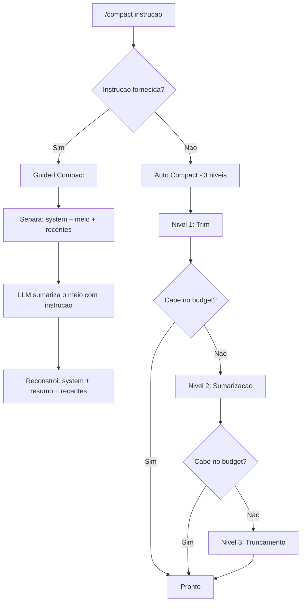

O ChatCLI oferece dois mecanismos poderosos para controle do historico de conversa: **compactacao inteligente** para reduzir o tamanho do contexto sem perder informacoes criticas, e **rewind** para restaurar a conversa a um ponto anterior.

---

## /compact — Compactacao de Contexto

O comando `/compact` reduz o tamanho do historico de conversa para que ele caiba dentro da janela de contexto do modelo, preservando as informacoes mais importantes.

### Modos de Uso

<Tabs>
  <Tab title="Automatico">
    Sem argumentos, executa o pipeline de compactacao de 3 niveis:

    ```bash
    /compact
    ```

    O pipeline automatico segue esta ordem:

    1. **Nivel 1 — Trimming** (quase sem perda): remove tags `<reasoning>`, compacta XML, elimina duplicatas
    2. **Nivel 2 — Sumarizacao estruturada**: extrai fatos (arquivos lidos, modificados, comandos executados, decisoes) em formato bullet point
    3. **Nivel 3 — Truncamento de emergencia**: descarta mensagens do meio, mantendo system prompt e mensagens recentes
  </Tab>
  <Tab title="Guiado">
    Com uma instrucao, voce diz a IA **o que preservar**:

    ```bash
    /compact preservar a arquitetura do modulo auth e os erros encontrados
    ```

    ```bash
    /compact manter todos os caminhos de arquivo e decisoes de refatoracao
    ```

    O modo guiado envia sua instrucao como diretiva para a IA sumarizadora, garantindo que as informacoes que voce considera criticas sejam mantidas na compactacao.
  </Tab>
</Tabs>

### Como Funciona



### Preservacao de Mensagens

Em ambos os modos:
- **System messages** sao sempre preservadas integralmente
- **Ultimas mensagens** (4 no guiado, 10 no automatico) sao mantidas verbatim
- Apenas o **bloco do meio** e sumarizado ou removido
- Metadados indicam que a mensagem e um resumo (`IsSummary: true`)

### Exemplo de Saida

Apos compactacao, uma mensagem de resumo substitui as mensagens do meio:

```text
[GUIDED COMPACT — covering 42 earlier messages | instruction: "preservar arquitetura auth"]

## Files Read
- pkg/auth/handler.go (120 lines) - HTTP handlers for authentication
- pkg/auth/middleware.go (85 lines) - JWT validation middleware

## Files Modified
- pkg/auth/handler.go:45-60 - Added refresh token endpoint

## Key Decisions
- JWT tokens expire in 15 minutes with refresh token rotation
- Middleware validates at gateway level, not per-service

## Errors & Resolutions
- "token expired" panic in middleware → added nil check on claims
```

---

## /rewind — Voltar no Tempo

O `/rewind` permite restaurar a conversa a um ponto anterior, desfazendo mensagens e respostas indesejadas.

### Como Funciona

O ChatCLI salva automaticamente **checkpoints** da conversa antes de cada chamada ao LLM. Voce pode voltar a qualquer um desses pontos.

```bash
/rewind
```

Isso exibe um menu interativo:

```text
  REWIND — Select a checkpoint to restore
  ─────────────────────────────────────────
  [1]  14:32:05  28 msgs  implemente o endpoint de refresh token
  [2]  14:28:12  24 msgs  corrija o bug no middleware JWT
  [3]  14:25:01  20 msgs  analise o modulo de autenticacao
  [4]  14:20:33  16 msgs  (start)

  Select [1-4] or (q)uit:
```

Selecione o numero do checkpoint para restaurar. O historico e revertido ao estado exato daquele ponto, incluindo todas as mensagens e contexto.

### Atalho de Teclado: Esc+Esc

Pressione **Esc** duas vezes rapidamente (menos de 500ms entre pressionamentos) para abrir o menu de rewind diretamente do prompt, sem precisar digitar `/rewind`.

### Limites

- Maximo de **20 checkpoints** sao mantidos (os mais antigos sao descartados)
- Checkpoints existem apenas na sessao atual (nao sao persistidos em disco)
- Ao fazer rewind, checkpoints posteriores ao ponto restaurado sao removidos

---

## Historico Unificado

O ChatCLI usa um **unico array de historico** compartilhado entre todos os modos (chat, agent, coder). Isso significa que:

- A troca entre `/agent`, `/coder` e chat **preserva todo o contexto**
- A IA nao "esquece" o que foi feito em outro modo
- `/compact` e `/rewind` operam sobre o historico completo, independente do modo

<Info>
Sessoes salvas com versoes anteriores do ChatCLI que usavam historicos separados por modo sao automaticamente convertidas ao carregar — os historicos sao mesclados em ordem cronologica.
</Info>

---

## Quando Usar

<CardGroup cols={2}>
  <Card title="/compact (automatico)" icon="compress">
    Quando o ChatCLI avisar que o contexto esta grande, ou quando perceber respostas degradadas.
  </Card>
  <Card title="/compact <instrucao>" icon="crosshairs">
    Quando voce sabe exatamente quais informacoes sao criticas e nao podem ser perdidas na compactacao.
  </Card>
  <Card title="/rewind" icon="rotate-left">
    Quando a IA tomou um caminho errado, gerou codigo incorreto, ou voce quer tentar uma abordagem diferente.
  </Card>
  <Card title="Esc+Esc" icon="keyboard">
    Atalho rapido para rewind sem sair do fluxo de digitacao.
  </Card>
</CardGroup>

---

## Proximos Passos

<CardGroup cols={2}>
  <Card title="Gerenciamento de Sessoes" icon="floppy-disk" href="/features/session-management">
    Salve e reutilize conversas entre projetos.
  </Card>
  <Card title="Bootstrap e Memoria" icon="memory" href="/features/bootstrap-memory">
    Personalize a IA e mantenha contexto de longo prazo entre sessoes.
  </Card>
</CardGroup>
