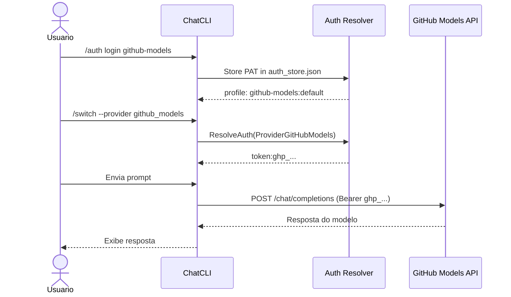

O ChatCLI suporta o **GitHub Models** como provedor nativo, permitindo acesso a modelos como GPT-4o, Llama 3.1, DeepSeek R1, Mistral, Phi-4 e outros diretamente do [GitHub Models marketplace](https://github.com/marketplace/models).

---

## Por que GitHub Models?

<CardGroup cols={2}>
  <Card title="Sem custo extra" icon="dollar-sign">
    Use modelos com seu token GitHub existente. Tier gratuito inclui GPT-4o, Llama 3.1 405B/8B.
  </Card>
  <Card title="Variedade de modelos" icon="layer-group">
    Acesso a modelos de OpenAI, Meta, Mistral, DeepSeek, Microsoft, Cohere e outros.
  </Card>
  <Card title="Zero configuração" icon="bolt">
    Se você já tem `GITHUB_TOKEN` no ambiente (ex: GitHub CLI), funciona automaticamente.
  </Card>
  <Card title="API compativel" icon="plug">
    Usa API OpenAI-compatible em `models.inference.ai.azure.com`.
  </Card>
</CardGroup>

---

## Configuração

### Opção 1: Variável de Ambiente (Recomendado)

Se você já usa GitHub CLI (`gh`) ou tem `GITHUB_TOKEN` configurado, o provedor e detectado automaticamente:

```bash
export GITHUB_TOKEN=ghp_seu_token_aqui
# ou
export GH_TOKEN=ghp_seu_token_aqui
# ou
export GITHUB_MODELS_TOKEN=ghp_seu_token_aqui
```

Depois basta selecionar o provedor:

```bash
chatcli --provider github_models --model gpt-4o
```

Ou dentro do ChatCLI:

```bash
/switch --provider github_models --model gpt-4o
```

### Opção 2: Login Interativo

```bash
/auth login github-models
```

<Steps>
  <Step title="Gere um Personal Access Token (PAT)">
    Acesse [github.com/settings/tokens](https://github.com/settings/tokens) e crie um token. Nenhum scope especial e necessário para inferencia de modelos.
  </Step>
  <Step title="Cole o token no terminal">
    O ChatCLI vai pedir o token. Cole e pressione Enter.
  </Step>
  <Step title="Provedor disponível imediatamente">
    O provedor `GITHUB_MODELS` aparece no `/switch` sem reiniciar.
  </Step>
</Steps>

### Logout

```bash
/auth logout github-models
```

---

## Modelos Disponiveis

A disponibilidade depende do seu plano GitHub:

### Tier Gratuito

| Modelo | Publisher | Context Window |
|--------|-----------|---------------|
| `gpt-4o` | Azure OpenAI | 128K |
| `gpt-4o-mini` | Azure OpenAI | 128K |
| `Meta-Llama-3.1-405B-Instruct` | Meta | 128K |
| `Meta-Llama-3.1-8B-Instruct` | Meta | 128K |

### Com GitHub Copilot Pro (modelos adicionais)

| Modelo | Publisher | Context Window |
|--------|-----------|---------------|
| `DeepSeek-R1` | DeepSeek | 64K |
| `Mistral-large-2411` | Mistral | 128K |
| `Phi-4` | Microsoft | 16K |
| `AI21-Jamba-1.5-Large` | AI21 | 256K |
| `Cohere-command-r-plus-08-2024` | Cohere | 128K |

<Info>
A lista completa de modelos está em [github.com/marketplace/models](https://github.com/marketplace/models). Use `/switch --model` para ver os modelos disponíveis para seu token.
</Info>

<Warning>
Modelos que não estão disponíveis para seu plano retornam erro `unavailable_model` ao tentar enviar um prompt. O `/switch --model` lista tanto modelos da API quanto do catalogo — os do catalogo podem não estar disponíveis para seu token.
</Warning>

---

## Listagem de Modelos

O ChatCLI combina duas fontes ao listar modelos:

1. **API** — modelos retornados pelo endpoint `/models` (disponibilidade real do token)
2. **Catalogo** — modelos conhecidos do marketplace (podem precisar de plano superior)

```bash
/switch --model
```

Exemplo de saida:

```
Available models for GITHUB_MODELS (API: 4 + catalog: 5):
  1. gpt-4o (GPT-4o (GitHub Models)) [api]
  2. gpt-4o-mini (GPT-4o mini (GitHub Models)) [api]
  3. Meta-Llama-3.1-405B-Instruct (Llama 3.1 405B (GitHub Models)) [api]
  4. Meta-Llama-3.1-8B-Instruct (Llama 3.1 8B (GitHub Models)) [api]
  5. DeepSeek-R1 (DeepSeek R1 (GitHub Models))
  6. Mistral-large-2411 (Mistral Large (GitHub Models))
  7. Phi-4 (Phi-4 (GitHub Models))
  8. AI21-Jamba-1.5-Large (Jamba 1.5 Large (GitHub Models))
  9. Cohere-command-r-plus-08-2024 (Cohere Command R+ (GitHub Models))
```

Modelos com `[api]` foram confirmados como disponíveis para seu token.

---

## Variaveis de Ambiente

| Variável | Descrição | Default |
|----------|-----------|---------|
| `GITHUB_TOKEN` | GitHub Personal Access Token (prioridade 1) | - |
| `GH_TOKEN` | Alias para GitHub Token (prioridade 2) | - |
| `GITHUB_MODELS_TOKEN` | Token dedicado para GitHub Models (prioridade 3) | - |
| `GITHUB_MODELS_API_URL` | Override da URL da API | `https://models.inference.ai.azure.com/chat/completions` |
| `GITHUB_MODELS_MAX_TOKENS` | Max tokens de saída | `4096` |
| `GITHUB_MODELS_MODEL` | Modelo padrão | `gpt-4o` |

---

## Arquitetura



O provider `GITHUB_MODELS` usa a API OpenAI-compatible em `models.inference.ai.azure.com`. A autenticação e via `Authorization: Bearer <token>` com o GitHub PAT.

---

## Diferenca entre GitHub Models, Copilot e OpenAI

| Aspecto | GitHub Models | GitHub Copilot | OpenAI (API Key) |
|---------|--------------|----------------|-------------------|
| **Auth** | GitHub PAT (`ghp_...`) | Device Flow OAuth | API Key (`sk-...`) |
| **Endpoint** | `models.inference.ai.azure.com` | `api.githubcopilot.com` | `api.openai.com` |
| **Modelos** | GPT-4o, Llama, Mistral, DeepSeek... | GPT-4o, Claude, Gemini | Todos os modelos OpenAI |
| **Custo** | Gratuito (com rate limits) | Assinatura Copilot | Pay-per-use (billing) |
| **Comando** | `/auth login github-models` | `/auth login github-copilot` | `OPENAI_API_KEY=sk-...` |
| **Provider** | `GITHUB_MODELS` | `COPILOT` | `OPENAI` |

<Tip>
Se você tem um token GitHub mas não tem assinatura OpenAI paga, o `GITHUB_MODELS` e a melhor opção para acessar GPT-4o gratuitamente.
</Tip>

---

## Próximos Passos

<CardGroup cols={2}>
  <Card title="OAuth Authentication" icon="key" href="/features/oauth-authentication">
    Outros métodos de autenticação (Anthropic, OpenAI Codex, Copilot)
  </Card>
  <Card title="Provider Fallback" icon="arrows-rotate" href="/features/provider-fallback">
    Configure failover automático entre provedores
  </Card>
  <Card title="Modelos Suportados" icon="list" href="/reference/supported-models">
    Lista completa de modelos por provedor
  </Card>
  <Card title="Modo Coder" icon="code" href="/core-concepts/coder-mode">
    Use GitHub Models no modo de engenharia
  </Card>
</CardGroup>
