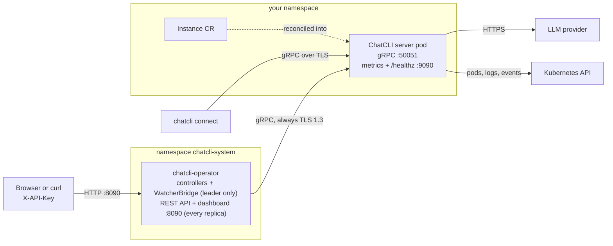

The **ChatCLI Operator** runs ChatCLI servers on Kubernetes as `Instance` resources and, on top of them, an AIOps pipeline that turns watcher alerts into incidents, asks the LLM for a root cause and executes remediation. This page is the operator's journey: install it, bring up a first Instance end to end, connect to it, open the dashboard, and harden it for production.

<Info>
The internals of the AIOps pipeline (correlation, analysis, remediation actions, post-mortems) are covered in [AIOps Platform](/features/aiops-platform) and [Incident Lifecycle](/features/aiops/incident-lifecycle). This page covers everything you need to operate it.
</Info>

## How it fits together


```mermaid
flowchart LR
    subgraph sys["namespace chatcli-system"]
        OP["chatcli-operator<br/>controllers + WatcherBridge (leader only)<br/>REST API + dashboard :8090 (every replica)"]
    end
    subgraph app["your namespace"]
        CR["Instance CR"]
        POD["ChatCLI server pod<br/>gRPC :50051<br/>metrics + /healthz :9090"]
        CR -. "reconciled into" .-> POD
    end
    OP -- "gRPC, always TLS 1.3" --> POD
    CLI["chatcli connect"] -- "gRPC over TLS" --> POD
    WEB["Browser or curl<br/>X-API-Key"] -- "HTTP :8090" --> OP
    POD -- "HTTPS" --> LLM["LLM provider"]
    POD -- "pods, logs, events" --> API["Kubernetes API"]
```

What you need to know before you start:

- **An `Instance` is one ChatCLI gRPC server** (`chatcli server`) that the operator deploys and keeps in shape: a Deployment, a Service, ConfigMaps, a ServiceAccount and optionally a PVC and watcher RBAC.
- **The operator always dials the server over TLS 1.3.** There is no plaintext path from the operator to an Instance. The address it dials is `<name>.<namespace>.svc.cluster.local:<port>`, so the server certificate must be valid for that name.
- **Every Instance needs a credential.** Inside a cluster the server listens on every interface and refuses to start without a shared token, JWT material or a client CA. The operator checks this up front and does not create the Deployment when the spec has none.
- **One Instance per cluster drives AIOps.** The WatcherBridge lists every Instance in the cluster and attaches to the first ready one it finds. You can run more Instances for chat traffic, but only one feeds the incident pipeline, and which one is not something to rely on.
- **The REST API and web dashboard are served by the operator**, not by the Instance: Service `chatcli-operator`, port `8090`, authenticated with API keys.

### API group and CRDs

All resources are namespaced and live in `platform.chatcli.io/v1alpha1`. The operator ships 17 CRDs:

| Kind | Short name | What it is |
|------|-----------|------------|
| **Instance** | `inst` | A ChatCLI server managed by the operator (this page) |
| **Anomaly** | `anom` | A raw signal from the server's watcher |
| **Issue** | `iss` | A correlated incident grouping anomalies |
| **AIInsight** | `ai` | The LLM's root-cause analysis and suggested actions for an Issue |
| **RemediationPlan** | `rp` | The actions executed for an Issue (runbook, AI-generated or agentic) |
| **Runbook** | `rb` | A reusable procedure, written by you or generated from a successful remediation |
| **PostMortem** | `pm` | The incident report generated after resolution |
| **SourceRepository** | `srcrepo` | Links a workload to its git repository for code-aware analysis |
| **NotificationPolicy** | `np` | Notification routing to channels |
| **EscalationPolicy** | `ep` | Escalation levels and timeouts |
| **ServiceLevelObjective** | `slo` | An SLO with burn-rate alerting |
| **IncidentSLA** | `sla` | Response and resolution targets per severity |
| **ApprovalPolicy** | `ap` | When a remediation needs a human approval |
| **ApprovalRequest** | `ar` | A pending approval for a remediation |
| **ClusterRegistration** | `cr` | A cluster in a federation |
| **AuditEvent** | `ae` | An audit record the operator writes for its own actions |
| **ChaosExperiment** | `chaos` | A chaos experiment (5 working types; `network_delay`, `network_loss` and `spec.schedule` fail as not supported) |

Each AIOps kind has its own page under **AIOps Platform** in the sidebar, for example [Notifications and escalation](/features/aiops/notifications), [SLOs and SLAs](/features/aiops/slo-sla) and [Approval workflow](/features/aiops/approval-workflow).

## Prerequisites

| Requirement | Details |
|-------------|---------|
| Kubernetes | The operator is built with `k8s.io` v0.37 and controller-runtime v0.25 and its integration suite runs against Kubernetes 1.37 (envtest). It only uses GA APIs (`apps/v1`, `rbac.authorization.k8s.io/v1`, `networking.k8s.io/v1`, `coordination.k8s.io/v1`, `apiextensions.k8s.io/v1`); the chart declares no `kubeVersion` constraint. Use a Kubernetes release that is still supported upstream. |
| Permissions | Cluster-admin for the install: it creates CRDs, ClusterRoles and ClusterRoleBindings. |
| Helm | Helm 3.8 or newer (OCI registry support). The raw-manifest path needs only `kubectl` and `make`. |
| Certificates | `openssl`, or [cert-manager](https://cert-manager.io) in the cluster, to issue the Instance's TLS certificate. |
| LLM credentials | An API key for at least one provider (or IAM for Bedrock). |
| Optional | Prometheus Operator (for `ServiceMonitor`), a Prometheus URL (metrics in incident analysis), a CNI that enforces NetworkPolicy. |

## Install the operator


<Tabs>
  <Tab title="Helm (recommended)">
    The chart is published as an OCI artifact on GHCR; no repository clone is needed:

    ```bash
    helm install chatcli-operator oci://ghcr.io/diillson/charts/chatcli-operator \
      --version 1.211.2 \
      -n chatcli-system --create-namespace
    ```

    What it installs: the 17 CRDs, the operator Deployment (image `ghcr.io/diillson/chatcli-operator`, tag = chart `appVersion`), the Service `chatcli-operator` (ports `metrics` 8080, `health` 8081, `api` 8090), the operator's ClusterRole and binding, and the pre-provisioned ClusterRoles `chatcli-watcher` and `chatcli-role-{viewer,operator,admin,superadmin}`.

    **CRDs on upgrade.** Helm installs files from `crds/` only on the first install and never updates them. The chart therefore runs a pre-install/pre-upgrade hook Job (`crdUpgrade.enabled: true`, image `registry.k8s.io/kubectl:v1.31.10`) that re-applies every CRD, so the schema always matches the controller. Disable it only if you manage CRDs out of band; then apply `crds/` from the new chart yourself before upgrading.

    <Note>
    The Service name follows the Helm release name: with the release `chatcli-operator` it is `chatcli-operator`. Another release name, for example `aiops`, gives `aiops-chatcli-operator`. The commands on this page assume the release `chatcli-operator` in `chatcli-system`.
    </Note>
  </Tab>
  <Tab title="Raw manifests (make deploy)">
    From a clone of the repository:

    ```bash
    cd operator
    make deploy
    ```

    `make deploy` runs `kubectl apply` on `config/crd/bases/` (the 17 CRDs), then `config/rbac/role.yaml` (creates the Namespace `chatcli-system`, the ServiceAccount, the operator ClusterRole and binding, and the shared ClusterRoles), then `config/manager/manager.yaml` (the Service and Deployment `chatcli-operator`).

    - The image in `manager.yaml` is pinned to the release (`ghcr.io/diillson/chatcli-operator:1.211.2` for this release) and `make deploy` keeps it. It is replaced only when you pass `IMG` explicitly: `make deploy IMG=registry.example.com/chatcli-operator:dev`.
    - `manager.yaml` sets `CHATCLI_OPERATOR_APP_VERSION` to the same release, so Instances without `spec.image.tag` run the matching server image. Passing `IMG` does not change it.
    - `make deploy-network-policy` applies the optional NetworkPolicy in `config/network-policy/` (remove it with `make undeploy-network-policy`).
    - `make undeploy` deletes the manager, the RBAC (including the `chatcli-system` Namespace that `role.yaml` declares) and the CRDs, and with them every custom resource.
    - Nothing here creates the dashboard API-key Secret; see [Dashboard and REST API](#dashboard-and-rest-api).
  </Tab>
</Tabs>

### Verify the install

```bash
kubectl get crd -o name | grep -c 'platform.chatcli.io'   # 17
kubectl -n chatcli-system get deploy,svc,pods
kubectl -n chatcli-system logs deploy/chatcli-operator | grep -E 'starting manager|REST|allowlist'
```

The operator pod is Ready once its `/readyz` (port 8081) answers. Until you create API keys, the log shows `SECURITY: no API keys ConfigMap found and CHATCLI_OPERATOR_DEV_MODE is not set` and every dashboard call is rejected: that is expected.

<Accordion title="Operator chart values">
  | Value | Default | What it does |
  |-------|---------|--------------|
  | `replicaCount` | `1` | Operator replicas. With more than one, leader election keeps a single active controller set |
  | `leaderElect` | `true` | Passes `--leader-elect` (lease `chatcli-operator-lock`). The binary default is off |
  | `image.repository` / `image.tag` / `image.pullPolicy` | `ghcr.io/diillson/chatcli-operator` / chart `appVersion` / `IfNotPresent` | Operator image |
  | `api.port` / `metrics.port` / `health.port` | `8090` / `8080` / `8081` | REST+dashboard, Prometheus metrics, probes |
  | `service.type` | `ClusterIP` | Type of the `chatcli-operator` Service |
  | `prometheusUrl` | `""` | Prometheus the operator queries for metrics during incident analysis (`PROMETHEUS_URL`) |
  | `alertTransport` | `stream` | `stream` (StreamAlerts, falls back to polling on servers without it) or `poll` (GetAlerts every 30s) |
  | `decisionEngine.enabled` | `false` | Confidence and circuit-breaker gate before a plan executes ([Decision Engine](/features/aiops/decision-engine)) |
  | `clusterName` | `""` | Name of this cluster's ClusterRegistration; its tier decides which severities wait for a human |
  | `apiKeys.create` / `apiKeys.entries` | `false` / `[]` | Render the dashboard key Secret `chatcli-operator-secrets` from `{key, role, description}` entries |
  | `security.devMode` | `false` | With no keys configured, admit every REST call as admin. Never in production |
  | `security.apiTLS.certFile` / `keyFile` | `""` | TLS 1.3 for the REST API and dashboard (paths inside the pod; mount them with `extraVolumes`) |
  | `security.grpcTLS.certFile` / `keyFile` / `caFile` | `""` | Operator-wide client certificate and trust root for dialing Instances. Per-Instance settings win |
  | `security.allowedResourceTypes` | `""` | Extra kinds `ApplyManifest` may create or update, added to the 17 built-in ones |
  | `security.allowedDiagnosticCommands` | `""` | Extra `ExecDiagnostic` commands (see [ExecDiagnostic Allowlist](#execdiagnostic-allowlist)) |
  | `security.logScrubPatterns` | `""` | Extra regexes scrubbed from logs before they reach the LLM |
  | `security.corsAllowedOrigins` / `corsOrigin` / `corsAllowedMethods` / `corsAllowCredentials` | deny-all | CORS for the REST API |
  | `security.auditLogPath` | `""` | Deprecated and ignored: the operator records its actions as AuditEvent resources |
  | `networkPolicy.enabled` | `false` | Optional NetworkPolicy for the operator pod (see [Network policies](#network-policies)) |
  | `extraEnv` / `extraVolumes` / `extraVolumeMounts` | `[]` | Extra environment, volumes and mounts for the operator container |
  | `serviceMonitor.enabled` | `false` | Prometheus Operator ServiceMonitor for the operator metrics |
  | `crdUpgrade.*` | enabled, `registry.k8s.io/kubectl:v1.31.10` | The CRD re-apply hook |
  | `resources` | 100m/128Mi requests, 500m/256Mi limits | Operator container resources |
</Accordion>

## Your first Instance

The walkthrough creates an Instance named `chatcli` in the namespace `chatcli`. The operator will dial it at `chatcli.chatcli.svc.cluster.local:50051`; if you pick other names, replace them everywhere, certificate included.

<Steps>
  <Step title="Create the namespace">
    ```bash
    kubectl create namespace chatcli
    ```
  </Step>
  <Step title="Store the LLM API key">
    The Secret is loaded whole into the server container (`envFrom`), so its keys are the provider variables:

    ```bash
    kubectl -n chatcli create secret generic chatcli-api-keys \
      --from-literal=ANTHROPIC_API_KEY='<your-anthropic-key>'
    ```

    Other providers read `OPENAI_API_KEY`, `GOOGLEAI_API_KEY`, `XAI_API_KEY`, `ZAI_API_KEY`, `MINIMAX_API_KEY`, `MOONSHOT_API_KEY`, `OPENROUTER_API_KEY` or `GITHUB_COPILOT_TOKEN`. Bedrock takes `AWS_ACCESS_KEY_ID` / `AWS_SECRET_ACCESS_KEY` (and optionally `AWS_SESSION_TOKEN`) plus `AWS_REGION` or `BEDROCK_REGION`, or no keys at all with IRSA (see `serviceAccount.annotations`). Put the key of **every** provider of a fallback chain in this Secret.

    <Note>
    This is not the dashboard key Secret. `chatcli-api-keys` (any name, referenced by `spec.apiKeys.name`) lives next to the Instance and holds LLM keys; `chatcli-operator-secrets` lives in the operator namespace and holds dashboard API keys.
    </Note>
  </Step>
  <Step title="Create the server token">
    ```bash
    kubectl -n chatcli create secret generic chatcli-server-token \
      --from-literal=token="$(openssl rand -hex 32)"
    ```

    Clients and the operator present it as `authorization: Bearer <token>`; a caller with the shared token is an administrator on the server. Other credential options are in [Authentication options](#authentication-options).
  </Step>
  <Step title="Issue the TLS certificate">
    The certificate must be valid for the name the operator dials. Include the short names for in-cluster clients and `localhost` / `127.0.0.1` so `chatcli connect` works through `kubectl port-forward` (the CLI has no server-name override). Add your external DNS name if you expose the server outside the cluster.

    <Tabs>
      <Tab title="openssl (private CA)">
        ```bash
        NAME=chatcli NS=chatcli

        cat > ca.cnf <<EOF
        [req]
        distinguished_name = dn
        prompt = no
        x509_extensions = v3_ca
        [dn]
        CN = chatcli-internal-ca
        [v3_ca]
        basicConstraints = critical, CA:TRUE
        keyUsage = critical, keyCertSign, cRLSign
        subjectKeyIdentifier = hash
        EOF

        cat > server.cnf <<EOF
        [req]
        distinguished_name = dn
        prompt = no
        req_extensions = v3_req
        [dn]
        CN = ${NAME}.${NS}.svc.cluster.local
        [v3_req]
        basicConstraints = critical, CA:FALSE
        keyUsage = critical, digitalSignature, keyEncipherment
        extendedKeyUsage = serverAuth
        subjectAltName = @alt_names
        [alt_names]
        DNS.1 = ${NAME}.${NS}.svc.cluster.local
        DNS.2 = ${NAME}.${NS}.svc
        DNS.3 = ${NAME}.${NS}
        DNS.4 = ${NAME}
        DNS.5 = localhost
        IP.1  = 127.0.0.1
        EOF

        # 1. The CA (keep ca.key safe: it signs every certificate you trust)
        openssl req -x509 -new -nodes -newkey rsa:4096 -sha256 -days 1825 \
          -keyout ca.key -out ca.crt -config ca.cnf

        # 2. The server key, CSR and certificate signed by the CA
        openssl req -new -nodes -newkey rsa:2048 \
          -keyout tls.key -out tls.csr -config server.cnf
        openssl x509 -req -in tls.csr -CA ca.crt -CAkey ca.key -CAcreateserial \
          -out tls.crt -days 825 -sha256 -extfile server.cnf -extensions v3_req

        # 3. Check the SANs
        openssl x509 -in tls.crt -noout -ext subjectAltName

        # 4. The Secret: tls.crt and tls.key for the server, ca.crt for the operator
        kubectl -n chatcli create secret generic chatcli-tls \
          --from-file=tls.crt --from-file=tls.key --from-file=ca.crt
        ```

        `ca.crt` is the trust root the operator uses for this Instance. Without it the operator falls back to the system CAs (or `security.grpcTLS.caFile`), which only works for a certificate from a publicly trusted CA.
      </Tab>
      <Tab title="cert-manager">
        A self-signed issuer bootstraps a private CA, and the CA issuer signs the server certificate. cert-manager writes `tls.crt`, `tls.key` and `ca.crt` into the Secret and renews it; the operator rolls the pods when it changes.

        ```yaml
        apiVersion: cert-manager.io/v1
        kind: Issuer
        metadata:
          name: chatcli-selfsigned
          namespace: chatcli
        spec:
          selfSigned: {}
        ---
        apiVersion: cert-manager.io/v1
        kind: Certificate
        metadata:
          name: chatcli-ca
          namespace: chatcli
        spec:
          isCA: true
          commonName: chatcli-internal-ca
          secretName: chatcli-ca
          duration: 43800h   # 5 years
          privateKey:
            algorithm: ECDSA
            size: 256
          issuerRef:
            name: chatcli-selfsigned
            kind: Issuer
        ---
        apiVersion: cert-manager.io/v1
        kind: Issuer
        metadata:
          name: chatcli-ca
          namespace: chatcli
        spec:
          ca:
            secretName: chatcli-ca
        ---
        apiVersion: cert-manager.io/v1
        kind: Certificate
        metadata:
          name: chatcli-tls
          namespace: chatcli
        spec:
          secretName: chatcli-tls
          duration: 2160h     # 90 days
          renewBefore: 360h   # 15 days
          usages: ["digital signature", "key encipherment", "server auth"]
          dnsNames:
            - chatcli.chatcli.svc.cluster.local
            - chatcli.chatcli.svc
            - chatcli.chatcli
            - chatcli
            - localhost
          ipAddresses:
            - 127.0.0.1
          issuerRef:
            name: chatcli-ca
            kind: Issuer
        ```

        Extract the CA for the CLI with `kubectl -n chatcli get secret chatcli-tls -o jsonpath='{.data.ca\.crt}' | base64 -d > ca.crt`.
      </Tab>
    </Tabs>
  </Step>
  <Step title="Create the Instance">
    ```yaml
    apiVersion: platform.chatcli.io/v1alpha1
    kind: Instance
    metadata:
      name: chatcli
      namespace: chatcli
    spec:
      provider: CLAUDEAI
      model: claude-sonnet-5
      apiKeys:
        name: chatcli-api-keys
      server:
        token:
          name: chatcli-server-token
          key: token
        tls:
          enabled: true
          secretName: chatcli-tls
      resources:            # the operator applies none by default
        requests:
          cpu: 250m
          memory: 256Mi
        limits:
          cpu: "1"
          memory: 1Gi
    ```

    ```bash
    kubectl apply -f instance.yaml
    ```

    `spec.image.tag` is omitted on purpose: the operator runs the server image that matches its own release (`ghcr.io/diillson/chatcli:1.211.2`).
  </Step>
  <Step title="Check that it is up and reachable">
    ```bash
    kubectl -n chatcli get instance chatcli
    ```

    ```text
    NAME      READY   REPLICAS   PROVIDER   VERSION             AGE
    chatcli   true    1          CLAUDEAI   v1.211.2   2m
    ```

    `READY` means the Deployment has all its replicas ready. `VERSION` is what the running server reported to the operator's own probe: it is only filled once the operator reached the server over TLS with its credential. Read every condition at once:

    ```bash
    kubectl -n chatcli get instance chatcli \
      -o jsonpath='{range .status.conditions[*]}{.type}={.status} {.reason}: {.message}{"\n"}{end}'
    ```

    ```text
    TLSConfigured=True SecretConfigured: server certificate from Secret chatcli-tls
    AuthenticationConfigured=True CredentialConfigured: server has a credential, or binds loopback only
    OperatorCredentialConfigured=True CredentialAvailable: operator authenticates with spec.server.token
    Available=True DeploymentReady: All replicas are ready
    ServerReachable=True Serving: server v1.211.2 serving (CLAUDEAI/claude-sonnet-5)
    ```
  </Step>
</Steps>

### Instance conditions

| Condition | Status / reason | Meaning | What to do |
|-----------|-----------------|---------|------------|
| `TLSConfigured` (only while `tls.enabled`) | `True` / `SecretConfigured` | The server has a certificate Secret | — |
| | `False` / `SecretNameMissing` | `tls.enabled: true` without `tls.secretName`. **The Deployment is not created** | Set `spec.server.tls.secretName`, or disable TLS (the operator then cannot reach the server) |
| `AuthenticationConfigured` | `True` / `CredentialConfigured` | A credential is configured, or the server binds loopback | — |
| | `False` / `CredentialMissing` | Reachable bind with no credential; the server would refuse to start. **The Deployment is not created** | Set `server.token`, `security.jwtSecretRef`, `security.jwtPublicKeyRef` or `tls.clientCASecretName` |
| `OperatorCredentialConfigured` | `True` / `CredentialAvailable` | The message names what the operator presents (`spec.server.token`, `operatorTokenRef`, minted HS256 tokens, client certificate, or `none required`) | — |
| | `False` / `CredentialMissing` | The server needs a credential the operator cannot present (RS256 key only, client CA only, or a credential set only through `extraEnv`). Informational: the Instance still provisions, but the AIOps RPCs will be refused | Set `security.operatorTokenRef` or `security.operatorClientCertSecretName` |
| `Available` | `True` / `DeploymentReady` | All replicas ready | — |
| | `False` / `DeploymentNotReady` | `N/M replicas ready` | Look at the pods (below) |
| `ServerReachable` | `True` / `Serving` | The operator dialed the server over TLS, `Health` answered and `GetServerInfo` accepted its credential | — |
| | `False` / `ProbeFailed` | The message is the error: a TLS failure (certificate name, unknown authority, plaintext server), a refused credential (`server info (credential check): ...`) or a missing Secret | See [Troubleshooting](#troubleshooting) |
| | `False` / `NotServing` | `Health` answered `NOT_SERVING` (the server is shutting down) | Usually transient during a rollout |
| | `Unknown` / `DeploymentNotReady` | No ready replica, nothing probed | Wait for the pods, or look at them |

A ready Instance is probed again every five minutes, so `ServerReachable` and `VERSION` follow a server that was upgraded, restarted or lost its credential. `status.serverProbeTime` moves when the outcome changes and otherwise at most once per interval (no status write loop).

### Logs worth reading

```bash
# The server: bind address, TLS, auth mode, startup refusals
kubectl -n chatcli logs deploy/chatcli

# The pods: probe failures, image pulls, missing Secret volumes
kubectl -n chatcli describe pod -l app.kubernetes.io/instance=chatcli

# The operator: "instance not provisioned: ...", "Connected to Instance", alert stream state
kubectl -n chatcli-system logs deploy/chatcli-operator
```

## Connect the CLI

The Instance Service is `ClusterIP` (headless with more than one replica). From a workstation, forward it and connect with TLS:

```bash
kubectl -n chatcli port-forward svc/chatcli 50051:50051

TOKEN=$(kubectl -n chatcli get secret chatcli-server-token -o jsonpath='{.data.token}' | base64 -d)
chatcli connect localhost:50051 --tls --ca-cert ca.crt --token "$TOKEN"

# One-shot
chatcli connect localhost:50051 --tls --ca-cert ca.crt --token "$TOKEN" -p "summarize the last deploy"
```

| Flag | Env | Meaning |
|------|-----|---------|
| `[address]` or `--addr` | `CHATCLI_REMOTE_ADDR` | `host:port` of the server |
| `--token` | `CHATCLI_REMOTE_TOKEN` | Sent as `authorization: Bearer <token>`: the shared token or a JWT |
| `--tls` | — | TLS 1.3 to the server |
| `--ca-cert` | — | CA file that verifies the server certificate (the `ca.crt` above) |
| `--provider`, `--model` | — | Override the server's default provider and model |
| `--llm-key`, `--use-local-auth` | `CHATCLI_CLIENT_API_KEY` | Use your own LLM credential instead of the server's |
| `-p`, `--raw`, `--max-tokens` | — | One-shot prompt and output options |

- **Client certificate (mTLS):** there is no flag. Set `CHATCLI_TLS_CLIENT_CERT` and `CHATCLI_TLS_CLIENT_KEY`; they are used only together with `--tls`.
- **Plaintext:** without `--tls` the CLI still dials TLS with the system CAs unless `CHATCLI_ALLOW_INSECURE=true` is set. A plaintext server is only useful for local development; the operator cannot reach one.
- The full client reference is in [Remote Connect](/features/remote-connect).

### Exposing the server outside the cluster

The operator creates only the ClusterIP Service. To expose an Instance, add your own resource in front of it, and include the external DNS name in the certificate SANs:

- **L4 load balancer (for example an AWS NLB):** create a `Service` of type `LoadBalancer` selecting `app.kubernetes.io/name: chatcli` and `app.kubernetes.io/instance: chatcli`, port 50051 to `targetPort: grpc`, with TCP passthrough. TLS stays end to end, which is also the only way client certificates (mTLS) reach the server.
- **ingress-nginx:** the backend speaks TLS, so use `nginx.ingress.kubernetes.io/backend-protocol: "GRPCS"`, or TLS passthrough (`nginx.ingress.kubernetes.io/ssl-passthrough: "true"`, which requires the controller flag `--enable-ssl-passthrough`). A terminating ingress cannot carry mTLS client certificates to the server.
- Clients then connect with `chatcli connect chatcli.example.com:443 --tls --token "$TOKEN"` (add `--ca-cert` for a private CA).

## Dashboard and REST API

The operator serves the web dashboard at `/` and the REST API under `/api/v1/` on port 8090 of every replica. The API requires an `X-API-Key` header. Keys are read from the Secret **`chatcli-operator-secrets`** (key `api-keys`) in the operator namespace, falling back to the ConfigMap `chatcli-operator-config` (same key), and re-read every 30 seconds: adding, rotating or removing a key needs no restart.

<Tabs>
  <Tab title="kubectl">
    ```bash
    KEY=$(openssl rand -hex 32)
    kubectl -n chatcli-system create secret generic chatcli-operator-secrets \
      --from-literal=api-keys="$(printf -- '- key: "%s"\n  role: admin\n  description: platform team\n' "$KEY")"
    ```
  </Tab>
  <Tab title="YAML">
    ```yaml
    apiVersion: v1
    kind: Secret
    metadata:
      name: chatcli-operator-secrets   # fixed name
      namespace: chatcli-system        # the operator's namespace
    type: Opaque
    stringData:
      api-keys: |
        - key: "<openssl rand -hex 32>"
          role: admin
          description: platform team
        - key: "<openssl rand -hex 32>"
          role: viewer
          description: read-only wallboard
    ```
  </Tab>
  <Tab title="Helm values">
    ```yaml
    apiKeys:
      create: true
      entries:
        - key: "<openssl rand -hex 32>"
          role: admin
          description: platform team
    ```

    The chart renders `chatcli-operator-secrets`. The keys are then stored in the Helm release; leave `create: false` to manage the Secret yourself (External Secrets, Vault). Do not do both: the chart would own a Secret you also edit by hand.
  </Tab>
</Tabs>

Roles: `viewer` (read everything), `operator` (acknowledge, snooze, resolve, approve, review post-mortems, write runbooks), `admin` (everything, including deleting runbooks). Any other role string grants nothing. An optional `name` on an entry is the identity recorded on the approval decisions that key takes; a quorum counts each key once, so give each approver their own key. Deleting both the Secret and the ConfigMap `chatcli-operator-config` revokes every key within about 30 seconds.

```bash
kubectl -n chatcli-system port-forward svc/chatcli-operator 8090:8090
# Dashboard: http://127.0.0.1:8090/  (paste the key; the browser keeps it in local storage)
curl -s -H "X-API-Key: $KEY" http://127.0.0.1:8090/api/v1/incidents
```

- **Rate limits:** 30 requests per minute per client host for requests without a valid key (what bounds key guessing), 600 per minute per valid key. Exceeding them returns `429` with `Retry-After`.
- **TLS:** set `security.apiTLS.certFile`/`keyFile` and mount the Secret with `extraVolumes`/`extraVolumeMounts`; the API then serves HTTPS with TLS 1.3 only.
- **Dev mode:** `security.devMode: true` admits every call as admin **when no keys are configured**. It exists for local experiments; never enable it on a shared cluster.
- Endpoints, error codes and pagination: [REST API reference](/reference/api/overview). Dashboard tour: [Web Dashboard](/features/aiops/web-dashboard).

## Turn on AIOps

The watcher runs inside the Instance pod: it collects pod status, events, logs and optional Prometheus metrics for the targets you list and raises alerts. The operator's WatcherBridge turns those alerts into the incident pipeline.

```yaml
spec:
  watcher:
    enabled: true
    interval: "30s"
    window: "2h"
    maxLogLines: 100
    maxContextChars: 32000
    targets:
      - name: api-gateway            # kind defaults to Deployment
        namespace: production
        metricsPort: 9090
        metricsFilter: ["http_requests_*", "http_request_duration_*"]
      - name: postgres
        kind: StatefulSet
        namespace: production
      - name: fluentd
        kind: DaemonSet
        namespace: logging
      - name: nightly-etl
        kind: CronJob
        namespace: data
```

What happens next:

1. **Detection.** The WatcherBridge (on the operator leader) keeps the server's `StreamAlerts` stream open (heartbeat every 15s; a server without the RPC is polled with `GetAlerts` every 30s; `alertTransport: poll` forces polling) and creates `Anomaly` resources, deduplicated for `aiops.dedupTTLMinutes` (default 30).
2. **Correlation.** Anomalies on the same resource are grouped into an `Issue` with a risk score and severity.
3. **Analysis.** An `AIInsight` is created and the server's `AnalyzeIssue` RPC asks the LLM for a root cause, enriched with Kubernetes context, logs, metrics, GitOps state and linked source code.
4. **Remediation.** A `RemediationPlan` runs a matching Runbook, an AI-generated runbook, or an agentic observe-decide-act loop (`AgenticStep` RPC), with 54 typed actions (plus `Custom`, which the safety checks reject), a pre-action snapshot and automatic rollback. ApprovalPolicies, the decision engine and the cluster tier can park a plan for a human.
5. **Resolution.** The Issue resolves or escalates after `aiops.maxRemediationAttempts`, and a `PostMortem` is generated. Notification and escalation are driven by [NotificationPolicy and EscalationPolicy](/features/aiops/notifications).

The full state machine, the action catalog and the rollback rules are in [Incident Lifecycle](/features/aiops/incident-lifecycle) and [AIOps Platform](/features/aiops-platform). Watcher collection details are in [K8s Watcher](/features/k8s-watcher).

<Warning>
Use `targets`. The legacy single-target form (`watcher.deployment` + `watcher.namespace`) only gets a namespaced Role in the Instance namespace, so a legacy target in another namespace fails with `forbidden` errors. With `targets` in other namespaces the operator binds the shared `chatcli-watcher` ClusterRole instead.
</Warning>

### ExecDiagnostic Allowlist

`ExecDiagnostic` runs a command inside a pod only when it matches, character for character, an entry of a read-only allowlist of about 100 built-in commands (process and filesystem inspection, cgroup v1/v2 files, `/proc`, network and DNS introspection, `curl`/`wget` against `localhost` health, metrics and pprof endpoints on the common ports, `nc -zv` to the API server and DNS). Anything else is rejected with `command "..." not in approved diagnostic commands whitelist`.

The list is read by the **operator** process, so extend it on the operator chart, not on the Instance. Commas separate entries, so escape them for `--set`, or put the value in your values file (`operator-values.yaml` here):

```bash
helm upgrade chatcli-operator oci://ghcr.io/diillson/charts/chatcli-operator \
  --version 1.211.2 -n chatcli-system -f operator-values.yaml \
  --set security.allowedDiagnosticCommands="curl -s localhost:5678/health\,nc -zv redis.default.svc.cluster.local 6379"

kubectl -n chatcli-system logs deploy/chatcli-operator | grep 'Effective ExecDiagnostic allowlist loaded'
```

The startup log line prints the default, custom and total counts and every custom entry.

### Watching the pipeline

```bash
kubectl get anomalies -A            # SOURCE  SIGNAL  CORRELATED  AGE
kubectl get issues -A               # SEVERITY  STATE  RISK  AGE
kubectl get aiinsights -A           # ISSUE  PROVIDER  CONFIDENCE  AGE
kubectl get remediationplans -A     # ISSUE  ATTEMPT  STATE  AGE
kubectl get postmortems -A          # ISSUE  SEVERITY  STATE  AGE
kubectl get approvalrequests -A     # ISSUE  PLAN  STATE  RULE  AGE
```

## Authentication options

| Option | Instance fields | What clients present | What the operator presents |
|--------|-----------------|---------------------|----------------------------|
| Shared token | `server.token` | `--token <token>` (role admin) | The same token |
| JWT HS256 | `server.security.jwtSecretRef` (+ optional `jwtIssuer`, `jwtAudience`) | A JWT signed with the secret | Tokens it mints itself from the secret |
| JWT RS256 | `server.security.jwtPublicKeyRef` + `operatorTokenRef` **or** `operatorClientCertSecretName` | A JWT from your identity provider | The token in `operatorTokenRef`, or its client certificate |
| mTLS | `server.tls.clientCASecretName` (+ `security.mtlsRole`) + `security.operatorClientCertSecretName` | A client certificate signed by the CA (`CHATCLI_TLS_CLIENT_CERT/KEY`) | Its client certificate |

The operator picks its own credential in this order: `server.token`, then `security.operatorTokenRef`, then `security.jwtSecretRef` (minted tokens), then `security.operatorClientCertSecretName`. A client certificate, when configured, is presented on every connection on top of any bearer credential.

<AccordionGroup>
  <Accordion title="Shared token">
    The simplest option, used in the walkthrough. Every holder of the token is `admin` on the server (subject `legacy-token`), and all token callers share one rate-limit bucket. Rotate it by updating the Secret: the pods roll and the operator picks up the new value.
  </Accordion>
  <Accordion title="JWT HS256 (the operator mints its tokens)">
    ```bash
    kubectl -n chatcli create secret generic chatcli-jwt --from-literal=secret="$(openssl rand -hex 48)"
    ```

    ```yaml
    spec:
      server:
        security:
          jwtSecretRef:
            name: chatcli-jwt
            key: secret
          jwtIssuer: "https://auth.example.com"   # optional: required iss
          jwtAudience: "chatcli"                  # optional: required aud
    ```

    Tokens must carry `exp` (a token without it is rejected), are checked with 30 seconds of clock skew, and honor `nbf`; `iss` and `aud` are checked when configured. The `role` claim maps `admin` to admin, `operator` and `user` to user, `viewer` and `readonly` to read-only; no claim means user. The operator mints its own tokens (`sub: chatcli-operator`, `role: operator`, one hour, renewed after 45 minutes) stamped with `jwtIssuer` and `jwtAudience`. How to issue tokens for people: [Server Mode authentication](/features/server-mode#server-authentication).
  </Accordion>
  <Accordion title="JWT RS256 (your identity provider signs)">
    ```yaml
    spec:
      server:
        security:
          jwtPublicKeyRef:            # PEM public key(s) the server verifies with
            name: chatcli-jwt-public
            key: public.pem
          operatorTokenRef:           # a JWT your IdP issued for the operator
            name: chatcli-operator-jwt
            key: token
    ```

    The operator cannot sign RS256 tokens, so it needs `operatorTokenRef` (or a client certificate). That token must carry `exp` like any other, so keep the Secret refreshed before it expires (for example with External Secrets); the operator reconnects when the Secret changes, without rolling the server pods.
  </Accordion>
  <Accordion title="mTLS (client certificates)">
    ```yaml
    spec:
      server:
        tls:
          enabled: true
          secretName: chatcli-tls
          clientCASecretName: chatcli-client-ca   # Secret with ca.crt
        security:
          mtlsRole: user                          # role of certificate-only callers
          operatorClientCertSecretName: chatcli-operator-client   # tls.crt + tls.key signed by that CA
    ```

    The server then requires a verified client certificate on **every** connection, CLI users included. A caller with only a certificate is named after its CN (or first URI/DNS SAN) and gets `mtlsRole` (`viewer`, `readonly`, `user`, `operator` or `admin`; server default `user`); a bearer token, when also sent, takes precedence. Issue client certificates with `extendedKeyUsage = clientAuth` from the same CA as in the TLS step.
  </Accordion>
</AccordionGroup>

<Warning>
**JWT fails closed.** When JWT material is configured but does not load (a public key that is not a valid RSA PEM, or a `CHATCLI_JWT_SECRET` that looks like key material but cannot be parsed):

- if JWT is the **only** credential, the server refuses to start (`refusing to start: CHATCLI_JWT_PUBLIC_KEY is set but no RSA public key could be loaded: ...`), and the pod crash-loops until the key is fixed;
- if a shared token or client CA is configured next to it, the server starts, the token and certificates keep working, and JWT callers are refused.

It never falls back to serving without authentication.
</Warning>

Loopback-only servers (`security.bindAddress: "127.0.0.1"`) may run without a credential, but then nothing outside the pod reaches them, the operator included: `ServerReachable` stays `False`. It only makes sense for a server you reach from a sidecar.

## Instance spec reference

Only `spec.provider` is required. The CRD schema is the only validation: there is no admission webhook.

### Top level

| Field | Type | Default | Description |
|-------|------|---------|-------------|
| `replicas` | int32 | `1` | Server pods (minimum 0). More than one makes the Service headless |
| `provider` | string | **required** | `OPENAI`, `OPENAI_ASSISTANT`, `CLAUDEAI`, `BEDROCK`, `GOOGLEAI`, `XAI`, `ZAI`, `MINIMAX`, `MOONSHOT`, `STACKSPOT`, `OLLAMA`, `COPILOT`, `OPENROUTER`. Not enum-validated by the CRD: a typo only shows in the server log. `DEVIN` needs the local Devin CLI and is not available in the server image |
| `model` | string | — | Default model (`--model`, `LLM_MODEL`), for example `claude-sonnet-5` or `gpt-6-sol` |
| `image.repository` | string | `ghcr.io/diillson/chatcli` | Server image |
| `image.tag` | string | operator release | Unset: `CHATCLI_OPERATOR_APP_VERSION` of the operator (set by the chart and `manager.yaml`), else `latest` |
| `image.pullPolicy` | string | `IfNotPresent` | Image pull policy |
| `apiKeys.name` | string | — | Secret loaded whole with `envFrom` (optional: the pod starts without it) |
| `resources` | ResourceRequirements | **none** | Copied verbatim; the operator sets no requests or limits |
| `securityContext` | PodSecurityContext | non-root UID 1000, RuntimeDefault seccomp | **Replaces** the default entirely when set |
| `persistence` | object | — | `enabled`, `size` (`1Gi`), `storageClassName` |
| `scheduling` | object | — | `nodeSelector`, `tolerations`, `affinity`, `imagePullSecrets`, `priorityClassName`, `podAnnotations` (the operator's hash annotations win on a key clash) |
| `serviceAccount.annotations` | map | — | Merged into the managed ServiceAccount (IRSA `eks.amazonaws.com/role-arn`, GKE `iam.gke.io/gcp-service-account`); annotations other tools add are kept |
| `extraEnv` | []EnvVar | — | Extra variables. Rendered before the typed fields, so a typed field wins when both set the same name |

### `spec.server`

| Field | Type | Default | Description |
|-------|------|---------|-------------|
| `port` | int32 | `50051` | gRPC port (container port `grpc`, Service port, operator dial target) |
| `metricsPort` | int32 | `9090` | HTTP `/metrics` and `/healthz`. Always enabled: `0` means 9090, not disabled, because the probes use it |
| `token` | `{name, key}` | — | Shared token → `CHATCLI_SERVER_TOKEN` |
| `tls.enabled` | bool | `false` | Serve TLS (`--tls-cert`/`--tls-key` from `/etc/chatcli/tls`) |
| `tls.secretName` | string | — | Secret with `tls.crt`, `tls.key` and, for a private CA, `ca.crt` (the operator's trust root). Required when enabled |
| `tls.clientCASecretName` | string | — | Secret whose `ca.crt` verifies client certificates (mTLS, `/etc/chatcli/client-ca`). Ignored unless `tls.enabled` |

### `spec.server.security`

| Field | Type | Server default | Description |
|-------|------|----------------|-------------|
| `jwtSecretRef` | `{name, key}` | — | HS256 secret → `CHATCLI_JWT_SECRET`; the operator mints its tokens from it |
| `jwtPublicKeyRef` | `{name, key}` | — | RSA public key(s), PEM → `CHATCLI_JWT_PUBLIC_KEY` (RS256) |
| `jwtIssuer` / `jwtAudience` | string | — | Required `iss` / `aud` claims; stamped on minted tokens |
| `operatorTokenRef` | `{name, key}` | — | Credential the operator presents (external JWT or dedicated token) |
| `operatorClientCertSecretName` | string | — | TLS Secret (`tls.crt`, `tls.key`) the operator presents as client certificate |
| `mtlsRole` | enum | `user` | `viewer`, `readonly`, `user`, `operator`, `admin` for certificate-only callers → `CHATCLI_MTLS_ROLE` |
| `rateLimitRps` / `rateLimitBurst` | int32 | `10` / `20` | Per-caller token bucket (keyed by authenticated subject) |
| `maxRecvMsgSize` / `maxSendMsgSize` | int32 | 50 MB | gRPC message limits in bytes |
| `maxConcurrentStreams` | int32 | `100` | Streams per connection |
| `bindAddress` | string | every interface in a pod | `127.0.0.1` makes the server loopback-only (see above) |
| `auditLogPath` | string | — | Hash-chained JSON-lines audit file. Must be absolute **and writable**: the root filesystem is read-only, so use a path under `/home/chatcli/.chatcli/` (emptyDir) or `/home/chatcli/.chatcli/sessions/` (the PVC) |
| `debug` | bool | `false` | Verbose server logging |
| `enableReflection` | bool | `false` | gRPC server reflection (`CHATCLI_GRPC_REFLECTION=true`). Debugging only |

### `spec.watcher`

| Field | Type | Default | Description |
|-------|------|---------|-------------|
| `enabled` | bool | `false` | Run the watcher in the server pod |
| `targets[]` | list | — | Resources to watch (below). When set, `deployment`/`namespace` are ignored |
| `deployment` / `namespace` | string | — | Legacy single target (namespaced RBAC only) |
| `interval` | string | `30s` | Collection interval |
| `window` | string | `2h` | Observation window |
| `maxLogLines` | int32 | `100` | Log lines per pod |
| `maxContextChars` | int32 | `32000` | Context budget sent to the LLM (multi-target mode) |

`targets[]`: `name` (the resource name; `deployment` is its deprecated alias), `kind` (`Deployment`, `StatefulSet`, `DaemonSet`, `Job`, `CronJob`; default `Deployment`), `namespace` (required), `metricsPort` (0 = no metrics), `metricsPath` (server default `/metrics`), `metricsFilter` (glob patterns).

### `spec.fallback`

| Field | Type | Default | Description |
|-------|------|---------|-------------|
| `enabled` | bool | **required** | Render the chain |
| `providers[]` | `{name, model}` | **required** | Ordered providers; `name` is enum-validated (same values as `provider`, plus `DEVIN`) |
| `maxRetries` | int32 | `2` | Retries per provider. `0` is treated as unset and keeps the server default of 2 |
| `cooldownBase` / `cooldownMax` | string | `30s` / `5m` | Exponential cooldown of a failed provider |

The operator puts `spec.provider` (with `spec.model`) first unless the list already names it, in which case your order is kept. The server builds the chain only when at least two of its providers have credentials, and uses it for requests that bring no credentials or explicit provider of their own. Put every provider's key in the `apiKeys` Secret. Behavior details: [Provider Fallback](/features/provider-fallback).

```yaml
spec:
  provider: CLAUDEAI
  model: claude-sonnet-5
  fallback:
    enabled: true
    providers:            # effective chain: CLAUDEAI, OPENAI, GOOGLEAI
      - name: OPENAI
        model: gpt-6-sol
      - name: GOOGLEAI
        model: gemini-3.8-flash
```

### `spec.aiops`

The AIOps pipeline reads these settings from the Instance the WatcherBridge streams alerts from (labels `platform.chatcli.io/instance` and `platform.chatcli.io/instance-namespace` on each Anomaly and Issue), falling back to the first Ready Instance.

| Field | Default | Range | Description |
|-------|---------|-------|-------------|
| `maxRemediationAttempts` | `5` | 1–10 | Attempts before an Issue escalates |
| `resolutionCooldownMinutes` | `10` | 0–120 | Quiet period after a resolution before the same resource opens a new Issue; `0` turns it off |
| `dedupTTLMinutes` | `30` | 5–1440 | How long the bridge remembers an alert |
| `enableAutoResolve` | `true` | — | Resolve Escalated Issues when the resource recovers (Deployment, StatefulSet, DaemonSet, Job once `Complete`, Node once `Ready`) |
| `agenticMaxSteps` | `10` | 3–30 | Steps per agentic remediation attempt (one LLM call each) |

### `spec.features` and `spec.pipeline`

| Field | Renders | Notes |
|-------|---------|-------|
| `features.memory.enabled` / `.mode` | `CHATCLI_MEMORY_ENABLED`, `CHATCLI_MEMORY_MODE` | `mode`: `index`, `pull` or `off` |
| `features.knowledge` | `CHATCLI_CHAT_KNOWLEDGE` | Unset keeps the server default |
| `features.budget.sessionUSD` / `.dailyUSD` / `.hardStop` | `CHATCLI_SESSION_BUDGET_USD`, `CHATCLI_DAILY_BUDGET_USD`, `CHATCLI_BUDGET_HARD_STOP` | Spend limits |
| `features.hub` | `CHATCLI_HUB_ENABLED` | Conversation hub; unset keeps the server default |
| `features.caBundleSecretName` | Secret `ca.crt` at `/etc/chatcli/ca`, `CHATCLI_CA_BUNDLE` | Corporate CA for every outbound TLS connection |
| `features.allowHTTPProviders` | `CHATCLI_ALLOW_HTTP_PROVIDERS=true` | Allow plain-HTTP provider endpoints |
| `features.encryptionKeyRef` | `CHATCLI_ENCRYPTION_KEY` | At-rest encryption key for the server's stores |
| `features.logRotation.*` | `CHATCLI_LOG_MAX_SIZE_MB`, `_MAX_BACKUPS`, `_MAX_AGE_DAYS`, `_COMPRESS` | Rotation of the server's log file (defaults 100 MB, 3 backups, 28 days, compressed); the same entries also go to stderr, so `kubectl logs` carries them |
| `pipeline.enabled` | `CHATCLI_SERVER_PIPELINE=true` | Serve the [pipeline RPCs](/features/server-mode#pipeline-rpcs) (the exec RPCs require the admin role) |

### `spec.mcp`, `spec.agents`, `spec.plugins`

| Field | Description |
|-------|-------------|
| `mcp.enabled` | Mount `/etc/chatcli/mcp/mcp_servers.json` and pass `--mcp-config` |
| `mcp.servers[]` | `name`, `transport` (`stdio` or `sse`), `command`, `args`, `env`, `url`, `enabled` (default `true`), `overrides` (built-in tools the server replaces). Rendered into ConfigMap `<name>-mcp` |
| `mcp.existingConfigMap` | Your own ConfigMap with key `mcp_servers.json`; `servers` is then ignored |
| `agents.configMapRef` | ConfigMap of agent `.md` files, mounted read-only at `/home/chatcli/.chatcli/agents` |
| `agents.skillsConfigMapRef` | ConfigMap of skill `.md` files, mounted at `/home/chatcli/.chatcli/skills` |
| `plugins.pvcName` | Existing PVC with plugin binaries, mounted at `/home/chatcli/.chatcli/plugins` (wins over `image`) |
| `plugins.image` | Image whose `/plugins/*` an init container (`plugin-loader`) copies into a 500Mi emptyDir |

### Status

| Field | Description |
|-------|-------------|
| `ready` | Ready replicas > 0 and ≥ `spec.replicas` |
| `replicas` / `readyReplicas` | From the Deployment |
| `conditions` | See [Instance conditions](#instance-conditions) |
| `observedGeneration` | Last reconciled generation |
| `serverVersion` | Version the server reported on the last successful probe (kept across a failed probe) |
| `serverProbeTime` | When the probe outcome was last recorded |

## What the operator creates

Everything is named after the Instance, labeled `app.kubernetes.io/name: chatcli`, `app.kubernetes.io/instance: <name>`, `app.kubernetes.io/managed-by: chatcli-operator`, and owned by the Instance (deleted with it).

| Resource | Name | Notes |
|----------|------|-------|
| ServiceAccount | `<name>` | Carries `serviceAccount.annotations` |
| ConfigMap | `<name>` | Provider, model, port, fallback chain, `security.*` knobs; loaded with `envFrom` |
| ConfigMap | `<name>-watch-config` | Watcher targets, when `targets` is set |
| ConfigMap | `<name>-mcp` | MCP servers, when `mcp.enabled` without `existingConfigMap` |
| Service | `<name>` | Ports `grpc` and `metrics`. `ClusterIP`, or headless (`clusterIP: None`) when `replicas` > 1; the operator deletes and recreates it on the transition |
| Deployment | `<name>` | See below |
| PersistentVolumeClaim | `<name>-sessions` | When `persistence.enabled`: ReadWriteOnce, created once and never resized, mounted at `/home/chatcli/.chatcli/sessions` |
| Role + RoleBinding | `<name>-watcher` | Watcher enabled, all targets in the Instance namespace |
| ClusterRoleBinding | `<namespace>-<name>-watcher` | Watcher targets in other namespaces; binds the shared `chatcli-watcher` ClusterRole. Removed by the Instance finalizer |

**The Deployment** runs `chatcli server --port <port> --metrics-port <metricsPort> --provider ... [--model ...] [--tls-cert ... --tls-key ... [--tls-client-ca ...]] [--mcp-config ...] [--watch-config ... | --watch-deployment ...]` with:

- probes on `GET /healthz` of the `metrics` port (plain HTTP, no credential): startup every 5s up to 5 minutes, readiness every 10s (out of the Service after 30s of failures), liveness every 20s (restart after 2 minutes);
- pod security context `runAsNonRoot`, UID 1000, `seccompProfile: RuntimeDefault` (unless `spec.securityContext`), and for every container, the `plugin-loader` init container included, `allowPrivilegeEscalation: false`, `readOnlyRootFilesystem: true`, all capabilities dropped: the pod passes the `restricted` Pod Security Standard;
- writable emptyDirs `/tmp` (100Mi) and `/home/chatcli/.chatcli` (200Mi); anything outside the sessions PVC is lost when the pod restarts;
- `HOME=/home/chatcli`, the `<name>` ConfigMap and the `apiKeys` Secret as `envFrom`, then `extraEnv`, then the typed credential and feature variables. Secret references are optional, so a missing Secret does not block the pod: it starts without the value.

### Rollout triggers

The pod reads its configuration at startup, so the operator stamps hashes on the pod template and a change rolls the pods:

| Annotation | Changes when |
|------------|--------------|
| `chatcli.io/configmap-hash` | The `<name>` ConfigMap changes (provider, model, port, fallback, `security.*`) |
| `chatcli.io/watch-config-hash` | Watcher targets change |
| `chatcli.io/secret-hash` | Any key of the `apiKeys` Secret changes, or the Secret appears |
| `chatcli.io/tls-hash` | Any key of the TLS Secret changes (certificate renewal) |
| `chatcli.io/credentials-hash` | The referenced key of `server.token`, `jwtSecretRef`, `jwtPublicKeyRef`, `ca.crt` of `tls.clientCASecretName` or `features.caBundleSecretName`, `features.encryptionKeyRef`, or any `extraEnv` `secretKeyRef` changes, appears or disappears |

Changes to the pod template itself (image, resources, env, scheduling) roll the pods as with any Deployment. Every Secret the Instance references is watched, so creating or rotating one reconciles the Instance right away.

**What refreshes only the operator:** `operatorTokenRef` and `operatorClientCertSecretName` are read by the operator, not by the pod. Rotating them does not restart the server; the operator rebuilds its connection with the new material (the status probe dials fresh every time).

**What does not roll the pods:** edits to the ConfigMaps behind `agents.configMapRef`, `agents.skillsConfigMapRef` and `mcp.existingConfigMap`, changes to `mcp.servers`, and a new plugin image under the same tag. Run `kubectl -n <ns> rollout restart deploy/<name>` after changing them.

## Running in production

### Checklist

- [ ] The TLS certificate covers `<name>.<namespace>.svc.cluster.local` (plus the short names, and your external name if exposed), and the Secret has `ca.crt` for a private CA.
- [ ] `TLSConfigured`, `AuthenticationConfigured`, `OperatorCredentialConfigured`, `Available` and `ServerReachable` are all `True`.
- [ ] A credential per audience: a shared token only for automation you trust with admin, JWTs (HS256 or RS256) or mTLS for people.
- [ ] `spec.resources` requests and limits are set on every Instance.
- [ ] Dashboard API keys live in `chatcli-operator-secrets`, one per team with the least role it needs, and `security.devMode` is off.
- [ ] NetworkPolicies restrict the Instance and operator pods, including the plain-HTTP metrics ports.
- [ ] Images are pinned (operator chart version; `spec.image.tag` only if you want to decouple the server from the operator release).
- [ ] Only one Instance in the cluster is meant to drive AIOps.
- [ ] The ExecDiagnostic allowlist covers your workloads' health ports.
- [ ] Custom resources and referenced Secrets are backed up.

### TLS and RBAC

- **TLS everywhere the operator talks.** The operator dials Instances with TLS 1.3 only, verifying the certificate against the Instance's `ca.crt` (or the system CAs, or `security.grpcTLS.caFile`). The server itself accepts TLS 1.3 only. Rotate with cert-manager or by replacing the Secret: the pods roll (`chatcli.io/tls-hash`) and the operator trusts the new `ca.crt` on its next dial.
- **Operator RBAC.** The operator's ClusterRole is broad by necessity: full access to its 17 CRDs; Deployments, Services, ConfigMaps, ServiceAccounts and PVCs; read and write on Secrets cluster-wide (it reads referenced Secrets and executes `RotateSecret`); pods (including create, for chaos stress pods), pod eviction (`DrainNode` uses the Eviction API), logs, and core and `events.k8s.io` events; nodes (cordon/drain); workloads, HPAs, Ingresses and NetworkPolicies for remediation; leases for leader election.
- **No runtime RBAC escalation.** The operator never creates or modifies ClusterRoles. It may only `bind` the pre-provisioned `chatcli-watcher` and `chatcli-role-{viewer,operator,admin,superadmin}` (restricted with `resourceNames`), so a compromised operator cannot bind a more privileged ClusterRole. The `chatcli-role-*` ClusterRoles are there for you to bind to people; the operator binds nothing to users.
- **Remediation guardrails.** `ApplyManifest` only creates or updates the 17 allowed kinds (Deployment, StatefulSet, DaemonSet, ReplicaSet, Service, ConfigMap, HorizontalPodAutoscaler, PodDisruptionBudget, Ingress, CronJob, Job, ServiceMonitor, PrometheusRule, PodMonitor, ServiceEntry, VirtualService, DestinationRule; extend with `security.allowedResourceTypes`) in the Issue's namespace, and only where the operator's own RBAC allows the write: the chart grants writes on Deployments, StatefulSets, DaemonSets, Jobs, CronJobs, Services, ConfigMaps, HPAs, Ingresses and NetworkPolicies, so kinds such as ServiceMonitor or VirtualService also need a ClusterRole you add. `ExecDiagnostic` is limited to the allowlist. Logs pass through 18 scrub patterns (cloud and API keys, JWTs, bearer tokens, passwords, connection strings, private keys, IPv4 addresses, e-mail addresses, long base64/hex secrets) before they reach the LLM.

### Credentials and rotation

| Secret | Rotation effect |
|--------|-----------------|
| `apiKeys` (LLM keys) | Pods roll |
| TLS Secret | Pods roll; the operator re-reads `ca.crt` |
| `server.token`, `jwtSecretRef`, `jwtPublicKeyRef` | Pods roll; the operator reconnects with the new value |
| Client CA, CA bundle, encryption key, `extraEnv` Secret refs | Pods roll |
| `operatorTokenRef`, `operatorClientCertSecretName` | Operator only: reconnects, no restart |
| `chatcli-operator-secrets` (dashboard keys) | Re-read within 30 seconds, no restart |

Rotating the shared token rolls the server and switches the operator at the same time, but every CLI user needs the new value. For zero-downtime user rotation, prefer JWTs.

### Resources

The operator applies **no** requests or limits to Instances, which leaves the pods BestEffort: first to be evicted under node pressure. Start from `requests: {cpu: 250m, memory: 256Mi}` and `limits: {cpu: "1", memory: 1Gi}` and adjust to your traffic; the watcher, MCP servers and the pipeline RPCs add to the footprint. The operator itself defaults to 100m/128Mi requests and 500m/256Mi limits; raise them on clusters with many Issues.

### High availability

- **Operator:** run `replicaCount: 2` or more with `leaderElect: true`. The controllers and the WatcherBridge run on the leader only; the REST API and dashboard are served by every replica, so the Service keeps answering during a failover. The chart creates no PodDisruptionBudget for the operator; add one if you drain nodes often.
- **Instances:** `replicas` > 1 turns the Service headless and the operator balances round-robin across pods. Each pod is an independent server (its own memory, watcher and emptyDir state), and the alert stream attaches to one pod at a time. For an AIOps Instance, one replica is usually right.
- **Persistence and replicas:** the sessions PVC is ReadWriteOnce and the Deployment uses the default RollingUpdate strategy. With `persistence.enabled`, a second replica, or the surge pod of a rollout, scheduled on another node cannot attach the volume (`Multi-Attach error`) and the rollout stalls. Keep one replica with persistence and pin it with `scheduling.affinity` if your storage is zonal, or run without persistence when you scale out.
- The operator creates no PodDisruptionBudget, HorizontalPodAutoscaler or NetworkPolicy for Instances.

### Network policies

- **Operator:** enable `networkPolicy.enabled` in the chart (or `make deploy-network-policy` for the raw manifests). Ingress is allowed on the API port (narrow it with `networkPolicy.apiIngressFrom`), the metrics port (`metricsIngressFrom`) and the health port. With `egress: restricted`, egress is limited to DNS, 443, the Kubernetes API port (`kubernetesApiPort`, 6443), the Instances' gRPC port (`instanceGrpcPort`, 50051) and the Prometheus port taken from `prometheusUrl`; add `egressExtraPorts` for SMTP (587/465), git over SSH (22) or webhooks on other ports.
- **Instances:** the operator creates none. A starting point:

  ```yaml
  apiVersion: networking.k8s.io/v1
  kind: NetworkPolicy
  metadata:
    name: chatcli
    namespace: chatcli
  spec:
    podSelector:
      matchLabels:
        app.kubernetes.io/name: chatcli
        app.kubernetes.io/instance: chatcli
    policyTypes: [Ingress, Egress]
    ingress:
      - ports: [{port: 50051, protocol: TCP}]   # gRPC: the operator and your clients
        from:
          - namespaceSelector:
              matchLabels:
                kubernetes.io/metadata.name: chatcli-system
      - ports: [{port: 9090, protocol: TCP}]    # metrics + /healthz (kubelet probes, Prometheus)
    egress:
      - ports: [{port: 53, protocol: UDP}, {port: 53, protocol: TCP}]
      - ports: [{port: 443, protocol: TCP}, {port: 6443, protocol: TCP}]   # LLM APIs, Kubernetes API (watcher)
  ```

  Add a `from` for your own clients on 50051, and egress to the watcher targets' `metricsPort` when you collect their metrics. Kubelet probe traffic is exempt from NetworkPolicy on most CNIs but not all, which is why the example leaves 9090 open to any source.

### Pod Security

Instance pods and the operator pod meet the `restricted` Pod Security Standard with the defaults, so you can label their namespaces `pod-security.kubernetes.io/enforce: restricted`. If you set `spec.securityContext`, it replaces the default entirely: keep `runAsNonRoot: true` and `seccompProfile: {type: RuntimeDefault}` in it. With persistence on storage that is not group-writable, add `fsGroup: 1000` so the server can write its sessions.

### Metrics and monitoring

- The server exposes `/metrics` (and `/healthz`) on the Instance Service port `metrics` (9090); the operator exposes controller and AIOps metrics (`chatcli_operator_*`) on 8080 (`serviceMonitor.enabled: true` in the chart).
- **Both are plain HTTP without authentication**, and the server's metrics listener binds every interface regardless of `bindAddress`. Restrict them with NetworkPolicy.
- For an Instance, create your own ServiceMonitor:

  ```yaml
  apiVersion: monitoring.coreos.com/v1
  kind: ServiceMonitor
  metadata:
    name: chatcli
    namespace: chatcli
  spec:
    selector:
      matchLabels:
        app.kubernetes.io/name: chatcli
        app.kubernetes.io/instance: chatcli
    endpoints:
      - port: metrics
        interval: 30s
  ```

- Metric names, Grafana dashboards and useful queries: [Web Dashboard](/features/aiops/web-dashboard#prometheus-metrics-reference). Alert on `chatcli_operator_instance_ready == 0` and on the `ServerReachable` condition.

### Images, versions and upgrades

- Operator and server images are published as `ghcr.io/diillson/chatcli-operator:<version>` and `ghcr.io/diillson/chatcli:<version>` (plus `latest`), multi-arch (amd64, arm64), with SBOM and provenance, signed keyless with cosign:

  ```bash
  cosign verify ghcr.io/diillson/chatcli-operator:1.211.2 \
    --certificate-oidc-issuer https://token.actions.githubusercontent.com \
    --certificate-identity-regexp '^https://github.com/diillson/chatcli/'
  ```

- **Pinning.** The chart pins the operator image to its `appVersion` and passes `CHATCLI_OPERATOR_APP_VERSION`, so an Instance without `spec.image.tag` runs the same release and a `helm upgrade` of the operator upgrades those servers too. Set `spec.image.tag` only to decouple an Instance from the operator release. Avoid `latest` in production.
- **Upgrading.** Keep your values in a file and upgrade with it; `--reuse-values` does not pick up defaults for keys added in the new chart and can fail to render (Helm 3.14+ offers `--reset-then-reuse-values`):

  ```bash
  helm upgrade chatcli-operator oci://ghcr.io/diillson/charts/chatcli-operator \
    --version 1.211.2 -n chatcli-system -f operator-values.yaml
  ```

  The CRD hook re-applies the CRDs first.
- **Upgrading into `1.211.2`:** every Instance's pods roll once, because the pod template gains the startup/readiness/liveness probes and the `chatcli.io/credentials-hash` annotation (and a new image for Instances that follow the operator release). Plan it like a server rollout.
- **Uninstalling.** Delete the Instances first, while the operator still runs: their finalizer (`platform.chatcli.io/finalizer`) is removed by the operator, and an Instance deleted after the operator is gone stays `Terminating` until you remove it by hand (`kubectl patch instance <name> -n <ns> --type merge -p '{"metadata":{"finalizers":null}}'`). `helm uninstall` leaves the CRDs (Helm never deletes `crds/`); deleting them deletes every custom resource.

### Backup

- Custom resources, for example `kubectl get instances,runbooks,notificationpolicies,escalationpolicies,approvalpolicies,incidentslas,servicelevelobjectives,sourcerepositories,clusterregistrations -A -o yaml`; add `issues,postmortems,auditevents` if you keep incident history in the cluster. Tools such as Velero back up namespaces with their custom resources.
- The Secrets the Instances reference, and `chatcli-operator-secrets`, from your secret store.
- The sessions PVC holds server sessions. It is owned by the Instance: deleting the Instance deletes the claim (the volume follows its StorageClass reclaim policy).
- LLM spend booked by the pipeline is kept in ConfigMaps `chatcli-cost-ledger` in the namespaces where Issues occur.

### What does not exist

- No admission or validating webhook: the CRD schema is the only validation, and the operator reports the rest as conditions.
- No plaintext connection from the operator to an Instance.
- No gRPC reflection unless you set `spec.server.security.enableReflection`.
- No PodDisruptionBudget, HPA, NetworkPolicy, ServiceMonitor, Ingress or LoadBalancer created for Instances; the Service is always ClusterIP or headless.
- No TLS or authentication on the metrics endpoints.
- No SSO/OIDC for the dashboard: API keys only.
- No file audit log in the operator: its actions are AuditEvent resources. The server has its own audit file (`security.auditLogPath`).
- No automatic RBAC for people: bind the `chatcli-role-*` ClusterRoles yourself.

## Troubleshooting

| Symptom | Cause | Fix |
|---------|-------|-----|
| `ServerReachable=False`, message contains `x509: certificate is valid for ..., not chatcli.chatcli.svc.cluster.local` | The certificate lacks the name the operator dials | Reissue with `<name>.<namespace>.svc.cluster.local` in the SANs |
| `ServerReachable=False`, `x509: certificate signed by unknown authority` | Private CA, and the TLS Secret has no `ca.crt` | Add `ca.crt` to the Secret (or set `security.grpcTLS.caFile` on the operator) |
| `ServerReachable=False`, `tls: first record does not look like a TLS handshake` | The Instance serves plaintext (`tls.enabled` false) and the operator always uses TLS | Enable `spec.server.tls` |
| `ServerReachable=False`, `server info (credential check): rpc error: code = Unauthenticated desc = authentication failed` | The transport works, the operator's credential is refused: wrong token, JWT secret mismatch, `iss`/`aud` mismatch, expired `operatorTokenRef` | Check `OperatorCredentialConfigured` and the referenced Secret |
| `Unauthenticated` `authentication failed` with a credential that works otherwise; the server log shows `auth failure rate limit exceeded` | Something on the same client host failed authentication more than 5 times in a minute (the server's failure limiter allows a burst of 5 per host, refilled at one every 12 seconds; only failed attempts count, valid credentials are never throttled) | Find the caller with the wrong or expired credential; the limiter recovers on its own |
| `ServerReachable=False`, `reading secret "...": ...` or `key "..." not found in secret "..."` | A Secret the operator reads is missing or has another key | Create it or fix `key` |
| `ServerReachable=False`, `... verifies RS256 tokens (jwtPublicKeyRef) and the operator has no credential to present` | RS256 without an operator credential | Set `operatorTokenRef` or `operatorClientCertSecretName` |
| `ServerReachable=False` / `NotServing` | The server is shutting down | Transient during rollouts; otherwise read the server log |
| `AuthenticationConfigured=False` / `CredentialMissing`, no Deployment | No credential on a reachable bind | Set one of the fields the message lists |
| `TLSConfigured=False` / `SecretNameMissing`, no Deployment | `tls.enabled` without `secretName` | Set `spec.server.tls.secretName` |
| Pod log `refusing to serve an unauthenticated API on 0.0.0.0: ...` while `AuthenticationConfigured=True` | The token Secret or key does not exist (Secret refs are optional, so the pod started without it) | Create the Secret or fix the key; the new value rolls the pods |
| Pod log `refusing to start: CHATCLI_JWT_PUBLIC_KEY is set but no RSA public key could be loaded` | JWT is the only credential and the key does not parse | Fix the PEM in the referenced Secret |
| Pod log `FATAL: TLS certificate load failed` / `FATAL: mTLS client CA load failed` | The TLS Secret lacks `tls.crt`/`tls.key`, or the client CA Secret lacks `ca.crt` | Fix the Secret keys |
| Pod stuck `ContainerCreating`, event `MountVolume.SetUp failed ... secret "..." not found` | A mounted Secret (TLS, client CA, CA bundle) is missing | Create it |
| Pods not Ready, probe `connection refused` on 9090 | The server exits before listening (see the refusals above) or is still starting | Read `kubectl logs --previous`; the startup probe allows 5 minutes |
| Rollout stuck with `Multi-Attach error` | ReadWriteOnce sessions PVC and a pod on another node | See [High availability](#high-availability) |
| `chatcli connect` fails with `x509: certificate is valid for ..., not localhost` | Port-forward reaches the server as `localhost` | Add `localhost` and `127.0.0.1` to the SANs, or connect by a name the certificate has |
| `chatcli connect` handshake error against a server without TLS | Without `--tls` the CLI still dials TLS unless told otherwise | Use TLS, or `CHATCLI_ALLOW_INSECURE=true` for a local plaintext server |
| Dashboard/API `401` `no API keys configured; set CHATCLI_OPERATOR_DEV_MODE=true for development` | No keys loaded: the Secret is missing, in another namespace, has no `api-keys` key, or its YAML does not parse (a bad edit clears the loaded keys) | Create or fix `chatcli-operator-secrets` in the operator namespace; wait up to 30s; check the operator log for `failed to parse api-keys` |
| `401` `missing API key in X-API-Key header` / `invalid API key` | Header missing or wrong key | Send `X-API-Key` |
| `403` `insufficient permissions` | The key's role is below what the endpoint needs, or not one of `viewer`, `operator`, `admin` | Use a key with the right role |
| `429` `rate limit exceeded: 30 requests per minute` (or `600`) | Too many calls without a valid key from one host (or per key) | Honor `Retry-After`; use a valid key |
| No Anomalies or Issues although the watcher runs | Another ready Instance was picked by the WatcherBridge, or the operator cannot reach this one | Operator log `Connected to Instance` names the one in use; keep a single AIOps Instance and make its `ServerReachable` True |
| Watcher `forbidden` errors in the server log | Legacy `watcher.namespace` in another namespace, or `chatcli-watcher` ClusterRole missing (`rbac.create=false`) | Use `watcher.targets`; keep the chart's RBAC |
| `ExecDiagnostic` rejected: `command "..." not in approved diagnostic commands whitelist` | The exact string is not allowlisted | Add it to `security.allowedDiagnosticCommands` |
| Instance stuck `Terminating` | The operator is not running to remove the finalizer | Start the operator, or remove the finalizer by hand |
| `helm upgrade` renders `nil pointer evaluating` on a new key | `--reuse-values` without the new chart defaults | Upgrade with your values file, or `--reset-then-reuse-values` |

## Development

```bash
cd operator

make build                 # fmt, vet, go build -o bin/manager main.go
make test                  # unit tests (fake client)
make test-integration      # envtest: real kube-apiserver + etcd (Kubernetes 1.37.0), the CRDs from
                           # config/crd/bases and the controllers wired as main.go wires them;
                           # binaries fetched into ./bin; skipped when KUBEBUILDER_ASSETS is unset
make dash-preview          # the web dashboard over synthetic data, no cluster:
                           # http://127.0.0.1:8085/, API key "preview" (DASHPREVIEW_ADDR overrides)
make run                   # run the operator locally against your current kubeconfig

# Images (the build context is the repository root)
make docker-build IMG=registry.example.com/chatcli-operator:dev
make docker-push  IMG=registry.example.com/chatcli-operator:dev
# Server image; VERSION is what the Instance's VERSION column reports
docker build -t registry.example.com/chatcli:dev \
  --build-arg VERSION=dev-$(git rev-parse --short HEAD) ..

# Deploy your build
make deploy IMG=registry.example.com/chatcli-operator:dev
# or
helm install chatcli-operator ../deploy/helm/chatcli-operator -n chatcli-system --create-namespace \
  --set image.repository=registry.example.com/chatcli-operator --set image.tag=dev
```

`make manifests` only prints the `controller-gen` command; the generated CRDs are committed in `config/crd/bases/` and copied into both charts' `crds/`.

## Next steps

<CardGroup cols={2}>
  <Card title="AIOps Platform" icon="brain" href="/features/aiops-platform">
    How the pipeline works inside
  </Card>
  <Card title="Incident Lifecycle" icon="route" href="/features/aiops/incident-lifecycle">
    States, remediation actions and rollback
  </Card>
  <Card title="Server Mode" icon="server" href="/features/server-mode">
    Flags, authentication and the gRPC RPCs
  </Card>
  <Card title="Production setup" icon="book" href="/cookbook/aiops-production-setup">
    Recipe: a production AIOps setup
  </Card>
</CardGroup>
