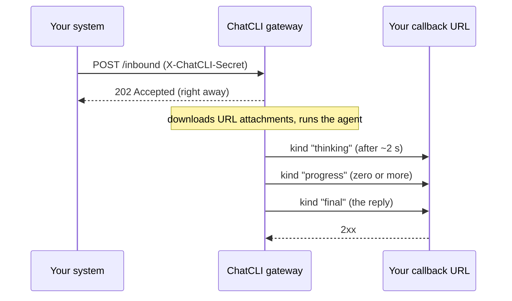

The generic webhook is the channel for everything else: an internal chat, a ticketing system, a CI job or a script. Your system **posts a JSON message** to the gateway, and the gateway **posts the replies back** to a callback URL you choose. Both directions carry the same shared secret.

| | Webhook |
| --- | --- |
| Transport | An HTTP endpoint the gateway serves, plus a callback URL it posts to |
| Who can talk to the agent | Callers that send the shared secret |
| Voice in | Yes, as base64 or a URL in the request |
| Voice replies | No (text only) |
| Images in | Yes, as base64 or a URL in the request |
| Images out | Yes, as base64 in the callback |
| "Working" signal | A short notice (`kind: "thinking"`) when the reply takes longer than about 2 seconds |
| Reply delivery | Retried, with an `X-ChatCLI-Delivery-ID` to drop duplicates |

## How it works



The request is answered `202` **before** any work starts: attachment downloads and the agent run happen afterwards. Everything the agent produces arrives at your callback URL, and the `kind` field says what each post is.

## Setup

<Steps>
  <Step title="Configure ChatCLI">
    ```bash
    export CHATCLI_WEBHOOK_ADDR=":8083"
    export CHATCLI_WEBHOOK_SECRET="a-long-random-string"
    export CHATCLI_WEBHOOK_CALLBACK_URL="https://your-app.example.com/chatcli/replies"
    # export CHATCLI_WEBHOOK_PATH="/inbound"   # the default
    ```

    Generate the secret with something like `openssl rand -hex 32`, and put the same lines in your `.env`.
  </Step>
  <Step title="Start the gateway">
    ```text
    /gateway start
    /gateway status     # webhook should be listed
    ```

    For a service manager or a container, `chatcli gateway` runs the same daemon in the foreground.
  </Step>
  <Step title="Run a callback receiver">
    Any endpoint that accepts a JSON `POST` will do. There is a ready-made [minimal receiver](#minimal-receiver) below.
  </Step>
  <Step title="Send a message">
    ```bash
    curl -X POST http://localhost:8083/inbound \
      -H "Content-Type: application/json" \
      -H "X-ChatCLI-Secret: a-long-random-string" \
      -d '{"chat_id": "ticket-42", "user_id": "alice", "text": "summarize the last deploy log"}'
    ```

    The gateway answers `202 Accepted` right away; the notice, the progress and the reply arrive at your callback URL.
  </Step>
</Steps>

## Environment variables

| Variable | Required | Default | What it does |
| --- | --- | --- | --- |
| `CHATCLI_WEBHOOK_ADDR` | yes | — | Endpoint address, for example `:8083`. The adapter starts when it is set. |
| `CHATCLI_WEBHOOK_SECRET` | yes, in practice | — | Shared secret checked on every request in `X-ChatCLI-Secret` and sent back on every callback. Without it **every request is refused** with `401`, and a warning is logged at start. |
| `CHATCLI_WEBHOOK_CALLBACK_URL` | yes, to get replies | — | Where the gateway posts the notice, the progress and the reply. Without it requests are still accepted and run, but **the replies are not delivered anywhere**, a warning is logged at start, and `@send webhook` fails naming what is missing. |
| `CHATCLI_WEBHOOK_PATH` | no | `/inbound` | Endpoint path. |
| `CHATCLI_WEBHOOK_HOME_CHANNEL` | no | — | `chat_id` used by [proactive messages](/gateway/proactive-messaging) sent with `@send webhook`. |

The shared settings (voice transcription, media limits, Conversation Hub) are on the [Chat gateway](/gateway/chat-gateway) page.

## The request

`POST` to `CHATCLI_WEBHOOK_PATH` with the `X-ChatCLI-Secret` header and a JSON body:

| Field | Required | Meaning |
| --- | --- | --- |
| `chat_id` | yes | Where the replies to this message are addressed: it comes back on every callback. |
| `user_id` | no | Who sent it. Without it, the sender is the `chat_id` itself. See [conversations and identity](#conversations-and-identity). |
| `text` | one of text, audio or image | The message. |
| `audio_b64` or `audio_url` | no | A voice message, as base64 or as a URL the gateway downloads. It is transcribed before the agent runs. |
| `audio_mime` | no | The audio MIME type, for example `audio/ogg`. |
| `image_b64` or `image_url` | no | An image, as base64 or as a URL the gateway downloads. |
| `image_mime` | no | The image MIME type, for example `image/png`. |

### Responses

Every refusal names its reason in a JSON body, for example `{"error": "missing_chat_id"}`:

| Status | `error` | When |
| --- | --- | --- |
| `202 Accepted` | — | The message joined the conversation's queue. |
| `400 Bad Request` | `invalid_json` | The body is not valid JSON. |
| `400 Bad Request` | `missing_chat_id` | `chat_id` is missing or empty. |
| `400 Bad Request` | `invalid_audio_b64` / `invalid_image_b64` | The base64 does not decode. |
| `400 Bad Request` | `empty_message` | There is no text, audio or image. |
| `401 Unauthorized` | `unauthorized` | The secret is missing or wrong, or `CHATCLI_WEBHOOK_SECRET` is not set. |
| `405 Method Not Allowed` | `method_not_allowed` | Anything other than `POST` (the response carries `Allow: POST`). |
| `413 Request Entity Too Large` | `payload_too_large` | The body is over the cap (see [limits](#limits)). |
| `429 Too Many Requests` | `queue_full` | 32 messages are already waiting in this conversation. Try again later. |
| `503 Service Unavailable` | `shutting_down` | The gateway is shutting down. |

Messages with the same `chat_id` reach the agent **in the order they were accepted**, even when one of them waits on an attachment download; different conversations do not wait on each other.

## The callbacks

For each message the gateway posts JSON to `CHATCLI_WEBHOOK_CALLBACK_URL`:

```json
{
  "chat_id": "ticket-42",
  "kind": "final",
  "text": "The last deploy finished in 4m12s; two warnings, no errors."
}
```

| `kind` | What it is | Attempts |
| --- | --- | --- |
| `thinking` | The "working" notice, when the reply takes longer than about 2 seconds. | 1 |
| `progress` | An update while the agent works (the plan, the tool running). Zero or more. | 1 |
| `final` | The reply. Always the last post for a message. | up to 3 |
| `proactive` | A message the agent started with [`@send`](#proactive-messages), with no request behind it. | up to 3 |

When the reply carries an image, the body also has `image_b64`, plus `image_mime` and `image_filename` when they are known.

Every callback carries these headers:

| Header | Value |
| --- | --- |
| `Content-Type` | `application/json` |
| `X-ChatCLI-Secret` | The same secret as the request. Check it before trusting the body. |
| `X-ChatCLI-Delivery-ID` | A random id, **the same on every attempt** of one post. |
| `X-ChatCLI-Delivery-Attempt` | `1`, `2` or `3`. |

### Delivery and retries

Any `2xx` answer counts as delivered. A `final` or `proactive` post is tried again when your endpoint fails in a transient way: a network error, `408`, `429` or `5xx`, waiting 1 s and then 3 s. Any other `4xx` is taken as your endpoint's answer and is not repeated. The notice and the progress updates get a single attempt, so a slow receiver never holds the agent back.

<Tip>
An attempt can reach your endpoint and still fail on the way back, so keep the `X-ChatCLI-Delivery-ID` values you have processed and skip repeats.
</Tip>

### Minimal receiver

<Tabs>
  <Tab title="Python">
    ```python
    import hmac, json, os
    from http.server import BaseHTTPRequestHandler, ThreadingHTTPServer

    SECRET = os.environ["CHATCLI_WEBHOOK_SECRET"].encode()
    seen = set()  # use an expiring store in production

    class Callback(BaseHTTPRequestHandler):
        def do_POST(self):
            if not hmac.compare_digest(self.headers.get("X-ChatCLI-Secret", "").encode(), SECRET):
                self.send_response(401); self.end_headers(); return
            body = json.loads(self.rfile.read(int(self.headers["Content-Length"])))
            delivery = self.headers.get("X-ChatCLI-Delivery-ID")
            if delivery not in seen:
                seen.add(delivery)
                if body.get("kind") == "final":
                    print(f"[{body['chat_id']}] reply: {body['text']}")
                else:
                    print(f"[{body['chat_id']}] {body.get('kind')}: {body['text']}")
            self.send_response(200); self.end_headers()

    ThreadingHTTPServer(("0.0.0.0", 8090), Callback).serve_forever()
    ```
  </Tab>
  <Tab title="Node.js">
    ```javascript
    import { createServer } from "node:http";
    import { timingSafeEqual } from "node:crypto";

    const secret = Buffer.from(process.env.CHATCLI_WEBHOOK_SECRET);
    const seen = new Set(); // use an expiring store in production

    createServer((req, res) => {
      const got = Buffer.from(req.headers["x-chatcli-secret"] ?? "");
      if (got.length !== secret.length || !timingSafeEqual(got, secret)) {
        res.writeHead(401).end();
        return;
      }
      let raw = "";
      req.on("data", (chunk) => (raw += chunk));
      req.on("end", () => {
        const body = JSON.parse(raw);
        const delivery = req.headers["x-chatcli-delivery-id"];
        if (!seen.has(delivery)) {
          seen.add(delivery);
          console.log(`[${body.chat_id}] ${body.kind}: ${body.text}`);
        }
        res.writeHead(200).end();
      });
    }).listen(8090);
    ```
  </Tab>
</Tabs>

## Conversations and identity

The `chat_id` says **where** the reply goes. **Which conversation** the agent continues is decided by the [Conversation Hub](/gateway/conversation-hub), from the sender:

<Tabs>
  <Tab title="Default (single-user)">
    Every sender shares **one conversation**, the same one as ChatCLI in your terminal and the other channels. A question asked in `ticket-42` shows up as context in a message to `ticket-99`.

    That is what you want when the webhook is just another way for **you** to talk to your agent.
  </Tab>
  <Tab title="Multi-user (CHATCLI_HUB_ISOLATE=true)">
    Each sender gets a conversation of its own, keyed by `user_id`. The same person in two different `chat_id`s continues the same conversation; different people never see each other's context. Long-term memory is kept per sender too.

    A request without `user_id` is attributed to its `chat_id`, so each anonymous conversation stays apart from the others.

    ```bash
    export CHATCLI_HUB_ISOLATE=true
    ```
  </Tab>
</Tabs>

<Warning>
If several people talk to the agent through this channel, as in a ticketing system, **set `CHATCLI_HUB_ISOLATE=true`** and send each person's `user_id`. By default everyone shares the same conversation.
</Warning>

To merge identities on purpose (you on the webhook and on Telegram, say), use the [Conversation Hub](/gateway/conversation-hub) bindings.

## Attachments

- `audio_b64` and `image_b64` are decoded on the spot: invalid base64 is refused with `400`.
- `audio_url` and `image_url` are downloaded **after** the `202`, by the gateway itself, up to the `CHATCLI_GATEWAY_MAX_AUDIO_BYTES` and `CHATCLI_GATEWAY_MAX_IMAGE_BYTES` caps (20 MB each by default).
- If a download fails, the message still runs and the agent is told, so the reply says the attachment did not arrive instead of answering as if nothing had been sent.

## Proactive messages

With `@send`, the agent posts to your callback on its own, with `kind: "proactive"`:

```text
<tool_call name="@send" args='{"cmd":"send","args":{"to":"webhook:ticket-42","message":"Deploy finished ✅"}}' />
```

`to: "webhook"` uses `CHATCLI_WEBHOOK_HOME_CHANNEL`; `webhook:<chat_id>` addresses any conversation, and everything after the first `:` becomes the `chat_id`. Without `CHATCLI_WEBHOOK_CALLBACK_URL`, the send fails naming what is missing. Details in [Proactive messages](/gateway/proactive-messaging).

## Security

<Warning>
Each message runs the agent with its tools and the shell, without confirmations. Treat the secret as a credential to the machine, and harden it with [safety mode](/security/overview).
</Warning>

- **Use a long, random secret**, and serve the endpoint and the callback over HTTPS when they are reachable from other machines.
- **Check `X-ChatCLI-Secret` in your receiver**, with a constant-time comparison, before trusting the body.
- `audio_url` and `image_url` are fetched by the gateway itself, so anyone holding the secret can make the gateway fetch a URL from its network.

## Limits

- A reply is cut at **3500 characters** and ends with `…`.
- The request body fits the largest audio and the largest image accepted, both base64-encoded, plus 1 MB: about 57 MB with the default caps. Past that, `413`.
- Up to 32 messages waiting per conversation; past that, `429`.
- Only text and images come back in the callback; voice replies are not sent on this channel.

## See also

<CardGroup cols={2}>
  <Card title="Chat gateway" icon="comments" href="/gateway/chat-gateway">
    How messages run, voice, images, continuity and the other channels.
  </Card>
  <Card title="Conversation Hub" icon="share-nodes" href="/gateway/conversation-hub">
    The shared conversation, per-sender isolation and bindings.
  </Card>
  <Card title="Proactive messages" icon="paper-plane" href="/gateway/proactive-messaging">
    Let the agent post to your callback on its own with `@send`.
  </Card>
  <Card title="Safety mode" icon="shield-halved" href="/security/overview">
    Limit what an agent without confirmations can do.
  </Card>
</CardGroup>
