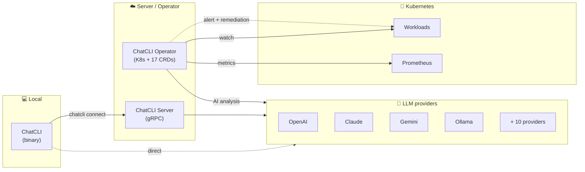

<div data-chatcli-banner="" className="chatcli-banner">
  <svg role="img" aria-label="ChatCLI" viewBox="-1.5 -1.5 321 63" className="chatcli-banner-art">
    <g className="cb-edges">
      <path d="M42 3.5 L46 3.5 L46 10" />
      <path d="M42 6.5 L44 6.5 L44 10" />
      <path d="M66 3.5 L70 3.5 L70 10" />
      <path d="M66 6.5 L68 6.5 L68 10" />
      <path d="M96 3.5 L100 3.5 L100 10" />
      <path d="M96 6.5 L98 6.5 L98 10" />
      <path d="M138 3.5 L142 3.5 L142 10" />
      <path d="M138 6.5 L140 6.5 L140 10" />
      <path d="M198 3.5 L202 3.5 L202 10" />
      <path d="M198 6.5 L200 6.5 L200 10" />
      <path d="M246 3.5 L250 3.5 L250 10" />
      <path d="M246 6.5 L248 6.5 L248 10" />
      <path d="M264 3.5 L268 3.5 L268 10" />
      <path d="M264 6.5 L266 6.5 L266 10" />
      <path d="M312 3.5 L316 3.5 L316 10" />
      <path d="M312 6.5 L314 6.5 L314 10" />
      <path d="M14 20 L14 13.5 L18 13.5" />
      <path d="M16 20 L16 16.5 L18 16.5" />
      <path d="M18 13.5 L24 13.5" />
      <path d="M18 16.5 L24 16.5" />
      <path d="M24 13.5 L30 13.5" />
      <path d="M24 16.5 L30 16.5" />
      <path d="M30 13.5 L36 13.5" />
      <path d="M30 16.5 L36 16.5" />
      <path d="M36 13.5 L42 13.5" />
      <path d="M36 16.5 L42 16.5" />
      <path d="M42 16.5 L46 16.5 L46 10" />
      <path d="M42 13.5 L44 13.5 L44 10" />
      <path d="M68 10 L68 20" />
      <path d="M70 10 L70 20" />
      <path d="M98 10 L98 20" />
      <path d="M100 10 L100 20" />
      <path d="M116 20 L116 13.5 L120 13.5" />
      <path d="M118 20 L118 16.5 L120 16.5" />
      <path d="M120 13.5 L126 13.5" />
      <path d="M120 16.5 L126 16.5" />
      <path d="M126 13.5 L132 13.5" />
      <path d="M126 16.5 L132 16.5" />
      <path d="M144 13.5 L148 13.5 L148 20" />
      <path d="M144 16.5 L146 16.5 L146 20" />
      <path d="M152 10 L152 16.5 L156 16.5" />
      <path d="M154 10 L154 13.5 L156 13.5" />
      <path d="M156 13.5 L162 13.5" />
      <path d="M156 16.5 L162 16.5" />
      <path d="M162 13.5 L168 13.5" />
      <path d="M162 16.5 L168 16.5" />
      <path d="M182 20 L182 13.5 L186 13.5" />
      <path d="M184 20 L184 16.5 L186 16.5" />
      <path d="M186 13.5 L192 13.5" />
      <path d="M186 16.5 L192 16.5" />
      <path d="M192 13.5 L198 13.5" />
      <path d="M192 16.5 L198 16.5" />
      <path d="M198 16.5 L202 16.5 L202 10" />
      <path d="M198 13.5 L200 13.5 L200 10" />
      <path d="M218 20 L218 13.5 L222 13.5" />
      <path d="M220 20 L220 16.5 L222 16.5" />
      <path d="M222 13.5 L228 13.5" />
      <path d="M222 16.5 L228 16.5" />
      <path d="M228 13.5 L234 13.5" />
      <path d="M228 16.5 L234 16.5" />
      <path d="M234 13.5 L240 13.5" />
      <path d="M234 16.5 L240 16.5" />
      <path d="M240 13.5 L246 13.5" />
      <path d="M240 16.5 L246 16.5" />
      <path d="M246 16.5 L250 16.5 L250 10" />
      <path d="M246 13.5 L248 13.5 L248 10" />
      <path d="M266 10 L266 20" />
      <path d="M268 10 L268 20" />
      <path d="M314 10 L314 20" />
      <path d="M316 10 L316 20" />
      <path d="M14 20 L14 30" />
      <path d="M16 20 L16 30" />
      <path d="M98 20 L98 30" />
      <path d="M100 20 L100 30" />
      <path d="M146 20 L146 30" />
      <path d="M148 20 L148 30" />
      <path d="M182 20 L182 30" />
      <path d="M184 20 L184 30" />
      <path d="M218 20 L218 30" />
      <path d="M220 20 L220 30" />
      <path d="M266 20 L266 30" />
      <path d="M268 20 L268 30" />
      <path d="M314 20 L314 30" />
      <path d="M316 20 L316 30" />
      <path d="M14 30 L14 40" />
      <path d="M16 30 L16 40" />
      <path d="M68 40 L68 33.5 L72 33.5" />
      <path d="M70 40 L70 36.5 L72 36.5" />
      <path d="M72 33.5 L78 33.5" />
      <path d="M72 36.5 L78 36.5" />
      <path d="M78 33.5 L84 33.5" />
      <path d="M78 36.5 L84 36.5" />
      <path d="M98 30 L98 40" />
      <path d="M100 30 L100 40" />
      <path d="M116 40 L116 33.5 L120 33.5" />
      <path d="M118 40 L118 36.5 L120 36.5" />
      <path d="M120 33.5 L126 33.5" />
      <path d="M120 36.5 L126 36.5" />
      <path d="M126 33.5 L132 33.5" />
      <path d="M126 36.5 L132 36.5" />
      <path d="M146 30 L146 40" />
      <path d="M148 30 L148 40" />
      <path d="M182 30 L182 40" />
      <path d="M184 30 L184 40" />
      <path d="M218 30 L218 40" />
      <path d="M220 30 L220 40" />
      <path d="M266 30 L266 40" />
      <path d="M268 30 L268 40" />
      <path d="M314 30 L314 40" />
      <path d="M316 30 L316 40" />
      <path d="M2 40 L2 46.5 L6 46.5" />
      <path d="M4 40 L4 43.5 L6 43.5" />
      <path d="M42 43.5 L46 43.5 L46 50" />
      <path d="M42 46.5 L44 46.5 L44 50" />
      <path d="M68 40 L68 50" />
      <path d="M70 40 L70 50" />
      <path d="M98 40 L98 50" />
      <path d="M100 40 L100 50" />
      <path d="M116 40 L116 50" />
      <path d="M118 40 L118 50" />
      <path d="M146 40 L146 50" />
      <path d="M148 40 L148 50" />
      <path d="M182 40 L182 50" />
      <path d="M184 40 L184 50" />
      <path d="M206 40 L206 46.5 L210 46.5" />
      <path d="M208 40 L208 43.5 L210 43.5" />
      <path d="M246 43.5 L250 43.5 L250 50" />
      <path d="M246 46.5 L248 46.5 L248 50" />
      <path d="M294 43.5 L298 43.5 L298 50" />
      <path d="M294 46.5 L296 46.5 L296 50" />
      <path d="M314 40 L314 50" />
      <path d="M316 40 L316 50" />
      <path d="M8 50 L8 56.5 L12 56.5" />
      <path d="M10 50 L10 53.5 L12 53.5" />
      <path d="M12 53.5 L18 53.5" />
      <path d="M12 56.5 L18 56.5" />
      <path d="M18 53.5 L24 53.5" />
      <path d="M18 56.5 L24 56.5" />
      <path d="M24 53.5 L30 53.5" />
      <path d="M24 56.5 L30 56.5" />
      <path d="M30 53.5 L36 53.5" />
      <path d="M30 56.5 L36 56.5" />
      <path d="M36 53.5 L42 53.5" />
      <path d="M36 56.5 L42 56.5" />
      <path d="M42 56.5 L46 56.5 L46 50" />
      <path d="M42 53.5 L44 53.5 L44 50" />
      <path d="M56 50 L56 56.5 L60 56.5" />
      <path d="M58 50 L58 53.5 L60 53.5" />
      <path d="M60 53.5 L66 53.5" />
      <path d="M60 56.5 L66 56.5" />
      <path d="M66 56.5 L70 56.5 L70 50" />
      <path d="M66 53.5 L68 53.5 L68 50" />
      <path d="M86 50 L86 56.5 L90 56.5" />
      <path d="M88 50 L88 53.5 L90 53.5" />
      <path d="M90 53.5 L96 53.5" />
      <path d="M90 56.5 L96 56.5" />
      <path d="M96 56.5 L100 56.5 L100 50" />
      <path d="M96 53.5 L98 53.5 L98 50" />
      <path d="M104 50 L104 56.5 L108 56.5" />
      <path d="M106 50 L106 53.5 L108 53.5" />
      <path d="M108 53.5 L114 53.5" />
      <path d="M108 56.5 L114 56.5" />
      <path d="M114 56.5 L118 56.5 L118 50" />
      <path d="M114 53.5 L116 53.5 L116 50" />
      <path d="M134 50 L134 56.5 L138 56.5" />
      <path d="M136 50 L136 53.5 L138 53.5" />
      <path d="M138 53.5 L144 53.5" />
      <path d="M138 56.5 L144 56.5" />
      <path d="M144 56.5 L148 56.5 L148 50" />
      <path d="M144 53.5 L146 53.5 L146 50" />
      <path d="M170 50 L170 56.5 L174 56.5" />
      <path d="M172 50 L172 53.5 L174 53.5" />
      <path d="M174 53.5 L180 53.5" />
      <path d="M174 56.5 L180 56.5" />
      <path d="M180 56.5 L184 56.5 L184 50" />
      <path d="M180 53.5 L182 53.5 L182 50" />
      <path d="M212 50 L212 56.5 L216 56.5" />
      <path d="M214 50 L214 53.5 L216 53.5" />
      <path d="M216 53.5 L222 53.5" />
      <path d="M216 56.5 L222 56.5" />
      <path d="M222 53.5 L228 53.5" />
      <path d="M222 56.5 L228 56.5" />
      <path d="M228 53.5 L234 53.5" />
      <path d="M228 56.5 L234 56.5" />
      <path d="M234 53.5 L240 53.5" />
      <path d="M234 56.5 L240 56.5" />
      <path d="M240 53.5 L246 53.5" />
      <path d="M240 56.5 L246 56.5" />
      <path d="M246 56.5 L250 56.5 L250 50" />
      <path d="M246 53.5 L248 53.5 L248 50" />
      <path d="M254 50 L254 56.5 L258 56.5" />
      <path d="M256 50 L256 53.5 L258 53.5" />
      <path d="M258 53.5 L264 53.5" />
      <path d="M258 56.5 L264 56.5" />
      <path d="M264 53.5 L270 53.5" />
      <path d="M264 56.5 L270 56.5" />
      <path d="M270 53.5 L276 53.5" />
      <path d="M270 56.5 L276 56.5" />
      <path d="M276 53.5 L282 53.5" />
      <path d="M276 56.5 L282 56.5" />
      <path d="M282 53.5 L288 53.5" />
      <path d="M282 56.5 L288 56.5" />
      <path d="M288 53.5 L294 53.5" />
      <path d="M288 56.5 L294 56.5" />
      <path d="M294 56.5 L298 56.5 L298 50" />
      <path d="M294 53.5 L296 53.5 L296 50" />
      <path d="M302 50 L302 56.5 L306 56.5" />
      <path d="M304 50 L304 53.5 L306 53.5" />
      <path d="M306 53.5 L312 53.5" />
      <path d="M306 56.5 L312 56.5" />
      <path d="M312 56.5 L316 56.5 L316 50" />
      <path d="M312 53.5 L314 53.5 L314 50" />
    </g>
    <g className="cb-fills">
      <rect x="5.95" y="-0.05" width="6.1" height="10.1" style={{fill: "color-mix(in oklch, var(--cb-a) 97%, var(--cb-b))"}} />
      <rect x="11.95" y="-0.05" width="6.1" height="10.1" style={{fill: "color-mix(in oklch, var(--cb-a) 93%, var(--cb-b))"}} />
      <rect x="17.95" y="-0.05" width="6.1" height="10.1" style={{fill: "color-mix(in oklch, var(--cb-a) 90%, var(--cb-b))"}} />
      <rect x="23.95" y="-0.05" width="6.1" height="10.1" style={{fill: "color-mix(in oklch, var(--cb-a) 86%, var(--cb-b))"}} />
      <rect x="29.95" y="-0.05" width="6.1" height="10.1" style={{fill: "color-mix(in oklch, var(--cb-a) 83%, var(--cb-b))"}} />
      <rect x="35.95" y="-0.05" width="6.1" height="10.1" style={{fill: "color-mix(in oklch, var(--cb-a) 79%, var(--cb-b))"}} />
      <rect x="53.95" y="-0.05" width="6.1" height="10.1" style={{fill: "color-mix(in oklch, var(--cb-a) 69%, var(--cb-b))"}} />
      <rect x="59.95" y="-0.05" width="6.1" height="10.1" style={{fill: "color-mix(in oklch, var(--cb-a) 65%, var(--cb-b))"}} />
      <rect x="83.95" y="-0.05" width="6.1" height="10.1" style={{fill: "color-mix(in oklch, var(--cb-a) 51%, var(--cb-b))"}} />
      <rect x="89.95" y="-0.05" width="6.1" height="10.1" style={{fill: "color-mix(in oklch, var(--cb-a) 48%, var(--cb-b))"}} />
      <rect x="107.95" y="-0.05" width="6.1" height="10.1" style={{fill: "color-mix(in oklch, var(--cb-a) 37%, var(--cb-b))"}} />
      <rect x="113.95" y="-0.05" width="6.1" height="10.1" style={{fill: "color-mix(in oklch, var(--cb-a) 34%, var(--cb-b))"}} />
      <rect x="119.95" y="-0.05" width="6.1" height="10.1" style={{fill: "color-mix(in oklch, var(--cb-a) 30%, var(--cb-b))"}} />
      <rect x="125.95" y="-0.05" width="6.1" height="10.1" style={{fill: "color-mix(in oklch, var(--cb-a) 27%, var(--cb-b))"}} />
      <rect x="131.95" y="-0.05" width="6.1" height="10.1" style={{fill: "color-mix(in oklch, var(--cb-a) 23%, var(--cb-b))"}} />
      <rect x="149.95" y="-0.05" width="6.1" height="10.1" style={{fill: "color-mix(in oklch, var(--cb-a) 13%, var(--cb-b))"}} />
      <rect x="155.95" y="-0.05" width="6.1" height="10.1" style={{fill: "color-mix(in oklch, var(--cb-a) 9%, var(--cb-b))"}} />
      <rect x="161.95" y="-0.05" width="6.1" height="10.1" style={{fill: "color-mix(in oklch, var(--cb-a) 6%, var(--cb-b))"}} />
      <rect x="167.95" y="-0.05" width="6.1" height="10.1" style={{fill: "color-mix(in oklch, var(--cb-a) 2%, var(--cb-b))"}} />
      <rect x="173.95" y="-0.05" width="6.1" height="10.1" style={{fill: "color-mix(in oklch, var(--cb-b) 98%, var(--cb-c))"}} />
      <rect x="179.95" y="-0.05" width="6.1" height="10.1" style={{fill: "color-mix(in oklch, var(--cb-b) 94%, var(--cb-c))"}} />
      <rect x="185.95" y="-0.05" width="6.1" height="10.1" style={{fill: "color-mix(in oklch, var(--cb-b) 90%, var(--cb-c))"}} />
      <rect x="191.95" y="-0.05" width="6.1" height="10.1" style={{fill: "color-mix(in oklch, var(--cb-b) 85%, var(--cb-c))"}} />
      <rect x="209.95" y="-0.05" width="6.1" height="10.1" style={{fill: "color-mix(in oklch, var(--cb-b) 73%, var(--cb-c))"}} />
      <rect x="215.95" y="-0.05" width="6.1" height="10.1" style={{fill: "color-mix(in oklch, var(--cb-b) 68%, var(--cb-c))"}} />
      <rect x="221.95" y="-0.05" width="6.1" height="10.1" style={{fill: "color-mix(in oklch, var(--cb-b) 64%, var(--cb-c))"}} />
      <rect x="227.95" y="-0.05" width="6.1" height="10.1" style={{fill: "color-mix(in oklch, var(--cb-b) 60%, var(--cb-c))"}} />
      <rect x="233.95" y="-0.05" width="6.1" height="10.1" style={{fill: "color-mix(in oklch, var(--cb-b) 56%, var(--cb-c))"}} />
      <rect x="239.95" y="-0.05" width="6.1" height="10.1" style={{fill: "color-mix(in oklch, var(--cb-b) 51%, var(--cb-c))"}} />
      <rect x="251.95" y="-0.05" width="6.1" height="10.1" style={{fill: "color-mix(in oklch, var(--cb-b) 43%, var(--cb-c))"}} />
      <rect x="257.95" y="-0.05" width="6.1" height="10.1" style={{fill: "color-mix(in oklch, var(--cb-b) 38%, var(--cb-c))"}} />
      <rect x="299.95" y="-0.05" width="6.1" height="10.1" style={{fill: "color-mix(in oklch, var(--cb-b) 9%, var(--cb-c))"}} />
      <rect x="305.95" y="-0.05" width="6.1" height="10.1" style={{fill: "color-mix(in oklch, var(--cb-b) 4%, var(--cb-c))"}} />
      <rect x="-0.05" y="9.95" width="6.1" height="10.1" style={{fill: "color-mix(in oklch, var(--cb-a) 100%, var(--cb-b))"}} />
      <rect x="5.95" y="9.95" width="6.1" height="10.1" style={{fill: "color-mix(in oklch, var(--cb-a) 97%, var(--cb-b))"}} />
      <rect x="53.95" y="9.95" width="6.1" height="10.1" style={{fill: "color-mix(in oklch, var(--cb-a) 69%, var(--cb-b))"}} />
      <rect x="59.95" y="9.95" width="6.1" height="10.1" style={{fill: "color-mix(in oklch, var(--cb-a) 65%, var(--cb-b))"}} />
      <rect x="83.95" y="9.95" width="6.1" height="10.1" style={{fill: "color-mix(in oklch, var(--cb-a) 51%, var(--cb-b))"}} />
      <rect x="89.95" y="9.95" width="6.1" height="10.1" style={{fill: "color-mix(in oklch, var(--cb-a) 48%, var(--cb-b))"}} />
      <rect x="101.95" y="9.95" width="6.1" height="10.1" style={{fill: "color-mix(in oklch, var(--cb-a) 41%, var(--cb-b))"}} />
      <rect x="107.95" y="9.95" width="6.1" height="10.1" style={{fill: "color-mix(in oklch, var(--cb-a) 37%, var(--cb-b))"}} />
      <rect x="131.95" y="9.95" width="6.1" height="10.1" style={{fill: "color-mix(in oklch, var(--cb-a) 23%, var(--cb-b))"}} />
      <rect x="137.95" y="9.95" width="6.1" height="10.1" style={{fill: "color-mix(in oklch, var(--cb-a) 20%, var(--cb-b))"}} />
      <rect x="167.95" y="9.95" width="6.1" height="10.1" style={{fill: "color-mix(in oklch, var(--cb-a) 2%, var(--cb-b))"}} />
      <rect x="173.95" y="9.95" width="6.1" height="10.1" style={{fill: "color-mix(in oklch, var(--cb-b) 98%, var(--cb-c))"}} />
      <rect x="203.95" y="9.95" width="6.1" height="10.1" style={{fill: "color-mix(in oklch, var(--cb-b) 77%, var(--cb-c))"}} />
      <rect x="209.95" y="9.95" width="6.1" height="10.1" style={{fill: "color-mix(in oklch, var(--cb-b) 73%, var(--cb-c))"}} />
      <rect x="251.95" y="9.95" width="6.1" height="10.1" style={{fill: "color-mix(in oklch, var(--cb-b) 43%, var(--cb-c))"}} />
      <rect x="257.95" y="9.95" width="6.1" height="10.1" style={{fill: "color-mix(in oklch, var(--cb-b) 38%, var(--cb-c))"}} />
      <rect x="299.95" y="9.95" width="6.1" height="10.1" style={{fill: "color-mix(in oklch, var(--cb-b) 9%, var(--cb-c))"}} />
      <rect x="305.95" y="9.95" width="6.1" height="10.1" style={{fill: "color-mix(in oklch, var(--cb-b) 4%, var(--cb-c))"}} />
      <rect x="-0.05" y="19.95" width="6.1" height="10.1" style={{fill: "color-mix(in oklch, var(--cb-a) 100%, var(--cb-b))"}} />
      <rect x="5.95" y="19.95" width="6.1" height="10.1" style={{fill: "color-mix(in oklch, var(--cb-a) 97%, var(--cb-b))"}} />
      <rect x="53.95" y="19.95" width="6.1" height="10.1" style={{fill: "color-mix(in oklch, var(--cb-a) 69%, var(--cb-b))"}} />
      <rect x="59.95" y="19.95" width="6.1" height="10.1" style={{fill: "color-mix(in oklch, var(--cb-a) 65%, var(--cb-b))"}} />
      <rect x="65.95" y="19.95" width="6.1" height="10.1" style={{fill: "color-mix(in oklch, var(--cb-a) 62%, var(--cb-b))"}} />
      <rect x="71.95" y="19.95" width="6.1" height="10.1" style={{fill: "color-mix(in oklch, var(--cb-a) 58%, var(--cb-b))"}} />
      <rect x="77.95" y="19.95" width="6.1" height="10.1" style={{fill: "color-mix(in oklch, var(--cb-a) 55%, var(--cb-b))"}} />
      <rect x="83.95" y="19.95" width="6.1" height="10.1" style={{fill: "color-mix(in oklch, var(--cb-a) 51%, var(--cb-b))"}} />
      <rect x="89.95" y="19.95" width="6.1" height="10.1" style={{fill: "color-mix(in oklch, var(--cb-a) 48%, var(--cb-b))"}} />
      <rect x="101.95" y="19.95" width="6.1" height="10.1" style={{fill: "color-mix(in oklch, var(--cb-a) 41%, var(--cb-b))"}} />
      <rect x="107.95" y="19.95" width="6.1" height="10.1" style={{fill: "color-mix(in oklch, var(--cb-a) 37%, var(--cb-b))"}} />
      <rect x="113.95" y="19.95" width="6.1" height="10.1" style={{fill: "color-mix(in oklch, var(--cb-a) 34%, var(--cb-b))"}} />
      <rect x="119.95" y="19.95" width="6.1" height="10.1" style={{fill: "color-mix(in oklch, var(--cb-a) 30%, var(--cb-b))"}} />
      <rect x="125.95" y="19.95" width="6.1" height="10.1" style={{fill: "color-mix(in oklch, var(--cb-a) 27%, var(--cb-b))"}} />
      <rect x="131.95" y="19.95" width="6.1" height="10.1" style={{fill: "color-mix(in oklch, var(--cb-a) 23%, var(--cb-b))"}} />
      <rect x="137.95" y="19.95" width="6.1" height="10.1" style={{fill: "color-mix(in oklch, var(--cb-a) 20%, var(--cb-b))"}} />
      <rect x="167.95" y="19.95" width="6.1" height="10.1" style={{fill: "color-mix(in oklch, var(--cb-a) 2%, var(--cb-b))"}} />
      <rect x="173.95" y="19.95" width="6.1" height="10.1" style={{fill: "color-mix(in oklch, var(--cb-b) 98%, var(--cb-c))"}} />
      <rect x="203.95" y="19.95" width="6.1" height="10.1" style={{fill: "color-mix(in oklch, var(--cb-b) 77%, var(--cb-c))"}} />
      <rect x="209.95" y="19.95" width="6.1" height="10.1" style={{fill: "color-mix(in oklch, var(--cb-b) 73%, var(--cb-c))"}} />
      <rect x="251.95" y="19.95" width="6.1" height="10.1" style={{fill: "color-mix(in oklch, var(--cb-b) 43%, var(--cb-c))"}} />
      <rect x="257.95" y="19.95" width="6.1" height="10.1" style={{fill: "color-mix(in oklch, var(--cb-b) 38%, var(--cb-c))"}} />
      <rect x="299.95" y="19.95" width="6.1" height="10.1" style={{fill: "color-mix(in oklch, var(--cb-b) 9%, var(--cb-c))"}} />
      <rect x="305.95" y="19.95" width="6.1" height="10.1" style={{fill: "color-mix(in oklch, var(--cb-b) 4%, var(--cb-c))"}} />
      <rect x="-0.05" y="29.95" width="6.1" height="10.1" style={{fill: "color-mix(in oklch, var(--cb-a) 100%, var(--cb-b))"}} />
      <rect x="5.95" y="29.95" width="6.1" height="10.1" style={{fill: "color-mix(in oklch, var(--cb-a) 97%, var(--cb-b))"}} />
      <rect x="53.95" y="29.95" width="6.1" height="10.1" style={{fill: "color-mix(in oklch, var(--cb-a) 69%, var(--cb-b))"}} />
      <rect x="59.95" y="29.95" width="6.1" height="10.1" style={{fill: "color-mix(in oklch, var(--cb-a) 65%, var(--cb-b))"}} />
      <rect x="83.95" y="29.95" width="6.1" height="10.1" style={{fill: "color-mix(in oklch, var(--cb-a) 51%, var(--cb-b))"}} />
      <rect x="89.95" y="29.95" width="6.1" height="10.1" style={{fill: "color-mix(in oklch, var(--cb-a) 48%, var(--cb-b))"}} />
      <rect x="101.95" y="29.95" width="6.1" height="10.1" style={{fill: "color-mix(in oklch, var(--cb-a) 41%, var(--cb-b))"}} />
      <rect x="107.95" y="29.95" width="6.1" height="10.1" style={{fill: "color-mix(in oklch, var(--cb-a) 37%, var(--cb-b))"}} />
      <rect x="131.95" y="29.95" width="6.1" height="10.1" style={{fill: "color-mix(in oklch, var(--cb-a) 23%, var(--cb-b))"}} />
      <rect x="137.95" y="29.95" width="6.1" height="10.1" style={{fill: "color-mix(in oklch, var(--cb-a) 20%, var(--cb-b))"}} />
      <rect x="167.95" y="29.95" width="6.1" height="10.1" style={{fill: "color-mix(in oklch, var(--cb-a) 2%, var(--cb-b))"}} />
      <rect x="173.95" y="29.95" width="6.1" height="10.1" style={{fill: "color-mix(in oklch, var(--cb-b) 98%, var(--cb-c))"}} />
      <rect x="203.95" y="29.95" width="6.1" height="10.1" style={{fill: "color-mix(in oklch, var(--cb-b) 77%, var(--cb-c))"}} />
      <rect x="209.95" y="29.95" width="6.1" height="10.1" style={{fill: "color-mix(in oklch, var(--cb-b) 73%, var(--cb-c))"}} />
      <rect x="251.95" y="29.95" width="6.1" height="10.1" style={{fill: "color-mix(in oklch, var(--cb-b) 43%, var(--cb-c))"}} />
      <rect x="257.95" y="29.95" width="6.1" height="10.1" style={{fill: "color-mix(in oklch, var(--cb-b) 38%, var(--cb-c))"}} />
      <rect x="299.95" y="29.95" width="6.1" height="10.1" style={{fill: "color-mix(in oklch, var(--cb-b) 9%, var(--cb-c))"}} />
      <rect x="305.95" y="29.95" width="6.1" height="10.1" style={{fill: "color-mix(in oklch, var(--cb-b) 4%, var(--cb-c))"}} />
      <rect x="5.95" y="39.95" width="6.1" height="10.1" style={{fill: "color-mix(in oklch, var(--cb-a) 97%, var(--cb-b))"}} />
      <rect x="11.95" y="39.95" width="6.1" height="10.1" style={{fill: "color-mix(in oklch, var(--cb-a) 93%, var(--cb-b))"}} />
      <rect x="17.95" y="39.95" width="6.1" height="10.1" style={{fill: "color-mix(in oklch, var(--cb-a) 90%, var(--cb-b))"}} />
      <rect x="23.95" y="39.95" width="6.1" height="10.1" style={{fill: "color-mix(in oklch, var(--cb-a) 86%, var(--cb-b))"}} />
      <rect x="29.95" y="39.95" width="6.1" height="10.1" style={{fill: "color-mix(in oklch, var(--cb-a) 83%, var(--cb-b))"}} />
      <rect x="35.95" y="39.95" width="6.1" height="10.1" style={{fill: "color-mix(in oklch, var(--cb-a) 79%, var(--cb-b))"}} />
      <rect x="53.95" y="39.95" width="6.1" height="10.1" style={{fill: "color-mix(in oklch, var(--cb-a) 69%, var(--cb-b))"}} />
      <rect x="59.95" y="39.95" width="6.1" height="10.1" style={{fill: "color-mix(in oklch, var(--cb-a) 65%, var(--cb-b))"}} />
      <rect x="83.95" y="39.95" width="6.1" height="10.1" style={{fill: "color-mix(in oklch, var(--cb-a) 51%, var(--cb-b))"}} />
      <rect x="89.95" y="39.95" width="6.1" height="10.1" style={{fill: "color-mix(in oklch, var(--cb-a) 48%, var(--cb-b))"}} />
      <rect x="101.95" y="39.95" width="6.1" height="10.1" style={{fill: "color-mix(in oklch, var(--cb-a) 41%, var(--cb-b))"}} />
      <rect x="107.95" y="39.95" width="6.1" height="10.1" style={{fill: "color-mix(in oklch, var(--cb-a) 37%, var(--cb-b))"}} />
      <rect x="131.95" y="39.95" width="6.1" height="10.1" style={{fill: "color-mix(in oklch, var(--cb-a) 23%, var(--cb-b))"}} />
      <rect x="137.95" y="39.95" width="6.1" height="10.1" style={{fill: "color-mix(in oklch, var(--cb-a) 20%, var(--cb-b))"}} />
      <rect x="167.95" y="39.95" width="6.1" height="10.1" style={{fill: "color-mix(in oklch, var(--cb-a) 2%, var(--cb-b))"}} />
      <rect x="173.95" y="39.95" width="6.1" height="10.1" style={{fill: "color-mix(in oklch, var(--cb-b) 98%, var(--cb-c))"}} />
      <rect x="209.95" y="39.95" width="6.1" height="10.1" style={{fill: "color-mix(in oklch, var(--cb-b) 73%, var(--cb-c))"}} />
      <rect x="215.95" y="39.95" width="6.1" height="10.1" style={{fill: "color-mix(in oklch, var(--cb-b) 68%, var(--cb-c))"}} />
      <rect x="221.95" y="39.95" width="6.1" height="10.1" style={{fill: "color-mix(in oklch, var(--cb-b) 64%, var(--cb-c))"}} />
      <rect x="227.95" y="39.95" width="6.1" height="10.1" style={{fill: "color-mix(in oklch, var(--cb-b) 60%, var(--cb-c))"}} />
      <rect x="233.95" y="39.95" width="6.1" height="10.1" style={{fill: "color-mix(in oklch, var(--cb-b) 56%, var(--cb-c))"}} />
      <rect x="239.95" y="39.95" width="6.1" height="10.1" style={{fill: "color-mix(in oklch, var(--cb-b) 51%, var(--cb-c))"}} />
      <rect x="251.95" y="39.95" width="6.1" height="10.1" style={{fill: "color-mix(in oklch, var(--cb-b) 43%, var(--cb-c))"}} />
      <rect x="257.95" y="39.95" width="6.1" height="10.1" style={{fill: "color-mix(in oklch, var(--cb-b) 38%, var(--cb-c))"}} />
      <rect x="263.95" y="39.95" width="6.1" height="10.1" style={{fill: "color-mix(in oklch, var(--cb-b) 34%, var(--cb-c))"}} />
      <rect x="269.95" y="39.95" width="6.1" height="10.1" style={{fill: "color-mix(in oklch, var(--cb-b) 30%, var(--cb-c))"}} />
      <rect x="275.95" y="39.95" width="6.1" height="10.1" style={{fill: "color-mix(in oklch, var(--cb-b) 26%, var(--cb-c))"}} />
      <rect x="281.95" y="39.95" width="6.1" height="10.1" style={{fill: "color-mix(in oklch, var(--cb-b) 21%, var(--cb-c))"}} />
      <rect x="287.95" y="39.95" width="6.1" height="10.1" style={{fill: "color-mix(in oklch, var(--cb-b) 17%, var(--cb-c))"}} />
      <rect x="299.95" y="39.95" width="6.1" height="10.1" style={{fill: "color-mix(in oklch, var(--cb-b) 9%, var(--cb-c))"}} />
      <rect x="305.95" y="39.95" width="6.1" height="10.1" style={{fill: "color-mix(in oklch, var(--cb-b) 4%, var(--cb-c))"}} />
    </g>
  </svg>
</div>
<div className="cb-prompt" aria-hidden="true"><span className="cb-prompt-sign">$</span> chatcli<span className="cb-cursor" /></div>

<p className="chatcli-banner-tagline"><strong>Your terminal becomes an AI engineer.</strong><br />Fourteen providers, coder mode, agents, a gRPC server and a Kubernetes operator: one Go binary.</p>

{/* release-strip:start */}
<a className="cc-release" href="/releases/1.214.0"><span className="cc-release-label">New release</span><span className="cc-release-version">v1.214.0</span><span className="cc-release-summary">chatcli eval, an offline evaluation harness; generate /help and chatcli ‑‑help from one command registry</span><span className="cc-release-cta">Read release notes →</span></a>
{/* release-strip:end */}

<div className="cc-entry">
<CardGroup cols={4}>
  <Card title="Quickstart" icon="rocket" href="/start/quickstart">
    Install ChatCLI, connect a provider and chat in under five minutes.
  </Card>
  <Card title="Coder mode" icon="code" href="/usage/coder-mode">
    {'/coder'} reads, edits, runs tests and rolls back, in a loop you approve.
  </Card>
  <Card title="Agents and harness" icon="robot" href="/agents/harness/overview">
    Multi-agent squads, task graphs and seven reliability patterns.
  </Card>
  <Card title="Server and Kubernetes" icon="dharmachakra" href="/server/server-mode">
    Share providers with a team over gRPC and run AIOps in your clusters.
  </Card>
</CardGroup>
</div>

## Quick start

<Steps>
  <Step title="Install ChatCLI">
    <Tabs>
      <Tab title="Homebrew">
        ```bash
        brew tap diillson/chatcli && brew install chatcli
        ```
      </Tab>
      <Tab title="go install">
        ```bash
        go install github.com/diillson/chatcli@latest
        ```
      </Tab>
      <Tab title="Docker">
        ```bash
        docker pull ghcr.io/diillson/chatcli:latest
        ```
      </Tab>
      <Tab title="Binary">
        Download the binary for your platform from [Releases](https://github.com/diillson/chatcli/releases), then:

        ```bash
        chmod +x chatcli && sudo mv chatcli /usr/local/bin/
        ```
      </Tab>
    </Tabs>

    Every install path, including Helm, building from source and OAuth logins, is on the [Installation](/start/installation) page.
  </Step>
  <Step title="Configure a provider">
    <CodeGroup>
    ```bash OpenAI
    echo 'LLM_PROVIDER=OPENAI' > .env
    echo 'OPENAI_API_KEY=sk-xxx' >> .env
    ```

    ```bash Claude
    echo 'LLM_PROVIDER=CLAUDEAI' > .env
    echo 'ANTHROPIC_API_KEY=sk-ant-xxx' >> .env
    ```

    ```bash Gemini
    echo 'LLM_PROVIDER=GOOGLEAI' > .env
    echo 'GOOGLEAI_API_KEY=AIza...' >> .env
    ```

    ```bash Ollama (local)
    echo 'LLM_PROVIDER=OLLAMA' > .env
    echo 'OLLAMA_BASE_URL=http://localhost:11434' >> .env
    echo 'OLLAMA_MODEL=llama3.1' >> .env
    ```

    ```bash OpenRouter
    echo 'LLM_PROVIDER=OPENROUTER' > .env
    echo 'OPENROUTER_API_KEY=sk-or-xxx' >> .env
    ```
    </CodeGroup>

    Each provider has a default model; set `<PROVIDER>_MODEL` to pick another, or use `/switch` at runtime. Have a ChatGPT, Claude or Copilot plan? Skip the key and run `/auth login <provider>` inside ChatCLI. All fourteen providers are in [Supported models](/providers/supported-models).
  </Step>
  <Step title="Start chatting">
    ```bash
    chatcli
    ```

    You are talking to an LLM in your terminal, with your project's context one `@` away. Next, try [coder mode](/usage/coder-mode).
  </Step>
</Steps>

## See it in action

<Frame caption="One prompt, real work: /coder runs the failing tests, reads the code, patches the bug and re-runs go test uncached to prove the fix — live, on Claude Sonnet 5.5">
  <video autoPlay muted loop playsInline poster="/images/chatcli-demo-poster.png" src="/images/chatcli-demo.mp4" aria-label="ChatCLI coder mode fixing a failing Go test end to end" />
</Frame>

In practice, your everyday terminal turns into this:

```console
$ chatcli

› @git  write the commit message from the staged diff
  ⮑  feat(api): add pagination to the /users endpoint

› /agent  fix the failing test in ./cli/plugins
  ⮑  plan: run tests → locate the failure → edit → re-verify ✓

› @diagram gomod root=. output=~/arch.svg
  ⮑  Diagram rendered → ~/arch.svg (SVG, 245 KB)
```

## Browse the docs

<CardGroup cols={3}>
  <Card title="Get started" icon="rocket" href="/start/quickstart">
    Quickstart, installation, Docker and Kubernetes, updates.
  </Card>
  <Card title="Using ChatCLI" icon="terminal" href="/usage/basic-usage">
    The prompt, `@` context, agent and coder modes, one-shot runs.
  </Card>
  <Card title="Coder" icon="code" href="/coder/coder-plugin">
    The `@coder` tool, atomic tools, permissions, worktrees, LSP.
  </Card>
  <Card title="Agents" icon="robot" href="/agents/multi-agent-orchestration">
    Multi-agent, squads, task graphs, personas and the quality harness.
  </Card>
  <Card title="Context & memory" icon="layer-group" href="/context/persistent-context">
    Persistent context, knowledge bases, memory, sessions, token efficiency.
  </Card>
  <Card title="Models & providers" icon="shuffle" href="/providers/supported-models">
    Fourteen providers, OAuth, Bedrock, fallback, rate limits and cost.
  </Card>
  <Card title="Tools" icon="toolbox" href="/tools/web-tools">
    Web search, browser, API explorer, Git forges, images, diagrams, scheduler.
  </Card>
  <Card title="Extensions" icon="plug" href="/extensions/plugin-system">
    Plugins, MCP servers, skills, slash commands and hooks.
  </Card>
  <Card title="Channels & gateway" icon="comments" href="/gateway/chat-gateway">
    ChatCLI on Telegram, Slack, Discord and WhatsApp, with voice replies.
  </Card>
  <Card title="Server & IDE" icon="server" href="/server/server-mode">
    The gRPC server, remote connections, MCP server and ACP for editors.
  </Card>
  <Card title="Kubernetes & AIOps" icon="dharmachakra" href="/kubernetes/k8s-operator">
    K8s watcher, the AIOps operator, incidents, SLOs and remediation.
  </Card>
  <Card title="Security" icon="shield-halved" href="/security/overview">
    Enterprise security controls and dependency vulnerability scans.
  </Card>
  <Card title="Cookbook" icon="kitchen-set" href="/cookbook/agent-refactoring">
    Step-by-step recipes for refactoring, debugging, pipelines and AIOps.
  </Card>
  <Card title="Reference" icon="rectangle-list" href="/reference/command-reference">
    Commands, environment variables, configuration and the REST API.
  </Card>
  <Card title="Releases" icon="tag" href="/releases">
    Release notes for every version, with links to the changes.
  </Card>
</CardGroup>

## What is ChatCLI?

**ChatCLI** brings the leading large language models (LLMs) straight into your shell. It understands your project's context, edits code, runs commands and automates complex tasks, without you ever leaving the command line. A single **Go** binary: fast, portable and self-contained.

<CardGroup cols={4}>
  <Card title="14 providers" icon="shuffle">
    OpenAI, Claude, Gemini, Grok, Ollama and more — in a single interface.
  </Card>
  <Card title="350+ models" icon="layer-group">
    One unified catalog. Switch model at any time.
  </Card>
  <Card title="37+ native tools" icon="wand-magic-sparkles">
    `@coder`, `@lsp`, `@proc`, `@http`, `@api-explorer`, `@knowledge`, `@memory` and many more.
  </Card>
  <Card title="7 quality patterns" icon="sparkles">
    ReAct · Reflexion · CoVe · RAG+HyDE · Self-Refine…
  </Card>
</CardGroup>

<Tip>
The **CLI is the main product** — it works 100% locally, no server required. The server and operator are optional for team and Kubernetes scenarios. All versions are published automatically on every release via GitHub Actions. Check the full history on [Releases](/releases) or [ArtifactHub](https://artifacthub.io/packages/search?repo=chatcli).
</Tip>

**Who is it for?**

- **Developers**: debug code, understand codebases, generate tests, refactor and document, all without leaving the terminal.
- **DevOps and SREs**: analyze K8s logs, automate deploys, diagnose incidents with AI and monitor clusters.
- **CLI enthusiasts**: supercharge your terminal, create powerful aliases and explore new ways to work with AI.
- **DBAs and data engineers**: automate repetitive tasks, analyze queries, manage databases and data pipelines.

**What does it replace?**

- **Endless copy and paste**: no more `cat file.js`, selecting, copying, opening the browser and pasting. Use `@file` right in the terminal.
- **Generic commits**: `@git` plus a question gives a commit message based on the actual diff.
- **Intimidating log analysis**: pipe straight to the AI with `cat error.log | chatcli -p "root cause?"`.
- **A steep learning curve**: `@file ./src --mode smart` and ask "how does auth work?", and onboarding takes minutes.

## How it works

ChatCLI ships as three artifacts that **work standalone or together**: the local CLI, the gRPC server, and the Kubernetes operator. Use just the CLI on your terminal, or set up a full topology with server + operator for teams and production environments.



## Key capabilities

<CardGroup cols={3}>
  <Card title="Agent mode" icon="robot" href="/usage/agent-mode">
    Delegate tasks with {'/agent'}: the AI plans, executes with your approval and self-corrects, with built-in safety against dangerous actions.
  </Card>
  <Card title="Coder mode" icon="code" href="/usage/coder-mode">
    Software engineering with {'/coder'}: reads, edits, applies patches and runs tests in a loop with automatic rollback.
  </Card>
  <Card title="Quality harness" icon="sparkles" href="/agents/harness/overview">
    7 reliability patterns (ReAct, Reflexion, CoVe, RAG+HyDE, Self-Refine…) opt-in via `/config quality`.
  </Card>
  <Card title="Atomic tools" icon="wand-magic-sparkles" href="/coder/atomic-tools">
    {'@read'}, {'@search'}, {'@tree'} narrow read-only + {'@todo'} (TodoWrite parity) + {'@coder multipatch'} transactional. Architectural parity with Claude Code.
  </Card>
  <Card title="Smart context" icon="eye" href="/usage/context-commands">
    Inject context with {'@file'}, {'@git'}, {'@command'}, {'@env'}, and {'@history'}. Your environment straight into the AI prompt.
  </Card>
  <Card title="Multiagente" icon="network-wired" href="/agents/multi-agent-orchestration">
    14 built-in specialist agents (File, Coder, Shell, Git, Search, Planner, Reviewer, Tester...) in parallel.
  </Card>
  <Card title="Agent squad" icon="people-group" href="/agents/agent-squad">
    Live run observability, shared kanban board, agent-to-agent mail, and an autonomous plan → develop → review → deliver playbook.
  </Card>
  <Card title="Customizable agents" icon="user-gear" href="/agents/customizable-agents">
    Create personas with reusable skills in Markdown. Version-controlled with Git, shareable across teams.
  </Card>
  <Card title="K8s watcher and AIOps" icon="dharmachakra" href="/kubernetes/k8s-watcher">
    Monitor K8s workloads in real time. Operator with 17 CRDs, 54+ remediation actions, log analysis, and metrics.
  </Card>
  <Card title="Durable scheduler" icon="calendar" href="/tools/scheduler">
    Cron, wait-until, DAG, and daemon mode. Jobs survive CLI restarts. Agents schedule their own follow-ups.
  </Card>
  <Card title="Conversation control" icon="clock-rotate-left" href="/usage/conversation-control">
    {'/compact'} compacts history preserving what matters. {'/rewind'} and Esc+Esc go back to any point.
  </Card>
  <Card title="Hooks and web tools" icon="webhook" href="/extensions/hooks-system">
    Lifecycle hooks (pre/post tool, session start/end), native WebFetch and WebSearch to enrich context.
  </Card>
</CardGroup>

## Current versions

<CardGroup cols={2}>
  <Card title="ChatCLI (client)" icon="terminal" href="/start/installation">
    **1.214.0** — The binary you install and use in your terminal. Interactive mode, agent, coder, smart context, and remote server connection. <br />
    `brew install chatcli` · `go install` · [binary](https://github.com/diillson/chatcli/releases)
  </Card>
  <Card title="gRPC server" icon="server" href="/server/server-mode">
    **1.214.0** — Centralized deployment for teams. Clients connect via `chatcli connect` and share LLM providers, sessions, and plugins. <br />
    `ghcr.io/diillson/chatcli:1.214.0`
  </Card>
  <Card title="AIOps operator" icon="dharmachakra" href="/kubernetes/k8s-operator">
    **1.214.0** — Autonomous incident detection, AI-powered analysis, and automated remediation for Kubernetes clusters. 17 CRDs, 54+ actions. <br />
    `ghcr.io/diillson/chatcli-operator:1.214.0`
  </Card>
  <Card title="Helm charts" icon="cube" href="/kubernetes/artifacthub">
    **1.214.0** — Distributed via ArtifactHub and OCI registry on GHCR. <br />
    `oci://ghcr.io/diillson/charts/chatcli` <br />
    `oci://ghcr.io/diillson/charts/chatcli-operator`
  </Card>
</CardGroup>
