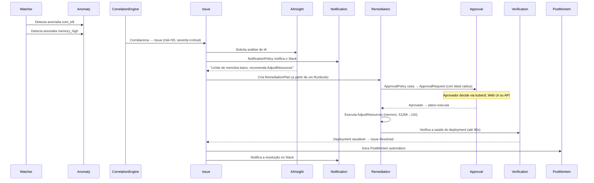

Este cookbook mostra o fluxo completo de um incidente na plataforma AIOps do ChatCLI — desde a detecção automática até o post-mortem com lições aprendidas. Nomes, horários e valores abaixo são ilustrativos; os nomes dos objetos seguem os padrões que o operator realmente usa.

<Note>
  O passo a passo assume um operator instalado pelo chart Helm em `chatcli-system`, uma Instance pronta com o watcher habilitado (o pipeline AIOps fala com a primeira Instance pronta do cluster, então rode uma por cluster), uma ApprovalPolicy que exige aprovação para esta mudança e uma NotificationPolicy que encaminha o Issue para o Slack. Anomalies, Issues, AIInsights, RemediationPlans, ApprovalRequests e PostMortems são criados no **namespace do workload** (`production` aqui), não no namespace do operator.
</Note>

## Anatomia de um Incidente




## Cenário: OOMKill em Produção

### 1. Detecção Automática

O Watcher detecta que pods do `payment-service` estão sendo OOMKilled:

```bash
# Verificar anomalias detectadas
kubectl get anomalies -n production
```

```
NAME                                            SOURCE    SIGNAL        CORRELATED   AGE
watcher-oomkilled-payment-service-1773933600    watcher   oom_kill      true         2m
watcher-memoryhigh-payment-service-1773933610   watcher   memory_high   true         110s
```

### 2. Issue Criado

O CorrelationEngine agrupa em um Issue as anomalias não correlacionadas do mesmo recurso nos últimos 10 minutos. O risk score é a soma dos pesos dos sinais (`oom_kill` 40 + `memory_high` 15 = 55), e um Issue aberto por uma anomalia `oom_kill` é sempre `critical`:

```bash
kubectl get issues -n production
```

```
NAME                                  SEVERITY   STATE       RISK   AGE
payment-service-oom-kill-1773933601   critical   Analyzing   55     90s
```

<Accordion title="Ver detalhes do Issue">
```bash
kubectl get issue payment-service-oom-kill-1773933601 -o yaml -n production
```

```yaml
metadata:
  labels:
    platform.chatcli.io/inc-id: INC-20260319-001
    platform.chatcli.io/resource: payment-service
    platform.chatcli.io/signal: oom_kill
spec:
  severity: critical
  source: watcher
  signalType: oom_kill
  resource:
    kind: Deployment
    name: payment-service
    namespace: production
  description: "Auto-detected oom_kill anomaly: container app OOMKilled (value=container app OOMKilled, threshold=normal)"
  riskScore: 55
status:
  state: Analyzing
  detectedAt: "2026-03-19T15:20:01Z"
  remediationAttempts: 0
  maxRemediationAttempts: 5
```

O incident ID `INC-YYYYMMDD-NNN` é um label (uma sequência por namespace e por dia); o nome do Issue é `<recurso>-<sinal>-<unix time>`.
</Accordion>

### 3. Notificação Enviada

O NotificationReconciler compara o Issue com as suas NotificationPolicies e o envia aos canais delas (Slack, PagerDuty, Opsgenie, email, webhook ou Teams). Canais, roteamento, throttling e escalação estão em [Notificações](/pt/features/aiops/notifications). Sem NotificationPolicy, nada é enviado.

### 4. IA Analisa o Problema

```bash
kubectl get aiinsight payment-service-oom-kill-1773933601-insight -o yaml -n production
```

```yaml
status:
  analysis: |
    O deployment payment-service está sofrendo OOMKill repetido.
    Container principal usando 490Mi de 512Mi de limite. Memória insuficiente
    para picos de carga. A revisão 12 (atual) introduziu cache em memória
    que aumentou o consumo base em ~100Mi em relação à revisão 11.
  confidence: 0.88
  recommendations:
    - "Aumentar o limite de memória para 1Gi e o request para 768Mi"
    - "Considerar rollback para a revisão 11 se o aumento não resolver"
  suggestedActions:
    - name: "Aumentar memória"
      action: "AdjustResources"
      description: "Pod está sendo OOMKilled, aumentar o limite de memória"
      params:
        memory_limit: "1Gi"
        memory_request: "768Mi"
```

O IssueReconciler transforma as ações sugeridas em um Runbook (`auto-oom-kill-critical-deployment-<hash>`), a menos que já exista um Runbook correspondente, e cria o RemediationPlan `payment-service-oom-kill-1773933601-plan-1`.

### 5. Aprovação Necessária

Antes de executar, o RemediationReconciler consulta as ApprovalPolicies. Aqui uma política exige aprovação para mudanças de recursos em produção, então o plano espera em `WaitingApproval`:

```bash
kubectl get approvalrequests -n production
```

```
NAME                                                  ISSUE                                 PLAN                                         STATE     RULE
approval-payment-service-oom-kill-1773933601-plan-1   payment-service-oom-kill-1773933601   payment-service-oom-kill-1773933601-plan-1   Pending   quorum-production
```

<Note>
  Mesmo sem ApprovalPolicy casando, o plano ainda pode ficar retido: pelo [tier do cluster](/pt/features/aiops/federation) (quando `CHATCLI_OPERATOR_CLUSTER_NAME` aponta para um ClusterRegistration cujo tier exige aprovação) ou pelo [decision engine](/pt/features/aiops/decision-engine) opt-in, que nunca executa sozinho um Issue `critical`. Essas solicitações usam as políticas sintéticas `cluster-tier` e `decision-engine`: um aprovador, timeout de 30 minutos.
</Note>

**Opção A — Aprovar via kubectl:**

```bash
kubectl annotate approvalrequest approval-payment-service-oom-kill-1773933601-plan-1 \
  -n production \
  "platform.chatcli.io/approve=oncall-sre:OOM confirmado"
```

O valor é `aprovador:motivo`. O operator acrescenta a decisão em `status.decisions` e remove a annotation; uma regra de quorum precisa de uma annotation por aprovador até atingir `requiredApprovers`. Use `platform.chatcli.io/reject` para rejeitar.

**Opção B — Aprovar via Web Dashboard:**

Faça port-forward do Service do operator (`kubectl -n chatcli-system port-forward svc/chatcli-operator 8090:8090`), abra `http://localhost:8090`, informe uma API key com papel `operator`, vá em Approvals, digite seu nome e clique em Approve.

**Opção C — Aprovar via REST API:**

```bash
curl -X POST "http://localhost:8090/api/v1/approvals/approval-payment-service-oom-kill-1773933601-plan-1/approve?namespace=production" \
  -H "X-API-Key: $CHATCLI_API_KEY" \
  -H "Content-Type: application/json" \
  -d '{"approver": "oncall-sre", "reason": "Confiança da análise 0.88, OOM confirmado nos logs"}'
```

<Note>
  As três opções registram uma decisão em `status.decisions`; o operator então aplica a regra (quorum, change window) e leva a solicitação a `Approved` ou `Rejected`. O dashboard e a REST gravam o aprovador como `<nome> (api-key: <identidade>)` e contam cada API key uma vez no quorum, então cada aprovador precisa da própria chave. Uma solicitação que não está mais pendente, ou que a mesma chave já decidiu, responde `409`.
</Note>

### 6. Remediação Executada

Após a aprovação, o RemediationReconciler executa:

```bash
kubectl get remediationplans -n production
```

```
NAME                                         ISSUE                                 ATTEMPT   STATE       AGE
payment-service-oom-kill-1773933601-plan-1   payment-service-oom-kill-1773933601   1         Verifying   30s
```

O controller:
1. **Captura um `ResourceSnapshot` estruturado** (replicas, imagens, requests+limits de CPU/memória, HPA min/max)
2. Cria um `ActionCheckpoint` antes de cada ação
3. Aplica `AdjustResources` (memória 512Mi → 1Gi)
4. Verifica a saúde do deployment por até 90s
5. Saudável (`readyReplicas >= desired`) → **Completed**

<Tip>
**Proteção automática:** se a ação falha (ex.: memory_limit inválido), o operator **restaura o recurso para o estado do snapshot** (replicas, imagens, recursos). O plano vai para `RolledBack` em vez de `Failed`. Se a verificação expira (90s sem saúde), o rollback também é executado. O campo `postFailureHealthy` confirma se o recurso voltou ao normal. Um plano falho ou revertido devolve o Issue para re-análise da IA com a evidência da falha, até atingir `maxRemediationAttempts` e o Issue escalar.
</Tip>

### 7. Issue Resolvido

```bash
kubectl get issues -n production
```

```
NAME                                  SEVERITY   STATE      RISK   AGE
payment-service-oom-kill-1773933601   critical   Resolved   55     8m
```

- A NotificationPolicy envia a resolução para o Slack
- O Pattern Store (ConfigMap `chatcli-pattern-store` em `production`) registra um sucesso para `oom_kill + Deployment + critical`
- As entradas de dedup do watcher para o recurso são limpas, e novas anomalias no mesmo recurso ficam suprimidas durante o cooldown de resolução (10 minutos por padrão, Instance `spec.aiops.resolutionCooldownMinutes`; `0` desliga)

### 8. PostMortem Automático

Todo plano concluído gera um PostMortem chamado `pm-<issue>`:

```bash
kubectl get postmortems -n production
```

```
NAME                                     ISSUE                                 SEVERITY   STATE   AGE
pm-payment-service-oom-kill-1773933601   payment-service-oom-kill-1773933601   critical   Open    5m
```

<Accordion title="Ver PostMortem completo">
```bash
kubectl get pm pm-payment-service-oom-kill-1773933601 -o yaml -n production
```

```yaml
status:
  state: Open
  summary: "Pods do payment-service com OOMKill por limite de memória insuficiente após o deploy da feature de cache"
  rootCause: "A revisão 12 introduziu cache em memória, aumentando a memória base em ~100Mi e excedendo o limite de 512Mi"
  impact: "Processamento de pagamentos degradado por ~8 minutos, 3 pods afetados"
  timeline:
    - timestamp: "2026-03-19T15:20:01Z"
      type: detected
      detail: "Auto-detected oom_kill anomaly: container app OOMKilled (value=container app OOMKilled, threshold=normal)"
    - timestamp: "2026-03-19T15:22:00Z"
      type: action_executed
      detail: "AdjustResources: Action AdjustResources executed"
    - timestamp: "2026-03-19T15:23:31Z"
      type: resolved
      detail: "Remediation verified: Deployment production/payment-service is healthy"
  lessonsLearned:
    - "Limites de memória devem ser revisados após features que introduzem cache"
    - "Monitorar tendências de memória antes de deploys com mudanças de arquitetura"
  preventionActions:
    - "Adicionar teste de capacidade de memória ao pipeline de CI/CD"
    - "Criar SLO de uso de memória para o payment-service"
  duration: "3m30s"
```

A timeline começa com um evento `detected` (a descrição do Issue), tem um evento por ação do plano, `action_executed` quando deu certo e `action_failed` quando falhou (em planos agênticos, o passo cuja observação falhou) e termina com `resolved` (o resultado do plano).
</Accordion>

### 9. Revisão e Fechamento

Os dois endpoints exigem o papel `operator`; o corpo (`reviewer`, `notes`) é opcional. Informe o namespace: sem `?namespace=`, esses endpoints de PostMortem procuram em `default`.

```bash
# Marcar como em revisão
curl -X POST "http://localhost:8090/api/v1/postmortems/pm-payment-service-oom-kill-1773933601/review?namespace=production" \
  -H "X-API-Key: $CHATCLI_API_KEY" \
  -H "Content-Type: application/json" \
  -d '{"reviewer": "oncall-sre", "notes": "Limites revisados"}'

# Após revisão do time
curl -X POST "http://localhost:8090/api/v1/postmortems/pm-payment-service-oom-kill-1773933601/close?namespace=production" \
  -H "X-API-Key: $CHATCLI_API_KEY"
```

Se a remediação apenas conteve o problema (Issue `Contained`, PostMortem com `requiresHumanAction: true`), reconheça primeiro a ação pendente com `POST /api/v1/postmortems/{name}/ack-human-action`: um PostMortem fechado sem esse reconhecimento volta para `Open`.


## Operação do Dia a Dia

### Monitorar via CLI

```bash
# Issues ativos
kubectl get issues -A --sort-by='.metadata.creationTimestamp'

# Status dos SLOs
kubectl get slo -A

# Aprovações pendentes (field selectors de custom resources não filtram por status)
kubectl get approvalrequests -A | grep Pending

# Trilha de auditoria
kubectl get auditevents -A --sort-by='.spec.timestamp' | tail -20

# Experimentos de chaos
kubectl get chaos -A
```

### Monitorar via API

```bash
kubectl -n chatcli-system port-forward svc/chatcli-operator 8090:8090 &
export CHATCLI_API_KEY=<uma chave do Secret chatcli-operator-secrets>

# Resumo do dashboard
curl -s -H "X-API-Key: $CHATCLI_API_KEY" http://localhost:8090/api/v1/analytics/summary | jq

# Recursos mais problemáticos
curl -s -H "X-API-Key: $CHATCLI_API_KEY" http://localhost:8090/api/v1/analytics/top-resources | jq

# MTTR por dia em uma janela (from/to em RFC 3339)
curl -s -H "X-API-Key: $CHATCLI_API_KEY" \
  "http://localhost:8090/api/v1/analytics/mttr?from=2026-03-12T00:00:00Z&to=2026-03-19T00:00:00Z" | jq

# Export de auditoria para SIEM (JSON)
curl -s -H "X-API-Key: $CHATCLI_API_KEY" http://localhost:8090/api/v1/audit/export > audit-$(date +%Y%m%d).json
```

A API REST permite 600 requisições por minuto por API key válida (30 por minuto por host de cliente sem chave); scripts que fazem polling devem ficar abaixo disso.

### Runbooks Customizados

```yaml
apiVersion: platform.chatcli.io/v1alpha1
kind: Runbook
metadata:
  name: restart-on-memory-leak
  namespace: production
spec:
  description: "Reinicia o deployment quando detectar memory leak"
  trigger:
    signalType: memory_high
    severity: medium
    resourceKind: Deployment
  steps:
    - name: "Reiniciar pods"
      action: RestartDeployment
      description: "Rolling restart para liberar a memória vazada"
  maxAttempts: 2
```

Runbooks casam por severidade + tipo de recurso (e por tipo de sinal, preferido quando bate). O operator busca Runbooks em todos os namespaces, então um Runbook vale para Issues correspondentes no cluster inteiro.


## Métricas Importantes

| Métrica | O que Monitorar | Alertar Quando |
|---------|-----------------|----------------|
| `chatcli_operator_active_issues` | Issues não resolvidos | &gt; 5 |
| `chatcli_operator_slo_error_budget_remaining` | Error budget restante (fração 0–1) | &lt; 0.25 |
| `chatcli_operator_sla_compliance_percentage` | Compliance de SLA | &lt; 99 |
| `chatcli_operator_slo_burn_rate{window="1h"}` | Burn rate rápido | &gt; 14.4 |
| `chatcli_operator_remediations_total{result="failed"}` | Ações de remediação falhando | &gt; 3/hora |
| `chatcli_operator_notifications_failed_total` | Notificações falhando | &gt; 0 |
| `chatcli_operator_approvals_total{result="expired"}` | Aprovações expirando | &gt; 0 |

<Tip>
Configure alertas no Prometheus/Grafana para essas métricas. Os arquivos JSON de dashboard em `deploy/grafana/` têm painéis para elas; o `dashboards-configmap.yaml` de lá traz só os ServiceMonitors, e o comentário do cabeçalho dele tem os comandos exatos que montam o ConfigMap a partir dos quatro arquivos (um `--from-file` por JSON e depois o label `grafana_dashboard=1`), ou importe os JSONs manualmente.
</Tip>
